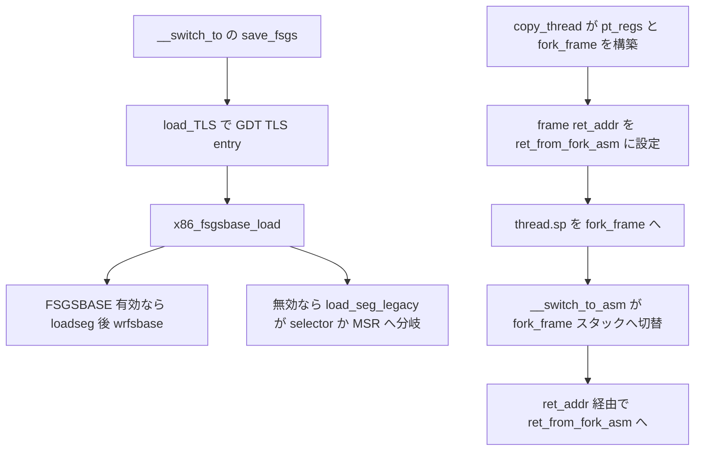

# 第22章 FS と GS と TLS と copy_thread

> 本章で読むソース
>
> - [`arch/x86/kernel/process_64.c` L275-L291](https://github.com/gregkh/linux/blob/v6.18.38/arch/x86/kernel/process_64.c#L275-L291)
> - [`arch/x86/kernel/process_64.c` L319-L367](https://github.com/gregkh/linux/blob/v6.18.38/arch/x86/kernel/process_64.c#L319-L367)
> - [`arch/x86/kernel/process_64.c` L392-L411](https://github.com/gregkh/linux/blob/v6.18.38/arch/x86/kernel/process_64.c#L392-L411)
> - [`arch/x86/kernel/process.c` L105-L115](https://github.com/gregkh/linux/blob/v6.18.38/arch/x86/kernel/process.c#L105-L115)
> - [`arch/x86/kernel/process.c` L141-L149](https://github.com/gregkh/linux/blob/v6.18.38/arch/x86/kernel/process.c#L141-L149)
> - [`arch/x86/kernel/process.c` L170-L273](https://github.com/gregkh/linux/blob/v6.18.38/arch/x86/kernel/process.c#L170-L273)
> - [`arch/x86/include/asm/switch_to.h` L23-L47](https://github.com/gregkh/linux/blob/v6.18.38/arch/x86/include/asm/switch_to.h#L23-L47)
> - [`arch/x86/entry/entry_64.S` L228-L260](https://github.com/gregkh/linux/blob/v6.18.38/arch/x86/entry/entry_64.S#L228-L260)

## この章の狙い

コンテキストスイッチ時の FS/GS base 切替と TLS の設定経路を区別する。
`copy_thread` が fork 後のスタックと return address をどう組み立てるかを、ret_from_fork_asm への実際の入り方まで追う。

## 前提

[第21章](21-switch-to.md) で `__switch_to` が `save_fsgs`、`load_TLS`、`x86_fsgsbase_load` をこの順で呼ぶことを読んでいること。
[第2章](../part00-foundation/02-gdt-tss-cpu-entry-area.md) で GDT とセグメント記述子の基礎を把握していること。

## FS/GS の保存と x86_fsgsbase_load

`save_fsgs` は selector を `thread_struct` へ退避し、FSGSBASE 有効時は `rdfsbase` と `__rdgsbase_inactive` で base を読む。
ユーザーの GS base は inactive 側、すなわち kernel GS base として扱われる。

[`arch/x86/kernel/process_64.c` L275-L291](https://github.com/gregkh/linux/blob/v6.18.38/arch/x86/kernel/process_64.c#L275-L291)

```c
static __always_inline void save_fsgs(struct task_struct *task)
{
	savesegment(fs, task->thread.fsindex);
	savesegment(gs, task->thread.gsindex);
	if (static_cpu_has(X86_FEATURE_FSGSBASE)) {
		/*
		 * If FSGSBASE is enabled, we can't make any useful guesses
		 * about the base, and user code expects us to save the current
		 * value.  Fortunately, reading the base directly is efficient.
		 */
		task->thread.fsbase = rdfsbase();
		task->thread.gsbase = __rdgsbase_inactive();
	} else {
		save_base_legacy(task, task->thread.fsindex, FS);
		save_base_legacy(task, task->thread.gsindex, GS);
	}
}
```

`x86_fsgsbase_load` は FSGSBASE 有効時、selector が変わり得る場合に先に `loadseg` し、その後 `wrfsbase` と `__wrgsbase_inactive` で base を更新する。

[`arch/x86/kernel/process_64.c` L392-L411](https://github.com/gregkh/linux/blob/v6.18.38/arch/x86/kernel/process_64.c#L392-L411)

```c
static __always_inline void x86_fsgsbase_load(struct thread_struct *prev,
					      struct thread_struct *next)
{
	if (static_cpu_has(X86_FEATURE_FSGSBASE)) {
		/* Update the FS and GS selectors if they could have changed. */
		if (unlikely(prev->fsindex || next->fsindex))
			loadseg(FS, next->fsindex);
		if (unlikely(prev->gsindex || next->gsindex))
			loadseg(GS, next->gsindex);

		/* Update the bases. */
		wrfsbase(next->fsbase);
		__wrgsbase_inactive(next->gsbase);
	} else {
		load_seg_legacy(prev->fsindex, prev->fsbase,
				next->fsindex, next->fsbase, FS);
		load_seg_legacy(prev->gsindex, prev->gsbase,
				next->gsindex, next->gsbase, GS);
	}
}
```

FSGSBASE 無効時の `load_seg_legacy` は単純な MSR 書き込みではない。
`next_index <= 3` の 64 ビット TLS や未使用セグメントでは selector load だけで済ませる場合があり、base が非ゼロなら selector 変更後に `MSR_FS_BASE` または `MSR_KERNEL_GS_BASE` を書く。
`next_index > 3` の実セグメントでは selector load だけで足りる。

[`arch/x86/kernel/process_64.c` L319-L367](https://github.com/gregkh/linux/blob/v6.18.38/arch/x86/kernel/process_64.c#L319-L367)

```c
static __always_inline void load_seg_legacy(unsigned short prev_index,
					    unsigned long prev_base,
					    unsigned short next_index,
					    unsigned long next_base,
					    enum which_selector which)
{
	if (likely(next_index <= 3)) {
		// ... (中略) ...
		if (next_base == 0) {
			// ... (中略) ...
				if (likely(prev_index | next_index | prev_base))
					loadseg(which, next_index);
		} else {
			if (prev_index != next_index)
				loadseg(which, next_index);
			wrmsrq(which == FS ? MSR_FS_BASE : MSR_KERNEL_GS_BASE,
			       next_base);
		}
	} else {
		/*
		 * The next task is using a real segment.  Loading the selector
		 * is sufficient.
		 */
		loadseg(which, next_index);
	}
}
```

## native 64 ビット TLS と compat の GDT entry

`CLONE_SETTLS` は `set_new_tls` 経由で設定される。
ia32 syscall 中は `do_set_thread_area` が GDT の TLS entry を更新する compat 経路であり、native 64 ビットは `do_set_thread_area_64` の `ARCH_SET_FS` で FS base を直接設定する。

[`arch/x86/kernel/process.c` L141-L149](https://github.com/gregkh/linux/blob/v6.18.38/arch/x86/kernel/process.c#L141-L149)

```c
static int set_new_tls(struct task_struct *p, unsigned long tls)
{
	struct user_desc __user *utls = (struct user_desc __user *)tls;

	if (in_ia32_syscall())
		return do_set_thread_area(p, -1, utls, 0);
	else
		return do_set_thread_area_64(p, ARCH_SET_FS, tls);
}
```

GDT の `tls_array` は主に ia32 compat の selector ベース TLS 用である。
native 64 ビットの thread-local アクセスは FS base が担い、compat は selector と GDT entry の組み合わせになる。

## copy_thread と fork 後のスタック

`arch_dup_task_struct` は `task_struct` 本体をコピーし、FPU は `fpu_clone` が別途初期化する。

[`arch/x86/kernel/process.c` L105-L115](https://github.com/gregkh/linux/blob/v6.18.38/arch/x86/kernel/process.c#L105-L115)

```c
int arch_dup_task_struct(struct task_struct *dst, struct task_struct *src)
{
	/* fpu_clone() will initialize the "dst_fpu" memory */
	memcpy_and_pad(dst, arch_task_struct_size, src, sizeof(*dst), 0);

#ifdef CONFIG_VM86
	dst->thread.vm86 = NULL;
#endif

	return 0;
}
```

`copy_thread` は子の `pt_regs` を親からコピーし、`fork_frame` 上の `inactive_task_frame` に return address を置く。
`p->thread.sp` は `fork_frame` を指し、`thread.sp` 自体を `ret_from_fork_asm` へ向けるのではない。

[`arch/x86/include/asm/switch_to.h` L44-L47](https://github.com/gregkh/linux/blob/v6.18.38/arch/x86/include/asm/switch_to.h#L44-L47)

```c
struct fork_frame {
	struct inactive_task_frame frame;
	struct pt_regs regs;
};
```

[`arch/x86/kernel/process.c` L170-L273](https://github.com/gregkh/linux/blob/v6.18.38/arch/x86/kernel/process.c#L170-L273)

```c
int copy_thread(struct task_struct *p, const struct kernel_clone_args *args)
{
	u64 clone_flags = args->flags;
	unsigned long sp = args->stack;
	unsigned long tls = args->tls;
	struct inactive_task_frame *frame;
	struct fork_frame *fork_frame;
	struct pt_regs *childregs;
	// ... (中略) ...
	childregs = task_pt_regs(p);
	fork_frame = container_of(childregs, struct fork_frame, regs);
	frame = &fork_frame->frame;

	frame->bp = encode_frame_pointer(childregs);
	frame->ret_addr = (unsigned long) ret_from_fork_asm;
	p->thread.sp = (unsigned long) fork_frame;
	// ... (中略) ...
	fpu_clone(p, clone_flags, args->fn, new_ssp);

	/* Kernel thread ? */
	if (unlikely(p->flags & PF_KTHREAD)) {
		p->thread.pkru = pkru_get_init_value();
		memset(childregs, 0, sizeof(struct pt_regs));
		kthread_frame_init(frame, args->fn, args->fn_arg);
		return 0;
	}
	// ... (中略) ...
	*childregs = *current_pt_regs();
	childregs->ax = 0;
	if (sp)
		childregs->sp = sp;
	// ... (中略) ...
	if (clone_flags & CLONE_SETTLS)
		ret = set_new_tls(p, tls);
	// ... (中略) ...
	return ret;
}
```

`__switch_to_asm` が `thread.sp` のスタックへ切り替え、callee-saved を pop したあと、`inactive_task_frame.ret_addr` により `ret_from_fork_asm` へ入る。
`ret_from_fork_asm` は `ret_from_fork` を呼び、ユーザースレッドなら `swapgs_restore_regs_and_return_to_usermode` へ jmp する。

[`arch/x86/entry/entry_64.S` L228-L260](https://github.com/gregkh/linux/blob/v6.18.38/arch/x86/entry/entry_64.S#L228-L260)

```asm
SYM_CODE_START(ret_from_fork_asm)
	// ... (中略) ...
	movq	%rax, %rdi		/* prev */
	movq	%rsp, %rsi		/* regs */
	movq	%rbx, %rdx		/* fn */
	movq	%r12, %rcx		/* fn_arg */
	call	ret_from_fork
	// ... (中略) ...
	jmp	swapgs_restore_regs_and_return_to_usermode
SYM_CODE_END(ret_from_fork_asm)
```

カーネルスレッドは `kthread_frame_init` で `frame->bx` と `frame->r12` に関数と引数を載せ、`ret_from_fork` 内で `fn(fn_arg)` が呼ばれる。

## 処理フロー



## 高速化と最適化の工夫

FSGSBASE 命令は FS/GS base を MSR 書き込みなしに更新でき、コンテキストスイッチごとの MSR アクセスを避けられる。

`load_seg_legacy` は prev と next がともにゼロなら segment load を省略するなど、selector と base の組み合わせに応じた分岐で不要なロードを省く。

compat では GDT の TLS entry をセレクタロードだけで参照でき、thread-local 領域へ到達できる。

## まとめ

- FSGSBASE 有効時は selector 変更のあと wrfsbase と __wrgsbase_inactive で base を切り替える。
- FSGSBASE 無効時は load_seg_legacy が selector load か MSR 書き込みへ分岐する。
- native 64 ビットの CLONE_SETTLS は ARCH_SET_FS で FS base を設定する。
- GDT TLS entry は主に ia32 compat の selector ベース TLS 用である。
- copy_thread は fork_frame と ret_addr により ret_from_fork_asm へ入る経路を組み立てる。

## 関連する章

- [__switch_to_asm と __switch_to](21-switch-to.md)
- [GDT と TSS とセグメント記述子と cpu_entry_area](../part00-foundation/02-gdt-tss-cpu-entry-area.md)
- [FPU と SIMD XSAVE と条件付き復元](23-fpu-xsave.md)
