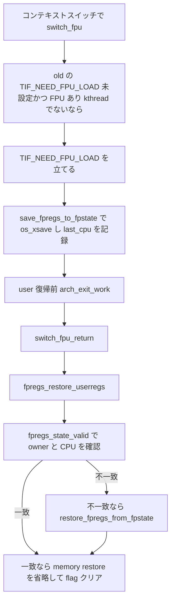

# 第23章 FPU と SIMD XSAVE と条件付き復元

> 本章で読むソース
>
> - [`arch/x86/include/asm/fpu/sched.h` L32-L53](https://github.com/gregkh/linux/blob/v6.18.38/arch/x86/include/asm/fpu/sched.h#L32-L53)
> - [`arch/x86/kernel/fpu/core.c` L140-L159](https://github.com/gregkh/linux/blob/v6.18.38/arch/x86/kernel/fpu/core.c#L140-L159)
> - [`arch/x86/kernel/fpu/core.c` L879-L885](https://github.com/gregkh/linux/blob/v6.18.38/arch/x86/kernel/fpu/core.c#L879-L885)
> - [`arch/x86/kernel/fpu/context.h` L36-L80](https://github.com/gregkh/linux/blob/v6.18.38/arch/x86/kernel/fpu/context.h#L36-L80)
> - [`arch/x86/include/asm/entry-common.h` L48-L58](https://github.com/gregkh/linux/blob/v6.18.38/arch/x86/include/asm/entry-common.h#L48-L58)
> - [`arch/x86/include/asm/fpu/types.h` L333-L343](https://github.com/gregkh/linux/blob/v6.18.38/arch/x86/include/asm/fpu/types.h#L333-L343)
> - [`arch/x86/kernel/fpu/xstate.c` L172-L198](https://github.com/gregkh/linux/blob/v6.18.38/arch/x86/kernel/fpu/xstate.c#L172-L198)
> - [`arch/x86/kernel/fpu/xstate.c` L589-L607](https://github.com/gregkh/linux/blob/v6.18.38/arch/x86/kernel/fpu/xstate.c#L589-L607)

## この章の狙い

FPU と SIMD 状態が XSAVE 系命令で `fpstate` へ保存復元される仕組みを追う。
`TIF_NEED_FPU_LOAD` による条件付き復元と、compacted XSAVE format の意味を実装どおりに区別する。

## 前提

[第21章](21-switch-to.md) で `__switch_to` が最初に `switch_fpu` を呼ぶことを読んでいること。
古典的な device-not-available 例外による lazy FPU switching とは、本版の user 復帰経路が異なる点に注意する。

## switch_fpu と save_fpregs_to_fpstate

コンテキストスイッチ時、`switch_fpu` は old タスクの `TIF_NEED_FPU_LOAD` が未設定で CPU に FPU があり old タスクが `PF_KTHREAD` と `PF_USER_WORKER` のどちらでもない場合に、先に `set_tsk_thread_flag` で flag を立て、その後 `save_fpregs_to_fpstate` でレジスタを `fpstate` へ退避し、last_cpu を記録する。
`last_cpu` に現在 CPU を記録し、同一 CPU へ user 復帰するときの restore 省略判定に使う。

[`arch/x86/include/asm/fpu/sched.h` L32-L53](https://github.com/gregkh/linux/blob/v6.18.38/arch/x86/include/asm/fpu/sched.h#L32-L53)

```c
static inline void switch_fpu(struct task_struct *old, int cpu)
{
	if (!test_tsk_thread_flag(old, TIF_NEED_FPU_LOAD) &&
	    cpu_feature_enabled(X86_FEATURE_FPU) &&
	    !(old->flags & (PF_KTHREAD | PF_USER_WORKER))) {
		struct fpu *old_fpu = x86_task_fpu(old);

		set_tsk_thread_flag(old, TIF_NEED_FPU_LOAD);
		save_fpregs_to_fpstate(old_fpu);
		/*
		 * The save operation preserved register state, so the
		 * fpu_fpregs_owner_ctx is still @old_fpu. Store the
		 * current CPU number in @old_fpu, so the next return
		 * to user space can avoid the FPU register restore
		 * when is returns on the same CPU and still owns the
		 * context. See fpregs_restore_userregs().
		 */
		old_fpu->last_cpu = cpu;

		trace_x86_fpu_regs_deactivated(old_fpu);
	}
}
```

`save_fpregs_to_fpstate` は XSAVE 対応 CPU では `os_xsave` を使い、FXSAVE や FNSAVE へフォールバックする。

[`arch/x86/kernel/fpu/core.c` L140-L159](https://github.com/gregkh/linux/blob/v6.18.38/arch/x86/kernel/fpu/core.c#L140-L159)

```c
void save_fpregs_to_fpstate(struct fpu *fpu)
{
	if (likely(use_xsave())) {
		os_xsave(fpu->fpstate);
		update_avx_timestamp(fpu);
		return;
	}

	if (likely(use_fxsr())) {
		fxsave(&fpu->fpstate->regs.fxsave);
		return;
	}

	/*
	 * Legacy FPU register saving, FNSAVE always clears FPU registers,
	 * so we have to reload them from the memory state.
	 */
	asm volatile("fnsave %[fp]; fwait" : [fp] "=m" (fpu->fpstate->regs.fsave));
	frstor(&fpu->fpstate->regs.fsave);
}
```

## 条件付き復元と fpregs_restore_userregs

user 復帰前の `arch_exit_to_user_mode_prepare` は `arch_exit_work` を経て、`TIF_NEED_FPU_LOAD` が立っていれば `switch_fpu_return` を呼ぶ。

[`arch/x86/include/asm/entry-common.h` L48-L58](https://github.com/gregkh/linux/blob/v6.18.38/arch/x86/include/asm/entry-common.h#L48-L58)

```c
static inline void arch_exit_work(unsigned long ti_work)
{
	if (ti_work & _TIF_USER_RETURN_NOTIFY)
		fire_user_return_notifiers();

	if (unlikely(ti_work & _TIF_IO_BITMAP))
		tss_update_io_bitmap();

	if (unlikely(ti_work & _TIF_NEED_FPU_LOAD))
		switch_fpu_return();
}
```

`switch_fpu_return` は `fpregs_restore_userregs` を呼ぶ。
この関数は `context.h` の static inline である。

[`arch/x86/kernel/fpu/core.c` L879-L885](https://github.com/gregkh/linux/blob/v6.18.38/arch/x86/kernel/fpu/core.c#L879-L885)

```c
void switch_fpu_return(void)
{
	if (!static_cpu_has(X86_FEATURE_FPU))
		return;

	fpregs_restore_userregs();
}
```

[`arch/x86/kernel/fpu/context.h` L36-L80](https://github.com/gregkh/linux/blob/v6.18.38/arch/x86/kernel/fpu/context.h#L36-L80)

```c
static inline int fpregs_state_valid(struct fpu *fpu, unsigned int cpu)
{
	return fpu == this_cpu_read(fpu_fpregs_owner_ctx) && cpu == fpu->last_cpu;
}

/* Internal helper for switch_fpu_return() and signal frame setup */
static inline void fpregs_restore_userregs(void)
{
	struct fpu *fpu = x86_task_fpu(current);
	int cpu = smp_processor_id();

	if (WARN_ON_ONCE(current->flags & (PF_KTHREAD | PF_USER_WORKER)))
		return;

	if (!fpregs_state_valid(fpu, cpu)) {
		/*
		 * This restores _all_ xstate which has not been
		 * established yet.
		 */
		restore_fpregs_from_fpstate(fpu->fpstate, XFEATURE_MASK_FPSTATE);

		fpregs_activate(fpu);
		fpu->last_cpu = cpu;
	}
	clear_thread_flag(TIF_NEED_FPU_LOAD);
}
```

`fpregs_state_valid` は `fpu_fpregs_owner_ctx` と `last_cpu` が一致すれば、ハードウェア上の FPU レジスタがまだこのタスクのものとみなせる。
同一 CPU で owner が一致する場合は memory からの restore を省き、flag クリアだけで済む。
これは #NM を待つ lazy 方式とは別の最適化である。

## XCR0、xfeatures、compacted format

XCR0 は OS が有効化した user state component を示す。
カーネルは `fpstate->xfeatures` を保存対象 mask として使い、バッファサイズは `fpu_kernel_cfg.max_features` と dynamic fpstate 設定に基づいて決まる。
使用中 component だけへ動的に縮むわけではない。

`xstate_header` の `xfeatures` は xstate_bv 相当の保存済み component を示し、`xcomp_bv` は compacted format と配置対象 component を示す。
`XCOMP_BV_COMPACTED_FORMAT` ビットが立つと extended area は詰め配置になる。

[`arch/x86/include/asm/fpu/types.h` L333-L343](https://github.com/gregkh/linux/blob/v6.18.38/arch/x86/include/asm/fpu/types.h#L333-L343)

```c
struct xstate_header {
	u64				xfeatures;
	u64				xcomp_bv;
	u64				reserved[6];
} __attribute__((packed));

/*
 * xstate_header.xcomp_bv[63] indicates that the extended_state_area
 * is in compacted format.
 */
#define XCOMP_BV_COMPACTED_FORMAT ((u64)1 << 63)
```

compacted format では `xcomp_bv` が示す component を標準形式の固定 offset ではなく走査順に詰める。
`xfeature_get_offset` は compacted 時に `xcomp_bv` の内容から offset を計算する。

[`arch/x86/kernel/fpu/xstate.c` L172-L198](https://github.com/gregkh/linux/blob/v6.18.38/arch/x86/kernel/fpu/xstate.c#L172-L198)

```c
static unsigned int xfeature_get_offset(u64 xcomp_bv, int xfeature)
{
	unsigned int offs, i;

	/*
	 * Non-compacted format and legacy features use the cached fixed
	 * offsets.
	 */
	if (!cpu_feature_enabled(X86_FEATURE_XCOMPACTED) ||
	    xfeature <= XFEATURE_SSE)
		return xstate_offsets[xfeature];

	/*
	 * Compacted format offsets depend on the actual content of the
	 * compacted xsave area which is determined by the xcomp_bv header
	 * field.
	 */
	offs = FXSAVE_SIZE + XSAVE_HDR_SIZE;
	for_each_extended_xfeature(i, xcomp_bv) {
		if (xfeature_is_aligned64(i))
			offs = ALIGN(offs, 64);
		if (i == xfeature)
			break;
		offs += xstate_sizes[i];
	}
	return offs;
}
```

バッファ全体のサイズは `xstate_calculate_size` が compacted かどうかと feature mask から求める。

[`arch/x86/kernel/fpu/xstate.c` L589-L607](https://github.com/gregkh/linux/blob/v6.18.38/arch/x86/kernel/fpu/xstate.c#L589-L607)

```c
static unsigned int xstate_calculate_size(u64 xfeatures, bool compacted)
{
	unsigned int topmost = fls64(xfeatures) -  1;
	unsigned int offset, i;

	if (topmost <= XFEATURE_SSE)
		return sizeof(struct xregs_state);

	if (compacted) {
		offset = xfeature_get_offset(xfeatures, topmost);
	} else {
		/* Walk through the xfeature order to pick the last */
		for_each_extended_xfeature_in_order(i, xfeatures)
			topmost = xfeature_uncompact_order[i];
		offset = xstate_offsets[topmost];
	}

	return offset + xstate_sizes[topmost];
}
```

実行時に非初期状態の component は header の xfeatures フィールドに記録される。
これは XSAVEOPT や XSAVEC、XSAVES が省略書き込みする最適化とは別の概念である。

## 処理フロー



## 高速化と最適化の工夫

`TIF_NEED_FPU_LOAD` と `fpu_fpregs_owner_ctx` により、同一 CPU で FPU レジスタがなお有効なら memory からの restore を省ける。
`#NM` による lazy 例外方式とは経路が異なる。

compacted format は `xcomp_bv` の component を詰めて配置し、標準形式の固定 offset 間の空きを除いて XSAVE 領域を小さくできる。
default の fpstate size と最大構成は起動時に計算されるが、AMX などの dynamic feature は permission 取得時に `fpstate_realloc` でタスクの fpstate をより大きい feature set へ拡張でき、実行中の使用 component だけへ縮むわけではない。

## まとめ

- switch_fpu はコンテキストスイッチ時に old タスクの FPU 状態を fpstate へ保存し TIF_NEED_FPU_LOAD を立てる。
- user 復帰時は arch_exit_work から switch_fpu_return が fpregs_restore_userregs を呼ぶ。
- 同一 CPU で fpu_fpregs_owner_ctx と last_cpu が一致すれば memory restore を省略できる。
- compacted format は xcomp_bv が示す component を詰め配置し、標準形式の固定 offset の空きを除く。
- fpstate バッファサイズは max_features と dynamic 設定に基づき、使用中 component だけへ縮まない。

## 関連する章

- [__switch_to_asm と __switch_to](21-switch-to.md)
- [FS と GS と TLS と copy_thread](22-fs-gs-tls-copy-thread.md)
