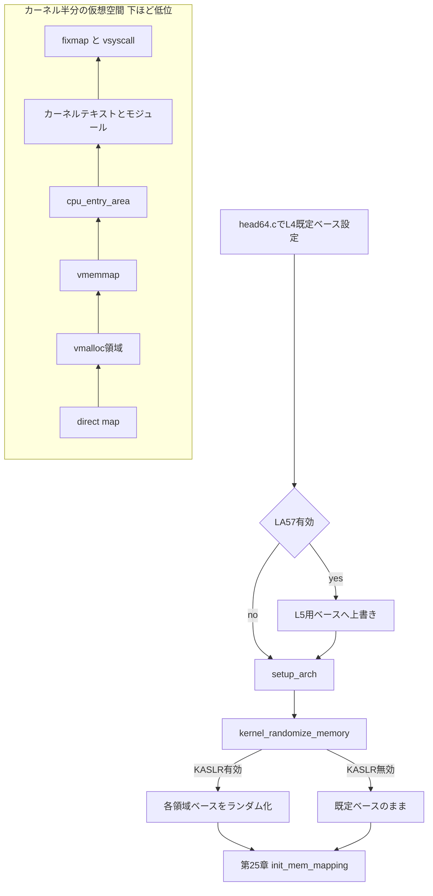

# 第24章 仮想アドレス配置と KASLR

> 本章で読むソース
>
> - [`arch/x86/include/asm/page_64_types.h` L41-L51](https://github.com/gregkh/linux/blob/v6.18.38/arch/x86/include/asm/page_64_types.h#L41-L51)
> - [`arch/x86/include/asm/pgtable_64_types.h` L107-L118](https://github.com/gregkh/linux/blob/v6.18.38/arch/x86/include/asm/pgtable_64_types.h#L107-L118)
> - [`arch/x86/kernel/head64.c` L63-L68](https://github.com/gregkh/linux/blob/v6.18.38/arch/x86/kernel/head64.c#L63-L68)
> - [`arch/x86/include/asm/page.h` L57-L59](https://github.com/gregkh/linux/blob/v6.18.38/arch/x86/include/asm/page.h#L57-L59)
> - [`arch/x86/mm/kaslr.c` L48-L63](https://github.com/gregkh/linux/blob/v6.18.38/arch/x86/mm/kaslr.c#L48-L63)
> - [`arch/x86/mm/kaslr.c` L79-L103](https://github.com/gregkh/linux/blob/v6.18.38/arch/x86/mm/kaslr.c#L79-L103)
> - [`arch/x86/mm/kaslr.c` L141-L168](https://github.com/gregkh/linux/blob/v6.18.38/arch/x86/mm/kaslr.c#L141-L168)
> - [`arch/x86/mm/kaslr.c` L171-L210](https://github.com/gregkh/linux/blob/v6.18.38/arch/x86/mm/kaslr.c#L171-L210)

## この章の狙い

x86-64 カーネル半分の仮想アドレス空間に並ぶ主要領域と、`kernel_randomize_memory` が各ベースをランダム化する流れを追う。
[第4章](../part01-boot/04-compressed-kernel-decompression.md) の物理 KASLR と役割を分け、本分冊が扱う x86 固有の配置定数に焦点を当てる。

## 前提

[第1章](../part00-foundation/01-overview-execution-environment.md) でロングモードとページングの語彙を読んでいること。
[第5章](../part01-boot/05-head-64-startup.md) で `early_top_pgt` による早期ページテーブルを読んでいること。
fixmap と `cpu_entry_area` は [第2章](../part00-foundation/02-gdt-tss-cpu-entry-area.md) が担当する。

## x86-64 仮想アドレス空間の輪郭

x86-64 では仮想アドレスの有効ビット幅が **canonical** 制約を受ける。
上位ビットがすべて0またはすべて1でないアドレスはフォールトになる。
ユーザー空間はアドレス空間の下位半分、カーネルは上位半分を使う。

4レベルページング（既定の48bit仮想アドレス）ではユーザー空間は `0` から約128TiB手前まで、カーネルは `0xffff800000000000` 付近から上向きに領域が並ぶ。
5レベルページング（LA57、57bit仮想アドレス）では有効範囲が広がり、各領域の既定ベースアドレスも別定数になる。

[`arch/x86/include/asm/page_64_types.h` L41-L51](https://github.com/gregkh/linux/blob/v6.18.38/arch/x86/include/asm/page_64_types.h#L41-L51)

```c
#define __PAGE_OFFSET_BASE_L5	_AC(0xff11000000000000, UL)
#define __PAGE_OFFSET_BASE_L4	_AC(0xffff888000000000, UL)

#define __PAGE_OFFSET           page_offset_base

#define __START_KERNEL_map	_AC(0xffffffff80000000, UL)

/* See Documentation/arch/x86/x86_64/mm.rst for a description of the memory map. */

#define __PHYSICAL_MASK_SHIFT	52
#define __VIRTUAL_MASK_SHIFT	(pgtable_l5_enabled() ? 56 : 47)
```

`__VIRTUAL_MASK_SHIFT` が4レベルでは47、5レベルでは56になる。
`TASK_SIZE_MAX` も LA57 の有無で切り替わる（`page_64.h` の `task_size_max`）。

カーネル半分の主要領域は次のとおりである（下から上へ、仮想アドレスが増える方向）。

**direct map**（`page_offset_base` 起点）：全物理 RAM を線形に仮想へ写す領域。
**vmalloc 領域**（`vmalloc_base` 起点）：カーネルが動的に確保する広い仮想範囲。
**vmemmap**（`vmemmap_base` 起点）：`struct page` 配列で全フレームを表す領域。
**vmemmap** より上は、KASAN shadow、**cpu_entry_area**、espfix、EFI、**カーネルテキスト**（`__START_KERNEL_map`）、**モジュール領域**、**fixmap**、**vsyscall** の順に仮想アドレスが高くなる。

汎用の VMA 管理や `handle_mm_fault` は [メモリ管理分冊](../../mm/README.md) が担当する。
本章は x86-64 固有のベースアドレス定数と KASLR の配置に限定する。

## 4レベルと5レベルでの配置定数

`pgtable_64_types.h` は vmalloc と vmemmap の既定ベースとサイズを4レベル用と5レベル用に分けて定義する。

[`arch/x86/include/asm/pgtable_64_types.h` L107-L118](https://github.com/gregkh/linux/blob/v6.18.38/arch/x86/include/asm/pgtable_64_types.h#L107-L118)

```c
#define __VMALLOC_BASE_L4	0xffffc90000000000UL
#define __VMALLOC_BASE_L5 	0xffa0000000000000UL

#define VMALLOC_SIZE_TB_L4	32UL
#define VMALLOC_SIZE_TB_L5	12800UL

#define __VMEMMAP_BASE_L4	0xffffea0000000000UL
#define __VMEMMAP_BASE_L5	0xffd4000000000000UL

# define VMALLOC_START		vmalloc_base
# define VMALLOC_SIZE_TB	(pgtable_l5_enabled() ? VMALLOC_SIZE_TB_L5 : VMALLOC_SIZE_TB_L4)
# define VMEMMAP_START		vmemmap_base
```

4レベルでは vmalloc 領域が32TiB、5レベルでは12800TiBと桁違いに広い。
KASLR 無効時の初期値は `head64.c` で静的に与えられる。

[`arch/x86/kernel/head64.c` L63-L68](https://github.com/gregkh/linux/blob/v6.18.38/arch/x86/kernel/head64.c#L63-L68)

```c
unsigned long page_offset_base __ro_after_init = __PAGE_OFFSET_BASE_L4;
EXPORT_SYMBOL(page_offset_base);
unsigned long vmalloc_base __ro_after_init = __VMALLOC_BASE_L4;
EXPORT_SYMBOL(vmalloc_base);
unsigned long vmemmap_base __ro_after_init = __VMEMMAP_BASE_L4;
EXPORT_SYMBOL(vmemmap_base);
```

LA57 が有効なら `x86_64_start_kernel` 内で L5 用のベースへ上書きされる（`head64.c` L243-L247）。
その後 `setup_arch` で `kernel_randomize_memory` が呼ばれ、KASLR 有効時はさらにランダム化される。

## direct map と `__va` と `__pa`

**direct map** は `page_offset_base` を起点に、物理アドレス `p` を仮想アドレス `p + PAGE_OFFSET` として写す。
`PAGE_OFFSET` は実行時変数 `page_offset_base` を指すマクロである。

[`arch/x86/include/asm/page.h` L57-L59](https://github.com/gregkh/linux/blob/v6.18.38/arch/x86/include/asm/page.h#L57-L59)

```c
#ifndef __va
#define __va(x)			((void *)((unsigned long)(x)+PAGE_OFFSET))
#endif
```

逆変換の `__pa` はカーネルイメージ内アドレス（`__START_KERNEL_map` 以上）と direct map 上アドレスで式が分岐する（`page_64.h` の `__phys_addr_nodebug`）。
direct map 上のポインタに対しては `__pa(x) = x - PAGE_OFFSET` とオフセット加減算だけで済む。
カーネルが物理フレームを直接触る頻出経路の大半がこの変換に依存する。

## kernel_randomize_memory の流れ

`arch/x86/mm/kaslr.c` の `kernel_randomize_memory` は、direct map、vmalloc、vmemmap の3領域の仮想ベースをブートごとにランダム化する。
対象は `kaslr_regions` 配列に登録される。

[`arch/x86/mm/kaslr.c` L48-L63](https://github.com/gregkh/linux/blob/v6.18.38/arch/x86/mm/kaslr.c#L48-L63)

```c
static __initdata struct kaslr_memory_region {
	unsigned long *base;
	unsigned long *end;
	unsigned long size_tb;
} kaslr_regions[] = {
	{
		.base	= &page_offset_base,
		.end	= &direct_map_physmem_end,
	},
	{
		.base	= &vmalloc_base,
	},
	{
		.base	= &vmemmap_base,
	},
};
```

呼び出しは `setup_arch` 内で `max_pfn` が確定した直後である（`setup.c` L1047-L1051）。
各領域のページテーブル構築より前にベースを決めておく必要がある。

入口では4レベルか5レベルかで開始アドレスを選び、KASLR 無効なら即 return する。

[`arch/x86/mm/kaslr.c` L79-L103](https://github.com/gregkh/linux/blob/v6.18.38/arch/x86/mm/kaslr.c#L79-L103)

```c
void __init kernel_randomize_memory(void)
{
	size_t i;
	unsigned long vaddr_start, vaddr;
	unsigned long rand, memory_tb;
	struct rnd_state rand_state;
	unsigned long remain_entropy;
	unsigned long vmemmap_size;

	vaddr_start = pgtable_l5_enabled() ? __PAGE_OFFSET_BASE_L5 : __PAGE_OFFSET_BASE_L4;
	vaddr = vaddr_start;

	/*
	 * These BUILD_BUG_ON checks ensure the memory layout is consistent
	 * with the vaddr_start/vaddr_end variables. These checks are very
	 * limited....
	 */
	BUILD_BUG_ON(vaddr_start >= vaddr_end);
	BUILD_BUG_ON(vaddr_end != CPU_ENTRY_AREA_BASE);
	BUILD_BUG_ON(vaddr_end > __START_KERNEL_map);

	/* Preset the end of the possible address space for physical memory */
	direct_map_physmem_end = ((1ULL << MAX_PHYSMEM_BITS) - 1);
	if (!kaslr_memory_enabled())
		return;
```

ランダム化の上限は `CPU_ENTRY_AREA_BASE` 手前までである（`vaddr_end`）。
領域の順序は固定で、各領域に割り当て可能な余白からランダムなオフセットを取り、PUD アラインメントでベースを決める。

[`arch/x86/mm/kaslr.c` L141-L168](https://github.com/gregkh/linux/blob/v6.18.38/arch/x86/mm/kaslr.c#L141-L168)

```c
	for (i = 0; i < ARRAY_SIZE(kaslr_regions); i++) {
		unsigned long entropy;

		/*
		 * Select a random virtual address using the extra entropy
		 * available.
		 */
		entropy = remain_entropy / (ARRAY_SIZE(kaslr_regions) - i);
		prandom_bytes_state(&rand_state, &rand, sizeof(rand));
		entropy = (rand % (entropy + 1)) & PUD_MASK;
		vaddr += entropy;
		*kaslr_regions[i].base = vaddr;

		/* Calculate the end of the region */
		vaddr += get_padding(&kaslr_regions[i]);
		/*
		 * KASLR trims the maximum possible size of the
		 * direct-map. Update the direct_map_physmem_end boundary.
		 * No rounding required as the region starts
		 * PUD aligned and size is in units of TB.
		 */
		if (kaslr_regions[i].end)
			*kaslr_regions[i].end = __pa_nodebug(vaddr - 1);

		/* Add a minimum padding based on randomization alignment. */
		vaddr = round_up(vaddr + 1, PUD_SIZE);
		remain_entropy -= entropy;
	}
```

direct map の場合、ランダム化に使った仮想空間分だけ `direct_map_physmem_end` が縮み、マップ可能な物理アドレス上限が下がる。
KASLR 有効時の real mode trampoline は低1MiB を覆う PUD だけを複製する（`init_trampoline_kaslr`）。

[`arch/x86/mm/kaslr.c` L171-L210](https://github.com/gregkh/linux/blob/v6.18.38/arch/x86/mm/kaslr.c#L171-L210)

```c
void __meminit init_trampoline_kaslr(void)
{
	pud_t *pud_page_tramp, *pud, *pud_tramp;
	p4d_t *p4d_page_tramp, *p4d, *p4d_tramp;
	unsigned long paddr, vaddr;
	pgd_t *pgd;

	pud_page_tramp = alloc_low_page();

	/*
	 * There are two mappings for the low 1MB area, the direct mapping
	 * and the 1:1 mapping for the real mode trampoline:
	 *
	 * Direct mapping: virt_addr = phys_addr + PAGE_OFFSET
	 * 1:1 mapping:    virt_addr = phys_addr
	 */
	paddr = 0;
	vaddr = (unsigned long)__va(paddr);
	pgd = pgd_offset_k(vaddr);

	p4d = p4d_offset(pgd, vaddr);
	pud = pud_offset(p4d, vaddr);

	pud_tramp = pud_page_tramp + pud_index(paddr);
	*pud_tramp = *pud;

	if (pgtable_l5_enabled()) {
		p4d_page_tramp = alloc_low_page();

		p4d_tramp = p4d_page_tramp + p4d_index(paddr);

		set_p4d(p4d_tramp,
			__p4d(_KERNPG_TABLE | __pa(pud_page_tramp)));

		trampoline_pgd_entry =
			__pgd(_KERNPG_TABLE | __pa(p4d_page_tramp));
	} else {
		trampoline_pgd_entry =
			__pgd(_KERNPG_TABLE | __pa(pud_page_tramp));
	}
}
```

## 物理 KASLR との分担

[第4章](../part01-boot/04-compressed-kernel-decompression.md) の `choose_random_location` は圧縮カーネル段階でカーネルイメージの物理配置と `__START_KERNEL_map` 周辺の仮想スロットを決める。
本章の `kernel_randomize_memory` は起動後半で direct map 以降の広いカーネル領域ベースを動かす。
攻撃者が固定アドレスを当てにくくする目的は同じだが、対象領域とタイミングが異なる。

## 処理の流れ：仮想領域の配置と KASLR



## 高速化と最適化の工夫

direct map は全 RAM を `page_offset_base` との固定オフセットで写す。
`__va` と `__pa` が加減算だけで済むため、カーネルがページ構造体や DMA バッファの物理アドレスを求める経路のコストを抑えられる。
ページテーブルを辿る変換や per-ページのルックアップを毎回行う設計より、TLB とキャッシュの効率が高い。

KASLR は領域ベースをブートごとにランダム化し、カーネルデータ構造への固定オフセット前提の攻撃を困難にする。
ランダム化粒度は PUD 単位（1GiB）に揃え、ページテーブル構築コストとエントロピーのバランスを取っている（`kaslr.c` 先頭コメント参照）。

## まとめ

- x86-64 のカーネル半分には direct map、vmalloc、vmemmap、cpu_entry_area、テキスト、モジュール、fixmap が仮想アドレスの低い方から順に並ぶ。
- 4レベルと5レベルで `__PAGE_OFFSET_BASE` や vmalloc の既定ベースとサイズが変わる。
- `page_offset_base` 起点の direct map により `__va` と `__pa` がオフセット演算で相互変換できる。
- `kernel_randomize_memory` は `max_pfn` 確定後に3領域の仮想ベースを PUD 粒度でランダム化する。
- 物理 KASLR は第4章、direct map のページテーブル構築は第25章が担当する。

## 関連する章

- [圧縮カーネルの展開と再配置と64ビット入口](../part01-boot/04-compressed-kernel-decompression.md)
- [head_64.S の startup_64](../part01-boot/05-head-64-startup.md)
- [GDT と TSS と cpu_entry_area](../part00-foundation/02-gdt-tss-cpu-entry-area.md)
- [4/5 レベルページテーブルとカーネルマッピング](25-page-tables-kernel-mapping.md)
