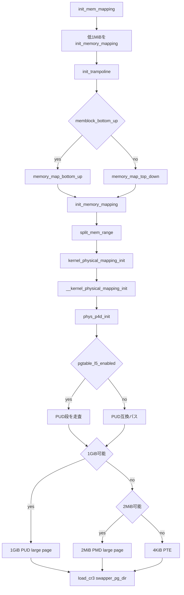

# 第25章 4/5 レベルページテーブルとカーネルマッピング

> 本章で読むソース
>
> - [`arch/x86/include/asm/pgtable_64_types.h` L50-L87](https://github.com/gregkh/linux/blob/v6.18.38/arch/x86/include/asm/pgtable_64_types.h#L50-L87)
> - [`arch/x86/mm/init.c` L759-L814](https://github.com/gregkh/linux/blob/v6.18.38/arch/x86/mm/init.c#L759-L814)
> - [`arch/x86/mm/init.c` L535-L556](https://github.com/gregkh/linux/blob/v6.18.38/arch/x86/mm/init.c#L535-L556)
> - [`arch/x86/mm/init_64.c` L744-L790](https://github.com/gregkh/linux/blob/v6.18.38/arch/x86/mm/init_64.c#L744-L790)
> - [`arch/x86/mm/init_64.c` L800-L807](https://github.com/gregkh/linux/blob/v6.18.38/arch/x86/mm/init_64.c#L800-L807)
> - [`arch/x86/mm/init_64.c` L667-L676](https://github.com/gregkh/linux/blob/v6.18.38/arch/x86/mm/init_64.c#L667-L676)
> - [`arch/x86/mm/init_64.c` L581-L590](https://github.com/gregkh/linux/blob/v6.18.38/arch/x86/mm/init_64.c#L581-L590)
> - [`arch/x86/mm/init_64.c` L702-L704](https://github.com/gregkh/linux/blob/v6.18.38/arch/x86/mm/init_64.c#L702-L704)

## この章の狙い

`init_mem_mapping` が memblock 上の物理 RAM を direct map へ写すためにページテーブルを構築する流れを追う。
4レベルと5レベルの差、1GiB PUD と 2MiB PMD の large page 利用、端数の4KiB PTE への分割を押さえる。

## 前提

[第24章](24-virtual-address-layout-kaslr.md) で `page_offset_base` と KASLR によるベース決定を読んでいること。
[第5章](../part01-boot/05-head-64-startup.md) で `early_top_pgt` による早期ページテーブルと CR3 切替を読んでいること。
汎用のページテーブル抽象や `handle_mm_fault` は [メモリ管理分冊](../../mm/README.md) へ委譲する。

## 4レベルと5レベルページテーブル

x86-64 のページテーブルは **CR3** が指す最上位から下位へ辿る多段構造である。
4レベル構成は PGD、PUD、PMD、PTE の4段で、各段は512エントリ、下位9ビットずつ仮想アドレスを切り出す。
5レベル構成（LA57）では PGD の下に **P4D** 段が入り、PGD、P4D、PUD、PMD、PTE の5段になる。

[`arch/x86/include/asm/pgtable_64_types.h` L50-L87](https://github.com/gregkh/linux/blob/v6.18.38/arch/x86/include/asm/pgtable_64_types.h#L50-L87)

```c
#define PGDIR_SHIFT	pgdir_shift
#define PTRS_PER_PGD	512

/*
 * 4th level page in 5-level paging case
 */
#define P4D_SHIFT		39
#define MAX_PTRS_PER_P4D	512
#define PTRS_PER_P4D		ptrs_per_p4d
#define P4D_SIZE		(_AC(1, UL) << P4D_SHIFT)
#define P4D_MASK		(~(P4D_SIZE - 1))

#define MAX_POSSIBLE_PHYSMEM_BITS	52

/*
 * 3rd level page
 */
#define PUD_SHIFT	30
#define PTRS_PER_PUD	512

/*
 * PMD_SHIFT determines the size of the area a middle-level
 * page table can map
 */
#define PMD_SHIFT	21
#define PTRS_PER_PMD	512

/*
 * entries per page directory level
 */
#define PTRS_PER_PTE	512

#define PMD_SIZE	(_AC(1, UL) << PMD_SHIFT)
#define PMD_MASK	(~(PMD_SIZE - 1))
#define PUD_SIZE	(_AC(1, UL) << PUD_SHIFT)
#define PUD_MASK	(~(PUD_SIZE - 1))
#define PGDIR_SIZE	(_AC(1, UL) << PGDIR_SHIFT)
#define PGDIR_MASK	(~(PGDIR_SIZE - 1))
```

`pgdir_shift` は4レベルでは39、5レベルでは48に初期化される（`head64.c`）。
`pgtable_l5_enabled()` が真のとき `phys_p4d_init` が P4D 段を辿り、偽のときは PGD 直下を PUD として扱う（互換パス）。

## init_mem_mapping の入口

`init_mem_mapping` は x86 カーネル起動時に direct map を本格的に構築する入口である。
第5章の `early_top_pgt` はカーネルイメージと低アドレスの identity mapping を担ったが、ここから全 RAM 範囲の direct map を完成させる。

[`arch/x86/mm/init.c` L759-L814](https://github.com/gregkh/linux/blob/v6.18.38/arch/x86/mm/init.c#L759-L814)

```c
void __init init_mem_mapping(void)
{
	unsigned long end;

	pti_check_boottime_disable();
	probe_page_size_mask();
	setup_pcid();

#ifdef CONFIG_X86_64
	end = max_pfn << PAGE_SHIFT;
#else
	end = max_low_pfn << PAGE_SHIFT;
#endif

	/* the ISA range is always mapped regardless of memory holes */
	init_memory_mapping(0, ISA_END_ADDRESS, PAGE_KERNEL);

	/* Init the trampoline, possibly with KASLR memory offset */
	init_trampoline();

	/*
	 * If the allocation is in bottom-up direction, we setup direct mapping
	 * in bottom-up, otherwise we setup direct mapping in top-down.
	 */
	if (memblock_bottom_up()) {
		unsigned long kernel_end = __pa_symbol(_end);

		/*
		 * we need two separate calls here. This is because we want to
		 * allocate page tables above the kernel. So we first map
		 * [kernel_end, end) to make memory above the kernel be mapped
		 * as soon as possible. And then use page tables allocated above
		 * the kernel to map [ISA_END_ADDRESS, kernel_end).
		 */
		memory_map_bottom_up(kernel_end, end);
		memory_map_bottom_up(ISA_END_ADDRESS, kernel_end);
	} else {
		memory_map_top_down(ISA_END_ADDRESS, end);
	}

#ifdef CONFIG_X86_64
	if (max_pfn > max_low_pfn) {
		/* can we preserve max_low_pfn ?*/
		max_low_pfn = max_pfn;
	}
#else
	early_ioremap_page_table_range_init();
#endif

	load_cr3(swapper_pg_dir);
	__flush_tlb_all();

	x86_init.hyper.init_mem_mapping();

	early_memtest(0, max_pfn_mapped << PAGE_SHIFT);
}
```

処理順は次のとおりである。

1. ページサイズマスクと PCID を準備する。
2. 低1MiB（ISA 範囲）を先にマップする。
3. KASLR 有無に応じて trampoline 用エントリを設定する（第24章）。
4. memblock の方針に従い top-down または bottom-up で残り RAM をマップする。
5. `swapper_pg_dir` を CR3 へ載せ、TLB をフラッシュする。

## init_memory_mapping と kernel_physical_mapping_init

物理範囲ごとのマッピングは `init_memory_mapping` が `split_mem_range` で分割し、`kernel_physical_mapping_init` を呼ぶ。

[`arch/x86/mm/init.c` L535-L556](https://github.com/gregkh/linux/blob/v6.18.38/arch/x86/mm/init.c#L535-L556)

```c
unsigned long __ref init_memory_mapping(unsigned long start,
					unsigned long end, pgprot_t prot)
{
	struct map_range mr[NR_RANGE_MR];
	unsigned long ret = 0;
	int nr_range, i;

	pr_debug("init_memory_mapping: [mem %#010lx-%#010lx]\n",
	       start, end - 1);

	memset(mr, 0, sizeof(mr));
	nr_range = split_mem_range(mr, 0, start, end);

	for (i = 0; i < nr_range; i++)
		ret = kernel_physical_mapping_init(mr[i].start, mr[i].end,
						   mr[i].page_size_mask,
						   prot);

	add_pfn_range_mapped(start >> PAGE_SHIFT, ret >> PAGE_SHIFT);

	return ret >> PAGE_SHIFT;
}
```

`split_mem_range` は MTRR やアラインメントに応じて 1GiB、2MiB、4KiB のどの粒度でマップできるかを `page_size_mask` に反映する。
`kernel_physical_mapping_init` は公開 API で、内部の `__kernel_physical_mapping_init` に委譲する。

[`arch/x86/mm/init_64.c` L800-L807](https://github.com/gregkh/linux/blob/v6.18.38/arch/x86/mm/init_64.c#L800-L807)

```c
unsigned long __meminit
kernel_physical_mapping_init(unsigned long paddr_start,
			     unsigned long paddr_end,
			     unsigned long page_size_mask, pgprot_t prot)
{
	return __kernel_physical_mapping_init(paddr_start, paddr_end,
					      page_size_mask, prot, true);
}
```

## __kernel_physical_mapping_init の PGD 走査

`__kernel_physical_mapping_init` は PGD 単位で仮想アドレスを進め、各 PGD エントリに対して `phys_p4d_init` を呼ぶ。
PGD が未設定なら `alloc_low_page` で下位テーブルを確保し、`pgd_populate_init` または `p4d_populate_init` で接続する。

[`arch/x86/mm/init_64.c` L744-L790](https://github.com/gregkh/linux/blob/v6.18.38/arch/x86/mm/init_64.c#L744-L790)

```c
__kernel_physical_mapping_init(unsigned long paddr_start,
			       unsigned long paddr_end,
			       unsigned long page_size_mask,
			       pgprot_t prot, bool init)
{
	bool pgd_changed = false;
	unsigned long vaddr, vaddr_start, vaddr_end, vaddr_next, paddr_last;

	paddr_last = paddr_end;
	vaddr = (unsigned long)__va(paddr_start);
	vaddr_end = (unsigned long)__va(paddr_end);
	vaddr_start = vaddr;

	for (; vaddr < vaddr_end; vaddr = vaddr_next) {
		pgd_t *pgd = pgd_offset_k(vaddr);
		p4d_t *p4d;

		vaddr_next = (vaddr & PGDIR_MASK) + PGDIR_SIZE;

		if (pgd_val(*pgd)) {
			p4d = (p4d_t *)pgd_page_vaddr(*pgd);
			paddr_last = phys_p4d_init(p4d, __pa(vaddr),
						   __pa(vaddr_end),
						   page_size_mask,
						   prot, init);
			continue;
		}

		p4d = alloc_low_page();
		paddr_last = phys_p4d_init(p4d, __pa(vaddr), __pa(vaddr_end),
					   page_size_mask, prot, init);

		spin_lock(&init_mm.page_table_lock);
		if (pgtable_l5_enabled())
			pgd_populate_init(&init_mm, pgd, p4d, init);
		else
			p4d_populate_init(&init_mm, p4d_offset(pgd, vaddr),
					  (pud_t *) p4d, init);

		spin_unlock(&init_mm.page_table_lock);
		pgd_changed = true;
	}

	if (pgd_changed)
		sync_global_pgds(vaddr_start, vaddr_end - 1);

	return paddr_last;
}
```

LA57 有効時は `pgd_populate_init` で P4D ページをぶら下げ、無効時は PGD エントリを P4D 互換の PUD ポインタとして扱う。

[`arch/x86/mm/init_64.c` L702-L704](https://github.com/gregkh/linux/blob/v6.18.38/arch/x86/mm/init_64.c#L702-L704)

```c
	if (!pgtable_l5_enabled())
		return phys_pud_init((pud_t *) p4d_page, paddr, paddr_end,
				     page_size_mask, prot, init);
```

## large page による direct map 構築

`phys_pud_init` は PUD 段で 1GiB の large page を張れるとき `PG_LEVEL_1G` ビットが立った `page_size_mask` に従い `pfn_pud` で葉エントリを書く。
アラインメントや MTRR の都合で 1GiB が使えない区間だけ下位の `phys_pmd_init` へ落とす。

[`arch/x86/mm/init_64.c` L667-L676](https://github.com/gregkh/linux/blob/v6.18.38/arch/x86/mm/init_64.c#L667-L676)

```c
		if (page_size_mask & (1<<PG_LEVEL_1G)) {
			pages++;
			spin_lock(&init_mm.page_table_lock);
			set_pud_init(pud,
				     pfn_pud(paddr >> PAGE_SHIFT, prot_sethuge(prot)),
				     init);
			spin_unlock(&init_mm.page_table_lock);
			paddr_last = paddr_next;
			continue;
		}
```

`phys_pmd_init` は同様に 2MiB PMD large page（`PG_LEVEL_2M`）を優先する。
どちらも使えない端数だけ `phys_pte_init` で4KiB PTE を逐次張る。

[`arch/x86/mm/init_64.c` L581-L590](https://github.com/gregkh/linux/blob/v6.18.38/arch/x86/mm/init_64.c#L581-L590)

```c
		if (page_size_mask & (1<<PG_LEVEL_2M)) {
			pages++;
			spin_lock(&init_mm.page_table_lock);
			set_pmd_init(pmd,
				     pfn_pmd(paddr >> PAGE_SHIFT, prot_sethuge(prot)),
				     init);
			spin_unlock(&init_mm.page_table_lock);
			paddr_last = paddr_next;
			continue;
		}
```

`prot_sethuge` は `_PAGE_PSE` を付与し、ハードウェアが large page として解釈する属性を整える。

## 早期ページテーブルからの移行

第5章の `early_top_pgt` はカーネルイメージ写像と起動直後の identity mapping を担う。
`init_mem_mapping` は `swapper_pg_dir`（`init_top_pgt`）上に direct map を拡張し、最後に `load_cr3(swapper_pg_dir)` で本番ページテーブルへ切り替える。
早期テーブルで張ったカーネル高位写像は、direct map 構築と整合する形で引き継がれる。

## 処理の流れ：direct map のページテーブル構築



## 高速化と最適化の工夫

direct map を可能な限り 1GiB PUD と 2MiB PMD の large page で構築することで、ページテーブル段数とテーブル占有量を減らせる。
TLB エントリ1つで広い物理範囲をカバーでき、起動後のカーネルアクセスで TLB ミスが起きにくくなる。
端数や MTRR 境界だけ4KiB に落とす設計が、粒度と柔軟性の折衷になっている。

LA57 対応は `pgtable_l5_enabled` による分岐で同じ `phys_p4d_init` から4レベルと5レベルを切り替える。
専用の二重実装を避け、57bit 仮想アドレス空間へ拡張しても direct map 構築ロジックを共有できる。

## まとめ

- x86-64 のページテーブルは CR3 が指す PGD から辿り、LA57 時は P4D 段が追加される。
- `init_mem_mapping` が ISA 範囲と全 RAM を direct map へ写し、最後に `swapper_pg_dir` を CR3 へ載せる。
- `kernel_physical_mapping_init` は物理範囲を受け取り、PGD 単位で下位テーブルを構築する。
- 1GiB PUD と 2MiB PMD の large page を優先し、端数だけ4KiB PTE を使う。
- 早期 `early_top_pgt` から本番 direct map への移行は第5章の流れの延長である。

## 関連する章

- [仮想アドレス配置と KASLR](24-virtual-address-layout-kaslr.md)
- [head_64.S の startup_64](../part01-boot/05-head-64-startup.md)
- [x86 ページフォールト入口](26-page-fault-entry.md)
