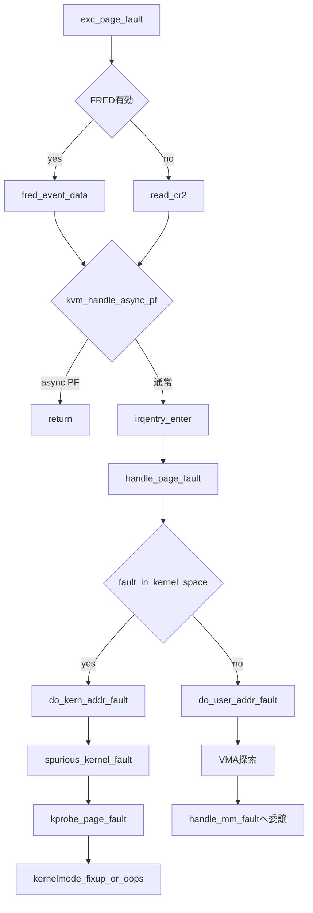

# 第26章 x86 ページフォールト入口

> 本章で読むソース
>
> - [`arch/x86/mm/fault.c` L1483-L1531](https://github.com/gregkh/linux/blob/v6.18.38/arch/x86/mm/fault.c#L1483-L1531)
> - [`arch/x86/mm/fault.c` L1461-L1481](https://github.com/gregkh/linux/blob/v6.18.38/arch/x86/mm/fault.c#L1461-L1481)
> - [`arch/x86/mm/fault.c` L1115-L1126](https://github.com/gregkh/linux/blob/v6.18.38/arch/x86/mm/fault.c#L1115-L1126)
> - [`arch/x86/mm/fault.c` L1133-L1194](https://github.com/gregkh/linux/blob/v6.18.38/arch/x86/mm/fault.c#L1133-L1194)
> - [`arch/x86/mm/fault.c` L718-L737](https://github.com/gregkh/linux/blob/v6.18.38/arch/x86/mm/fault.c#L718-L737)
> - [`arch/x86/mm/fault.c` L1207-L1271](https://github.com/gregkh/linux/blob/v6.18.38/arch/x86/mm/fault.c#L1207-L1271)
> - [`arch/x86/mm/fault.c` L1372-L1385](https://github.com/gregkh/linux/blob/v6.18.38/arch/x86/mm/fault.c#L1372-L1385)
> - [`arch/x86/include/asm/trap_pf.h` L20-L30](https://github.com/gregkh/linux/blob/v6.18.38/arch/x86/include/asm/trap_pf.h#L20-L30)

## この章の狙い

`exc_page_fault` が fault address と error code をどう受け取り、`handle_page_fault` が kernel 空間と user 空間のどちらへ振り分けるかを追う。
`handle_mm_fault` 以降の汎用処理は [メモリ管理分冊](../../mm/README.md) へ委譲し、x86 固有の入口と分岐に焦点を当てる。

## 前提

[第25章](25-page-tables-kernel-mapping.md) で direct map のページテーブル構築を読んでいること。
[第12章](../part03-exceptions/12-normal-exceptions.md) で IDT 入口マクロと `pt_regs` の枠組みを読んでいること。

## exc_page_fault と fault address の取得

`#PF`（ページフォールト）の IDT 入口は `DEFINE_IDTENTRY_RAW_ERRORCODE(exc_page_fault)` で定義される。
**error code** はハードウェアがスタックへ積んだ値で、マクロが `error_code` 引数として渡す。
`exc_page_fault` 内で CR2 を読む前に error code を別途読む必要はない。

fault address は FRED 有効時と従来 IDT 経路で取得元が分岐する。
FRED 有効なら `fred_event_data(regs)`、従来経路なら `read_cr2()` が CR2 相当の値を返す。

[`arch/x86/mm/fault.c` L1483-L1531](https://github.com/gregkh/linux/blob/v6.18.38/arch/x86/mm/fault.c#L1483-L1531)

```c
DEFINE_IDTENTRY_RAW_ERRORCODE(exc_page_fault)
{
	irqentry_state_t state;
	unsigned long address;

	address = cpu_feature_enabled(X86_FEATURE_FRED) ? fred_event_data(regs) : read_cr2();

	/*
	 * KVM uses #PF vector to deliver 'page not present' events to guests
	 * (asynchronous page fault mechanism). The event happens when a
	 * userspace task is trying to access some valid (from guest's point of
	 * view) memory which is not currently mapped by the host (e.g. the
	 * memory is swapped out). Note, the corresponding "page ready" event
	 * which is injected when the memory becomes available, is delivered via
	 * an interrupt mechanism and not a #PF exception
	 * (see arch/x86/kernel/kvm.c: sysvec_kvm_asyncpf_interrupt()).
	 *
	 * We are relying on the interrupted context being sane (valid RSP,
	 * relevant locks not held, etc.), which is fine as long as the
	 * interrupted context had IF=1.  We are also relying on the KVM
	 * async pf type field and CR2 being read consistently instead of
	 * getting values from real and async page faults mixed up.
	 *
	 * Fingers crossed.
	 *
	 * The async #PF handling code takes care of idtentry handling
	 * itself.
	 */
	if (kvm_handle_async_pf(regs, (u32)address))
		return;

	/*
	 * Entry handling for valid #PF from kernel mode is slightly
	 * different: RCU is already watching and ct_irq_enter() must not
	 * be invoked because a kernel fault on a user space address might
	 * sleep.
	 *
	 * In case the fault hit a RCU idle region the conditional entry
	 * code reenabled RCU to avoid subsequent wreckage which helps
	 * debuggability.
	 */
	state = irqentry_enter(regs);

	instrumentation_begin();
	handle_page_fault(regs, error_code, address);
	instrumentation_end();

	irqentry_exit(regs, state);
}
```

KVM の非同期 page fault はここで早期 return する。
通常経路は `irqentry_enter` の後 `handle_page_fault` へ進む。

## error code のビット意味

error code は PTE を読み直さずに fault の種別を判別する手がかりになる。
present/write/user/instruction fetch などのビットがハードウェアにより付与される。

[`arch/x86/include/asm/trap_pf.h` L20-L30](https://github.com/gregkh/linux/blob/v6.18.38/arch/x86/include/asm/trap_pf.h#L20-L30)

```c
enum x86_pf_error_code {
	X86_PF_PROT	=		BIT(0),
	X86_PF_WRITE	=		BIT(1),
	X86_PF_USER	=		BIT(2),
	X86_PF_RSVD	=		BIT(3),
	X86_PF_INSTR	=		BIT(4),
	X86_PF_PK	=		BIT(5),
	X86_PF_SHSTK	=		BIT(6),
	X86_PF_SGX	=		BIT(15),
	X86_PF_RMP	=		BIT(31),
};
```

`do_user_addr_fault` は `X86_PF_WRITE` や `X86_PF_INSTR` から `FAULT_FLAG_WRITE` などを組み立てる。
分岐の主軸は CPL や `X86_PF_USER` 単体ではなく、後述の fault address 範囲である。

## handle_page_fault と fault_in_kernel_space

`handle_page_fault` は fault address がカーネル管轄の範囲かどうかで handler を選ぶ。
判定は `fault_in_kernel_space(address)` が担う。

[`arch/x86/mm/fault.c` L1115-L1126](https://github.com/gregkh/linux/blob/v6.18.38/arch/x86/mm/fault.c#L1115-L1126)

```c
bool fault_in_kernel_space(unsigned long address)
{
	/*
	 * On 64-bit systems, the vsyscall page is at an address above
	 * TASK_SIZE_MAX, but is not considered part of the kernel
	 * address space.
	 */
	if (IS_ENABLED(CONFIG_X86_64) && is_vsyscall_vaddr(address))
		return false;

	return address >= TASK_SIZE_MAX;
}
```

x86-64 では vsyscall 領域だけ `TASK_SIZE_MAX` より上でも user 側へ送る例外がある。
それ以外で `address >= TASK_SIZE_MAX` なら `do_kern_addr_fault`、そうでなければ `do_user_addr_fault` である。

[`arch/x86/mm/fault.c` L1461-L1481](https://github.com/gregkh/linux/blob/v6.18.38/arch/x86/mm/fault.c#L1461-L1481)

```c
static __always_inline void
handle_page_fault(struct pt_regs *regs, unsigned long error_code,
			      unsigned long address)
{
	trace_page_fault_entries(regs, error_code, address);

	if (unlikely(kmmio_fault(regs, address)))
		return;

	/* Was the fault on kernel-controlled part of the address space? */
	if (unlikely(fault_in_kernel_space(address))) {
		do_kern_addr_fault(regs, error_code, address);
	} else {
		do_user_addr_fault(regs, error_code, address);
	}
	/*
	 * page fault handling might have reenabled interrupts,
	 * make sure to disable them again.
	 */
	local_irq_disable();
}
```

`do_user_addr_fault` はカーネルコードが user アドレスへアクセスした場合（`get_user` など）も処理する。
`user_mode(regs)` と fault address 範囲の組み合わせで文脈が決まる。

## do_user_addr_fault と handle_mm_fault への委譲

user 空間側の fault は x86 固有の事前チェックの後、VMA 探索と `handle_mm_fault` へ進む。
SMAP 違反、予約ビット、割り込み中の fault などはここで弾かれる。

[`arch/x86/mm/fault.c` L1207-L1271](https://github.com/gregkh/linux/blob/v6.18.38/arch/x86/mm/fault.c#L1207-L1271)

```c
void do_user_addr_fault(struct pt_regs *regs,
			unsigned long error_code,
			unsigned long address)
{
	struct vm_area_struct *vma;
	struct task_struct *tsk;
	struct mm_struct *mm;
	vm_fault_t fault;
	unsigned int flags = FAULT_FLAG_DEFAULT;

	tsk = current;
	mm = tsk->mm;

	if (unlikely((error_code & (X86_PF_USER | X86_PF_INSTR)) == X86_PF_INSTR)) {
		/*
		 * Whoops, this is kernel mode code trying to execute from
		 * user memory.  Unless this is AMD erratum #93, which
		 * corrupts RIP such that it looks like a user address,
		 * this is unrecoverable.  Don't even try to look up the
		 * VMA or look for extable entries.
		 */
		if (is_errata93(regs, address))
			return;

		page_fault_oops(regs, error_code, address);
		return;
	}

	/* kprobes don't want to hook the spurious faults: */
	if (WARN_ON_ONCE(kprobe_page_fault(regs, X86_TRAP_PF)))
		return;

	/*
	 * Reserved bits are never expected to be set on
	 * entries in the user portion of the page tables.
	 */
	if (unlikely(error_code & X86_PF_RSVD))
		pgtable_bad(regs, error_code, address);

	/*
	 * If SMAP is on, check for invalid kernel (supervisor) access to user
	 * pages in the user address space.  The odd case here is WRUSS,
	 * which, according to the preliminary documentation, does not respect
	 * SMAP and will have the USER bit set so, in all cases, SMAP
	 * enforcement appears to be consistent with the USER bit.
	 */
	if (unlikely(cpu_feature_enabled(X86_FEATURE_SMAP) &&
		     !(error_code & X86_PF_USER) &&
		     !(regs->flags & X86_EFLAGS_AC))) {
		/*
		 * No extable entry here.  This was a kernel access to an
		 * invalid pointer.  get_kernel_nofault() will not get here.
		 */
		page_fault_oops(regs, error_code, address);
		return;
	}

	/*
	 * If we're in an interrupt, have no user context or are running
	 * in a region with pagefaults disabled then we must not take the fault
	 */
	if (unlikely(faulthandler_disabled() || !mm)) {
		bad_area_nosemaphore(regs, error_code, address);
		return;
	}
```

VMA をロックしたうえで `handle_mm_fault` を呼ぶ。
以降の COW、ページキャッシュ、スワップインなどは mm 分冊が担当する。

[`arch/x86/mm/fault.c` L1372-L1385](https://github.com/gregkh/linux/blob/v6.18.38/arch/x86/mm/fault.c#L1372-L1385)

```c
	/*
	 * If for any reason at all we couldn't handle the fault,
	 * make sure we exit gracefully rather than endlessly redo
	 * the fault.  Since we never set FAULT_FLAG_RETRY_NOWAIT, if
	 * we get VM_FAULT_RETRY back, the mmap_lock has been unlocked.
	 *
	 * Note that handle_userfault() may also release and reacquire mmap_lock
	 * (and not return with VM_FAULT_RETRY), when returning to userland to
	 * repeat the page fault later with a VM_FAULT_NOPAGE retval
	 * (potentially after handling any pending signal during the return to
	 * userland). The return to userland is identified whenever
	 * FAULT_FLAG_USER|FAULT_FLAG_KILLABLE are both set in flags.
	 */
	fault = handle_mm_fault(vma, address, flags, regs);
```

## do_kern_addr_fault と exception table

カーネル空間の fault は x86-64 では主に spurious fault 判定、kprobe 処理、exception table fixup か oops の順で処理される。

`vmalloc_fault` による遅延同期は **CONFIG_X86_32 限定** である。
コメントが明示するとおり、x86-64 では vmalloc マッピングの同期 race がなく、この経路はコンパイルされない。
「kernel fault は vmalloc を遅延同期する」と x86-64 に一般化してはならない。

[`arch/x86/mm/fault.c` L1133-L1194](https://github.com/gregkh/linux/blob/v6.18.38/arch/x86/mm/fault.c#L1133-L1194)

```c
static void
do_kern_addr_fault(struct pt_regs *regs, unsigned long hw_error_code,
		   unsigned long address)
{
	/*
	 * Protection keys exceptions only happen on user pages.  We
	 * have no user pages in the kernel portion of the address
	 * space, so do not expect them here.
	 */
	WARN_ON_ONCE(hw_error_code & X86_PF_PK);

#ifdef CONFIG_X86_32
	/*
	 * We can fault-in kernel-space virtual memory on-demand. The
	 * 'reference' page table is init_mm.pgd.
	 *
	 * NOTE! We MUST NOT take any locks for this case. We may
	 * be in an interrupt or a critical region, and should
	 * only copy the information from the master page table,
	 * nothing more.
	 *
	 * Before doing this on-demand faulting, ensure that the
	 * fault is not any of the following:
	 * 1. A fault on a PTE with a reserved bit set.
	 * 2. A fault caused by a user-mode access.  (Do not demand-
	 *    fault kernel memory due to user-mode accesses).
	 * 3. A fault caused by a page-level protection violation.
	 *    (A demand fault would be on a non-present page which
	 *     would have X86_PF_PROT==0).
	 *
	 * This is only needed to close a race condition on x86-32 in
	 * the vmalloc mapping/unmapping code. See the comment above
	 * vmalloc_fault() for details. On x86-64 the race does not
	 * exist as the vmalloc mappings don't need to be synchronized
	 * there.
	 */
	if (!(hw_error_code & (X86_PF_RSVD | X86_PF_USER | X86_PF_PROT))) {
		if (vmalloc_fault(address) >= 0)
			return;
	}
#endif

	if (is_f00f_bug(regs, hw_error_code, address))
		return;

	/* Was the fault spurious, caused by lazy TLB invalidation? */
	if (spurious_kernel_fault(hw_error_code, address))
		return;

	/* kprobes don't want to hook the spurious faults: */
	if (WARN_ON_ONCE(kprobe_page_fault(regs, X86_TRAP_PF)))
		return;

	/*
	 * Note, despite being a "bad area", there are quite a few
	 * acceptable reasons to get here, such as erratum fixups
	 * and handling kernel code that can fault, like get_user().
	 *
	 * Don't take the mm semaphore here. If we fixup a prefetch
	 * fault we could otherwise deadlock:
	 */
	bad_area_nosemaphore(regs, hw_error_code, address);
}
```

`bad_area_nosemaphore` は最終的に `kernelmode_fixup_or_oops` を呼ぶ。
exception table に復帰点があればそこへ飛び、なければ oops する。

[`arch/x86/mm/fault.c` L718-L737](https://github.com/gregkh/linux/blob/v6.18.38/arch/x86/mm/fault.c#L718-L737)

```c
static noinline void
kernelmode_fixup_or_oops(struct pt_regs *regs, unsigned long error_code,
			 unsigned long address, int signal, int si_code,
			 u32 pkey)
{
	WARN_ON_ONCE(user_mode(regs));

	/* Are we prepared to handle this kernel fault? */
	if (fixup_exception(regs, X86_TRAP_PF, error_code, address))
		return;

	/*
	 * AMD erratum #91 manifests as a spurious page fault on a PREFETCH
	 * instruction.
	 */
	if (is_prefetch(regs, error_code, address))
		return;

	page_fault_oops(regs, error_code, address);
}
```

`copy_from_user` などは正常経路で全バイトを検証せず、fault 時に extable を引いて fixup へ復帰できる。

## 処理の流れ：ページフォールト入口



## 高速化と最適化の工夫

error code のビットで present、write、user、instruction fetch を即座に判別できる。
PTE を辿って属性を読むより fault 種別の分岐が早く、入口での判定コストを抑えられる。

`copy_from_user` などは `access_ok` で user address range を正常経路で検査する。
exception table が省くのは、対象範囲の各アクセスが fault し得るかを個々の load や store の前に確定する処理である。
アクセスが本当に fault したときだけ extable を引いて復帰点へ飛ぶため、成功経路のオーバーヘッドを避けられる。

## まとめ

- `exc_page_fault` は FRED なら `fred_event_data`、IDT 経路なら `read_cr2` で fault address を得、error code はマクロ引数として受け取る。
- `handle_page_fault` は `fault_in_kernel_space` で kernel と user を分岐し、vsyscall は user 側へ送る。
- `do_user_addr_fault` は x86 固有チェックの後 VMA を探し `handle_mm_fault` へ委譲する。
- x86-64 の kernel fault 中心経路は spurious、kprobe、exception table fixup か oops である。
- `vmalloc_fault` の遅延同期は x86-32 限定で、x86-64 には一般化しない。

## 関連する章

- [4/5 レベルページテーブルとカーネルマッピング](25-page-tables-kernel-mapping.md)
- [通常例外の入口と dispatch](../part03-exceptions/12-normal-exceptions.md)
- [TLB flush と lazy TLB と PCID](27-tlb-pcid.md)
