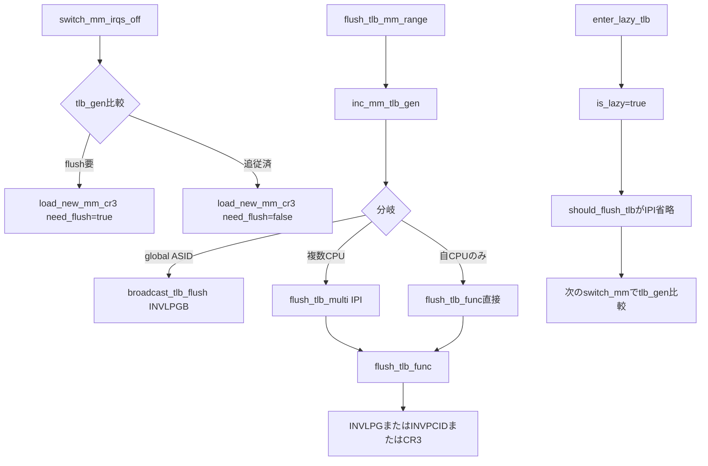

# 第27章 TLB flush と lazy TLB と PCID

> 本章で読むソース
>
> - [`arch/x86/mm/tlb.c` L782-L791](https://github.com/gregkh/linux/blob/v6.18.38/arch/x86/mm/tlb.c#L782-L791)
> - [`arch/x86/mm/tlb.c` L944-L964](https://github.com/gregkh/linux/blob/v6.18.38/arch/x86/mm/tlb.c#L944-L964)
> - [`arch/x86/mm/tlb.c` L564-L582](https://github.com/gregkh/linux/blob/v6.18.38/arch/x86/mm/tlb.c#L564-L582)
> - [`arch/x86/mm/tlb.c` L986-L992](https://github.com/gregkh/linux/blob/v6.18.38/arch/x86/mm/tlb.c#L986-L992)
> - [`arch/x86/mm/tlb.c` L1123-L1185](https://github.com/gregkh/linux/blob/v6.18.38/arch/x86/mm/tlb.c#L1123-L1185)
> - [`arch/x86/mm/tlb.c` L1296-L1332](https://github.com/gregkh/linux/blob/v6.18.38/arch/x86/mm/tlb.c#L1296-L1332)
> - [`arch/x86/mm/tlb.c` L1448-L1483](https://github.com/gregkh/linux/blob/v6.18.38/arch/x86/mm/tlb.c#L1448-L1483)
> - [`arch/x86/mm/tlb.c` L501-L536](https://github.com/gregkh/linux/blob/v6.18.38/arch/x86/mm/tlb.c#L501-L536)
> - [`arch/x86/mm/tlb.c` L1491-L1520](https://github.com/gregkh/linux/blob/v6.18.38/arch/x86/mm/tlb.c#L1491-L1520)

## この章の狙い

x86 の TLB 無効化命令と PCID 付き CR3 切替、`flush_tlb_mm_range` の分岐、lazy TLB の deferred invalidation を追う。
汎用の mm 層のページテーブル更新は [メモリ管理分冊](../../mm/README.md) が担当し、本章は `arch/x86/mm/tlb.c` の実装に限定する。

## 前提

[第25章](25-page-tables-kernel-mapping.md) で CR3 とページテーブル構築を読んでいること。
[第18章](../part05-apic/18-local-apic-timer-ipi.md) で IPI の枠組みを読んでいること。

## x86 の TLB 無効化手段

x86 では TLB エントリを無効化する手段が複数ある。

**INVLPG**：単一仮想アドレスの TLB エントリを無効化する。
**INVPCID**：PCID 付きで単一アドレスまたは全エントリを無効化する。
**CR3 の再書き込み**：現行アドレス空間の TLB を一括無効化する（PCID と no-flush bit の組み合わせで部分回避可能）。
**INVLPGB と TLBSYNC**：global ASID を使う構成で、ハードウェア broadcast による範囲無効化を行う。

`flush_tlb_all` は INVLPGB 対応 CPU なら `invlpgb_flush_all` を使い、なければ IPI で各 CPU に `__flush_tlb_all` を実行する。

[`arch/x86/mm/tlb.c` L1491-L1520](https://github.com/gregkh/linux/blob/v6.18.38/arch/x86/mm/tlb.c#L1491-L1520)

```c
void flush_tlb_all(void)
{
	count_vm_tlb_event(NR_TLB_REMOTE_FLUSH);

	/* First try (faster) hardware-assisted TLB invalidation. */
	if (cpu_feature_enabled(X86_FEATURE_INVLPGB))
		invlpgb_flush_all();
	else
		/* Fall back to the IPI-based invalidation. */
		on_each_cpu(do_flush_tlb_all, NULL, 1);
}

/* Flush an arbitrarily large range of memory with INVLPGB. */
static void invlpgb_kernel_range_flush(struct flush_tlb_info *info)
{
	unsigned long addr, nr;

	for (addr = info->start; addr < info->end; addr += nr << PAGE_SHIFT) {
		nr = (info->end - addr) >> PAGE_SHIFT;

		/*
		 * INVLPGB has a limit on the size of ranges it can
		 * flush. Break up large flushes.
		 */
		nr = clamp_val(nr, 1, invlpgb_count_max);

		invlpgb_flush_addr_nosync(addr, nr);
	}
	__tlbsync();
}
```

`flush_tlb_func` の部分 flush 経路では `flush_tlb_one_user` がアドレスごとに INVLPG 相当を発行する。
CR3 reload と INVPCID だけに限定した説明では実装の全体像を捉えきれない。

## switch_mm_irqs_off と PCID 付き CR3

mm 切替の実体は `switch_mm_irqs_off` である。
`switch_mm_irqs_off` は mm 切替の実体で、`cpu_tlbstate` から前の mm と ASID を読み出す。

[`arch/x86/mm/tlb.c` L782-L791](https://github.com/gregkh/linux/blob/v6.18.38/arch/x86/mm/tlb.c#L782-L791)

```c
void switch_mm_irqs_off(struct mm_struct *unused, struct mm_struct *next,
			struct task_struct *tsk)
{
	struct mm_struct *prev = this_cpu_read(cpu_tlbstate.loaded_mm);
	u16 prev_asid = this_cpu_read(cpu_tlbstate.loaded_mm_asid);
	bool was_lazy = this_cpu_read(cpu_tlbstate_shared.is_lazy);
	unsigned cpu = smp_processor_id();
	unsigned long new_lam;
	struct new_asid ns;
	u64 next_tlb_gen;
```

PCID により TLB エントリはアドレス空間（ASID）ごとにタグ付けされ、切替のたびに全 TLB を flush しなくてよい場合がある。

`load_new_mm_cr3` は flush 要否で `build_cr3` と `build_cr3_noflush` を使い分ける。

[`arch/x86/mm/tlb.c` L564-L582](https://github.com/gregkh/linux/blob/v6.18.38/arch/x86/mm/tlb.c#L564-L582)

```c
static void load_new_mm_cr3(pgd_t *pgdir, u16 new_asid, unsigned long lam,
			    bool need_flush)
{
	unsigned long new_mm_cr3;

	if (need_flush) {
		invalidate_user_asid(new_asid);
		new_mm_cr3 = build_cr3(pgdir, new_asid, lam);
	} else {
		new_mm_cr3 = build_cr3_noflush(pgdir, new_asid, lam);
	}

	/*
	 * Caution: many callers of this function expect
	 * that load_cr3() is serializing and orders TLB
	 * fills with respect to the mm_cpumask writes.
	 */
	write_cr3(new_mm_cr3);
}
```

別 mm へ切り替えるときは `choose_new_asid` で ASID を選び、`tlb_gen` と比較して flush が要るか決める。
lazy TLB から復帰するときも `tlb_gen` を読んで追いついていなければ `need_flush` で CR3 を書き直す。

[`arch/x86/mm/tlb.c` L944-L964](https://github.com/gregkh/linux/blob/v6.18.38/arch/x86/mm/tlb.c#L944-L964)

```c
reload_tlb:
	new_lam = mm_lam_cr3_mask(next);
	if (ns.need_flush) {
		VM_WARN_ON_ONCE(is_global_asid(ns.asid));
		this_cpu_write(cpu_tlbstate.ctxs[ns.asid].ctx_id, next->context.ctx_id);
		this_cpu_write(cpu_tlbstate.ctxs[ns.asid].tlb_gen, next_tlb_gen);
		load_new_mm_cr3(next->pgd, ns.asid, new_lam, true);

		trace_tlb_flush(TLB_FLUSH_ON_TASK_SWITCH, TLB_FLUSH_ALL);
	} else {
		/* The new ASID is already up to date. */
		load_new_mm_cr3(next->pgd, ns.asid, new_lam, false);

		trace_tlb_flush(TLB_FLUSH_ON_TASK_SWITCH, 0);
	}

	/* Make sure we write CR3 before loaded_mm. */
	barrier();

	this_cpu_write(cpu_tlbstate.loaded_mm, next);
	this_cpu_write(cpu_tlbstate.loaded_mm_asid, ns.asid);
```

## flush_tlb_mm_range の分岐

ページテーブル更新後の TLB shootdown 入口は `flush_tlb_mm_range` である。
`inc_mm_tlb_gen` で世代を進めたうえで、対象 mm と CPU 集合に応じて経路が分岐する。

[`arch/x86/mm/tlb.c` L1448-L1483](https://github.com/gregkh/linux/blob/v6.18.38/arch/x86/mm/tlb.c#L1448-L1483)

```c
void flush_tlb_mm_range(struct mm_struct *mm, unsigned long start,
				unsigned long end, unsigned int stride_shift,
				bool freed_tables)
{
	struct flush_tlb_info *info;
	int cpu = get_cpu();
	u64 new_tlb_gen;

	/* This is also a barrier that synchronizes with switch_mm(). */
	new_tlb_gen = inc_mm_tlb_gen(mm);

	info = get_flush_tlb_info(mm, start, end, stride_shift, freed_tables,
				  new_tlb_gen);

	/*
	 * flush_tlb_multi() is not optimized for the common case in which only
	 * a local TLB flush is needed. Optimize this use-case by calling
	 * flush_tlb_func_local() directly in this case.
	 */
	if (mm_global_asid(mm)) {
		broadcast_tlb_flush(info);
	} else if (cpumask_any_but(mm_cpumask(mm), cpu) < nr_cpu_ids) {
		info->trim_cpumask = should_trim_cpumask(mm);
		flush_tlb_multi(mm_cpumask(mm), info);
		consider_global_asid(mm);
	} else if (mm == this_cpu_read(cpu_tlbstate.loaded_mm)) {
		lockdep_assert_irqs_enabled();
		local_irq_disable();
		flush_tlb_func(info);
		local_irq_enable();
	}

	put_flush_tlb_info();
	put_cpu();
	mmu_notifier_arch_invalidate_secondary_tlbs(mm, start, end);
}
```

分岐の意味は次のとおりである。

mm が **global ASID** を持つ場合は `broadcast_tlb_flush` が INVLPGB 系命令でハードウェア broadcast する。
複数 CPU が対象 mm を載せている場合は `flush_tlb_multi` が IPI で `flush_tlb_func` を起動する。
現在 CPU だけが対象なら `flush_tlb_func` を直接呼ぶ。

global ASID 向け broadcast は INVLPGB を非同期に発行し、最後に `__tlbsync` で完了を待つ。

[`arch/x86/mm/tlb.c` L501-L536](https://github.com/gregkh/linux/blob/v6.18.38/arch/x86/mm/tlb.c#L501-L536)

```c
static void broadcast_tlb_flush(struct flush_tlb_info *info)
{
	bool pmd = info->stride_shift == PMD_SHIFT;
	unsigned long asid = mm_global_asid(info->mm);
	unsigned long addr = info->start;

	/*
	 * TLB flushes with INVLPGB are kicked off asynchronously.
	 * The inc_mm_tlb_gen() guarantees page table updates are done
	 * before these TLB flushes happen.
	 */
	if (info->end == TLB_FLUSH_ALL) {
		invlpgb_flush_single_pcid_nosync(kern_pcid(asid));
		/* Do any CPUs supporting INVLPGB need PTI? */
		if (cpu_feature_enabled(X86_FEATURE_PTI))
			invlpgb_flush_single_pcid_nosync(user_pcid(asid));
	} else do {
		unsigned long nr = 1;

		if (info->stride_shift <= PMD_SHIFT) {
			nr = (info->end - addr) >> info->stride_shift;
			nr = clamp_val(nr, 1, invlpgb_count_max);
		}

		invlpgb_flush_user_nr_nosync(kern_pcid(asid), addr, nr, pmd);
		if (cpu_feature_enabled(X86_FEATURE_PTI))
			invlpgb_flush_user_nr_nosync(user_pcid(asid), addr, nr, pmd);

		addr += nr << info->stride_shift;
	} while (addr < info->end);

	finish_asid_transition(info);

	/* Wait for the INVLPGBs kicked off above to finish. */
	__tlbsync();
}
```

## flush_tlb_func と IPI shootdown

`flush_tlb_func` は IPI のハンドラ本体でもあり、受信 CPU 上で TLB を実際に無効化する。
lazy CPU が誤って呼ばれた場合は `init_mm` へ切り替えて paging-structure cache を安全側に寄せる。

[`arch/x86/mm/tlb.c` L1123-L1185](https://github.com/gregkh/linux/blob/v6.18.38/arch/x86/mm/tlb.c#L1123-L1185)

```c
static void flush_tlb_func(void *info)
{
	/*
	 * We have three different tlb_gen values in here.  They are:
	 *
	 * - mm_tlb_gen:     the latest generation.
	 * - local_tlb_gen:  the generation that this CPU has already caught
	 *                   up to.
	 * - f->new_tlb_gen: the generation that the requester of the flush
	 *                   wants us to catch up to.
	 */
	const struct flush_tlb_info *f = info;
	struct mm_struct *loaded_mm = this_cpu_read(cpu_tlbstate.loaded_mm);
	u32 loaded_mm_asid = this_cpu_read(cpu_tlbstate.loaded_mm_asid);
	u64 local_tlb_gen;
	bool local = smp_processor_id() == f->initiating_cpu;
	unsigned long nr_invalidate = 0;
	u64 mm_tlb_gen;

	/* This code cannot presently handle being reentered. */
	VM_WARN_ON(!irqs_disabled());

	if (!local) {
		inc_irq_stat(irq_tlb_count);
		count_vm_tlb_event(NR_TLB_REMOTE_FLUSH_RECEIVED);
	}

	/* The CPU was left in the mm_cpumask of the target mm. Clear it. */
	if (f->mm && f->mm != loaded_mm) {
		cpumask_clear_cpu(raw_smp_processor_id(), mm_cpumask(f->mm));
		trace_tlb_flush(TLB_REMOTE_WRONG_CPU, 0);
		return;
	}

	if (unlikely(loaded_mm == &init_mm))
		return;

	/* Reload the ASID if transitioning into or out of a global ASID */
	if (mm_needs_global_asid(loaded_mm, loaded_mm_asid)) {
		switch_mm_irqs_off(NULL, loaded_mm, NULL);
		loaded_mm_asid = this_cpu_read(cpu_tlbstate.loaded_mm_asid);
	}

	/* Broadcast ASIDs are always kept up to date with INVLPGB. */
	if (is_global_asid(loaded_mm_asid))
		return;

	VM_WARN_ON(this_cpu_read(cpu_tlbstate.ctxs[loaded_mm_asid].ctx_id) !=
		   loaded_mm->context.ctx_id);

	if (this_cpu_read(cpu_tlbstate_shared.is_lazy)) {
		/*
		 * We're in lazy mode.  We need to at least flush our
		 * paging-structure cache to avoid speculatively reading
		 * garbage into our TLB.  Since switching to init_mm is barely
		 * slower than a minimal flush, just switch to init_mm.
		 *
		 * This should be rare, with native_flush_tlb_multi() skipping
		 * IPIs to lazy TLB mode CPUs.
		 */
		switch_mm_irqs_off(NULL, &init_mm, NULL);
		return;
	}
```

## lazy TLB と deferred invalidation

カーネルスレッドなど mm を持たない文脈では `enter_lazy_tlb` が `is_lazy` を立てる。
`loaded_mm` は維持したまま lazy 状態になり、リモート flush 側は IPI を送らない。

[`arch/x86/mm/tlb.c` L986-L992](https://github.com/gregkh/linux/blob/v6.18.38/arch/x86/mm/tlb.c#L986-L992)

```c
void enter_lazy_tlb(struct mm_struct *mm, struct task_struct *tsk)
{
	if (this_cpu_read(cpu_tlbstate.loaded_mm) == &init_mm)
		return;

	this_cpu_write(cpu_tlbstate_shared.is_lazy, true);
}
```

`should_flush_tlb` は lazy CPU への IPI を抑止する。
無効化は次の `switch_mm_irqs_off` が `tlb_gen` を比較して追いつく。

[`arch/x86/mm/tlb.c` L1296-L1332](https://github.com/gregkh/linux/blob/v6.18.38/arch/x86/mm/tlb.c#L1296-L1332)

```c
static bool should_flush_tlb(int cpu, void *data)
{
	struct mm_struct *loaded_mm = per_cpu(cpu_tlbstate.loaded_mm, cpu);
	struct flush_tlb_info *info = data;

	/*
	 * Order the 'loaded_mm' and 'is_lazy' against their
	 * write ordering in switch_mm_irqs_off(). Ensure
	 * 'is_lazy' is at least as new as 'loaded_mm'.
	 */
	smp_rmb();

	/* Lazy TLB will get flushed at the next context switch. */
	if (per_cpu(cpu_tlbstate_shared.is_lazy, cpu))
		return false;

	/* No mm means kernel memory flush. */
	if (!info->mm)
		return true;

	/*
	 * While switching, the remote CPU could have state from
	 * either the prev or next mm. Assume the worst and flush.
	 */
	if (loaded_mm == LOADED_MM_SWITCHING)
		return true;

	/* The target mm is loaded, and the CPU is not lazy. */
	if (loaded_mm == info->mm)
		return true;

	/* In cpumask, but not the loaded mm? Periodically remove by flushing. */
	if (info->trim_cpumask)
		return true;

	return false;
}
```

競合などで lazy CPU が `flush_tlb_func` を実行した場合は `init_mm` へ切り替える（前掲 L1173-L1184）。

## 処理の流れ：TLB flush と mm 切替



## 高速化と最適化の工夫

PCID は TLB エントリをアドレス空間でタグ付けする。
mm 切替で毎回全 TLB を flush せず、別 ASID のエントリを残せる場合がある。
`build_cr3_noflush` と CR3 の no-flush bit が切替コストを下げる。

lazy TLB は lazy CPU への IPI を省き、invalidation を次の mm 切替まで遅延する。
カーネルスレッドが多いワークロードでは shootdown IPI の頻度を抑えられる。

global ASID と INVLPGB は IPI ループの代わりにハードウェア broadcast で範囲無効化でき、大規模 mm の flush コストを下げる。

## まとめ

- x86 の TLB 無効化は INVLPG、INVPCID、CR3 reload、INVLPGB と TLBSYNC を状況に応じて使い分ける。
- `switch_mm_irqs_off` は PCID 付き CR3 を書き、`tlb_gen` に応じて flush 要否を決める。
- `flush_tlb_mm_range` は global ASID なら INVLPGB broadcast、複数 CPU なら IPI、自 CPU のみなら直接 `flush_tlb_func` を呼ぶ。
- lazy TLB は `is_lazy` で IPI を省き、次の `switch_mm_irqs_off` が `tlb_gen` を比較して追いつく。
- lazy CPU が `flush_tlb_func` を実行した場合は `init_mm` へ切り替える。

## 関連する章

- [x86 ページフォールト入口](26-page-fault-entry.md)
- [KPTI とページテーブル分離](28-kpti.md)
- [Local APIC タイマと IPI](../part05-apic/18-local-apic-timer-ipi.md)
