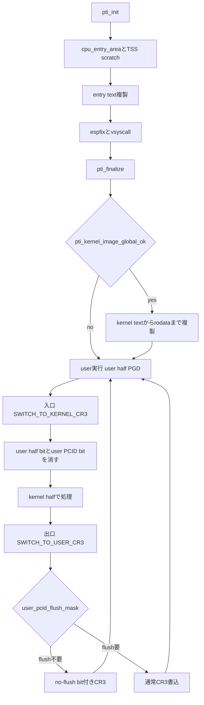

# 第28章 KPTI とページテーブル分離

> 本章で読むソース
>
> - [`arch/x86/mm/pti.c` L625-L669](https://github.com/gregkh/linux/blob/v6.18.38/arch/x86/mm/pti.c#L625-L669)
> - [`arch/x86/mm/pti.c` L678-L691](https://github.com/gregkh/linux/blob/v6.18.38/arch/x86/mm/pti.c#L678-L691)
> - [`arch/x86/mm/pti.c` L452-L478](https://github.com/gregkh/linux/blob/v6.18.38/arch/x86/mm/pti.c#L452-L478)
> - [`arch/x86/mm/pti.c` L512-L517](https://github.com/gregkh/linux/blob/v6.18.38/arch/x86/mm/pti.c#L512-L517)
> - [`arch/x86/mm/pti.c` L528-L564](https://github.com/gregkh/linux/blob/v6.18.38/arch/x86/mm/pti.c#L528-L564)
> - [`arch/x86/mm/pti.c` L570-L591](https://github.com/gregkh/linux/blob/v6.18.38/arch/x86/mm/pti.c#L570-L591)
> - [`arch/x86/mm/pti.c` L319-L396](https://github.com/gregkh/linux/blob/v6.18.38/arch/x86/mm/pti.c#L319-L396)
> - [`arch/x86/entry/calling.h` L157-L214](https://github.com/gregkh/linux/blob/v6.18.38/arch/x86/entry/calling.h#L157-L214)

## この章の狙い

**KPTI**（Kernel Page Table Isolation）が user と kernel のページテーブルを分離して Meltdown 系攻撃を緩和する仕組みを追う。
user page table への複製範囲、paired PGD と CR3 切替、PCID との連携を [第24章](24-virtual-address-layout-kaslr.md) と [第27章](27-tlb-pcid.md) の上に位置づける。

## 前提

[第27章](27-tlb-pcid.md) で PCID 付き CR3 切替と `user_pcid_flush_mask` を読んでいること。
[第12章](../part03-exceptions/12-normal-exceptions.md) や [第15章](../part04-syscall/15-entry-syscall-64.md) で入口アセンブリの CR3 切替を読んでいること。

## KPTI の目的

KPTI は user 実行時に kernel の大部分をページテーブルから外す。
投機実行が kernel データへ到達してもマッピングが存在しなければリーク経路を断てる。

実装は **8 KiB の PGD** を使い、user half と kernel half を bit 12 で切り替える。
カーネルは通常の kernel half を、user 実行時は user half を CR3 経由で選ぶ。

## pti_init と user page table への複製

`pti_init` はブート早期に user 可視のページテーブルへ必要最小限の kernel 領域を複製する。

[`arch/x86/mm/pti.c` L625-L669](https://github.com/gregkh/linux/blob/v6.18.38/arch/x86/mm/pti.c#L625-L669)

```c
void __init pti_init(void)
{
	if (!boot_cpu_has(X86_FEATURE_PTI))
		return;

	pr_info("enabled\n");

#ifdef CONFIG_X86_32
	/*
	 * We check for X86_FEATURE_PCID here. But the init-code will
	 * clear the feature flag on 32 bit because the feature is not
	 * supported on 32 bit anyway. To print the warning we need to
	 * check with cpuid directly again.
	 */
	if (cpuid_ecx(0x1) & BIT(17)) {
		/* Use printk to work around pr_fmt() */
		printk(KERN_WARNING "\n");
		printk(KERN_WARNING "************************************************************\n");
		printk(KERN_WARNING "** WARNING! WARNING! WARNING! WARNING! WARNING! WARNING!  **\n");
		printk(KERN_WARNING "**                                                        **\n");
		printk(KERN_WARNING "** You are using 32-bit PTI on a 64-bit PCID-capable CPU. **\n");
		printk(KERN_WARNING "** Your performance will increase dramatically if you     **\n");
		printk(KERN_WARNING "** switch to a 64-bit kernel!                             **\n");
		printk(KERN_WARNING "**                                                        **\n");
		printk(KERN_WARNING "** WARNING! WARNING! WARNING! WARNING! WARNING! WARNING!  **\n");
		printk(KERN_WARNING "************************************************************\n");
	}
#endif

	pti_clone_user_shared();

	/* Undo all global bits from the init pagetables in head_64.S: */
	pti_set_kernel_image_nonglobal();

	/* Replace some of the global bits just for shared entry text: */
	/*
	 * This is very early in boot. Device and Late initcalls can do
	 * modprobe before free_initmem() and mark_readonly(). This
	 * pti_clone_entry_text() allows those user-mode-helpers to function,
	 * but notably the text is still RW.
	 */
	pti_clone_entry_text(false);
	pti_setup_espfix64();
	pti_setup_vsyscall();
}
```

x86-64 の `pti_clone_user_shared` は **cpu_entry_area** と各 CPU の **TSS scratch**（syscall 入口用）を複製する。

[`arch/x86/mm/pti.c` L452-L478](https://github.com/gregkh/linux/blob/v6.18.38/arch/x86/mm/pti.c#L452-L478)

```c
static void __init pti_clone_user_shared(void)
{
	unsigned int cpu;

	pti_clone_p4d(CPU_ENTRY_AREA_BASE);

	for_each_possible_cpu(cpu) {
		/*
		 * The SYSCALL64 entry code needs one word of scratch space
		 * in which to spill a register.  It lives in the sp2 slot
		 * of the CPU's TSS.
		 *
		 * This is done for all possible CPUs during boot to ensure
		 * that it's propagated to all mms.
		 */

		unsigned long va = (unsigned long)&per_cpu(cpu_tss_rw, cpu);
		phys_addr_t pa = per_cpu_ptr_to_phys((void *)va);
		pte_t *target_pte;

		target_pte = pti_user_pagetable_walk_pte(va, false);
		if (WARN_ON(!target_pte))
			return;

		*target_pte = pfn_pte(pa >> PAGE_SHIFT, PAGE_KERNEL);
	}
}
```

加えて `pti_clone_entry_text` が entry text を、`pti_setup_espfix64` が espfix、`pti_setup_vsyscall` が vsyscall を複製する。
基本形は「syscall と例外入口に必要な最小限」であり、kernel 全体ではない。

[`arch/x86/mm/pti.c` L512-L517](https://github.com/gregkh/linux/blob/v6.18.38/arch/x86/mm/pti.c#L512-L517)

```c
static void pti_clone_entry_text(bool late)
{
	pti_clone_pgtable((unsigned long) __entry_text_start,
			  (unsigned long) __entry_text_end,
			  PTI_LEVEL_KERNEL_IMAGE, late);
}
```

## pti_finalize と条件付き kernel text 複製

`pti_finalize` は initcall 完了後に entry text を再複製し、条件を満たすときだけ kernel image の一部を user page table へ載せる。

[`arch/x86/mm/pti.c` L678-L691](https://github.com/gregkh/linux/blob/v6.18.38/arch/x86/mm/pti.c#L678-L691)

```c
void pti_finalize(void)
{
	if (!boot_cpu_has(X86_FEATURE_PTI))
		return;
	/*
	 * This is after free_initmem() (all initcalls are done) and we've done
	 * mark_readonly(). Text is now NX which might've split some PMDs
	 * relative to the early clone.
	 */
	pti_clone_entry_text(true);
	pti_clone_kernel_text();

	debug_checkwx_user();
}
```

`pti_clone_kernel_text` は `pti_kernel_image_global_ok` が真のときだけ `_text` から `__end_rodata_aligned` までを複製する。
PCID 有効、`pti=on`、K8、RANDSTRUCT では追加複製を行わない。

[`arch/x86/mm/pti.c` L528-L564](https://github.com/gregkh/linux/blob/v6.18.38/arch/x86/mm/pti.c#L528-L564)

```c
static inline bool pti_kernel_image_global_ok(void)
{
	/*
	 * Systems with PCIDs get little benefit from global
	 * kernel text and are not worth the downsides.
	 */
	if (cpu_feature_enabled(X86_FEATURE_PCID))
		return false;

	/*
	 * Only do global kernel image for pti=auto.  Do the most
	 * secure thing (not global) if pti=on specified.
	 */
	if (pti_mode != PTI_AUTO)
		return false;

	/*
	 * K8 may not tolerate the cleared _PAGE_RW on the userspace
	 * global kernel image pages.  Do the safe thing (disable
	 * global kernel image).  This is unlikely to ever be
	 * noticed because PTI is disabled by default on AMD CPUs.
	 */
	if (boot_cpu_has(X86_FEATURE_K8))
		return false;

	/*
	 * RANDSTRUCT derives its hardening benefits from the
	 * attacker's lack of knowledge about the layout of kernel
	 * data structures.  Keep the kernel image non-global in
	 * cases where RANDSTRUCT is in use to help keep the layout a
	 * secret.
	 */
	if (IS_ENABLED(CONFIG_RANDSTRUCT))
		return false;

	return true;
}
```

[`arch/x86/mm/pti.c` L570-L591](https://github.com/gregkh/linux/blob/v6.18.38/arch/x86/mm/pti.c#L570-L591)

```c
static void pti_clone_kernel_text(void)
{
	/*
	 * rodata is part of the kernel image and is normally
	 * readable on the filesystem or on the web.  But, do not
	 * clone the areas past rodata, they might contain secrets.
	 */
	unsigned long start = PFN_ALIGN(_text);
	unsigned long end_clone  = (unsigned long)__end_rodata_aligned;
	unsigned long end_global = PFN_ALIGN((unsigned long)_etext);

	if (!pti_kernel_image_global_ok())
		return;

	pr_debug("mapping partial kernel image into user address space\n");

	/*
	 * Note that this will undo _some_ of the work that
	 * pti_set_kernel_image_nonglobal() did to clear the
	 * global bit.
	 */
	pti_clone_pgtable(start, end_clone, PTI_LEVEL_KERNEL_IMAGE, false);
```

非 PCID 構成では TLB miss 削減のため条件付きで kernel text を user 側に載せる補助がある。
セキュリティ上の基本形は必要最小限の複製である。

## pti_clone_pgtable の共有方式

複製は kernel 側の下位テーブルを user 側 PGD に写す。
PMD レベルでは最下位ページテーブルを共有し、`_PAGE_GLOBAL` を両方に付ける場合がある。

[`arch/x86/mm/pti.c` L319-L396](https://github.com/gregkh/linux/blob/v6.18.38/arch/x86/mm/pti.c#L319-L396)

```c
pti_clone_pgtable(unsigned long start, unsigned long end,
		  enum pti_clone_level level, bool late_text)
{
	unsigned long addr;

	/*
	 * Clone the populated PMDs which cover start to end. These PMD areas
	 * can have holes.
	 */
	for (addr = start; addr < end;) {
		pte_t *pte, *target_pte;
		pmd_t *pmd, *target_pmd;
		pgd_t *pgd;
		p4d_t *p4d;
		pud_t *pud;

		/* Overflow check */
		if (addr < start)
			break;

		pgd = pgd_offset_k(addr);
		if (WARN_ON(pgd_none(*pgd)))
			return;
		p4d = p4d_offset(pgd, addr);
		if (WARN_ON(p4d_none(*p4d)))
			return;

		pud = pud_offset(p4d, addr);
		if (pud_none(*pud)) {
			WARN_ON_ONCE(addr & ~PUD_MASK);
			addr = round_up(addr + 1, PUD_SIZE);
			continue;
		}

		pmd = pmd_offset(pud, addr);
		if (pmd_none(*pmd)) {
			WARN_ON_ONCE(addr & ~PMD_MASK);
			addr = round_up(addr + 1, PMD_SIZE);
			continue;
		}

		if (pmd_leaf(*pmd) || level == PTI_CLONE_PMD) {
			target_pmd = pti_user_pagetable_walk_pmd(addr);
			if (WARN_ON(!target_pmd))
				return;

			/*
			 * Only clone present PMDs.  This ensures only setting
			 * _PAGE_GLOBAL on present PMDs.  This should only be
			 * called on well-known addresses anyway, so a non-
			 * present PMD would be a surprise.
			 */
			if (WARN_ON(!(pmd_flags(*pmd) & _PAGE_PRESENT)))
				return;

			/*
			 * Setting 'target_pmd' below creates a mapping in both
			 * the user and kernel page tables.  It is effectively
			 * global, so set it as global in both copies.  Note:
			 * the X86_FEATURE_PGE check is not _required_ because
			 * the CPU ignores _PAGE_GLOBAL when PGE is not
			 * supported.  The check keeps consistency with
			 * code that only set this bit when supported.
			 */
			if (boot_cpu_has(X86_FEATURE_PGE))
				*pmd = pmd_set_flags(*pmd, _PAGE_GLOBAL);

			/*
			 * Copy the PMD.  That is, the kernelmode and usermode
			 * tables will share the last-level page tables of this
			 * address range
			 */
			*target_pmd = *pmd;

			addr = round_up(addr + 1, PMD_SIZE);

		} else if (level == PTI_CLONE_PTE) {
```

## paired PGD と SWITCH_TO_KERNEL_CR3

KPTI の PGD は 8 KiB で、bit 12（`PTI_USER_PGTABLE_BIT`）で user half と kernel half を選ぶ。
user PCID bit（`PTI_USER_PCID_BIT`）は別の役割で、PCID 空間の user 側を指す。

[`arch/x86/entry/calling.h` L157-L214](https://github.com/gregkh/linux/blob/v6.18.38/arch/x86/entry/calling.h#L157-L214)

```asm
#define PTI_USER_PGTABLE_BIT		PAGE_SHIFT
#define PTI_USER_PGTABLE_MASK		(1 << PTI_USER_PGTABLE_BIT)
#define PTI_USER_PCID_BIT		X86_CR3_PTI_PCID_USER_BIT
#define PTI_USER_PCID_MASK		(1 << PTI_USER_PCID_BIT)
#define PTI_USER_PGTABLE_AND_PCID_MASK  (PTI_USER_PCID_MASK | PTI_USER_PGTABLE_MASK)

.macro SET_NOFLUSH_BIT	reg:req
	bts	$X86_CR3_PCID_NOFLUSH_BIT, \reg
.endm

.macro ADJUST_KERNEL_CR3 reg:req
	ALTERNATIVE "", "SET_NOFLUSH_BIT \reg", X86_FEATURE_PCID
	/* Clear PCID and "MITIGATION_PAGE_TABLE_ISOLATION bit", point CR3 at kernel pagetables: */
	andq    $(~PTI_USER_PGTABLE_AND_PCID_MASK), \reg
.endm

.macro SWITCH_TO_KERNEL_CR3 scratch_reg:req
	ALTERNATIVE "jmp .Lend_\@", "", X86_FEATURE_PTI
	mov	%cr3, \scratch_reg
	ADJUST_KERNEL_CR3 \scratch_reg
	mov	\scratch_reg, %cr3
.Lend_\@:
.endm

#define THIS_CPU_user_pcid_flush_mask   \
	PER_CPU_VAR(cpu_tlbstate + TLB_STATE_user_pcid_flush_mask)

.macro SWITCH_TO_USER_CR3 scratch_reg:req scratch_reg2:req
	mov	%cr3, \scratch_reg

	ALTERNATIVE "jmp .Lwrcr3_\@", "", X86_FEATURE_PCID

	/*
	 * Test if the ASID needs a flush.
	 */
	movq	\scratch_reg, \scratch_reg2
	andq	$(0x7FF), \scratch_reg		/* mask ASID */
	bt	\scratch_reg, THIS_CPU_user_pcid_flush_mask
	jnc	.Lnoflush_\@

	/* Flush needed, clear the bit */
	btr	\scratch_reg, THIS_CPU_user_pcid_flush_mask
	movq	\scratch_reg2, \scratch_reg
	jmp	.Lwrcr3_pcid_\@

.Lnoflush_\@:
	movq	\scratch_reg2, \scratch_reg
	SET_NOFLUSH_BIT \scratch_reg

.Lwrcr3_pcid_\@:
	/* Flip the ASID to the user version */
	orq	$(PTI_USER_PCID_MASK), \scratch_reg

.Lwrcr3_\@:
	/* Flip the PGD to the user version */
	orq     $(PTI_USER_PGTABLE_MASK), \scratch_reg
	mov	\scratch_reg, %cr3
.endm
```

**SWITCH_TO_KERNEL_CR3** は user half 選択 bit と user PCID bit を消し、kernel half を選ぶ。
**SWITCH_TO_USER_CR3** は両方を立て、user half と user PCID へ戻す。
syscall や例外の入口で前者、user へ戻る直前で後者を使う。

PCID 有効時は `user_pcid_flush_mask` を検査し、flush 不要なら `SET_NOFLUSH_BIT` で CR3 no-flush bit を立てて TLB flush を避ける。
PGD 選択 bit と PCID bit は別物であり、混同してはならない。

## 処理の流れ：KPTI と CR3 切替



## 高速化と最適化の工夫

user half PGD から kernel の大部分を unmap することで Meltdown 系の投機読み取り経路を断つ。
セキュリティ上の主目的であるが、副作用として user 実行時に参照可能な kernel 領域が最小化される。

user PCID bit と CR3 no-flush bit により、KPTI の CR3 切替で毎回 TLB を全 flush しなくてよい。
`user_pcid_flush_mask` が flush 要否を記録し、不要なら `SET_NOFLUSH_BIT` で切替コストを抑える（第27章の PCID 機構と連動）。

## まとめ

- KPTI は user と kernel のページテーブルを分離し、user 実行時に kernel 大部分を unmap する Meltdown 緩和である。
- `pti_init` は cpu_entry_area、TSS scratch、entry text、espfix、vsyscall を user page table へ複製する。
- `pti_finalize` は条件付きで kernel text から rodata までを追加複製し、PCID 有効などでは行わない。
- paired 8 KiB PGD の bit 12 で user half と kernel half を切り替え、入口と出口のマクロが CR3 を書き換える。
- PGD 選択 bit と user PCID bit は別であり、PCID 有効時は no-flush bit で切替時の TLB flush を避けられる。

## 関連する章

- [仮想アドレス配置と KASLR](24-virtual-address-layout-kaslr.md)
- [TLB flush と lazy TLB と PCID](27-tlb-pcid.md)
- [entry_SYSCALL_64](../part04-syscall/15-entry-syscall-64.md)
- [通常例外の入口と dispatch](../part03-exceptions/12-normal-exceptions.md)
