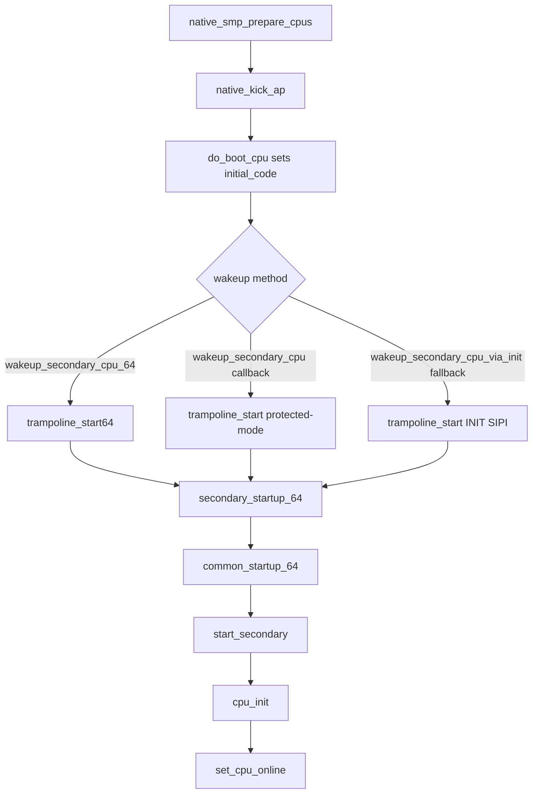

# 第29章 SMP ブート BSP から AP 起動

> 本章で読むソース
>
> - [`arch/x86/kernel/smpboot.c` L232-L316](https://github.com/gregkh/linux/blob/v6.18.38/arch/x86/kernel/smpboot.c#L232-L316)
> - [`arch/x86/kernel/smpboot.c` L695-L715](https://github.com/gregkh/linux/blob/v6.18.38/arch/x86/kernel/smpboot.c#L695-L715)
> - [`arch/x86/kernel/smpboot.c` L842-L906](https://github.com/gregkh/linux/blob/v6.18.38/arch/x86/kernel/smpboot.c#L842-L906)
> - [`arch/x86/kernel/smpboot.c` L908-L945](https://github.com/gregkh/linux/blob/v6.18.38/arch/x86/kernel/smpboot.c#L908-L945)
> - [`arch/x86/kernel/smpboot.c` L1029-L1039](https://github.com/gregkh/linux/blob/v6.18.38/arch/x86/kernel/smpboot.c#L1029-L1039)
> - [`arch/x86/kernel/smpboot.c` L1047-L1079](https://github.com/gregkh/linux/blob/v6.18.38/arch/x86/kernel/smpboot.c#L1047-L1079)
> - [`arch/x86/realmode/init.c` L47-L71](https://github.com/gregkh/linux/blob/v6.18.38/arch/x86/realmode/init.c#L47-L71)
> - [`arch/x86/realmode/init.c` L92-L175](https://github.com/gregkh/linux/blob/v6.18.38/arch/x86/realmode/init.c#L92-L175)
> - [`arch/x86/realmode/rm/trampoline_64.S` L61-L96](https://github.com/gregkh/linux/blob/v6.18.38/arch/x86/realmode/rm/trampoline_64.S#L61-L96)
> - [`arch/x86/realmode/rm/trampoline_64.S` L214-L248](https://github.com/gregkh/linux/blob/v6.18.38/arch/x86/realmode/rm/trampoline_64.S#L214-L248)
> - [`arch/x86/kernel/head_64.S` L147-L198](https://github.com/gregkh/linux/blob/v6.18.38/arch/x86/kernel/head_64.S#L147-L198)
> - [`arch/x86/kernel/head_64.S` L415-L418](https://github.com/gregkh/linux/blob/v6.18.38/arch/x86/kernel/head_64.S#L415-L418)

## この章の狙い

**BSP**（Boot Strap Processor）が各 **AP**（Application Processor）を起動し `set_cpu_online` で online にする SMP ブート経路を追う。
低位メモリ trampoline の予約と設定、wakeup 方式の選択、ロングモード合流から `start_secondary` までをソースで結ぶ。

## 前提

[第5章](../part01-boot/05-head-64-startup.md) で `secondary_startup_64` と `common_startup_64` を読んでいること。
[第9章](../part02-cpu-init/09-cpu-init-cr-msr.md) で `cpu_init` の役割を押さえていること。

## BSP による AP 起動の全体像

SMP ブートの基本形は、BSP が各 AP を順に起動して online にすることである。
`native_smp_prepare_cpus` が APIC モードを確認し、sibling マップ、per-CPU タイマ、INIT delay などの準備を済ませる。
その後 hotplug コアが `native_kick_ap` を呼び、対象 CPU ごとに idle タスクとスタックを整えてから wakeup を送る。

対応プラットフォームでは並列 bring-up が既定であり、`__cpuhp_parallel_bringup` と `x86_cpuinit.parallel_bringup` がともに真のとき複数 AP を同時に起動経路へ入れる。
`arch_cpuhp_init_parallel_bringup` は `x86_cpuinit.parallel_bringup` が真のときだけ `STARTUP_READ_APICID` を `smpboot_control` に立て、複数 AP が同時に起動経路へ入れる。
`cpuhp.parallel=` で無効化された場合や、AMD SEV や Intel TDX など一部環境で `parallel_bringup` が偽にされた場合は、full per-CPU の逐次 bring-up へフォールバックする。

[`arch/x86/kernel/smpboot.c` L1029-L1039](https://github.com/gregkh/linux/blob/v6.18.38/arch/x86/kernel/smpboot.c#L1029-L1039)

```c
bool __init arch_cpuhp_init_parallel_bringup(void)
{
	if (!x86_cpuinit.parallel_bringup) {
		pr_info("Parallel CPU startup disabled by the platform\n");
		return false;
	}

	smpboot_control = STARTUP_READ_APICID;
	pr_debug("Parallel CPU startup enabled: 0x%08x\n", smpboot_control);
	return true;
}
```

[`arch/x86/kernel/smpboot.c` L1047-L1079](https://github.com/gregkh/linux/blob/v6.18.38/arch/x86/kernel/smpboot.c#L1047-L1079)

```c
void __init native_smp_prepare_cpus(unsigned int max_cpus)
{
	smp_prepare_cpus_common();

	switch (apic_intr_mode) {
	case APIC_PIC:
	case APIC_VIRTUAL_WIRE_NO_CONFIG:
		disable_smp();
		return;
	case APIC_SYMMETRIC_IO_NO_ROUTING:
		disable_smp();
		/* Setup local timer */
		x86_init.timers.setup_percpu_clockev();
		return;
	case APIC_VIRTUAL_WIRE:
	case APIC_SYMMETRIC_IO:
		break;
	}

	/* Setup local timer */
	x86_init.timers.setup_percpu_clockev();

	pr_info("CPU0: ");
	print_cpu_info(&cpu_data(0));

	uv_system_init();

	smp_set_init_udelay();

	speculative_store_bypass_ht_init();

	snp_set_wakeup_secondary_cpu();
}
```

## reserve_real_mode と setup_real_mode の分担

trampoline 用の低位メモリは、予約と内容設定で担当が分かれる。
`reserve_real_mode` は slab 利用前に 1MiB 未満から物理領域を確保し、失敗時はメッセージを出すだけで続行する。
あわせて先頭 1MiB 全体を `memblock_reserve` し、AP 用 real-mode コードが実行可能な範囲を守る。

`setup_real_mode` は確保済み領域へ blob をコピーし、セグメントと線形アドレスの relocation を行う。
64bit では trampoline header に EFER（LMA をマスク）、`secondary_startup_64` 入口、CR4 機能、`trampoline_pgd` へのマッピングを書き込む。
両関数が同じ役割で低位配置を担うわけではなく、予約は早期 memblock、設定は `init_real_mode` 経由の後段である。

[`arch/x86/realmode/init.c` L47-L71](https://github.com/gregkh/linux/blob/v6.18.38/arch/x86/realmode/init.c#L47-L71)

```c
void __init reserve_real_mode(void)
{
	phys_addr_t mem;
	size_t size = real_mode_size_needed();

	if (!size)
		return;

	WARN_ON(slab_is_available());

	/* Has to be under 1M so we can execute real-mode AP code. */
	mem = memblock_phys_alloc_range(size, PAGE_SIZE, 0, 1<<20);
	if (!mem)
		pr_info("No sub-1M memory is available for the trampoline\n");
	else
		set_real_mode_mem(mem);

	/*
	 * Unconditionally reserve the entire first 1M, see comment in
	 * setup_arch().
	 */
	memblock_reserve(0, SZ_1M);

	memblock_clear_kho_scratch(0, SZ_1M);
}
```

[`arch/x86/realmode/init.c` L92-L175](https://github.com/gregkh/linux/blob/v6.18.38/arch/x86/realmode/init.c#L92-L175)

```c
static void __init setup_real_mode(void)
{
	u16 real_mode_seg;
	const u32 *rel;
	u32 count;
	unsigned char *base;
	unsigned long phys_base;
	struct trampoline_header *trampoline_header;
	size_t size = PAGE_ALIGN(real_mode_blob_end - real_mode_blob);
#ifdef CONFIG_X86_64
	u64 *trampoline_pgd;
	u64 efer;
	int i;
#endif

	base = (unsigned char *)real_mode_header;

	// ... (中略) ...

	memcpy(base, real_mode_blob, size);

	phys_base = __pa(base);
	real_mode_seg = phys_base >> 4;

	rel = (u32 *) real_mode_relocs;

	/* 16-bit segment relocations. */
	count = *rel++;
	while (count--) {
		u16 *seg = (u16 *) (base + *rel++);
		*seg = real_mode_seg;
	}

	/* 32-bit linear relocations. */
	count = *rel++;
	while (count--) {
		u32 *ptr = (u32 *) (base + *rel++);
		*ptr += phys_base;
	}

	/* Must be performed *after* relocation. */
	trampoline_header = (struct trampoline_header *)
		__va(real_mode_header->trampoline_header);

#ifdef CONFIG_X86_32
	trampoline_header->start = __pa_symbol(startup_32_smp);
	trampoline_header->gdt_limit = __BOOT_DS + 7;
	trampoline_header->gdt_base = __pa_symbol(boot_gdt);
#else
	/*
	 * Some AMD processors will #GP(0) if EFER.LMA is set in WRMSR
	 * so we need to mask it out.
	 */
	rdmsrq(MSR_EFER, efer);
	trampoline_header->efer = efer & ~EFER_LMA;

	trampoline_header->start = (u64) secondary_startup_64;
	trampoline_cr4_features = &trampoline_header->cr4;
	*trampoline_cr4_features = mmu_cr4_features;

	trampoline_header->flags = 0;

	trampoline_lock = &trampoline_header->lock;
	*trampoline_lock = 0;

	trampoline_pgd = (u64 *) __va(real_mode_header->trampoline_pgd);

	/* Map the real mode stub as virtual == physical */
	trampoline_pgd[0] = trampoline_pgd_entry.pgd;

	/*
	 * Include the entirety of the kernel mapping into the trampoline
	 * PGD.  This way, all mappings present in the normal kernel page
	 * tables are usable while running on trampoline_pgd.
	 */
	for (i = pgd_index(__PAGE_OFFSET); i < PTRS_PER_PGD; i++)
		trampoline_pgd[i] = init_top_pgt[i].pgd;
#endif

	sme_sev_setup_real_mode(trampoline_header);
}
```

## native_kick_ap と do_boot_cpu による wakeup 選択

`native_kick_ap` は APIC ID の妥当性と `phys_cpu_present_map` を検査する。
MTRR 状態を保存し、per-CPU の FPU owner を空にしてから `common_cpu_up` で idle タスクと割り込みスタックを用意する。
準備が終わると `do_boot_cpu` を呼び、そこで `initial_code` が `start_secondary` に設定される。

wakeup 自体は APIC ドライバのコールバック優先である。
64bit 直接起動 `wakeup_secondary_cpu_64` があれば `start_ip` に `trampoline_start64` を使う。
なければ protected mode 経由の `wakeup_secondary_cpu`、最後の fallback として `wakeup_secondary_cpu_via_init` が INIT deassert と最大2回の SIPI を送る。
INIT と SIPI は legacy fallback 専用であり、64bit callback 経路では使われない。

[`arch/x86/kernel/smpboot.c` L908-L945](https://github.com/gregkh/linux/blob/v6.18.38/arch/x86/kernel/smpboot.c#L908-L945)

```c
int native_kick_ap(unsigned int cpu, struct task_struct *tidle)
{
	u32 apicid = apic->cpu_present_to_apicid(cpu);
	int err;

	lockdep_assert_irqs_enabled();

	pr_debug("++++++++++++++++++++=_---CPU UP  %u\n", cpu);

	if (apicid == BAD_APICID || !apic_id_valid(apicid)) {
		pr_err("CPU %u has invalid APIC ID %x. Aborting bringup\n", cpu, apicid);
		return -EINVAL;
	}

	if (!test_bit(apicid, phys_cpu_present_map)) {
		pr_err("CPU %u APIC ID %x is not present. Aborting bringup\n", cpu, apicid);
		return -EINVAL;
	}

	/*
	 * Save current MTRR state in case it was changed since early boot
	 * (e.g. by the ACPI SMI) to initialize new CPUs with MTRRs in sync:
	 */
	mtrr_save_state();

	/* the FPU context is blank, nobody can own it */
	per_cpu(fpu_fpregs_owner_ctx, cpu) = NULL;

	err = common_cpu_up(cpu, tidle);
	if (err)
		return err;

	err = do_boot_cpu(apicid, cpu, tidle);
	if (err)
		pr_err("do_boot_cpu failed(%d) to wakeup CPU#%u\n", err, cpu);

	return err;
}
```

[`arch/x86/kernel/smpboot.c` L842-L906](https://github.com/gregkh/linux/blob/v6.18.38/arch/x86/kernel/smpboot.c#L842-L906)

```c
static int do_boot_cpu(u32 apicid, unsigned int cpu, struct task_struct *idle)
{
	unsigned long start_ip = real_mode_header->trampoline_start;
	int ret;

#ifdef CONFIG_X86_64
	/* If 64-bit wakeup method exists, use the 64-bit mode trampoline IP */
	if (apic->wakeup_secondary_cpu_64)
		start_ip = real_mode_header->trampoline_start64;
#endif
	idle->thread.sp = (unsigned long)task_pt_regs(idle);
	initial_code = (unsigned long)start_secondary;

	// ... (中略) ...

	smp_mb();

	/*
	 * Wake up a CPU in difference cases:
	 * - Use a method from the APIC driver if one defined, with wakeup
	 *   straight to 64-bit mode preferred over wakeup to RM.
	 * Otherwise,
	 * - Use an INIT boot APIC message
	 */
	if (apic->wakeup_secondary_cpu_64)
		ret = apic->wakeup_secondary_cpu_64(apicid, start_ip, cpu);
	else if (apic->wakeup_secondary_cpu)
		ret = apic->wakeup_secondary_cpu(apicid, start_ip, cpu);
	else
		ret = wakeup_secondary_cpu_via_init(apicid, start_ip, cpu);

	/* If the wakeup mechanism failed, cleanup the warm reset vector */
	if (ret)
		arch_cpuhp_cleanup_kick_cpu(cpu);
	return ret;
}
```

legacy fallback の SIPI 回数は統合 APIC なら2回、それ以外は0回である。

[`arch/x86/kernel/smpboot.c` L695-L715](https://github.com/gregkh/linux/blob/v6.18.38/arch/x86/kernel/smpboot.c#L695-L715)

```c
static int wakeup_secondary_cpu_via_init(u32 phys_apicid, unsigned long start_eip, unsigned int cpu)
{
	unsigned long send_status = 0, accept_status = 0;
	int num_starts, j, maxlvt;

	preempt_disable();
	maxlvt = lapic_get_maxlvt();
	send_init_sequence(phys_apicid);

	mb();

	/*
	 * Should we send STARTUP IPIs ?
	 *
	 * Determine this based on the APIC version.
	 * If we don't have an integrated APIC, don't send the STARTUP IPIs.
	 */
	if (APIC_INTEGRATED(boot_cpu_apic_version))
		num_starts = 2;
	else
		num_starts = 0;
```

## AP の入口経路と secondary_startup_64 への合流

legacy INIT/SIPI 経路では AP は sub-1MiB の `trampoline_start` から real mode で入る。
`verify_cpu` のあと保護モードへ上がり、32bit 段を経てロングモードとページングを有効にする。
trampoline header の `start` が指す `secondary_startup_64` へ進む。

64bit wakeup callback がある場合は `trampoline_start64` が入口である。
ページングモードが一致すればそのまま64bitで `trampoline_pgd` を CR3 に載せ、`secondary_startup_64` へ `lretq` する。
4レベルと5レベルの不一致時は compatibility mode でページングを切り替えてから合流する。

どちらの経路も `secondary_startup_64` で `init_top_pgt` へ CR3 を切り替え、`common_startup_64` を共有する。
最後に `initial_code` 経由で C の `start_secondary` が呼ばれる。

[`arch/x86/realmode/rm/trampoline_64.S` L61-L96](https://github.com/gregkh/linux/blob/v6.18.38/arch/x86/realmode/rm/trampoline_64.S#L61-L96)

```asm
SYM_CODE_START(trampoline_start)
	cli			# We should be safe anyway
	wbinvd

	LJMPW_RM(1f)
1:
	mov	%cs, %ax	# Code and data in the same place
	mov	%ax, %ds
	mov	%ax, %es
	mov	%ax, %ss

	LOCK_AND_LOAD_REALMODE_ESP

	call	verify_cpu		# Verify the cpu supports long mode
	testl   %eax, %eax		# Check for return code
	jnz	no_longmode

.Lswitch_to_protected:
	// ... (中略) ...

	lidtl	tr_idt	# load idt with 0, 0
	lgdtl	tr_gdt	# load gdt with whatever is appropriate

	movw	$__KERNEL_DS, %dx	# Data segment descriptor

	/* Enable protected mode */
	movl	$(CR0_STATE & ~X86_CR0_PG), %eax
	movl	%eax, %cr0		# into protected mode

	/* flush prefetch and jump to startup_32 */
	ljmpl	$__KERNEL32_CS, $pa_startup_32
```

[`arch/x86/realmode/rm/trampoline_64.S` L214-L248](https://github.com/gregkh/linux/blob/v6.18.38/arch/x86/realmode/rm/trampoline_64.S#L214-L248)

```asm
SYM_CODE_START(trampoline_start64)
	/*
	 * APs start here on a direct transfer from 64-bit BIOS with identity
	 * mapped page tables.  Load the kernel's GDT in order to gear down to
	 * 32-bit mode (to handle 4-level vs. 5-level paging), and to (re)load
	 * segment registers.  Load the zero IDT so any fault triggers a
	 * shutdown instead of jumping back into BIOS.
	 */
	lidt	tr_idt(%rip)
	lgdt	tr_gdt64(%rip)

	/* Check if paging mode has to be changed */
	movq	%cr4, %rax
	xorl	tr_cr4(%rip), %eax
	testl	$X86_CR4_LA57, %eax
	jnz	.L_switch_paging

	/* Paging mode is correct proceed in 64-bit mode */

	LOCK_AND_LOAD_REALMODE_ESP lock_rip=1

	movw	$__KERNEL_DS, %dx
	movl	%edx, %ss
	addl	$pa_real_mode_base, %esp
	movl	%edx, %ds
	movl	%edx, %es
	movl	%edx, %fs
	movl	%edx, %gs

	movl	$pa_trampoline_pgd, %eax
	movq	%rax, %cr3

	pushq	$__KERNEL_CS
	pushq	tr_start(%rip)
	lretq
```

[`arch/x86/kernel/head_64.S` L147-L198](https://github.com/gregkh/linux/blob/v6.18.38/arch/x86/kernel/head_64.S#L147-L198)

```asm
SYM_CODE_START(secondary_startup_64)
	UNWIND_HINT_END_OF_STACK
	ANNOTATE_NOENDBR
	/*
	 * At this point the CPU runs in 64bit mode CS.L = 1 CS.D = 0,
	 * and someone has loaded a mapped page table.
	 *
	 * We come here either from startup_64 (using physical addresses)
	 * or from trampoline.S (using virtual addresses).
	 */

	/* Sanitize CPU configuration */
	call verify_cpu

SYM_INNER_LABEL(secondary_startup_64_no_verify, SYM_L_GLOBAL)
	UNWIND_HINT_END_OF_STACK
	ANNOTATE_NOENDBR

	/* Clear %R15 which holds the boot_params pointer on the boot CPU */
	xorl	%r15d, %r15d

	/* Derive the runtime physical address of init_top_pgt[] */
	movq	phys_base(%rip), %rax
	addq	$(init_top_pgt - __START_KERNEL_map), %rax

	movq	%rax, %cr3

SYM_INNER_LABEL(common_startup_64, SYM_L_LOCAL)
	UNWIND_HINT_END_OF_STACK
	ANNOTATE_NOENDBR
```

[`arch/x86/kernel/head_64.S` L415-L418](https://github.com/gregkh/linux/blob/v6.18.38/arch/x86/kernel/head_64.S#L415-L418)

```asm
.Ljump_to_C_code:
	xorl	%ebp, %ebp	# clear frame pointer
	ANNOTATE_RETPOLINE_SAFE
	callq	*initial_code(%rip)
```

## start_secondary から online まで

`start_secondary` は trampoline 直後の C 入口である。
`cr4_init` と例外処理の初期化のあと、同期点より前に `load_ucode_ap` でマイクロコードを載せる。
`cpuhp_ap_sync_alive` で hotplug コアと同期し、並列 bring-up 時はここで BSP 側の解放を待つ。
その後 `cpu_init`（第9章）と FPU 初期化、TSC 同期、APIC の online 設定を経て `set_cpu_online` する。

[`arch/x86/kernel/smpboot.c` L232-L316](https://github.com/gregkh/linux/blob/v6.18.38/arch/x86/kernel/smpboot.c#L232-L316)

```c
static void notrace __noendbr start_secondary(void *unused)
{
	cr4_init();

	if (IS_ENABLED(CONFIG_X86_32)) {
		/* switch away from the initial page table */
		load_cr3(swapper_pg_dir);
		__flush_tlb_all();
	}

	cpu_init_exception_handling(false);

	load_ucode_ap();

	cpuhp_ap_sync_alive();

	cpu_init();
	fpu__init_cpu();
	rcutree_report_cpu_starting(raw_smp_processor_id());
	x86_cpuinit.early_percpu_clock_init();

	ap_starting();

	check_tsc_sync_target();

	ap_calibrate_delay();

	speculative_store_bypass_ht_init();

	lock_vector_lock();
	set_cpu_online(smp_processor_id(), true);
	lapic_online();
	unlock_vector_lock();
	x86_platform.nmi_init();

	local_irq_enable();

	x86_cpuinit.setup_percpu_clockev();

	wmb();
	cpu_startup_entry(CPUHP_AP_ONLINE_IDLE);
}
```

## 処理フロー



## 高速化と最適化の工夫

legacy 経路と64bit 直接 wakeup は入口が異なるが、最終的に `secondary_startup_64` と `common_startup_64` を再利用する。
CPU ごとに別の C 初期化ルーチンを持たず、BSP と同じアセンブリ合流点へ寄せる設計である。
並列 bring-up が有効なときは `STARTUP_READ_APICID` により複数 AP が同時に起動し、BSP が逐次待つコストを下げられる。
マイクロコード読み込みを `cpuhp_ap_sync_alive` より前に置くことで、並列起動時の直列化区間を短くしている。

## まとめ

SMP ブートは BSP が各 AP を起動し `set_cpu_online` で online にする流れである。
`reserve_real_mode` は低位領域の予約、`setup_real_mode` は blob 配置と trampoline header 設定を担う。
`do_boot_cpu` は64bit callback、protected mode wakeup、INIT/SIPI fallback の順で方式を選ぶ。
legacy 経路は `trampoline_start` から、64bit 経路は `trampoline_start64` から `secondary_startup_64` へ合流する。
`start_secondary` は `cpuhp_ap_sync_alive` と `cpu_init` を経て online 通知を行う。

## 関連する章

- [第5章 head_64.S の startup_64](../part01-boot/05-head-64-startup.md)
- [第9章 CPU ごとの記述子表と CR と MSR 初期化](../part02-cpu-init/09-cpu-init-cr-msr.md)
- [第18章 Local APIC とタイマと IPI](../part05-apic/18-local-apic-timer-ipi.md)
