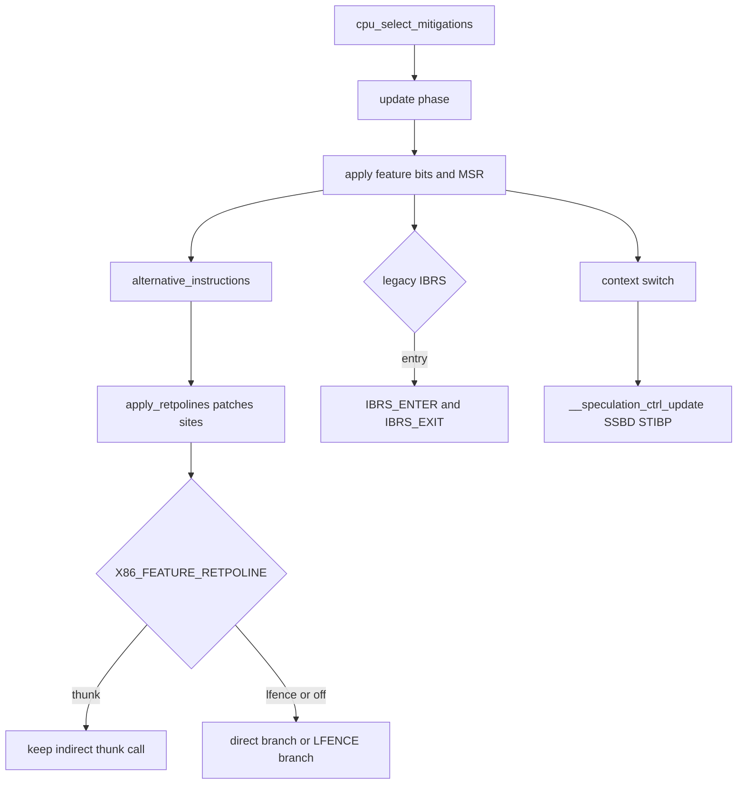

# 第30章 投機実行緩和策と実行時制御

> 本章で読むソース
>
> - [`arch/x86/kernel/cpu/bugs.c` L236-L327](https://github.com/gregkh/linux/blob/v6.18.38/arch/x86/kernel/cpu/bugs.c#L236-L327)
> - [`arch/x86/kernel/cpu/bugs.c` L1197-L1204](https://github.com/gregkh/linux/blob/v6.18.38/arch/x86/kernel/cpu/bugs.c#L1197-L1204)
> - [`arch/x86/kernel/cpu/bugs.c` L1366-L1428](https://github.com/gregkh/linux/blob/v6.18.38/arch/x86/kernel/cpu/bugs.c#L1366-L1428)
> - [`arch/x86/kernel/cpu/bugs.c` L2268-L2365](https://github.com/gregkh/linux/blob/v6.18.38/arch/x86/kernel/cpu/bugs.c#L2268-L2365)
> - [`arch/x86/kernel/cpu/bugs.c` L2386-L2421](https://github.com/gregkh/linux/blob/v6.18.38/arch/x86/kernel/cpu/bugs.c#L2386-L2421)
> - [`arch/x86/kernel/alternative.c` L888-L948](https://github.com/gregkh/linux/blob/v6.18.38/arch/x86/kernel/alternative.c#L888-L948)
> - [`arch/x86/kernel/alternative.c` L954-L1010](https://github.com/gregkh/linux/blob/v6.18.38/arch/x86/kernel/alternative.c#L954-L1010)
> - [`arch/x86/kernel/alternative.c` L2400-L2415](https://github.com/gregkh/linux/blob/v6.18.38/arch/x86/kernel/alternative.c#L2400-L2415)
> - [`arch/x86/kernel/process.c` L638-L669](https://github.com/gregkh/linux/blob/v6.18.38/arch/x86/kernel/process.c#L638-L669)
> - [`arch/x86/entry/calling.h` L305-L328](https://github.com/gregkh/linux/blob/v6.18.38/arch/x86/entry/calling.h#L305-L328)
> - [`arch/x86/entry/calling.h` L334-L349](https://github.com/gregkh/linux/blob/v6.18.38/arch/x86/entry/calling.h#L334-L349)

## この章の狙い

CPU の投機実行脆弱性（Spectre、Meltdown、RETBleed など）に対し、ブート時に緩和策を選び実行時に適用する横断機構を追う。
`cpu_select_mitigations` の select、update、apply の流れ、retpoline の text patch、`SPEC_CTRL` MSR の用途分担をソースで結ぶ。

## 前提

[第10章](../part02-cpu-init/10-alternatives-static-call.md) で `alternative_instructions` と `static_call` の役割を読んでいること。
[第28章](../part07-paging/28-kpti.md) で KPTI と CR3 と PCID を、[第9章](../part02-cpu-init/09-cpu-init-cr-msr.md) で CR と MSR 初期化の基礎を押さえていること。
緩和策の中核となる `SPEC_CTRL` MSR は本章で導入する。

## cpu_select_mitigations の束ね方

`cpu_select_mitigations` は alternatives patching より前に呼ばれる。
まず `MSR_IA32_SPEC_CTRL` のベース値を読み、攻撃ベクタ表示のあと脆弱性ごとの `select` を順に実行する。
依存関係のある選択は `update` フェーズで再調整され、最後に `apply` で feature bit や MSR を設定する。
コマンドラインの `spectre_v2=` や `retbleed=`、仮想化ゲスト条件、CPU 機能の有無が各 `select` の分岐に効く。

[`arch/x86/kernel/cpu/bugs.c` L236-L327](https://github.com/gregkh/linux/blob/v6.18.38/arch/x86/kernel/cpu/bugs.c#L236-L327)

```c
void __init cpu_select_mitigations(void)
{
	if (cpu_feature_enabled(X86_FEATURE_MSR_SPEC_CTRL)) {
		rdmsrq(MSR_IA32_SPEC_CTRL, x86_spec_ctrl_base);

		x86_spec_ctrl_base &= ~SPEC_CTRL_MITIGATIONS_MASK;
	}

	x86_arch_cap_msr = x86_read_arch_cap_msr();

	cpu_print_attack_vectors();

	/* Select the proper CPU mitigations before patching alternatives: */
	spectre_v1_select_mitigation();
	spectre_v2_select_mitigation();
	retbleed_select_mitigation();
	spectre_v2_user_select_mitigation();
	ssb_select_mitigation();
	l1tf_select_mitigation();
	mds_select_mitigation();
	taa_select_mitigation();
	mmio_select_mitigation();
	rfds_select_mitigation();
	srbds_select_mitigation();
	l1d_flush_select_mitigation();
	srso_select_mitigation();
	gds_select_mitigation();
	its_select_mitigation();
	bhi_select_mitigation();
	tsa_select_mitigation();
	vmscape_select_mitigation();

	spectre_v2_update_mitigation();
	retbleed_update_mitigation();
	its_update_mitigation();
	spectre_v2_user_update_mitigation();
	mds_update_mitigation();
	taa_update_mitigation();
	mmio_update_mitigation();
	rfds_update_mitigation();
	bhi_update_mitigation();
	srso_update_mitigation();
	vmscape_update_mitigation();

	spectre_v1_apply_mitigation();
	spectre_v2_apply_mitigation();
	retbleed_apply_mitigation();
	spectre_v2_user_apply_mitigation();
	ssb_apply_mitigation();
	l1tf_apply_mitigation();
	mds_apply_mitigation();
	taa_apply_mitigation();
	mmio_apply_mitigation();
	rfds_apply_mitigation();
	srbds_apply_mitigation();
	srso_apply_mitigation();
	gds_apply_mitigation();
	its_apply_mitigation();
	bhi_apply_mitigation();
	tsa_apply_mitigation();
	vmscape_apply_mitigation();
}
```

Spectre v1 は bug フラグと `should_mitigate_vuln` で無効化できる。

[`arch/x86/kernel/cpu/bugs.c` L1197-L1204](https://github.com/gregkh/linux/blob/v6.18.38/arch/x86/kernel/cpu/bugs.c#L1197-L1204)

```c
static void __init spectre_v1_select_mitigation(void)
{
	if (!boot_cpu_has_bug(X86_BUG_SPECTRE_V1))
		spectre_v1_mitigation = SPECTRE_V1_MITIGATION_NONE;

	if (!should_mitigate_vuln(X86_BUG_SPECTRE_V1))
		spectre_v1_mitigation = SPECTRE_V1_MITIGATION_NONE;
}
```

## spectre_v2 と RETBleed の選択

`spectre_v2_select_mitigation` はコマンドライン指定と CPU 機能を検証し、Enhanced IBRS や retpoline 系へ振り分ける。
`retbleed_select_mitigation` はベンダごとに UNRET、IBPB、IBRS などを選び、Intel では後段の `retbleed_update_mitigation` が spectre_v2 の選択と連動する。
RETBleed は BTB 汚染全般を防ぐ万能策ではなく、追加の `retbleed=` や IBPB、UNRET など個別選択が要る。

[`arch/x86/kernel/cpu/bugs.c` L2268-L2365](https://github.com/gregkh/linux/blob/v6.18.38/arch/x86/kernel/cpu/bugs.c#L2268-L2365)

```c
static void __init spectre_v2_select_mitigation(void)
{
	if ((spectre_v2_cmd == SPECTRE_V2_CMD_RETPOLINE ||
	     spectre_v2_cmd == SPECTRE_V2_CMD_RETPOLINE_LFENCE ||
	     spectre_v2_cmd == SPECTRE_V2_CMD_RETPOLINE_GENERIC ||
	     spectre_v2_cmd == SPECTRE_V2_CMD_EIBRS_LFENCE ||
	     spectre_v2_cmd == SPECTRE_V2_CMD_EIBRS_RETPOLINE) &&
	    !IS_ENABLED(CONFIG_MITIGATION_RETPOLINE)) {
		pr_err("RETPOLINE selected but not compiled in. Switching to AUTO select\n");
		spectre_v2_cmd = SPECTRE_V2_CMD_AUTO;
	}

	// ... (中略) ...

	if (!boot_cpu_has_bug(X86_BUG_SPECTRE_V2)) {
		spectre_v2_cmd = SPECTRE_V2_CMD_NONE;
		return;
	}

	switch (spectre_v2_cmd) {
	case SPECTRE_V2_CMD_NONE:
		return;

	case SPECTRE_V2_CMD_AUTO:
		if (!should_mitigate_vuln(X86_BUG_SPECTRE_V2))
			break;
		fallthrough;
	case SPECTRE_V2_CMD_FORCE:
		if (boot_cpu_has(X86_FEATURE_IBRS_ENHANCED)) {
			spectre_v2_enabled = SPECTRE_V2_EIBRS;
			break;
		}

		spectre_v2_enabled = spectre_v2_select_retpoline();
		break;

	case SPECTRE_V2_CMD_RETPOLINE_LFENCE:
		pr_err(SPECTRE_V2_LFENCE_MSG);
		spectre_v2_enabled = SPECTRE_V2_LFENCE;
		break;

	case SPECTRE_V2_CMD_RETPOLINE_GENERIC:
		spectre_v2_enabled = SPECTRE_V2_RETPOLINE;
		break;

	case SPECTRE_V2_CMD_RETPOLINE:
		spectre_v2_enabled = spectre_v2_select_retpoline();
		break;

	case SPECTRE_V2_CMD_IBRS:
		spectre_v2_enabled = SPECTRE_V2_IBRS;
		break;

	case SPECTRE_V2_CMD_EIBRS:
		spectre_v2_enabled = SPECTRE_V2_EIBRS;
		break;

	case SPECTRE_V2_CMD_EIBRS_LFENCE:
		spectre_v2_enabled = SPECTRE_V2_EIBRS_LFENCE;
		break;

	case SPECTRE_V2_CMD_EIBRS_RETPOLINE:
		spectre_v2_enabled = SPECTRE_V2_EIBRS_RETPOLINE;
		break;
	}
}
```

[`arch/x86/kernel/cpu/bugs.c` L1366-L1428](https://github.com/gregkh/linux/blob/v6.18.38/arch/x86/kernel/cpu/bugs.c#L1366-L1428)

```c
static void __init retbleed_select_mitigation(void)
{
	if (!boot_cpu_has_bug(X86_BUG_RETBLEED)) {
		retbleed_mitigation = RETBLEED_MITIGATION_NONE;
		return;
	}

	switch (retbleed_mitigation) {
	case RETBLEED_MITIGATION_UNRET:
		if (!IS_ENABLED(CONFIG_MITIGATION_UNRET_ENTRY)) {
			retbleed_mitigation = RETBLEED_MITIGATION_AUTO;
			pr_err("WARNING: kernel not compiled with MITIGATION_UNRET_ENTRY.\n");
		}
		break;
	case RETBLEED_MITIGATION_IBPB:
		if (!boot_cpu_has(X86_FEATURE_IBPB)) {
			pr_err("WARNING: CPU does not support IBPB.\n");
			retbleed_mitigation = RETBLEED_MITIGATION_AUTO;
		} else if (!IS_ENABLED(CONFIG_MITIGATION_IBPB_ENTRY)) {
			pr_err("WARNING: kernel not compiled with MITIGATION_IBPB_ENTRY.\n");
			retbleed_mitigation = RETBLEED_MITIGATION_AUTO;
		}
		break;
	// ... (中略) ...
	default:
		break;
	}

	if (retbleed_mitigation != RETBLEED_MITIGATION_AUTO)
		return;

	if (!should_mitigate_vuln(X86_BUG_RETBLEED)) {
		retbleed_mitigation = RETBLEED_MITIGATION_NONE;
		return;
	}

	/* Intel mitigation selected in retbleed_update_mitigation() */
	if (boot_cpu_data.x86_vendor == X86_VENDOR_AMD ||
	    boot_cpu_data.x86_vendor == X86_VENDOR_HYGON) {
		if (IS_ENABLED(CONFIG_MITIGATION_UNRET_ENTRY))
			retbleed_mitigation = RETBLEED_MITIGATION_UNRET;
		else if (IS_ENABLED(CONFIG_MITIGATION_IBPB_ENTRY) &&
			 boot_cpu_has(X86_FEATURE_IBPB))
			retbleed_mitigation = RETBLEED_MITIGATION_IBPB;
		else
			retbleed_mitigation = RETBLEED_MITIGATION_NONE;
	} else if (boot_cpu_data.x86_vendor == X86_VENDOR_INTEL) {
		/* Final mitigation depends on spectre-v2 selection */
		if (boot_cpu_has(X86_FEATURE_IBRS_ENHANCED))
			retbleed_mitigation = RETBLEED_MITIGATION_EIBRS;
		else if (boot_cpu_has(X86_FEATURE_IBRS))
			retbleed_mitigation = RETBLEED_MITIGATION_IBRS;
		else
			retbleed_mitigation = RETBLEED_MITIGATION_NONE;
	}
}
```

## apply フェーズと feature bit への反映

`spectre_v2_apply_mitigation` は legacy IBRS 選択時に `X86_FEATURE_KERNEL_IBRS` を立て、Enhanced IBRS や Automatic IBRS は EFER またはベース `SPEC_CTRL` で有効化する。
retpoline 系は `X86_FEATURE_RETPOLINE` や `X86_FEATURE_RETPOLINE_LFENCE` を立て、後段の `apply_retpolines` が参照する。
選択結果を CPU feature bit に載せることで、alternatives と retpoline site patching が実行時の間接判断を挟まず patch 先を決められる。

[`arch/x86/kernel/cpu/bugs.c` L2386-L2421](https://github.com/gregkh/linux/blob/v6.18.38/arch/x86/kernel/cpu/bugs.c#L2386-L2421)

```c
static void __init spectre_v2_apply_mitigation(void)
{
	if (spectre_v2_enabled == SPECTRE_V2_EIBRS && unprivileged_ebpf_enabled())
		pr_err(SPECTRE_V2_EIBRS_EBPF_MSG);

	if (spectre_v2_in_ibrs_mode(spectre_v2_enabled)) {
		if (boot_cpu_has(X86_FEATURE_AUTOIBRS)) {
			msr_set_bit(MSR_EFER, _EFER_AUTOIBRS);
		} else {
			x86_spec_ctrl_base |= SPEC_CTRL_IBRS;
			update_spec_ctrl(x86_spec_ctrl_base);
		}
	}

	switch (spectre_v2_enabled) {
	case SPECTRE_V2_NONE:
		return;

	case SPECTRE_V2_EIBRS:
		break;

	case SPECTRE_V2_IBRS:
		setup_force_cpu_cap(X86_FEATURE_KERNEL_IBRS);
		if (boot_cpu_has(X86_FEATURE_IBRS_ENHANCED))
			pr_warn(SPECTRE_V2_IBRS_PERF_MSG);
		break;

	case SPECTRE_V2_LFENCE:
	case SPECTRE_V2_EIBRS_LFENCE:
		setup_force_cpu_cap(X86_FEATURE_RETPOLINE_LFENCE);
		fallthrough;

	case SPECTRE_V2_RETPOLINE:
	case SPECTRE_V2_EIBRS_RETPOLINE:
		setup_force_cpu_cap(X86_FEATURE_RETPOLINE);
		break;
	}
```

緩和の手段は text patch だけに限らない。
`SPEC_CTRL` MSR、IBPB、BHB clear、バッファ flush、SMT 制御などが脆弱性ごとに組み合わされる。
Meltdown 向けの KPTI（第28章）もページテーブル分離としてこの層と並ぶ。

## retpoline site の text patch

`alternative_instructions` は retpoline site の書き換えを alternatives 本体より先に行う。
`apply_retpolines` は objtool が生成した site テーブルを走査し、各間接分岐を decode して `patch_retpoline` に渡す。
`static_call` は一般的な直接 call 化の機構であり、Spectre v2 の retpoline site 書換えの主体ではない。

[`arch/x86/kernel/alternative.c` L2400-L2415](https://github.com/gregkh/linux/blob/v6.18.38/arch/x86/kernel/alternative.c#L2400-L2415)

```c
	/*
	 * Rewrite the retpolines, must be done before alternatives since
	 * those can rewrite the retpoline thunks.
	 */
	apply_retpolines(__retpoline_sites, __retpoline_sites_end);
	apply_returns(__return_sites, __return_sites_end);

	its_fini_core();

	callthunks_patch_builtin_calls();

	apply_alternatives(__alt_instructions, __alt_instructions_end);
```

[`arch/x86/kernel/alternative.c` L954-L1010](https://github.com/gregkh/linux/blob/v6.18.38/arch/x86/kernel/alternative.c#L954-L1010)

```c
void __init_or_module noinline apply_retpolines(s32 *start, s32 *end)
{
	s32 *s;

	for (s = start; s < end; s++) {
		void *addr = (void *)s + *s;
		struct insn insn;
		int len, ret;
		u8 bytes[16];
		u8 op1, op2;
		u8 *dest;

		ret = insn_decode_kernel(&insn, addr);
		if (WARN_ON_ONCE(ret < 0))
			continue;

		op1 = insn.opcode.bytes[0];
		op2 = insn.opcode.bytes[1];

		switch (op1) {
		case 0x70 ... 0x7f:	/* Jcc.d8 */
			WARN_ON_ONCE(cfi_mode != CFI_FINEIBT);
			continue;

		case CALL_INSN_OPCODE:
		case JMP32_INSN_OPCODE:
			dest = addr + insn.length + insn.immediate.value;
			if (dest[-1] == 0xd6 && (dest[0] & 0xf0) == 0x70) {
				WARN_ON_ONCE(cfi_mode != CFI_FINEIBT);
				continue;
			}
			break;

		case 0x0f: /* escape */
			if (op2 >= 0x80 && op2 <= 0x8f)
				break;
			fallthrough;
		default:
			WARN_ON_ONCE(1);
			continue;
		}

		len = patch_retpoline(addr, &insn, bytes);
		if (len == insn.length) {
			optimize_nops(addr, bytes, len);
			text_poke_early(addr, bytes, len);
		}
	}
}
```

`patch_retpoline` は feature bit に応じて thunk call の維持、LFENCE 前置、直接 indirect branch へ変換する。
`X86_FEATURE_RETPOLINE` が有効で LFENCE なしのときはコンパイラ生成の thunk call をそのまま残す。
LFENCE 付きや無効時は条件付きジャンプと直接 `JMP *reg` へ書き換える。

[`arch/x86/kernel/alternative.c` L888-L948](https://github.com/gregkh/linux/blob/v6.18.38/arch/x86/kernel/alternative.c#L888-L948)

```c
	if (cpu_feature_enabled(X86_FEATURE_RETPOLINE) &&
	    !cpu_feature_enabled(X86_FEATURE_RETPOLINE_LFENCE)) {
		if (cpu_feature_enabled(X86_FEATURE_CALL_DEPTH))
			return emit_call_track_retpoline(addr, insn, reg, bytes);

		return -1;
	}

	op = insn->opcode.bytes[0];

	if (is_jcc32(insn)) {
		cc = insn->opcode.bytes[1] & 0xf;
		cc ^= 1; /* invert condition */

		bytes[i++] = 0x70 + cc;        /* Jcc.d8 */
		bytes[i++] = insn->length - 2; /* sizeof(Jcc.d8) == 2 */

		op = JMP32_INSN_OPCODE;
	}

	if (cpu_feature_enabled(X86_FEATURE_RETPOLINE_LFENCE)) {
		bytes[i++] = 0x0f;
		bytes[i++] = 0xae;
		bytes[i++] = 0xe8; /* LFENCE */
	}

	ret = emit_indirect(op, reg, bytes + i, insn->length - i);
	if (ret < 0)
		return ret;
	i += ret;

	for (; i < insn->length;)
		bytes[i++] = BYTES_NOP1;

	return i;
```

retpoline は間接分岐の投機的ターゲットを return trampoline 内へ閉じ、Spectre v2 の branch target injection を緩和する。
RETBleed、BHI、ITS などは別途 `retbleed_select_mitigation` や IBPB、BHB clear など追加選択が要り、retpoline 単体が BTB poisoning 全般を防ぐとは書けない。

## SPEC_CTRL の entry と context switch の用途差

legacy IBRS を選ぶと入口アセンブリの `IBRS_ENTER` と `IBRS_EXIT` が `SPEC_CTRL_IBRS` を切り替える。
`ALTERNATIVE` は `X86_FEATURE_KERNEL_IBRS` が立っているときだけ有効になり、user から kernel への entry で `IBRS_ENTER` がオンに、kernel から user への exit で `IBRS_EXIT` がオフにする。
paranoid entry の `save_reg` 付き経路は元の `SPEC_CTRL` 値を保存して復元するため、単純なオンとオフだけではない。
Enhanced IBRS や Automatic IBRS はベース state または EFER で常時有効化され、毎回の entry 切替は不要である。

[`arch/x86/entry/calling.h` L305-L328](https://github.com/gregkh/linux/blob/v6.18.38/arch/x86/entry/calling.h#L305-L328)

```asm
.macro IBRS_ENTER save_reg
#ifdef CONFIG_MITIGATION_IBRS_ENTRY
	ALTERNATIVE "jmp .Lend_\@", "", X86_FEATURE_KERNEL_IBRS
	movl	$MSR_IA32_SPEC_CTRL, %ecx

.ifnb \save_reg
	rdmsr
	shl	$32, %rdx
	or	%rdx, %rax
	mov	%rax, \save_reg
	test	$SPEC_CTRL_IBRS, %eax
	jz	.Ldo_wrmsr_\@
	lfence
	jmp	.Lend_\@
.Ldo_wrmsr_\@:
.endif

	movq	PER_CPU_VAR(x86_spec_ctrl_current), %rdx
	movl	%edx, %eax
	shr	$32, %rdx
	wrmsr
.Lend_\@:
#endif
.endm
```

[`arch/x86/entry/calling.h` L334-L349](https://github.com/gregkh/linux/blob/v6.18.38/arch/x86/entry/calling.h#L334-L349)

```asm
.macro IBRS_EXIT save_reg
#ifdef CONFIG_MITIGATION_IBRS_ENTRY
	ALTERNATIVE "jmp .Lend_\@", "", X86_FEATURE_KERNEL_IBRS
	movl	$MSR_IA32_SPEC_CTRL, %ecx

.ifnb \save_reg
	mov	\save_reg, %rdx
.else
	movq	PER_CPU_VAR(x86_spec_ctrl_current), %rdx
	andl	$(~SPEC_CTRL_IBRS), %edx
.endif

	movl	%edx, %eax
	shr	$32, %rdx
	wrmsr
.Lend_\@:
#endif
.endm
```

コンテキストスイッチの `__speculation_ctrl_update` は主にタスク flag に応じた SSBD と conditional STIBP を更新する。
spectre_v2 の legacy IBRS が context switch のたびに一律で切り替わるわけではない。
`update_spec_ctrl_cond` は `X86_FEATURE_KERNEL_IBRS` 有効時は user 復帰まで MSR 書き込みを遅延できる。

[`arch/x86/kernel/process.c` L638-L669](https://github.com/gregkh/linux/blob/v6.18.38/arch/x86/kernel/process.c#L638-L669)

```c
static __always_inline void __speculation_ctrl_update(unsigned long tifp,
						      unsigned long tifn)
{
	unsigned long tif_diff = tifp ^ tifn;
	u64 msr = x86_spec_ctrl_base;
	bool updmsr = false;

	lockdep_assert_irqs_disabled();

	if (static_cpu_has(X86_FEATURE_VIRT_SSBD)) {
		if (tif_diff & _TIF_SSBD)
			amd_set_ssb_virt_state(tifn);
	} else if (static_cpu_has(X86_FEATURE_LS_CFG_SSBD)) {
		if (tif_diff & _TIF_SSBD)
			amd_set_core_ssb_state(tifn);
	} else if (static_cpu_has(X86_FEATURE_SPEC_CTRL_SSBD) ||
		   static_cpu_has(X86_FEATURE_AMD_SSBD)) {
		updmsr |= !!(tif_diff & _TIF_SSBD);
		msr |= ssbd_tif_to_spec_ctrl(tifn);
	}

	if (IS_ENABLED(CONFIG_SMP) &&
	    static_branch_unlikely(&switch_to_cond_stibp)) {
		updmsr |= !!(tif_diff & _TIF_SPEC_IB);
		msr |= stibp_tif_to_spec_ctrl(tifn);
	}

	if (updmsr)
		update_spec_ctrl_cond(msr);
}
```

## 処理フロー



## 高速化と最適化の工夫

緩和策の選択結果を CPU feature bit に一度だけ反映し、`apply_retpolines` と `ALTERNATIVE` が実行時に再判定しないようにしている。
retpoline 有効時はコンパイラ生成 thunk を温存し、不要な LFENCE や直接分岐への書き換えを避ける。
legacy IBRS は entry パスに限定し、コンテキストスイッチでは SSBD と STIBP だけを差分更新することで MSR 書き込み回数を抑える。

## まとめ

投機実行緩和策はブート時の選択と実行時適用を組み合わせた横断機構である。
`cpu_select_mitigations` は alternatives より前に select、update、apply を完了する。
retpoline の text patch は `apply_retpolines` が担い、`static_call` は関与しない。
legacy IBRS は entry の `IBRS_ENTER` と `IBRS_EXIT` が `SPEC_CTRL_IBRS` を制御する。
コンテキストスイッチの `__speculation_ctrl_update` は SSBD と conditional STIBP が主用途である。
KPTI や IBPB、BHB clear など他の緩和と併用される。

## 関連する章

- [第10章 alternatives と static_call と text_poke](../part02-cpu-init/10-alternatives-static-call.md)
- [第28章 KPTI とページテーブル分離](../part07-paging/28-kpti.md)
- [第15章 entry_SYSCALL_64](../part04-syscall/15-entry-syscall-64.md)
