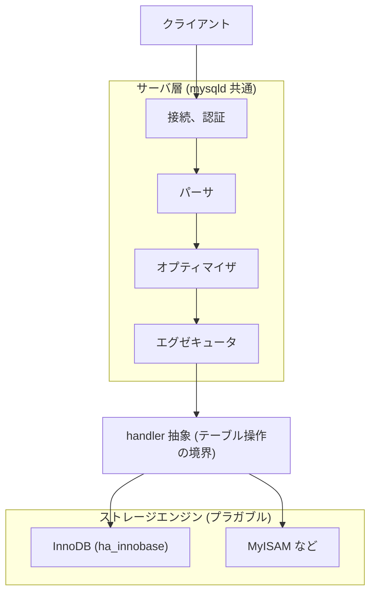

# 第1章 MySQL とは何か

> **本章で読むソース**
>
> - [`sql/handler.h`](https://github.com/mysql/mysql-server/blob/mysql-8.4.10/sql/handler.h)
> - [`sql/sql_class.h`](https://github.com/mysql/mysql-server/blob/mysql-8.4.10/sql/sql_class.h)
> - [`storage/innobase/handler/ha_innodb.h`](https://github.com/mysql/mysql-server/blob/mysql-8.4.10/storage/innobase/handler/ha_innodb.h)

## この章の狙い

本書が読み解く対象は MySQL 8.4.10（LTS）である。
最初に押さえるべきは、MySQL が単一のデータベースエンジンではなく、二つの層の組み合わせとして作られている点である。
SQL を解釈して実行計画を立てるサーバ層と、実際にデータをディスクへ格納するストレージエンジンが分かれており、後者は差し替え可能になっている。
この章では、その二層構造と両者の境界にある `handler` クラス、そして既定のストレージエンジンである InnoDB の位置づけを、ソースコードから確認する。
個々の仕組みの詳細は後続の章で扱うので、ここでは全体の地図を描くことに集中する。

## 前提

C++ のクラスと仮想関数の基本を理解していれば読める。
SQL の構文解析やトランザクションの内部実装はまだ知らなくてよい。
本章で出てくる用語のうち、パーサ、オプティマイザ、エグゼキュータ、トランザクションといった語は、それぞれ専用の章で改めて扱う。

## 二層アーキテクチャ

MySQL のサーバプロセス `mysqld` は、クライアントから受け取った SQL 文を上から下へ流して処理する。
接続を受け付ける層、SQL を構文木へ変換するパーサ、実行計画を選ぶオプティマイザ、計画に沿って行を読み書きするエグゼキュータが、上半分のサーバ層を構成する。
これらはストレージエンジンに依存しない共通のコードであり、どのエンジンを使っても同じ SQL を同じ意味で解釈する。

下半分がストレージエンジンである。
行データをどのファイル形式で持つか、インデックスをどう構成するか、トランザクションやロックをどう実現するかは、エンジンごとに実装が異なる。
エグゼキュータが「この行を読め」「この行を挿入せよ」と指示すると、その指示を実際のディスク操作へ変換するのがストレージエンジンの役割である。

この上下の境界に置かれた抽象が `handler` クラスである。
サーバ層はストレージエンジンの内部を一切知らず、`handler` の仮想関数を呼ぶことだけでテーブルを操作する。
エンジンを追加するとは、`handler` を継承した具象クラスを用意することにほかならない。



## 境界としての `handler` クラス

`handler` は、開いている一つのテーブルに対する操作を表すクラスである。
宣言は次のように始まる。

[`sql/handler.h` L4571-L4585](https://github.com/mysql/mysql-server/blob/mysql-8.4.10/sql/handler.h#L4571-L4585)

```cpp
class handler {
  friend class Partition_handler;

 public:
  typedef ulonglong Table_flags;

 protected:
  TABLE_SHARE *table_share;          /* The table definition */
  TABLE *table;                      /* The current open table */
  Table_flags cached_table_flags{0}; /* Set on init() and open() */

  ha_rows estimation_rows_to_insert;

 public:
  handlerton *ht; /* storage engine of this handler */
```

`handler` が操作対象のテーブル定義（`table_share`）と現在開いているテーブル（`table`）への参照を持ち、自身がどのストレージエンジンに属するかを `ht` で指している点を押さえておけばよい。
レコードを読み書きする `open` や `write_row`、`index_read` といった操作は、この基底クラスの仮想関数として宣言され、各エンジンが上書きする。

`handler` が一つのテーブル単位の操作だとすれば、エンジン全体を代表するのが `handlerton` 構造体である。
ファイル内のコメントが、その役割を明確に述べている。

[`sql/handler.h` L2723-L2734](https://github.com/mysql/mysql-server/blob/mysql-8.4.10/sql/handler.h#L2723-L2734)

```cpp
/**
  handlerton is a singleton structure - one instance per storage engine -
  to provide access to storage engine functionality that works on the
  "global" level (unlike handler class that works on a per-table basis).

  usually handlerton instance is defined statically in ha_xxx.cc as

  static handlerton { ... } xxx_hton;

  savepoint_*, prepare, recover, and *_by_xid pointers can be 0.
*/
struct handlerton {
```

エンジンごとに一つだけ存在する `handlerton` がエンジン全体の窓口であり、テーブルを開くたびに生成される `handler` がその窓口を `ht` で参照する。
コミットやリカバリのようにテーブルをまたぐ「グローバル」な操作は `handlerton` 側の関数ポインタが受け持ち、行単位の読み書きは `handler` の仮想関数が受け持つ、という分担になっている。

## ストレージエンジンの差し替えを支える設計

この `handler` 抽象が、本章で取り上げる設計上の工夫である。
サーバ層はストレージエンジンの具象型を直接知らず、`handler` 基底クラスのポインタ越しに仮想関数を呼ぶ。
だからエンジンを一つ追加しても、パーサやオプティマイザやエグゼキュータのコードは変更しなくてよい。
SQL の意味論を共通化したまま、データの持ち方だけを取り替えられる構造になっている。

なぜこの分離が効くのかを一文で言えば、行の格納方式という変わりやすい関心事を `handler` の境界に閉じ込め、SQL の解釈という安定した関心事から切り離しているからである。
エンジン固有のコードは `handler` の実装と `handlerton` の登録に限られ、その外側へは漏れない。

各エンジンには、サーバが歴史的に割り当ててきた識別番号がある。
列挙型 `legacy_db_type` がそれで、既定エンジンである InnoDB の値もここに並んでいる。

[`sql/handler.h` L648-L682](https://github.com/mysql/mysql-server/blob/mysql-8.4.10/sql/handler.h#L648-L682)

```cpp
enum legacy_db_type {
  DB_TYPE_UNKNOWN = 0,
  DB_TYPE_DIAB_ISAM = 1,
  DB_TYPE_HASH,
  DB_TYPE_MISAM,
  DB_TYPE_PISAM,
  DB_TYPE_RMS_ISAM,
  DB_TYPE_HEAP,
  DB_TYPE_ISAM,
  DB_TYPE_MRG_ISAM,
  DB_TYPE_MYISAM,
  DB_TYPE_MRG_MYISAM,
  DB_TYPE_BERKELEY_DB,
  DB_TYPE_INNODB,
  DB_TYPE_GEMINI,
  DB_TYPE_NDBCLUSTER,
  DB_TYPE_EXAMPLE_DB,
  DB_TYPE_ARCHIVE_DB,
  DB_TYPE_CSV_DB,
  DB_TYPE_FEDERATED_DB,
  DB_TYPE_BLACKHOLE_DB,
  DB_TYPE_PARTITION_DB,  // No longer used.
  DB_TYPE_BINLOG,
  DB_TYPE_SOLID,
  DB_TYPE_PBXT,
  DB_TYPE_TABLE_FUNCTION,
  DB_TYPE_MEMCACHE [[deprecated]],
  DB_TYPE_FALCON,
  DB_TYPE_MARIA,
  /** Performance schema engine. */
  DB_TYPE_PERFORMANCE_SCHEMA,
  DB_TYPE_TEMPTABLE,
  DB_TYPE_FIRST_DYNAMIC = 42,
  DB_TYPE_DEFAULT = 127  // Must be last
};
```

`DB_TYPE_INNODB` や `DB_TYPE_MYISAM` が並ぶこの列挙は、各エンジンを `handlerton` に結びつけるための歴史的なマーカーである。
末尾の `DB_TYPE_FIRST_DYNAMIC = 42` から先は、動的にロードされるプラグインエンジンに動的な番号を割り当てるために予約されている。
固定の番号を持つ組み込みエンジンと、後から追加されるプラグインエンジンが、同じ `handler` の枠組みで共存することがここから読み取れる。

## 既定のストレージエンジン InnoDB

MySQL 8.4.10 の既定のストレージエンジンは InnoDB である。
InnoDB はトランザクション、行単位のロック、クラッシュリカバリを備えたエンジンであり、本書はこの InnoDB の実装を中心に読み進める。
その InnoDB が、いまみた `handler` 抽象の一つの実装にすぎないことは、クラス宣言から確認できる。

[`storage/innobase/handler/ha_innodb.h` L87-L94](https://github.com/mysql/mysql-server/blob/mysql-8.4.10/storage/innobase/handler/ha_innodb.h#L87-L94)

```cpp
class ha_innobase : public handler {
 public:
  ha_innobase(handlerton *hton, TABLE_SHARE *table_arg);
  ~ha_innobase() override = default;

  row_type get_real_row_type(const HA_CREATE_INFO *create_info) const override;

  const char *table_type() const override;
```

`ha_innobase` は `handler` を `public` 継承し、`table_type` などの仮想関数を `override` している。
サーバ層から見れば、InnoDB のテーブルも MyISAM のテーブルも同じ `handler` ポインタであり、呼ぶ仮想関数が `ha_innobase` の実装に解決されるか別エンジンの実装に解決されるかが違うだけである。
MyISAM などの旧来のエンジンは、トランザクションやクラッシュリカバリを持たず現代の用途では主流でないため、本書では `handler` の別実装として簡単に扱うにとどめる。

## 接続ごとのセッションを表す `THD`

二層をまたいで処理が流れるとき、いま誰のどの接続を処理しているのかという文脈が必要になる。
その文脈を運ぶのが `THD` クラスである。
クライアントの接続一つにつき一つの `THD` が作られ、サーバ層もストレージエンジンもこの同じオブジェクトを参照する。

[`sql/sql_class.h` L947-L954](https://github.com/mysql/mysql-server/blob/mysql-8.4.10/sql/sql_class.h#L947-L954)

```cpp
  @class THD
  For each client connection we create a separate thread with THD serving as
  a thread/connection descriptor
*/

class THD : public MDL_context_owner,
            public Query_arena,
            public Open_tables_state {
```

コメントが述べるとおり、`THD` はクライアント接続ごとのスレッドとセッションの記述子である。
先の `handlerton` の関数ポインタの多くが引数に `THD *thd` を取るのは、どの接続のトランザクションをコミットするのか、といった文脈を `THD` 経由で受け取るためである。
接続とスレッドとセッションの関係は第3章で詳しく扱う。

## まとめ

MySQL 8.4.10 は、SQL を解釈するサーバ層と、データ格納を担うプラガブルなストレージエンジンの二層からなる。
両者の境界は `handler` クラスであり、サーバ層はこの抽象を通してのみテーブルを操作する。
エンジン全体を代表する `handlerton` がテーブルをまたぐ操作を、テーブルごとの `handler` が行単位の操作を受け持つ。
この分離により、SQL の意味論を共通化したままデータの持ち方だけを差し替えられる。
既定のストレージエンジンである InnoDB は `handler` を継承した `ha_innobase` として実装されており、本書はこの InnoDB の内部を中心に読み解いていく。

## 関連する章

- ハンドラ API とストレージエンジンプラグインの詳細は[第15章 ハンドラ API とストレージエンジンプラグイン](../part01-sql-layer/15-handler-api.md)で扱う。
- InnoDB の全体構成は[第17章 InnoDB アーキテクチャ概観](../part02-innodb-foundation/17-innodb-architecture.md)で扱う。
- 接続、スレッド、セッションと `THD` は[第3章 接続、スレッド、セッション](03-connection-thread-session.md)で扱う。
- トランザクションの仕組みは[第28章 トランザクション管理](../part04-transaction-concurrency/28-transaction-management.md)で扱う。
- クラッシュリカバリを支える redo ログは[第32章 redo ログ](../part05-log-recovery/32-redo-log.md)で扱う。
- MyISAM など他のストレージエンジンは[第39章 他のストレージエンジン](../part06-dictionary-ddl-ops/39-other-storage-engines.md)で扱う。
