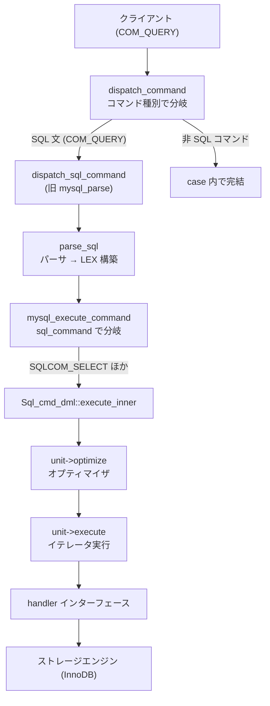

# 第2章 ソースツリーとビルド、クエリ処理の俯瞰

> **本章で読むソース**
>
> - [`sql/sql_parse.cc`](https://github.com/mysql/mysql-server/blob/mysql-8.4.10/sql/sql_parse.cc)
> - [`sql/sql_select.cc`](https://github.com/mysql/mysql-server/blob/mysql-8.4.10/sql/sql_select.cc)
> - [`CMakeLists.txt`](https://github.com/mysql/mysql-server/blob/mysql-8.4.10/CMakeLists.txt)

## この章の狙い

本書はサーバ層から InnoDB の内部までを順に読み進める。
その前に、巨大なソースツリーのどこに何があるかという地図と、1つの SQL 文がサーバ内をどう流れるかという縦の見取り図を共有しておく。
本章は、以降の各章がツリーのどの位置を扱い、クエリ処理パイプラインのどの段に対応するかを指す索引の役割を持つ。

## 前提

第1章で述べたとおり、MySQL は SQL を解釈するサーバ層と、データの格納を担うプラガブルなストレージエンジンの二層からなる。
本章のコード引用はすべて GitHub タグ `mysql-8.4.10` に固定する。

## ソースツリーの地図

MySQL のリポジトリはトップレベルに数十のディレクトリを持つ。
本書が読むのは、サーバ層を実装する `sql/` と、デファクトのストレージエンジンを実装する `storage/innobase/` の2つが中心である。
それ以外のディレクトリは、その2つを読むときに参照する周辺として位置づけられる。

| ディレクトリ | 役割 | 本書での扱い |
| --- | --- | --- |
| `sql/` | サーバ層であり、接続管理、パーサ、オプティマイザ、エグゼキュータ、`handler` インターフェースを定義する | 第3章から第11章 |
| `sql-common/`、`include/` | サーバとクライアントが共有する宣言、共通ユーティリティのヘッダ | 必要箇所で参照 |
| `mysys/`、`strings/`、`vio/` | OS 抽象、文字列処理、ネットワーク入出力の低レベルライブラリ | 必要箇所で参照 |
| `storage/innobase/` | ストレージエンジン InnoDB の実装 | 第12章以降の主対象 |
| `storage/` 直下の他ディレクトリ | MyISAM、CSV、MEMORY などの他ストレージエンジン | 第34章で概観 |
| `libbinlogevents/` | binlog イベントのフォーマット定義 | 第32章で参照 |
| `router/` | 接続のルーティングを担う独立コンポーネントである MySQL Router | 本書では扱わない |
| `client/`、`libmysql/` | コマンドラインクライアントとクライアントライブラリ | 本書では扱わない |
| `mysql-test/`、`unittest/` | 結合テストと単体テスト | 読まない |

テストコードである `mysql-test/` と `unittest/` は、サーバ本体の挙動を確認する資料にはなるが、本書の読解対象には含めない。

InnoDB の `storage/innobase/` は、さらに機能別のサブディレクトリに分かれる。
ファイル名の接頭辞（`buf0buf.cc` の `buf` など）がサブディレクトリ名と対応しており、機能の所在を名前から引けるようになっている。
本書で深掘りする主なサブディレクトリを次に挙げる。

| サブディレクトリ | 役割 | 本書での扱い |
| --- | --- | --- |
| `buf/` | バッファプール、すなわちディスクページのメモリキャッシュ | 第15章 |
| `btr/` | B+tree によるインデックスの探索と更新 | 第17章、第18章 |
| `trx/` | トランザクション管理、MVCC、パージ | 第23章から第25章 |
| `lock/` | レコードロックとギャップロックを管理するロックマネージャ | 第26章 |
| `log/` | redo ログ、チェックポイント | 第27章、第29章 |
| `dict/` | テーブルやインデックスのメタデータを保持するデータディクショナリ | 第30章 |
| `row/` | 行レベルの挿入、更新、削除の操作 | 第19章 |
| `fil/` | テーブルスペースのファイル空間管理 | 第13章 |
| `ibuf/` | セカンダリインデックス更新を遅延適用するチェンジバッファ | 第20章 |
| `lob/` | ページに収まらない大きな値を格納する LOB | 第22章 |
| `mtr/` | ページ更新と redo の単位であるミニトランザクション | 第16章 |
| `page/`、`rem/` | ページとレコードのフォーマット | 第14章 |
| `fsp/`、`fut/` | ファイルスペースとセグメントの割り当て | 第13章 |

## ビルドは CMake で記述される

MySQL のビルドは CMake を用いる。
リポジトリのルートに置かれた `CMakeLists.txt` が頂点であり、各サブディレクトリの `CMakeLists.txt` を順に取り込んで、サーバ、クライアント、ストレージエンジンのビルドを構成する。
ルートの `CMakeLists.txt` は、対応する CMake のバージョンを次のように要求する。

[`CMakeLists.txt L107`](https://github.com/mysql/mysql-server/blob/mysql-8.4.10/CMakeLists.txt#L107-L107)

```cmake
CMAKE_MINIMUM_REQUIRED(VERSION 3.14.6)
```

本書はソースの読解を目的とするため、ビルド手順そのものには立ち入らない。
ストレージエンジンがプラグインとして組み込まれるという構造を把握しておけば十分である。

## 1つのクエリがサーバ内をたどる道

クライアントが送った `SELECT` 1文が、サーバ内でどの関数を通って結果に至るかを俯瞰する。
ここで関数名の地図を持っておくと、第4章以降の各章が縦の流れのどこを担うかを位置づけられる。

### コマンドの受け口、dispatch_command

クライアントから届いたパケットは、プロトコルの種類を表す1バイトのコマンド種別を先頭に持つ。
このコマンド種別ごとに処理を振り分ける入口が `dispatch_command` である。

[`sql/sql_parse.cc L1741-L1742`](https://github.com/mysql/mysql-server/blob/mysql-8.4.10/sql/sql_parse.cc#L1741-L1742)

```cpp
bool dispatch_command(THD *thd, const COM_DATA *com_data,
                      enum enum_server_command command) {
```

関数は `command` の値で大きく分岐する。

[`sql/sql_parse.cc L1881-L1882`](https://github.com/mysql/mysql-server/blob/mysql-8.4.10/sql/sql_parse.cc#L1881-L1882)

```cpp
  switch (command) {
    case COM_INIT_DB: {
```

データベースの切り替え（`COM_INIT_DB`）や接続のリセット（`COM_RESET_CONNECTION`）など、SQL 文を伴わないコマンドは、この `switch` の各 `case` で完結する。
SQL 文の本体は、テキストのクエリを運ぶ `COM_QUERY` の `case` に届く。

[`sql/sql_parse.cc L2079-L2079`](https://github.com/mysql/mysql-server/blob/mysql-8.4.10/sql/sql_parse.cc#L2079-L2079)

```cpp
    case COM_QUERY: {
```

`COM_QUERY` の `case` は、受け取ったクエリ文字列をパーサに渡すため `dispatch_sql_command` を呼ぶ。

[`sql/sql_parse.cc L2136-L2136`](https://github.com/mysql/mysql-server/blob/mysql-8.4.10/sql/sql_parse.cc#L2136-L2136)

```cpp
      dispatch_sql_command(thd, &parser_state);
```

この `dispatch_sql_command` は、以前のバージョンで `mysql_parse` と呼ばれていた関数に対応する。
8.4 では名称が `dispatch_sql_command` に変わっている。

### 解析から実行への橋渡し、dispatch_sql_command

`dispatch_sql_command` は、クエリ文字列を構文解析し、その結果を実行へ渡す段を担う。

[`sql/sql_parse.cc L5275-L5275`](https://github.com/mysql/mysql-server/blob/mysql-8.4.10/sql/sql_parse.cc#L5275-L5275)

```cpp
void dispatch_sql_command(THD *thd, Parser_state *parser_state) {
```

まず `parse_sql` がクエリ文字列を解析し、構文木に相当する内部表現を `THD` のなかの `LEX` 構造体へ組み立てる。

[`sql/sql_parse.cc L5303-L5303`](https://github.com/mysql/mysql-server/blob/mysql-8.4.10/sql/sql_parse.cc#L5303-L5303)

```cpp
    err = parse_sql(thd, parser_state, nullptr);
```

解析が成功すると、構築された `LEX` をもとに文を実行する `mysql_execute_command` を呼ぶ。

[`sql/sql_parse.cc L5406-L5406`](https://github.com/mysql/mysql-server/blob/mysql-8.4.10/sql/sql_parse.cc#L5406-L5406)

```cpp
          error = mysql_execute_command(thd, true);
```

パーサの内部、すなわちトークン化と文法規則による構文木の構築は第4章で読む。

### 文の種類で分かれる実行、mysql_execute_command

`mysql_execute_command` は、解析済みの `LEX` を受け取り、SQL 文の種類ごとに実行を振り分ける。

[`sql/sql_parse.cc L2909-L2909`](https://github.com/mysql/mysql-server/blob/mysql-8.4.10/sql/sql_parse.cc#L2909-L2909)

```cpp
int mysql_execute_command(THD *thd, bool first_level) {
```

文の種類は `lex->sql_command` に入っており、これで分岐する。

[`sql/sql_parse.cc L3355-L3355`](https://github.com/mysql/mysql-server/blob/mysql-8.4.10/sql/sql_parse.cc#L3355-L3355)

```cpp
  switch (lex->sql_command) {
```

`SELECT` は、この `switch` のなかでデータ操作系の文をまとめた `case` の先頭に置かれる。

[`sql/sql_parse.cc L4678-L4678`](https://github.com/mysql/mysql-server/blob/mysql-8.4.10/sql/sql_parse.cc#L4678-L4678)

```cpp
    case SQLCOM_SELECT:
```

この `case` は、文ごとに用意された実行オブジェクトの `execute` を呼ぶ。

[`sql/sql_parse.cc L4739-L4739`](https://github.com/mysql/mysql-server/blob/mysql-8.4.10/sql/sql_parse.cc#L4739-L4739)

```cpp
      res = lex->m_sql_cmd->execute(thd);
```

`SELECT` をはじめとするデータ操作文では、`lex->m_sql_cmd` の実体は `Sql_cmd_dml` であり、その `execute` の内側でオプティマイザとエグゼキュータが順に動く。

### 最適化と実行、Sql_cmd_dml

`Sql_cmd_dml::execute` から呼ばれる `execute_inner` のなかで、最適化と実行が連続して起こる。

[`sql/sql_select.cc L1036-L1041`](https://github.com/mysql/mysql-server/blob/mysql-8.4.10/sql/sql_select.cc#L1036-L1041)

```cpp
bool Sql_cmd_dml::execute_inner(THD *thd) {
  Query_expression *unit = lex->unit;

  if (unit->optimize(thd, /*materialize_destination=*/nullptr,
                     /*create_iterators=*/true, /*finalize_access_paths=*/true))
    return true;
```

`unit->optimize` がオプティマイザの入口である。
ここで結合順序やアクセスパスが決まり、実行に使うイテレータの木が組み立てられる（引数 `create_iterators` がその構築を指示する）。
この最適化の内部は第6章から第8章で読む。

最適化が終わると、`unit->execute` が組み立てられたイテレータの木を駆動して結果行を生成する。

[`sql/sql_select.cc L1064-L1064`](https://github.com/mysql/mysql-server/blob/mysql-8.4.10/sql/sql_select.cc#L1064-L1064)

```cpp
    if (unit->execute(thd)) return true;
```

イテレータによる実行モデルは第9章と第10章で読む。
イテレータが行を1つ取り出すたびに、対象テーブルの `handler` を通じてストレージエンジンへ要求が下りる。
この `handler` インターフェースこそがサーバ層と InnoDB を分ける境界であり、第11章で詳しく読む。

### パイプラインの最適化、二次エンジンへの再準備

このパイプラインに組み込まれた最適化を1つ挙げる。
`mysql_execute_command` を呼ぶ前に、`COM_QUERY` の `case` は、文をまず主ストレージエンジンで準備する方針を立てる。

[`sql/sql_parse.cc L2129-L2130`](https://github.com/mysql/mysql-server/blob/mysql-8.4.10/sql/sql_parse.cc#L2129-L2130)

```cpp
      thd->set_secondary_engine_optimization(
          Secondary_engine_optimization::PRIMARY_TENTATIVELY);
```

ここで設定される `PRIMARY_TENTATIVELY` という状態が要点である。
主エンジン（通常は InnoDB）向けに準備したうえで、分析処理を高速化する二次ストレージエンジンが使える文だと判明したときに限り、その文を二次エンジン向けに再準備する。
この仕組みにより、すべての文を二次エンジン向けに準備しなおす無駄を避けつつ、適格な分析クエリだけを高速な列指向エンジンへ振り向けられる。
クエリ文字列を1度受けるだけで、適切なエンジンを選ぶ判断がパイプラインに織り込まれている。

## クエリ処理パイプラインの全体図

ここまでの流れを1枚の図にまとめる。
クライアントのコマンドが `dispatch_command` に入り、SQL 文なら解析、最適化、実行を経て、`handler` を境にストレージエンジンへ下りる。



## まとめ

ソースツリーの中心は、サーバ層の `sql/` と InnoDB の `storage/innobase/` である。
InnoDB はファイル名の接頭辞と一致する機能別サブディレクトリに分かれ、`buf` `btr` `trx` `lock` `log` などの所在を名前から引ける。
ビルドは CMake で記述され、ストレージエンジンはプラグインとして組み込まれる。
1つの `SELECT` 文は、`dispatch_command` の入口からコマンド種別で分岐し、`dispatch_sql_command` で解析され、`mysql_execute_command` で文の種類ごとに振り分けられ、`Sql_cmd_dml` のなかで最適化と実行を経て、`handler` を境にストレージエンジンへ下る。
この縦の流れの各段が、第4章以降の章に対応する。

## 関連する章

- [第1章 MySQL とは何か](01-what-is-mysql.md)
- [第3章 接続、スレッド、セッション](03-connection-thread-session.md)
- [第4章 パーサ](../part01-sql-layer/04-parser.md)
- [第6章 オプティマイザ（論理変換とクエリブロック）](../part01-sql-layer/06-optimizer-transformations.md)
- [第9章 エグゼキュータ（イテレータ実行モデル）](../part01-sql-layer/09-executor-iterators.md)
- [第11章 ハンドラ API とストレージエンジンプラグイン](../part01-sql-layer/11-handler-api.md)
- [第12章 InnoDB アーキテクチャ概観](../part02-innodb-foundation/12-innodb-architecture.md)
