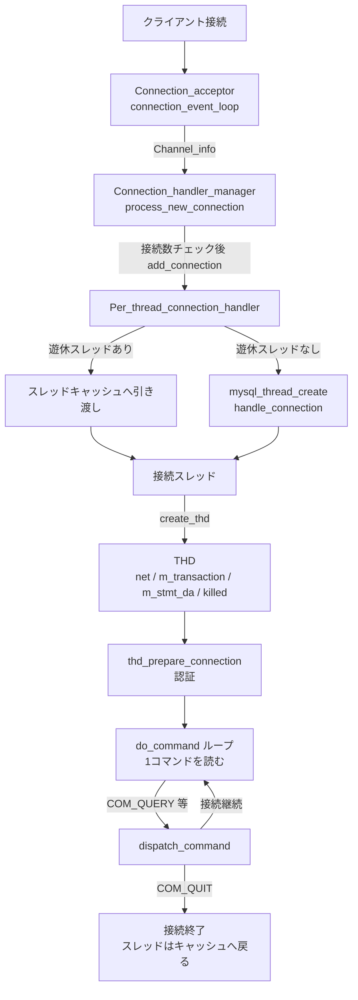

# 第3章 接続、スレッド、セッション

> **本章で読むソース**
>
> - [`sql/conn_handler/connection_acceptor.h`](https://github.com/mysql/mysql-server/blob/mysql-8.4.10/sql/conn_handler/connection_acceptor.h)
> - [`sql/conn_handler/connection_handler.h`](https://github.com/mysql/mysql-server/blob/mysql-8.4.10/sql/conn_handler/connection_handler.h)
> - [`sql/conn_handler/connection_handler_manager.h`](https://github.com/mysql/mysql-server/blob/mysql-8.4.10/sql/conn_handler/connection_handler_manager.h)
> - [`sql/conn_handler/connection_handler_manager.cc`](https://github.com/mysql/mysql-server/blob/mysql-8.4.10/sql/conn_handler/connection_handler_manager.cc)
> - [`sql/conn_handler/connection_handler_impl.h`](https://github.com/mysql/mysql-server/blob/mysql-8.4.10/sql/conn_handler/connection_handler_impl.h)
> - [`sql/conn_handler/connection_handler_per_thread.cc`](https://github.com/mysql/mysql-server/blob/mysql-8.4.10/sql/conn_handler/connection_handler_per_thread.cc)
> - [`sql/sql_class.h`](https://github.com/mysql/mysql-server/blob/mysql-8.4.10/sql/sql_class.h)
> - [`sql/sql_parse.cc`](https://github.com/mysql/mysql-server/blob/mysql-8.4.10/sql/sql_parse.cc)

## この章の狙い

クライアントが TCP ソケットや UNIX ドメインソケットを通じてサーバに接続したあと、そのクライアントが送る SQL がどの実行主体の上で処理されるのかを読む。
MySQL は既定で、接続1本ごとに OS スレッドを1本割り当てる。
この方式を **one-thread-per-connection** と呼ぶ。
本章では、接続を受理してスレッドへ割り当てる層（`sql/conn_handler/`）と、1接続の状態をすべて保持するセッションオブジェクト `THD`（`sql/sql_class.h`）、そしてそのスレッドが回し続けるコマンドループ `do_command`（`sql/sql_parse.cc`）の入口までをたどる。
SQL 文字列を構文木へ変換する処理は第5章、文を実際に実行する処理は第13章以降で扱う。
本章の範囲は、受理した接続を「どの実行単位の上に乗せ、どこまで状態を閉じ込めるか」という枠組みである。

## 前提

第2章でソースツリーの全体像とクエリ処理の俯瞰を扱った。
本章はその続きとして、サーバ層の最も外側にあたる接続処理を読む。
コードはサーバ層（`sql/`）に閉じており、ストレージエンジンには立ち入らない。

接続を受け付けるリスナー自身（ソケットの待ち受け）は本章の主題から外す。
リスナーが新しい接続を1本検出したところから読み始める。

## 接続受理のループから接続ハンドラへ

接続を待ち受けるループは `Connection_acceptor` にある。
このクラスは待ち受けの方式（TCP、UNIX ソケット、名前付きパイプなど）をテンプレート引数 `Listener` で差し替えられるようにしてあり、受理後の処理だけを共通化している。

[`sql/conn_handler/connection_acceptor.h` L61-68](https://github.com/mysql/mysql-server/blob/mysql-8.4.10/sql/conn_handler/connection_acceptor.h#L61-L68)

```cpp
  void connection_event_loop() {
    Connection_handler_manager *mgr =
        Connection_handler_manager::get_instance();
    while (!connection_events_loop_aborted()) {
      Channel_info *channel_info = m_listener->listen_for_connection_event();
      if (channel_info != nullptr) mgr->process_new_connection(channel_info);
    }
  }
```

リスナーが返す `Channel_info` は、受理した1本の接続の情報（ソケットや接続の種別など）を包むオブジェクトである。
ループはそれを `Connection_handler_manager::process_new_connection` に渡すだけで、スレッドをどう割り当てるかには関与しない。
接続を「検出する」責務と「処理単位へ割り当てる」責務を分けてある。

`Connection_handler_manager` は、現在有効な接続ハンドラへ新規接続を振り分けるシングルトンである。
このクラスのコメントは役割をそのまま述べている。

[`sql/conn_handler/connection_handler_manager.h` L53-58](https://github.com/mysql/mysql-server/blob/mysql-8.4.10/sql/conn_handler/connection_handler_manager.h#L53-L58)

```cpp
/**
  This is a singleton class that provides various connection management
  related functionalities, most importantly dispatching new connections
  to the currently active Connection_handler.
*/
class Connection_handler_manager {
```

`process_new_connection` は、まず接続数の上限を確認し、上限内であれば接続ハンドラの `add_connection` に処理を委ねる。

[`sql/conn_handler/connection_handler_manager.cc` L254-267](https://github.com/mysql/mysql-server/blob/mysql-8.4.10/sql/conn_handler/connection_handler_manager.cc#L254-L267)

```cpp
void Connection_handler_manager::process_new_connection(
    Channel_info *channel_info) {
  if (connection_events_loop_aborted() ||
      !check_and_incr_conn_count(channel_info->is_admin_connection())) {
    channel_info->send_error_and_close_channel(ER_CON_COUNT_ERROR, 0, true);
    delete channel_info;
    return;
  }

  if (m_connection_handler->add_connection(channel_info)) {
    inc_aborted_connects();
    delete channel_info;
  }
}
```

`check_and_incr_conn_count` は `max_connections` システム変数との比較とカウンタ加算を、`LOCK_connection_count` ミューテックスの下で一度に行う。
上限を超えていれば `ER_CON_COUNT_ERROR` を返して接続を閉じる。
上限内であれば `m_connection_handler->add_connection` を呼ぶ。
ここで `m_connection_handler` が指す実体が、スレッド割り当ての方式を決める。

## 接続ハンドラの抽象化と既定の実装

接続をどう処理し、それを OS スレッドへどう対応づけるかは、抽象基底クラス `Connection_handler` のインタフェースとして切り出されている。

[`sql/conn_handler/connection_handler.h` L33-62](https://github.com/mysql/mysql-server/blob/mysql-8.4.10/sql/conn_handler/connection_handler.h#L33-L62)

```cpp
/**
  This abstract base class represents how connections are processed,
  most importantly how they map to OS threads.
*/
class Connection_handler {
 protected:
  friend class Connection_handler_manager;

  Connection_handler() = default;
  virtual ~Connection_handler() = default;

  /**
    Add a connection.

    @param channel_info     Pointer to the Channel_info object.

    @note If this function is successful (returns false), the ownership of
    channel_info is transferred. Otherwise the caller is responsible for
    its destruction.

    @return true if processing of the new connection failed, false otherwise.
  */
  virtual bool add_connection(Channel_info *channel_info) = 0;

  /**
    @return Maximum number of threads that can be created
            by this connection handler.
  */
  virtual uint get_max_threads() const = 0;
};
```

インタフェースは `add_connection`（接続を1本受け取る）と `get_max_threads`（作れるスレッド数の上限）の二つだけである。
どの方式を使うかは、起動時に `--thread-handling` で選ぶ。
選択肢の列挙とその既定値が次に示すコードで、配列の先頭が既定値になる。

[`sql/conn_handler/connection_handler_manager.h` L110-114](https://github.com/mysql/mysql-server/blob/mysql-8.4.10/sql/conn_handler/connection_handler_manager.h#L110-L114)

```cpp
  enum scheduler_types {
    SCHEDULER_ONE_THREAD_PER_CONNECTION = 0,
    SCHEDULER_NO_THREADS,
    SCHEDULER_TYPES_COUNT
  };
```

既定は `SCHEDULER_ONE_THREAD_PER_CONNECTION`、すなわち one-thread-per-connection である。
`SCHEDULER_NO_THREADS` は専用スレッドを起こさず受理したスレッド上でそのまま処理する方式で、ブートストラップなど限られた用途に使う。
初期化関数 `init` は、選ばれた方式に応じて具体的なハンドラを生成する。

[`sql/conn_handler/connection_handler_manager.cc` L154-162](https://github.com/mysql/mysql-server/blob/mysql-8.4.10/sql/conn_handler/connection_handler_manager.cc#L154-L162)

```cpp
  switch (Connection_handler_manager::thread_handling) {
    case SCHEDULER_ONE_THREAD_PER_CONNECTION:
      connection_handler = new (std::nothrow) Per_thread_connection_handler();
      break;
    case SCHEDULER_NO_THREADS:
      connection_handler = new (std::nothrow) One_thread_connection_handler();
      break;
    default:
      assert(false);
```

既定では `Per_thread_connection_handler` が生成される。
これが one-thread-per-connection の実装であり、宣言は `connection_handler_impl.h` にある。

[`sql/conn_handler/connection_handler_impl.h` L38-42](https://github.com/mysql/mysql-server/blob/mysql-8.4.10/sql/conn_handler/connection_handler_impl.h#L38-L42)

```cpp
/**
  This class represents the connection handling functionality
  that each connection is being handled in a single thread
*/
class Per_thread_connection_handler : public Connection_handler {
```

なお、本章の対象ファイルである接続ハンドラ層は、ヘッダの名前が `connection_handler_impl.h`、実装の名前が `connection_handler_per_thread.cc` で、両者の綴りが揃っていない。
`Per_thread_connection_handler` と `One_thread_connection_handler` の二つの宣言を1つのヘッダにまとめてあるための名残と考えられる。

接続ごとに専用スレッドを割り当てる方式は、同時接続数がそのままスレッド数になる。
接続数が数千を超える規模では、スレッドの生成と切り替えの負荷が無視できなくなる。
これに対し、少数のワーカースレッドで多数の接続を多重化する **スレッドプール** が、エンタープライズ版のプラグインとして提供されている。
プラグインが提供する接続ハンドラは、`Connection_handler_manager::load_connection_handler` を通じて差し込まれ、既定のハンドラを一時的に置き換える。
本書はソースが公開されている既定の方式を中心に読み、スレッドプールはこの差し替え機構の存在を確認するにとどめる。

## スレッドへの割り当てとスレッドキャッシュ

`Per_thread_connection_handler::add_connection` が、接続1本に対するスレッド割り当ての本体である。

[`sql/conn_handler/connection_handler_per_thread.cc` L404-440](https://github.com/mysql/mysql-server/blob/mysql-8.4.10/sql/conn_handler/connection_handler_per_thread.cc#L404-L440)

```cpp
bool Per_thread_connection_handler::add_connection(Channel_info *channel_info) {
  int error = 0;
  my_thread_handle id;

  DBUG_TRACE;

  // Simulate thread creation for test case before we check thread cache
  DBUG_EXECUTE_IF("fail_thread_create", error = 1; goto handle_error;);

  if (!check_idle_thread_and_enqueue_connection(channel_info)) return false;

  /*
    There are no idle threads available to take up the new
    connection. Create a new thread to handle the connection
  */
  channel_info->set_prior_thr_create_utime();
  error =
      mysql_thread_create(key_thread_one_connection, &id, &connection_attrib,
                          handle_connection, (void *)channel_info);
#ifndef NDEBUG
handle_error:
#endif  // !NDEBUG

  if (error) {
    connection_errors_internal++;
    if (!create_thd_err_log_throttle.log())
      LogErr(ERROR_LEVEL, ER_CONN_PER_THREAD_NO_THREAD, error);
    channel_info->send_error_and_close_channel(ER_CANT_CREATE_THREAD, error,
                                               true);
    Connection_handler_manager::dec_connection_count();
    return true;
  }

  Global_THD_manager::get_instance()->inc_thread_created();
  DBUG_PRINT("info", ("Thread created"));
  return false;
}
```

ここに、この方式の高速化の工夫が現れる。
新しいスレッドを毎回生成するのではなく、まず `check_idle_thread_and_enqueue_connection` で **スレッドキャッシュ**（待機中の遊休スレッド）を探す。
直前の接続を終えて空いたスレッドが残っていれば、新しい接続をそのスレッドへ引き渡し、`mysql_thread_create` を呼ばずに戻る。
遊休スレッドが無いときに限り、新しい OS スレッドを `handle_connection` を入口として生成する。
OS スレッドの生成は接続のたびに行うには重い操作であり、終えたスレッドを捨てずに再利用することで、接続の確立と切断を繰り返すワークロードでスレッド生成の回数を抑える。
これがなぜ速いかは、生成コストの高い資源を確保しなおさずに使い回すからである。

引き渡しの仕組みは、遊休スレッドが条件変数で待機している点にある。
`check_idle_thread_and_enqueue_connection` は、待機リストへ接続を積んで条件変数を1つだけ起こす。

[`sql/conn_handler/connection_handler_per_thread.cc` L387-402](https://github.com/mysql/mysql-server/blob/mysql-8.4.10/sql/conn_handler/connection_handler_per_thread.cc#L387-L402)

```cpp
bool Per_thread_connection_handler::check_idle_thread_and_enqueue_connection(
    Channel_info *channel_info) {
  bool res = true;

  mysql_mutex_lock(&LOCK_thread_cache);
  if (Per_thread_connection_handler::blocked_pthread_count > wake_pthread) {
    DBUG_PRINT("info", ("waiting_channel_info_list->push %p", channel_info));
    waiting_channel_info_list->push_back(channel_info);
    wake_pthread++;
    mysql_cond_signal(&COND_thread_cache);
    res = false;
  }
  mysql_mutex_unlock(&LOCK_thread_cache);

  return res;
}
```

起こされた側のスレッドは `block_until_new_connection` で待機しており、待機リストの先頭から接続を取り出して処理を再開する。
キャッシュに入れるスレッド数の上限は `thread_cache_size` システム変数で決まる。

## セッションの状態を持つ `THD`

スレッドが割り当てられた接続には、その接続のあいだ生き続ける状態オブジェクト `THD` が1つ対応する。
クラスのコメントが、その立場を明確に述べている。

[`sql/sql_class.h` L946-954](https://github.com/mysql/mysql-server/blob/mysql-8.4.10/sql/sql_class.h#L946-L954)

```cpp
/**
  @class THD
  For each client connection we create a separate thread with THD serving as
  a thread/connection descriptor
*/

class THD : public MDL_context_owner,
            public Query_arena,
            public Open_tables_state {
```

`THD` は、1接続1セッションの状態をまとめて保持する中心オブジェクトである。
クライアントとの通信路、いま実行中のステートメント、トランザクションの状態、診断領域などが、すべて1つの `THD` インスタンスに集まる。
主要なメンバをいくつか確認する。

クライアントとの通信路は `net` が持つ。

[`sql/sql_class.h` L1968-1968](https://github.com/mysql/mysql-server/blob/mysql-8.4.10/sql/sql_class.h#L1968-L1968)

```cpp
  NET net;        // client connection descriptor
```

実行中の文の解析木と、その文が触れているテーブルなどの状態は、`lex` や基底クラス `Open_tables_state` を通じて `THD` に結び付く。
トランザクションの状態は `m_transaction` がまとめて持つ。

[`sql/sql_class.h` L2018-2018](https://github.com/mysql/mysql-server/blob/mysql-8.4.10/sql/sql_class.h#L2018-L2018)

```cpp
  std::unique_ptr<Transaction_ctx> m_transaction;
```

文の実行結果（エラー、警告、影響行数など）を集める **診断領域** は `m_stmt_da` が指す。

[`sql/sql_class.h` L4471-4471](https://github.com/mysql/mysql-server/blob/mysql-8.4.10/sql/sql_class.h#L4471-L4471)

```cpp
  Diagnostics_area *m_stmt_da;
```

このセッションを外部から終了させる要求（`KILL` 文やシャットダウン）は、`killed` フラグで伝わる。

[`sql/sql_class.h` L2755-2755](https://github.com/mysql/mysql-server/blob/mysql-8.4.10/sql/sql_class.h#L2755-L2755)

```cpp
  std::atomic<killed_state> killed;
```

これらに加えて、接続を一意に識別する `m_thread_id` や、このスレッドの統計を集める `status_var` も `THD` が持つ。

[`sql/sql_class.h` L1162-1162](https://github.com/mysql/mysql-server/blob/mysql-8.4.10/sql/sql_class.h#L1162-L1162)

```cpp
  struct System_status_var status_var;  // Per thread statistic vars
```

ここに、この設計の要点がある。
1接続を1スレッドへ閉じ込め、その接続に関わる状態をすべて1つの `THD` に集約することで、SQL の実行は単一スレッド上の素直な同期コードとして書ける。
あるスレッドが処理しているのは常に自分の `THD` であり、別の接続の状態と干渉しない。
実行中の文がブロックする読み取りやロック待ちに入っても、待つのはそのスレッドだけで、他の接続は別のスレッドの上で独立に進む。
状態を `THD` に閉じ込めるこの設計が、サーバ層の大部分をコールバックや明示的な状態機械なしの直線的なコードに保っている。
その代償として、接続ごとにスレッドと `THD` の資源を確保する必要があり、ここがスレッドプールが軽量化を狙う対象になる。

## コマンドループ `do_command`

スレッドが `THD` を初期化したあと回し続ける処理が、接続の本体である。
スレッドの入口 `handle_connection` が、認証を済ませてからコマンドループに入る。

[`sql/conn_handler/connection_handler_per_thread.cc` L300-308](https://github.com/mysql/mysql-server/blob/mysql-8.4.10/sql/conn_handler/connection_handler_per_thread.cc#L300-L308)

```cpp
    if (thd_prepare_connection(thd))
      handler_manager->inc_aborted_connects();
    else {
      while (thd_connection_alive(thd)) {
        if (do_command(thd)) break;
      }
      end_connection(thd);
    }
    close_connection(thd, 0, false, false);
```

接続が生きているあいだ `do_command` を繰り返し呼び、戻り値が真（接続を閉じる要求）になればループを抜ける。
1回の `do_command` が、クライアントからの1コマンドの読み取りと実行に対応する。

[`sql/sql_parse.cc` L1309-1321](https://github.com/mysql/mysql-server/blob/mysql-8.4.10/sql/sql_parse.cc#L1309-L1321)

```cpp
/**
  Read one command from connection and execute it (query or simple command).
  This function is called in loop from thread function.

  For profiling to work, it must never be called recursively.

  @retval
    0  success
  @retval
    1  request of thread shutdown (see dispatch_command() description)
*/

bool do_command(THD *thd) {
```

`do_command` はまず診断領域を初期化し、クライアントからの次のコマンドを待つ。
この待ち受けはネットワークからのブロッキング読み取りであり、次のコマンドが届くか、接続が閉じるか、`net_wait_timeout` 秒が過ぎるまでスレッドはここで待機する。

[`sql/sql_parse.cc` L1342-1353](https://github.com/mysql/mysql-server/blob/mysql-8.4.10/sql/sql_parse.cc#L1342-L1353)

```cpp
  thd->clear_error();  // Clear error message
  thd->get_stmt_da()->reset_diagnostics_area();

  /*
    This thread will do a blocking read from the client which
    will be interrupted when the next command is received from
    the client, the connection is closed or "net_wait_timeout"
    number of seconds has passed.
  */
  net = thd->get_protocol_classic()->get_net();
  my_net_set_read_timeout(net, thd->variables.net_wait_timeout);
  net_new_transaction(net);
```

コマンドを1つ読み取ると、その種別（`COM_QUERY`、`COM_QUIT` など）と本体を `dispatch_command` に渡す。

[`sql/sql_parse.cc` L1463-1474](https://github.com/mysql/mysql-server/blob/mysql-8.4.10/sql/sql_parse.cc#L1463-L1474)

```cpp
  DEBUG_SYNC(thd, "before_command_dispatch");

  return_value = dispatch_command(thd, &com_data, command);
  thd->get_protocol_classic()->get_output_packet()->shrink(
      thd->variables.net_buffer_length);

out:
  /* The statement instrumentation must be closed in all cases. */
  assert(thd->m_digest == nullptr);
  assert(thd->m_statement_psi == nullptr);
  return return_value;
}
```

`dispatch_command` は、コマンドの種別ごとに処理を振り分ける関数である。

[`sql/sql_parse.cc` L1723-1742](https://github.com/mysql/mysql-server/blob/mysql-8.4.10/sql/sql_parse.cc#L1723-L1742)

```cpp
/**
  Perform one connection-level (COM_XXXX) command.

  @param thd             connection handle
  @param command         type of command to perform
  @param com_data        com_data union to store the generated command

  @todo
    set thd->lex->sql_command to SQLCOM_END here.
  @todo
    The following has to be changed to an 8 byte integer

  @retval
    0   ok
  @retval
    1   request of thread shutdown, i. e. if command is
        COM_QUIT
*/
bool dispatch_command(THD *thd, const COM_DATA *com_data,
                      enum enum_server_command command) {
```

`COM_QUERY` であれば SQL 文字列の解析と実行へ進み、`COM_QUIT` であれば真を返して `do_command` のループを終わらせ、接続を閉じる。
SQL 文字列を構文木へ変換する処理（パーサ）は第5章、解析された文を実行する処理は第13章以降で扱う。
本章は、コマンドが `dispatch_command` の入口まで届く流れの確認にとどめる。

## 接続から `do_command` ループまでの全体像

ここまでの流れを1つの図にまとめる。
受理ループが接続を検出し、接続ハンドラがスレッドを割り当て、そのスレッドが `THD` を構えてコマンドループを回す。



## まとめ

MySQL は既定で one-thread-per-connection を採り、接続1本ごとに OS スレッドと `THD` を1つ対応づける。
受理ループ `connection_event_loop` が接続を検出し、`Connection_handler_manager::process_new_connection` が接続数を確認したうえで接続ハンドラの `add_connection` に委ねる。
既定のハンドラ `Per_thread_connection_handler` は、まずスレッドキャッシュの遊休スレッドを探し、無ければ新しいスレッドを生成する。
終えたスレッドを捨てずに再利用するこのキャッシュが、接続の確立と切断を繰り返すワークロードでスレッド生成の回数を抑える。
割り当てられたスレッドは、通信路、トランザクション状態、診断領域、終了フラグなどをすべて1つの `THD` に集約し、`do_command` のループで1コマンドずつ読んで `dispatch_command` へ渡す。
状態を `THD` に閉じ込めることで、SQL の実行を単一スレッド上の素直な同期コードとして書ける点が、この設計の核にあたる。

## 関連する章

- [第2章 ソースツリーとビルド、クエリ処理の俯瞰](02-source-tree-and-build.md)
- [第5章 パーサ](../part01-sql-layer/05-parser.md)
- [第13章 エグゼキュータ（イテレータ実行モデル）](../part01-sql-layer/13-executor-iterators.md)
- [第4章 接続の確立と認証、Classic Protocol](04-connection-and-protocol.md)
