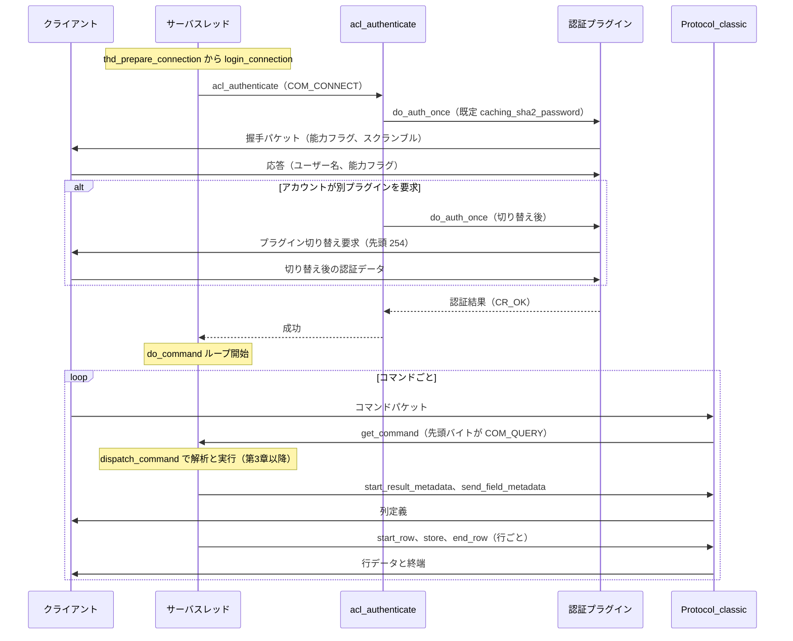

# 第4章 接続の確立と認証、Classic Protocol

> **本章で読むソース**
>
> - [`sql/sql_connect.cc`](https://github.com/mysql/mysql-server/blob/mysql-8.4.10/sql/sql_connect.cc)
> - [`sql/auth/sql_authentication.cc`](https://github.com/mysql/mysql-server/blob/mysql-8.4.10/sql/auth/sql_authentication.cc)
> - [`sql/protocol_classic.cc`](https://github.com/mysql/mysql-server/blob/mysql-8.4.10/sql/protocol_classic.cc)
> - [`include/mysql/plugin_auth.h`](https://github.com/mysql/mysql-server/blob/mysql-8.4.10/include/mysql/plugin_auth.h)

## この章の狙い

第3章では、接続を受理してスレッドへ割り当て、そのスレッドが `THD` を構えて `do_command` のループを回すところまでを読んだ。
本章はその続きとして、割り当てられたスレッドがコマンドループに入る前に行う準備、すなわちクライアントとの握手と認証をたどる。
そのうえで、コマンドループが1回ごとに使う通信規約 **Classic Protocol** を読む。
クライアントから届くコマンドパケットをどう読み取り、SELECT の結果セットをどう送り返すかを、`Protocol_classic` の実装に即して確認する。

第3章は接続をスレッドへ乗せる枠組みを扱い、本章はその上で交わされる通信の中身を扱う。
コマンドを種別ごとに振り分ける `dispatch_command` の内部や、SQL 文字列の解析と実行は本章の主題ではない。
本章は、コマンドが届くまで（認証）と、コマンドが1往復する規約（プロトコル）に集中する。

## 前提

第3章で、スレッドの入口 `handle_connection` が `thd_prepare_connection` を呼び、成功すれば `do_command` のループに入ることを読んだ。
本章はこの `thd_prepare_connection` の内側から読み始める。
コードはサーバ層（`sql/`）に閉じており、ストレージエンジンには立ち入らない。

認証で扱う権限テーブル（`mysql.user` など）の構造そのものや、SSL ハンドシェイクの暗号処理の詳細は主題から外す。
本章は、握手から認証プラグインの選択、そしてコマンドの読み書きという制御の流れに沿って読む。

## 接続準備の入口 `thd_prepare_connection`

スレッドがコマンドループに入る前の準備は、`thd_prepare_connection` がまとめている。
この関数は `login_connection` を呼んで認証まで済ませ、成功したら `prepare_new_connection_state` でセッションの初期状態を整える。

[`sql/sql_connect.cc` L893-904](https://github.com/mysql/mysql-server/blob/mysql-8.4.10/sql/sql_connect.cc#L893-L904)

```cpp
bool thd_prepare_connection(THD *thd) {
  thd->enable_mem_cnt();

  bool rc;
  lex_start(thd);
  rc = login_connection(thd);

  if (rc) return rc;

  prepare_new_connection_state(thd);
  return false;
}
```

ここで認証を担うのが `login_connection` である。
この関数はまず、接続フェーズだけ短いタイムアウトを使うよう通信路を設定し、`check_connection` を呼ぶ。

[`sql/sql_connect.cc` L698-724](https://github.com/mysql/mysql-server/blob/mysql-8.4.10/sql/sql_connect.cc#L698-L724)

```cpp
static bool login_connection(THD *thd) {
  int error;
  DBUG_TRACE;
  DBUG_PRINT("info",
             ("login_connection called by thread %u", thd->thread_id()));

  /* Use "connect_timeout" value during connection phase */
  thd->get_protocol_classic()->set_read_timeout(connect_timeout, true);
  thd->get_protocol_classic()->set_write_timeout(connect_timeout);

  error = check_connection(thd);
  thd->send_statement_status();

  if (error) {  // Wrong permissions
#ifdef _WIN32
    if (vio_type(thd->get_protocol_classic()->get_vio()) == VIO_TYPE_NAMEDPIPE)
      my_sleep(1000); /* must wait after eof() */
#endif
    return true;
  }
  /* Connect completed, set read/write timeouts back to default */
  thd->get_protocol_classic()->set_read_timeout(
      thd->variables.net_read_timeout);
  thd->get_protocol_classic()->set_write_timeout(
      thd->variables.net_write_timeout);
  return false;
}
```

接続フェーズに `connect_timeout` を当て、認証が済んだあとで通常の `net_read_timeout` と `net_write_timeout` へ戻す。
握手と認証はクライアント側の準備が間に合わず時間がかかることがあるため、その間だけ専用のタイムアウトを使う。

`check_connection` は、まず TCP 接続なら接続元の IP アドレスを解決し、出力パケット用のバッファを確保したうえで、認証の本体 `acl_authenticate` を呼ぶ。

[`sql/sql_connect.cc` L646-681](https://github.com/mysql/mysql-server/blob/mysql-8.4.10/sql/sql_connect.cc#L646-L681)

```cpp
  if (mysql_event_tracking_connection_notify(
          thd, AUDIT_EVENT(EVENT_TRACKING_CONNECTION_PRE_AUTHENTICATE))) {
    return 1;
  }

  auth_rc = acl_authenticate(thd, COM_CONNECT);

  if (mysql_event_tracking_connection_notify(
          thd, AUDIT_EVENT(EVENT_TRACKING_CONNECTION_CONNECT))) {
    return 1;
  }

#ifdef HAVE_PSI_THREAD_INTERFACE
  if (auth_rc == 0) {
    PSI_THREAD_CALL(notify_session_connect)(thd->get_psi());
  }
#endif /* HAVE_PSI_THREAD_INTERFACE */

  if (auth_rc == 0 && connect_errors != 0) {
    /*
      A client connection from this IP was successful,
      after some previous failures.
      Reset the connection error counter.
    */
    reset_host_connect_errors(thd->m_main_security_ctx.ip().str);
  }

  /*
    Now that acl_authenticate() is executed,
    the SSL info is available.
    Advertise it to THD, so SSL status variables
    can be inspected.
  */
  thd->set_ssl(net->vio);
  return auth_rc;
}
```

ここで `acl_authenticate` に渡している `COM_CONNECT` は、新規接続としての認証であることを示す。
すでに確立した接続でユーザーを切り替える `COM_CHANGE_USER` も同じ関数を通り、二つを引数で分岐させている。

## 認証の入口 `acl_authenticate`

認証の本体は `sql/auth/sql_authentication.cc` の `acl_authenticate` にある。
この関数は、サーバが既定で提示する認証プラグインの名前を選び、認証用の通信路 `MPVIO_EXT` を初期化してから、最初の認証試行を始める。

[`sql/auth/sql_authentication.cc` L3981-4009](https://github.com/mysql/mysql-server/blob/mysql-8.4.10/sql/auth/sql_authentication.cc#L3981-L4009)

```cpp
int acl_authenticate(THD *thd, enum_server_command command) {
  int res = CR_OK;
  int ret = 1;
  MPVIO_EXT mpvio;
  LEX_CSTRING auth_plugin_name =
      initial_auth_plugin_name
          ? LEX_CSTRING{STRING_WITH_LEN(initial_auth_plugin_name)}
          : default_auth_plugin_name;

  DBUG_EXECUTE_IF("acl_expect_native_initial_auth_plugin", {
    assert(0 == strcmp(auth_plugin_name.str, "mysql_native_password"));
  });
  DBUG_EXECUTE_IF("acl_expect_sha2_initial_auth_plugin", {
    assert(0 == strcmp(auth_plugin_name.str, "caching_sha2_password"));
  });

  Thd_charset_adapter charset_adapter(thd);

  DBUG_TRACE;
  static_assert(MYSQL_USERNAME_LENGTH == USERNAME_LENGTH, "");
  assert(command == COM_CONNECT || command == COM_CHANGE_USER);
  // ... (中略) ...

  server_mpvio_initialize(thd, &mpvio, &charset_adapter);
```

最初に提示するプラグイン名 `auth_plugin_name` は、既定では `default_auth_plugin_name` から取る。
MySQL 8.4 の既定値は `caching_sha2_password` である。

[`sql/auth/sql_authentication.cc` L1168-1168](https://github.com/mysql/mysql-server/blob/mysql-8.4.10/sql/auth/sql_authentication.cc#L1168-L1168)

```cpp
LEX_CSTRING default_auth_plugin_name{STRING_WITH_LEN("caching_sha2_password")};
```

`COM_CONNECT` の経路では、この既定プラグインで1回目の認証試行を行う。
コメントが、この1回の試行が何をするかを明確に述べている。

[`sql/auth/sql_authentication.cc` L4039-4064](https://github.com/mysql/mysql-server/blob/mysql-8.4.10/sql/auth/sql_authentication.cc#L4039-L4064)

```cpp
  } else {
    /* mark the thd as having no scramble yet */
    mpvio.scramble[SCRAMBLE_LENGTH] = 1;

    /*
     perform the first authentication attempt, with the default plugin.
     This sends the server handshake packet, reads the client reply
     with a user name, and performs the authentication if everyone has used
     the correct plugin.
    */

    res = do_auth_once(thd, auth_plugin_name, &mpvio);
  }

  /*
   retry the authentication, if - after receiving the user name -
   we found that we need to switch to a non-default plugin
  */
  if (mpvio.status == MPVIO_EXT::RESTART) {
    assert(mpvio.acl_user);
    assert(command == COM_CHANGE_USER ||
           my_strcasecmp(system_charset_info, auth_plugin_name.str,
                         mpvio.acl_user->plugin.str));
    auth_plugin_name = mpvio.acl_user->plugin;
    res = do_auth_once(thd, auth_plugin_name, &mpvio);
  }
```

1回目の試行 `do_auth_once` は、サーバから握手パケットを送り、クライアントの応答からユーザー名を読み、そのユーザーが既定と同じプラグインを使っていれば認証まで一度に進める。
クライアントのユーザー名を読んだ結果、そのアカウントが別のプラグインを要求していると分かったときだけ、状態が `MPVIO_EXT::RESTART` になる。
そのときはアカウントが指定するプラグイン名に切り替え、`do_auth_once` をもう一度呼ぶ。
ここに、後述する往復回数を抑える工夫の起点がある。

## 認証プラグインの選択 `do_auth_once`

`do_auth_once` は、与えられたプラグイン名から実体を引き、そのプラグインの `authenticate_user` を呼ぶだけの薄い関数である。

[`sql/auth/sql_authentication.cc` L3539-3568](https://github.com/mysql/mysql-server/blob/mysql-8.4.10/sql/auth/sql_authentication.cc#L3539-L3568)

```cpp
static int do_auth_once(THD *thd, const LEX_CSTRING &auth_plugin_name,
                        MPVIO_EXT *mpvio) {
  DBUG_TRACE;
  int res = CR_OK, old_status = MPVIO_EXT::FAILURE;
  bool unlock_plugin = false;
  plugin_ref plugin =
      g_cached_authentication_plugins->get_cached_plugin_ref(&auth_plugin_name);

  if (!plugin) {
    if ((plugin = my_plugin_lock_by_name(thd, auth_plugin_name,
                                         MYSQL_AUTHENTICATION_PLUGIN)))
      unlock_plugin = true;
  }

  mpvio->plugin = plugin;
  old_status = mpvio->status;

  if (plugin) {
    st_mysql_auth *auth = (st_mysql_auth *)plugin_decl(plugin)->info;
    res = auth->authenticate_user(mpvio, &mpvio->auth_info);

    if (unlock_plugin) plugin_unlock(thd, plugin);
  } else {
    /* Server cannot load the required plugin. */
    Host_errors errors;
    errors.m_no_auth_plugin = 1;
    inc_host_errors(mpvio->ip, &errors);
    my_error(ER_PLUGIN_IS_NOT_LOADED, MYF(0), auth_plugin_name.str);
    res = CR_ERROR;
  }
```

ここに、この章の中心となる設計の工夫が現れる。
サーバ本体は、認証方式そのものを知らない。
プラグインを名前で引き、その `authenticate_user` という関数ポインタを呼ぶだけで、認証のやり取りはすべてプラグインの中で完結する。
この間接化を支えるインタフェースが `st_mysql_auth` 構造体である。

[`include/mysql/plugin_auth.h` L227-238](https://github.com/mysql/mysql-server/blob/mysql-8.4.10/include/mysql/plugin_auth.h#L227-L238)

```cpp
struct st_mysql_auth {
  int interface_version; /** version plugin uses */
  /**
    A plugin that a client must use for authentication with this server
    plugin. Can be NULL to mean "any plugin".
  */
  const char *client_auth_plugin;

  authenticate_user_t authenticate_user;
  generate_authentication_string_t generate_authentication_string;
  validate_authentication_string_t validate_authentication_string;
  set_salt_t set_salt;
```

`authenticate_user` がサーバ側の認証処理、`client_auth_plugin` がそのプラグインと組になるクライアント側プラグインの名前である。
`caching_sha2_password` や `mysql_native_password` は、いずれもこの構造体を埋めて登録された一プラグインにすぎない。
認証方式を `st_mysql_auth` という関数ポインタの束へ閉じ込めたことで、サーバ本体を認証方式から独立させてある。
新しい認証方式を足すときは、この構造体を実装したプラグインを登録すればよく、`acl_authenticate` 側のコードは変わらない。
これが、サーバを再ビルドせずに認証方式を差し替えられる **プラガブル認証** の仕組みである。

プラグインがサーバとクライアントの間でパケットをやり取りするとき使う通信路が `MPVIO_EXT` で、その読み書きの実体は `server_mpvio_initialize` で関数ポインタとして差し込まれている。

[`sql/auth/sql_authentication.cc` L3729-3730](https://github.com/mysql/mysql-server/blob/mysql-8.4.10/sql/auth/sql_authentication.cc#L3729-L3730)

```cpp
  mpvio->read_packet = server_mpvio_read_packet;
  mpvio->write_packet = server_mpvio_write_packet;
```

プラグインは通信の相手がソケットなのか、どの能力フラグが立っているのかを意識しない。
`read_packet` と `write_packet` を呼ぶだけで、その下にある握手やプラグイン交渉はサーバ側が肩代わりする。

## サーバ握手パケットと能力フラグ

プラグインが最初に `write_packet` を呼ぶと、その1通目だけは握手パケットとして送られる。
`server_mpvio_write_packet` が、書いたパケット数で1通目を見分ける。

[`sql/auth/sql_authentication.cc` L3394-3417](https://github.com/mysql/mysql-server/blob/mysql-8.4.10/sql/auth/sql_authentication.cc#L3394-L3417)

```cpp
  /* for the 1st packet we wrap plugin data into the handshake packet */
  if (mpvio->packets_written == 0)
    res = send_server_handshake_packet(
        mpvio, pointer_cast<const char *>(packet), packet_len);
  else if (mpvio->status == MPVIO_EXT::RESTART) {
    /*
      Inject error here for testing purpose.
      See auth_sec.server_send_client_plugin
    */
    DBUG_EXECUTE_IF("assert_authentication_roundtrips", {
      return -1;  // Crash here.
    });
    res = send_plugin_request_packet(mpvio, packet, packet_len);
  } else if (mpvio->status == MPVIO_EXT::START_MFA) {
    res = send_auth_next_factor_packet(mpvio, packet, packet_len);
    /*
      reset the status to avoid sending AuthNextFactor again for the
      same factor authentication.
    */
    mpvio->status = MPVIO_EXT::FAILURE;
  } else
    res = wrap_plguin_data_into_proper_command(protocol->get_net(), packet,
                                               packet_len);
  mpvio->packets_written++;
```

1通目は握手、状態が `RESTART` ならプラグイン切り替え要求、それ以外はプラグインのデータをそのまま包んで送る。
握手パケットを組み立てるのが `send_server_handshake_packet` で、ここでサーバが自分の **能力フラグ** をクライアントへ通知する。

[`sql/auth/sql_authentication.cc` L1750-1771](https://github.com/mysql/mysql-server/blob/mysql-8.4.10/sql/auth/sql_authentication.cc#L1750-L1771)

```cpp
  *end++ = protocol_version;

  protocol->set_client_capabilities(CLIENT_BASIC_FLAGS);

  if (opt_using_transactions)
    protocol->add_client_capability(CLIENT_TRANSACTIONS);

  protocol->add_client_capability(CAN_CLIENT_COMPRESS);

  bool have_ssl = false;
  if (current_thd->is_admin_connection() && g_admin_ssl_configured == true) {
    Lock_and_access_ssl_acceptor_context context(mysql_admin);
    have_ssl = context.have_ssl();
  } else {
    Lock_and_access_ssl_acceptor_context context(mysql_main);
    have_ssl = context.have_ssl();
  }

  if (have_ssl) {
    protocol->add_client_capability(CLIENT_SSL);
    protocol->add_client_capability(CLIENT_SSL_VERIFY_SERVER_CERT);
  }
```

能力フラグは、サーバとクライアントが互いに何を理解できるかを示すビット集合である。
握手でサーバが立てたフラグと、クライアントが応答で返すフラグの論理積が、この接続で使える機能を決める。
トランザクション、圧縮、SSL、プロトコル 4.1 形式などが、このフラグで合意される。
プロトコルの拡張を、古いクライアントを壊さずに足せるのは、双方が理解できる機能だけをこのビット集合の重なりで選ぶからである。

握手パケットには、認証に使う乱数（**スクランブル**）も載る。
ここに、往復を1回節約する工夫がある。

[`sql/auth/sql_authentication.cc` L1820-1834](https://github.com/mysql/mysql-server/blob/mysql-8.4.10/sql/auth/sql_authentication.cc#L1820-L1834)

```cpp
    } else {
      /*
        if the default plugin does not provide the data for the scramble at
        all, we generate a scramble internally anyway, just in case the
        user account (that will be known only later) uses a
        mysql_native_password plugin (which needs a scramble). If we don't send
        a scramble now - wasting 20 bytes in the packet - mysql_native_password
        plugin will have to send it in a separate packet, adding one more round
        trip.
      */
      generate_user_salt(mpvio->scramble, SCRAMBLE_LENGTH + 1);
      data = mpvio->scramble;
    }
    data_len = SCRAMBLE_LENGTH;
  }
```

接続した時点では、サーバはまだ相手のユーザー名を知らない。
だからどの認証プラグインが要るかも確定していない。
それでもサーバは握手の段階でスクランブルを生成して握手パケットに同梱する。
あとでユーザーが `mysql_native_password` を使うと分かったとき、スクランブルを別パケットで送り直さずに済み、往復を1回減らせる。
20バイトを先回りで送っておくほうが、1往復のネットワーク遅延より安いという判断である。

## クライアントの応答とプラグイン交渉

クライアントの応答を読むのが `server_mpvio_read_packet` である。
ここに、章の中心となる往復削減の工夫がもう一つ現れる。
1回目に読んだクライアントの応答を `cached_client_reply` に取っておき、再試行のときに使い回す。

[`sql/auth/sql_authentication.cc` L3452-3485](https://github.com/mysql/mysql-server/blob/mysql-8.4.10/sql/auth/sql_authentication.cc#L3452-L3485)

```cpp
  } else if (mpvio->cached_client_reply.pkt) {
    assert(mpvio->status == MPVIO_EXT::RESTART);
    assert(mpvio->packets_read > 0);
    /*
      If the data cached from the last server_mpvio_read_packet
      and a client has used the correct plugin, then we can return the
      cached data straight away and avoid one round trip.
    */

    auto client_auth_plugin_name = client_plugin_name(mpvio->plugin);
    if (client_auth_plugin_name == nullptr ||
        my_strcasecmp(system_charset_info, mpvio->cached_client_reply.plugin,
                      client_auth_plugin_name) == 0) {
      mpvio->status = MPVIO_EXT::FAILURE;
      *buf = const_cast<uchar *>(
          pointer_cast<const uchar *>(mpvio->cached_client_reply.pkt));
      mpvio->cached_client_reply.pkt = nullptr;
      mpvio->packets_read++;
      return (int)mpvio->cached_client_reply.pkt_len;
    }

    /* older clients don't support change of client plugin request */
    if (!(protocol->has_client_capability(CLIENT_PLUGIN_AUTH))) {
      mpvio->status = MPVIO_EXT::FAILURE;
      pkt_len = packet_error;
      goto err;
    }
    /*
      But if the client has used the wrong plugin, the cached data are
      useless. Furthermore, we have to send a "change plugin" request
      to the client.
    */
    if (mpvio->write_packet(mpvio, nullptr, 0))
      pkt_len = packet_error;
```

プラグインを切り替えて再試行するとき、クライアントが最初からアカウントの正しいプラグインを使っていれば、キャッシュした応答をそのまま返す。
このとき往復は発生しない。
クライアントが別のプラグインを使っていたときに限り、切り替え要求パケットを送り、応答を読み直すために1往復を費やす。
切り替え要求を送るのは `send_plugin_request_packet` で、先頭バイト `254` がプラグイン変更の合図になる。

[`sql/auth/sql_authentication.cc` L2064-2082](https://github.com/mysql/mysql-server/blob/mysql-8.4.10/sql/auth/sql_authentication.cc#L2064-L2082)

```cpp
static bool send_plugin_request_packet(MPVIO_EXT *mpvio, const uchar *data,
                                       uint data_len) {
  assert(mpvio->packets_written == 1);
  assert(mpvio->packets_read == 1);
  static uchar switch_plugin_request_buf[] = {254};

  DBUG_TRACE;

  /*
    In case of --skip-grant-tables, mpvio->status might already have set to
    SUCCESS, don't reset it to FAILURE now.
  */
  if (initialized)
    mpvio->status = MPVIO_EXT::FAILURE;  // the status is no longer RESTART

  /* Send the client side authentication plugin name */
  std::string client_auth_plugin(
      ((st_mysql_auth *)(plugin_decl(mpvio->plugin)->info))
          ->client_auth_plugin);
```

スクランブルの先回り送付と応答キャッシュの二つを合わせると、クライアントが既定プラグインを使い、`caching_sha2_password` のキャッシュに当たる場合は、握手とクライアント応答の1往復で認証まで届く。
キャッシュに当たらない場合は full authentication に進み、TLS を使わなければサーバ公開鍵のやり取りでさらに往復が増える。
プラグインが食い違うときも、切り替え要求のぶん追加の往復を払う。
よくある場合を速く、そうでない場合は安全に、という設計になっている。

## Classic Protocol のコマンド読み取り

認証を終えると、`do_command` のループが回り始める。
このループが1回ごとに使う通信規約が Classic Protocol で、その実装が `Protocol_classic` クラスである。
コマンドの読み取りの最下層が `read_packet` で、ネットワークから1パケットを読むだけの薄い関数である。

[`sql/protocol_classic.cc` L1409-1420](https://github.com/mysql/mysql-server/blob/mysql-8.4.10/sql/protocol_classic.cc#L1409-L1420)

```cpp
int Protocol_classic::read_packet() {
  input_packet_length = my_net_read(&m_thd->net);
  if (input_packet_length != packet_error) {
    assert(!m_thd->net.error);
    bad_packet = false;
    input_raw_packet = m_thd->net.read_pos;
    return 0;
  }

  bad_packet = true;
  return m_thd->net.error == NET_ERROR_SOCKET_UNUSABLE ? 1 : -1;
}
```

`do_command` はこの下層を直接は呼ばず、`get_command` を通す。
第3章で見たコマンドループは、`get_command` を呼んでコマンド種別と本体を受け取っていた。

[`sql/sql_parse.cc` L1403-1403](https://github.com/mysql/mysql-server/blob/mysql-8.4.10/sql/sql_parse.cc#L1403-L1403)

```cpp
    rc = thd->get_protocol()->get_command(&com_data, &command);
```

`get_command` は、1パケットを読んだうえで、その先頭1バイトを **コマンドバイト** として取り出す。

[`sql/protocol_classic.cc` L2888-2920](https://github.com/mysql/mysql-server/blob/mysql-8.4.10/sql/protocol_classic.cc#L2888-L2920)

```cpp
int Protocol_classic::get_command(COM_DATA *com_data,
                                  enum_server_command *cmd) {
  // read packet from the network
  if (const int rc = read_packet()) return rc;

  /*
    'input_packet_length' contains length of data, as it was stored in packet
    header. In case of malformed header, my_net_read returns zero.
    If input_packet_length is not zero, my_net_read ensures that the returned
    number of bytes was actually read from network.
    There is also an extra safety measure in my_net_read:
    it sets packet[input_packet_length]= 0, but only for non-zero packets.
  */
  if (input_packet_length == 0) /* safety */
  {
    /* Initialize with COM_SLEEP packet */
    input_raw_packet[0] = (uchar)COM_SLEEP;
    input_packet_length = 1;
  }
  /* Do not rely on my_net_read, extra safety against programming errors. */
  input_raw_packet[input_packet_length] = '\0'; /* safety */

  *cmd = (enum enum_server_command)(uchar)input_raw_packet[0];

  if (*cmd >= COM_END) *cmd = COM_END;  // Wrong command

  assert(input_packet_length);
  // Skip 'command'
  input_packet_length--;
  input_raw_packet++;

  return parse_packet(com_data, *cmd);
}
```

パケットの先頭1バイトがコマンドの種別を表す。
このバイトを `enum_server_command` へ変換し、範囲外なら `COM_END` に丸めて拒否する。
種別を取り出したあと、残りを本体として `parse_packet` に渡す。
コマンド種別の列挙は `include/my_command.h` にあり、`COM_QUERY` は SQL 文字列を運ぶコマンドである。

[`include/my_command.h` L53-57](https://github.com/mysql/mysql-server/blob/mysql-8.4.10/include/my_command.h#L53-L57)

```cpp
  COM_SLEEP,
  COM_QUIT,       /**< See @ref page_protocol_com_quit */
  COM_INIT_DB,    /**< See @ref page_protocol_com_init_db */
  COM_QUERY,      /**< See @ref page_protocol_com_query */
  COM_FIELD_LIST, /**< Deprecated. See @ref page_protocol_com_field_list */
```

`get_command` が返した種別を、`do_command` から先で `dispatch_command` が振り分ける。
`COM_QUERY` なら SQL 文字列の解析と実行へ進み、`COM_QUIT` ならループを終えて接続を閉じる。
この振り分けと SQL の実行は第3章で入口まで触れ、本章はコマンドバイトを1つ読むところまでを Classic Protocol の側から確認した。

## 結果セットの送出

SELECT の結果は、メタデータ（列の定義）、行データ、終端という順で送られる。
列定義の送出は `start_result_metadata` で始まり、まず列数を書き出す。

[`sql/protocol_classic.cc` L2977-3002](https://github.com/mysql/mysql-server/blob/mysql-8.4.10/sql/protocol_classic.cc#L2977-L3002)

```cpp
bool Protocol_classic::start_result_metadata(uint num_cols_arg, uint flags,
                                             const CHARSET_INFO *cs) {
  DBUG_TRACE;
  DBUG_PRINT("info", ("num_cols %u, flags %u", num_cols_arg, flags));
  uint num_cols = num_cols_arg;
  result_cs = cs;
  send_metadata = true;
  field_count = num_cols;
  sending_flags = flags;

  DBUG_EXECUTE_IF("send_large_column_count_in_metadata", num_cols = 50397184;);
  /*
    We don't send number of column for PS, as it's sent in a preceding packet.
  */
  if (flags & Protocol::SEND_NUM_ROWS) {
    uchar tmp[sizeof(ulonglong) + 1];
    uchar *pos = net_store_length((uchar *)&tmp, num_cols);

    if (has_client_capability(CLIENT_OPTIONAL_RESULTSET_METADATA)) {
      /* Store resultset metadata flag. */
      *pos = static_cast<uchar>(m_thd->variables.resultset_metadata);
      pos++;
    }

    my_net_write(&m_thd->net, (uchar *)&tmp, (size_t)(pos - (uchar *)&tmp));
  }
```

続いて列ごとに `send_field_metadata` を呼び、列の所属テーブル名、列名、型、長さ、文字集合などを1パケットに詰めて送る。

[`sql/protocol_classic.cc` L3166-3190](https://github.com/mysql/mysql-server/blob/mysql-8.4.10/sql/protocol_classic.cc#L3166-L3190)

```cpp
bool Protocol_classic::send_field_metadata(Send_field *field,
                                           const CHARSET_INFO *item_charset) {
  DBUG_TRACE;
  char *pos;
  const CHARSET_INFO *cs = system_charset_info;
  const CHARSET_INFO *thd_charset = m_thd->variables.character_set_results;

  assert(field->type != MYSQL_TYPE_BOOL);

  /* Keep things compatible for old clients */
  if (field->type == MYSQL_TYPE_VARCHAR) field->type = MYSQL_TYPE_VAR_STRING;

  send_metadata = true;
  if (has_client_capability(CLIENT_PROTOCOL_41)) {
    if (store_string(STRING_WITH_LEN("def"), cs) ||
        store_string(field->db_name, strlen(field->db_name), cs) ||
        store_string(field->table_name, strlen(field->table_name), cs) ||
        store_string(field->org_table_name, strlen(field->org_table_name),
                     cs) ||
        store_string(field->col_name, strlen(field->col_name), cs) ||
        store_string(field->org_col_name, strlen(field->org_col_name), cs) ||
        packet->mem_realloc(packet->length() + 12)) {
      send_metadata = false;
      return true;
    }
```

ここでも能力フラグが効く。
クライアントが `CLIENT_PROTOCOL_41` を理解する新しい形式なら、所属データベース名や元の列名まで含む豊富なメタデータを送る。
理解しない古いクライアントには、テーブル名と列名だけの簡素な形式を送る。
同じ `send_field_metadata` が、相手の能力に応じて送る情報量を変えている。

メタデータを送り終えると、行データに移る。
1行は、列ごとに値を `store` で積み上げ、最後に `end_row` で1パケットとして送る。
行の組み立ては `start_row` から始まり、列の累積バッファ `packet` を空にする。

[`sql/protocol_classic.cc` L3298-3301](https://github.com/mysql/mysql-server/blob/mysql-8.4.10/sql/protocol_classic.cc#L3298-L3301)

```cpp
void Protocol_text::start_row() {
  field_pos = 0;
  packet->length(0);
}
```

各列の値は `store` 系のメソッドが `packet` の末尾へ追記していく。
文字列を格納する `store_string` は、必要なら結果用の文字集合へ変換しながら、長さ前置きの形式で書き込む。

[`sql/protocol_classic.cc` L3320-3341](https://github.com/mysql/mysql-server/blob/mysql-8.4.10/sql/protocol_classic.cc#L3320-L3341)

```cpp
bool Protocol_classic::store_string(const char *from, size_t length,
                                    const CHARSET_INFO *fromcs) {
  // field_types check is needed because of the embedded protocol
  assert(send_metadata || field_types == nullptr ||
         field_types[field_pos] == MYSQL_TYPE_DECIMAL ||
         field_types[field_pos] == MYSQL_TYPE_BIT ||
         field_types[field_pos] == MYSQL_TYPE_NEWDECIMAL ||
         field_types[field_pos] == MYSQL_TYPE_NEWDATE ||
         field_types[field_pos] == MYSQL_TYPE_JSON ||
         (field_types[field_pos] >= MYSQL_TYPE_ENUM &&
          field_types[field_pos] <= MYSQL_TYPE_GEOMETRY));
  field_pos++;
  // result_cs is nullptr when client issues SET character_set_results=NULL
  if (result_cs != nullptr && !my_charset_same(fromcs, result_cs) &&
      fromcs != &my_charset_bin && result_cs != &my_charset_bin) {
    // Store with conversion.
    return net_store_data_with_conversion(pointer_cast<const uchar *>(from),
                                          length, fromcs, result_cs);
  }
  // Store without conversion.
  return net_store_data(pointer_cast<const uchar *>(from), length, packet);
}
```

1行分のすべての列を `store` し終えたら、`end_row` がその累積バッファを1パケットとしてネットワークへ書き出す。

[`sql/protocol_classic.cc` L3260-3264](https://github.com/mysql/mysql-server/blob/mysql-8.4.10/sql/protocol_classic.cc#L3260-L3264)

```cpp
bool Protocol_classic::end_row() {
  DBUG_TRACE;
  return my_net_write(&m_thd->net, pointer_cast<uchar *>(packet->ptr()),
                      packet->length());
}
```

`start_row` で空にし、列ごとに `store` で追記し、`end_row` で送る。
この三つを行の数だけ繰り返したあと、終端のパケットを送って結果セットを閉じる。
列値を1つずつ別パケットにせず、1行分を `packet` へ累積してから一度の `my_net_write` で送るため、行あたりの書き込み回数とパケット数を抑えられる。

## 接続から結果送出までの全体像

ここまでの流れを1つの図にまとめる。
握手で能力フラグとスクランブルを送り、認証プラグインの選択を経て、コマンドループが `COM_QUERY` を読み、結果セットを送り返す。



## まとめ

割り当てられたスレッドは、コマンドループに入る前に `thd_prepare_connection` から `login_connection` を経て認証を済ませる。
認証の本体 `acl_authenticate` は、既定の認証プラグイン（MySQL 8.4 では `caching_sha2_password`）を選び、`do_auth_once` でそのプラグインの `authenticate_user` を呼ぶ。
サーバ本体は認証方式を知らず、`st_mysql_auth` という関数ポインタの束を通してプラグインに委ねるため、サーバを再ビルドせずに認証方式を差し替えられる。
握手パケットは能力フラグとスクランブルを運び、双方が理解できる機能だけをフラグの重なりで選ぶことで、プロトコルを古いクライアントを壊さずに拡張できる。
スクランブルを先回りで握手に同梱し、クライアントの応答をキャッシュして再利用することで、`caching_sha2_password` のキャッシュに当たる通常のログインを1往復に収める。
キャッシュ未命中では full authentication に進み、プラグインの食い違いや TLS なしの公開鍵交換では往復が増える。
認証後のコマンドループは Classic Protocol を使い、`get_command` がパケット先頭のコマンドバイトで種別を判別し、結果セットは列定義（`start_result_metadata`、`send_field_metadata`）と行（`start_row`、`store`、`end_row`）の順で送り返す。

## 関連する章

- [第3章 接続、スレッド、セッション](03-connection-thread-session.md)
- [第15章 ハンドラ API とストレージエンジンプラグイン](../part01-sql-layer/15-handler-api.md)
- [第6章 MEM_ROOT と文単位のメモリ寿命](../part01-sql-layer/06-mem-root.md)
