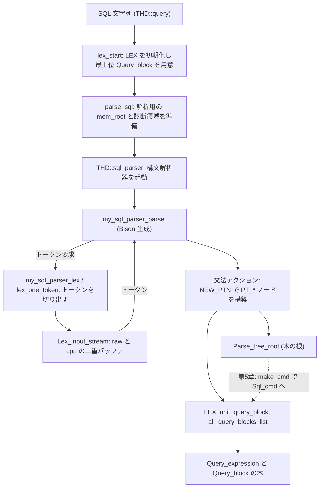

# 第4章 パーサ

> **本章で読むソース**
>
> - [`sql/sql_parse.cc`](https://github.com/mysql/mysql-server/blob/mysql-8.4.10/sql/sql_parse.cc)
> - [`sql/sql_class.cc`](https://github.com/mysql/mysql-server/blob/mysql-8.4.10/sql/sql_class.cc)
> - [`sql/sql_lex.cc`](https://github.com/mysql/mysql-server/blob/mysql-8.4.10/sql/sql_lex.cc)
> - [`sql/sql_lex.h`](https://github.com/mysql/mysql-server/blob/mysql-8.4.10/sql/sql_lex.h)
> - [`sql/parse_tree_node_base.h`](https://github.com/mysql/mysql-server/blob/mysql-8.4.10/sql/parse_tree_node_base.h)
> - [`sql/parse_tree_nodes.h`](https://github.com/mysql/mysql-server/blob/mysql-8.4.10/sql/parse_tree_nodes.h)
> - [`sql/sql_yacc.yy`](https://github.com/mysql/mysql-server/blob/mysql-8.4.10/sql/sql_yacc.yy)

## この章の狙い

クライアントが送ってきた SQL は、サーバに届いた時点では単なるバイト列である。
この章では、そのバイト列を **パースツリー**（構文木）という木構造へ変換する段を読む。
入口は `parse_sql`（`sql/sql_parse.cc`）で、そこから字句解析器と Bison 生成の構文解析器が呼ばれ、結果が `LEX` 構造体の中の `Query_block` 群に積まれる。

本章の範囲は「文字列を文法に従って木へ写す」ところまでに限る。
テーブル名やカラム名が実在するか、型が整合するかといった意味解析（名前解決）はこの段ではいっさい行わない。
構文解析は構文の妥当性だけを見て、意味の検査は第5章へ送る。
この分離自体が MySQL のパーサ設計の要点であり、本章の最後で機構として説明する。

## 前提

第3章で、1接続を表すセッションオブジェクト `THD` と、そのスレッドが回すコマンドループ `do_command` の入口までを読んだ。
本章はその続きである。
`do_command` がクライアントから受け取った SQL 文字列を `THD` に載せ、`dispatch_sql_command` を呼んだところから読み始める。

コードはサーバ層（`sql/`）に閉じており、ストレージエンジンには立ち入らない。

## パーサ入口までの呼び出し

`dispatch_sql_command` は、1つの SQL 文を受け取って解析と実行へ橋渡しする関数である。
解析に入る前に、まず `lex_start` を呼んで `THD` の `LEX` を初期化し、そのうえで `parse_sql` を呼ぶ。

[`sql/sql_parse.cc` L5285-L5303](https://github.com/mysql/mysql-server/blob/mysql-8.4.10/sql/sql_parse.cc#L5285-L5303)

```cpp
  lex_start(thd);

  thd->m_parser_state = parser_state;
  invoke_pre_parse_rewrite_plugins(thd);
  thd->m_parser_state = nullptr;

  // we produce digest if it's not explicitly turned off
  // by setting maximum digest length to zero
  if (get_max_digest_length() != 0)
    parser_state->m_input.m_compute_digest = true;

  LEX *lex = thd->lex;
  const char *found_semicolon = nullptr;

  bool err = thd->get_stmt_da()->is_error();
  size_t qlen = 0;

  if (!err) {
    err = parse_sql(thd, parser_state, nullptr);
```

`lex_start` は、この文の解析結果を入れる器を空の状態にそろえる。
`LEX` を `reset` し、最上位のクエリ式を1つ作り、それを「現在解析中のクエリブロック」に設定する。

[`sql/sql_lex.cc` L508-L526](https://github.com/mysql/mysql-server/blob/mysql-8.4.10/sql/sql_lex.cc#L508-L526)

```cpp
bool lex_start(THD *thd) {
  DBUG_TRACE;

  LEX *lex = thd->lex;

  lex->thd = thd;
  lex->reset();
  // Initialize the cost model to be used for this query
  thd->init_cost_model();

  const bool status = lex->new_top_level_query();
  assert(lex->current_query_block() == nullptr);
  lex->m_current_query_block = lex->query_block;

  assert(lex->m_IS_table_stats.is_valid() == false);
  assert(lex->m_IS_tablespace_stats.is_valid() == false);

  return status;
}
```

`parse_sql` 本体は、解析中だけ有効な一時状態を整えてから、実際の解析を `THD::sql_parser()` に委ねる。
解析の前後で `mem_root`（このクエリ専用のメモリアリーナ）に上限を設定し、専用の診断領域（`Diagnostics_area`）へ切り替える。
こうして、解析中に出たエラーや警告を実行段のものと混ぜずに扱えるようにしている。

[`sql/sql_parse.cc` L7186-L7195](https://github.com/mysql/mysql-server/blob/mysql-8.4.10/sql/sql_parse.cc#L7186-L7195)

```cpp
  thd->mem_root->set_max_capacity(thd->variables.parser_max_mem_size);
  thd->mem_root->set_error_for_capacity_exceeded(true);
  thd->push_internal_handler(&poomh);

  thd->push_diagnostics_area(parser_da, false);

  const bool mysql_parse_status = thd->sql_parser();

  thd->pop_internal_handler();
  thd->mem_root->set_max_capacity(0);
```

`THD::sql_parser()` が、字句解析と構文解析を起動する中心である。
Bison が `sql_yacc.yy` から生成した関数 `my_sql_parser_parse` を呼び、成功すれば木の根 `root` を受け取る。

[`sql/sql_class.cc` L3101-L3129](https://github.com/mysql/mysql-server/blob/mysql-8.4.10/sql/sql_class.cc#L3101-L3129)

```cpp
bool THD::sql_parser() {
  /*
    SQL parser function generated by YACC from sql_yacc.yy.

    In the case of success returns 0, and THD::is_error() is false.
    Otherwise returns 1, or THD::>is_error() is true.

    The second (output) parameter "root" returns the new parse tree.
    It is undefined (unchanged) on error. If "root" is NULL on success,
    then the parser has already called lex->make_sql_cmd() internally.
  */
  extern int my_sql_parser_parse(class THD * thd,
                                 class Parse_tree_root * *root);

  Parse_tree_root *root = nullptr;
  if (my_sql_parser_parse(this, &root) || is_error()) {
    /*
      Restore the original LEX if it was replaced when parsing
      a stored procedure. We must ensure that a parsing error
      does not leave any side effects in the THD.
    */
    cleanup_after_parse_error();
    return true;
  }
  if (root != nullptr && lex->make_sql_cmd(root)) {
    return true;
  }
  return false;
}
```

この関数は、解析の成否だけでなく、解析後の一歩も担う。
成功して `root` が返ったら、`lex->make_sql_cmd(root)` を呼んで木の根から実行用の `Sql_cmd` を作る。
`make_sql_cmd` の中身は第5章で読む。
ここでは「Bison が木を組み立て、その根を `LEX` に渡す」という制御の流れだけを押さえる。

## 字句解析（Lex_input_stream と MYSQLlex）

構文解析器は、文字を1つずつ見るのではなく、**トークン**の列を入力として受け取る。
SQL 文字列をトークン列に切り分けるのが字句解析器である。
Bison 生成の構文解析器は、トークンが欲しくなるたびに `my_sql_parser_lex`（伝統的な `MYSQLlex` に相当する `yylex` 実装）を呼ぶ。

[`sql/sql_lex.cc` L1367-L1370](https://github.com/mysql/mysql-server/blob/mysql-8.4.10/sql/sql_lex.cc#L1367-L1370)

```cpp
int my_sql_parser_lex(MY_SQL_PARSER_STYPE *yacc_yylval, POS *yylloc, THD *thd) {
  auto *yylval = reinterpret_cast<Lexer_yystype *>(yacc_yylval);
  Lex_input_stream *lip = &thd->m_parser_state->m_lip;
  int token;
```

字句解析の状態は `Lex_input_stream`（`lip`）が持つ。
このクラスは、解析中の入力文字列とその中の現在位置を保持する。
注目すべきは、入力を2本のバッファとして並行に持つ点である。

[`sql/sql_lex.h` L3291-L3306](https://github.com/mysql/mysql-server/blob/mysql-8.4.10/sql/sql_lex.h#L3291-L3306)

```cpp
/**
  This class represents the character input stream consumed during lexical
  analysis.

  In addition to consuming the input stream, this class performs some comment
  pre processing, by filtering out out-of-bound special text from the query
  input stream.

  Two buffers, with pointers inside each, are maintained in parallel. The
  'raw' buffer is the original query text, which may contain out-of-bound
  comments. The 'cpp' (for comments pre processor) is the pre-processed buffer
  that contains only the query text that should be seen once out-of-bound data
  is removed.
*/

class Lex_input_stream {
```

`raw` は受信したままの元テキストである。
`cpp` は、`/*! ... */` のような条件付きコメントを処理したあとの、構文解析器に見せるべきテキストである。
両者を平行に持つことで、構文解析が見るのは整形済みの `cpp` 側に保ちつつ、元のバイト範囲（行番号やエラー位置）は `raw` 側でたどれる。

実際にトークンを1つ切り出すのは `lex_one_token` である。
この関数は文字種ごとの状態遷移で動く小さな状態機械になっている。

[`sql/sql_lex.cc` L1469-L1484](https://github.com/mysql/mysql-server/blob/mysql-8.4.10/sql/sql_lex.cc#L1469-L1484)

```cpp
static int lex_one_token(Lexer_yystype *yylval, THD *thd) {
  uchar c = 0;
  bool comment_closed;
  int tokval, result_state;
  uint length;
  enum my_lex_states state;
  Lex_input_stream *lip = &thd->m_parser_state->m_lip;
  const CHARSET_INFO *cs = thd->charset();
  const my_lex_states *state_map = cs->state_maps->main_map;
  const uchar *ident_map = cs->ident_map;

  lip->yylval = yylval;  // The global state

  lip->start_token();
  state = lip->next_state;
  lip->next_state = MY_LEX_START;
```

`state_map` は文字コード（`CHARSET_INFO`）ごとに前計算されたテーブルで、1バイトを読むだけで「その文字が識別子の一部か、空白か、記号か」といった初期状態へ飛べる。
1文字あたりの分類が定数時間で済むため、長い SQL でも字句解析が文字数に比例した速さで進む。

## 構文解析（sql_yacc.yy）

文法の本体は `sql/sql_yacc.yy` にある。
ファイル冒頭は、生成される構文解析器が `THD` を引数として受け取り、その先で `yylex` まで渡すことを述べている。

[`sql/sql_yacc.yy` L32-L46](https://github.com/mysql/mysql-server/blob/mysql-8.4.10/sql/sql_yacc.yy#L32-L46)

```text
%{
/*
Note: YYTHD is passed as an argument to yyparse(), and subsequently to yylex().
*/
#define YYP (YYTHD->m_parser_state)
#define YYLIP (& YYTHD->m_parser_state->m_lip)
#define YYPS (& YYTHD->m_parser_state->m_yacc)
#define YYCSCL (YYLIP->query_charset)
#define YYMEM_ROOT (YYTHD->mem_root)
#define YYCLIENT_NO_SCHEMA (YYTHD->get_protocol()->has_client_capability(CLIENT_NO_SCHEMA))

#define YYINITDEPTH 100
#define YYMAXDEPTH 3200                        /* Because of 64K stack */
#define Lex (YYTHD->lex)
#define Select Lex->current_query_block()
```

文法の開始記号は `start_entry` である。
通常の文の入口は `sql_statement` で、ほかの分岐は式やパーティション定義など部分文法を直接解析するための入口（`GRAMMAR_SELECTOR_*`）になっている。

[`sql/sql_yacc.yy` L2301-L2307](https://github.com/mysql/mysql-server/blob/mysql-8.4.10/sql/sql_yacc.yy#L2301-L2307)

```text
start_entry:
          sql_statement
        | GRAMMAR_SELECTOR_EXPR bit_expr END_OF_INPUT
          {
            ITEMIZE($2, &$2);
            static_cast<Expression_parser_state *>(YYP)->result= $2;
          }
```

個々の規則の右辺には、文法要素を見つけたときに実行するアクション（中括弧の中）が書いてある。
そのアクションがパースツリーのノードを組み立てる。
`SELECT` 文を表す `select_stmt` 規則は、その典型である。

[`sql/sql_yacc.yy` L9672-L9683](https://github.com/mysql/mysql-server/blob/mysql-8.4.10/sql/sql_yacc.yy#L9672-L9683)

```text
select_stmt:
          query_expression
          {
            $$ = NEW_PTN PT_select_stmt(@$, $1);
          }
        | query_expression locking_clause_list
          {
            $$ = NEW_PTN PT_select_stmt(@$, NEW_PTN PT_locking(@$, $1, $2),
                                        nullptr, true);
          }
        | select_stmt_with_into
        ;
```

`query_expression`（`$1`）を解析し終えると、それを材料に `PT_select_stmt` という木のノードを1つ作り、規則の値（`$$`）として上位の規則へ渡す。
`NEW_PTN` は、ノードをクエリ専用のメモリアリーナ上に確保するためのマクロである。

[`sql/sql_yacc.yy` L225](https://github.com/mysql/mysql-server/blob/mysql-8.4.10/sql/sql_yacc.yy#L225-L225)

```text
#define NEW_PTN new(YYMEM_ROOT)
```

ここで作られる `PT_*` ノードは、構文構造をそのまま写しただけの素朴な木である。
このノードがまだ意味解析を済ませていないことは、基底クラス `Parse_tree_node_tmpl` のフラグに表れている。

[`sql/parse_tree_node_base.h` L227-L240](https://github.com/mysql/mysql-server/blob/mysql-8.4.10/sql/parse_tree_node_base.h#L227-L240)

```cpp
/**
  Base class for parse tree nodes (excluding the Parse_tree_root hierarchy)
*/
template <typename Context>
class Parse_tree_node_tmpl {
  friend class Item;  // for direct access to the "contextualized" field

  Parse_tree_node_tmpl(const Parse_tree_node_tmpl &);  // undefined
  void operator=(const Parse_tree_node_tmpl &);        // undefined

#ifndef NDEBUG
 private:
  bool contextualized = false;  // true if the node object is contextualized
#endif                          // NDEBUG
```

`contextualized` が `false` のあいだは、ノードはまだ「文脈に置かれていない」状態である。
名前解決や型の検査といった文脈依存の処理は `do_contextualize` で後から行う。
構文解析の段ではこのフラグは立たない。

文全体に対応する木の根は、`PT_*` の一般ノードとは別系統の `Parse_tree_root` から派生する。

[`sql/parse_tree_nodes.h` L157-L183](https://github.com/mysql/mysql-server/blob/mysql-8.4.10/sql/parse_tree_nodes.h#L157-L183)

```cpp
/**
  Base class for all top-level nodes of SQL statements

  @ingroup ptn_stmt
*/
class Parse_tree_root {
  Parse_tree_root(const Parse_tree_root &) = delete;
  void operator=(const Parse_tree_root &) = delete;

 protected:
  Parse_tree_root() = default;
  explicit Parse_tree_root(const POS &pos) : m_pos(pos) {}
  virtual ~Parse_tree_root() = default;

 public:
  /// Textual location of a token just parsed.
  POS m_pos;

  virtual Sql_cmd *make_cmd(THD *thd) = 0;

  // Return Json parse tree generated by SHOW PARSE_TREE.
  virtual std::string get_printable_parse_tree(THD *thd [[maybe_unused]]) {
    my_error(ER_NOT_SUPPORTED_YET, MYF(0),
             "Parse tree display of this statement");
    return "";
  }
};
```

`Parse_tree_root` の純粋仮想関数 `make_cmd` が、木の根から実行用の `Sql_cmd` を作る入口である。
構文解析が成功すると、この根が `THD::sql_parser()` の `root` に返り、`make_sql_cmd` 経由で `make_cmd` が呼ばれる。
木の構築（本章）と、木から実行コマンドへの変換（第5章）が、この `make_cmd` の境目で分かれている。

## パース結果の格納先（LEX と Query_block）

解析結果は `LEX` 構造体に集約される。
`LEX` は1つの SQL 文の解析状態の全体を表し、最上位のクエリ式と、その下のクエリブロック群を指す。

[`sql/sql_lex.h` L3852-L3861](https://github.com/mysql/mysql-server/blob/mysql-8.4.10/sql/sql_lex.h#L3852-L3861)

```cpp
struct LEX : public Query_tables_list {
  friend bool lex_start(THD *thd);

  Query_expression *unit;  ///< Outer-most query expression
  /// @todo: query_block can be replaced with unit->first-select()
  Query_block *query_block;            ///< First query block
  Query_block *all_query_blocks_list;  ///< List of all query blocks
 private:
  /* current Query_block in parsing */
  Query_block *m_current_query_block;
```

`Query_expression`（コード上では `unit`）は、1つのクエリブロック、または `UNION` などで結合された複数のクエリブロックを表す。

[`sql/sql_lex.h` L622-L626](https://github.com/mysql/mysql-server/blob/mysql-8.4.10/sql/sql_lex.h#L622-L626)

```cpp
/**
  This class represents a query expression (one query block or
  several query blocks combined with UNION).
*/
class Query_expression {
```

`Query_block` は、その内側の単位である。
`SELECT` キーワードに続いてテーブルリストがあり、必要なら `WHERE`、`GROUP BY` などが続く、いわゆる1つの問い合わせ指定を表す。

[`sql/sql_lex.h` L1162-L1167](https://github.com/mysql/mysql-server/blob/mysql-8.4.10/sql/sql_lex.h#L1162-L1167)

```cpp
/**
  This class represents a query block, aka a query specification, which is
  a query consisting of a SELECT keyword, followed by a table list,
  optionally followed by a WHERE clause, a GROUP BY, etc.
*/
class Query_block : public Query_term {
```

`Query_expression` と `Query_block` は、入れ子のクエリ（副問い合わせ、`UNION`、派生テーブル）を木として表すために、互いを親子や兄弟として参照し合う。
`lex_start` が最初に1つ作る最上位のクエリブロックが木の根に当たり、解析が副問い合わせに入るたびに新しい `Query_block` がぶら下がっていく。

字句解析から構文解析を経て `LEX` が組み上がるまでの流れを、次の図にまとめる。



## 構文解析の段では意味解析をしない

ここまで読んだ範囲には、テーブルやカラムの実在を確かめる処理が一切現れていない。
`select_stmt` 規則は、`query_expression` の中身が正しいテーブルを指すかを問わず、構文の形だけを見て `PT_select_stmt` を作った。
`Parse_tree_node_tmpl` の `contextualized` フラグも、この段では `false` のままだった。

この分離は機構として効いている。
構文解析の段は、入力の構文構造だけに依存し、データディクショナリ（どんなテーブルが存在するか）にも、セッションの権限にも触れない。
そのため、構文解析は「文字列から木を作る純粋な変換」として再現可能になり、プリペアドステートメントのように同じ文を別の文脈で何度も解析して実行する場面で、解析と意味解析を別々のタイミングに置ける。
名前解決と型検査は、第5章で読む `make_cmd` 以降の文脈づけ（`do_contextualize`）に集約される。

## 高速化と最適化の工夫

本章で見たコードには、機構レベルの工夫が複数ある。

第一に、字句解析器が文字コードごとに前計算した状態遷移表（`state_map`）で動く点である。
入力1バイトを読むたびに、分岐の連鎖をたどるのではなく表引き1回で初期状態が決まるため、字句解析は入力長に比例した一定の速さで進む。

第二に、パースツリーのノードをクエリ専用のメモリアリーナ（`mem_root`）から確保する点である。
`NEW_PTN` が示すとおり、`PT_*` ノードはすべて `mem_root` 上に置かれる。
木のノードを1つずつ `new`／`delete` で管理する代わりに、解析が終わったらアリーナごと一括で解放できるため、ノード単位の解放処理が不要になり、断片化も避けられる。

第三に、文法を LALR(1) に保つための字句解析側の先読みである。
`WITH ROLLUP` は、`WITH` を見ただけでは続きが共通テーブル式の `WITH` か `ROLLUP` 修飾かを決められず、文法だけでは2トークンの先読み（LALR(2)）を要する。
そこで字句解析器が `WITH` の次を覗き、`ROLLUP` が続くときだけ専用トークンへまとめる。

[`sql/sql_lex.cc` L1431-L1460](https://github.com/mysql/mysql-server/blob/mysql-8.4.10/sql/sql_lex.cc#L1431-L1460)

```cpp
  switch (token) {
    case WITH:
      /*
        Parsing 'WITH' 'ROLLUP' requires 2 look ups,
        which makes the grammar LALR(2).
        Replace by a single 'WITH_ROLLUP' token,
        to transform the grammar into a LALR(1) grammar,
        which sql_yacc.yy can process.
      */
      token = lex_one_token(yylval, thd);
      switch (token) {
        case ROLLUP_SYM:
          yylloc->cpp.end = lip->get_cpp_ptr();
          yylloc->raw.end = lip->get_ptr();
          lip->add_digest_token(WITH_ROLLUP_SYM, yylval);
          return WITH_ROLLUP_SYM;
        default:
          /*
            Save the token following 'WITH'
          */
          lip->lookahead_yylval = lip->yylval;
          lip->yylval = nullptr;
          lip->lookahead_token = token;
          yylloc->cpp.end = lip->get_cpp_ptr();
          yylloc->raw.end = lip->get_ptr();
          lip->add_digest_token(WITH, yylval);
          return WITH;
      }
      break;
  }
```

先読みで余ったトークンは `lookahead_token` に退避し、次回の `my_sql_parser_lex` 呼び出しで先頭に返す。
この一手間によって、構文解析器が扱う文法を機械的に生成しやすい LALR(1) の範囲に収め、文法表の規模と解析の単純さを保っている。

## まとめ

本章では、SQL 文字列をパースツリーへ変換する段を読んだ。
入口 `parse_sql` は解析用の一時状態を整え、`THD::sql_parser()` が Bison 生成の `my_sql_parser_parse` を起動する。
構文解析器はトークンが要るたびに字句解析器 `my_sql_parser_lex` を呼び、`Lex_input_stream` が元テキスト（raw）と整形後テキスト（cpp）を平行に保ちながらトークンを切り出す。
文法 `sql_yacc.yy` のアクションが `NEW_PTN` で `PT_*` ノードを `mem_root` 上に組み立て、結果が `LEX` の `Query_expression` と `Query_block` の木として積み上がる。

この段では意味解析をしない。
構文の形だけを見て木を作り、名前解決と型検査は木の根 `Parse_tree_root` の `make_cmd` 以降へ送る。
最適化としては、文字コード別の状態遷移表による字句解析、`mem_root` アリーナによるノードの一括確保、字句解析側の先読みによる文法の LALR(1) 化を見た。

## 関連する章

- 第3章「[接続、スレッド、セッション](../part00-introduction/03-connection-thread-session.md)」では、本章の入口に至るコマンドループと `THD` を読んだ。
- 第5章「[クエリの解決と準備](05-resolution-and-prepare.md)」では、本章で作った木に対する `make_cmd` 以降の意味解析（名前解決と型検査）を読む。
- 第37章「[MEM_ROOT と文単位のメモリ寿命](../part07-server-foundation/37-mem-root.md)」では、本章のパースツリーが載る `mem_root` の仕組みと文単位のメモリ寿命を読む。
