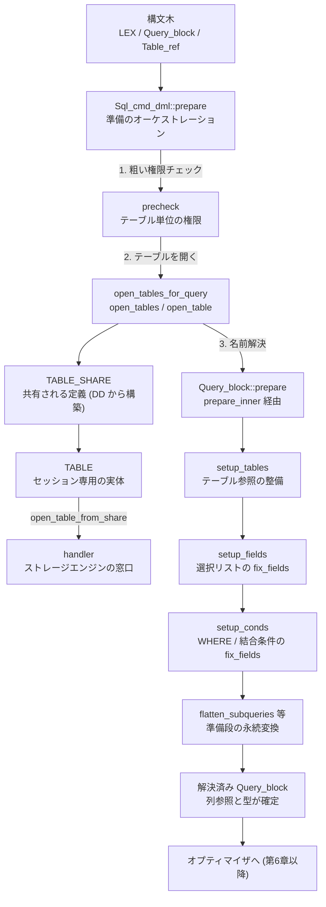

# 第5章 クエリの解決と準備

> **本章で読むソース**
>
> - [`sql/sql_select.cc`](https://github.com/mysql/mysql-server/blob/mysql-8.4.10/sql/sql_select.cc)
> - [`sql/sql_base.cc`](https://github.com/mysql/mysql-server/blob/mysql-8.4.10/sql/sql_base.cc)
> - [`sql/sql_resolver.cc`](https://github.com/mysql/mysql-server/blob/mysql-8.4.10/sql/sql_resolver.cc)

## この章の狙い

第4章のパーサは、SQL 文字列を構文木へ変換した。
構文木は文の形をそのまま写した木であり、まだ最適化にかけられる状態ではない。
`SELECT a FROM t WHERE b > 1` の `t` がどの実テーブルを指すのか、`a` や `b` がどの列でどんな型なのかは、この時点では未確定である。
これらを確定させ、各 `Item` に型と参照先を結びつけた解決済みの `Query_block` を作るのが、本章で読む「準備（prepare）」の段である。

準備は大きく二つの作業からなる。
一つは、文が参照するテーブルを実体として開き、ストレージエンジンの `handler` を結びつける「テーブルのオープン」である。
もう一つは、開いたテーブルの定義に照らして列名やテーブル名を解決し、式に型を付ける「名前解決」である。
本章は DML 文の入口 `Sql_cmd_dml::prepare` から始め、テーブルのオープン `open_tables_for_query`、名前解決の中核 `Query_block::prepare` の順にたどる。
オプティマイザが受け取る入力がどのように整えられるかを、コードに即して読む。

## 前提

- 第3章で見たとおり、1つの文の状態はすべて `THD` に集約され、構文木は `LEX`（`thd->lex`）が保持する。
- 第4章のパーサが `LEX` の下に `Query_expression` と `Query_block` の木を組み立て、各テーブル参照を `Table_ref`（旧名 `TABLE_LIST`）の連結リスト `lex->query_tables` として並べた状態から始める。
- テーブル定義の正本はデータディクショナリ（DD）が `dd::Table` として持ち、本章では準備の段から DD をどう引くかだけを見る（DD の構造は第30章で扱う）。

## DML の入口 `Sql_cmd_dml::prepare`

`SELECT` や `INSERT` のような DML 文の準備は、共通の基底クラス `Sql_cmd_dml` の `prepare` がオーケストレーションする。
この関数は、準備に必要な手順を上から順に呼び分ける骨格であり、個々の文種に固有の処理は仮想関数へ委譲する。
まず関数の入口で、構文木 `lex` と結果ハンドラ `result` を `THD` から取り出す。

[`sql/sql_select.cc` L490-L502](https://github.com/mysql/mysql-server/blob/mysql-8.4.10/sql/sql_select.cc#L490-L502)

```cpp
bool Sql_cmd_dml::prepare(THD *thd) {
  DBUG_TRACE;

  bool error_handler_active = false;

  Ignore_error_handler ignore_handler;
  Strict_error_handler strict_handler;

  // @todo: Move this to constructor?
  lex = thd->lex;

  // Parser may have assigned a specific query result handler
  result = lex->result;
```

続く本体が、準備の三段を順に踏む。
最初に粗い権限チェック `precheck`、次にテーブルのオープン `open_tables_for_query`、最後に文種ごとの名前解決 `prepare_inner` を呼ぶ。

[`sql/sql_select.cc` L522-L565](https://github.com/mysql/mysql-server/blob/mysql-8.4.10/sql/sql_select.cc#L522-L565)

```cpp

  // Perform a coarse statement-specific privilege check.
  if (precheck(thd)) goto err;

  // Trigger out_of_memory condition inside open_tables_for_query()
  DBUG_EXECUTE_IF("sql_cmd_dml_prepare__out_of_memory",
                  DBUG_SET("+d,simulate_out_of_memory"););
  /*
    Open tables and expand views.
    During prepare of query (not as part of an execute), acquire only
    S metadata locks instead of SW locks to be compatible with concurrent
    LOCK TABLES WRITE and global read lock.
  */
  if (open_tables_for_query(
          thd, lex->query_tables,
          needs_explicit_preparation() ? MYSQL_OPEN_FORCE_SHARED_MDL : 0)) {
    if (thd->is_error())  // @todo - dictionary code should be fixed
      goto err;
    if (error_handler_active) thd->pop_internal_handler();
    lex->cleanup(false);
    return true;
  }
  DEBUG_SYNC(thd, "after_open_tables");
#ifndef NDEBUG
  if (sql_command_code() == SQLCOM_SELECT) DEBUG_SYNC(thd, "after_table_open");
#endif

  lex->set_using_hypergraph_optimizer(
      thd->optimizer_switch_flag(OPTIMIZER_SWITCH_HYPERGRAPH_OPTIMIZER));

  if (thd->lex->validate_use_in_old_optimizer()) {
    return true;
  }

  if (lex->set_var_list.elements && resolve_var_assignments(thd, lex))
    goto err; /* purecov: inspected */

  {
    const Prepare_error_tracker tracker(thd);
    const Prepared_stmt_arena_holder ps_arena_holder(thd);
    const Enable_derived_merge_guard derived_merge_guard(
        thd, is_show_cmd_using_system_view(thd));

    if (prepare_inner(thd)) goto err;
```

この三段の順序には理由がある。
`precheck` はテーブルを開く前の段階で、文が触れるテーブル全体に対して利用者が必要な権限（`SELECT` など）を持つかを粗く確かめる。
権限のない利用者の要求でテーブルを開きにいく無駄と情報漏れを避けるため、オープンより前に置かれている。
列単位の細かな権限チェックは、列がどのテーブルの何という列かが解決された後でなければできないため、後段の名前解決のなかで `Item_field::fix_fields` を通して行う。
このように、権限チェックはオープン前の粗い確認と解決後の細かい確認の二段に分かれている。

`prepare_inner` は文種ごとに実装が違う純粋仮想関数であり、`Sql_cmd_dml::prepare` の骨格を変えずに `SELECT`／`INSERT`／`UPDATE`／`DELETE` の差分を吸収する。
`SELECT` の実装 `Sql_cmd_select::prepare_inner` は、結果ハンドラを用意したうえで、単一の `Query_block` なら `Query_block::prepare` を、複数ブロックの和集合などなら `Query_expression::prepare` を呼ぶ。

[`sql/sql_select.cc` L643-L658](https://github.com/mysql/mysql-server/blob/mysql-8.4.10/sql/sql_select.cc#L643-L658)

```cpp
  if (unit->is_simple()) {
    Query_block *const select = unit->first_query_block();
    select->context.resolve_in_select_list = true;
    select->set_query_result(result);
    unit->set_query_result(result);
    // Unlock the table as soon as possible, so don't set SELECT_NO_UNLOCK.
    select->make_active_options(0, 0);

    if (select->prepare(thd, nullptr)) return true;

    unit->set_prepared();
  } else {
    // If we have multiple query blocks, don't unlock and re-lock
    // tables between each each of them.
    if (unit->prepare(thd, result, nullptr, SELECT_NO_UNLOCK, 0)) return true;
  }
```

## テーブルのオープン `open_tables_for_query`

名前解決の前に、文が参照するテーブルを実体として開く必要がある。
列名 `a` を解決するには、`a` がどのテーブルの何番目の列で型は何かという情報が要り、その情報はテーブル定義からしか得られないからである。
`open_tables_for_query` は、準備段でテーブルを開くための薄いラッパーであり、`lex->query_tables` の連結リストをまとめて開く。

[`sql/sql_base.cc` L6909-L6918](https://github.com/mysql/mysql-server/blob/mysql-8.4.10/sql/sql_base.cc#L6909-L6918)

```cpp
bool open_tables_for_query(THD *thd, Table_ref *tables, uint flags) {
  DML_prelocking_strategy prelocking_strategy;
  MDL_savepoint mdl_savepoint = thd->mdl_context.mdl_savepoint();
  DBUG_TRACE;

  assert(tables == thd->lex->query_tables);

  if (open_tables(thd, &tables, &thd->lex->table_count, flags,
                  &prelocking_strategy))
    goto end;
```

実体の処理は `open_tables` にある。
この関数は、テーブル参照リストの先頭から末尾まで走査し、各参照について `open_and_process_table`（内部で `open_table` を呼ぶ）を実行する。
ビューやトリガ、ストアドルーチンが参照する別テーブルを「プリロック」として連鎖的にリストへ追加するため、走査は while ループと for ループの二重で書かれている。

[`sql/sql_base.cc` L5966-L5971](https://github.com/mysql/mysql-server/blob/mysql-8.4.10/sql/sql_base.cc#L5966-L5971)

```cpp
    for (tables = *table_to_open; tables;
         table_to_open = &tables->next_global, tables = tables->next_global) {
      old_table = (*table_to_open)->table;
      error = open_and_process_table(thd, thd->lex, tables, counter,
                                     prelocking_strategy, has_prelocking_list,
                                     &ot_ctx);
```

### `TABLE_SHARE` と `TABLE` の分離

1つのテーブル参照を開く `open_table` の中で、MySQL のテーブルオブジェクトが二層に分かれている事情が現れる。
共有される定義側が `TABLE_SHARE`、セッションごとに使う実体側が `TABLE` である。
`open_table` はまず、テーブルキャッシュ（TDC）から `TABLE_SHARE` を取得する。

[`sql/sql_base.cc` L3300-L3304](https://github.com/mysql/mysql-server/blob/mysql-8.4.10/sql/sql_base.cc#L3300-L3304)

```cpp
  mysql_mutex_lock(&LOCK_open);

  if (!(share = get_table_share_with_discover(
            thd, table_list, key, key_length,
            flags & MYSQL_OPEN_SECONDARY_ENGINE, &error))) {
```

`TABLE_SHARE` はテーブル定義を表す読み取り専用の構造体であり、列の並び、型、インデックスの定義、行フォーマットなど、同じテーブルを使うすべてのスレッドで共通の情報を持つ。
キャッシュにまだ無ければ、`get_table_share_with_discover` の先で DD を引いて定義を構築し、キャッシュへ載せる。
定義はテーブルごとに1つ共有すれば足り、接続のたびに作り直す必要はない。
この共有が、多数の接続が同じテーブルを開くワークロードでメモリと構築コストを節約する。

`TABLE_SHARE` を得たあと、`open_table` は DD クライアントから `dd::Table` を取得し、その定義から実体側の `TABLE` を作る。

[`sql/sql_base.cc` L3446-L3474](https://github.com/mysql/mysql-server/blob/mysql-8.4.10/sql/sql_base.cc#L3446-L3474)

```cpp
  {
    const dd::cache::Dictionary_client::Auto_releaser releaser(
        thd->dd_client());
    const dd::Table *table_def = nullptr;
    if (!(flags & MYSQL_OPEN_NO_NEW_TABLE_IN_SE) &&
        thd->dd_client()->acquire(share->db.str, share->table_name.str,
                                  &table_def)) {
      // Error is reported by the dictionary subsystem.
      goto err_lock;
    }

    if (table_def && table_def->hidden() == dd::Abstract_table::HT_HIDDEN_SE) {
      my_error(ER_NO_SUCH_TABLE, MYF(0), table_list->db,
               table_list->table_name);
      goto err_lock;
    }

    /* make a new table */
    if (!(table = (TABLE *)my_malloc(key_memory_TABLE, sizeof(*table),
                                     MYF(MY_WME))))
      goto err_lock;

    error = open_table_from_share(
        thd, share, alias,
        ((flags & MYSQL_OPEN_NO_NEW_TABLE_IN_SE)
             ? 0
             : ((uint)(HA_OPEN_KEYFILE | HA_OPEN_RNDFILE | HA_GET_INDEX |
                       HA_TRY_READ_ONLY))),
        EXTRA_RECORD, thd->open_options, table, false, table_def);
```

`TABLE` は1つのセッションがそのテーブルを操作するための実体であり、現在の行を置くレコードバッファや、ストレージエンジンへの窓口である `handler`（`table->file`）を持つ。
`handler` の生成とストレージエンジンのテーブルを開く `ha_open` の呼び出しは、ここから呼ばれる `open_table_from_share`（`sql/table.cc`）の中で行われる。
`open_table_from_share` が返った時点で、`TABLE` は `TABLE_SHARE` の定義を共有しつつ、自分専用のバッファと、InnoDB などの実装に結びついた `handler` を持つ。
`handler` を介してストレージエンジンと話す設計は第11章で扱う。

これで、テーブル参照の `Table_ref::table` に開いた `TABLE` が結びつき、名前解決が参照できる材料がそろう。

## 名前解決と準備 `Query_block::prepare`

テーブルが開けたので、構文木の各 `Item` を解決する段に入る。
1つの `Query_block`（1つの `SELECT ... FROM ... WHERE ...` ブロック）を解決するのが `Query_block::prepare` である。
関数の上のコメントが、この関数の責務を要約している。

[`sql/sql_resolver.cc` L130-L144](https://github.com/mysql/mysql-server/blob/mysql-8.4.10/sql/sql_resolver.cc#L130-L144)

```cpp
/**
  Prepare query block for optimization.

  Resolve table and column information.
  Resolve all expressions (item trees), ie WHERE clause, join conditions,
  GROUP BY clause, HAVING clause, ORDER BY clause, LIMIT clause.
  Prepare all subqueries recursively as part of resolving the expressions.
  Apply permanent transformations to the abstract syntax tree, such as
  semi-join transformation, derived table transformation, elimination of
  constant values and redundant clauses (e.g ORDER BY, GROUP BY).

  @param thd    thread handler
  @param insert_field_list List of fields when used in INSERT, otherwise NULL

  @returns false if success, true if error
```

本体は、構文木の節を上から順に解決していく。
まず `setup_tables` がテーブル参照を整え、各テーブルにビット位置などを割り当てる。

[`sql/sql_resolver.cc` L243-L245](https://github.com/mysql/mysql-server/blob/mysql-8.4.10/sql/sql_resolver.cc#L243-L245)

```cpp
  /* Check that all tables, fields, conds and order are ok */

  if (setup_tables(thd, get_table_list(), false)) return true;
```

次に、選択リストを解決する。
`SELECT *` のワイルドカードは `setup_wild` で実列へ展開し、続く `setup_fields` で選択リストの各式を解決する。

[`sql/sql_resolver.cc` L277-L283](https://github.com/mysql/mysql-server/blob/mysql-8.4.10/sql/sql_resolver.cc#L277-L283)

```cpp
  if (with_wild && setup_wild(thd)) return true;
  if (setup_base_ref_items(thd)) return true; /* purecov: inspected */

  if (setup_fields(thd, thd->want_privilege, /*allow_sum_func=*/true,
                   /*split_sum_funcs=*/true, /*column_update=*/false,
                   insert_field_list, &fields, base_ref_items))
    return true;
```

`setup_fields` は選択リストの各 `Item` に対して `fix_fields` を呼ぶ。
`fix_fields` こそが解決の中心であり、`Item_field` であれば列名を開いた `TABLE` の列に結びつけ、各 `Item` の戻り値の型を確定させる。

[`sql/sql_base.cc` L9211-L9217](https://github.com/mysql/mysql-server/blob/mysql-8.4.10/sql/sql_base.cc#L9211-L9217)

```cpp
  for (auto it = fields->begin(); it != fields->end(); ++it) {
    const size_t old_size = fields->size();
    Item *item = *it;
    assert(!item->hidden);
    Item **item_pos = &*it;
    if ((!item->fixed && item->fix_fields(thd, item_pos)) ||
        (item = *item_pos)->check_cols(1)) {
```

選択リストの次は、結合条件と `WHERE` 句を `setup_conds` が解決する。

[`sql/sql_resolver.cc` L296-L297](https://github.com/mysql/mysql-server/blob/mysql-8.4.10/sql/sql_resolver.cc#L296-L297)

```cpp
  // Set up join conditions and WHERE clause
  if (setup_conds(thd)) return true;
```

`setup_conds` の中身は、`WHERE` 条件の `Item` に同じく `fix_fields` をかける。
解決のあと、条件が定数だけで構成されているなら `simplify_const_condition` で畳み込む。
`WHERE 1 = 1` のような恒真条件を準備段で消しておけば、後段のオプティマイザとエグゼキュータがその評価を毎行繰り返さずに済む。

[`sql/sql_resolver.cc` L1512-L1528](https://github.com/mysql/mysql-server/blob/mysql-8.4.10/sql/sql_resolver.cc#L1512-L1528)

```cpp
  if (m_where_cond) {
    assert(m_where_cond->is_bool_func());
    resolve_place = Query_block::RESOLVE_CONDITION;
    thd->where = "where clause";
    if ((!m_where_cond->fixed &&
         m_where_cond->fix_fields(thd, &m_where_cond)) ||
        m_where_cond->check_cols(1))
      return true;

    assert(m_where_cond->data_type() != MYSQL_TYPE_INVALID);

    // Simplify the where condition if it's a const item
    if (m_where_cond->const_item() && !thd->lex->is_view_context_analysis() &&
        !m_where_cond->walk(&Item::is_non_const_over_literals,
                            enum_walk::POSTFIX, nullptr) &&
        simplify_const_condition(thd, &m_where_cond))
      return true;
```

サブクエリは、各句の `Item` を `fix_fields` で解決する過程で再帰的に準備される。
解決が一通り終わると、`Query_block::prepare` は準備段の永続変換を施す。
そのうち代表的なものが、相関の弱い `IN`／`EXISTS` サブクエリを半結合（semi-join）へ平坦化する `flatten_subqueries` である。

[`sql/sql_resolver.cc` L590](https://github.com/mysql/mysql-server/blob/mysql-8.4.10/sql/sql_resolver.cc#L590-L590)

```cpp
  if (has_sj_candidates() && flatten_subqueries(thd)) return true;
```

サブクエリを独立に実行する形のまま残すと、外側の行ごとに内側を評価しがちで効率が悪い。
半結合へ書き換えておけば、後段の join 最適化（第7章）が外側と内側を1つの結合として扱い、結合順序の選択肢に含められる。
これらの変換は構文木そのものを書き換える永続変換であり、ここで一度行えば以後の最適化と実行が変換後の木を共有する。

## 構文木から解決済み `Query_block` までの流れ

ここまでの流れを1つの図にまとめる。
パーサが作った構文木が、テーブルのオープンと名前解決を経て、オプティマイザへ渡せる解決済みの `Query_block` になる。



## まとめ

DML 文の準備は `Sql_cmd_dml::prepare` がオーケストレーションし、粗い権限チェック、テーブルのオープン、名前解決の三段を順に踏む。
権限チェックを二段に分けるのは、テーブル単位の確認はオープン前にでき、列単位の確認は名前解決で列が確定した後でなければできないからである。
テーブルのオープンは `open_tables_for_query` から `open_table` へ進み、DD から構築した共有定義 `TABLE_SHARE` をテーブルキャッシュ経由で得たうえで、セッション専用の実体 `TABLE` を作って `handler` を結びつける。
定義を `TABLE_SHARE` として共有し実体だけを `TABLE` ごとに持つ分離が、多数の接続が同じテーブルを開く状況で構築コストとメモリを抑える。
名前解決は `Query_block::prepare` が担い、`setup_tables`、`setup_fields`、`setup_conds` の順に構文木の各節へ `fix_fields` をかけ、列参照を開いた `TABLE` に結びつけて式に型を付ける。
解決のあと、定数条件の畳み込みやサブクエリの半結合への平坦化といった永続変換を施し、オプティマイザが受け取れる解決済みの `Query_block` を作る。
構文木をオプティマイザの入力へ整えるこの段が、文の意味を確定させ、後段の最適化を機械的なコスト比較として書けるようにしている。

## 関連する章

- [第4章 パーサ](04-parser.md)
- [第6章 オプティマイザ（論理変換とクエリブロック）](06-optimizer-transformations.md)
- [第11章 ハンドラ API とストレージエンジンプラグイン](11-handler-api.md)
- [第30章 データディクショナリ](../part06-dictionary-ddl-ops/30-data-dictionary.md)
