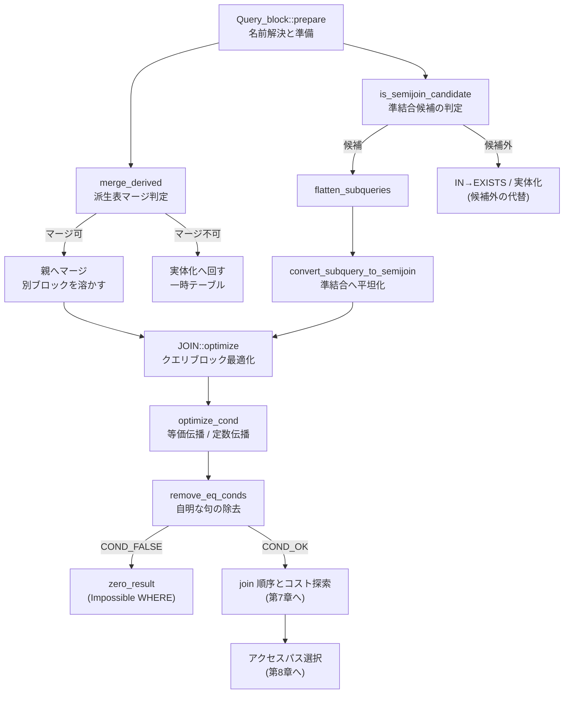

# 第6章 オプティマイザ（論理変換とクエリブロック）

> **本章で読むソース**
>
> - [`sql/sql_optimizer.cc`](https://github.com/mysql/mysql-server/blob/mysql-8.4.10/sql/sql_optimizer.cc)
> - [`sql/sql_resolver.cc`](https://github.com/mysql/mysql-server/blob/mysql-8.4.10/sql/sql_resolver.cc)
> - [`sql/item_subselect.cc`](https://github.com/mysql/mysql-server/blob/mysql-8.4.10/sql/item_subselect.cc)

## この章の狙い

オプティマイザの仕事は、join の順序を選びアクセスパスをコストで比較する探索だけではない。
その探索に入る前に、クエリの意味を変えずに形を整える論理変換の段がある。
本章は、コストベースの探索が始まる手前で何が起きているかを読む。

論理変換は大きく2系統に分かれる。
第1は条件の正規化であり、`WHERE` や `HAVING` の述語を等価変換し、常に真や常に偽の句を畳んで取り除く。
第2はサブクエリと派生表の構造変換であり、相関サブクエリを準結合（semijoin）へ、派生表を親クエリブロックへのマージか実体化へと振り分ける。
これらは入力 SQL の答えを変えないまま、後段のコスト探索がより良い計画を選べる形へクエリを書き換える。

本章で押さえる最適化は、相関サブクエリの準結合変換である。
`IN (SELECT ...)` を素朴に実行すると、外側の行ごとにサブクエリを再実行することになる。
これを1つの結合に畳み込めば、外側の行数ぶんの再実行が1回の結合操作に置き換わり、結合順序の探索対象にも乗る。

## 前提

第4章でパーサが `LEX` を構築し、第5章で名前解決と準備（`Query_block::prepare`）が走ることを見た。
本章の論理変換のうち、サブクエリと派生表の構造変換は準備フェーズ（`sql_resolver.cc`）で行われ、条件の正規化はその後の `JOIN::optimize`（`sql_optimizer.cc`）の前半で行われる。
コード引用はすべて GitHub タグ `mysql-8.4.10` に固定する。

クエリの構造は2つの型で表される。
**`Query_block`** は1つの `SELECT` ブロックを表し、その `FROM`、`WHERE`、`GROUP BY` などを保持する。
**`Query_expression`**（コード上は `Query_expression`、概念上の unit）は、`UNION` のように複数の `Query_block` をまとめる単位であり、サブクエリ本体や派生表本体も1つの `Query_expression` として表現される。
論理変換は、この入れ子になったクエリブロックの木に作用して、ブロックの数を減らしたり、別ブロックのテーブルを親へ引き上げたりする。

## 条件の正規化はどこで起きるか

`JOIN::optimize` は、1つの `Query_block` に対する最適化の入口である。

[`sql/sql_optimizer.cc L362`](https://github.com/mysql/mysql-server/blob/mysql-8.4.10/sql/sql_optimizer.cc#L362)

```cpp
bool JOIN::optimize(bool finalize_access_paths) {
```

この関数の前半で、`WHERE` 条件と `HAVING` 条件をそれぞれ `optimize_cond` に通す。
`optimize_cond` は条件式を等価変換し、定数を伝播させ、自明な句を取り除く役割を持つ。

[`sql/sql_optimizer.cc L497-L524`](https://github.com/mysql/mysql-server/blob/mysql-8.4.10/sql/sql_optimizer.cc#L497-L524)

```cpp
  if (where_cond || query_block->outer_join) {
    if (optimize_cond(thd, &where_cond, &cond_equal, &query_block->m_table_nest,
                      &query_block->cond_value)) {
      error = 1;
      DBUG_PRINT("error", ("Error from optimize_cond"));
      return true;
    }
    if (query_block->cond_value == Item::COND_FALSE) {
      zero_result_cause = "Impossible WHERE";
      best_rowcount = 0;
      set_root_access_path(create_access_paths_for_zero_rows());
      goto setup_subq_exit;
    }
  }
  if (having_cond) {
    if (optimize_cond(thd, &having_cond, &cond_equal, nullptr,
                      &query_block->having_value)) {
      error = 1;
      DBUG_PRINT("error", ("Error from optimize_cond"));
      return true;
    }
    if (query_block->having_value == Item::COND_FALSE) {
      zero_result_cause = "Impossible HAVING";
      best_rowcount = 0;
      set_root_access_path(create_access_paths_for_zero_rows());
      goto setup_subq_exit;
    }
  }
```

2つの呼び出しには違いがある。
`WHERE` の呼び出しは第4引数に `&query_block->m_table_nest`（join のテーブルリスト）を渡し、`HAVING` の呼び出しは `nullptr` を渡す。
後で見るように、この引数の有無が、等価結合の構築を `WHERE` でだけ走らせる分岐になる。

`optimize_cond` が条件を定数の偽へ畳んだとき、`cond_value` は `Item::COND_FALSE` になる。
そのとき `JOIN::optimize` は `zero_result_cause` に `"Impossible WHERE"`（`HAVING` 側なら `"Impossible HAVING"`）を立て、0 行を返すアクセスパスを据えて `setup_subq_exit` へ飛ぶ。
コスト探索に入る前に、結果が空だと確定したクエリをここで打ち切るわけである。

## `optimize_cond` の3段

`optimize_cond` の本体は、条件式に対する3つの変換を順に適用する。

[`sql/sql_optimizer.cc L10451-L10453`](https://github.com/mysql/mysql-server/blob/mysql-8.4.10/sql/sql_optimizer.cc#L10451-L10453)

```cpp
bool optimize_cond(THD *thd, Item **cond, COND_EQUAL **cond_equal,
                   mem_root_deque<Table_ref *> *join_list,
                   Item::cond_result *cond_value) {
```

第1段は等価伝播である。
`join_list` が渡されたとき（つまり `WHERE` のとき）だけ `build_equal_items` を呼び、`a = b AND b = c` のような連鎖を1つの多重等価（`a = b = c`）へまとめ、定数が混ざっていればそれを各項へ代入する。
これにより、後段が `a` の値を知れば `b` も `c` も定数として扱える。

第2段は定数伝播であり、`propagate_cond_constants` が既知の定数を条件木の全体へ広げる。

第3段が自明な句の除去である。

[`sql/sql_optimizer.cc L10514-L10524`](https://github.com/mysql/mysql-server/blob/mysql-8.4.10/sql/sql_optimizer.cc#L10514-L10524)

```cpp
  if (*cond) {
    Opt_trace_object step_wrapper(trace);
    step_wrapper.add_alnum("transformation", "trivial_condition_removal");
    {
      const Opt_trace_disable_I_S disable_trace_wrapper(
          trace, !(*cond)->has_subquery());
      const Opt_trace_array trace_subselect(trace, "subselect_evaluation");
      if (remove_eq_conds(thd, *cond, cond, cond_value)) return true;
    }
    step_wrapper.add("resulting_condition", *cond);
  }
```

`remove_eq_conds` は、常に真や常に偽になる述語を畳み、`cond_value` に `COND_TRUE`、`COND_FALSE`、`COND_OK` のいずれかを設定する。
ここが、先の `JOIN::optimize` で見た `Impossible WHERE` の判定を生む箇所である。

定数畳み込みの核は、評価可能な述語をその場で計算する分岐にある。

[`sql/sql_optimizer.cc L10652-L10657`](https://github.com/mysql/mysql-server/blob/mysql-8.4.10/sql/sql_optimizer.cc#L10652-L10657)

```cpp
  } else if (can_evaluate_condition(thd, cond)) {
    bool value;
    if (eval_const_cond(thd, cond, &value)) return true;
    *cond_value = value ? Item::COND_TRUE : Item::COND_FALSE;
    *retcond = nullptr;
    return false;
```

実行時に定数となる述語（たとえば `1 = 1` や `1 = 2`）は `eval_const_cond` で直接評価され、真偽が `COND_TRUE` か `COND_FALSE` に写される。
`retcond` を `nullptr` に置くことで、その述語は条件木から落とされる。
`AND` の下に1つでも偽が現れれば全体が偽に、`OR` の下に1つでも真が現れれば全体が真になり、上位の論理階層ごと畳まれる。

## 相関サブクエリを準結合へ畳む

構造変換のうち中心となるのが、`IN`／`EXISTS` の相関サブクエリを準結合へ平坦化する変換である。
変換の意図は、`flatten_subqueries` の頭注に図示されている。

[`sql/sql_resolver.cc L3673-L3687`](https://github.com/mysql/mysql-server/blob/mysql-8.4.10/sql/sql_resolver.cc#L3673-L3687)

```cpp
  and convert the predicate and subquery into a semi-join nest:

  @code
  SELECT ...
  FROM ot SEMI JOIN (it1 ... itN), ...
  WHERE outer_where AND subq_where AND oe=ie
  @endcode

  that is, in order to do the conversion, we need to

   * Create the "SEMI JOIN (it1 .. itN)" part and add it into the parent
     query block's FROM structure.
   * Add "AND subq_where AND oe=ie" into parent query block's WHERE (or ON if
     the subquery predicate was in an ON condition)
   * Remove the subquery predicate from the parent query block's WHERE
```

`oe IN (SELECT ie FROM ...)` を、外側テーブル `ot` と内側テーブル群を準結合（`SEMI JOIN`）でつなぎ、結合条件 `oe = ie` を親の `WHERE` へ足す形へ書き換える。
準結合は、内側に一致する行が存在するかだけを問い、内側の重複でマッチ数を増やさない結合である。
これにより、外側の各行に対して内側を毎回走らせる代わりに、内側テーブルが結合順序の探索対象となる1つのテーブル群として親に統合される。

どの述語を準結合へ変換できるかの判定は、サブクエリ Item 側の `is_semijoin_candidate` が担う。

[`sql/item_subselect.cc L1534-L1541`](https://github.com/mysql/mysql-server/blob/mysql-8.4.10/sql/item_subselect.cc#L1534-L1541)

```cpp
  /*
    Check if we're in subquery that is a candidate for flattening into a
    semi-join (which is done in flatten_subqueries()). The requirements are:
      1. Semi-join is enabled (cf. hints)
      2. Subquery is a simple query block (not a set operation or a
         parenthesized query expression).
      3. Subquery is not grouped (explicitly or implicitly)
         3x: outer aggregated expression are not accepted
```

候補にできるのは、集約も `HAVING` もウィンドウ関数も持たない単純なブロックで、述語が `ON`／`WHERE` の AND 最上位に置かれている場合に限られる。
これらの条件は、準結合が元のクエリと同じ答えを返すことを保証するためにある。

候補は `Query_block::prepare` の終盤で `flatten_subqueries` に集められ、ここで実際の変換が起きる。

[`sql/sql_resolver.cc L3707`](https://github.com/mysql/mysql-server/blob/mysql-8.4.10/sql/sql_resolver.cc#L3707)

```cpp
bool Query_block::flatten_subqueries(THD *thd) {
```

`flatten_subqueries` は候補に変換の優先度を付けて並べ替え、結合できるテーブル数の上限（`MAX_TABLES`）に収まる範囲で準結合へ昇格させる。
昇格が決まった候補だけが `convert_subquery_to_semijoin` へ渡される。

[`sql/sql_resolver.cc L3871-L3881`](https://github.com/mysql/mysql-server/blob/mysql-8.4.10/sql/sql_resolver.cc#L3871-L3881)

```cpp
  for (subq = subq_begin; subq < subq_end; subq++) {
    Item_exists_subselect *item = *subq;
    if (item->strategy != Subquery_strategy::SEMIJOIN) continue;

    OPT_TRACE_TRANSFORM(trace, oto0, oto1,
                        item->query_expr()->first_query_block()->select_number,
                        "IN (SELECT)",
                        item->can_do_aj ? "antijoin" : "semijoin");
    oto1.add("chosen", true);
    if (convert_subquery_to_semijoin(thd, *subq)) return true;
  }
```

`convert_subquery_to_semijoin` が構造の付け替えを行う。

[`sql/sql_resolver.cc L2881-L2882`](https://github.com/mysql/mysql-server/blob/mysql-8.4.10/sql/sql_resolver.cc#L2881-L2882)

```cpp
bool Query_block::convert_subquery_to_semijoin(
    THD *thd, Item_exists_subselect *subq_pred) {
```

この関数は準結合のための入れ子（`sj_nest`）を作り、サブクエリのテーブルを親のテーブル鎖へつなぎ替える。

[`sql/sql_resolver.cc L3102-L3116`](https://github.com/mysql/mysql-server/blob/mysql-8.4.10/sql/sql_resolver.cc#L3102-L3116)

```cpp
  // Merge tables from underlying query block into this join nest
  if (sj_nest->merge_underlying_tables(subq_query_block))
    return true; /* purecov: inspected */

  /*
    Add tables from subquery at end of leaf table chain.
    (This also means that table map for parent query block tables are unchanged)
  */
  Table_ref *tl;
  for (tl = leaf_tables; tl->next_leaf; tl = tl->next_leaf) {
  }
  tl->next_leaf = subq_query_block->leaf_tables;

  // Add tables from subquery at end of next_local chain.
  m_table_list.push_back(&subq_query_block->m_table_list);
```

サブクエリ本体のテーブルが親の `leaf_tables` 鎖と `m_table_list` 鎖の末尾へ接がれる。
これが「行ごとの再実行を結合1回に畳む」変換の実体である。
変換後、内側テーブルは親クエリブロックの一部となり、第7章で扱う join 順序探索の対象に乗る。

## 準結合にできないときの代替

すべての相関サブクエリが準結合へ変換できるわけではない。
候補要件を満たさない述語は、`Item_in_optimizer` でくるまれ、別の戦略で扱われる。
代替戦略の分かれ目が、`single_value_transformer` の頭注にまとめられている。

[`sql/item_subselect.cc L1816-L1822`](https://github.com/mysql/mysql-server/blob/mysql-8.4.10/sql/item_subselect.cc#L1816-L1822)

```cpp
    If that fails, the subquery will be handled with class Item_in_optimizer.
    There are two possibilities:
    - If the subquery execution method is materialization, then the subquery is
      not transformed any further.
    - Otherwise the IN predicates is transformed into EXISTS by injecting
      equi-join predicates and possibly other helper predicates. For details
      see function single_value_in_to_exists_transformer().
```

代替は2つある。
第1は実体化であり、サブクエリを1度だけ実行してハッシュ表に格納し、外側からの突き合わせをそのハッシュ表への参照で済ませる。
第2は IN→EXISTS 変換であり、等価結合の述語をサブクエリの `WHERE` へ注入して相関 `EXISTS` に書き換える。
どちらを採るかは `JOIN::optimize` でコストを比較して決まる。

IN→EXISTS のままサブクエリが残ると、外側の行ごとにサブクエリ本体が実行される。
その実行は `Item_subselect::exec` を通る。

[`sql/item_subselect.cc L664`](https://github.com/mysql/mysql-server/blob/mysql-8.4.10/sql/item_subselect.cc#L664)

```cpp
bool Item_subselect::exec(THD *thd) {
```

[`sql/item_subselect.cc L727-L734`](https://github.com/mysql/mysql-server/blob/mysql-8.4.10/sql/item_subselect.cc#L727-L734)

```cpp
  if (indexsubquery_engine != nullptr) {
    return indexsubquery_engine->exec(thd);
  } else {
    char const *save_where = thd->where;
    const bool res = query_expr()->execute(thd);
    thd->where = save_where;
    return res;
  }
```

`query_expr()->execute(thd)` がサブクエリの `Query_expression` を走らせる。
この `exec` が外側の評価ごとに呼ばれるため、準結合へ変換できた場合との差が結合コストとして現れる。
準結合変換は、この行ごとの `execute` を1回の結合に畳むことで、その差をなくす。

## 派生表をマージするか実体化するか

`FROM (SELECT ...) AS d` のような派生表とビューも、同様に構造変換の対象である。
判定は `merge_derived` が行う。

[`sql/sql_resolver.cc L3331-L3342`](https://github.com/mysql/mysql-server/blob/mysql-8.4.10/sql/sql_resolver.cc#L3331-L3342)

```cpp
/**
  Merge a derived table or view into a query block.
  If some constraint prevents the derived table from being merged then do
  nothing, which means the table will be prepared for materialization later.

  After this call, check is_merged() to see if the table was really merged.

  @param thd           Thread handler
  @param derived_table Derived table which is to be merged.

  @return false if successful, true if error
*/
```

マージは、派生表のクエリブロックを親へ溶かし込み、別ブロックを残さない変換である。
マージできれば、派生表のテーブルが親と同じ join 順序探索に乗り、述語を派生表の中へ押し下げる余地も生まれる。
マージできない派生表は、後で実体化（中間結果を一時テーブルに格納）される。

どちらを選ぶかの優先順位は、`merge_derived` の本体に書かれている。

[`sql/sql_resolver.cc L3368-L3386`](https://github.com/mysql/mysql-server/blob/mysql-8.4.10/sql/sql_resolver.cc#L3368-L3386)

```cpp
  /*
    Check whether derived table is mergeable, and directives allow merging;
    priority order is:
    - ALGORITHM says MERGE or TEMPTABLE
    - hint specifies MERGE or NO_MERGE (=materialization)
    - optimizer_switch's derived_merge is ON and heuristic suggests merge
  */
  if (derived_table->algorithm == VIEW_ALGORITHM_TEMPTABLE ||
      !derived_query_expression->is_mergeable())
    return false;

  if (derived_table->algorithm == VIEW_ALGORITHM_UNDEFINED) {
    const bool merge_heuristic =
        (derived_table->is_view() || allow_merge_derived) &&
        derived_query_expression->merge_heuristic(thd->lex);
    if (!hint_table_state(thd, derived_table, DERIVED_MERGE_HINT_ENUM,
                          merge_heuristic ? OPTIMIZER_SWITCH_DERIVED_MERGE : 0))
      return false;
  }
```

`ALGORITHM` の指定、ヒント、`optimizer_switch` の `derived_merge` とヒューリスティックが、この順に効く。
各 `return false` はマージを見送る分岐であり、その派生表は実体化へ回る。
集約や `LIMIT` を含むなど構造的にマージできない派生表は、`is_mergeable()` が偽を返すため、最初の分岐で実体化に決まる。

## 変換が走る順序

これらの変換は `Query_block::prepare` のなかで順序づけられている。
派生表のマージと実体化の振り分けはテーブル解決の段で先に決まり、サブクエリの準結合変換はその後にまとめて走る。

[`sql/sql_resolver.cc L590`](https://github.com/mysql/mysql-server/blob/mysql-8.4.10/sql/sql_resolver.cc#L590)

```cpp
  if (has_sj_candidates() && flatten_subqueries(thd)) return true;
```

準結合候補があれば `flatten_subqueries` を呼ぶこの1行が、構造変換の起点である。
派生表のマージが先に済んでいるため、マージで親へ引き上がったテーブルも準結合変換の対象になりうる。
構造変換が終わってクエリブロックの木が確定した後で、`JOIN::optimize` が条件の正規化とコスト探索へ進む。

全体の流れを図にまとめる。



## まとめ

オプティマイザはコスト探索の前に、クエリの意味を保ったまま形を整える論理変換を行う。
条件の正規化は `optimize_cond` が担い、等価伝播、定数伝播、自明な句の除去の3段で `WHERE` と `HAVING` を畳む。
畳んだ結果が常に偽になれば、`Impossible WHERE` として 0 行のアクセスパスを据え、探索に入る前に打ち切る。

構造変換は準備フェーズで走る。
相関サブクエリは `is_semijoin_candidate` で候補が選ばれ、`flatten_subqueries` から `convert_subquery_to_semijoin` がサブクエリのテーブルを親のテーブル鎖へ接いで準結合へ平坦化する。
これにより、外側の行ごとに `Item_subselect::exec` を呼び返す素朴な実行が、1回の結合操作に畳まれ、結合順序の探索対象に乗る。
準結合にできない述語は IN→EXISTS か実体化へ、派生表は `merge_derived` の判定でマージか実体化へ振り分けられる。

これらの変換でクエリブロックの木が確定したうえで、`JOIN::optimize` は join 順序とアクセスパスのコストベース探索へ進む。

## 関連する章

- [第5章 クエリの解決と準備](05-resolution-and-prepare.md)：本章の構造変換が走る `Query_block::prepare` の全体。
- [第7章 オプティマイザ（join 順序とコストモデル）](07-optimizer-join-cost.md)：準結合へ平坦化されたテーブルを含む結合順序探索。
- [第8章 オプティマイザ（アクセスパスと range optimizer）](08-optimizer-access-paths.md)：正規化された条件を使うアクセスパス選択。
- [第9章 エグゼキュータ（イテレータ実行モデル）](09-executor-iterators.md)：実体化や IN→EXISTS のサブクエリ実行。
