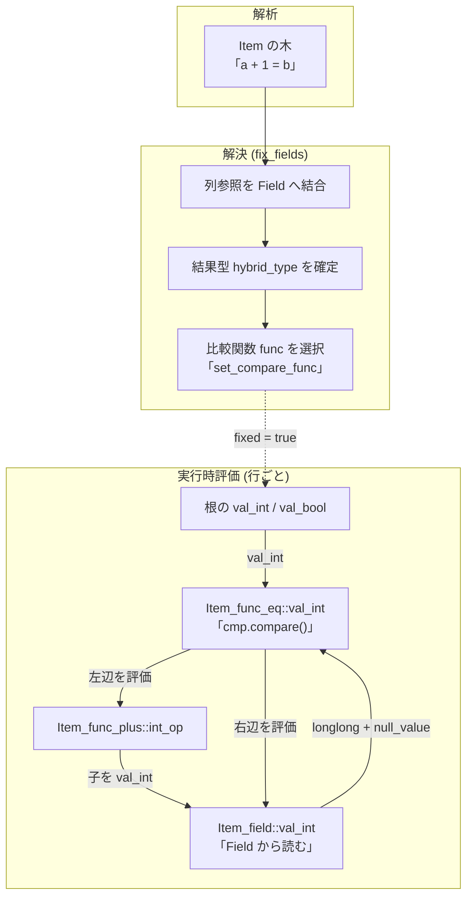

# 第8章 式評価（Item の実行時モデル）

> **本章で読むソース**
>
> - [`sql/item.h`](https://github.com/mysql/mysql-server/blob/mysql-8.4.10/sql/item.h)
> - [`sql/item.cc`](https://github.com/mysql/mysql-server/blob/mysql-8.4.10/sql/item.cc)
> - [`sql/item_func.cc`](https://github.com/mysql/mysql-server/blob/mysql-8.4.10/sql/item_func.cc)
> - [`sql/item_cmpfunc.cc`](https://github.com/mysql/mysql-server/blob/mysql-8.4.10/sql/item_cmpfunc.cc)
> - [`sql/item_cmpfunc.h`](https://github.com/mysql/mysql-server/blob/mysql-8.4.10/sql/item_cmpfunc.h)

## この章の狙い

`SELECT a + 1 FROM t WHERE b = 1 AND c > 0` のような文には、選択リストの `a + 1`、`WHERE` 句の `b = 1 AND c > 0` という式がある。
これらの式は、パーサによって `Item` という基底クラスを節とする木へ変換され、実行時に1行ごとに評価される。
本章は、この `Item` の木が何を表し、行ごとにどう値を計算するのかを読む。

PostgreSQL は、ホットな式を機械語へコンパイルする JIT を持つ。
MySQL の式評価には JIT がなく、`Item` の木を仮想関数呼び出しでたどる解釈実行に徹する。
そのぶん仕組みは素直であり、本章では「型ごとに評価メソッドを分け、行ごとに必要な型の値だけを計算する」という設計が、解釈実行の素朴さをどう補うかを読む。

第13章で読んだエグゼキュータの `FilterIterator` は、`WHERE` 条件の評価に `m_condition->val_int()` を呼んでいた。
その呼び出しの先で何が起きるのかを、本章で具体化する。

## 前提

- 第5章のパーサが式を `Item` の木として組み立て、第7章の準備（`fix_fields`）が列参照を解決し型を確定させた状態から始める。
- 第13章のとおり、エグゼキュータはプルモデルで1行ずつ進み、行ごとに `WHERE` 条件の `Item` を評価する。
- 1つの文の状態は `THD` に集約され（第3章）、式評価中のエラーは `thd->is_error()` で運ばれる。
- 本章のコード引用はすべて GitHub タグ `mysql-8.4.10` に固定する。

## Item 抽象、型ごとに分かれた評価メソッド

式の木の節を表す基底クラスが `Item` である。
列参照、定数、関数呼び出し、比較条件のいずれも、`Item` の派生クラスとして表される。
どの派生かは、純粋仮想の `type()` が返す `Item::Type` で区別する。

[`sql/item.h L971-L996`](https://github.com/mysql/mysql-server/blob/mysql-8.4.10/sql/item.h#L971-L996)

```cpp
  enum Type {
    INVALID_ITEM,
    FIELD_ITEM,          ///< A reference to a field (column) in a table.
    FUNC_ITEM,           ///< A function call reference.
    SUM_FUNC_ITEM,       ///< A grouped aggregate function, or window function.
    AGGR_FIELD_ITEM,     ///< A special field for certain aggregate operations.
    STRING_ITEM,         ///< A string literal value.
    INT_ITEM,            ///< An integer literal value.
    DECIMAL_ITEM,        ///< A decimal literal value.
    REAL_ITEM,           ///< A floating-point literal value.
    NULL_ITEM,           ///< A NULL value.
    HEX_BIN_ITEM,        ///< A hexadecimal or binary literal value.
    DEFAULT_VALUE_ITEM,  ///< A default value for a column.
    COND_ITEM,           ///< An AND or OR condition.
    REF_ITEM,            ///< An indirect reference to another item.
    INSERT_VALUE_ITEM,   ///< A value from a VALUES function (deprecated).
    SUBQUERY_ITEM,       ///< A subquery or predicate referencing a subquery.
    ROW_ITEM,            ///< A row of other items.
    CACHE_ITEM,          ///< An internal item used to cache values.
    TYPE_HOLDER_ITEM,    ///< An internal item used to help aggregate a type.
    PARAM_ITEM,          ///< A dynamic parameter used in a prepared statement.
    ROUTINE_FIELD_ITEM,  ///< A variable inside a routine (proc, func, trigger)
    TRIGGER_FIELD_ITEM,  ///< An OLD or NEW field, used in trigger definitions.
    XPATH_NODESET_ITEM,  ///< Used in XPATH expressions.
    VALUES_COLUMN_ITEM   ///< A value from a VALUES clause.
  };
```

`Item` の評価は、結果の型ごとに分かれた純粋仮想メソッドで表される。
整数として欲しいときは `val_int`、浮動小数点なら `val_real`、文字列なら `val_str`、固定小数点なら `val_decimal` を呼ぶ。
これらがすべて純粋仮想であり、`Item` を実装する各派生クラスは、自分の意味に沿った計算を返す責任を負う。

[`sql/item.h L1863-L1874`](https://github.com/mysql/mysql-server/blob/mysql-8.4.10/sql/item.h#L1863-L1874)

```cpp
  virtual double val_real() = 0;
  /*
    Return integer representation of item.

    SYNOPSIS
      val_int()

    RETURN
      In case of NULL value return 0 and set null_value flag to true.
      If value is not null null_value flag will be reset to false.
  */
  virtual longlong val_int() = 0;
```

[`sql/item.h L1955-L1955`](https://github.com/mysql/mysql-server/blob/mysql-8.4.10/sql/item.h#L1955-L1955)

```cpp
  virtual String *val_str(String *str) = 0;
```

[`sql/item.h L2045-L2045`](https://github.com/mysql/mysql-server/blob/mysql-8.4.10/sql/item.h#L2045-L2045)

```cpp
  virtual my_decimal *val_decimal(my_decimal *decimal_buffer) = 0;
```

ここに、解釈実行の素朴さを補う最初の工夫がある。
値の型ごとにメソッドを分けているため、呼び出し側は本当に必要な型の評価だけを起動できる。
整数列どうしの比較なら、各 `Item` の `val_int` だけが呼ばれ、文字列化や小数化の経路はそもそも実行されない。
型変換を1つの汎用な値型（バリアント）に押し込め、評価のたびにタグを見て分岐する方式に比べ、行ごとの分岐と型変換が減る。

`val_int` のコメントが述べるとおり、戻り値は値そのものだけを運び、NULL は別の経路で表す。
NULL のときは型ごとの規定値（`val_int` なら0）を返し、同時に `Item` のメンバ `null_value` を立てる。

[`sql/item.h L3670-L3672`](https://github.com/mysql/mysql-server/blob/mysql-8.4.10/sql/item.h#L3670-L3672)

```cpp
 public:
  bool null_value;  ///< True if item is null
  bool unsigned_flag;
```

呼び出し側は `val_int` などの戻り値を受け取った直後に、その `Item` の `null_value` を見て NULL かどうかを判定する。
戻り値の型に NULL を表す特別な値を混ぜないため、`longlong` の全域を値として使える。
SQL の三値論理（真、偽、不明）は、この戻り値と `null_value` の組で表現される。

`val_bool` だけは純粋仮想ではなく、結果型に応じて他の `val_*` へ振り分ける既定実装を持つ。

[`sql/item.cc L238-L256`](https://github.com/mysql/mysql-server/blob/mysql-8.4.10/sql/item.cc#L238-L256)

```cpp
bool Item::val_bool() {
  switch (result_type()) {
    case INT_RESULT:
      return val_int() != 0;
    case DECIMAL_RESULT: {
      my_decimal decimal_value;
      my_decimal *val = val_decimal(&decimal_value);
      if (val) return !my_decimal_is_zero(val);
      return false;
    }
    case REAL_RESULT:
    case STRING_RESULT:
      return val_real() != 0.0;
    case ROW_RESULT:
    default:
      assert(0);
      return false;  // Wrong (but safe)
  }
}
```

`val_bool` は、その `Item` がどの型で値を持つか（`result_type()`）を見て、その型の評価メソッドを1つだけ呼び、0かどうかで真偽へ畳む。
`WHERE` 句の真偽判定はこの `val_bool`、あるいは結果を整数で受ける `val_int` を入口にする。

## 葉の評価、列参照 Item_field

式の木の葉のうち、テーブルの列を指すのが `Item_field` である。
その `val_int` は、結びついた `Field`（行バッファ上の列）から整数を読み出すだけの短い実装になっている。

[`sql/item.cc L3165-L3175`](https://github.com/mysql/mysql-server/blob/mysql-8.4.10/sql/item.cc#L3165-L3175)

```cpp
double Item_field::val_real() {
  assert(fixed);
  if ((null_value = field->is_null())) return 0.0;
  return field->val_real();
}

longlong Item_field::val_int() {
  assert(fixed);
  if ((null_value = field->is_null())) return 0;
  return field->val_int();
}
```

`field` は、この列参照が解決の段で結びつけられた現在行の列である。
列が NULL なら `null_value` を立てて規定値を返し、そうでなければ `Field::val_int` で実際の値を読む。
ここに NULL 表現の規約が現れている。
`null_value = field->is_null()` という代入式の値をそのまま `if` の条件にすることで、NULL 判定の記録と分岐を1文で済ませている。

文字列や小数も同じ形をとる。

[`sql/item.cc L3150-L3155`](https://github.com/mysql/mysql-server/blob/mysql-8.4.10/sql/item.cc#L3150-L3155)

```cpp
String *Item_field::val_str(String *str) {
  assert(fixed);
  if ((null_value = field->is_null())) return nullptr;
  str->set_charset(str_value.charset());
  return field->val_str(str, &str_value);
}
```

`val_str` は NULL のとき `nullptr` を返す。
ポインタを返す型では、規定値の代わりに `nullptr` が NULL の合図を兼ねる。
どの `val_*` でも、葉に当たる `Item_field` は「現在行の `Field` から、求められた型で値を引く」ことに尽きる。
この `Field` がどの行を指すかは、第13章のイテレータが `handler` を呼んでレコードバッファ（`table->record[0]`）を満たすことで切り替わる。
`Item` の木はそのバッファを介して、1行ごとに違う値を計算する。

## 解決の段、fix_fields が評価の土台を作る

`val_int` などの評価メソッドは、すべて先頭で `assert(fixed)` を置いていた。
`Item` を評価できるのは、解決の段である `fix_fields` を通り `fixed` が立った後に限る。
`fix_fields` は第7章の準備の中核であり、列参照の解決、結果型の確定、NULL になりうるかの判定をまとめて行う。

基底 `Item::fix_fields` は、すでに値が定まっている定数のための最小実装で、`fixed` を立てるだけである。

[`sql/item.cc L5072-L5079`](https://github.com/mysql/mysql-server/blob/mysql-8.4.10/sql/item.cc#L5072-L5079)

```cpp
bool Item::fix_fields(THD *, Item **) {
  assert(is_contextualized());

  // We do not check fields which are fixed during construction
  assert(!fixed || basic_const_item());
  fixed = true;
  return false;
}
```

関数や演算子を表す `Item_func` の `fix_fields` は、子を先に解決してから自分の型を決める。
これが解決を木全体へ広げる再帰の本体である。

[`sql/item_func.cc L405-L435`](https://github.com/mysql/mysql-server/blob/mysql-8.4.10/sql/item_func.cc#L405-L435)

```cpp
bool Item_func::fix_fields(THD *thd, Item **) {
  assert(!fixed || basic_const_item());

  Item **arg, **arg_end;
  uchar buff[STACK_BUFF_ALLOC];  // Max argument in function

  const Condition_context CCT(thd->lex->current_query_block());

  used_tables_cache = get_initial_pseudo_tables();
  not_null_tables_cache = 0;

  /*
    Use stack limit of STACK_MIN_SIZE * 2 since
    on some platforms a recursive call to fix_fields
    requires more than STACK_MIN_SIZE bytes (e.g. for
    MIPS, it takes about 22kB to make one recursive
    call to Item_func::fix_fields())
  */
  if (check_stack_overrun(thd, STACK_MIN_SIZE * 2, buff))
    return true;    // Fatal error if flag is set!
  if (arg_count) {  // Print purify happy
    for (arg = args, arg_end = args + arg_count; arg != arg_end; arg++) {
      if (fix_func_arg(thd, arg)) return true;
    }
  }

  if (resolve_type(thd) || thd->is_error())  // Some impls still not error-safe
    return true;
  fixed = true;
  return false;
}
```

まず引数の `Item` を1つずつ `fix_func_arg` で解決し（その中で子の `fix_fields` を呼ぶ）、最後に `resolve_type` で自分の結果型を確定させてから `fixed` を立てる。
引数を解決する `fix_func_arg` は、子の解決のついでに、自分が NULL になりうるか（`set_nullable`）と、どのテーブルに依存するか（`used_tables_cache`）を子から畳み上げる。

[`sql/item_func.cc L437-L457`](https://github.com/mysql/mysql-server/blob/mysql-8.4.10/sql/item_func.cc#L437-L457)

```cpp
bool Item_func::fix_func_arg(THD *thd, Item **arg) {
  if ((!(*arg)->fixed && (*arg)->fix_fields(thd, arg)))
    return true; /* purecov: inspected */
  Item *item = *arg;

  if (allowed_arg_cols) {
    if (item->check_cols(allowed_arg_cols)) return true;
  } else {
    /*  we have to fetch allowed_arg_cols from first argument */
    assert(arg == args);  // it is first argument
    allowed_arg_cols = item->cols();
    assert(allowed_arg_cols);  // Can't be 0 any more
  }

  set_nullable(is_nullable() || item->is_nullable());
  used_tables_cache |= item->used_tables();
  if (null_on_null) not_null_tables_cache |= item->not_null_tables();
  add_accum_properties(item);

  return false;
}
```

`used_tables` を木の葉から畳み上げておくことが、後述する定数畳み込みの土台になる。
どのテーブルにも依存しない（`used_tables() == 0`）式は定数であり、評価時刻を前倒しできるからである。

[`sql/item.h L2399-L2399`](https://github.com/mysql/mysql-server/blob/mysql-8.4.10/sql/item.h#L2399-L2399)

```cpp
  bool const_item() const { return (used_tables() == 0); }
```

## 演算子の評価、子を再帰的に評価して結果を作る

算術演算子 `+` を表すのが `Item_func_plus` である。
整数として評価する経路（`int_op`）は、2つの子をそれぞれ `val_int` で評価し、結果を足す。

[`sql/item_func.cc L2106-L2150`](https://github.com/mysql/mysql-server/blob/mysql-8.4.10/sql/item_func.cc#L2106-L2150)

```cpp
longlong Item_func_plus::int_op() {
  const longlong val0 = args[0]->val_int();
  if (current_thd->is_error()) return error_int();
  const longlong val1 = args[1]->val_int();
  if (current_thd->is_error()) return error_int();
  const longlong res = static_cast<unsigned long long>(val0) +
                       static_cast<unsigned long long>(val1);
  bool res_unsigned = false;

  if ((null_value = args[0]->null_value || args[1]->null_value)) return 0;

  /*
    First check whether the result can be represented as a
    (bool unsigned_flag, longlong value) pair, then check if it is compatible
    with this Item's unsigned_flag by calling check_integer_overflow().
  */
  if (args[0]->unsigned_flag) {
    if (args[1]->unsigned_flag || val1 >= 0) {
      if (test_if_sum_overflows_ull((ulonglong)val0, (ulonglong)val1)) goto err;
      res_unsigned = true;
    } else {
      /* val1 is negative */
      if ((ulonglong)val0 > (ulonglong)LLONG_MAX) res_unsigned = true;
    }
  } else {
    if (args[1]->unsigned_flag) {
      if (val0 >= 0) {
        if (test_if_sum_overflows_ull((ulonglong)val0, (ulonglong)val1))
          goto err;
        res_unsigned = true;
      } else {
        if ((ulonglong)val1 > (ulonglong)LLONG_MAX) res_unsigned = true;
      }
    } else {
      if (val0 >= 0 && val1 >= 0)
        res_unsigned = true;
      else if (val0 < 0 && val1 < 0 && res >= 0)
        goto err;
    }
  }
  return check_integer_overflow(res, res_unsigned);

err:
  return raise_integer_overflow();
}
```

`args[0]` と `args[1]` が子の `Item` であり、`val_int` の呼び出しが木をさらに下る。
子のどちらかが NULL なら、NULL を伝播させて0を返す（`null_value` への代入で記録する）。
木の評価は、根の `val_int` 呼び出しが葉まで再帰的に下り、葉が値を返して上りながら演算するという形で進む。

`Item_func_plus` が `val_int` ではなく `int_op` を実装しているのは、算術関数が型ごとに評価本体を分けているからである。
整数なら `int_op`、浮動小数点なら `real_op`、固定小数点なら `decimal_op` を書き、共通の `val_int` がそのときの結果型（`hybrid_type`）を見て本体を選ぶ。

[`sql/item_func.cc L1751-L1766`](https://github.com/mysql/mysql-server/blob/mysql-8.4.10/sql/item_func.cc#L1751-L1766)

```cpp
longlong Item_func_numhybrid::val_int() {
  assert(fixed);
  switch (hybrid_type) {
    case DECIMAL_RESULT: {
      my_decimal decimal_value, *val;
      if (!(val = decimal_op(&decimal_value))) return 0;  // null is set
      longlong result;
      my_decimal2int(E_DEC_FATAL_ERROR, val, unsigned_flag, &result);
      return result;
    }
    case INT_RESULT:
      return int_op();
    case REAL_RESULT: {
      return llrint_with_overflow_check(real_op());
    }
    case STRING_RESULT: {
```

この `hybrid_type` は `fix_fields`（の `resolve_type`）の段で一度だけ決まる。
評価のたびに型を判定し直すのではなく、解決済みの型に従って分岐するため、行ごとの判定が軽い。

## 比較の評価、Arg_comparator が型ごとの比較関数を1つ選ぶ

等値比較 `=` を表すのが `Item_func_eq` である。
その `val_int` は、内部に持つ `Arg_comparator`（`cmp`）に比較を委ね、結果が等しければ1、違えば0を返す。

[`sql/item_cmpfunc.cc L2571-L2575`](https://github.com/mysql/mysql-server/blob/mysql-8.4.10/sql/item_cmpfunc.cc#L2571-L2575)

```cpp
longlong Item_func_eq::val_int() {
  assert(fixed);
  const int value = cmp.compare();
  return value == 0 ? 1 : 0;
}
```

`cmp.compare()` は、メンバ関数ポインタ `func` を呼ぶだけのインライン関数である。

[`sql/item_cmpfunc.h L211-L211`](https://github.com/mysql/mysql-server/blob/mysql-8.4.10/sql/item_cmpfunc.h#L211-L211)

```cpp
  inline int compare() { return (this->*func)(); }
```

この `func` は、解決の段で `set_compare_func` が比較の型に応じて選んでおく。
両辺の型から `comparator_matrix` の要素を取り、それを `func` に固定する。

[`sql/item_cmpfunc.cc L887-L891`](https://github.com/mysql/mysql-server/blob/mysql-8.4.10/sql/item_cmpfunc.cc#L887-L891)

```cpp
bool Arg_comparator::set_compare_func(Item_result_field *item,
                                      Item_result type) {
  m_compare_type = type;
  owner = item;
  func = comparator_matrix[type];
```

整数どうしの比較に選ばれるのが `compare_int_signed` である。
両辺の子を `val_int` で評価し、NULL を考慮しつつ大小を返す。

[`sql/item_cmpfunc.cc L1956-L1977`](https://github.com/mysql/mysql-server/blob/mysql-8.4.10/sql/item_cmpfunc.cc#L1956-L1977)

```cpp
int Arg_comparator::compare_int_signed() {
  const longlong val1 = (*left)->val_int();
  if (current_thd->is_error()) {
    if (set_null) owner->null_value = true;
    return 0;
  }
  if (!(*left)->null_value) {
    const longlong val2 = (*right)->val_int();
    if (current_thd->is_error()) {
      if (set_null) owner->null_value = true;
      return 0;
    }
    if (!(*right)->null_value) {
      if (set_null) owner->null_value = false;
      if (val1 < val2) return -1;
      if (val1 == val2) return 0;
      return 1;
    }
  }
  if (set_null) owner->null_value = true;
  return -1;
}
```

左辺の子を `val_int` で評価し、その `null_value` を見て NULL なら所有者（`owner`、すなわち比較の `Item`）の `null_value` を立てる。
左辺が非 NULL のときだけ右辺を評価する。
この短絡により、左辺が NULL の比較では右辺の `val_int` を呼ばずに済む。

比較の型ごとに関数を1つ選んでおく仕組みが、解釈実行の中で効く。
評価のたびに「整数か、実数か、文字列か」を判定して分岐するのではなく、解決の段で決めた `func` を毎回そのまま呼ぶ。
行数ぶん繰り返される比較から、型判定の分岐を取り除いている。

## 条件の評価、AND は短絡して NULL を畳む

`AND` で結ばれた複数の条件は `Item_cond_and` で表される。
その `val_int` は、子を順に `val_bool` で評価し、偽が出た時点で0を返す。

[`sql/item_cmpfunc.cc L6182-L6195`](https://github.com/mysql/mysql-server/blob/mysql-8.4.10/sql/item_cmpfunc.cc#L6182-L6195)

```cpp
longlong Item_cond_and::val_int() {
  assert(fixed);
  List_iterator_fast<Item> li(list);
  Item *item;
  null_value = false;
  while ((item = li++)) {
    if (!item->val_bool()) {
      if (ignore_unknown() || !(null_value = item->null_value))
        return 0;  // return false
    }
    if (current_thd->is_error()) return error_int();
  }
  return null_value ? 0 : 1;
}
```

子の `val_bool` が偽を返したとき、その偽が「条件が成立しない（FALSE）」のか「NULL のために不明」なのかを子の `null_value` で見分ける。
FALSE が確定すれば即座に0を返し、残りの子を評価しない。
これが `AND` の短絡である。
NULL のために不明な子があった場合は `null_value` を立てて読み進め、後続で FALSE が出れば0、最後まで FALSE が出なければ NULL を畳んで結果を不明とする。
SQL の三値論理（`TRUE AND NULL = NULL`、`FALSE AND NULL = FALSE`）が、この走査でそのまま実現されている。

第13章で読んだ `FilterIterator::Read` は、まさにこの条件 `Item` の `val_int` を1行ごとに呼んでいた。

[`sql/iterators/composite_iterators.cc L91-L101`](https://github.com/mysql/mysql-server/blob/mysql-8.4.10/sql/iterators/composite_iterators.cc#L91-L101)

```cpp
int FilterIterator::Read() {
  for (;;) {
    int err = m_source->Read();
    if (err != 0) return err;

    bool matched = m_condition->val_int();

    if (thd()->killed) {
      thd()->send_kill_message();
      return 1;
    }
```

`m_condition` が `WHERE` 句の根の `Item`（多くは `Item_cond_and`）であり、`m_condition->val_int()` の1呼び出しが、条件の木を葉の `Item_field` まで下って現在行を判定する。
イテレータが行を1つ読むたびに、この評価が1回起きる。
エグゼキュータと式評価は、この `val_int` の呼び出し1点で接続している。

## fix_fields から実行時評価までの流れ

ここまでの流れを1枚に整理する。
パーサが組んだ `Item` の木を `fix_fields` が解決し、列参照を `Field` へ結びつけ、結果型と比較関数を確定させる。
実行時には、エグゼキュータが行ごとに根の `Item` の `val_int`（または型に応じた `val_*`）を呼び、その呼び出しが木を下って葉の列値を読み、上りながら値を組み立てる。



## 定数式の畳み込み

`used_tables() == 0` の式は定数であり、行ごとに評価し直す必要がない。
オプティマイザはこの性質を使って、定数式を最適化の段で1度だけ評価し、結果の定数 `Item` に置き換える（定数畳み込み）。
`WHERE` 条件の畳み込みは `fold_condition` が担い、畳み込みで条件が実行時定数になればさらに簡約する。

[`sql/sql_optimizer.cc L10545-L10552`](https://github.com/mysql/mysql-server/blob/mysql-8.4.10/sql/sql_optimizer.cc#L10545-L10552)

```cpp
static bool fold_condition_exec(THD *thd, Item *cond, Item **retcond,
                                Item::cond_result *cond_value) {
  if (fold_condition(thd, cond, retcond, cond_value)) return true;
  if (*retcond != nullptr &&
      can_evaluate_condition(thd, *retcond))  // simplify further maybe
    return remove_eq_conds(thd, *retcond, retcond, cond_value);
  return false;
}
```

この畳み込みの土台が、解決の段で各 `Item` に畳み上げた `used_tables` である。
どのテーブルにも依存しない式（`const_item()` が真）は、行を読む前に値が決まる。
たとえば `WHERE 1 = 0` は最適化の段で偽の定数に畳まれ、実行時には行ごとの比較が起きない。
解釈実行のコストは行数に比例して効いてくるため、行ごとの評価から定数式を取り除くこの前処理が、JIT を持たない式評価では特に効く。

## 高速化の工夫、型ごとの仮想メソッドと解決済みの分岐

式評価には JIT がないため、`Item` の木は仮想関数呼び出しでたどる。
この解釈実行を割に合わせているのが、型を実行時ではなく解決時に固定する設計である。

第1に、評価メソッドを結果型ごとに分けてある（`val_int`、`val_real`、`val_str`、`val_decimal`）。
呼び出し側は必要な型の値だけを起動できるため、整数比較で文字列化の経路が走ることはない。
1つの汎用な値型を毎回タグ判定する方式に比べ、行ごとの分岐と無駄な型変換が減る。

第2に、型ごとの分岐を解決の段へ前倒ししてある。
算術関数は `hybrid_type` を `resolve_type` で確定させ、評価時はその型の本体（`int_op` など）を選ぶだけである。
比較関数は `set_compare_func` が両辺の型から `func` を1度選び、評価時は `(this->*func)()` を呼ぶだけである。
どちらも、行数ぶん繰り返される評価の内側から型判定を抜き、解決時の1回へ移している。

第3に、定数式は最適化の段で畳み込まれ、行ごとの評価から外れる。
`used_tables` の畳み上げが、その判定を支える。

これらは個別には小さな工夫だが、評価が行数ぶん繰り返されることを思えば効果は積み上がる。
JIT がコンパイルで分岐を消すのに対し、MySQL は型を解決時に固定して分岐を減らす。

## まとめ

MySQL の式は `Item` を節とする木であり、実行時に仮想関数呼び出しで解釈実行される（JIT はない）。
評価メソッドは結果型ごとに分かれ（`val_int`、`val_real`、`val_str`、`val_decimal`）、呼び出し側は必要な型だけを起動する。
NULL は戻り値に混ぜず、規定値（またはポインタ型の `nullptr`）と `Item::null_value` の組で表し、SQL の三値論理を運ぶ。
評価できるのは解決の段 `fix_fields` を通った後に限り、`fix_fields` は列参照を `Field` へ結びつけ、結果型と比較関数を確定させる。
演算子 `Item_func` は子を再帰的に評価して結果を作り、比較 `Item_func_eq` は解決時に選んだ型別の比較関数を呼び、条件 `Item_cond_and` は子を短絡評価して三値論理を畳む。
エグゼキュータの `FilterIterator` は、1行ごとに `WHERE` 条件の根の `Item` の `val_int` を呼び、その1呼び出しが木を葉まで下って現在行を判定する。
解釈実行のコストを抑えるため、型ごとの分岐は解決時に固定され、定数式は最適化の段で畳み込まれて行ごとの評価から外れる。

## 関連する章

- [第7章 クエリの解決と準備](07-resolution-and-prepare.md)
- [第13章 エグゼキュータ（イテレータ実行モデル）](13-executor-iterators.md)
- [第5章 パーサ](05-parser.md)
- [第3章 接続、スレッド、セッション](../part00-introduction/03-connection-thread-session.md)
