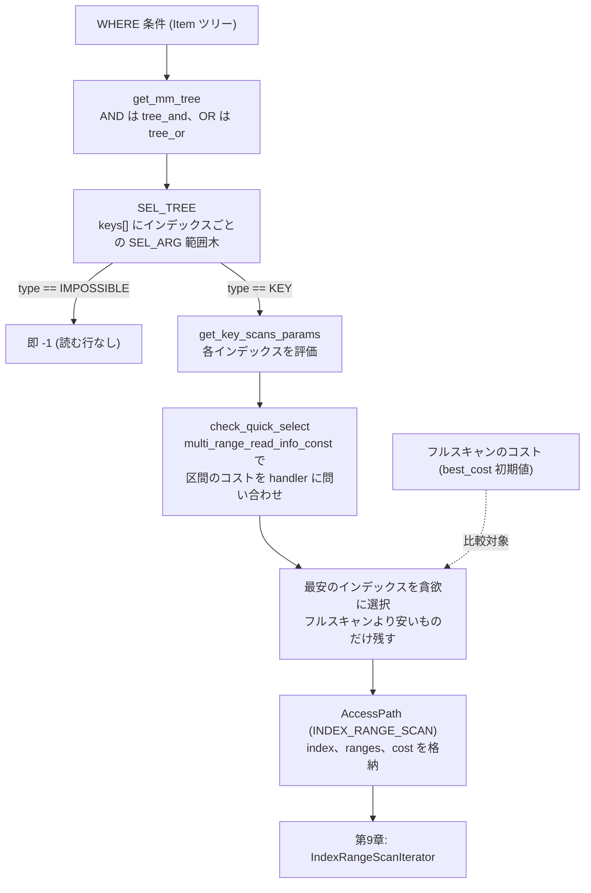

# 第8章 オプティマイザ（アクセスパスと range optimizer）

> **本章で読むソース**
>
> - [`sql/range_optimizer/range_optimizer.cc`](https://github.com/mysql/mysql-server/blob/mysql-8.4.10/sql/range_optimizer/range_optimizer.cc)
> - [`sql/range_optimizer/range_analysis.cc`](https://github.com/mysql/mysql-server/blob/mysql-8.4.10/sql/range_optimizer/range_analysis.cc)
> - [`sql/range_optimizer/index_range_scan_plan.cc`](https://github.com/mysql/mysql-server/blob/mysql-8.4.10/sql/range_optimizer/index_range_scan_plan.cc)
> - [`sql/range_optimizer/tree.h`](https://github.com/mysql/mysql-server/blob/mysql-8.4.10/sql/range_optimizer/tree.h)
> - [`sql/join_optimizer/access_path.h`](https://github.com/mysql/mysql-server/blob/mysql-8.4.10/sql/join_optimizer/access_path.h)

## この章の狙い

第7章で、オプティマイザが join の順序を決め、その途中で「このテーブルを1つ読むのにいくらかかるか」を繰り返し問い合わせるところまで読んだ。
本章では、その問い合わせの中身、つまり1つのテーブルをどう読むかを決める段を読む。
選択肢は大きく分けて2つである。
テーブル全体を順に読むフルスキャンか、あるインデックスの限られた範囲だけを読む範囲走査かである。

範囲走査を選ぶには、WHERE 条件のうちインデックスで絞り込める部分を取り出し、各インデックスで「どこからどこまで読めばよいか」を求めなければならない。
この仕事を担うのが range optimizer（`sql/range_optimizer/`）である。
入口は `test_quick_select` であり、条件を `SEL_TREE` と `SEL_ARG` という範囲木に畳み込み、インデックスごとに走査範囲とコストを見積もり、最も安い読み方を選ぶ。

選ばれた読み方は `AccessPath`（`sql/join_optimizer/access_path.h`）という固定サイズの構造体で表す。
`AccessPath` は第9章のイテレータと1対1に対応し、実行時にはここから `IndexRangeScanIterator` などが組み立てられる。
本章は、WHERE 条件が範囲木になり、範囲木からコスト最小の走査が選ばれ、それが `AccessPath` に落ちるまでをたどる。

## 前提

第6章で論理変換を、第7章で join 順序とコストモデルを読んだ。
コストは `Cost_estimate` 型に I/O と CPU を別々に積み上げる形で表され、`handler` 経由でストレージエンジンに見積もりを問い合わせる仕組みだった。
本章の範囲走査のコストも、最終的には同じ `handler` の見積もりに帰着する。

範囲走査の対象はインデックスである。
インデックスは複数のカラムを並べた複合キーでありうるため、本章では先頭から数えて何番目のカラムかを「キーパート」と呼ぶ。
コードでも `SEL_ARG::part` がキーパート番号を持つ。

range optimizer はサーバ層（`sql/`）に閉じた解析であり、実際の行はまだ1行も読まない。
読むのは `handler` が返す統計（行数の見積もりなど）だけである。

## 入口 test_quick_select

range optimizer のモジュール全体は、1つのテーブルと条件を受け取り、条件に合う行を取り出せる `AccessPath` を返すか、「1行も合わない」という判定を返す。
そのモジュールの入口が `test_quick_select` である。

[`sql/range_optimizer/range_optimizer.cc` L484-L491](https://github.com/mysql/mysql-server/blob/mysql-8.4.10/sql/range_optimizer/range_optimizer.cc#L484-L491)

```cpp
int test_quick_select(THD *thd, MEM_ROOT *return_mem_root,
                      MEM_ROOT *temp_mem_root, Key_map keys_to_use,
                      table_map prev_tables, table_map read_tables,
                      ha_rows limit, bool force_quick_range,
                      const enum_order interesting_order, TABLE *table,
                      bool skip_records_in_range, Item *cond,
                      Key_map *needed_reg, bool ignore_table_scan,
                      Query_block *query_block, AccessPath **path) {
```

引数のうち、`cond` が分析対象の条件、`keys_to_use` が使ってよいインデックスの集合、`table` が対象テーブルである。
結果は `path` に書き戻す。
戻り値は、範囲走査が見つかれば `1`、条件が常に偽（読むべき行がない）なら `-1`、見つからなければ `0` を返す。

関数はまず、比較の基準となるフルスキャンのコストを計算する。
`table->file->table_scan_cost()` でストレージエンジンにテーブルスキャンの基本コストを尋ね、行を評価する CPU コストを足し込む。

[`sql/range_optimizer/range_optimizer.cc` L502-L521](https://github.com/mysql/mysql-server/blob/mysql-8.4.10/sql/range_optimizer/range_optimizer.cc#L502-L521)

```cpp
  const Cost_model_server *const cost_model = thd->cost_model();
  ha_rows records = table->file->stats.records;
  if (!records) records++; /* purecov: inspected */
  double scan_time =
      cost_model->row_evaluate_cost(static_cast<double>(records)) + 1;
  Cost_estimate cost_est = table->file->table_scan_cost();
  cost_est.add_io(1.1);
  cost_est.add_cpu(scan_time);
  if (ignore_table_scan) {
    scan_time = DBL_MAX;
    cost_est.set_max_cost();
  }
  if (limit < records) {
    cost_est.reset();
    // Force to use index
    cost_est.add_io(
        table->cost_model()->page_read_cost(static_cast<double>(records)) + 1);
    cost_est.add_cpu(scan_time);
  } else if (cost_est.total_cost() <= 2.0 && !force_quick_range)
    return 0; /* No need for quick select */
```

このフルスキャンのコストが、以降のすべての候補の比較対象となる `best_cost` の初期値である。
テーブルが十分小さく、フルスキャンのコストが `2.0` 以下なら、インデックスを探す手間をかけずに即座に打ち切る。

## WHERE 条件を範囲木へ畳む

条件 `cond` がある場合、`test_quick_select` は `get_mm_tree` を呼んで条件を `SEL_TREE` へ変換する。

[`sql/range_optimizer/range_optimizer.cc` L598-L626](https://github.com/mysql/mysql-server/blob/mysql-8.4.10/sql/range_optimizer/range_optimizer.cc#L598-L626)

```cpp
  SEL_TREE *tree = nullptr;
  if (cond) {
    {
      Opt_trace_array trace_setup_cond(trace, "setup_range_conditions");
      tree = get_mm_tree(thd, &param, prev_tables | INNER_TABLE_BIT,
                         read_tables | INNER_TABLE_BIT,
                         table->pos_in_table_list->map(),
                         /*remove_jump_scans=*/true, cond);
    }
    if (tree) {
      if (tree->type == SEL_TREE::IMPOSSIBLE) {
        trace_range.add("impossible_range", true);
        cost_est.reset();
        cost_est.add_io(static_cast<double>(HA_POS_ERROR));
        return -1;
      }
      /*
        If the tree can't be used for range scans, proceed anyway, as we
        can construct a group-min-max quick select
      */
      if (tree->type != SEL_TREE::KEY) {
        trace_range.add("range_scan_possible", false);
        if (tree->type == SEL_TREE::ALWAYS)
          trace_range.add_alnum("cause", "condition_always_true");

        tree = nullptr;
      }
    }
  }
```

ここで `SEL_TREE` の種別が効いてくる。
`IMPOSSIBLE` は条件が常に偽（例えば `1 = 0`）だと判明した場合で、読むべき行がないため即座に `-1` を返して打ち切る。
これは、行を1つも読まずに空の結果を確定させる枝刈りである。
`ALWAYS` は条件が範囲で絞り込めないことを意味し、範囲走査の候補からは外す（`tree` を `nullptr` にする）。
`KEY` のときだけ、その範囲木を使った走査に進む。

### get_mm_tree の再帰

`get_mm_tree` は条件式の構文木をたどり、AND と OR を範囲木の演算に写し取る。

[`sql/range_optimizer/range_analysis.cc` L854-L880](https://github.com/mysql/mysql-server/blob/mysql-8.4.10/sql/range_optimizer/range_analysis.cc#L854-L880)

```cpp
  if (cond->type() == Item::COND_ITEM) {
    Item_func::Functype functype = down_cast<Item_cond *>(cond)->functype();

    SEL_TREE *tree = nullptr;
    bool first = true;
    for (Item &item : *down_cast<Item_cond *>(cond)->argument_list()) {
      SEL_TREE *new_tree = get_mm_tree(thd, param, prev_tables, read_tables,
                                       current_table, remove_jump_scans, &item);
      if (param->has_errors()) return nullptr;
      if (first) {
        tree = new_tree;
        first = false;
        continue;
      }
      if (functype == Item_func::COND_AND_FUNC) {
        tree = tree_and(param, tree, new_tree);
        dbug_print_tree("after_and", tree, param);
        if (tree && tree->type == SEL_TREE::IMPOSSIBLE) break;
      } else {  // OR.
        tree = tree_or(param, remove_jump_scans, tree, new_tree);
        dbug_print_tree("after_or", tree, param);
        if (tree == nullptr || tree->type == SEL_TREE::ALWAYS) break;
      }
    }
    dbug_print_tree("tree_returned", tree, param);
    return tree;
  }
```

`AND` でつながった条件は各部分木を `tree_and` で交差させ、`OR` でつながった条件は `tree_or` で合併する。
交差の途中で `IMPOSSIBLE` が出れば、残りを見るまでもなく全体が偽なので、その場でループを抜ける。
合併の途中で `ALWAYS` が出れば、それ以上絞り込めないので同じく抜ける。
末端の比較演算（`col > 30` など）は、別の分岐で1カラムの区間に変換される。

## SEL_TREE と SEL_ARG の構造

範囲木の最小単位が `SEL_ARG` であり、1つの `SEL_ARG` は1つのキーパート上の1区間を表す。

[`sql/range_optimizer/tree.h` L248-L256](https://github.com/mysql/mysql-server/blob/mysql-8.4.10/sql/range_optimizer/tree.h#L248-L256)

```cpp
/*
  A construction block of the SEL_ARG-graph.

  One SEL_ARG object represents an "elementary interval" in form

      min_value <=?  table.keypartX  <=? max_value

  The interval is a non-empty interval of any kind: with[out] minimum/maximum
  bound, [half]open/closed, single-point interval, etc.
```

`SEL_ARG` は区間の下限 `min_value` と上限 `max_value`、そして境界を開区間にするか閉区間にするかを示す `min_flag` と `max_flag` を持つ。

[`sql/range_optimizer/tree.h` L466-L524](https://github.com/mysql/mysql-server/blob/mysql-8.4.10/sql/range_optimizer/tree.h#L466-L524)

```cpp
class SEL_ARG {
 public:
  uint8 min_flag{0}, max_flag{0};
// ... (中略) ...
  uint8 part{0};
// ... (中略) ...
  Field *field{nullptr};
  uchar *min_value, *max_value;  // Pointer to range
// ... (中略) ...
  SEL_ARG *left, *right;    /* R-B tree children */
  SEL_ARG *next, *prev;     /* Links for bi-directional interval list */
  SEL_ARG *parent{nullptr}; /* R-B tree parent (nullptr for root) */
  /*
    R-B tree of intervals covering keyparts consecutive to this
    SEL_ARG. See documentation of SEL_ARG GRAPH semantics for details.
  */
  SEL_ROOT *next_key_part{nullptr};
```

同じキーパート上の複数の区間（`col = 1 OR col = 3` のような互いに素な区間の並び）は、`next` と `prev` でつないだ双方向リストになり、同時に `left` と `right` で赤黒木に組まれる。
赤黒木にすることで、区間の探索と挿入が区間数の対数時間で済む。
次のキーパートへの連結は `next_key_part` が担い、ここに別のキーパートの区間木の根がぶら下がる。

この2種類のリンクで、`next`／`prev` が OR を、`next_key_part` が AND を表す。

[`sql/range_optimizer/tree.h` L333-L341](https://github.com/mysql/mysql-server/blob/mysql-8.4.10/sql/range_optimizer/tree.h#L333-L341)

```cpp
  2. SEL_ARG GRAPH SEMANTICS

  It represents a condition in a special form (we don't have a name for it ATM)
  The SEL_ARG::next/prev is "OR", and next_key_part is "AND".

  For example, the picture represents the condition in form:
   (kp1 < 1 AND kp2=5 AND (kp3=10 OR kp3=12)) OR
   (kp1=2 AND (kp3=11 OR kp3=14)) OR
   (kp1=3 AND (kp3=11 OR kp3=14))
```

複合インデックスへの条件は、こうして先頭キーパートの区間から後続キーパートの区間へとぶら下がる入れ子のグラフになる。
1つの式 `(kp1=2 AND (kp3=11 OR kp3=14))` を、グラフ上の経路として表現できる点が `SEL_ARG` 表現の要である。

`SEL_TREE` は、テーブルが持つ各インデックスについての範囲木をまとめて保持する。
インデックスごとの範囲木の根は `keys[]` 配列に、インデックスをまたいで読む index merge の候補は `merges` に入る。

[`sql/range_optimizer/tree.h` L962-L975](https://github.com/mysql/mysql-server/blob/mysql-8.4.10/sql/range_optimizer/tree.h#L962-L975)

```cpp
  Mem_root_array<SEL_ROOT *> keys;
  Key_map keys_map; /* bitmask of non-NULL elements in keys */

  /*
    Possible ways to read rows using Index merge (sort) union.

    Each element in 'merges' consists of multi-index disjunctions,
    which means that Index merge (sort) union must be applied to read
    rows. The nodes in the 'merges' list forms a conjunction of such
    multi-index disjunctions.

    The list is non-empty only if type==KEY.
  */
  List<SEL_IMERGE> merges;
```

`SEL_TREE` 自身の種別 `type` は、条件全体が常に偽か、絞り込めないか、どれかのインデックスで使えるかを示す。

[`sql/range_optimizer/tree.h` L890-L890](https://github.com/mysql/mysql-server/blob/mysql-8.4.10/sql/range_optimizer/tree.h#L890-L890)

```cpp
  enum Type { IMPOSSIBLE, ALWAYS, KEY } type;
```

`keys[i]` のどれかが `IMPOSSIBLE` なら全体が `IMPOSSIBLE`、どれも絞り込めないなら `ALWAYS`、少なくとも1つで範囲条件が使えれば `KEY` になる。
この種別を `test_quick_select` が見て、早期打ち切りと候補の取捨を決めていた。

## コスト最小の走査を選ぶ

範囲木が `KEY` 種別で得られたら、`test_quick_select` は `get_key_scans_params` を呼んで、単一インデックスの範囲走査のうち最も安いものを選ぶ。

[`sql/range_optimizer/range_optimizer.cc` L674-L696](https://github.com/mysql/mysql-server/blob/mysql-8.4.10/sql/range_optimizer/range_optimizer.cc#L674-L696)

```cpp
  if (tree && (best_path == nullptr || !get_forced_by_hint(best_path))) {
    /*
      It is possible to use a range-based quick select (but it might be
      slower than 'all' table scan).
    */
    dbug_print_tree("final_tree", tree, &param);

    {
      /*
        Calculate cost of single index range scan and possible
        intersections of these
      */
      Opt_trace_object trace_range_alt(trace, "analyzing_range_alternatives",
                                       Opt_trace_context::RANGE_OPTIMIZER);
      AccessPath *range_path = get_key_scans_params(
          thd, &param, tree, false, true, interesting_order,
          skip_records_in_range, best_cost, /*ror_only=*/false, needed_reg);

      /* Get best 'range' plan and prepare data for making other plans */
      if (range_path) {
        best_path = range_path;
        best_cost = best_path->cost();
      }
```

`get_key_scans_params` は、各インデックスの範囲木を順に評価し、最も安いものを選ぶ。

[`sql/range_optimizer/index_range_scan_plan.cc` L852-L873](https://github.com/mysql/mysql-server/blob/mysql-8.4.10/sql/range_optimizer/index_range_scan_plan.cc#L852-L873)

```cpp
  for (idx = 0; idx < param->keys; idx++) {
    key = tree->keys[idx];
    if (key) {
      ha_rows found_records;
      Cost_estimate cost;
      uint mrr_flags = 0, buf_size = 0;
      uint keynr = param->real_keynr[idx];
      if (key->type == SEL_ROOT::Type::MAYBE_KEY || key->root->maybe_flag)
        needed_reg->set_bit(keynr);

      bool read_index_only =
          index_read_must_be_used
              ? true
              : (bool)param->table->covering_keys.is_set(keynr);

      Opt_trace_object trace_idx(trace);
      trace_idx.add_utf8("index", param->table->key_info[keynr].name);
      bool is_ror_scan, is_imerge_scan;
      found_records = check_quick_select(
          thd, param, idx, read_index_only, key, update_tbl_stats,
          order_direction, skip_records_in_range, &mrr_flags, &buf_size, &cost,
          &is_ror_scan, &is_imerge_scan);
```

各インデックスについて `check_quick_select` がコスト `cost` と見積もり行数 `found_records` を返す。
読み出しが当該インデックスだけで完結する（カバリングインデックス）なら `read_index_only` が立ち、行本体を読まない分だけ安く見積もられる。

選択はその場の貪欲法である。
コストが現在の `read_cost` を下回るインデックスが見つかるたびに、それを暫定の最良として更新する。

[`sql/range_optimizer/index_range_scan_plan.cc` L923-L950](https://github.com/mysql/mysql-server/blob/mysql-8.4.10/sql/range_optimizer/index_range_scan_plan.cc#L923-L950)

```cpp
      if (found_records != HA_POS_ERROR &&
          (read_cost > cost.total_cost() ||
           /*
             Ignore cost check if INDEX_MERGE hint is used with
             explicitly specified indexes or if INDEX_MERGE hint
             is used without any specified indexes and no best
             index is chosen yet.
           */
           (force_index_merge &&
            (!use_cheapest_index_merge || !key_to_read)))) {
        trace_idx.add("chosen", true);
        read_cost = cost.total_cost();
        best_records = found_records;
        key_to_read = key;
        best_idx = idx;
        best_mrr_flags = mrr_flags;
        best_buf_size = buf_size;
        is_best_idx_imerge_scan = is_imerge_scan;
      } else {
        trace_idx.add("chosen", false);
        if (found_records == HA_POS_ERROR)
          if (key->type == SEL_ROOT::Type::MAYBE_KEY)
            trace_idx.add_alnum("cause", "depends_on_unread_values");
          else
            trace_idx.add_alnum("cause", "no_valid_range_for_this_index");
        else
          trace_idx.add_alnum("cause", "cost");
      }
```

`read_cost` の初期値は呼び出し時の `cost_est`、つまりフルスキャン（や、より安いカバリングインデックスのフルスキャン）のコストである。
したがってここで残るのは、フルスキャンより安く、かつインデックス間で最も安い範囲走査だけになる。
すべてのインデックスがフルスキャンより高ければ `key_to_read` は `nullptr` のままで、範囲走査は採用されない。

## コスト見積もりとコストモデルの接続

`check_quick_select` の中で実際のコストを返すのは、`handler` への問い合わせ `multi_range_read_info_const` である。

[`sql/range_optimizer/index_range_scan_plan.cc` L628-L630](https://github.com/mysql/mysql-server/blob/mysql-8.4.10/sql/range_optimizer/index_range_scan_plan.cc#L628-L630)

```cpp
  rows = file->multi_range_read_info_const(keynr, &seq_if, (void *)&seq, 0,
                                           bufsize, mrr_flags,
                                           &force_default_mrr, cost);
```

`seq` は範囲木から取り出した区間の列を順に返すイテレータであり、`file` は対象テーブルの `handler` である。
`multi_range_read_info_const` は、その区間の列を読むのに必要な行数とコストをストレージエンジンに見積もらせ、`cost`（`Cost_estimate`）に書き戻す。
ここが第7章のコストモデルとの接続点である。
range optimizer はインデックス上の論理的な区間しか知らないが、その区間を読むコストは、ページ読み込みや行評価のコストを `Cost_estimate` に積み上げる同じ仕組みで評価される。

範囲走査が安く見えるのは、区間に入る行だけを読むからである。
区間の外の行は、インデックス上で範囲が切れた時点で読まずに済む。
WHERE 条件をインデックス上の区間に畳んでおくことが、この「読まない行を増やす」最適化を成立させている。

## 選ばれた読み方を AccessPath にする

最良のインデックスが決まったら、`get_key_scans_params` は範囲木から実際に走査する区間の列を取り出し、`AccessPath` を1つ組み立てて返す。

[`sql/range_optimizer/index_range_scan_plan.cc` L973-L992](https://github.com/mysql/mysql-server/blob/mysql-8.4.10/sql/range_optimizer/index_range_scan_plan.cc#L973-L992)

```cpp
  AccessPath *path = new (param->return_mem_root) AccessPath;
  path->type = AccessPath::INDEX_RANGE_SCAN;
  path->set_cost(read_cost);
  path->set_num_output_rows(best_records);
  path->index_range_scan().index = param->real_keynr[best_idx];
  path->index_range_scan().num_used_key_parts = used_key_parts;
  path->index_range_scan().used_key_part = param->key[best_idx];
  path->index_range_scan().ranges = &ranges[0];
  path->index_range_scan().num_ranges = ranges.size();
  path->index_range_scan().mrr_flags = best_mrr_flags;
  path->index_range_scan().mrr_buf_size = best_buf_size;
  path->index_range_scan().can_be_used_for_ror =
      tree->ror_scans_map.is_set(best_idx);
  path->index_range_scan().need_rows_in_rowid_order =
      false;  // May be changed by callers later.
  path->index_range_scan().can_be_used_for_imerge = is_best_idx_imerge_scan;
  path->index_range_scan().reuse_handler = false;
  path->index_range_scan().geometry = (used_key->flags & HA_SPATIAL);
  path->index_range_scan().reverse =
      false;  // May be changed by make_reverse() later.
```

`AccessPath` は、選ばれた読み方を表すクエリ計画の構造体である。

[`sql/join_optimizer/access_path.h` L191-L212](https://github.com/mysql/mysql-server/blob/mysql-8.4.10/sql/join_optimizer/access_path.h#L191-L212)

```cpp
/**
  Access paths are a query planning structure that correspond 1:1 to iterators,
  in that an access path contains pretty much exactly the information
  needed to instantiate given iterator, plus some information that is only
  needed during planning, such as costs. (The new join optimizer will extend
  this somewhat in the future. Some iterators also need the query block,
  ie., JOIN object, they are part of, but that is implicitly available when
  constructing the tree.)

  AccessPath objects build on a variant, ie., they can hold an access path of
  any type (table scan, filter, hash join, sort, etc.), although only one at the
  same time. Currently, they contain 32 bytes of base information that is common
  to any access path (type identifier, costs, etc.), and then up to 40 bytes
  that is type-specific (e.g. for a table scan, the TABLE object). It would be
  nice if we could squeeze it down to 64 and fit a cache line exactly, but it
  does not seem to be easy without fairly large contortions.

  We could have solved this by inheritance, but the fixed-size design makes it
  possible to replace an access path when a better one is found, without
  introducing a new allocation, which will be important when using them as a
  planning structure.
 */
```

`AccessPath` は固定サイズの variant で、共通部分（種別とコスト）と、種別ごとの専用部分を1つだけ持つ。
固定サイズにしてあるのは、より安い計画が見つかったときに、新しい確保をせずにその場で内容を上書きして差し替えられるようにするためである。

種別は `type` フィールドで区別し、フルスキャン `TABLE_SCAN`、単一インデックスのフルスキャン `INDEX_SCAN`、本章の `INDEX_RANGE_SCAN`、複数インデックスをまたぐ `INDEX_MERGE` などが並ぶ。

[`sql/join_optimizer/access_path.h` L233-L251](https://github.com/mysql/mysql-server/blob/mysql-8.4.10/sql/join_optimizer/access_path.h#L233-L251)

```cpp
    TABLE_SCAN,
    SAMPLE_SCAN,
    INDEX_SCAN,
    INDEX_DISTANCE_SCAN,
    REF,
    REF_OR_NULL,
    EQ_REF,
    PUSHED_JOIN_REF,
    FULL_TEXT_SEARCH,
    CONST_TABLE,
    MRR,
    FOLLOW_TAIL,
    INDEX_RANGE_SCAN,
    INDEX_MERGE,
    ROWID_INTERSECTION,
    ROWID_UNION,
    INDEX_SKIP_SCAN,
    GROUP_INDEX_SKIP_SCAN,
    DYNAMIC_INDEX_RANGE_SCAN,
```

`INDEX_RANGE_SCAN` の専用部分は、どのインデックスを、何個のキーパートまで、どの区間で読むかを保持する。

[`sql/join_optimizer/access_path.h` L996-L1014](https://github.com/mysql/mysql-server/blob/mysql-8.4.10/sql/join_optimizer/access_path.h#L996-L1014)

```cpp
    struct {
      // The key part(s) we are scanning on. Note that this may be an array.
      // You can get the table we are working on by looking into
      // used_key_parts[0].field->table (it is not stored directly, to avoid
      // going over the AccessPath size limits).
      KEY_PART *used_key_part;

      // The actual ranges we are scanning over (originally derived from “key”).
      // Not a Bounds_checked_array, to save 4 bytes on the length.
      QUICK_RANGE **ranges;
      unsigned num_ranges;

      unsigned mrr_flags;
      unsigned mrr_buf_size;

      // Which index (in the TABLE) we are scanning over, and how many of its
      // key parts we are using.
      unsigned index;
      unsigned num_used_key_parts;
```

`ranges` が走査する区間の配列であり、これは範囲木 `SEL_ARG` から `get_ranges_from_tree` で取り出した `QUICK_RANGE` の列である。
こうして範囲木の論理的な区間が、実行時に `handler` へ渡せる具体的なキー範囲の列に変換される。

`test_quick_select` は、こうして組み立てた最良の `AccessPath` を、ストレージエンジンがインデックスアクセスをサポートする場合に限り `path` へ書き戻して返す。

[`sql/range_optimizer/range_optimizer.cc` L756-L763](https://github.com/mysql/mysql-server/blob/mysql-8.4.10/sql/range_optimizer/range_optimizer.cc#L756-L763)

```cpp
  /*
    If we got a read plan, return it, but only if the storage engine supports
    using indexes for access.
  */
  if (best_path && (table->file->ha_table_flags() & HA_NO_INDEX_ACCESS) == 0) {
    records = best_path->num_output_rows();
    *path = best_path;
  }
```

返った `AccessPath` は、種別 `INDEX_RANGE_SCAN` の専用部分に、読むべきインデックスと区間とコストをすべて備えている。
実行段ではここから対応するイテレータ（`IndexRangeScanIterator`）が組み立てられる。
`AccessPath` とイテレータが1対1に対応するという設計のおかげで、計画から実行への移行は種別ごとの組み立てに帰着する。
このイテレータ実行モデルは第9章で読む。

## 全体の流れ

WHERE 条件から `AccessPath` までの流れを図にする。



WHERE 条件のうちインデックスで絞れる部分が `SEL_TREE` の `keys[]` に畳まれ、各インデックスのコストをフルスキャンと比べ、最も安い読み方が `AccessPath` に固定される。

## 高速化の工夫

本章で読んだ最適化を機構として2つ挙げる。

第1に、WHERE 条件をインデックス上の区間木に畳むことで、条件に合わない行を読み出す前に枝刈りする。
`SEL_ARG` は1キーパート1区間を表し、`next`／`prev` の OR リンクと `next_key_part` の AND リンクで複合条件を経路として表現する。
走査時には区間に入る行だけを `handler` から読み、区間が切れた時点で残りを読まずに済ませる。
これが範囲走査をフルスキャンより安くする原理である。

第2に、条件が常に偽だと範囲木の構築段階で判明したら（`SEL_TREE::IMPOSSIBLE`）、1行も読まずに空の結果を確定させる。
`get_mm_tree` は AND の交差の途中で `IMPOSSIBLE` を検出するとその場でループを抜け、`test_quick_select` は `IMPOSSIBLE` を見たら即座に `-1` を返す。
矛盾した条件のクエリを、実行に入る前に終わらせる枝刈りである。

## まとめ

本章では、1つのテーブルをどう読むかを決める range optimizer を読んだ。
入口 `test_quick_select` はフルスキャンのコストを基準値に置き、条件があれば `get_mm_tree` で `SEL_TREE` を組む。
`get_mm_tree` は条件式の AND を `tree_and`、OR を `tree_or` に写し、`SEL_ARG` の区間グラフへ畳む。

範囲木が `KEY` 種別なら、`get_key_scans_params` が各インデックスの範囲走査コストを `check_quick_select` 経由で `handler` に問い合わせ、フルスキャンより安く、かつインデックス間で最安のものを貪欲に選ぶ。
この問い合わせ `multi_range_read_info_const` が第7章のコストモデルとの接続点である。

選ばれた読み方は `AccessPath`（種別 `INDEX_RANGE_SCAN`）に固定され、読むインデックス、走査する区間 `ranges`、コストを備える。
`AccessPath` はイテレータと1対1に対応する固定サイズの構造体で、実行段ではここから `IndexRangeScanIterator` が組み立てられる。
最適化としては、条件をインデックス上の区間木に畳んで不要な行の読み出しを避ける機構と、矛盾した条件を実行前に空結果へ畳む枝刈りを見た。

## 関連する章

- 第7章「[オプティマイザ（join 順序とコストモデル）](07-optimizer-join-cost.md)」では、本章のコスト見積もりが帰着する `Cost_estimate` とコストモデルを読んだ。
- 第9章「[エグゼキュータ（イテレータ実行モデル）](09-executor-iterators.md)」では、本章で組んだ `AccessPath` から `IndexRangeScanIterator` を作り、実際に行を読む段を読む。
- 第11章「[ハンドラ API とストレージエンジンプラグイン](11-handler-api.md)」では、本章の `multi_range_read_info_const` が呼ぶ `handler` の見積もり API を読む。
- 第40章「[統計情報とカーディナリティ推定](../part07-server-foundation/40-statistics-and-cardinality.md)」では、本章のコスト見積もりが頼る統計（`records_in_range` や InnoDB の永続統計、ヒストグラム）の出所を読む。
