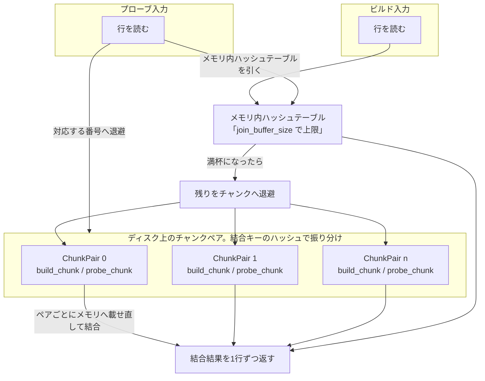

# 第10章 エグゼキュータ（結合、ソート、集約）

> **本章で読むソース**
>
> - [`sql/iterators/hash_join_iterator.h`](https://github.com/mysql/mysql-server/blob/mysql-8.4.10/sql/iterators/hash_join_iterator.h)
> - [`sql/iterators/hash_join_iterator.cc`](https://github.com/mysql/mysql-server/blob/mysql-8.4.10/sql/iterators/hash_join_iterator.cc)
> - [`sql/filesort.cc`](https://github.com/mysql/mysql-server/blob/mysql-8.4.10/sql/filesort.cc)
> - [`sql/iterators/sorting_iterator.cc`](https://github.com/mysql/mysql-server/blob/mysql-8.4.10/sql/iterators/sorting_iterator.cc)
> - [`sql/iterators/composite_iterators.cc`](https://github.com/mysql/mysql-server/blob/mysql-8.4.10/sql/iterators/composite_iterators.cc)
> - [`sql/iterators/composite_iterators.h`](https://github.com/mysql/mysql-server/blob/mysql-8.4.10/sql/iterators/composite_iterators.h)

## この章の狙い

前章では、エグゼキュータが「`Init()` で準備し、`Read()` を呼ぶたびに1行を返す」イテレータの連鎖としてクエリを実行することを見た。
連鎖の末端には1テーブルを走査する単純なイテレータが並ぶが、結合、ソート、集約のように複数行をまたいで状態を持つ処理は、子イテレータを駆動しながら内部にバッファを抱える複合イテレータが担う。
本章では代表的な3つの複合イテレータを読む。
等価結合を担う `HashJoinIterator`、ORDER BY を担う `filesort` と `SortingIterator`、GROUP BY を担う `AggregateIterator` である。

3つに共通する設計上の難所は、ワークメモリの有限性である。
ハッシュ結合はビルド入力全体をハッシュテーブルに載せたいが、`join_buffer_size` を超えると載りきらない。
ソートは対象行全体をソートバッファに載せたいが、`sort_buffer_size` を超えると載りきらない。
どちらも、メモリに収まる場合はメモリ内だけで完結し、超えた場合はディスク上の一時ファイルへ退避して処理を成立させる仕組みを持つ。
本章の最適化の主題は、この「メモリ超過時にディスクへスピルして処理を成立させる」機構である。

## 前提

[第9章 エグゼキュータ（イテレータ実行モデル）](09-executor-iterators.md) のイテレータインタフェース（`Init()`／`Read()`／戻り値の規約）を前提とする。
結合順序やどのアクセスパスを選ぶかの決定は [第7章](07-optimizer-join-cost.md) と [第8章](08-optimizer-access-paths.md) のオプティマイザが済ませており、本章はその決定にもとづいて組み立てられたイテレータ木を実行する側を読む。

## ハッシュ結合のビルドとプローブ

ハッシュ結合は等価結合（`a.x = b.y` の形）を、ネステッドループより少ない比較回数で処理する手法である。
一方の入力（ビルド入力）の全行を結合キーでハッシュテーブルに格納し、もう一方の入力（プローブ入力）を1行ずつ読みながら、その結合キーでハッシュテーブルを引いて一致行を取り出す。
`HashJoinIterator` の `Init()` は、まずビルド入力を読み切ってハッシュテーブルを構築する。

[`sql/iterators/hash_join_iterator.cc` L325-L334](https://github.com/mysql/mysql-server/blob/mysql-8.4.10/sql/iterators/hash_join_iterator.cc#L325-L334)

```cpp
  } else {  // Start with 'build' input.
    if (InitHashTable()) {
      assert(thd()->is_error() ||
             thd()->killed);  // my_error should have been called.

      return true;
    }

    return m_state == State::END_OF_ROWS ? false : InitProbeIterator();
  }
```

`InitHashTable()` が呼ぶ `BuildHashTable()` が、ビルド入力の各行をメモリ上の `m_row_buffer` に詰めていく。
この行バッファの容量は、コンストラクタが受け取る `max_memory_available` で決まる。
ヘッダのコメントが述べるとおり、この値はシステム変数 `join_buffer_size` から設定される。

[`sql/iterators/hash_join_iterator.h` L92-L96](https://github.com/mysql/mysql-server/blob/mysql-8.4.10/sql/iterators/hash_join_iterator.h#L92-L96)

```cpp
/// The size of the in-memory hash table is controlled by the system variable
/// join_buffer_size. If we run out of memory during step 2, we degrade into a
/// hybrid hash join. The data already in memory is processed using regular hash
/// join, and the remainder is processed using on-disk hash join. It works like
/// this:
```

実行の本体は `Read()` の状態機械である。
状態は `enum class State` で定義され、プローブ入力をイテレータから読む状態、ハッシュテーブルの一致行を返す状態、そしてディスクスピル時にチャンクファイルから読む状態などに分かれる。

[`sql/iterators/hash_join_iterator.h` L495-L515](https://github.com/mysql/mysql-server/blob/mysql-8.4.10/sql/iterators/hash_join_iterator.h#L495-L515)

```cpp
  enum class State {
    // We are reading a row from the probe input, where the row comes from
    // the iterator.
    READING_ROW_FROM_PROBE_ITERATOR,
    // We are reading a row from the probe input, where the row comes from a
    // chunk file.
    READING_ROW_FROM_PROBE_CHUNK_FILE,
    // We are reading a row from the probe input, where the row comes from a
    // probe row saving file.
    READING_ROW_FROM_PROBE_ROW_SAVING_FILE,
    // The iterator is moving to the next pair of chunk files, where the chunk
    // file from the build input will be loaded into the hash table.
    LOADING_NEXT_CHUNK_PAIR,
    // We are reading the first row returned from the hash table lookup that
    // also passes extra conditions.
    READING_FIRST_ROW_FROM_HASH_TABLE,
    // We are reading the remaining rows returned from the hash table lookup.
    READING_FROM_HASH_TABLE,
    // No more rows, both inputs are empty.
    END_OF_ROWS
  };
```

`Read()` は毎回この状態で分岐し、現在の状態に対応する読み取り関数を呼ぶ。

[`sql/iterators/hash_join_iterator.cc` L1131-L1146](https://github.com/mysql/mysql-server/blob/mysql-8.4.10/sql/iterators/hash_join_iterator.cc#L1131-L1146)

```cpp
    switch (m_state) {
      case State::LOADING_NEXT_CHUNK_PAIR:
        if (ReadNextHashJoinChunk()) {
          return 1;
        }
        break;
      case State::READING_ROW_FROM_PROBE_ITERATOR:
        if (ReadRowFromProbeIterator()) {
          return 1;
        }
        break;
      case State::READING_ROW_FROM_PROBE_CHUNK_FILE:
        if (ReadRowFromProbeChunkFile()) {
          return 1;
        }
        break;
```

ビルド入力がすべてメモリに収まったなら、プローブ入力を1行ずつ読み、結合キーでハッシュテーブルを引き、一致行を `READING_FIRST_ROW_FROM_HASH_TABLE` と `READING_FROM_HASH_TABLE` で返していく。
これがメモリ内ハッシュ結合の定常状態である。

## ワークメモリ超過時のディスクスピル

ビルド入力がハッシュテーブルに収まらないとき、`HashJoinIterator` はハイブリッドハッシュ結合へ退化する。
`BuildHashTable()` が行を詰める途中で `m_row_buffer` が満杯になると、`InitializeChunkFiles()` でチャンクファイルを用意し、残りのビルド行を `WriteRowsToChunks()` でディスクへ書き出す。

[`sql/iterators/hash_join_iterator.cc` L575-L582](https://github.com/mysql/mysql-server/blob/mysql-8.4.10/sql/iterators/hash_join_iterator.cc#L575-L582)

```cpp
        if (InitializeChunkFiles(
                m_estimated_build_rows, m_row_buffer.size(), kMaxChunks,
                m_probe_input_tables, m_build_input_tables,
                /*include_match_flag_for_probe=*/m_join_type == JoinType::OUTER,
                &m_chunk_files_on_disk)) {
          assert(thd()->is_error());  // my_error should have been called.
          return true;
        }
```

ここで重要なのは、ビルド入力とプローブ入力を「同じ結合キーのハッシュで同じ番号のチャンクへ」振り分ける点である。
1行をどのチャンクへ書くかは、結合キーから計算したハッシュ値で決まる。
チャンク数を常に2のべき乗にしておくことで、剰余ではなくビットマスク1回で振り分けられる。

[`sql/iterators/hash_join_iterator.cc` L378-L395](https://github.com/mysql/mysql-server/blob/mysql-8.4.10/sql/iterators/hash_join_iterator.cc#L378-L395)

```cpp
  const uint64_t join_key_hash =
      join_key_and_row_buffer->length() == 0
          ? kZeroKeyLengthHash
          : MY_XXH64(join_key_and_row_buffer->ptr(),
                     join_key_and_row_buffer->length(), xxhash_seed);

  assert((chunks->size() & (chunks->size() - 1)) == 0);
  // Since we know that the number of chunks will be a power of two, do a
  // bitwise AND instead of (join_key_hash % chunks->size()).
  const size_t chunk_index = join_key_hash & (chunks->size() - 1);
  ChunkPair &chunk_pair = (*chunks)[chunk_index];
  if (write_to_build_chunk) {
    return chunk_pair.build_chunk.WriteRowToChunk(join_key_and_row_buffer,
                                                  row_has_match);
  } else {
    return chunk_pair.probe_chunk.WriteRowToChunk(join_key_and_row_buffer,
                                                  row_has_match);
  }
```

ビルド側のチャンクとプローブ側のチャンクは `ChunkPair` として対になって管理される。

[`sql/iterators/hash_join_iterator.h` L50-L53](https://github.com/mysql/mysql-server/blob/mysql-8.4.10/sql/iterators/hash_join_iterator.h#L50-L53)

```cpp
struct ChunkPair {
  HashJoinChunk probe_chunk;
  HashJoinChunk build_chunk;
};
```

同じ結合キーは必ず同じ番号のチャンクへ入るので、結合相手は同じ番号のチャンクペアの中だけに存在する。
あとはチャンクペアを1組ずつ取り出し、ビルド側チャンクをハッシュテーブルへ読み込み、対応するプローブ側チャンクを流せばよい。
チャンク数は見積もりで決めるので、多くの場合は各ビルド側チャンクがメモリに収まり、ペアの結合はメモリ内ハッシュ結合として完結する。
ビルド側チャンクが収まらなかった場合は、プローブ側を流し切ってからハッシュテーブルを再充填して処理を続ける経路がある。
このペア送りを担うのが `LOADING_NEXT_CHUNK_PAIR` 状態の `ReadNextHashJoinChunk()` である。

[`sql/iterators/hash_join_iterator.cc` L637-L653](https://github.com/mysql/mysql-server/blob/mysql-8.4.10/sql/iterators/hash_join_iterator.cc#L637-L653)

```cpp
  const bool move_to_next_chunk =
      // We are before the first chunk, so move to the next.
      m_current_chunk == -1 ||
      // We are done reading all the rows from the build chunk.
      m_build_chunk_current_row >=
          m_chunk_files_on_disk[m_current_chunk].build_chunk.NumRows() ||
      // The probe chunk file is empty.
      m_chunk_files_on_disk[m_current_chunk].probe_chunk.NumRows() == 0;

  if (move_to_next_chunk) {
    m_current_chunk++;
    m_build_chunk_current_row = 0;

    // Since we are moving to a new set of chunk files, ensure that we read from
    // the chunk file and not from the probe row saving file.
    m_read_from_probe_row_saving = false;
  }
```

この機構がなぜ効くかを一文で言えば、結合キーのハッシュで両入力を同じ番号のチャンクへ振り分けることで、巨大な結合をメモリに収まりやすい独立した小さな結合の集まりへ分けられるからである。
収まらなかったビルド側チャンクは、プローブ側を流し切ってからハッシュテーブルを再充填して処理する。
`join_buffer_size` を超える入力でも、メモリ不足でクエリを失敗させず、ディスクの追加コストと引き換えに結合を成立させる。



## filesort のメモリ内ソートと外部マージの切替

ORDER BY のソートは `filesort()` が担う。
入口は次の関数で、ソース側イテレータから全行を読み、ソート結果を `Sort_result` に詰めて返す。

[`sql/filesort.cc` L367-L370](https://github.com/mysql/mysql-server/blob/mysql-8.4.10/sql/filesort.cc#L367-L370)

```cpp
bool filesort(THD *thd, Filesort *filesort, RowIterator *source_iterator,
              table_map tables_to_get_rowid_for, ha_rows num_rows_estimate,
              Filesort_info *fs_info, Sort_result *sort_result,
              ha_rows *found_rows) {
```

実際に行を読むのは `read_all_rows()` で、ソース側イテレータを `for (;;)` で回し、1行ごとにソートキーを作ってソートバッファへ追加する。
ここがソートにおけるスピルの判断点である。
`alloc_and_make_sortkey()` がメモリ不足を返したら、それまでにバッファへ溜めた分を `write_keys()` でいったんソートして一時ファイルへ書き出し、バッファを空にして読み取りを続ける。

[`sql/filesort.cc` L1013-L1025](https://github.com/mysql/mysql-server/blob/mysql-8.4.10/sql/filesort.cc#L1013-L1025)

```cpp
        // Out of room, so flush chunk to disk (if there's anything to flush).
        if (num_records_this_chunk > 0) {
          if (write_keys(param, fs_info, num_records_this_chunk, chunk_file,
                         tempfile)) {
            return HA_POS_ERROR;
          }
          num_records_this_chunk = 0;
          num_written_chunks++;
          fs_info->reset();

          // Now we should have room for a new row.
          out_of_mem_or_error = alloc_and_make_sortkey(
              param, fs_info, tables, &key_length, &longest_addon_so_far);
```

`write_keys()` は、まずバッファ内をソートしてから一時ファイル `tempfile` へ書き、その断片の位置と行数を `Merge_chunk` として `chunk_file` に記録する。
つまり一時ファイルには、それぞれが内部でソート済みの断片（ソート済みラン）が並ぶ。

[`sql/filesort.cc` L1109-L1118](https://github.com/mysql/mysql-server/blob/mysql-8.4.10/sql/filesort.cc#L1109-L1118)

```cpp
  merge_chunk.set_file_position(my_b_tell(tempfile));
  merge_chunk.set_rowcount(static_cast<ha_rows>(count));

  for (uint ix = 0; ix < count; ++ix) {
    uchar *record = fs_info->get_sorted_record(ix);
    const size_t rec_length = param->get_record_length(record);

    if (my_b_write(tempfile, record, rec_length))
      return 1; /* purecov: inspected */
  }
```

`read_all_rows()` を抜けたあと、`filesort()` は書き出したチャンク数で処理を切り替える。
チャンクが0なら全行がメモリに収まったので、メモリ内でソートして `save_index()` で結果を確定する。
チャンクがあるなら、ディスク上のソート済みランを外部マージソートで統合する。

[`sql/filesort.cc` L522-L527](https://github.com/mysql/mysql-server/blob/mysql-8.4.10/sql/filesort.cc#L522-L527)

```cpp
  if (num_chunks == 0)  // The whole set is in memory
  {
    ha_rows rows_in_chunk =
        param->using_pq ? pq.num_elements() : num_rows_found;
    if (save_index(param, rows_in_chunk, fs_info, sort_result)) goto err;
  } else {
```

外部マージの本体は `merge_many_buff()` と `merge_index()` で、ソート済みランを複数本ずつ束ねて読み、先頭キーの小さい順に取り出して1本のランへ統合する処理を、ランが1本になるまで繰り返す。

[`sql/filesort.cc` L560-L570](https://github.com/mysql/mysql-server/blob/mysql-8.4.10/sql/filesort.cc#L560-L570)

```cpp
    if (merge_many_buff(thd, param, merge_buf, fs_info->merge_chunks,
                        &num_chunks, &tempfile))
      goto err;
    if (flush_io_cache(&tempfile) ||
        reinit_io_cache(&tempfile, READ_CACHE, 0L, false, false))
      goto err;
    if (merge_index(
            thd, param, merge_buf,
            Merge_chunk_array(fs_info->merge_chunks.begin(), num_chunks),
            &tempfile, outfile))
      goto err;
```

各ランは内部でソート済みなので、マージは各ランの先頭だけを比較すればよく、全データを同時にメモリへ載せる必要がない。
これがソート側のスピル機構であり、`sort_buffer_size` を超える対象でも、メモリの何倍もの行を有限のバッファでソートできる理由である。

## SortingIterator による結果の出し分け

`SortingIterator` は、この `filesort()` をイテレータ実行モデルへつなぐラッパーである。
`DoSort()` が `filesort()` を呼ぶ。

[`sql/iterators/sorting_iterator.cc` L531-L533](https://github.com/mysql/mysql-server/blob/mysql-8.4.10/sql/iterators/sorting_iterator.cc#L531-L533)

```cpp
  bool error = ::filesort(thd(), m_filesort, m_source_iterator.get(),
                          m_tables_to_get_rowid_for, m_num_rows_estimate,
                          &m_fs_info, &m_sort_result, &found_rows);
```

ソートが済むと `Init()` は、結果がディスクの一時ファイルにあるか、メモリ内にあるかで読み取り用イテレータを選び分ける。
`io_cache` が初期化済み（外部マージで一時ファイルに出した）なら `SortFileIterator` 系を、そうでなければ後段の `else` でメモリ内の `SortBufferIterator` 系を据える。

[`sql/iterators/sorting_iterator.cc` L449-L451](https://github.com/mysql/mysql-server/blob/mysql-8.4.10/sql/iterators/sorting_iterator.cc#L449-L451)

```cpp
  if (m_sort_result.io_cache && my_b_inited(m_sort_result.io_cache)) {
    // Test if ref-records was used
    if (m_fs_info.using_addon_fields()) {
```

これ以後、`SortingIterator::Read()` は選んだ結果イテレータへ委譲して1行ずつ返す。
メモリ内かディスクかという内部事情は、`SortingIterator` を使う上位のイテレータには見えない。

## 集約 AggregateIterator のグループ境界検出

GROUP BY の集約は `AggregateIterator` が担う。
このイテレータは、すでにグループキーで並んだ入力を子イテレータから受け取り、同じキーが続く間はそのグループの集約関数（SUM や COUNT など）へ値を足し込み、キーが変わったらそのグループの集約結果を1行として出力する。
入力がグループキー順に並んでいることは、その前段に置かれたソートやインデックス走査が保証する。

状態は次の列挙で表す。

[`sql/iterators/composite_iterators.h` L230-L235](https://github.com/mysql/mysql-server/blob/mysql-8.4.10/sql/iterators/composite_iterators.h#L230-L235)

```cpp
  enum {
    READING_FIRST_ROW,
    LAST_ROW_STARTED_NEW_GROUP,
    OUTPUTTING_ROLLUP_ROWS,
    DONE_OUTPUTTING_ROWS
  } m_state;
```

新しいグループに入ったとき、`Read()` はそのグループの先頭行をテーブルバッファへ戻し、すべての集約関数を `reset_and_add()` で初期化する。
これが「集約のリセット」、つまり次のグループの集計を白紙から始める処理である。

[`sql/iterators/composite_iterators.cc` L307-L326](https://github.com/mysql/mysql-server/blob/mysql-8.4.10/sql/iterators/composite_iterators.cc#L307-L326)

```cpp
    case LAST_ROW_STARTED_NEW_GROUP:
      SetRollupLevel(m_join->send_group_parts);

      // We don't need m_first_row_this_group for the old group anymore,
      // but we'd like to reuse its buffer, so swap instead of std::move.
      // (Testing for state == READING_FIRST_ROW and avoiding the swap
      // doesn't seem to give any speed gains.)
      swap(m_first_row_this_group, m_first_row_next_group);
      LoadIntoTableBuffers(
          m_tables, pointer_cast<const uchar *>(m_first_row_this_group.ptr()));

      for (Item_sum **item = m_join->sum_funcs; *item != nullptr; ++item) {
        if (m_rollup) {
          if (down_cast<Item_rollup_sum_switcher *>(*item)
                  ->reset_and_add_for_rollup(m_last_unchanged_group_item_idx))
            return true;
        } else {
          if ((*item)->reset_and_add()) return true;
        }
      }
```

そのあと子イテレータを進めながら、各行でグループキーが変わったかどうかを `update_item_cache_if_changed()` で判定する。
戻り値が0以上なら、最初に値が変わったグループ列の位置を表し、グループの切れ目を意味する。
切れ目を見つけたら、新しい行を次グループ用に退避してから、いま集計していたグループの値をテーブルバッファへ戻し、そのグループの集約結果を1行として出力する。

[`sql/iterators/composite_iterators.cc` L365-L382](https://github.com/mysql/mysql-server/blob/mysql-8.4.10/sql/iterators/composite_iterators.cc#L365-L382)

```cpp
        int first_changed_idx =
            update_item_cache_if_changed(m_join->group_fields);
        if (first_changed_idx >= 0) {
          // The group changed. Store the new row (we can't really use it yet;
          // next Read() will deal with it), then load back the group values
          // so that we can output a row for the current group.
          // NOTE: This does not save and restore FTS information,
          // so evaluating MATCH() on these rows may give the wrong result.
          // (Storing the row ID and repositioning it with ha_rnd_pos()
          // would, but we can't do the latter without disturbing
          // ongoing scans. See bug #32565923.) For the old join optimizer,
          // we generally solve this by inserting temporary tables or sorts
          // (both of which restore the information correctly); for the
          // hypergraph join optimizer, we add a special streaming step
          // for MATCH columns.
          StoreFromTableBuffers(m_tables, &m_first_row_next_group);
          LoadIntoTableBuffers(m_tables, pointer_cast<const uchar *>(
                                             m_first_row_this_group.ptr()));
```

同じグループが続く間は、各行を集約関数へ `aggregator_add()` で足し込むだけで、出力は起きない。
グループが変わった瞬間にだけ1行を出力し、ただちに次グループの集約をリセットする。
この設計の利点は、入力がキー順に並んでいる前提のもとで、グループ全体をメモリに溜めずに、現在のグループの集約状態だけを保持すれば足りる点である。

## ネステッドループ結合との使い分け

複合イテレータには、もう一つ基本的な結合方式としてネステッドループ結合の `NestedLoopIterator` がある。
その `Read()` は、外側入力から1行読むたびに内側入力を `Init()` で頭から走査し直す。

[`sql/iterators/composite_iterators.cc` L486-L498](https://github.com/mysql/mysql-server/blob/mysql-8.4.10/sql/iterators/composite_iterators.cc#L486-L498)

```cpp
  for (;;) {  // Termination condition within loop.
    if (m_state == NEEDS_OUTER_ROW) {
      int err = m_source_outer->Read();
      if (err == 1) {
        return 1;  // Error.
      }
      if (err == -1) {
        m_state = END_OF_ROWS;
        return -1;
      }
      if (m_pfs_batch_mode) {
        m_source_inner->StartPSIBatchMode();
      }
```

外側の1行ごとに内側を1回走査するので、内側を結合キーで引けるインデックスがあれば、外側が少数のときに有利になる。
一方、両側が大きく内側に有効なインデックスがない等価結合では、内側を毎回走査し直すコストが嵩むため、ビルド入力を一度だけハッシュ化して引くハッシュ結合が向く。
ハッシュ結合はメモリ超過時にディスクへスピルする代わりに、各プローブ行をハッシュ参照1回で済ませる。
オプティマイザは [第7章](07-optimizer-join-cost.md) のコストモデルにもとづいて、結合ごとにどちらのイテレータを使うかを決める。

## まとめ

本章では、複数行をまたいで状態を持つ3つの複合イテレータを読んだ。
`HashJoinIterator` はビルド入力をハッシュテーブルに載せ、プローブ入力を1行ずつ引いて結合する。
`join_buffer_size` を超えると、結合キーのハッシュで両入力を同じ番号のチャンクペアへ振り分け、巨大な結合をメモリに収まりやすい単位へ分けてディスクへスピルし、収まらなかったチャンクは再充填して処理する。
`filesort()` と `SortingIterator` はソートバッファに全行を載せようとし、超えた分はソート済みランとして一時ファイルへ書き出し、最後に外部マージソートで統合する。
`AggregateIterator` はキー順に並んだ入力のグループ境界を検出し、グループ単位で集約結果を出力する。
ネステッドループ結合と比べたとき、ハッシュ結合は大きな等価結合で、ソートと集約は前段の整列を前提とした集約処理で力を発揮する。

ハッシュ結合とソートに共通するのは、メモリに収まる場合はメモリ内で完結し、超えた場合だけディスクへスピルする二段構えである。
集約はキー順に並んだ入力をグループ単位で流すので、スピルが要るとすれば前段のソート側で起きる。
この設計が、有限のワークメモリのもとで、メモリを大きく超える入力に対しても結合とソートを失敗させずに成立させている。

## 関連する章

- [第9章 エグゼキュータ（イテレータ実行モデル）](09-executor-iterators.md)：本章の複合イテレータが従う `Init()`／`Read()` の規約。
- [第7章 オプティマイザ（join 順序とコストモデル）](07-optimizer-join-cost.md)：ハッシュ結合とネステッドループの選択を決めるコストモデル。
- [第8章 オプティマイザ（アクセスパスと range optimizer）](08-optimizer-access-paths.md)：ソートや結合の前段に置かれるアクセスパスの決定。
