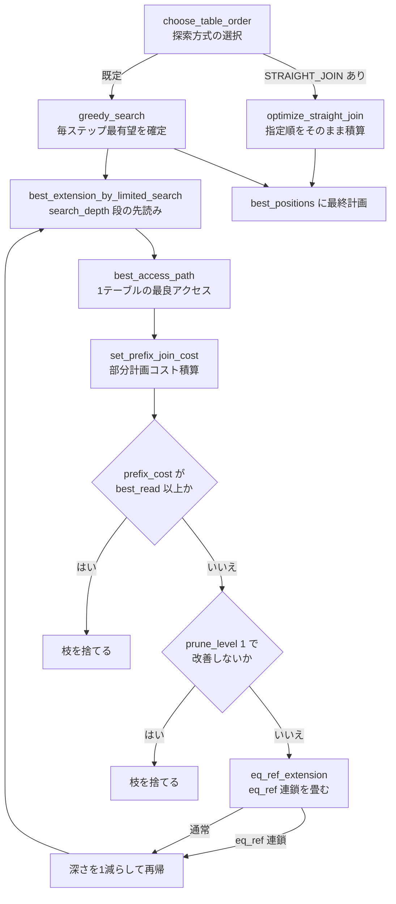

# 第10章 オプティマイザ（join 順序とコストモデル）

> **本章で読むソース**
>
> - [`sql/sql_planner.cc`](https://github.com/mysql/mysql-server/blob/mysql-8.4.10/sql/sql_planner.cc)
> - [`sql/opt_costmodel.h`](https://github.com/mysql/mysql-server/blob/mysql-8.4.10/sql/opt_costmodel.h)
> - [`sql/opt_costmodel.cc`](https://github.com/mysql/mysql-server/blob/mysql-8.4.10/sql/opt_costmodel.cc)
> - [`sql/opt_costconstants.h`](https://github.com/mysql/mysql-server/blob/mysql-8.4.10/sql/opt_costconstants.h)

## この章の狙い

複数のテーブルを結合するクエリでは、どのテーブルから読み始め、どの順で結合するかによって実行コストが大きく変わる。
本章は、その結合順序をコストの見積もりで選ぶ中核を読む。
具体的には、結合順序を探索する `Optimize_table_order::choose_table_order` と貪欲探索、各テーブルの最良アクセス方法を見積もる `best_access_path`、そして見積もりの土台になるコストモデル `Cost_model_server` と `Cost_model_table` を順にたどる。
第9章で論理変換を終えたクエリブロックが、ここで物理的な実行順序を得る。

## 前提

第9章までに、クエリは論理的な変換を受け、結合に参加するテーブルの集合と利用可能なインデックスの候補が確定している。
本章が扱うのは、その確定した素材から1つの結合順序とアクセス方法を選ぶ段である。
8.4 の既定オプティマイザは、本章で読む貪欲探索方式である。
新しい**ハイパーグラフオプティマイザ**（`sql/join_optimizer/`）も同梱されるが、既定では無効であり、本章は扱わない（最終節で所在だけ示す）。
本章のコード引用はすべて GitHub タグ `mysql-8.4.10` に固定する。

## コストとは何を足し合わせた値か

結合順序の選択は、候補となる順序それぞれにコストという1つの数値を割り当て、最小の順序を選ぶ作業である。
そのコストは、行を読む、条件を評価する、キーを比較する、ディスクブロックを読むといった基本操作に係数を掛けて足し合わせた量である。
この係数を保持し、操作回数からコストを計算する役が**コストモデル**であり、`Cost_model_server` と `Cost_model_table` の2クラスに分かれる。

`Cost_model_server` は、テーブルに依存しないサーバ側の操作を見積もる。
行に対して条件を評価するコストは、行数に係数を掛けて返す。

[`sql/opt_costmodel.h L98-L102`](https://github.com/mysql/mysql-server/blob/mysql-8.4.10/sql/opt_costmodel.h#L98-L102)

```cpp
  double row_evaluate_cost(double rows) const {
    assert(m_initialized);
    assert(rows >= 0.0);
    return rows * m_server_cost_constants->row_evaluate_cost();
  }
```

キー比較のコストも同様に、比較回数に係数を掛けて返す。

[`sql/opt_costmodel.h L112-L117`](https://github.com/mysql/mysql-server/blob/mysql-8.4.10/sql/opt_costmodel.h#L112-L117)

```cpp
  double key_compare_cost(double keys) const {
    assert(m_initialized);
    assert(keys >= 0.0);

    return keys * m_server_cost_constants->key_compare_cost();
  }
```

ここで掛けられる係数の既定値は `Server_cost_constants` のコンストラクタに定義される。
1行の条件評価が `0.1`、1回のキー比較が `0.05` であり、内部一時テーブルの作成や行操作の係数もここで決まる。

[`sql/opt_costconstants.h L81-L88`](https://github.com/mysql/mysql-server/blob/mysql-8.4.10/sql/opt_costconstants.h#L81-L88)

```cpp
      case Optimizer::kOriginal:
        m_row_evaluate_cost = 0.1;
        m_key_compare_cost = 0.05;
        m_memory_temptable_create_cost = 1.0;
        m_memory_temptable_row_cost = 0.1;
        m_disk_temptable_create_cost = 20.0;
        m_disk_temptable_row_cost = 0.5;
        break;
```

一方、`Cost_model_table` は、特定のテーブルに対する入出力を見積もる。
ストレージエンジンからランダムにブロックを読むコストは、ブロック数に係数を掛けて返す。

[`sql/opt_costmodel.h L306-L311`](https://github.com/mysql/mysql-server/blob/mysql-8.4.10/sql/opt_costmodel.h#L306-L311)

```cpp
  double io_block_read_cost(double blocks) const {
    assert(m_initialized);
    assert(blocks >= 0.0);

    return blocks * m_se_cost_constants->io_block_read_cost();
  }
```

ブロックの係数の既定値は `SE_cost_constants` のコンストラクタにある。
ディスクからの1ブロック読みが `1.0`、メモリ上の1ブロック読みが `0.25` である。

[`sql/opt_costconstants.h L220-L223`](https://github.com/mysql/mysql-server/blob/mysql-8.4.10/sql/opt_costconstants.h#L220-L223)

```cpp
      case Optimizer::kOriginal:
        m_io_block_read_cost = 1.0;
        m_memory_block_read_cost = 0.25;
        break;
```

ディスク読みとメモリ読みの係数が分かれている点が、このモデルの要点である。
あるページを読むコストは、そのページがバッファプールに載っている割合に応じて、安いメモリ読みと高いディスク読みへ按分される。
`page_read_cost` がこの按分を実装し、エンジンが返す在メモリ率（`table_in_memory_estimate`）でページ数を2つに分けて足し合わせる。

[`sql/opt_costmodel.cc L86-L100`](https://github.com/mysql/mysql-server/blob/mysql-8.4.10/sql/opt_costmodel.cc#L86-L100)

```cpp
double Cost_model_table::page_read_cost(double pages) const {
  assert(m_initialized);
  assert(pages >= 0.0);

  const double in_mem = m_table->file->table_in_memory_estimate();

  const double pages_in_mem = pages * in_mem;
  const double pages_on_disk = pages - pages_in_mem;
  assert(pages_on_disk >= 0.0);

  const double cost =
      buffer_block_read_cost(pages_in_mem) + io_block_read_cost(pages_on_disk);

  return cost;
}
```

これにより、同じテーブルでも、キャッシュにすでに載っているテーブルは読み出しが安く見積もられ、結合順序の選択がバッファプールの状態を反映する。

## 1つのテーブルの最良アクセスを見積もる best_access_path

結合順序の探索は、部分的な結合計画にテーブルを1つずつ足していく。
そのとき「このテーブルを今ここに足すなら、どのアクセス方法で何行読み、いくらかかるか」を答えるのが `best_access_path` である。

[`sql/sql_planner.cc L983-L987`](https://github.com/mysql/mysql-server/blob/mysql-8.4.10/sql/sql_planner.cc#L983-L987)

```cpp
void Optimize_table_order::best_access_path(JOIN_TAB *tab,
                                            const table_map remaining_tables,
                                            const uint idx, bool disable_jbuf,
                                            const double prefix_rowcount,
                                            POSITION *pos) {
```

この関数は、対象テーブル `tab` に対して複数のアクセス方法を見積もり、最も安いものを選ぶ。
まずインデックスを使う `ref` アクセスの候補を `find_best_ref` で探す。
ここでストレージエンジンがインデックスアクセスを持つ場合に限り、利用可能なキーから最良の `ref` を選ぶ。

[`sql/sql_planner.cc L1024-L1028`](https://github.com/mysql/mysql-server/blob/mysql-8.4.10/sql/sql_planner.cc#L1024-L1028)

```cpp
  if (tab->keyuse() != nullptr &&
      (table->file->ha_table_flags() & HA_NO_INDEX_ACCESS) == 0)
    best_ref =
        find_best_ref(tab, remaining_tables, idx, prefix_rowcount,
                      &found_condition, &ref_depend_map, &used_key_parts);
```

`ref` の見積もりが取れたら、次にテーブルスキャンや範囲スキャンと比較する。
このとき、`ref` が読む行数がスキャンより少なく、かつ `ref` を部分行ごとに繰り返すコストが1回のスキャンより安いなら、スキャンは検討しても勝ち目がないため除外する。

[`sql/sql_planner.cc L1089-L1091`](https://github.com/mysql/mysql-server/blob/mysql-8.4.10/sql/sql_planner.cc#L1089-L1091)

```cpp
  if (rows_fetched < tab->found_records &&  // (1a)
      best_read_cost <= tab->read_time)     // (1b)
  {
```

比較を終えると、選んだアクセス方法の見積もりを結果オブジェクト `pos` に書き込む。
読む行数 `rows_fetched`、読み出しコスト `read_cost`、使ったキー `key`、対象テーブル `table` がここで確定する。

[`sql/sql_planner.cc L1220-L1224`](https://github.com/mysql/mysql-server/blob/mysql-8.4.10/sql/sql_planner.cc#L1220-L1224)

```cpp
  pos->filter_effect = filter_effect;
  pos->rows_fetched = rows_fetched;
  pos->read_cost = best_read_cost;
  pos->key = best_ref;
  pos->table = tab;
```

この `pos` の値が、探索側で部分計画のコストを積み上げる材料になる。

## 部分計画のコストを積み上げる set_prefix_join_cost

`best_access_path` が出した1テーブル分の見積もりを、それまでの部分計画に連結したコストへ変換するのが `set_prefix_join_cost` である。
入れ子ループ結合では、前段までの行数（`prefix_rowcount`）の各組み合わせに対して現テーブルのアクセスが繰り返される。
そのため、前段までのコストに、現テーブルの読み出しコストと、行を評価するコストを足す。

[`sql/sql_select.h L568-L578`](https://github.com/mysql/mysql-server/blob/mysql-8.4.10/sql/sql_select.h#L568-L578)

```cpp
  void set_prefix_join_cost(uint idx, const Cost_model_server *cm) {
    if (idx == 0) {
      prefix_rowcount = rows_fetched;
      prefix_cost = read_cost + cm->row_evaluate_cost(prefix_rowcount);
    } else {
      prefix_rowcount = (this - 1)->prefix_rowcount * rows_fetched;
      prefix_cost = (this - 1)->prefix_cost + read_cost +
                    cm->row_evaluate_cost(prefix_rowcount);
    }
    prefix_rowcount *= filter_effect;
  }
```

前段の行数に現テーブルの fanout（`rows_fetched`）を掛けたものが新しい行数になる。
この掛け算が、結合順序の良し悪しを決める。
fanout の小さいテーブルを先に置けば、以降のテーブルが繰り返される回数が抑えられ、総コストが小さくなる。
探索の目的は、この `prefix_cost` を最小にする順序を見つけることである。

## 探索の入口、choose_table_order

結合順序の探索は `choose_table_order` から始まる。
この関数は、利用者が指定したパラメータを見て探索方式を選び、それを呼び出す。

[`sql/sql_planner.cc L1953`](https://github.com/mysql/mysql-server/blob/mysql-8.4.10/sql/sql_planner.cc#L1953-L1953)

```cpp
bool Optimize_table_order::choose_table_order() {
```

分岐の鍵は、クエリに `STRAIGHT_JOIN` が指定されているかである。
指定があれば、利用者が書いた順序を尊重して探索を省く `optimize_straight_join` を呼ぶ。
指定がなければ、コストで順序を探す `greedy_search` を呼ぶ。

[`sql/sql_planner.cc L2028-L2032`](https://github.com/mysql/mysql-server/blob/mysql-8.4.10/sql/sql_planner.cc#L2028-L2032)

```cpp
  if (straight_join)
    optimize_straight_join(join_tables);
  else {
    if (greedy_search(join_tables)) return true;
  }
```

`optimize_straight_join` は、与えられた順序のまま各テーブルに `best_access_path` を適用し、コストを積み上げるだけである。

[`sql/sql_planner.cc L2148-L2157`](https://github.com/mysql/mysql-server/blob/mysql-8.4.10/sql/sql_planner.cc#L2148-L2157)

```cpp
    /* Find the best access method from 's' to the current partial plan */
    best_access_path(s, join_tables, idx, false, rowcount, position);

    // compute the cost of the new plan extended with 's'
    position->set_prefix_join_cost(idx, cost_model);

    position->no_semijoin();  // advance_sj_state() is not needed

    rowcount = position->prefix_rowcount;
    cost = position->prefix_cost;
```

順序が固定なので組み合わせの探索は起きない。
以降は、順序を探す `greedy_search` の側を読む。

## 組合せ爆発を抑える貪欲探索

N 個のテーブルの結合順序は最大で N! 通りある。
これを全列挙すると、テーブル数が増えるにつれて探索が現実的でなくなる。
`greedy_search` は、この組合せ爆発を避けるため、全列挙ではなく**貪欲探索**を使う。
すなわち、毎ステップで最も有望なテーブルを1つ選んで確定し、残りから次を選ぶ動作を繰り返す。

[`sql/sql_planner.cc L2330-L2338`](https://github.com/mysql/mysql-server/blob/mysql-8.4.10/sql/sql_planner.cc#L2330-L2338)

```cpp
bool Optimize_table_order::greedy_search(table_map remaining_tables) {
  uint idx = join->const_tables;  // index into 'join->best_ref'
  uint best_idx;
  POSITION best_pos;
  JOIN_TAB *best_table;  // the next plan node to be added to the curr QEP
  DBUG_TRACE;

  /* Number of tables that we are optimizing */
  const uint n_tables = popcount(remaining_tables);
```

ただし、各ステップで「最も有望な1つ」を選ぶ判断は、1テーブルだけを見て決めるのではない。
`search_depth` で決まる深さまで先読みした上で、その先読みで最良だった計画の先頭テーブルを確定する。
このため、ステップごとに `best_extension_by_limited_search` を呼んで `search_depth` 段の部分計画を探索する。

[`sql/sql_planner.cc L2350-L2356`](https://github.com/mysql/mysql-server/blob/mysql-8.4.10/sql/sql_planner.cc#L2350-L2356)

```cpp
  do {
    /* Find the extension of the current QEP with the lowest cost */
    join->best_read = DBL_MAX;
    join->best_rowcount = HA_POS_ERROR;
    found_plan_with_allowed_sj = false;
    if (best_extension_by_limited_search(remaining_tables, idx, search_depth))
      return true;
```

残りテーブル数が `search_depth` 以下になれば、先読みがそのまま完全な計画になるため、そこで探索を打ち切って `best_positions` を最終計画とする。

[`sql/sql_planner.cc L2371-L2384`](https://github.com/mysql/mysql-server/blob/mysql-8.4.10/sql/sql_planner.cc#L2371-L2384)

```cpp
    if (size_remain <= search_depth || use_best_so_far) {
      /*
        'join->best_positions' contains a complete optimal extension of the
        current partial QEP.
      */
      DBUG_EXECUTE(
          "opt",
          print_plan(join, n_tables,
                     idx ? join->best_positions[idx - 1].prefix_rowcount : 1.0,
                     idx ? join->best_positions[idx - 1].prefix_cost : 0.0,
                     idx ? join->best_positions[idx - 1].prefix_cost : 0.0,
                     "optimal"););
      return false;
    }
```

`search_depth` の既定値は `determine_search_depth` が決める。
テーブル数が7以下なら、全列挙に相当する深さ（テーブル数+1）を使い、それを超えると7で頭打ちにする。

[`sql/sql_planner.cc L2080-L2097`](https://github.com/mysql/mysql-server/blob/mysql-8.4.10/sql/sql_planner.cc#L2080-L2097)

```cpp
uint Optimize_table_order::determine_search_depth(uint search_depth,
                                                  uint table_count) {
  if (search_depth > 0) return search_depth;
  /* TODO: this value should be determined dynamically, based on statistics: */
  const uint max_tables_for_exhaustive_opt = 7;

  if (table_count <= max_tables_for_exhaustive_opt)
    search_depth =
        table_count + 1;  // use exhaustive for small number of tables
  else
    /*
      TODO: this value could be determined by some mapping of the form:
      depth : table_count -> [max_tables_for_exhaustive_opt..MAX_EXHAUSTIVE]
    */
    search_depth = max_tables_for_exhaustive_opt;  // use greedy search

  return search_depth;
}
```

テーブル数が少なければ実質的に全列挙して最適解を取り、多ければ深さ7の先読みを持つ貪欲探索に切り替える。
これが、最適性と探索時間の妥協点である。

## 枝刈り、現状ベストを超えた部分計画を捨てる

`search_depth` 段の先読みそのものも、放っておけば指数的に膨らむ。
これを抑えるのが `best_extension_by_limited_search` の中の**枝刈り**である。
この関数は、残りテーブルを順に部分計画へ足し、各候補に `best_access_path` とコスト積み上げを適用する。

[`sql/sql_planner.cc L2797-L2802`](https://github.com/mysql/mysql-server/blob/mysql-8.4.10/sql/sql_planner.cc#L2797-L2802)

```cpp
      /* Find the best access method from 's' to the current partial plan */
      best_access_path(s, remaining_tables, idx, false,
                       idx ? (position - 1)->prefix_rowcount : 1.0, position);

      // Compute the cost of extending the plan with 's'
      position->set_prefix_join_cost(idx, cost_model);
```

第1の枝刈りは、コストによる早期打ち切りである。
ある部分計画のコストが、すでに見つかっている最良の完全計画のコスト（`best_read`）に達したら、そこから先を伸ばしても最良を更新できないため、その枝を捨てる。

[`sql/sql_planner.cc L2828-L2837`](https://github.com/mysql/mysql-server/blob/mysql-8.4.10/sql/sql_planner.cc#L2828-L2837)

```cpp
      if (position->prefix_cost >= join->best_read &&
          found_plan_with_allowed_sj) {
        DBUG_EXECUTE("opt",
                     print_plan(join, idx + 1, position->prefix_rowcount,
                                position->read_cost, position->prefix_cost,
                                "prune_by_cost"););
        trace_one_table.add("pruned_by_cost", true);
        backout_nj_state(remaining_tables, s);
        continue;
      }
```

部分計画のコストは、テーブルを足すほど単調に増える。
そのため、現状ベストに達した時点で残りを伸ばす意味がなく、安全に捨てられる。

第2の枝刈りは、ヒューリスティックによる打ち切りである。
`prune_level` が1のとき、行数とコストのどちらも現在の最良候補を改善しない部分計画を、これ以上伸ばさず捨てる。

[`sql/sql_planner.cc L2843-L2865`](https://github.com/mysql/mysql-server/blob/mysql-8.4.10/sql/sql_planner.cc#L2843-L2865)

```cpp
      if (prune_level == 1) {
        if (best_rowcount > position->prefix_rowcount ||
            best_cost > position->prefix_cost ||
            (idx == join->const_tables &&  // 's' is the first table in the QEP
             s->table() == join->sort_by_table)) {
          if (best_rowcount >= position->prefix_rowcount &&
              best_cost >= position->prefix_cost &&
              /* TODO: What is the reasoning behind this condition? */
              (!(s->key_dependent & remaining_tables) ||
               position->rows_fetched < 2.0)) {
            best_rowcount = position->prefix_rowcount;
            best_cost = position->prefix_cost;
          }
        } else if (found_plan_with_allowed_sj) {
          DBUG_EXECUTE("opt",
                       print_plan(join, idx + 1, position->prefix_rowcount,
                                  position->read_cost, position->prefix_cost,
                                  "pruned_by_heuristic"););
          trace_one_table.add("pruned_by_heuristic", true);
          backout_nj_state(remaining_tables, s);
          continue;
        }
      }
```

この枝刈りは最適計画を取り逃す可能性があり、コードのコメントも「このヒューリスティックは最適 QEP を見逃すことがあり、結果として非網羅的な探索になる」と断っている。
最適性を一部譲る代わりに探索時間を抑える、という割り切りである。

枝刈りを越えた候補は、まだ残りテーブルがあり探索深さが残っていれば、深さを1つ減らして再帰的に伸ばす。

[`sql/sql_planner.cc L2917-L2921`](https://github.com/mysql/mysql-server/blob/mysql-8.4.10/sql/sql_planner.cc#L2917-L2921)

```cpp
        /* Fallthrough: Explore more best extensions of plan */
        const Opt_trace_array trace_rest(trace, "rest_of_plan");
        if (best_extension_by_limited_search(remaining_tables_after, idx + 1,
                                             current_search_depth - 1))
          return true;
```

## 高速化の工夫、eq_ref の連鎖を1つの単位に畳む

貪欲探索の計算量を、別の角度からさらに削る工夫がある。
ユニークキーで結合されるテーブル（`eq_ref`）は、結合相手の1行に対してちょうど1行を返す。
このような `eq_ref` が連続する区間では、どの順に並べても返す行数とコストが等しいため、順列を入れ替えて試す意味がない。

`best_extension_by_limited_search` は、`eq_ref` で結合できるテーブルに当たると、`eq_ref_extension_by_limited_search` を呼んで、連続する `eq_ref` をまとめて部分計画へ足す。

[`sql/sql_planner.cc L2880-L2898`](https://github.com/mysql/mysql-server/blob/mysql-8.4.10/sql/sql_planner.cc#L2880-L2898)

```cpp
        if (prune_level == 1 &&             // 1)
            position->key != nullptr &&     // 2)
            position->rows_fetched <= 1.0)  // 3)
        {
          /*
            Join in this 'position' is an EQ_REF-joined table, append more
            EQ_REFs. We do this only for the first EQ_REF we encounter which
            will then include other EQ_REFs from 'remaining_tables' and inform
            about which tables was 'eq_ref_extended'. These are later 'pruned'
            as they was processed here.
          */
          if (eq_ref_extended == (table_map)0) {
            /* Try an EQ_REF-joined expansion of the partial plan */
            const Opt_trace_array trace_rest(trace, "rest_of_plan");
            eq_ref_extended =
                real_table_bit |
                eq_ref_extension_by_limited_search(
                    remaining_tables_after, idx + 1, current_search_depth - 1);
            if (eq_ref_extended == ~(table_map)0) return true;  // Failed
```

この工夫の効くしくみは、`eq_ref_extension_by_limited_search` の説明コメントが述べている。
連続する `eq_ref` 群を、貪欲探索から見て1つの実体として扱うことで、計算量 O(N!) の N を実質的に減らす。

[`sql/sql_planner.cc L2987-L2990`](https://github.com/mysql/mysql-server/blob/mysql-8.4.10/sql/sql_planner.cc#L2987-L2990)

```cpp
  Effectively, this chain of eq_refs will be handled as a single
  entity wrt. the full 'greedy' exploration of the possible
  join plans. This will reduce the 'N' in the O(N!) complexity
  of the full greedy search.
```

主キー結合が連なるスタースキーマのようなクエリでは、この畳み込みによって探索対象のテーブル数が大きく減り、最適性を損なわずに探索が速くなる。

## 探索の流れ

ここまでの探索を1枚の図にまとめる。
`choose_table_order` が方式を選び、貪欲探索が深さ制限つきの先読みを繰り返し、その先読みの中で枝刈りと `eq_ref` 畳み込みが効く。



## 既定でないハイパーグラフオプティマイザ

8.4 には、結合をハイパーグラフとして扱い動的計画法で順序を求める**ハイパーグラフオプティマイザ**が `sql/join_optimizer/` に同梱される。
ただしこれは既定では無効である。
既定の `optimizer_switch` を定義する `OPTIMIZER_SWITCH_DEFAULT` に、ハイパーグラフを有効にするフラグ `OPTIMIZER_SWITCH_HYPERGRAPH_OPTIMIZER` は含まれていない。

[`sql/sys_vars.cc L201-L216`](https://github.com/mysql/mysql-server/blob/mysql-8.4.10/sql/sys_vars.cc#L201-L216)

```cpp
static constexpr const unsigned long long OPTIMIZER_SWITCH_DEFAULT{
    OPTIMIZER_SWITCH_INDEX_MERGE | OPTIMIZER_SWITCH_INDEX_MERGE_UNION |
    OPTIMIZER_SWITCH_INDEX_MERGE_SORT_UNION |
    OPTIMIZER_SWITCH_INDEX_MERGE_INTERSECT |
    OPTIMIZER_SWITCH_ENGINE_CONDITION_PUSHDOWN |
    OPTIMIZER_SWITCH_INDEX_CONDITION_PUSHDOWN | OPTIMIZER_SWITCH_MRR |
    OPTIMIZER_SWITCH_MRR_COST_BASED | OPTIMIZER_SWITCH_BNL |
    OPTIMIZER_SWITCH_MATERIALIZATION | OPTIMIZER_SWITCH_SEMIJOIN |
    OPTIMIZER_SWITCH_LOOSE_SCAN | OPTIMIZER_SWITCH_FIRSTMATCH |
    OPTIMIZER_SWITCH_DUPSWEEDOUT | OPTIMIZER_SWITCH_SUBQ_MAT_COST_BASED |
    OPTIMIZER_SWITCH_USE_INDEX_EXTENSIONS |
    OPTIMIZER_SWITCH_COND_FANOUT_FILTER | OPTIMIZER_SWITCH_DERIVED_MERGE |
    OPTIMIZER_SKIP_SCAN | OPTIMIZER_SWITCH_HASH_JOIN |
    OPTIMIZER_SWITCH_PREFER_ORDERING_INDEX |
    OPTIMIZER_SWITCH_DERIVED_CONDITION_PUSHDOWN |
    OPTIMIZER_SWITCH_HASH_SET_OPERATIONS};
```

したがって、明示的に有効化しない限り、本章で読んだ貪欲探索が結合順序を決める。

## まとめ

結合順序の選択は、各順序にコストという1つの数値を割り当て、最小のものを選ぶ作業である。
コストは `Cost_model_server` と `Cost_model_table` が、行評価、キー比較、ブロック読みといった操作回数に係数を掛けて算出する。
ページ読みのコストは在メモリ率で按分され、バッファプールの状態が見積もりに反映される。
各テーブルの最良アクセスは `best_access_path` が見積もり、`set_prefix_join_cost` が入れ子ループの繰り返しを織り込んで部分計画のコストへ積み上げる。
探索は `choose_table_order` から始まり、既定では `greedy_search` が毎ステップ最有望なテーブルを確定する貪欲探索を行う。
組合せ爆発は、深さ制限つきの先読み、現状ベストを超えた枝の打ち切り、そして `eq_ref` 連鎖の畳み込みという3つの工夫で抑えられている。
8.4 のハイパーグラフオプティマイザは同梱されるが既定では無効であり、明示的に有効化しない限り、この貪欲探索が使われる。

## 関連する章

- [第9章 オプティマイザ（論理変換とクエリブロック）](09-optimizer-transformations.md)
- [第11章 オプティマイザ（アクセスパスと range optimizer）](11-optimizer-access-paths.md)
- [第13章 エグゼキュータ（イテレータ実行モデル）](13-executor-iterators.md)
- [第20章 バッファプール](../part02-innodb-foundation/20-buffer-pool.md)
