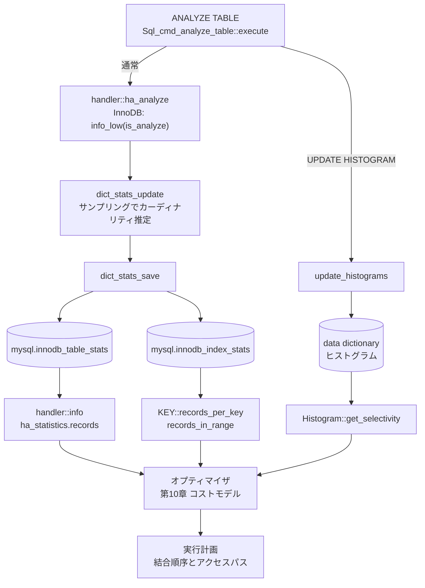

# 第12章 統計情報とカーディナリティ推定

> **本章で読むソース**
>
> - [`sql/handler.h`](https://github.com/mysql/mysql-server/blob/mysql-8.4.10/sql/handler.h)
> - [`sql/key.h`](https://github.com/mysql/mysql-server/blob/mysql-8.4.10/sql/key.h)
> - [`storage/innobase/handler/ha_innodb.cc`](https://github.com/mysql/mysql-server/blob/mysql-8.4.10/storage/innobase/handler/ha_innodb.cc)
> - [`storage/innobase/dict/dict0stats.cc`](https://github.com/mysql/mysql-server/blob/mysql-8.4.10/storage/innobase/dict/dict0stats.cc)
> - [`sql/histograms/histogram.h`](https://github.com/mysql/mysql-server/blob/mysql-8.4.10/sql/histograms/histogram.h)
> - [`sql/sql_admin.cc`](https://github.com/mysql/mysql-server/blob/mysql-8.4.10/sql/sql_admin.cc)

## この章の狙い

第10章のコストモデルは、操作回数に係数を掛けてコストを計算する。
その操作回数の中心にあるのは「読む行数」であり、行数を実際に数えずに見積もる仕組みがなければコストモデルは動かない。
本章は、その行数や選択率という見積もりがどこから来るのかを読む。

オプティマイザは行数の見積もりをストレージエンジンに尋ねる。
尋ねる口が `handler` の `records_in_range` と `info` であり、答えを作る側が InnoDB の永続統計とヒストグラムである。
本章は、`handler` の見積もりインタフェースから始め、InnoDB がサンプリングでカーディナリティを推定して永続テーブルに保存する経路、列値の分布を捉えるヒストグラム、そして `ANALYZE TABLE` がこれらを更新する経路をたどる。

## 前提

第10章で、結合順序の選択は候補ごとにコストという1つの数値を割り当てて最小を選ぶ作業だと読んだ。
第11章で、`ref` アクセスや range スキャンといったアクセスパスの選択が、それぞれの読む行数の見積もりに依存することを読んだ。
本章が扱うのは、その見積もりの値そのものをどう作るかである。
サーバ層とストレージエンジンの境界である `handler` API（第15章）が、統計の取得口としてここでも現れる。
本章のコード引用はすべて GitHub タグ `mysql-8.4.10` に固定する。

## オプティマイザが見積もりを尋ねる3つの口

オプティマイザはストレージエンジンの内部構造を知らない。
行数の見積もりは、`handler` クラスの仮想関数を通じて尋ねる。
口は3つある。
範囲に入る行数を返す `records_in_range`、1キー値あたりの平均行数を返す `records_per_key`、そしてテーブル全体の行数や平均行長を満たす `info` である。

`records_in_range` は、ある範囲条件にマッチする行数を見積もる。
基底クラスの定義は、引数のインデックス番号と開始キー、終了キーを受け取り、その間に存在する行数を返す。

[`sql/handler.h L5734-L5738`](https://github.com/mysql/mysql-server/blob/mysql-8.4.10/sql/handler.h#L5734-L5738)

```cpp
  virtual ha_rows records_in_range(uint inx [[maybe_unused]],
                                   key_range *min_key [[maybe_unused]],
                                   key_range *max_key [[maybe_unused]]) {
    return (ha_rows)10;
  }
```

基底クラスの実装は定数 `10` を返すだけである。
これは、見積もりを提供しないストレージエンジンに対する保守的な既定値であり、実際の値は InnoDB などの派生クラスが上書きして返す。
オプティマイザは、`WHERE col BETWEEN a AND b` のような範囲条件のコストを決めるとき、この関数で範囲内の行数を尋ね、その行数にアクセスコストを掛ける。

2つめの口 `records_per_key` は、`handler` ではなく `KEY` 構造体が持つ。
これは、インデックスの先頭から数えて `key_part_no+1` 個の列だけを見たとき、同じキー値を共有する行が平均で何行あるかを返す。

[`sql/key.h L236-L249`](https://github.com/mysql/mysql-server/blob/mysql-8.4.10/sql/key.h#L236-L249)

```cpp
  rec_per_key_t records_per_key(uint key_part_no) const {
    assert(key_part_no < actual_key_parts);

    /*
      If the storage engine has provided rec per key estimates as float
      then use this. If not, use the integer version.
    */
    if (rec_per_key_float[key_part_no] != REC_PER_KEY_UNKNOWN)
      return rec_per_key_float[key_part_no];

    return (rec_per_key[key_part_no] != 0)
               ? static_cast<rec_per_key_t>(rec_per_key[key_part_no])
               : REC_PER_KEY_UNKNOWN;
  }
```

この値が小さいほどキーの選択性が高い。
1キー値あたり1行なら一意であり、等値検索 `col = ?` は1行だけを返すと見積もれる。
逆にこの値が大きいインデックスは、等値検索でも多くの行を返すため、オプティマイザはそのインデックスを使う利点が小さいと判断する。

3つめの口 `info` は、テーブル単位の統計をまとめて取得する。
返す値は `ha_statistics` 構造体に書き込まれる。

[`sql/handler.h L5774`](https://github.com/mysql/mysql-server/blob/mysql-8.4.10/sql/handler.h#L5774)

```cpp
  virtual int info(uint flag) = 0;
```

`ha_statistics` は、行数 `records`、削除済み行数 `deleted`、平均行長 `mean_rec_length`、インデックスブロックサイズ `block_size` などを保持する。
中心となる `records` は、テーブルの行数の見積もりである。

[`sql/handler.h L4044-L4054`](https://github.com/mysql/mysql-server/blob/mysql-8.4.10/sql/handler.h#L4044-L4054)

```cpp
  /*
    The number of records in the table.
      0    - means the table has exactly 0 rows
    other  - if (table_flags() & HA_STATS_RECORDS_IS_EXACT)
               the value is the exact number of records in the table
             else
               it is an estimate
  */
  ha_rows records;
  ha_rows deleted;       /* Deleted records */
  ulong mean_rec_length; /* physical reclength */
```

コメントが示すとおり、`records` は原則として見積もりである。
正確な行数を保証するのは `HA_STATS_RECORDS_IS_EXACT` フラグを立てたストレージエンジンに限られ、InnoDB はこのフラグを立てない。
オプティマイザがフルスキャンのコストを「テーブルの全行を読むコスト」として計算するとき、その全行数はここで得た見積もりである。

## InnoDB が範囲の行数を見積もる

InnoDB は `records_in_range` を上書きし、B+tree の構造から範囲内の行数を見積もる。
全行を数えるのではなく、範囲の両端のキーがツリーのどこに落ちるかを調べ、その距離から行数を推定する。

[`storage/innobase/handler/ha_innodb.cc L16933-L16939`](https://github.com/mysql/mysql-server/blob/mysql-8.4.10/storage/innobase/handler/ha_innodb.cc#L16933-L16939)

```cpp
ha_rows ha_innobase::records_in_range(
    uint keynr,         /*!< in: index number */
    key_range *min_key, /*!< in: start key value of the
                        range, may also be 0 */
    key_range *max_key) /*!< in: range end key val, may
                        also be 0 */
{
```

範囲の開始キーと終了キーを InnoDB の内部表現に変換したのち、見積もりの本体を `btr_estimate_n_rows_in_range` に委ねる。

[`storage/innobase/handler/ha_innodb.cc L17013-L17021`](https://github.com/mysql/mysql-server/blob/mysql-8.4.10/storage/innobase/handler/ha_innodb.cc#L17013-L17021)

```cpp
  if (mode1 != PAGE_CUR_UNSUPP && mode2 != PAGE_CUR_UNSUPP) {
    if (dict_index_is_spatial(index)) {
      /*Only min_key used in spatial index. */
      n_rows = rtr_estimate_n_rows_in_range(index, range_start, mode1);
    } else {
      n_rows = btr_estimate_n_rows_in_range(index, range_start, mode1,
                                            range_end, mode2);
    }
  } else {
```

`btr_estimate_n_rows_in_range` は、両端のキーで B+tree を下りてカーソルを置き、両カーソルの間にページがいくつあるかを数える。
ページ数に1ページあたりの平均レコード数を掛ければ、範囲内の行数の見積もりが得られる。
範囲が同一ページに収まる場合は、そのページ内のレコードを直接数える。

最後に、見積もりが0なら1に補正する。

[`storage/innobase/handler/ha_innodb.cc L17036-L17044`](https://github.com/mysql/mysql-server/blob/mysql-8.4.10/storage/innobase/handler/ha_innodb.cc#L17036-L17044)

```cpp
  /* The MySQL optimizer seems to believe an estimate of 0 rows is
  always accurate and may return the result 'Empty set' based on that.
  The accuracy is not guaranteed, and even if it were, for a locking
  read we should anyway perform the search to set the next-key lock.
  Add 1 to the value to make sure MySQL does not make the assumption! */

  if (n_rows == 0) {
    n_rows = 1;
  }
```

このコメントは見積もりと実値の境界をよく表している。
オプティマイザは0行という見積もりを正確な事実と受け取り、検索せずに空の結果集合を返すことがある。
しかし `records_in_range` の戻り値は推定であって保証ではなく、ロックを取る読み取りでは実際に検索してネクストキーロックを置く必要がある。
そこで0を1に底上げし、オプティマイザの早すぎる打ち切りを防ぐ。

## InnoDB が `info` で統計を満たす

テーブル単位の統計は `info_low` が満たす。
この関数は `info` と `ANALYZE` の双方から呼ばれ、引数 `is_analyze` で振る舞いを変える。

[`storage/innobase/handler/ha_innodb.cc L17439`](https://github.com/mysql/mysql-server/blob/mysql-8.4.10/storage/innobase/handler/ha_innodb.cc#L17439)

```cpp
int ha_innobase::info_low(uint flag, bool is_analyze) {
```

`HA_STATUS_TIME` フラグが立つと、統計の更新方針を決める。
永続統計が有効なテーブルでは、`ANALYZE` 経由なら永続統計の再計算 `DICT_STATS_RECALC_PERSISTENT` を選び、そうでなければディスク上の永続統計を読むだけにとどめる。

[`storage/innobase/handler/ha_innodb.cc L17469-L17478`](https://github.com/mysql/mysql-server/blob/mysql-8.4.10/storage/innobase/handler/ha_innodb.cc#L17469-L17478)

```cpp
      if (dict_stats_is_persistent_enabled(ib_table)) {
        if (is_analyze) {
          opt = DICT_STATS_RECALC_PERSISTENT;
        } else {
          /* This is e.g. 'SHOW INDEXES', fetch
          the persistent stats from disk. */
          opt = DICT_STATS_FETCH_ONLY_IF_NOT_IN_MEMORY;
        }
      } else {
        opt = DICT_STATS_RECALC_TRANSIENT;
```

この分岐が、統計収集の重い処理を `ANALYZE` のときだけに限る役を果たす。
通常のクエリ最適化のたびに全インデックスをサンプリングしていては高くつくため、平時はメモリに載った統計をそのまま使い、収集は明示的な `ANALYZE` か後述のバックグラウンドスレッドに任せる。

行数は、ディクショナリが保持する統計から取り出して `stats.records` に書き込む。

[`storage/innobase/handler/ha_innodb.cc L17533-L17537`](https://github.com/mysql/mysql-server/blob/mysql-8.4.10/storage/innobase/handler/ha_innodb.cc#L17533-L17537)

```cpp
    stats.records = (ha_rows)n_rows;
    stats.deleted = 0;

    calculate_index_size_stats(ib_table, n_rows, stat_clustered_index_size,
                               stat_sum_of_other_index_sizes, &stats);
```

各インデックスの `records_per_key` は、インデックスのカーディナリティ統計 `stat_n_diff_key_vals` と総行数 `stat_n_rows` から計算する。

[`storage/innobase/handler/ha_innodb.cc L17677-L17680`](https://github.com/mysql/mysql-server/blob/mysql-8.4.10/storage/innobase/handler/ha_innodb.cc#L17677-L17680)

```cpp
        const rec_per_key_t rec_per_key =
            innodb_rec_per_key(index, (ulint)j, index->table->stat_n_rows);

        key->set_records_per_key(j, rec_per_key);
```

`innodb_rec_per_key` は、おおむね総行数を相異なるキー値の数で割って1キー値あたりの平均行数を出す。
相異なるキー値の数 `stat_n_diff_key_vals` が、次節で読むサンプリングの成果物である。

## サンプリングでカーディナリティを推定する

`stat_n_diff_key_vals`、すなわち各インデックスの相異なるキー値の数は、永続統計の中核である。
これを全レコードを走査して正確に数えるのは、巨大テーブルでは現実的でない。
InnoDB は、インデックスから一定数のページだけを抜き取り、その標本から全体のカーディナリティを推定する。

抜き取るページ数を決めるのが `N_SAMPLE_PAGES` マクロである。

[`storage/innobase/dict/dict0stats.cc L133-L142`](https://github.com/mysql/mysql-server/blob/mysql-8.4.10/storage/innobase/dict/dict0stats.cc#L133-L142)

```cpp
/* Gets the number of leaf pages to sample in persistent stats estimation */
#define N_SAMPLE_PAGES(index)                                    \
  static_cast<uint64_t>((index)->table->stats_sample_pages != 0  \
                            ? (index)->table->stats_sample_pages \
                            : srv_stats_persistent_sample_pages)

/* number of distinct records on a given level that are required to stop
descending to lower levels and fetch N_SAMPLE_PAGES(index) records
from that level */
#define N_DIFF_REQUIRED(index) (N_SAMPLE_PAGES(index) * 10)
```

標本のページ数はテーブル設定 `stats_sample_pages` か、未設定ならシステム変数 `innodb_stats_persistent_sample_pages` で決まる。
このページ数はテーブルの大きさに比例しない定数である。
そのため、行数が10倍になっても統計収集のコストはほぼ変わらず、巨大テーブルでも収集が一定時間で済む。
ここが本章の最適化の要であり、全行を数える正確さを、テーブルに依らない一定コストの推定に置き換えている。

サンプリングは、B+tree を上の階層から下りながら、相異なるキー値が十分な数に達する階層を探す。
ある階層で相異なるキー値が `N_DIFF_REQUIRED`、すなわち標本ページ数の10倍に届けば、その階層からページを標本として取る。
階層ごとに標本を取る理由は、`dict_stats_analyze_index_low` の判定に表れる。

[`storage/innobase/dict/dict0stats.cc L1742-L1746`](https://github.com/mysql/mysql-server/blob/mysql-8.4.10/storage/innobase/dict/dict0stats.cc#L1742-L1746)

```cpp
  For each n-column prefix (for n=1..n_uniq) N_SAMPLE_PAGES(index)
  will be sampled, so in total N_SAMPLE_PAGES(index) * n_uniq leaf
  pages will be sampled. If that number is bigger than the total
  number of leaf pages then do full scan of the leaf level instead
  since it will be faster and will give better results.
```

複合インデックスでは、先頭1列、先頭2列と列の接頭辞ごとにカーディナリティを推定するため、標本ページ数に列数を掛けたページを取る。
そのページ数が葉の総ページ数を超えるなら、サンプリングをやめて葉を全走査する。
標本が母集団に近づくなら推定で近似する意味がなく、全走査の方が速くて正確だからである。
推定への切り替えと全走査への切り替えを、標本と母集団の大小で自動的に選んでいる。

## 推定結果を永続テーブルに保存する

サンプリングで得たカーディナリティとページ数は、再起動後も使えるようディスクに書く。
書く先は2つのシステムテーブル `mysql.innodb_table_stats` と `mysql.innodb_index_stats` である。
テーブル単位の行数とクラスタ化インデックスのサイズは前者へ、インデックスごとの相異なるキー値の数やページ数は後者へ入る。

保存は `dict_stats_save` が担う。

[`storage/innobase/dict/dict0stats.cc L2199-L2200`](https://github.com/mysql/mysql-server/blob/mysql-8.4.10/storage/innobase/dict/dict0stats.cc#L2199-L2200)

```cpp
static dberr_t dict_stats_save(dict_table_t *table_orig,
                               const index_id_t *only_for_index, trx_t *trx) {
```

この保存と再計算の流れ全体を束ねるのが `dict_stats_update` である。

[`storage/innobase/dict/dict0stats.cc L2832-L2834`](https://github.com/mysql/mysql-server/blob/mysql-8.4.10/storage/innobase/dict/dict0stats.cc#L2832-L2834)

```cpp
dberr_t dict_stats_update(dict_table_t *table,
                          dict_stats_upd_option_t stats_upd_option,
                          trx_t *trx) {
```

永続統計の再計算が要求されると、`dict_stats_update_persistent` でサンプリングを走らせ、続けて `dict_stats_save` で結果をテーブルに書く。

[`storage/innobase/dict/dict0stats.cc L2867-L2883`](https://github.com/mysql/mysql-server/blob/mysql-8.4.10/storage/innobase/dict/dict0stats.cc#L2867-L2883)

```cpp
      /* Persistent recalculation requested, called from
      1) ANALYZE TABLE, or
      2) the auto recalculation background thread, or
      3) open table if stats do not exist on disk and auto recalc
         is enabled */

      /* InnoDB internal tables (e.g. SYS_TABLES) cannot have
      persistent stats enabled */
      ut_a(strchr(table->name.m_name, '/') != nullptr);

      err = dict_stats_update_persistent(table);

      if (err != DB_SUCCESS) {
        return (err);
      }

      return (dict_stats_save(table, nullptr, trx));
```

コメントが示すとおり、永続統計の再計算には3つの入口がある。
明示的な `ANALYZE TABLE`、テーブルが大きく変化したときに起動する自動再計算のバックグラウンドスレッド、そしてディスクに統計がない状態でテーブルを開いたときである。
永続統計はディスクに残るため、再起動のたびに数え直す必要がなく、起動直後からオプティマイザが安定した見積もりを使える。
これが永続統計という名の利点であり、再起動ごとに統計が変動して実行計画が揺れる事態を避ける。

## ヒストグラムで列値の分布を捉える

ここまでの統計は、行数とインデックスの相異なるキー値の数という、いわば平均的な粒度の情報である。
等値条件 `col = 5` の選択率を、相異なる値の数の逆数で一律に見積もると、特定の値に行が偏っている列では大きくずれる。
列値の分布そのものを捉えて選択率を精密にするのが**ヒストグラム**である。

ヒストグラムは `ANALYZE TABLE ... UPDATE HISTOGRAM ON col` で作る。
インデックスを必要とせず、任意の列に対して値の分布を記録できる点が、インデックス由来の統計と異なる。
分布を保持する `Histogram` クラスは、述語と定数を受け取って選択率を返す `get_selectivity` を備える。

[`sql/histograms/histogram.h L681-L682`](https://github.com/mysql/mysql-server/blob/mysql-8.4.10/sql/histograms/histogram.h#L681-L682)

```cpp
  bool get_selectivity(Item **items, size_t item_count, enum_operator op,
                       double *selectivity) const;
```

引数の `items` は、選択率を見積もる対象の列と、利用者が与えた定数を含む。
`op` は等値や大小といった述語の種類である。
出力の `selectivity` は0.0から1.0の間の値で、その条件にマッチする行の割合の見積もりを表す。

オプティマイザは、この選択率にテーブルの行数を掛けて、条件にマッチする行数を見積もる。
ヒストグラムは値の分布を等高ヒストグラムなどの形で保持するため、偏った分布でも特定の値や範囲の選択率を実態に近く返せる。
インデックスがない列の条件でも、行数の見積もりが分布に基づいて精密になる。

## `ANALYZE TABLE` が統計を更新する経路

ここまで読んだ統計の更新を起動するのが `ANALYZE TABLE` である。
その実行は `Sql_cmd_analyze_table::execute` から始まる。

[`sql/sql_admin.cc L1832`](https://github.com/mysql/mysql-server/blob/mysql-8.4.10/sql/sql_admin.cc#L1832)

```cpp
bool Sql_cmd_analyze_table::execute(THD *thd) {
```

この関数は、文がヒストグラムの操作かどうかで経路を二分する。
`UPDATE HISTOGRAM` や `DROP HISTOGRAM` ならヒストグラム専用の処理へ、そうでなければストレージエンジンの統計収集へ進む。

[`sql/sql_admin.cc L1849-L1855`](https://github.com/mysql/mysql-server/blob/mysql-8.4.10/sql/sql_admin.cc#L1849-L1855)

```cpp
  if (get_histogram_command() != Histogram_command::NONE) {
    res = handle_histogram_command(thd, first_table);
  } else {
    res = mysql_admin_table(thd, first_table, &thd->lex->check_opt, "analyze",
                            lock_type, true, false, 0, nullptr,
                            &handler::ha_analyze, 0, m_alter_info, true);
  }
```

通常の `ANALYZE TABLE` は `mysql_admin_table` を通じて各テーブルの `handler::ha_analyze` を呼ぶ。
InnoDB ではこれが前節までの `info_low` を `is_analyze` を立てて呼び、永続統計の再計算とディスクへの保存を起こす。

ヒストグラムの経路は `update_histogram` でヒストグラムの設定を組み立て、`histograms::update_histograms` を呼ぶ。

[`sql/sql_admin.cc L646-L665`](https://github.com/mysql/mysql-server/blob/mysql-8.4.10/sql/sql_admin.cc#L646-L665)

```cpp
bool Sql_cmd_analyze_table::update_histogram(THD *thd, Table_ref *table,
                                             histograms::results_map &results) {
  Mem_root_array<histograms::HistogramSetting> settings(thd->mem_root);
  for (const auto column : get_histogram_fields()) {
    histograms::HistogramSetting setting;
    // We need a null-terminated C-style string and column->ptr() is not
    // guaranteed to be null-terminated so we create a null-terminated copy that
    // we allocate on thd->mem_root.
    setting.column_name = thd->strmake(column->ptr(), column->length());
    setting.num_buckets = get_histogram_buckets();
    setting.auto_update = get_histogram_auto_update();
    setting.data = get_histogram_data_string();
    if (settings.push_back(setting)) return true;  // OOM.
  }

  // We return true on error, but also in the case where no histograms were
  // updated. The latter is to avoid writing empty statements to the binlog.
  bool error = histograms::update_histograms(thd, table, &settings, results);
  return error || settings.empty();
}
```

対象列ごとにバケット数や自動更新の設定を組み立て、列値を走査してヒストグラムを構築する。
できあがったヒストグラムはデータディクショナリに格納され、以後の最適化で `get_selectivity` を通じて参照される。

## 統計の鮮度とコストモデルの接続

ここまでの統計はすべて見積もりであり、更新した時点のテーブルの状態を写し取ったものである。
更新後にテーブルが大きく変化すると、`stat_n_rows` や `stat_n_diff_key_vals` が実態からずれる。
ずれた統計は `info` と `records_in_range` を通じてそのままオプティマイザに渡り、第10章のコストモデルが計算するコストをずらす。

コストがずれると、選ばれる結合順序やアクセスパスが最適でなくなる。
本来は範囲が狭く `ref` アクセスが安いのに、古い統計が範囲を広く見積もればフルスキャンが選ばれ、逆もまた起こる。
統計の鮮度が実行計画の質に直結するのは、見積もりがコストモデルの入力であり、コストモデルが計画選択の唯一の判断基準だからである。

InnoDB は、テーブルが一定割合以上変化すると自動再計算のバックグラウンドスレッドを起こし、統計の鮮度を保とうとする。
それでも追従しきれない偏りや、`ANALYZE` のタイミング次第で生じるずれは残る。
統計が古いと疑われるときに `ANALYZE TABLE` を実行するのは、この入力を更新して計画を立て直すためである。

## 図で見る統計の流れ

`ANALYZE TABLE` を起点に、統計が永続テーブルとヒストグラムへ書かれ、`handler` 経由でオプティマイザに読まれるまでの流れを示す。



左の `ANALYZE TABLE` が2つの経路に分かれ、片方は InnoDB の永続統計テーブルへ、もう片方はディクショナリのヒストグラムへ書く。
右側で、その3つの統計源が `handler` の `info` と `records_per_key`、ヒストグラムの `get_selectivity` を通じてオプティマイザに読まれ、コストモデルを経て実行計画になる。

## まとめ

オプティマイザは行数や選択率を自分では数えず、`handler` の `records_in_range` と `info`、`KEY` の `records_per_key` を通じてストレージエンジンに尋ねる。
InnoDB はこれらの答えを、B+tree の構造からの範囲行数の推定と、永続統計のカーディナリティから作る。
永続統計は、テーブル全体ではなく一定数のページを標本に取り、その標本から相異なるキー値の数を推定して `mysql.innodb_table_stats` と `mysql.innodb_index_stats` に保存する。
標本のページ数をテーブルの大きさに依らない定数に固定することで、巨大テーブルでも統計収集を一定コストに抑える、というのが本章の中心的な最適化である。
ヒストグラムは列値の分布を捉え、偏った分布でも選択率を精密にする。
これらの見積もりは第10章のコストモデルの入力であり、統計が古いと見積もりがずれて実行計画の質が落ちる。

## 関連する章

- 第10章「[オプティマイザ（join 順序とコストモデル）](10-optimizer-join-cost.md)」：本章の見積もりを消費するコストモデルを読む。
- 第11章「[オプティマイザ（アクセスパスと range optimizer）](11-optimizer-access-paths.md)」：`records_in_range` の見積もりで range スキャンを選ぶ経路を読む。
- 第15章「[ハンドラ API とストレージエンジンプラグイン](15-handler-api.md)」：本章が使う `handler` の `info` と `records_in_range` の位置づけを読む。
- 第35章「[データディクショナリ](../part06-dictionary-ddl-ops/35-data-dictionary.md)」：ヒストグラムの格納先であるディクショナリを読む。
