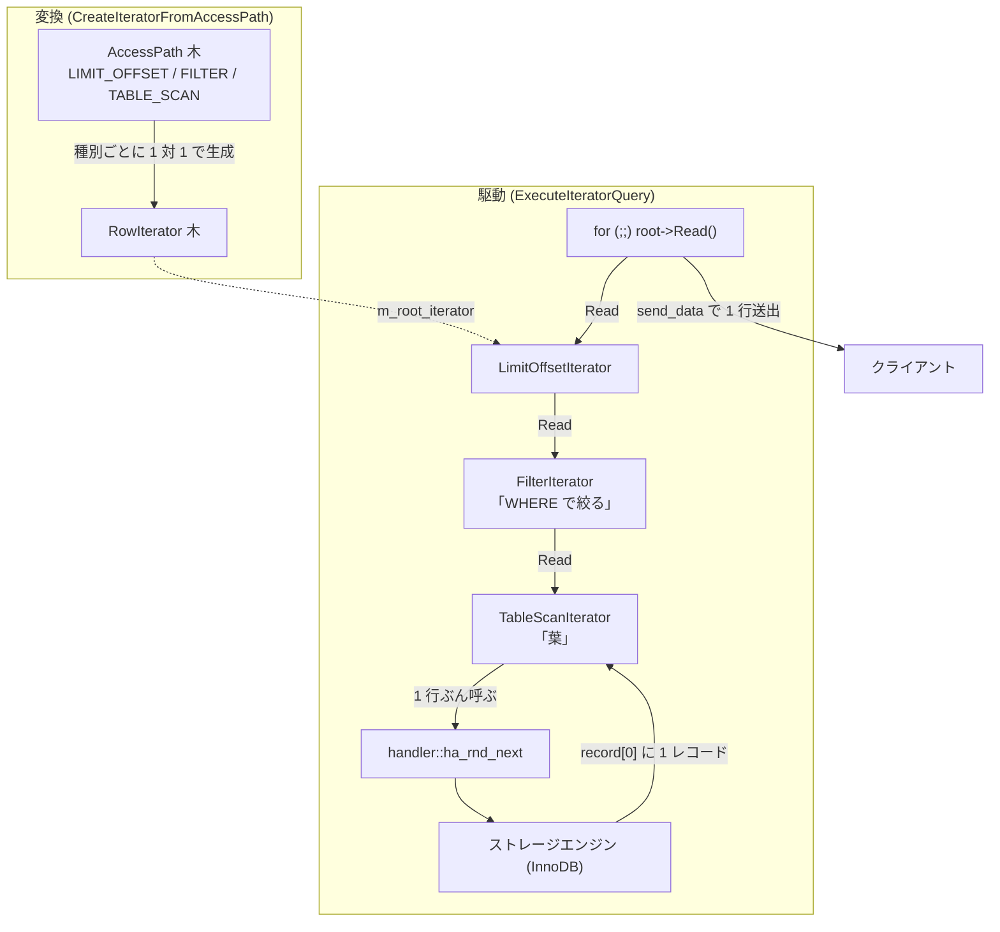

# 第13章 エグゼキュータ（イテレータ実行モデル）

> **本章で読むソース**
>
> - [`sql/iterators/row_iterator.h`](https://github.com/mysql/mysql-server/blob/mysql-8.4.10/sql/iterators/row_iterator.h)
> - [`sql/iterators/basic_row_iterators.h`](https://github.com/mysql/mysql-server/blob/mysql-8.4.10/sql/iterators/basic_row_iterators.h)
> - [`sql/iterators/basic_row_iterators.cc`](https://github.com/mysql/mysql-server/blob/mysql-8.4.10/sql/iterators/basic_row_iterators.cc)
> - [`sql/iterators/composite_iterators.cc`](https://github.com/mysql/mysql-server/blob/mysql-8.4.10/sql/iterators/composite_iterators.cc)
> - [`sql/join_optimizer/access_path.cc`](https://github.com/mysql/mysql-server/blob/mysql-8.4.10/sql/join_optimizer/access_path.cc)
> - [`sql/sql_union.cc`](https://github.com/mysql/mysql-server/blob/mysql-8.4.10/sql/sql_union.cc)

## この章の狙い

第11章までで、オプティマイザはクエリの実行手順を**アクセスパス**（`AccessPath`）の木として組み立てた。
本章は、そのアクセスパスの木を実行可能なイテレータの木へ変換し、行を1つずつ取り出してクライアントへ送るまでを読む。

MySQL 8.4 のエグゼキュータは、いわゆる **volcano モデル**を採る。
木の各ノードがイテレータであり、根のイテレータに行を1つ求めると、その要求が子へ、さらに葉へと下りていく。
葉のイテレータはストレージエンジンの `handler` を呼んで実際のレコードを引く。
この上から下へ行を引く方式を**プルモデル**と呼ぶ。
プルモデルでは、根が求めた分だけ下位が動く。
本章の最後では、この性質が `LIMIT` をどう安く実現するかを機構レベルで読む。

## 前提

第11章で読んだとおり、最適化の結果は `AccessPath` の木として表現される。
本章のコード引用はすべて GitHub タグ `mysql-8.4.10` に固定する。
イテレータが最終的に呼ぶ `handler` の各メソッド（`ha_rnd_next`、`ha_index_next` など）の実装は、ストレージエンジン側にある。
その境界の詳細は第15章で読む。

## RowIterator 抽象、Init と Read の2メソッド

実行モデルの中心にあるのが `RowIterator` という抽象クラスである。
1つのテーブルを1つのアクセス方式で読む文脈を表すが、ほぼインターフェースとして使われる。
ヘッダのコメントが、使い方を端的に示している。

[`sql/iterators/row_iterator.h L63-L80`](https://github.com/mysql/mysql-server/blob/mysql-8.4.10/sql/iterators/row_iterator.h#L63-L80)

```cpp
  A RowIterator is a simple iterator; you initialize it, and then read one
  record at a time until Read() returns EOF. A RowIterator can read from
  other Iterators if you want to, e.g., SortingIterator, which takes in records
  from another RowIterator and sorts them.

  The abstraction is not completely tight. In particular, it still leaves some
  specifics to TABLE, such as which columns to read (the read_set). This means
  it would probably be hard as-is to e.g. sort a join of two tables.

  Use by:
@code
  unique_ptr<RowIterator> iterator(new ...);
  if (iterator->Init())
    return true;
  while (iterator->Read() == 0) {
    ...
  }
@endcode
```

イテレータの契約は、2つの純粋仮想メソッドに集約される。
1つ目は `Init` であり、イテレータを初期化または再初期化する。

[`sql/iterators/row_iterator.h L94-L102`](https://github.com/mysql/mysql-server/blob/mysql-8.4.10/sql/iterators/row_iterator.h#L94-L102)

```cpp
  /**
    Initialize or reinitialize the iterator. You must always call Init()
    before trying a Read() (but Init() does not imply Read()).

    You can call Init() multiple times; subsequent calls will rewind the
    iterator (or reposition it, depending on whether the iterator takes in
    e.g. a Index_lookup) and allow you to read the records anew.
   */
  virtual bool Init() = 0;
```

`Init` は何度でも呼べる。
2回目以降の呼び出しはイテレータを巻き戻し、行を頭から読み直せるようにする。
この再初期化の安さが、後述するネストループ結合で内側を何度も回す実行を支える。

2つ目は `Read` であり、1行を読む。

[`sql/iterators/row_iterator.h L104-L116`](https://github.com/mysql/mysql-server/blob/mysql-8.4.10/sql/iterators/row_iterator.h#L104-L116)

```cpp
  /**
    Read a single row. The row data is not actually returned from the function;
    it is put in the table's (or tables', in case of a join) record buffer, ie.,
    table->records[0].

    @retval
      0   OK
    @retval
      -1   End of records
    @retval
      1   Error
   */
  virtual int Read() = 0;
```

`Read` は行のデータを戻り値で返さない。
読んだ行はテーブルのレコードバッファ `table->record[0]` に置かれ、戻り値は状態だけを表す。
0 が成功、`-1` が終端、1 がエラーである。
呼び出し側はこの戻り値だけを見てループを回し、行の中身はバッファから取る。
この約束のおかげで、上位のイテレータは1行ごとにメモリを確保することなく、固定のバッファを介して行を受け渡せる。

`RowIterator` のうち、1つの `TABLE` を直接読む種類のための共通の基底が `TableRowIterator` である。

[`sql/iterators/row_iterator.h L234-L252`](https://github.com/mysql/mysql-server/blob/mysql-8.4.10/sql/iterators/row_iterator.h#L234-L252)

```cpp
class TableRowIterator : public RowIterator {
 public:
  TableRowIterator(THD *thd, TABLE *table) : RowIterator(thd), m_table(table) {}

  void UnlockRow() override;
  void SetNullRowFlag(bool is_null_row) override;
  void StartPSIBatchMode() override;
  void EndPSIBatchModeIfStarted() override;

 protected:
  int HandleError(int error);
  void PrintError(int error);
  TABLE *table() const { return m_table; }

 private:
  TABLE *const m_table;

  friend class AlternativeIterator;
};
```

`TableRowIterator` は `m_table` を1つ保持し、エラー処理（`HandleError`）やロック解放（`UnlockRow`）といった、テーブルを読むイテレータに共通の処理をまとめる。
次節で読む基本イテレータは、いずれもこの `TableRowIterator` を継承する。

## 基本イテレータ、handler を直接呼ぶ葉

子を持たず、`handler` を直接呼んでテーブルからレコードを引くイテレータを、本書では**基本イテレータ**と呼ぶ。
これらは `basic_row_iterators.{h,cc}` に置かれ、イテレータの木の葉になる。
最も基本的なものが `TableScanIterator` であり、ヘッダがその役割を述べる。

[`sql/iterators/basic_row_iterators.h L52-L58`](https://github.com/mysql/mysql-server/blob/mysql-8.4.10/sql/iterators/basic_row_iterators.h#L52-L58)

```cpp
/**
  Scan a table from beginning to end.

  This is the most basic access method of a table using rnd_init,
  ha_rnd_next and rnd_end. No indexes are used.
*/
class TableScanIterator final : public TableRowIterator {
```

テーブルを先頭から末尾まで読むだけの、インデックスを使わない全表スキャンである。
`Init` は、`handler` のランダム読み取りを初期化する `ha_rnd_init` を呼ぶ。

[`sql/iterators/basic_row_iterators.cc L251-L273`](https://github.com/mysql/mysql-server/blob/mysql-8.4.10/sql/iterators/basic_row_iterators.cc#L251-L273)

```cpp
bool TableScanIterator::Init() {
  empty_record(table());

  /*
    Only attempt to allocate a record buffer the first time the handler is
    initialized.
  */
  const bool first_init = !table()->file->inited;

  int error = table()->file->ha_rnd_init(true);
  if (error) {
    PrintError(error);
    return true;
  }

  if (first_init && set_record_buffer(table(), m_expected_rows)) {
    return true; /* purecov: inspected */
  }

  m_stored_rows = 0;

  return false;
}
```

ここで `table()->file` が、このテーブルを担当する `handler` インスタンスである。
`Read` は、その `handler` から次のレコードを引く `ha_rnd_next` を呼ぶ。

[`sql/iterators/basic_row_iterators.cc L275-L289`](https://github.com/mysql/mysql-server/blob/mysql-8.4.10/sql/iterators/basic_row_iterators.cc#L275-L289)

```cpp
int TableScanIterator::Read() {
  int tmp;
  if (table()->is_union_or_table()) {
    while ((tmp = table()->file->ha_rnd_next(m_record))) {
      /*
       ha_rnd_next can return RECORD_DELETED for MyISAM when one thread is
       reading and another deleting without locks.
       */
      if (tmp == HA_ERR_RECORD_DELETED && !thd()->killed) continue;
      return HandleError(tmp);
    }
    if (m_examined_rows != nullptr) {
      ++*m_examined_rows;
    }
  } else {
```

`ha_rnd_next` が `m_record` にレコードを書き込み、成功なら0を返す。
末尾に達すると `handler` は `HA_ERR_END_OF_FILE` を返し、`HandleError` がそれを `RowIterator` の終端値 `-1` へ翻訳する。

[`sql/iterators/basic_row_iterators.cc L208-L221`](https://github.com/mysql/mysql-server/blob/mysql-8.4.10/sql/iterators/basic_row_iterators.cc#L208-L221)

```cpp
int TableRowIterator::HandleError(int error) {
  if (thd()->killed) {
    thd()->send_kill_message();
    return 1;
  }

  if (error == HA_ERR_END_OF_FILE || error == HA_ERR_KEY_NOT_FOUND) {
    m_table->set_no_row();
    return -1;
  } else {
    PrintError(error);
    return 1;
  }
}
```

`handler` の世界には複数のエラーコードがあるが、終端（`HA_ERR_END_OF_FILE`）とキー不発見（`HA_ERR_KEY_NOT_FOUND`）だけを `-1` へまとめ、それ以外は1（エラー）へ振り分ける。
この翻訳によって、上位のイテレータはストレージエンジン固有のエラーコードを知らずに、3値の戻り値だけで実行を進められる。

インデックスを順にたどる `IndexScanIterator` も、同じ形をとる。
`Init` は `handler` のインデックス読み取りを初期化する `ha_index_init` を呼ぶ。

[`sql/iterators/basic_row_iterators.cc L77-L96`](https://github.com/mysql/mysql-server/blob/mysql-8.4.10/sql/iterators/basic_row_iterators.cc#L77-L96)

```cpp
template <bool Reverse>
bool IndexScanIterator<Reverse>::Init() {
  if (!table()->file->inited) {
    if (table()->covering_keys.is_set(m_idx) && !table()->no_keyread) {
      table()->set_keyread(true);
    }

    int error = table()->file->ha_index_init(m_idx, m_use_order);
    if (error) {
      PrintError(error);
      return true;
    }

    if (set_record_buffer(table(), m_expected_rows)) {
      return true;
    }
  }
  m_first = true;
  return false;
}
```

`Read` は、最初の1行で `ha_index_first`、以降は `ha_index_next` を呼んで、インデックス順に次のレコードを引く。

[`sql/iterators/basic_row_iterators.cc L101-L115`](https://github.com/mysql/mysql-server/blob/mysql-8.4.10/sql/iterators/basic_row_iterators.cc#L101-L115)

```cpp
template <>
int IndexScanIterator<false>::Read() {  // Forward read.
  int error;
  if (m_first) {
    error = table()->file->ha_index_first(m_record);
    m_first = false;
  } else {
    error = table()->file->ha_index_next(m_record);
  }
  if (error) return HandleError(error);
  if (m_examined_rows != nullptr) {
    ++*m_examined_rows;
  }
  return 0;
}
```

`TableScanIterator` が `ha_rnd_*` を、`IndexScanIterator` が `ha_index_*` を呼ぶという違いはあるが、両者の構造は同じである。
`Init` でアクセス方式に応じた `handler` のカーソルを開き、`Read` のたびにカーソルを1つ進めてレコードバッファを満たす。
オプティマイザがどちらのアクセス方式を選んでも、上位のイテレータから見た `Init` と `Read` の契約は変わらない。

`basic_row_iterators.{h,cc}` には、このほかにも単一行を返す `FakeSingleRowIterator`、出力ゼロ行の `ZeroRowsIterator`、ソート済み参照を読み戻す各種 `Sort*Iterator` など、子を持たない葉のイテレータがまとまっている。

## アクセスパスからイテレータの木を組む、CreateIteratorFromAccessPath

最適化で組み上がった `AccessPath` の木を、実行可能な `RowIterator` の木へ変換するのが `CreateIteratorFromAccessPath` である。

[`sql/join_optimizer/access_path.cc L488-L495`](https://github.com/mysql/mysql-server/blob/mysql-8.4.10/sql/join_optimizer/access_path.cc#L488-L495)

```cpp
unique_ptr_destroy_only<RowIterator> CreateIteratorFromAccessPath(
    THD *thd, MEM_ROOT *mem_root, AccessPath *top_path, JOIN *top_join,
    bool top_eligible_for_batch_mode) {
  assert(IteratorsAreNeeded(thd, top_path));

  unique_ptr_destroy_only<RowIterator> ret;
  Mem_root_array<IteratorToBeCreated> todo(mem_root);
  todo.push_back({top_path, top_join, top_eligible_for_batch_mode, &ret, {}});
```

この関数は、アクセスパスの種別ごとに対応するイテレータを生成する。
種別による分岐を見ると、アクセスパスとイテレータが1対1に対応していることがわかる。

[`sql/join_optimizer/access_path.cc L531-L550`](https://github.com/mysql/mysql-server/blob/mysql-8.4.10/sql/join_optimizer/access_path.cc#L531-L550)

```cpp
    switch (path->type) {
      case AccessPath::TABLE_SCAN: {
        const auto &param = path->table_scan();
        iterator = NewIterator<TableScanIterator>(
            thd, mem_root, param.table, path->num_output_rows(), examined_rows);
        break;
      }
      case AccessPath::INDEX_SCAN: {
        const auto &param = path->index_scan();
        if (param.reverse) {
          iterator = NewIterator<IndexScanIterator<true>>(
              thd, mem_root, param.table, param.idx, param.use_order,
              path->num_output_rows(), examined_rows);
        } else {
          iterator = NewIterator<IndexScanIterator<false>>(
              thd, mem_root, param.table, param.idx, param.use_order,
              path->num_output_rows(), examined_rows);
        }
        break;
      }
```

`TABLE_SCAN` というアクセスパスからは `TableScanIterator` が、`INDEX_SCAN` からは `IndexScanIterator` が生成される。
`param.reverse` が真なら逆順の `IndexScanIterator<true>` を選ぶように、アクセスパスに記録された方向や使用インデックスがそのままイテレータの構築引数になる。

この変換で1つ工夫されているのは、木を再帰でたどらないことである。
アクセスパスの木は深くなりうるため、関数の再帰でたどるとスタックを大きく消費する。
そこで `CreateIteratorFromAccessPath` は、処理すべきノードを `todo` という `MEM_ROOT` 上のスタックに積み、明示的なループでたどる。

[`sql/join_optimizer/access_path.cc L497-L512`](https://github.com/mysql/mysql-server/blob/mysql-8.4.10/sql/join_optimizer/access_path.cc#L497-L512)

```cpp
  // The access path trees can be pretty deep, and the stack frames can be big
  // on certain compilers/setups, so instead of explicit recursion, we push jobs
  // onto a MEM_ROOT-backed stack. This uses a little more RAM (the MEM_ROOT
  // typically lives to the end of the query), but reduces the stack usage
  // greatly.
  //
  // The general rule is that if an iterator requires any children, it will push
  // jobs for their access paths at the end of the stack and then re-push
  // itself. When the children are instantiated and we get back to the original
  // iterator, we'll actually instantiate it. (We distinguish between the two
  // cases on basis of whether job.children has been allocated or not; the child
  // iterator's destination will point into this array. The child list needs
  // to be allocated in a way that doesn't move around if the TODO job list
  // is reallocated, which we do by means of allocating it directly on the
  // MEM_ROOT.)
  while (!todo.empty()) {
```

子を持つイテレータは、まず子のアクセスパスをスタックに積み、自身を再びスタックへ積み直す。
子が生成され終わってから、自身が生成される。
ヒープ上のスタックを使うことで、木の深さに比例して関数呼び出しのスタックが伸びるのを避け、深い木でもスタックを使い切らずに変換できる。

単一テーブルを読むときの入口が `init_table_iterator` であり、アクセスパスを作ってから `CreateIteratorFromAccessPath` を呼び、できたイテレータを `Init` するところまでを行う。

[`sql/sql_executor.cc L4878-L4888`](https://github.com/mysql/mysql-server/blob/mysql-8.4.10/sql/sql_executor.cc#L4878-L4888)

```cpp
  } else {
    AccessPath *path = create_table_access_path(
        thd, table, range_scan, table_ref, position, count_examined_rows);
    iterator = CreateIteratorFromAccessPath(thd, path,
                                            /*join=*/nullptr,
                                            /*eligible_for_batch_mode=*/false);
  }
  if (iterator->Init()) {
    return nullptr;
  }
  return iterator;
```

## 木を駆動して行を送る、ExecuteIteratorQuery

組み上がったイテレータの木を回し、結果行をクライアントへ送るのが `Query_expression::ExecuteIteratorQuery` である。
第2章で見た `unit->execute` は、最終的にこの関数へ至る。

行を送る前に、まず結果セットのメタデータ（列の名前や型）をクライアントへ送る。

[`sql/sql_union.cc L1704-L1715`](https://github.com/mysql/mysql-server/blob/mysql-8.4.10/sql/sql_union.cc#L1704-L1715)

```cpp
  mem_root_deque<Item *> *fields = get_field_list();
  Query_result *query_result = this->query_result();
  assert(query_result != nullptr);

  if (query_result->start_execution(thd)) return true;

  if (query_result->send_result_set_metadata(
          thd, *fields, Protocol::SEND_NUM_ROWS | Protocol::SEND_EOF)) {
    return true;
  }

  set_executed();
```

メタデータを送ったら、根のイテレータ `m_root_iterator` を `Init` し、`Read` のループに入る。
これがプルモデルの本体である。

[`sql/sql_union.cc L1783-L1812`](https://github.com/mysql/mysql-server/blob/mysql-8.4.10/sql/sql_union.cc#L1783-L1812)

```cpp
    if (m_root_iterator->Init()) {
      return true;
    }

    PFSBatchMode pfs_batch_mode(m_root_iterator.get());

    for (;;) {
      int error = m_root_iterator->Read();
      DBUG_EXECUTE_IF("bug13822652_1", thd->killed = THD::KILL_QUERY;);

      if (error > 0 || thd->is_error())  // Fatal error
        return true;
      else if (error < 0)
        break;
      else if (thd->killed)  // Aborted by user
      {
        thd->send_kill_message();
        return true;
      }

      ++*send_records_ptr;

      if (query_result->send_data(thd, *fields)) {
        return true;
      }
      thd->get_stmt_da()->inc_current_row_for_condition();

      DBUG_EXECUTE_IF("simulate_partial_result_set_scenario",
                      my_error(ER_UNKNOWN_ERROR, MYF(0)););
    }
```

ループは根の `Read` を呼び続ける。
戻り値が0なら1行得られたので、`send_data` でその行をクライアントへ送る。
戻り値が `-1`（終端）ならループを抜け、正の値（エラー）なら中断する。
根の `Read` 1回が、木を下って葉の `handler` 呼び出しまで波及し、1行ぶんのレコードバッファを満たして戻ってくる。

ループを抜けたら、最後に終端を表す EOF パケットを送る。

[`sql/sql_union.cc L1818-L1821`](https://github.com/mysql/mysql-server/blob/mysql-8.4.10/sql/sql_union.cc#L1818-L1821)

```cpp
  thd->current_found_rows = *send_records_ptr;

  return query_result->send_eof(thd);
}
```

`FilterIterator` を見ると、子を持つイテレータが `Read` をどう中継するかがわかる。

[`sql/iterators/composite_iterators.cc L91-L114`](https://github.com/mysql/mysql-server/blob/mysql-8.4.10/sql/iterators/composite_iterators.cc#L91-L114)

```cpp
int FilterIterator::Read() {
  for (;;) {
    int err = m_source->Read();
    if (err != 0) return err;

    bool matched = m_condition->val_int();

    if (thd()->killed) {
      thd()->send_kill_message();
      return 1;
    }

    /* check for errors evaluating the condition */
    if (thd()->is_error()) return 1;

    if (!matched) {
      m_source->UnlockRow();
      continue;
    }

    // Successful row.
    return 0;
  }
}
```

`FilterIterator` は自分の `Read` のなかで子（`m_source`）の `Read` を呼ぶ。
`WHERE` 条件に合わない行は捨てて子をもう一度読み、合う行が出るまで子を回す。
このように、各イテレータが子の `Read` を呼ぶことで、根への1回の要求が木全体へ伝わる。

## イテレータツリーとプル反復の全体像

ここまでの流れを1枚に整理する。
オプティマイザが作った `AccessPath` の木を `CreateIteratorFromAccessPath` がイテレータの木へ写し、`ExecuteIteratorQuery` が根の `Read` を繰り返し呼ぶ。
根の1回の `Read` が木を下り、葉の基本イテレータが `handler` を1回呼んで1行を持ち帰る。



## 高速化の工夫、プルモデルが LIMIT を必要分だけに抑える

プルモデルの利点が最もはっきり現れるのが `LIMIT` である。
`LIMIT n` は、結果の上位 `n` 行だけを返す句であり、`LimitOffsetIterator` として木に挿し込まれる。
このイテレータの `Read` を読むと、上限に達した瞬間に子を読むのをやめることがわかる。

[`sql/iterators/composite_iterators.cc L130-L190`](https://github.com/mysql/mysql-server/blob/mysql-8.4.10/sql/iterators/composite_iterators.cc#L130-L190)

```cpp
int LimitOffsetIterator::Read() {
  if (m_seen_rows >= m_limit) {
    // We either have hit our LIMIT, or we need to skip OFFSET rows.
    // Check which one.
    if (m_needs_offset) {
      // ... (中略) ...
      m_seen_rows = m_offset;
      m_needs_offset = false;

      // Fall through to LIMIT testing.
    }

    if (m_seen_rows >= m_limit) {
      // We really hit LIMIT (or hit LIMIT immediately after OFFSET finished),
      // so EOF.
      if (m_count_all_rows) {
        // Count rows until the end or error (ignore the error if any).
        while (m_source->Read() == 0) {
          ++*m_skipped_rows;
        }
      }
      return -1;
    }
  }

  const int result = m_source->Read();
  if (m_reject_multiple_rows) {
    if (result != 0) {
      ++m_seen_rows;
      return result;
    }
    // We read a row. Check for scalar subquery cardinality violation
    if (m_seen_rows - m_offset > 0) {
      my_error(ER_SUBQUERY_NO_1_ROW, MYF(0));
      return 1;
    }
  }

  ++m_seen_rows;
  return result;
}
```

要点は、見た行数 `m_seen_rows` が上限 `m_limit` に達したら、子の `Read` を呼ばずに即座に `-1`（終端）を返すところである。
`-1` を受け取った親、そして根の駆動ループは、そこで `Read` のループを終える。
子が呼ばれなくなるということは、その下にある `TableScanIterator` や `IndexScanIterator` も呼ばれなくなり、葉の `handler` 呼び出しも止まる。

このため、`LIMIT 10` のクエリは、テーブルに100万行あっても、根が11回目の `Read` で終端を返した時点でスキャンを止められる。
`handler` を通じてストレージエンジンが読むレコードは、上位が求めた分にほぼ限られる。
プッシュ型（下位が全行を上位へ押し上げる方式）であれば、上限を超えた行も一度は生成されてしまうが、プルモデルでは上位の要求が下位の仕事量をそのまま制御する。
`LIMIT` を安く実現する仕組みは、専用の最適化というより、行を上から引くという実行モデルそのものから生まれている。

なお `m_count_all_rows` が真のとき（`SQL_CALC_FOUND_ROWS` 指定時）だけは、上限到達後も残りを数えるために子を最後まで読む。
このときは行数を数える目的があるため、プルモデルの早期停止はあえて働かせない。

## まとめ

MySQL 8.4 のエグゼキュータは volcano モデルのプルモデルである。
実行の単位は `RowIterator` であり、`Init` で初期化し、`Read` で1行ずつ引く2メソッドに契約が集約される。
`Read` は行をレコードバッファ `table->record[0]` に置き、戻り値（0、`-1`、1）で状態だけを返す。
子を持たない基本イテレータ（`TableScanIterator`、`IndexScanIterator`）は、`Init` で `handler` のカーソルを開き、`Read` のたびに `ha_rnd_next` や `ha_index_next` を呼んでレコードを引く。
オプティマイザが作った `AccessPath` の木は `CreateIteratorFromAccessPath` がイテレータの木へ写し、その変換は深い木でもスタックを使い切らないよう、再帰ではなく `MEM_ROOT` 上の明示スタックでたどる。
`ExecuteIteratorQuery` が根の `Read` を繰り返し、得た行を `send_data` でクライアントへ送る。
プルモデルでは上位の要求が下位の仕事量を決めるため、`LIMIT` は上限到達時に子を読むのをやめるだけで、必要な分しか `handler` を回さずに済む。

## 関連する章

- [第11章 オプティマイザ（アクセスパスと range optimizer）](11-optimizer-access-paths.md)
- [第14章 エグゼキュータ（結合、ソート、集約）](14-executor-join-sort-agg.md)
- [第15章 ハンドラ API とストレージエンジンプラグイン](15-handler-api.md)
- [第2章 ソースツリーとビルド、クエリ処理の俯瞰](../part00-introduction/02-source-tree-and-build.md)
- [第8章 式評価（Item の実行時モデル）](08-expression-evaluation.md)
