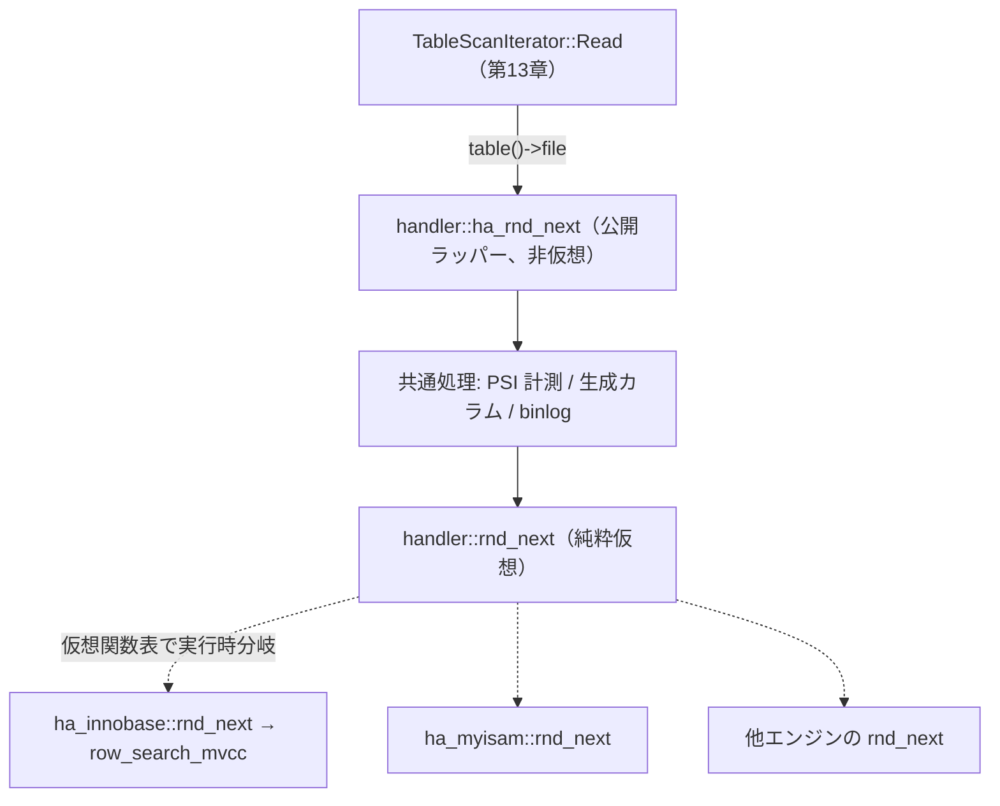

# 第15章 ハンドラ API とストレージエンジンプラグイン

> **本章で読むソース**
>
> - [`sql/handler.h`](https://github.com/mysql/mysql-server/blob/mysql-8.4.10/sql/handler.h)
> - [`sql/handler.cc`](https://github.com/mysql/mysql-server/blob/mysql-8.4.10/sql/handler.cc)
> - [`sql/iterators/basic_row_iterators.cc`](https://github.com/mysql/mysql-server/blob/mysql-8.4.10/sql/iterators/basic_row_iterators.cc)
> - [`storage/innobase/handler/ha_innodb.cc`](https://github.com/mysql/mysql-server/blob/mysql-8.4.10/storage/innobase/handler/ha_innodb.cc)

## この章の狙い

第13章と第14章で読んだエグゼキュータは、行を1件ずつ取り出して結合やソートに流すイテレータの連なりだった。
そのイテレータは、行が物理的にどう格納されているかを一切知らない。
テーブルが InnoDB のクラスタ化インデックスにあろうと、MyISAM の `.MYD` ファイルにあろうと、エグゼキュータは同じ呼び出しで次の1行を受け取る。
この一様化を担うのが、本章で読む `handler` 抽象である。

`handler` は、テーブル走査、インデックス検索、行の書き込みといった操作を仮想関数の集合として定義したクラスである。
ストレージエンジンは、このクラスを継承し、自分の格納方式に合わせて各メソッドを実装する。
SQL 層は基底クラスのポインタ越しに呼ぶだけで、どのエンジンが実体かを意識しない。
本章では、この `handler` クラス（`sql/handler.h`）の主要メソッドと、エンジン単位の関数表である `handlerton`、そしてプラグインとしてエンジンを登録する `ha_initialize_handlerton`（`sql/handler.cc`）を読む。
最後に、InnoDB の実装 `ha_innobase`（`storage/innobase/handler/ha_innodb.cc`）が各メソッドをどう埋めるかを2例だけ示し、内部の詳細は第2部以降へ送る。

## 前提

第13章で、エグゼキュータがイテレータの `Read` を連鎖的に呼んで行を1件ずつ引き出すモデルを読んだ。
本章はその `Read` の底で何が起きているかをたどる。
テーブルから実際に行を取り出すイテレータは、最終的に本章で読む `handler` のメソッドを呼ぶ。

`handler` が返す行は、SQL 層が定める1つの内部表現に変換済みである。
各エンジンは自分のページ形式やレコード形式から、この共通表現（`TABLE` の `record[0]` バッファ）へ詰め替えてから返す。
本章はこの変換の入口までを扱い、InnoDB の行フォーマットそのものは第19章で読む。

## 二層の抽象、handler と handlerton

MySQL のストレージエンジン抽象は、粒度の異なる2つの構造に分かれている。
1つは開いているテーブル1つにつき1個生成される `handler` オブジェクト、もう1つはエンジン1種類につき1個だけ存在する `handlerton` である。
`handlerton` のドキュメントコメントが、この役割分担をそのまま述べている。

[`sql/handler.h` L2723-2733](https://github.com/mysql/mysql-server/blob/mysql-8.4.10/sql/handler.h#L2723-L2733)

```cpp
/**
  handlerton is a singleton structure - one instance per storage engine -
  to provide access to storage engine functionality that works on the
  "global" level (unlike handler class that works on a per-table basis).

  usually handlerton instance is defined statically in ha_xxx.cc as

  static handlerton { ... } xxx_hton;

  savepoint_*, prepare, recover, and *_by_xid pointers can be 0.
*/
```

`handlerton` は、テーブルをまたぐ「グローバルな」操作の関数ポインタを並べた表である。
コミットやロールバック、セーブポイント、XA リカバリ、そして「このエンジンのテーブル用 `handler` を1つ作る」関数などが、すべてここに登録される。
構造体の先頭には、エンジンを識別する `db_type` と、接続ごとのエンジン固有データを引くための `slot` が置かれている。

[`sql/handler.h` L2734-2754](https://github.com/mysql/mysql-server/blob/mysql-8.4.10/sql/handler.h#L2734-L2754)

```cpp
struct handlerton {
  /**
    Historical marker for if the engine is available or not.
  */
  SHOW_COMP_OPTION state;

  /**
    Historical number used for frm file to determine the correct storage engine.
    This is going away and new engines will just use "name" for this.
  */
  enum legacy_db_type db_type;
  /**
    Each storage engine has it's own memory area (actually a pointer)
    in the thd, for storing per-connection information.
    It is accessed as

      thd->ha_data[xxx_hton.slot]

     slot number is initialized by MySQL after xxx_init() is called.
   */
  uint slot;
```

この表の中で、テーブル単位の `handler` を生み出す入口が `create` メンバである。

[`sql/handler.h` L2785](https://github.com/mysql/mysql-server/blob/mysql-8.4.10/sql/handler.h#L2785-L2785)

```cpp
  create_t create;
```

`create_t` の型は、`handlerton` と `TABLE_SHARE`、パーティション有無、メモリルートを受け取り、`handler` のポインタを返す関数ポインタである。

[`sql/handler.h` L1488-1489](https://github.com/mysql/mysql-server/blob/mysql-8.4.10/sql/handler.h#L1488-L1489)

```cpp
typedef handler *(*create_t)(handlerton *hton, TABLE_SHARE *table,
                             bool partitioned, MEM_ROOT *mem_root);
```

SQL 層がテーブルを開くとき、そのテーブルが属するエンジンの `handlerton::create` を呼べば、対応する `handler` のインスタンスが得られる。
`handler` のほうは、開いているテーブルを表現するオブジェクトであり、対象の `TABLE`、`TABLE_SHARE`、そして自分が属する `handlerton` へのポインタ `ht` を保持する。

[`sql/handler.h` L4571-4585](https://github.com/mysql/mysql-server/blob/mysql-8.4.10/sql/handler.h#L4571-L4585)

```cpp
class handler {
  friend class Partition_handler;

 public:
  typedef ulonglong Table_flags;

 protected:
  TABLE_SHARE *table_share;          /* The table definition */
  TABLE *table;                      /* The current open table */
  Table_flags cached_table_flags{0}; /* Set on init() and open() */

  ha_rows estimation_rows_to_insert;

 public:
  handlerton *ht; /* storage engine of this handler */
```

ここまでで、エンジン1つにつき関数表 `handlerton` が1個、開いているテーブル1つにつき `handler` が1個という対応が見えた。
次に、`handler` がどんな操作を仮想関数として公開しているかを読む。

## handler の主要メソッド、走査、検索、書き込み

`handler` の仮想メソッドは、大きく3種類に分かれる。
テーブル全体を順に読むフルスキャン、インデックスをキーで引くインデックス走査、そして行を変更する書き込みである。
いずれも純粋仮想か、既定で `HA_ERR_WRONG_COMMAND` を返す仮想関数として宣言されており、エンジンは必要なものだけを上書きする。

フルスキャンは、走査を準備する `rnd_init` と、次の1行を読む `rnd_next` の対で表される。
どちらも純粋仮想であり、すべてのエンジンが実装しなければならない。

[`sql/handler.h` L6679](https://github.com/mysql/mysql-server/blob/mysql-8.4.10/sql/handler.h#L6679-L6679)

```cpp
  virtual int rnd_init(bool scan) = 0;
```

インデックス走査は、使うインデックスを選ぶ `index_init`、キーで位置づける `index_read`、そして昇順に次へ進む `index_next` などからなる。
`index_read` はキー値とその長さ、検索方向（完全一致、以上、以下など）を受け取り、条件に合う最初の行へカーソルを置く。
基底クラスの既定実装は「この操作は使えない」を返すだけで、インデックスを持つエンジンが上書きする。

[`sql/handler.h` L6878-6883](https://github.com/mysql/mysql-server/blob/mysql-8.4.10/sql/handler.h#L6878-L6883)

```cpp
  virtual int index_read(uchar *buf [[maybe_unused]],
                         const uchar *key [[maybe_unused]],
                         uint key_len [[maybe_unused]],
                         enum ha_rkey_function find_flag [[maybe_unused]]) {
    return HA_ERR_WRONG_COMMAND;
  }
```

書き込みは `write_row`、`update_row`、`delete_row` の3つである。
`write_row` は1行を挿入する。
引数 `buf` は SQL 層の内部表現（通常は `record[0]`）であり、エンジンはここから自分の格納形式へ詰め替えて永続化する。

[`sql/handler.h` L6702-6704](https://github.com/mysql/mysql-server/blob/mysql-8.4.10/sql/handler.h#L6702-L6704)

```cpp
  virtual int write_row(uchar *buf [[maybe_unused]]) {
    return HA_ERR_WRONG_COMMAND;
  }
```

これらの仮想メソッドは、エンジンに実装させるための内向きのインターフェイスである。
SQL 層がエンジンを呼ぶときは、これらを直接呼ばない。
仮想メソッドを1枚かぶせた公開ラッパー（`ha_` 接頭辞のついた非仮想メソッド）を経由する。
基底クラスのコメントが、この二重化を明言している。

[`sql/handler.h` L4918-4934](https://github.com/mysql/mysql-server/blob/mysql-8.4.10/sql/handler.h#L4918-L4934)

```cpp
  /**
    These functions represent the public interface to *users* of the
    handler class, hence they are *not* virtual. For the inheritance
    interface, see the (private) functions write_row(), update_row(),
    and delete_row() below.
  */
  int ha_external_lock(THD *thd, int lock_type);
  int ha_write_row(uchar *buf);
  /**
    Update the current row.

    @param old_data  the old contents of the row
    @param new_data  the new contents of the row
    @return error status (zero on success, HA_ERR_* error code on error)
  */
  int ha_update_row(const uchar *old_data, uchar *new_data);
  int ha_delete_row(const uchar *buf);
```

公開ラッパーと仮想実装を分けるのは、本章で説明する最適化の工夫の核にあたる。
理由は次の節で読む。

## ラッパーが共通処理を引き受ける

公開ラッパー `ha_rnd_next` の本体を読むと、仮想 `rnd_next` を呼ぶ前後に、エンジンに依存しない共通処理が挟まっていることがわかる。

[`sql/handler.cc` L2996-3014](https://github.com/mysql/mysql-server/blob/mysql-8.4.10/sql/handler.cc#L2996-L3014)

```cpp
int handler::ha_rnd_next(uchar *buf) {
  int result;
  DBUG_EXECUTE_IF("ha_rnd_next_deadlock", return HA_ERR_LOCK_DEADLOCK;);
  DBUG_TRACE;
  assert(table_share->tmp_table != NO_TMP_TABLE || m_lock_type != F_UNLCK);
  assert(inited == RND);

  // Set status for the need to update generated fields
  m_update_generated_read_fields = table->has_gcol();

  MYSQL_TABLE_IO_WAIT(PSI_TABLE_FETCH_ROW, MAX_KEY, result,
                      { result = rnd_next(buf); })
  if (!result && m_update_generated_read_fields) {
    result = update_generated_read_fields(buf, table);
    m_update_generated_read_fields = false;
  }
  table->set_row_status_from_handler(result);
  return result;
}
```

エンジン固有の動作は `MYSQL_TABLE_IO_WAIT` の中の `rnd_next(buf)` だけである。
その外側にある処理、すなわち Performance Schema への所要時間計測、生成カラムの再計算、行ステータスの記録は、どのエンジンでも同じであり、ラッパー側に一度だけ書いてある。
この配置によって、各エンジンは自分の格納方式に固有のコードだけを書けばよく、計測や生成カラムの面倒を見る必要がない。

書き込みのラッパー `ha_write_row` では、この共通化がさらにはっきりする。

[`sql/handler.cc` L8081-8107](https://github.com/mysql/mysql-server/blob/mysql-8.4.10/sql/handler.cc#L8081-L8107)

```cpp
int handler::ha_write_row(uchar *buf) {
  int error;
  Log_func *log_func = Write_rows_log_event::binlog_row_logging_function;
  assert(table_share->tmp_table != NO_TMP_TABLE || m_lock_type == F_WRLCK);

  DBUG_TRACE;
  DBUG_EXECUTE_IF("inject_error_ha_write_row", return HA_ERR_INTERNAL_ERROR;);
  DBUG_EXECUTE_IF("simulate_storage_engine_out_of_memory",
                  return HA_ERR_SE_OUT_OF_MEMORY;);
  mark_trx_read_write();

  DBUG_EXECUTE_IF(
      "handler_crashed_table_on_usage",
      my_error(HA_ERR_CRASHED, MYF(ME_ERRORLOG), table_share->table_name.str);
      set_my_errno(HA_ERR_CRASHED); return HA_ERR_CRASHED;);

  MYSQL_TABLE_IO_WAIT(PSI_TABLE_WRITE_ROW, MAX_KEY, error,
                      { error = write_row(buf); })

  if (unlikely(error)) return error;

  if (unlikely((error = binlog_log_row(table, nullptr, buf, log_func))))
    return error; /* purecov: inspected */

  DEBUG_SYNC_C("ha_write_row_end");
  return 0;
}
```

ここではエンジンの `write_row` が成功したあと、ラッパーが行イメージをバイナリログ（binlog）へ書く `binlog_log_row` を呼ぶ。
レプリケーション用の行ログ取得は、エンジンの実装とは独立した SQL 層の責務であり、すべてのエンジンに共通する。
この処理をラッパーに集約することで、エンジン側は自分のテーブルへ行を1件書く仕事に集中でき、レプリケーションへの配慮を各エンジンへ重複させずに済む。

公開ラッパーと仮想実装を分けるこの設計は、**Non-Virtual Interface**（公開非仮想、実装は private 仮想）の形になっている。
共通の前処理と後処理を基底クラスに固定し、変わる部分だけを仮想関数に切り出すことで、計測やレプリケーションの一貫性をエンジンの実装に依存させない。
これが、格納方式をまたいで SQL 層を一様に保つための機構である。

## エグゼキュータから handler への呼び出し

第13章で読んだイテレータは、この公開ラッパーを呼ぶ。
テーブルをフルスキャンする `TableScanIterator::Read` の本体を見ると、`table()->file`、すなわちその `TABLE` に結びついた `handler` の `ha_rnd_next` を回しているだけである。

[`sql/iterators/basic_row_iterators.cc` L275-285](https://github.com/mysql/mysql-server/blob/mysql-8.4.10/sql/iterators/basic_row_iterators.cc#L275-L285)

```cpp
int TableScanIterator::Read() {
  int tmp;
  if (table()->is_union_or_table()) {
    while ((tmp = table()->file->ha_rnd_next(m_record))) {
      /*
       ha_rnd_next can return RECORD_DELETED for MyISAM when one thread is
       reading and another deleting without locks.
       */
      if (tmp == HA_ERR_RECORD_DELETED && !thd()->killed) continue;
      return HandleError(tmp);
    }
```

`table()->file` の静的な型は基底クラス `handler*` である。
そこに格納されている実体が `ha_innobase` か別エンジンの `handler` かは、コンパイル時にはわからない。
`ha_rnd_next` の中の `rnd_next(buf)` が仮想呼び出しなので、実行時に実体のメソッドへ振り分けられる。
イテレータは1行を受け取るたびに同じ式を書くだけで、格納方式の違いは仮想関数表が吸収する。

この関係を図にすると次のようになる。
エグゼキュータのイテレータが公開ラッパーを呼び、ラッパーが共通処理を挟んでから仮想メソッドを呼び、仮想メソッドが実行時に各エンジンの実装へ分岐する。



図の破線が、実行時に実体へ分岐する仮想呼び出しである。
SQL 層は実線の経路だけを知っていればよく、破線の先がどのエンジンかを意識しない。

## エンジンをプラグインとして登録する

エンジンの `handler` を作る `create` 関数や、コミットなどの `handlerton` メンバは、いつ誰が埋めるのか。
これを担うのが、プラグイン初期化の入口 `ha_initialize_handlerton` である。

[`sql/handler.cc` L775-795](https://github.com/mysql/mysql-server/blob/mysql-8.4.10/sql/handler.cc#L775-L795)

```cpp
int ha_initialize_handlerton(st_plugin_int *plugin) {
  handlerton *hton;
  DBUG_TRACE;
  DBUG_PRINT("plugin", ("initialize plugin: '%s'", plugin->name.str));

  hton = static_cast<handlerton *>(my_malloc(key_memory_handlerton_objects,
                                             sizeof(handlerton),
                                             MYF(MY_WME | MY_ZEROFILL)));

  if (hton == nullptr) {
    LogErr(ERROR_LEVEL, ER_HANDLERTON_OOM, plugin->name.str);
    goto err_no_hton_memory;
  }

  hton->slot = HA_SLOT_UNDEF;
  /* Historical Requirement */
  plugin->data = hton;  // shortcut for the future
  if (plugin->plugin->init && plugin->plugin->init(hton)) {
    LogErr(ERROR_LEVEL, ER_PLUGIN_INIT_FAILED, plugin->name.str);
    goto err;
  }
```

SQL 層は、ゼロ初期化した `handlerton` を1つ確保し、それを引数にしてプラグインの初期化関数 `plugin->plugin->init(hton)` を呼ぶ。
つまり SQL 層は空の関数表を渡すだけで、その中身を埋めるのはエンジン自身である。
初期化が成功すると、`ha_initialize_handlerton` は続けて空きスロットを探して `slot` を割り当て、`db_type` の重複を解消し、エンジンを登録済みの表に加える（本章では省略するが、同関数の後半で行う）。

この「空の表を渡して埋めてもらう」呼び出しは、エンジンを動的にプラグインとして差し込めるようにするための要である。
SQL 層はエンジンの型を1つも知らないまま、関数ポインタ越しにエンジンの機能へ到達できる。

## InnoDB の実装、handlerton を埋める

InnoDB の初期化関数 `innodb_init` は、まさに前節で読んだ「空の `handlerton` を埋める」処理である。
渡された `handlerton` ポインタの各メンバへ、InnoDB の関数を次々と代入していく。

[`storage/innobase/handler/ha_innodb.cc` L5411-5440](https://github.com/mysql/mysql-server/blob/mysql-8.4.10/storage/innobase/handler/ha_innodb.cc#L5411-L5440)

```cpp
static int innodb_init(void *p) {
  DBUG_TRACE;

  acquire_plugin_services();

  handlerton *innobase_hton = (handlerton *)p;
  innodb_hton_ptr = innobase_hton;

  innobase_hton->state = SHOW_OPTION_YES;
  innobase_hton->db_type = DB_TYPE_INNODB;
  innobase_hton->savepoint_offset = sizeof(trx_named_savept_t);
  innobase_hton->close_connection = innobase_close_connection;
  innobase_hton->kill_connection = innobase_kill_connection;
  innobase_hton->savepoint_set = innobase_savepoint;
  innobase_hton->savepoint_rollback = innobase_rollback_to_savepoint;

  innobase_hton->savepoint_rollback_can_release_mdl =
      innobase_rollback_to_savepoint_can_release_mdl;

  innobase_hton->savepoint_release = innobase_release_savepoint;
  innobase_hton->commit = innobase_commit;
  innobase_hton->rollback = innobase_rollback;
  innobase_hton->prepare = innobase_xa_prepare;
  innobase_hton->recover = innobase_xa_recover;
  innobase_hton->recover_prepared_in_tc = innobase_xa_recover_prepared_in_tc;
  innobase_hton->commit_by_xid = innobase_commit_by_xid;
  innobase_hton->rollback_by_xid = innobase_rollback_by_xid;
  innobase_hton->set_prepared_in_tc = innobase_set_prepared_in_tc;
  innobase_hton->set_prepared_in_tc_by_xid = innobase_set_prepared_in_tc_by_xid;
  innobase_hton->create = innobase_create_handler;
```

最後の `innobase_hton->create = innobase_create_handler` が、テーブル単位の `handler` を作る関数の登録である。
`innobase_create_handler` は、パーティションの有無に応じて `ha_innopart` か `ha_innobase` のインスタンスを `new` で生成して返す。

[`storage/innobase/handler/ha_innodb.cc` L1743-1755](https://github.com/mysql/mysql-server/blob/mysql-8.4.10/storage/innobase/handler/ha_innodb.cc#L1743-L1755)

```cpp
static handler *innobase_create_handler(handlerton *hton, TABLE_SHARE *table,
                                        bool partitioned, MEM_ROOT *mem_root) {
  if (partitioned) {
    ha_innopart *file = new (mem_root) ha_innopart(hton, table);
    if (file && file->init_partitioning(mem_root)) {
      ::destroy_at(file);
      return (nullptr);
    }
    return (file);
  }

  return (new (mem_root) ha_innobase(hton, table));
}
```

`ha_innobase` は `handler` を継承するクラスであり、ここで生成された実体が、前の節の図でいう「仮想関数表が指す先」になる。
この `innodb_init` 自体は、InnoDB をプラグインとして宣言する `mysql_declare_plugin` マクロから参照される。

[`storage/innobase/handler/ha_innodb.cc` L23655-23662](https://github.com/mysql/mysql-server/blob/mysql-8.4.10/storage/innobase/handler/ha_innodb.cc#L23655-L23662)

```cpp
mysql_declare_plugin(innobase){
    MYSQL_STORAGE_ENGINE_PLUGIN,
    &innobase_storage_engine,
    innobase_hton_name,
    PLUGIN_AUTHOR_ORACLE,
    "Supports transactions, row-level locking, and foreign keys",
    PLUGIN_LICENSE_GPL,
    innodb_init,   /* Plugin Init */
```

プラグイン記述子の Plugin Init 欄に `innodb_init` が登録されている。
サーバはプラグインをロードするとき `ha_initialize_handlerton` からこの `innodb_init` を呼び、InnoDB の関数表が完成する。

## InnoDB の実装、仮想メソッドを埋める

`handler` の仮想メソッドのほうも、`ha_innobase` が自分の格納方式に合わせて埋める。
行を挿入する `write_row` の実装は、InnoDB のトランザクション `trx_t` を取り出し、内部のレコード形式へ詰め替える長い処理だが、入口は次のようになっている。

[`storage/innobase/handler/ha_innodb.cc` L9243-9258](https://github.com/mysql/mysql-server/blob/mysql-8.4.10/storage/innobase/handler/ha_innodb.cc#L9243-L9258)

```cpp
int ha_innobase::write_row(uchar *record) /*!< in: a row in MySQL format */
{
  dberr_t error;
  int error_result = 0;
  bool auto_inc_used = false;

  DBUG_TRACE;

  /* Increase the write count of handler */
  ha_statistic_increment(&System_status_var::ha_write_count);

  if (m_prebuilt->table->is_intrinsic()) {
    return intrinsic_table_write_row(record);
  }

  trx_t *trx = thd_to_trx(m_user_thd);
```

引数 `record` のコメントが「a row in MySQL format」と明記しているとおり、ここに渡るのは第14章までの SQL 層が扱う共通の行イメージである。
InnoDB はこれを内部表現に変換してクラスタ化インデックスへ挿入する。
変換と挿入の詳細は第19章（ページとレコードのフォーマット）と第24章（行の挿入、更新、削除）で読む。

インデックス検索 `index_read` も同様に、SQL 層から渡るキーを InnoDB の B+tree 検索に橋渡しする。

[`storage/innobase/handler/ha_innodb.cc` L10417-10431](https://github.com/mysql/mysql-server/blob/mysql-8.4.10/storage/innobase/handler/ha_innodb.cc#L10417-L10431)

```cpp
int ha_innobase::index_read(
    uchar *buf,                      /*!< in/out: buffer for the returned
                                     row */
    const uchar *key_ptr,            /*!< in: key value; if this is NULL
                                     we position the cursor at the
                                     start or end of index; this can
                                     also contain an InnoDB row id, in
                                     which case key_len is the InnoDB
                                     row id length; the key value can
                                     also be a prefix of a full key value,
                                     and the last column can be a prefix
                                     of a full column */
    uint key_len,                    /*!< in: key value length */
    enum ha_rkey_function find_flag) /*!< in: search flags from my_base.h */
{
```

このメソッドは、検索方向 `find_flag` を InnoDB 内部の探索モードへ変換したうえで、MVCC 対応の行検索 `row_search_mvcc` を呼ぶ。

[`storage/innobase/handler/ha_innodb.cc` L10543](https://github.com/mysql/mysql-server/blob/mysql-8.4.10/storage/innobase/handler/ha_innodb.cc#L10543-L10543)

```cpp
      ret = row_search_mvcc(buf, mode, m_prebuilt, match_mode, 0);
```

`handler::index_read` という SQL 層の語彙が、ここで InnoDB の B+tree カーソルと MVCC の語彙に切り替わる。
`row_search_mvcc` がインデックスのどこをどう辿り、どのバージョンの行を可視と判断するかは、第23章（レコード検索とカーソル）と第29章（MVCC とリードビュー）で読む。
本章では、`handler` の仮想メソッドがエンジン内部の入口に対応している事実を確認するにとどめる。

## まとめ

`handler` は、テーブル走査、インデックス検索、行の書き込みを仮想関数の集合として定義した抽象クラスである。
ストレージエンジンはこれを継承し、自分の格納方式で各メソッドを実装する。
SQL 層は基底クラスのポインタ越しに呼ぶだけで、実体がどのエンジンかを意識しない。

エンジン抽象は粒度の異なる2層に分かれている。
エンジン1種類につき1個の関数表 `handlerton` がグローバルな操作（コミット、`handler` の生成など）を持ち、開いているテーブル1つにつき1個の `handler` がテーブル単位の操作を持つ。
プラグイン初期化 `ha_initialize_handlerton` は空の `handlerton` を確保してエンジンの `init` に渡し、InnoDB の `innodb_init` がそこへ自分の関数を詰めて表を完成させる。

本章で読んだ最適化の工夫は、公開ラッパー（非仮想 `ha_` メソッド）と仮想実装を分ける Non-Virtual Interface である。
Performance Schema の計測、生成カラムの再計算、binlog への行ログ取得といったエンジン非依存の処理をラッパーに集約し、変わる部分だけを仮想関数へ切り出す。
これにより、格納方式が違っても SQL 層を一様に保ち、計測やレプリケーションの一貫性を各エンジンの実装に依存させずに済む。

## 関連する章

- [第13章 エグゼキュータ（イテレータ実行モデル）](13-executor-iterators.md)：本章のラッパーを呼ぶイテレータ `Read` の連鎖を読む。
- [第19章 ページとレコードのフォーマット](../part02-innodb-foundation/19-page-and-record-format.md)：`write_row` が行を詰め替える先の InnoDB レコード形式を読む。
- [第23章 レコード検索とカーソル](../part03-index-row/23-search-and-cursor.md)：`index_read` が呼ぶ `row_search_mvcc` の B+tree 検索を読む。
- [第39章 他のストレージエンジン](../part06-dictionary-ddl-ops/39-other-storage-engines.md)：`handler` の別実装として MyISAM などを読む。
