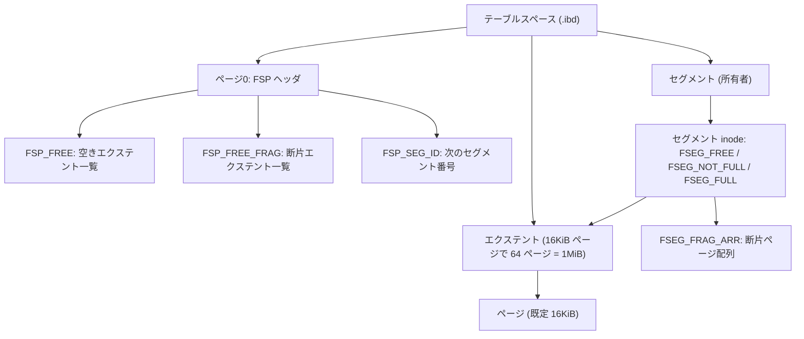
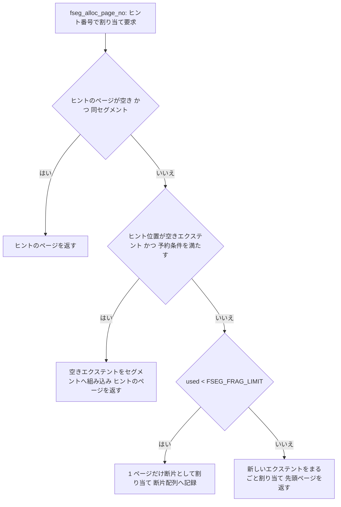

# 第13章 テーブルスペースとファイル空間管理

> **本章で読むソース**
>
> - [`storage/innobase/include/fil0fil.h`](https://github.com/mysql/mysql-server/blob/mysql-8.4.10/storage/innobase/include/fil0fil.h)
> - [`storage/innobase/fil/fil0fil.cc`](https://github.com/mysql/mysql-server/blob/mysql-8.4.10/storage/innobase/fil/fil0fil.cc)
> - [`storage/innobase/include/fsp0types.h`](https://github.com/mysql/mysql-server/blob/mysql-8.4.10/storage/innobase/include/fsp0types.h)
> - [`storage/innobase/include/fsp0fsp.h`](https://github.com/mysql/mysql-server/blob/mysql-8.4.10/storage/innobase/include/fsp0fsp.h)
> - [`storage/innobase/fsp/fsp0fsp.cc`](https://github.com/mysql/mysql-server/blob/mysql-8.4.10/storage/innobase/fsp/fsp0fsp.cc)
> - [`storage/innobase/btr/btr0btr.cc`](https://github.com/mysql/mysql-server/blob/mysql-8.4.10/storage/innobase/btr/btr0btr.cc)

## この章の狙い

第12章で、InnoDB がデータをページ単位で扱い、テーブルスペースというファイルの集合に格納することを概観した。
本章は、そのテーブルスペースの内部構造をたどる。
1つの `.ibd` ファイルは、固定長のページが並んだ単純なバイト列にすぎない。
このバイト列の上に、InnoDB は3段の論理階層を載せている。
最小単位の**ページ**、ページを64枚束ねた**エクステント**、そしてエクステントとページを所有する**セグメント**である。

この階層を二層のコードが管理する。
下層の**ファイル層**（`fil`）は、テーブルスペースとそれを構成するファイルをメモリ上のオブジェクトとして持ち、ページ番号を受け取って実ファイルのどこを読み書きするかを決める。
上層の**ファイル空間管理**（`fsp`）は、ファイルの中身を上記の3階層に区切り、「次に書き込むための空きページを1枚よこせ」という要求に応えてページを割り当てる。
本章は、`fil` がページ番号をファイル内バイトオフセットへ変換する入口を読み、続いて `fsp` が空きページをどう探して返すかを読む。
最後に、なぜこの仕組みが連続したディスク I/O を引き出せるのかを、エクステントとセグメントの設計から説明する。

## 前提

第12章で、InnoDB のページサイズが既定で16KiBであること、各テーブルが専用の `.ibd` テーブルスペースを持つこと（`innodb_file_per_table`）を見た。
本章はその上に立つ。
ページの内部レイアウト（レコードがページにどう並ぶか）は第14章で、B+tree がページをノードとしてどう連結するかは第17章で扱う。
本章が答えるのは、その手前の問いである。
あるページを書きたいとき、そのページは `.ibd` ファイルのどこにあり、新しいページはどこから割り当てられるのか。

## ページ番号からファイルオフセットへ、fil 層の入口

InnoDB のどのコードも、ディスク上の位置を「テーブルスペースID」と「ページ番号」の組で指す。
この組を `page_id_t` と呼ぶ。
バッファプールがミスしてページをディスクから読むときも、変更したページを書き戻すときも、最終的に呼ばれるのは `fil_io` である。
`fil_io` は `page_id` からテーブルスペースを管轄するシャードを引き、`Fil_shard::do_io` に処理を委ねる。

[`storage/innobase/fil/fil0fil.cc` L7975-L7988](https://github.com/mysql/mysql-server/blob/mysql-8.4.10/storage/innobase/fil/fil0fil.cc#L7975-L7988)

```cpp
dberr_t fil_io(const IORequest &type, bool sync, const page_id_t &page_id,
               const page_size_t &page_size, ulint byte_offset, ulint len,
               void *buf, void *message) {
  auto shard = fil_system->shard_by_id(page_id.space());
#ifdef UNIV_DEBUG
  if (!sync) {
    /* In case of async io we transfer the io responsibility to the thread which
    will perform the io completion routine. */
    static_cast<buf_page_t *>(message)->release_io_responsibility();
  }
#endif

  auto const err = shard->do_io(type, sync, page_id, page_size, byte_offset,
                                len, buf, message);
```

`do_io` の役目は、論理的な（テーブルスペースID、ページ番号）を物理的な（ファイルハンドル、バイトオフセット）に変換し、実 I/O を発行することである。
変換の中心は2行に集約される。
まずページ番号からファイルノードを引き当て、次にそのファイル内オフセットをページ番号で計算する。

[`storage/innobase/fil/fil0fil.cc` L7730-L7732](https://github.com/mysql/mysql-server/blob/mysql-8.4.10/storage/innobase/fil/fil0fil.cc#L7730-L7732)

```cpp
  fil_node_t *file;
  auto page_no = page_id.page_no();
  auto err = get_file_for_io(space, &page_no, file);
```

`get_file_for_io` は `fil_space_t::get_file_node` を呼ぶ。
1つのテーブルスペースが複数ファイルを持てるのはシステムテーブルスペースと一時テーブルスペースだけであり、`.ibd` ファイルは常に1ファイルである。
複数ファイルのときは、ページ番号がどのファイルに入るかを先頭から順に減算しながら探し、ヒットしたファイル内での相対ページ番号に `*page_no` を書き換える。

[`storage/innobase/fil/fil0fil.cc` L11792-L11819](https://github.com/mysql/mysql-server/blob/mysql-8.4.10/storage/innobase/fil/fil0fil.cc#L11792-L11819)

```cpp
fil_node_t *fil_space_t::get_file_node(page_no_t *page_no) noexcept {
  if (files.size() > 1) {
    ut_a(id == TRX_SYS_SPACE || purpose == FIL_TYPE_TEMPORARY);

    for (auto &f : files) {
      if (f.size > *page_no) {
        return &f;
      }
      *page_no -= f.size;
    }

  } else if (!files.empty()) {
    fil_node_t &f = files.front();

    if ((fsp_is_ibd_tablespace(id) && f.size == 0) || f.size > *page_no) {
      /* We do not know the size of a single-table tablespace
      before we open the file */
      return &f;
    }
    /* The page is outside the current bounds of the file. We should not assert
    here as we could be loading pages in buffer pool from dump file having pages
// ... (中略) ...
  }

  return nullptr;
}
```

相対ページ番号が決まれば、ファイル内オフセットは掛け算1つで求まる。
`do_io` の後半でページ番号に物理ページサイズを掛け、ページ内のバイトオフセットを足す。

[`storage/innobase/fil/fil0fil.cc` L7830-L7832](https://github.com/mysql/mysql-server/blob/mysql-8.4.10/storage/innobase/fil/fil0fil.cc#L7830-L7832)

```cpp
  auto offset = (os_offset_t)page_no * page_size.physical();

  offset += byte_offset;
```

ここに、ページを固定長にしている利点が表れている。
ページ番号からファイル内オフセットへの変換が乗算1回で済むのは、すべてのページが同じ大きさだからである。
可変長ページであれば、どこに何番のページがあるかを別の索引で引かねばならない。

### fil_space_t と fil_node_t

`fil` 層がメモリ上に持つ2つの構造体が、いま見た変換の土台である。
テーブルスペース1つにつき1個の `fil_space_t` があり、それを構成するファイル1つにつき1個の `fil_node_t` がある。
`fil_space_t` は、テーブルスペースのID、フラグ（ページサイズや行フォーマットを符号化したもの）、ページ数で表したサイズ、そしてファイルノードのベクタを持つ。

[`storage/innobase/include/fil0fil.h` L482-L493](https://github.com/mysql/mysql-server/blob/mysql-8.4.10/storage/innobase/include/fil0fil.h#L482-L493)

```cpp
  /** Purpose */
  fil_type_t purpose;

  /** Files attached to this tablespace. Note: Only the system tablespace
  can have multiple files, this is a legacy issue. */
  Files files{};

  /** Tablespace file size in pages; 0 if not known yet */
  page_no_t size{};

  /** FSP_SIZE in the tablespace header; 0 if not known yet */
  page_no_t size_in_header{};
```

`fil_node_t` は1ファイルを表し、ファイル名、OSのファイルハンドル、ページ数で表したファイルサイズを持つ。
`size` がページ数で測られている点が、先の `get_file_node` のページ番号減算とそのまま噛み合う。

[`storage/innobase/include/fil0fil.h` L171-L196](https://github.com/mysql/mysql-server/blob/mysql-8.4.10/storage/innobase/include/fil0fil.h#L171-L196)

```cpp
  /** tablespace containing this file */
  fil_space_t *space;

  /** file name; protected by Fil_shard::m_mutex and log_sys->mutex. */
  char *name;

  /** whether this file is open. Note: We set the is_open flag after
  we increase the write the MLOG_FILE_OPEN record to redo log. Therefore
  we increment the in_use reference count before setting the OPEN flag. */
  bool is_open;

  /** file handle (valid if is_open) */
  pfs_os_file_t handle;

// ... (中略) ...

  /** size of the file in database pages (0 if not known yet);
  the possible last incomplete megabyte may be ignored
  if space->id == 0 */
  page_no_t size;
```

これらの `fil_space_t` は `fil_space_create` で生成され、対応するシャードに登録される。
`fil_space_create` は名前の衝突を確認したうえで、シャードの `space_create` にオブジェクトの実体生成を委ねる。

[`storage/innobase/fil/fil0fil.cc` L3316-L3347](https://github.com/mysql/mysql-server/blob/mysql-8.4.10/storage/innobase/fil/fil0fil.cc#L3316-L3347)

```cpp
fil_space_t *fil_space_create(const char *name, space_id_t space_id,
                              uint32_t flags, fil_type_t purpose) {
  ut_ad(fsp_flags_is_valid(flags));
  ut_ad(srv_page_size == UNIV_PAGE_SIZE_ORIG || flags != 0);

  DBUG_EXECUTE_IF("fil_space_create_failure", return nullptr;);

  fil_system->mutex_acquire_all();

  auto shard = fil_system->shard_by_id(space_id);

  auto space = shard->space_create(name, space_id, flags, purpose);
// ... (中略) ...
  fil_system->mutex_release_all();

  return space;
}
```

ここまでが `fil` 層である。
`fil` はファイルの中身を意味のあるかたまりに区切らない。
ページ番号を受け取り、それを乗算でオフセットに変換するだけである。
ファイルの中をどう区切り、どのページが空いているかを管理するのは `fsp` 層の仕事である。

## ページ、エクステント、セグメントの三階層

`fsp` 層は、テーブルスペースのバイト列を3段の論理単位に分けて管理する。
最小単位はページ、その上がエクステント、さらに上がセグメントである。

エクステントは固定枚数のページの束である。
何枚束ねるかはページサイズで決まり、常に1MiBか、それ以上のきりのよいサイズになる。

[`storage/innobase/include/fsp0types.h` L55-L69](https://github.com/mysql/mysql-server/blob/mysql-8.4.10/storage/innobase/include/fsp0types.h#L55-L69)

```cpp
/** File space extent size in pages
page size | file space extent size
----------+-----------------------
   4 KiB  | 256 pages = 1 MiB
   8 KiB  | 128 pages = 1 MiB
  16 KiB  |  64 pages = 1 MiB
  32 KiB  |  64 pages = 2 MiB
  64 KiB  |  64 pages = 4 MiB
*/
#define FSP_EXTENT_SIZE                                                 \
  static_cast<page_no_t>(                                               \
      ((UNIV_PAGE_SIZE <= (16384)                                       \
            ? (1048576 / UNIV_PAGE_SIZE)                                \
            : ((UNIV_PAGE_SIZE <= (32768)) ? (2097152 / UNIV_PAGE_SIZE) \
                                           : (4194304 / UNIV_PAGE_SIZE)))))
```

既定の16KiBページなら、エクステントは64ページちょうど（1MiB）である。
本章では以後、この既定値を例に説明する。

セグメントは、エクステントとページの集合に論理的な所有者を与えたものである。
B+tree のインデックスは2つのセグメントを持ち、片方が葉ページ、もう片方が非葉ページを所有する（後述）。
セグメントの内部状態は**セグメントinode**と呼ぶ構造に記録され、テーブルスペースの先頭近くのページに置かれる。

これらの管理情報はすべて、テーブルスペースの**FSPヘッダ**を起点にたどれる。
FSPヘッダはテーブルスペースの0番ページの先頭にあり、テーブルスペースID、現在のページ数、空きエクステントのリストなどを並べた構造である。

[`storage/innobase/include/fsp0fsp.h` L133-L172](https://github.com/mysql/mysql-server/blob/mysql-8.4.10/storage/innobase/include/fsp0fsp.h#L133-L172)

```cpp
/*-------------------------------------*/
/** space id */
constexpr uint32_t FSP_SPACE_ID = 0;
/** this field contained a value up to which we know that the modifications in
 the database have been flushed to the file space; not used now */
constexpr uint32_t FSP_NOT_USED = 4;
/** Current size of the space in pages */
constexpr uint32_t FSP_SIZE = 8;
// ... (中略) ...
constexpr uint32_t FSP_FREE_LIMIT = 12;
/** fsp_space_t.flags, similar to dict_table_t::flags */
constexpr uint32_t FSP_SPACE_FLAGS = 16;
/** number of used pages in the FSP_FREE_FRAG list */
constexpr uint32_t FSP_FRAG_N_USED = 20;
/** list of free extents */
constexpr uint32_t FSP_FREE = 24;
/** list of partially free extents not belonging to any segment */
constexpr uint32_t FSP_FREE_FRAG = 24 + FLST_BASE_NODE_SIZE;

/** list of full extents not belonging to any segment */
constexpr uint32_t FSP_FULL_FRAG = 24 + 2 * FLST_BASE_NODE_SIZE;

/** 8 bytes which give the first unused segment id */
constexpr uint32_t FSP_SEG_ID = 24 + 3 * FLST_BASE_NODE_SIZE;

/** list of pages containing segment headers, where all the segment inode slots
 are reserved */
constexpr uint32_t FSP_SEG_INODES_FULL = 32 + 3 * FLST_BASE_NODE_SIZE;

/** list of pages containing segment headers, where not all the segment header
 slots are reserved */
constexpr uint32_t FSP_SEG_INODES_FREE = 32 + 4 * FLST_BASE_NODE_SIZE;

/*-------------------------------------*/
/* File space header size */
constexpr uint32_t FSP_HEADER_SIZE = 32 + 5 * FLST_BASE_NODE_SIZE;
```

ここに3本のエクステントリストが見える。
`FSP_FREE` はまるごと空のエクステント、`FSP_FREE_FRAG` は一部のページが使われた断片エクステント、`FSP_FULL_FRAG` はすべて使い切った断片エクステントである。
「断片」とは、特定のセグメントに所属させず、細かなページ要求にその場で応じるための共用エクステントを指す。
どのエクステントがどの状態かは、エクステントごとの記述子（**xdes**）が持つ。

階層と、それを束ねるリストの関係を図にする。



各エクステントの状態は、記述子の状態値で表される。
記述子は、空き、断片の空き、断片の満杯、セグメント所有の各状態を取る。

[`storage/innobase/include/fsp0fsp.h` L286-L306](https://github.com/mysql/mysql-server/blob/mysql-8.4.10/storage/innobase/include/fsp0fsp.h#L286-L306)

```cpp
/** States of a descriptor */
enum xdes_state_t {

  /** extent descriptor is not initialized */
  XDES_NOT_INITED = 0,

  /** extent is in free list of space */
  XDES_FREE = 1,

  /** extent is in free fragment list of space */
  XDES_FREE_FRAG = 2,

  /** extent is in full fragment list of space */
  XDES_FULL_FRAG = 3,

  /** extent belongs to a segment */
  XDES_FSEG = 4,

  /** fragment extent leased to segment */
  XDES_FSEG_FRAG = 5
};
```

記述子はエクステント内の各ページが空きかどうかをビットマップで持つ。
`XDES_BITS_PER_PAGE` が2なので、1ページにつき2ビットが割り当てられ、うち1ビット（`XDES_FREE_BIT`）でそのページが空きかを表す。

## テーブルスペースの初期化、fsp_header_init

新しいテーブルスペースを使い始める前に、その0番ページにFSPヘッダを書き込む。
これを行うのが `fsp_header_init` である。
ヘッダを初期化し、5本のリストを空に設定し、最初のセグメント番号を1に置く。

[`storage/innobase/fsp/fsp0fsp.cc` L1049-L1069](https://github.com/mysql/mysql-server/blob/mysql-8.4.10/storage/innobase/fsp/fsp0fsp.cc#L1049-L1069)

```cpp
  auto header = FSP_HEADER_OFFSET + page;

  mlog_write_ulint(header + FSP_SPACE_ID, space_id, MLOG_4BYTES, mtr);
  mlog_write_ulint(header + FSP_NOT_USED, 0, MLOG_4BYTES, mtr);

  fsp_header_size_update(header, size, mtr);
  mlog_write_ulint(header + FSP_FREE_LIMIT, 0, MLOG_4BYTES, mtr);
  mlog_write_ulint(header + FSP_SPACE_FLAGS, space->flags, MLOG_4BYTES, mtr);
  mlog_write_ulint(header + FSP_FRAG_N_USED, 0, MLOG_4BYTES, mtr);

  flst_init(header + FSP_FREE, mtr);
  flst_init(header + FSP_FREE_FRAG, mtr);
  flst_init(header + FSP_FULL_FRAG, mtr);
  flst_init(header + FSP_SEG_INODES_FULL, mtr);
  flst_init(header + FSP_SEG_INODES_FREE, mtr);

  mlog_write_ull(header + FSP_SEG_ID, 1, mtr);

  fsp_fill_free_list(
      !fsp_is_system_tablespace(space_id) && !fsp_is_global_temporary(space_id),
      space, header, mtr);
```

すべての書き込みが `mlog_write_*` 系の関数を経由している点に注意したい。
これはミニトランザクション（mtr、第16章）に redo ログのレコードを積みながら書く操作である。
テーブルスペースの構造変更そのものが redo ログに乗るので、クラッシュ後もこの初期化はやり直せる。
最後の `fsp_fill_free_list` が、ファイル先頭のエクステントを記述子つきで `FSP_FREE` リストに連ねていく。

## 空きページの割り当て、2つの入口

ページを1枚ほしいとき、`fsp` 層には2つの入口がある。
セグメントに属さない管理用のページを取る `fsp_alloc_free_page` と、特定のセグメントのために取る `fseg_alloc_free_page` である。
インデックスのデータページは後者で割り当てられる。

### セグメントに属さない割り当て

`fsp_alloc_free_page` は、ページ番号を割り当てる `fsp_alloc_page_no` を呼び、得たページ番号でページ実体を作る薄いラッパーである。

[`storage/innobase/fsp/fsp0fsp.cc` L1808-L1814](https://github.com/mysql/mysql-server/blob/mysql-8.4.10/storage/innobase/fsp/fsp0fsp.cc#L1808-L1814)

```cpp
[[nodiscard]] static buf_block_t *fsp_alloc_free_page(
    space_id_t space, const page_size_t &page_size, page_no_t hint,
    rw_lock_type_t rw_latch, mtr_t *mtr, mtr_t *init_mtr) {
  page_no_t page_no = fsp_alloc_page_no(space, page_size, hint, mtr);
  return (fsp_page_create(page_id_t(space, page_no), page_size, rw_latch, mtr,
                          init_mtr));
}
```

肝心の `fsp_alloc_page_no` は、まず断片エクステント（`FSP_FREE_FRAG`）から空きを探す。
ヒント番号のエクステントが断片の空き状態ならそれを使い、なければリストの先頭の断片エクステントを使う。
断片エクステントが1つもなければ、空きエクステントを1本まるごと確保し、それを断片リストに加える。

[`storage/innobase/fsp/fsp0fsp.cc` L1718-L1747](https://github.com/mysql/mysql-server/blob/mysql-8.4.10/storage/innobase/fsp/fsp0fsp.cc#L1718-L1747)

```cpp
  if (descr && (xdes_get_state(descr, mtr) == XDES_FREE_FRAG)) {
    /* Ok, we can take this extent */
  } else {
    /* Else take the first extent in free_frag list */
    first = flst_get_first(header + FSP_FREE_FRAG, mtr);

    if (fil_addr_is_null(first)) {
      /* There are no partially full fragments: allocate
      a free extent and add it to the FREE_FRAG list. NOTE
      that the allocation may have as a side-effect that an
      extent containing a descriptor page is added to the
      FREE_FRAG list. But we will allocate our page from the
      the free extent anyway. */

      descr = fsp_alloc_free_extent(space, page_size, hint, mtr);

      if (descr == nullptr) {
        /* No free space left */
        return FIL_NULL;
      }

      xdes_set_state(descr, XDES_FREE_FRAG, mtr);
      flst_add_last(header + FSP_FREE_FRAG, descr + XDES_FLST_NODE, mtr);
    } else {
      descr = xdes_lst_get_descriptor(space, page_size, first, mtr);
    }

    /* Reset the hint */
    hint = 0;
  }
```

エクステントが決まれば、その記述子のビットマップで空きビットを探し、ページ番号を確定する。
`xdes_find_bit` がビットマップを走査し、`xdes_get_offset` のエクステント先頭ページ番号に足してページ番号にする。

[`storage/innobase/fsp/fsp0fsp.cc` L1749-L1760](https://github.com/mysql/mysql-server/blob/mysql-8.4.10/storage/innobase/fsp/fsp0fsp.cc#L1749-L1760)

```cpp
  /* Now we have in descr an extent with at least one free page. Look
  for a free page in the extent. */

  free = xdes_find_bit(descr, XDES_FREE_BIT, true, hint % FSP_EXTENT_SIZE, mtr);
  if (free == FIL_NULL) {
    ut_print_buf(stderr, ((byte *)descr) - 500, 1000);
    putc('\n', stderr);

    ut_error;
  }

  page_no = xdes_get_offset(descr) + free;
```

### セグメントのための割り当て

インデックスのデータページは、特定のセグメントのために割り当てる。
入口は `fseg_alloc_free_page` で、最終的に `fseg_alloc_page_no` の大きな分岐に落ちる。
この分岐が本章でいちばん重要な部分である。
ヒントとして渡されたページ番号を起点に、できるだけ連続した、同じセグメント内のページを返そうとする。

分岐は7つの場合に分かれる。
最初に、ヒントのページがそのまま空いていてセグメントに属するなら、それを即座に返す。

[`storage/innobase/fsp/fsp0fsp.cc` L2785-L2798](https://github.com/mysql/mysql-server/blob/mysql-8.4.10/storage/innobase/fsp/fsp0fsp.cc#L2785-L2798)

```cpp
  /* In the big if-else below we look for ret_page and ret_descr */
  /*-------------------------------------------------------------*/
  if (xdes_in_segment(descr, seg_id, mtr) &&
      (xdes_mtr_get_bit(descr, XDES_FREE_BIT, hint % FSP_EXTENT_SIZE, mtr) ==
       true)) {
  take_hinted_page:
    /* 1. We can take the hinted page
    =================================*/
    ret_descr = descr;
    ret_page = hint;
    /* Skip the check for extending the tablespace. If the
    page hint were not within the size of the tablespace,
    we would have got (descr == NULL) above and reset the hint. */
    goto got_hinted_page;
```

ヒントのページが使えないとき、次に試すのは「ヒントの位置に空きエクステントがあるなら、それをセグメントに丸ごと組み込んでからヒントのページを取る」ことである。
このとき、組み込んだエクステントの直後のエクステント群もセグメントの空きリストに先回りで連ねる（`fseg_fill_free_list`）。

[`storage/innobase/fsp/fsp0fsp.cc` L2801-L2818](https://github.com/mysql/mysql-server/blob/mysql-8.4.10/storage/innobase/fsp/fsp0fsp.cc#L2801-L2818)

```cpp
  if (xdes_get_state(descr, mtr) == XDES_FREE &&
      reserved - used < reserved * (fseg_reserve_pct / 100) &&
      used >= FSEG_FRAG_LIMIT) {
    /* 2. We allocate the free extent from space and can take
    =========================================================
    the hinted page
    ===============*/
    ret_descr = fsp_alloc_free_extent(space_id, page_size, hint, mtr);

    ut_a(ret_descr == descr);

    xdes_set_segment_id(ret_descr, seg_id, XDES_FSEG, mtr);
    flst_add_last(seg_inode + FSEG_FREE, ret_descr + XDES_FLST_NODE, mtr);

    /* Try to fill the segment free list */
    fseg_fill_free_list(seg_inode, space_id, page_size, hint + FSP_EXTENT_SIZE,
                        mtr);
    goto take_hinted_page;
```

以降の分岐は、ヒントが効かない場合への後退である。
方向（`FSP_UP` か `FSP_DOWN`）が指定されていればセグメントの空きエクステントの端のページを取り（場合3）、ヒントと同じエクステントにまだ空きがあればそこから取り（場合4）、セグメントの予約済みページがまだ余っていればその中から取る（場合5）。
セグメントがまだ小さく、確保済みページ数が断片化の閾値 `FSEG_FRAG_LIMIT` 未満なら、エクステントを与えず1ページだけ断片として割り当て、その番号をセグメントinodeの断片ページ配列に記録する（場合6）。

[`storage/innobase/fsp/fsp0fsp.cc` L2877-L2893](https://github.com/mysql/mysql-server/blob/mysql-8.4.10/storage/innobase/fsp/fsp0fsp.cc#L2877-L2893)

```cpp
    } else if (used < FSEG_FRAG_LIMIT) {
      /* 6. We allocate an individual page from the space
      ===================================================*/
      ret_page = fsp_alloc_page_no(space_id, page_size, hint, mtr);

      ut_ad(!has_done_reservation || ret_page != FIL_NULL);

      if (ret_page != FIL_NULL) {
        /* Put the page in the fragment page array of the
        segment */
        n = fseg_find_free_frag_page_slot(seg_inode, mtr);
        ut_a(n != ULINT_UNDEFINED);

        fseg_set_nth_frag_page_no(seg_inode, n, ret_page, mtr);
      }

      return ret_page;
```

最後の場合7は、これらすべてが空振りで、しかもセグメントが断片化閾値を超えるほど育っているときである。
新しいエクステントをまるごとセグメントに割り当て、その先頭ページを返す。

この6番と7番の切り替えが、セグメント割り当ての設計の要点である。
セグメントが小さいうちはページを1枚ずつ断片として与え、ファイルの無駄を抑える。
セグメントが `FSEG_FRAG_LIMIT`（エクステントの半分のページ数）を超えると、以後はエクステント単位で確保するようになる。

[`storage/innobase/include/fsp0fsp.h` L216-L248](https://github.com/mysql/mysql-server/blob/mysql-8.4.10/storage/innobase/include/fsp0fsp.h#L216-L248)

```cpp
constexpr uint32_t FSEG_FRAG_ARR = 16 + 3 * FLST_BASE_NODE_SIZE;
/* number of slots in the array for the fragment pages */
#define FSEG_FRAG_ARR_N_SLOTS (FSP_EXTENT_SIZE / 2)
// ... (中略) ...
#define FSEG_FRAG_LIMIT FSEG_FRAG_ARR_N_SLOTS
```

割り当ての判断を流れ図にする。



## インデックスごとの2セグメント

B+tree のインデックスは2つのセグメントを持つ。
1つは葉ページ用、もう1つは非葉ページ（内部ノードと根）用である。
この2つのセグメントヘッダは、いずれもインデックスの根ページの中に置かれる。
セグメントヘッダの位置は `PAGE_BTR_SEG_LEAF` と `PAGE_BTR_SEG_TOP` という固定オフセットで決まる。

[`storage/innobase/include/page0types.h` L90-L98](https://github.com/mysql/mysql-server/blob/mysql-8.4.10/storage/innobase/include/page0types.h#L90-L98)

```cpp
constexpr uint32_t PAGE_BTR_SEG_LEAF = 36;
constexpr uint32_t PAGE_BTR_IBUF_FREE_LIST = PAGE_BTR_SEG_LEAF;
constexpr uint32_t PAGE_BTR_IBUF_FREE_LIST_NODE = PAGE_BTR_SEG_LEAF;
/* in the place of PAGE_BTR_SEG_LEAF and _TOP
// ... (中略) ...
constexpr uint32_t PAGE_BTR_SEG_TOP = 36 + FSEG_HEADER_SIZE;
```

インデックス作成は `btr_create` が行う。
通常のインデックスでは、まず非葉セグメント（`PAGE_BTR_SEG_TOP`）を作り、そのセグメントから根ページを割り当てる。
続いて、その根ページの上に葉セグメント（`PAGE_BTR_SEG_LEAF`）のヘッダを置く。

[`storage/innobase/btr/btr0btr.cc` L892-L918](https://github.com/mysql/mysql-server/blob/mysql-8.4.10/storage/innobase/btr/btr0btr.cc#L892-L918)

```cpp
  } else {
    block = fseg_create(space, 0, PAGE_HEADER + PAGE_BTR_SEG_TOP, mtr);
  }

  if (block == nullptr) {
    return (FIL_NULL);
  }

  page_no = block->page.id.page_no();
  frame = buf_block_get_frame(block);

  if (type & DICT_IBUF) {
// ... (中略) ...
  } else {
    /* It is a non-ibuf tree: create a file segment for leaf
    pages */
    buf_block_dbg_add_level(block, SYNC_TREE_NODE_NEW);

    if (!fseg_create(space, page_no, PAGE_HEADER + PAGE_BTR_SEG_LEAF, mtr)) {
      /* Not enough space for new segment, free root
      segment before return. */
      btr_free_root(block, mtr);
```

ここで `fseg_create` の第2引数（ページ番号）の使い分けが効いている。
最初の呼び出しは第2引数が0で、「新しいページを割り当て、そのページにセグメントヘッダを置く」を意味する。
これが根ページになる。
2回目の呼び出しは第2引数が `page_no`、つまりさきほど割り当てた根ページであり、「このページの中にもう1つのセグメントヘッダを置く」を意味する。
こうして1枚の根ページが、葉と非葉の2セグメントへの入口を兼ねる。

[`storage/innobase/fsp/fsp0fsp.cc` L2427-L2439](https://github.com/mysql/mysql-server/blob/mysql-8.4.10/storage/innobase/fsp/fsp0fsp.cc#L2427-L2439)

```cpp
buf_block_t *fseg_create(
    space_id_t space,  /*!< in: space id */
    page_no_t page,    /*!< in: page where the segment header is
                       placed: if this is != 0, the page must belong
                       to another segment, if this is 0, a new page
                       will be allocated and it will belong to the
                       created segment */
    ulint byte_offset, /*!< in: byte offset of the created
                       segment header on the page */
    mtr_t *mtr)        /*!< in/out: mini-transaction */
{
  return (fseg_create_general(space, page, byte_offset, false, mtr));
}
```

葉と非葉でセグメントを分ける狙いは、用途の違うページを別々のエクステント群にまとめることにある。
葉ページはレコード本体を順序どおりに保持し、範囲スキャンで連続して読まれる。
非葉ページは検索の経路で点々と読まれる。
この2種を同じエクステントに混ぜず別セグメントに分けておけば、葉ページ同士が物理的に近くに集まり、範囲スキャンが連続したディスク領域を読める。

2つのセグメントを作るには、ページの予約が要る。
`fseg_create_general` は、セグメントinode用に1本、セグメントのページ用に1本の、計2本のエクステントを予約してから割り当てに入る。

[`storage/innobase/fsp/fsp0fsp.cc` L2345-L2352](https://github.com/mysql/mysql-server/blob/mysql-8.4.10/storage/innobase/fsp/fsp0fsp.cc#L2345-L2352)

```cpp
  if (!has_done_reservation) {
    fsp_reserve_t alloc_type =
        (fsp_is_undo_tablespace(space_id) ? FSP_UNDO : FSP_NORMAL);

    if (!fsp_reserve_free_extents(&n_reserved, space_id, 2, alloc_type, mtr)) {
      return nullptr;
    }
  }
```

## 高速化の工夫、エクステント単位の確保による連続 I/O

本章の中心となる最適化は、セグメントが育つにつれてページ割り当ての粒度を1ページからエクステントへ切り替える仕組みである。
なぜこれが効くのかを、機構のレベルで述べる。

小さなテーブルやインデックスにエクステント（既定で1MiB）をまるごと与えると、わずか数行のデータのために1MiBを確保してしまう。
そこで InnoDB は、セグメントの確保済みページ数が `FSEG_FRAG_LIMIT`（エクステントの半分、既定で32ページ）に届くまでは、ページを1枚ずつ断片エクステントから与える（前述の場合6）。
小さいうちは空間を浪費しない。

セグメントが閾値を超えると、割り当てはエクステント単位に変わる（場合7、および場合2と場合3）。
エクステントはファイル上で連続した64ページの並びである。
1本のエクステントをセグメントに割り当てると、そのセグメントの今後のページは連続した領域から取られていく。
さらに、エクステントをセグメントに組み込む際には、その直後のエクステント群もセグメントの空きリストに先回りで連ねる（`fseg_fill_free_list`）。
これにより、セグメントが伸びる方向にもエクステントが並ぶ。

連続したページが連続したファイルオフセットに対応するのは、本章の前半で見た `offset = page_no * page_size.physical()` のためである。
ページ番号が連番なら、ファイルオフセットも連続する。
範囲スキャンが葉ページを番号順にたどるとき、ディスク上でも隣り合った領域を読むことになり、ランダム I/O ではなくシーケンシャル I/O になる。
回転ディスクではシークが減り、SSD でも先読みが効く。

割り当て要求が常にヒント番号（直前に割り当てたページの近く）を起点にすることも、この連続性を補強する。
`fseg_alloc_page_no` は、まずヒントのページ自身、次にヒントと同じエクステント、その次にヒント位置の空きエクステントを試す。
連続した番号を優先して返すこの順序が、エクステント単位の確保と噛み合って、論理的に隣り合うページを物理的にも隣り合わせる。

## まとめ

本章では、テーブルスペースの内部構造と、その上でのページ割り当てを読んだ。

- `fil` 層は、テーブルスペースを `fil_space_t`、ファイルを `fil_node_t` として持つ。
ページの読み書きは `fil_io` から `Fil_shard::do_io` に入り、ページ番号を `offset = page_no * page_size.physical()` でファイルオフセットに変換する。
固定長ページのおかげでこの変換は乗算1回で済む。
- `fsp` 層は、ファイルをページ、エクステント（既定64ページ＝1MiB）、セグメントの3階層に区切る。
すべての管理情報は0番ページのFSPヘッダから、エクステント記述子（xdes）とセグメントinodeを介してたどれる。
- 空きページの割り当ては、セグメントに属さない `fsp_alloc_free_page` と、セグメント単位の `fseg_alloc_free_page` の2系統がある。
後者の `fseg_alloc_page_no` は7つの場合分けで、ヒントに近い連続したページを優先して返す。
- B+tree のインデックスは葉と非葉の2セグメントを持ち、両方のセグメントヘッダを根ページに置く。
用途の違うページを別セグメントに分けることで、葉ページが物理的に集まる。
- セグメントが小さいうちは1ページ単位、`FSEG_FRAG_LIMIT` を超えるとエクステント単位で確保する。
連続したページが連続したファイルオフセットに対応するため、エクステント単位の確保が範囲スキャンをシーケンシャル I/O に変える。

## 関連する章

- [第12章 InnoDB アーキテクチャ概観](12-innodb-architecture.md)：テーブルスペースとページの位置づけを概観した。
- [第14章 ページとレコードのフォーマット](14-page-and-record-format.md)：本章で割り当てたページの内部レイアウトを読む。
- [第15章 バッファプール](15-buffer-pool.md)：`fil_io` を呼んでページを読み込み、キャッシュする層を読む。
- [第16章 ミニトランザクション](16-mini-transaction.md)：本章の `mlog_write_*` が積む redo ログと mtr の仕組みを読む。
- [第17章 B+tree インデックス](../part03-index-row/17-btree-index.md)：本章の2セグメントの上に構築される B+tree を読む。
