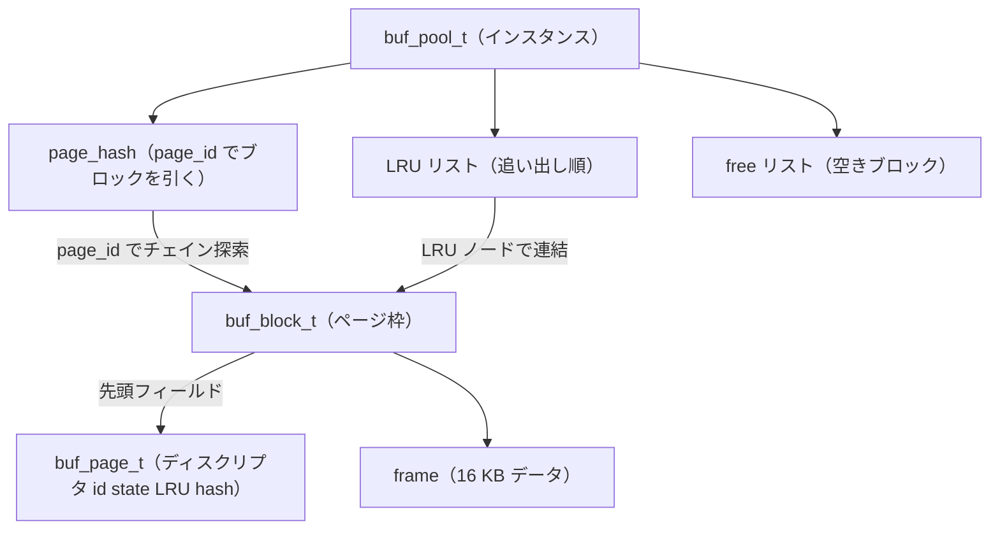
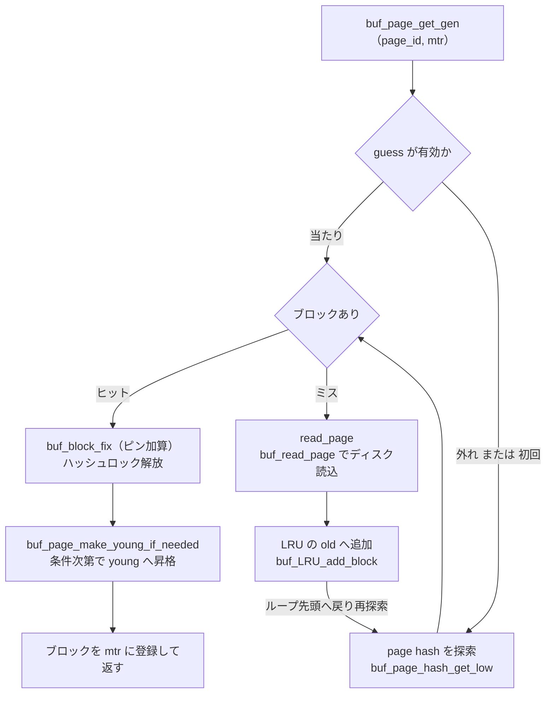

# 第15章 バッファプール

> **本章で読むソース**
>
> - [`storage/innobase/include/buf0buf.h`](https://github.com/mysql/mysql-server/blob/mysql-8.4.10/storage/innobase/include/buf0buf.h)
> - [`storage/innobase/buf/buf0buf.cc`](https://github.com/mysql/mysql-server/blob/mysql-8.4.10/storage/innobase/buf/buf0buf.cc)
> - [`storage/innobase/include/buf0buf.ic`](https://github.com/mysql/mysql-server/blob/mysql-8.4.10/storage/innobase/include/buf0buf.ic)
> - [`storage/innobase/buf/buf0lru.cc`](https://github.com/mysql/mysql-server/blob/mysql-8.4.10/storage/innobase/buf/buf0lru.cc)
> - [`storage/innobase/include/buf0lru.h`](https://github.com/mysql/mysql-server/blob/mysql-8.4.10/storage/innobase/include/buf0lru.h)

## この章の狙い

第13章でテーブルスペースを、第14章でページとレコードのフォーマットを読んだ。
これらはすべてディスク上の表現である。
InnoDB は問い合わせのたびにディスクへ往復するわけにはいかないため、よく使うページをメモリに保持し、ディスクアクセスを肩代わりさせる。
このメモリ上のキャッシュが **バッファプール** であり、本章で読む。

バッファプールは、固定サイズのページ枠の集合と、各ページの状態を記録する管理構造からなる。
SQL 層が「あるテーブルスペースの、あるページ番号のページがほしい」と要求すると、バッファプールはまずメモリ内を探す。
見つかればディスクへ行かずに返し（ヒット）、なければディスクから読み込んでメモリに載せてから返す（ミス）。
本章では、この探索と読み込みを担う `buf_page_get_gen`（`buf0buf.cc`）を中心に、ページを引くデータ構造（page hash）と、メモリが満杯のときどのページを追い出すかを決める **LRU リスト**（`buf0lru.cc`）を読む。

ディスクへ書き戻すフラッシュと、それを担う page cleaner スレッドは第28章で読む。
本章はメモリへ載せる側、すなわちページ取得と、空き枠を作るための犠牲ページ選択までを扱う。

## 前提

第14章で、InnoDB のデータがすべて固定長（既定 16 KB）のページに格納されることを読んだ。
バッファプールが扱う単位もこのページである。
ページはテーブルスペース ID とページ番号の組で一意に識別される。
本章ではこの組を `page_id_t` と呼ぶ。

ページの読み書きは **ミニトランザクション**（mtr）の文脈で行われる。
mtr は第16章で読むが、本章では「ページを取得するとき mtr にそのページのラッチを登録し、mtr の終了時にまとめて解放する仕組み」とだけ理解しておけばよい。
`buf_page_get_gen` は取得したページのラッチを引数の mtr に登録して返す。

## バッファプールの三層の管理構造

バッファプールは1つの巨大な配列ではなく、三段階の構造をとる。
最上位が **バッファプールインスタンス**（`buf_pool_t`）であり、メモリ確保の競合を分散させるために複数個に分割される。
各インスタンスの中に、ページ枠1つにつき1個の **ブロック**（`buf_block_t`）が並ぶ。
そして各ブロックの先頭に、そのページの状態を記録する **ページディスクリプタ**（`buf_page_t`）が埋め込まれる。

`buf_block_t` は、ページの実データを置く 16 KB のフレームと、その制御情報を1つにまとめた構造体である。
先頭フィールドが `buf_page_t` であることに意味がある。

[`storage/innobase/include/buf0buf.h` L1765-1787](https://github.com/mysql/mysql-server/blob/mysql-8.4.10/storage/innobase/include/buf0buf.h#L1765-L1787)

```cpp
struct buf_block_t {
  /** @name General fields */
  /** @{ */

  /** page information; this must be the first field, so
  that buf_pool->page_hash can point to buf_page_t or buf_block_t */
  buf_page_t page;

#ifndef UNIV_HOTBACKUP
  /** read-write lock of the buffer frame */
  BPageLock lock;

#ifdef UNIV_DEBUG
  /** Check if the buffer block was freed.
  @return true if the block was freed, false otherwise. */
  bool was_freed() const { return page.file_page_was_freed; }
#endif /* UNIV_DEBUG */

#endif /* UNIV_HOTBACKUP */

  /** pointer to buffer frame which is of size UNIV_PAGE_SIZE, and aligned
  to an address divisible by UNIV_PAGE_SIZE */
  byte *frame;
```

コメントが述べるとおり、`page` を先頭に置くことで、`buf_block_t *` と `buf_page_t *` を相互にキャストできる。
非圧縮ページは `buf_block_t` 全体を、圧縮専用ページは `buf_page_t` 単体を割り当てるが、page hash はどちらも `buf_page_t *` として一様に扱える。
`lock` は、このページのフレームを読み書きするための読み書きロックである。
ページ取得時に登録するラッチとは、このロックを指す。

`buf_page_t` は、ページの同一性、状態、そして各種リストへの所属を記録する。
本章に関わる主要フィールドを順に見ていく。
まず同一性を表す `id` と `size` である。

[`storage/innobase/include/buf0buf.h` L1387-1391](https://github.com/mysql/mysql-server/blob/mysql-8.4.10/storage/innobase/include/buf0buf.h#L1387-L1391)

```cpp
  /** Page id. */
  page_id_t id;

  /** Page size. */
  page_size_t size;
```

`id` がテーブルスペース ID とページ番号の組であり、page hash のキーになる。
次に、ページを各データ構造へつなぐためのポインタである。
`hash` が page hash のチェイン、`LRU` が LRU リストのノードである。

[`storage/innobase/include/buf0buf.h` L1613-1616](https://github.com/mysql/mysql-server/blob/mysql-8.4.10/storage/innobase/include/buf0buf.h#L1613-L1616)

```cpp
#ifndef UNIV_HOTBACKUP
  /** Node used in chaining to buf_pool->page_hash or buf_pool->zip_hash */
  buf_page_t *hash;
#endif /* !UNIV_HOTBACKUP */
```

[`storage/innobase/include/buf0buf.h` L1662-1663](https://github.com/mysql/mysql-server/blob/mysql-8.4.10/storage/innobase/include/buf0buf.h#L1662-L1663)

```cpp
  /** node of the LRU list */
  UT_LIST_NODE_T(buf_page_t) LRU;
```

最後に、LRU の犠牲選択に効く2つのフィールドである。
`access_time` は最初にアクセスされた時刻、`old` はこのページが LRU の old サブリストに属するかを示す。
これらの意味は後の節で扱う。

[`storage/innobase/include/buf0buf.h` L1687-1698](https://github.com/mysql/mysql-server/blob/mysql-8.4.10/storage/innobase/include/buf0buf.h#L1687-L1698)

```cpp
  /** Time of first access, or 0 if the block was never accessed in the
  buffer pool. Protected by block mutex */
  std::chrono::steady_clock::time_point access_time;

 private:
  /** Double write instance ordinal value during writes. This is used
  by IO completion (writes) to select the double write instance.*/
  uint16_t m_dblwr_id{};

 public:
  /** true if the block is in the old blocks in buf_pool->LRU_old */
  bool old;
```

インスタンスである `buf_pool_t` は、これらのブロックを束ね、ページを引くための索引とリストを保持する。
ページ取得に直接関わる3つのメンバが、page hash、LRU リスト、free リストである。
page hash は、`page_id` からブロックを引くためのハッシュテーブルである。

[`storage/innobase/include/buf0buf.h` L2360-2363](https://github.com/mysql/mysql-server/blob/mysql-8.4.10/storage/innobase/include/buf0buf.h#L2360-L2363)

```cpp
  /** Hash table of buf_page_t or buf_block_t file pages, buf_page_in_file() ==
  true, indexed by (space_id, offset).  page_hash is protected by an array of
  mutexes. */
  hash_table_t *page_hash;
```

free リストは、まだどのページにも割り当てられていない空きブロックの並びである。

[`storage/innobase/include/buf0buf.h` L2457-2458](https://github.com/mysql/mysql-server/blob/mysql-8.4.10/storage/innobase/include/buf0buf.h#L2457-L2458)

```cpp
  /** Base node of the free block list */
  UT_LIST_BASE_NODE_T(buf_page_t, list) free;
```

LRU リストは、ページに割り当て済みのブロックを、追い出しやすさの順に並べたものである。
これに付随して、old サブリストの先頭を指す `LRU_old` と、その長さ `LRU_old_len` を持つ。

[`storage/innobase/include/buf0buf.h` L2480-2492](https://github.com/mysql/mysql-server/blob/mysql-8.4.10/storage/innobase/include/buf0buf.h#L2480-L2492)

```cpp
  /** Base node of the LRU list */
  UT_LIST_BASE_NODE_T(buf_page_t, LRU) LRU;

  /** Pointer to the about LRU_old_ratio/BUF_LRU_OLD_RATIO_DIV oldest blocks in
  the LRU list; NULL if LRU length less than BUF_LRU_OLD_MIN_LEN; NOTE: when
  LRU_old != NULL, its length should always equal LRU_old_len */
  buf_page_t *LRU_old;

  /** Length of the LRU list from the block to which LRU_old points onward,
  including that block; see buf0lru.cc for the restrictions on this value; 0
  if LRU_old == NULL; NOTE: LRU_old_len must be adjusted whenever LRU_old
  shrinks or grows! */
  ulint LRU_old_len;
```

これで構造の見取り図がそろった。
インスタンスが page hash と LRU を持ち、その要素がブロック、ブロックの先頭がディスクリプタである。



## ページ取得の入口、buf_page_get_gen

ページを取得する標準の入口が `buf_page_get_gen` である。
引数は、取得するページの `page_id`、サイズ、要求するラッチの種類（`rw_latch`）、探索のヒント（`guess`）、取得モード（`mode`）、そして登録先の mtr である。

[`storage/innobase/buf/buf0buf.cc` L4446-4450](https://github.com/mysql/mysql-server/blob/mysql-8.4.10/storage/innobase/buf/buf0buf.cc#L4446-L4450)

```cpp
buf_block_t *buf_page_get_gen(const page_id_t &page_id,
                              const page_size_t &page_size, ulint rw_latch,
                              buf_block_t *guess, Page_fetch mode,
                              ut::Location location, mtr_t *mtr,
                              bool dirty_with_no_latch) {
```

この関数自体は、モードに応じて取得処理を2つの実装に振り分けるだけである。
通常のページ取得（`NORMAL` モードで一時テーブルスペースでない）は `Buf_fetch_normal` へ、それ以外は `Buf_fetch_other` へ渡す。

[`storage/innobase/buf/buf0buf.cc` L4485-4510](https://github.com/mysql/mysql-server/blob/mysql-8.4.10/storage/innobase/buf/buf0buf.cc#L4485-L4510)

```cpp
  if (mode == Page_fetch::NORMAL && !fsp_is_system_temporary(page_id.space())) {
    Buf_fetch_normal fetch(page_id, page_size);

    fetch.m_rw_latch = rw_latch;
    fetch.m_guess = guess;
    fetch.m_mode = mode;
    fetch.m_file = location.filename;
    fetch.m_line = location.line;
    fetch.m_mtr = mtr;
    fetch.m_dirty_with_no_latch = dirty_with_no_latch;

    return (fetch.single_page());

  } else {
    Buf_fetch_other fetch(page_id, page_size);

    fetch.m_rw_latch = rw_latch;
    fetch.m_guess = guess;
    fetch.m_mode = mode;
    fetch.m_file = location.filename;
    fetch.m_line = location.line;
    fetch.m_mtr = mtr;
    fetch.m_dirty_with_no_latch = dirty_with_no_latch;

    return (fetch.single_page());
  }
```

`Buf_fetch` は、取得処理の状態（対象ページ、ラッチ種別、所属インスタンス、ヒットしたハッシュロックなど）を1つにまとめた構造体である。
CRTP（テンプレート引数に派生クラス自身を渡すイディオム）で `Buf_fetch_normal` と `Buf_fetch_other` に派生させ、ヒット判定の細部だけを差し替える。
構造体は対象インスタンスを構築時に確定させる。

[`storage/innobase/buf/buf0buf.cc` L3617-3621](https://github.com/mysql/mysql-server/blob/mysql-8.4.10/storage/innobase/buf/buf0buf.cc#L3617-L3621)

```cpp
  Buf_fetch(const page_id_t &page_id, const page_size_t &page_size) noexcept
      : m_page_id(page_id),
        m_page_size(page_size),
        m_is_temp_space(fsp_is_system_temporary(page_id.space())),
        m_buf_pool(buf_pool_get(m_page_id)) {}
```

`m_buf_pool(buf_pool_get(m_page_id))` が、どのインスタンスを使うかを `page_id` から確定させる。
同じページは常に同じインスタンスに載るため、複数インスタンスがあってもページ取得側は迷わない。

## page hash の探索とヒット判定

実際のヒット判定は `Buf_fetch_normal::get` が行う。
無限ループの中で page hash を引き、見つかればブロックをピンして返し、見つからなければディスクから読み込んで再試行する。

[`storage/innobase/buf/buf0buf.cc` L3710-3746](https://github.com/mysql/mysql-server/blob/mysql-8.4.10/storage/innobase/buf/buf0buf.cc#L3710-L3746)

```cpp
dberr_t Buf_fetch_normal::get(buf_block_t *&block) noexcept {
  /* Keep this path as simple as possible. */
  for (;;) {
    /* Lookup the page in the page hash. If it doesn't exist in the
    buffer pool then try and read it in from disk. */

    ut_ad(
        !rw_lock_own(buf_page_hash_lock_get(m_buf_pool, m_page_id), RW_LOCK_S));

    block = lookup();

    if (block != nullptr) {
      if (block->page.was_stale()) {
        if (!buf_page_free_stale(m_buf_pool, &block->page, m_hash_lock)) {
          /* The page is during IO and can't be released. We wait some to not go
           into loop that would consume CPU. This is not something that will be
           hit frequently. */
          std::this_thread::sleep_for(std::chrono::microseconds(100));
        }
        /* The hash lock was released, we should try again lookup for the page
         until it's gone - it should disappear eventually when the IO ends. */
        continue;
      }

      buf_block_fix(block);

      /* Now safe to release page_hash S lock. */
      rw_lock_s_unlock(m_hash_lock);
      break;
    }

    /* Page not in buf_pool: needs to be read from file */
    read_page();
  }

  return DB_SUCCESS;
}
```

ヒットしたとき、`buf_block_fix(block)` がブロックの **ピン**（buf-fix）を増やす。
ピンは、このページが使用中であることを示すカウンタである。
ピンが立っている間はそのブロックを追い出せないため、取得側はラッチを取り終えるまでページが消えないことを保証される。
ピンを増やしてからハッシュロックを解放する順序が重要で、ロックを離した瞬間に他スレッドが追い出すのを防ぐ。

探索本体の `lookup` を見る。
ヒント `m_guess` があればまずそれを検査し、外れていれば page hash を引く。

[`storage/innobase/buf/buf0buf.cc` L3822-3872](https://github.com/mysql/mysql-server/blob/mysql-8.4.10/storage/innobase/buf/buf0buf.cc#L3822-L3872)

```cpp
template <typename T>
buf_block_t *Buf_fetch<T>::lookup() {
  m_hash_lock = buf_page_hash_lock_get(m_buf_pool, m_page_id);

  auto block = m_guess;

  rw_lock_s_lock(m_hash_lock, UT_LOCATION_HERE);

  /* If not own LRU_list_mutex, page_hash can be changed. */
  m_hash_lock =
      buf_page_hash_lock_s_confirm(m_hash_lock, m_buf_pool, m_page_id);

  if (block != nullptr) {
    /* If the m_guess is a compressed page descriptor that has been allocated
    by buf_page_alloc_descriptor(), it may have been freed by buf_relocate().
    Also, the buffer pool could get resized and m_guess's chunk could get freed,
    so we need to check the `block` pointer is still within one of the chunks
    before dereferencing it to verify it still contains the same m_page_id */

    if (!buf_is_block_in_instance(m_buf_pool, block) ||
        m_page_id != block->page.id ||
        buf_block_get_state(block) != BUF_BLOCK_FILE_PAGE) {
      /* Our m_guess was bogus or things have changed since. */
      block = m_guess = nullptr;

    } else {
      ut_ad(!block->page.in_zip_hash);
    }
  }

  if (block == nullptr) {
    block = reinterpret_cast<buf_block_t *>(
        buf_page_hash_get_low(m_buf_pool, m_page_id));
  }

  if (block == nullptr) {
    rw_lock_s_unlock(m_hash_lock);

    return (nullptr);
  }

  const auto bpage = &block->page;

  if (buf_pool_watch_is_sentinel(m_buf_pool, bpage)) {
    rw_lock_s_unlock(m_hash_lock);

    return (nullptr);
  }

  return (block);
}
```

ヒントが当たれば、ハッシュ計算もチェイン走査もせずにブロックを得られる。
B+tree を上から下へたどるカーソルは、同じページを短時間に何度も触る。
このとき前回のブロックポインタを `guess` として渡すと、page hash を引かずに済む。
ヒントが外れたとき、または初回は、`buf_page_hash_get_low` が page hash を走査する。

[`storage/innobase/include/buf0buf.ic` L849-874](https://github.com/mysql/mysql-server/blob/mysql-8.4.10/storage/innobase/include/buf0buf.ic#L849-L874)

```cpp
static inline buf_page_t *buf_page_hash_get_low(buf_pool_t *buf_pool,
                                                const page_id_t &page_id) {
  buf_page_t *bpage;

#ifdef UNIV_DEBUG
  rw_lock_t *hash_lock;

  hash_lock = hash_get_lock(buf_pool->page_hash, page_id.hash());
  ut_ad(rw_lock_own(hash_lock, RW_LOCK_X) || rw_lock_own(hash_lock, RW_LOCK_S));
#endif /* UNIV_DEBUG */

  /* Look for the page in the hash table */

  HASH_SEARCH(hash, buf_pool->page_hash, page_id.hash(), buf_page_t *, bpage,
              ut_ad(bpage->in_page_hash && !bpage->in_zip_hash &&
                    buf_page_in_file(bpage)),
              page_id == bpage->id);
  if (bpage) {
    ut_a(buf_page_in_file(bpage));
    ut_ad(bpage->in_page_hash);
    ut_ad(!bpage->in_zip_hash);
    ut_ad(buf_pool_from_bpage(bpage) == buf_pool);
  }

  return (bpage);
}
```

`HASH_SEARCH` は、`page_id.hash()` で決まるバケットのチェインを `hash` ポインタでたどり、`page_id == bpage->id` の要素を返す。
このチェインこそ、先に見た `buf_page_t::hash` フィールドが構成するものである。

## ミス時の読み込み

`lookup` が `nullptr` を返すと、ページはメモリにない。
`Buf_fetch_normal::get` のループは `read_page` を呼び、ディスクから読み込んでからループ先頭へ戻る。

[`storage/innobase/buf/buf0buf.cc` L4114-4123](https://github.com/mysql/mysql-server/blob/mysql-8.4.10/storage/innobase/buf/buf0buf.cc#L4114-L4123)

```cpp
void Buf_fetch<T>::read_page() {
  if (buf_read_page(m_page_id, m_page_size)) {
    /* Avoid doing read-ahead for parallel scans (well, at least currently this
    flag is used only during the parallel scans). This would cause unnecessary
    IO when the process is already being parallelized on higher level of
    abstraction. */
    if (m_mode != Page_fetch::SCAN) {
      buf_read_ahead_random(m_page_id, m_page_size, ibuf_inside(m_mtr));
    }
    m_retries = 0;
```

`buf_read_page` が、空きブロックを確保してそこへディスクからページを読み込む。
読み込みが終わるとそのブロックは page hash に登録されるため、`read_page` のあとループ先頭へ戻れば、今度は `lookup` がヒットする。
読み込み処理の途中で、新しいブロックは LRU リストへ追加される。
このとき old サブリスト側へ入れる点が、後で読む最適化の核心になる。

[`storage/innobase/buf/buf0buf.cc` L4972-4976](https://github.com/mysql/mysql-server/blob/mysql-8.4.10/storage/innobase/buf/buf0buf.cc#L4972-L4976)

```cpp
    block->mark_for_read_io();
    buf_page_set_io_fix(bpage, BUF_IO_READ);

    /* The block must be put to the LRU list, to the old blocks */
    buf_LRU_add_block(bpage, true /* to old blocks */);
```

ヒット後の仕上げを担うのが `single_page` である。
`get` でブロックをピンして得たあと、初回アクセスの記録と、必要ならラッチ取得を行う。
ここで LRU 上の位置を更新する判断が入る。

[`storage/innobase/buf/buf0buf.cc` L4385-4401](https://github.com/mysql/mysql-server/blob/mysql-8.4.10/storage/innobase/buf/buf0buf.cc#L4385-L4401)

```cpp
  /* Check if this is the first access to the page */
  const auto access_time = buf_page_is_accessed(&block->page);

  /* This is a heuristic and we don't care about ordering issues. */
  if (access_time == std::chrono::steady_clock::time_point{}) {
    buf_page_mutex_enter(block);

    buf_page_set_accessed(&block->page);

    buf_page_mutex_exit(block);
  }

  /* Don't move the page to the head of the LRU list so that the
  page can be discarded quickly if it is not accessed again. */
  if (m_mode != Page_fetch::PEEK_IF_IN_POOL && m_mode != Page_fetch::SCAN) {
    buf_page_make_young_if_needed(&block->page);
  }
```

`buf_page_set_accessed` が `access_time` に現在時刻を記録する。
これが、後の LRU 判定で「このページが old に入ってからどれだけ経って再アクセスされたか」を測る基準になる。
`buf_page_make_young_if_needed` が、条件を満たすページを LRU の先頭（young 側）へ昇格させる。
`SCAN` モードでこの昇格を行わないのは、コメントが述べるとおり、一度しか触らないページを LRU 先頭に置かないためである。

ヒットとミスの経路を1つの図にまとめる。



## LRU リスト、young と old の二段構え

メモリは有限なので、新しいページを載せる空き枠がなくなれば、どれかを追い出す。
追い出す候補を選ぶのが LRU リストである。
素朴な LRU は「最後に使ってから最も時間が経ったページ」を追い出す。
これは多くの場合に有効だが、ある弱点を持つ。
テーブル全体を一度だけ走査する全表スキャンのような操作は、二度と使わないページを大量に読み込む。
素朴な LRU では、これらが LRU 先頭を埋め尽くし、本当によく使うページ（ホットページ）を末尾へ押し出して追い出してしまう。

InnoDB はこれを **midpoint insertion**（中点挿入）で防ぐ。
LRU リストを **young**（先頭側、頻繁に使うページ）と **old**（末尾側、新参のページ）の2つのサブリストに分け、ディスクから読み込んだページをいきなり先頭ではなく old サブリストの先頭へ挿入する。
この挿入位置を決めるのが `buf_LRU_add_block_low` である。

[`storage/innobase/buf/buf0lru.cc` L1647-1700](https://github.com/mysql/mysql-server/blob/mysql-8.4.10/storage/innobase/buf/buf0lru.cc#L1647-L1700)

```cpp
static inline void buf_LRU_add_block_low(buf_page_t *bpage, bool old) {
  buf_pool_t *buf_pool = buf_pool_from_bpage(bpage);

  ut_ad(mutex_own(&buf_pool->LRU_list_mutex));

  ut_a(buf_page_in_file(bpage));
  ut_ad(!bpage->in_LRU_list);

  if (!old || (UT_LIST_GET_LEN(buf_pool->LRU) < BUF_LRU_OLD_MIN_LEN)) {
    UT_LIST_ADD_FIRST(buf_pool->LRU, bpage);

    bpage->freed_page_clock = buf_pool->freed_page_clock;
  } else {
#ifdef UNIV_LRU_DEBUG
    /* buf_pool->LRU_old must be the first item in the LRU list
    whose "old" flag is set. */
    ut_a(buf_pool->LRU_old->old);
    ut_a(!UT_LIST_GET_PREV(LRU, buf_pool->LRU_old) ||
         !UT_LIST_GET_PREV(LRU, buf_pool->LRU_old)->old);
    ut_a(!UT_LIST_GET_NEXT(LRU, buf_pool->LRU_old) ||
         UT_LIST_GET_NEXT(LRU, buf_pool->LRU_old)->old);
#endif /* UNIV_LRU_DEBUG */
    UT_LIST_INSERT_AFTER(buf_pool->LRU, buf_pool->LRU_old, bpage);

    buf_pool->LRU_old_len++;
  }

  ut_d(bpage->in_LRU_list = true);

  incr_LRU_size_in_bytes(bpage, buf_pool);

  if (UT_LIST_GET_LEN(buf_pool->LRU) > BUF_LRU_OLD_MIN_LEN) {
    ut_ad(buf_pool->LRU_old);

    /* Adjust the length of the old block list if necessary */

    buf_page_set_old(bpage, old);
    buf_LRU_old_adjust_len(buf_pool);

  } else if (UT_LIST_GET_LEN(buf_pool->LRU) == BUF_LRU_OLD_MIN_LEN) {
    /* The LRU list is now long enough for LRU_old to become
    defined: init it */

    buf_LRU_old_init(buf_pool);
  } else {
    buf_page_set_old(bpage, buf_pool->LRU_old != nullptr);
  }

  /* If this is a zipped block with decompressed frame as well
  then put it on the unzip_LRU list */
  if (buf_page_belongs_to_unzip_LRU(bpage)) {
    buf_unzip_LRU_add_block((buf_block_t *)bpage, old);
  }
}
```

引数 `old` が真のとき（読み込み時の追加はこれ）、`UT_LIST_INSERT_AFTER(buf_pool->LRU, buf_pool->LRU_old, bpage)` で `LRU_old` の直後、つまり old サブリストの先頭に挿入する。
リスト全体の先頭ではない。
新参ページが追い出されるまでの間に2回目のアクセスを受ければ、それは「使い続けるページ」と判断して young 側へ昇格させる。
このため、一度きりの全表スキャンが読み込むページは old サブリストに留まったまま追い出され、young 側のホットページには手が届かない。

old が偽のとき、すなわち young への昇格時は `UT_LIST_ADD_FIRST` でリスト全体の先頭へ挿入する。
young と old の境界を指す `LRU_old` は、`buf_LRU_old_adjust_len` が LRU 全体の長さに比例した位置へ調整し続ける。
old サブリストの目標長は `LRU_old_ratio` で決まり、既定では LRU 全体の約 3/8 である。

[`storage/innobase/buf/buf0lru.cc` L1476-1490](https://github.com/mysql/mysql-server/blob/mysql-8.4.10/storage/innobase/buf/buf0lru.cc#L1476-L1490)

```cpp
    if (old_len + BUF_LRU_OLD_TOLERANCE < new_len) {
      buf_pool->LRU_old = LRU_old = UT_LIST_GET_PREV(LRU, LRU_old);
#ifdef UNIV_LRU_DEBUG
      ut_a(!LRU_old->old);
#endif /* UNIV_LRU_DEBUG */
      old_len = ++buf_pool->LRU_old_len;
      buf_page_set_old(LRU_old, true);

    } else if (old_len > new_len + BUF_LRU_OLD_TOLERANCE) {
      buf_pool->LRU_old = UT_LIST_GET_NEXT(LRU, LRU_old);
      old_len = --buf_pool->LRU_old_len;
      buf_page_set_old(LRU_old, false);
    } else {
      return;
    }
```

old サブリストが目標より短ければ `LRU_old` を1つ手前（young 側）へ動かして old を伸ばし、長ければ1つ先（old 側）へ動かして縮める。
ポインタを1つずらすたびに、境界をまたいだページの `old` フラグを `buf_page_set_old` で更新する。
リストの実体を組み替えるのではなく、境界ポインタを動かすだけで young と old の比率を保つため、調整は軽い。

このサブリスト分割は、LRU が一定長に達して初めて意味を持つ。
分割を始める閾値 `BUF_LRU_OLD_MIN_LEN` は 512 ページである。

[`storage/innobase/include/buf0lru.h` L59-59](https://github.com/mysql/mysql-server/blob/mysql-8.4.10/storage/innobase/include/buf0lru.h#L59-L59)

```cpp
constexpr uint32_t BUF_LRU_OLD_MIN_LEN = 8 * 1024 / 16;
```

LRU がこの長さに満たないうちは、`buf_LRU_add_block_low` はすべて `UT_LIST_ADD_FIRST` の枝を通り、young と old を区別しない。
512 ページに達した時点で `buf_LRU_old_init` が `LRU_old` を初期化し、以後は二段構えで動く。

## young への昇格の条件

old に入ったページを young へ昇格させるかどうかは、`single_page` が呼ぶ `buf_page_make_young_if_needed` が `buf_page_peek_if_too_old` で判定する。

[`storage/innobase/include/buf0buf.ic` L180-203](https://github.com/mysql/mysql-server/blob/mysql-8.4.10/storage/innobase/include/buf0buf.ic#L180-L203)

```cpp
static inline bool buf_page_peek_if_too_old(const buf_page_t *bpage) {
  buf_pool_t *buf_pool = buf_pool_from_bpage(bpage);

  if (buf_pool->freed_page_clock == 0) {
    /* If eviction has not started yet, do not update the
    statistics or move blocks in the LRU list.  This is
    either the warm-up phase or an in-memory workload. */
    return false;
  } else if (get_buf_LRU_old_threshold() != std::chrono::seconds::zero() &&
             bpage->old) {
    const auto access_time = buf_page_is_accessed(bpage);

    if (access_time != std::chrono::steady_clock::time_point{} &&
        (std::chrono::steady_clock::now() - access_time) >=
            get_buf_LRU_old_threshold()) {
      return true;
    }

    buf_pool->stat.n_pages_not_made_young++;
    return false;
  } else {
    return (!buf_page_peek_if_young(bpage));
  }
}
```

`old` フラグが立ったページについて、最初のアクセスからしきい値（既定 1000 ミリ秒）以上が経過していれば真を返し、young へ昇格させる。
逆に、old へ入った直後に立て続けにアクセスされたページは昇格しない。
これは全表スキャンの連続読み込みを意図したふるまいである。
スキャン中の連続アクセスは時間間隔が極めて短いため、しきい値を越えられず、ページは old に留まったまま追い出し対象になる。
時間を空けて二度目のアクセスが来たページだけが「本当に使い続けるページ」として young へ上がる。

実際の昇格は `buf_LRU_make_block_young` が行う。
ページを LRU からいったん外し、`buf_LRU_add_block_low` に `old=false` で再挿入してリスト先頭へ移す。

[`storage/innobase/buf/buf0lru.cc` L1717-1728](https://github.com/mysql/mysql-server/blob/mysql-8.4.10/storage/innobase/buf/buf0lru.cc#L1717-L1728)

```cpp
void buf_LRU_make_block_young(buf_page_t *bpage) {
  buf_pool_t *buf_pool = buf_pool_from_bpage(bpage);

  ut_ad(mutex_own(&buf_pool->LRU_list_mutex));

  if (bpage->old) {
    buf_pool->stat.n_pages_made_young++;
  }

  buf_LRU_remove_block(bpage);
  buf_LRU_add_block_low(bpage, false);
}
```

## 犠牲ページの選択と空き枠の確保

ページをディスクから読み込むには空きブロックが要る。
それを供給するのが `buf_LRU_get_free_block` である。
まず free リストから取り、なければ LRU リストの末尾を走査して追い出せるページを探す。

[`storage/innobase/buf/buf0lru.cc` L1311-1364](https://github.com/mysql/mysql-server/blob/mysql-8.4.10/storage/innobase/buf/buf0lru.cc#L1311-L1364)

```cpp
buf_block_t *buf_LRU_get_free_block(buf_pool_t *buf_pool) {
  buf_block_t *block = nullptr;
  bool freed = false;
  ulint n_iterations = 0;
  ulint flush_failures = 0;
  bool started_monitor = false;

  ut_ad(!mutex_own(&buf_pool->LRU_list_mutex));

  MONITOR_INC(MONITOR_LRU_GET_FREE_SEARCH);
loop:
  buf_LRU_check_size_of_non_data_objects(buf_pool);

  /* If there is a block in the free list, take it */
  block = buf_LRU_get_free_only(buf_pool);

  if (block != nullptr) {
    ut_ad(!block->page.someone_has_io_responsibility());
    ut_ad(buf_pool_from_block(block) == buf_pool);
    memset(&block->page.zip, 0, sizeof block->page.zip);

    if (started_monitor) {
      srv_innodb_needs_monitoring--;
    }

    block->page.reset_flush_observer();
    return block;
  }

  MONITOR_INC(MONITOR_LRU_GET_FREE_LOOPS);

  freed = false;
  os_rmb;
  if (buf_pool->try_LRU_scan || n_iterations > 0) {
    /* If no block was in the free list, search from the
    end of the LRU list and try to free a block there.
    If we are doing for the first time we'll scan only
    tail of the LRU list otherwise we scan the whole LRU
    list. */
    freed = buf_LRU_scan_and_free_block(buf_pool, n_iterations > 0);

    if (!freed && n_iterations == 0) {
      /* Tell other threads that there is no point
      in scanning the LRU list. This flag is set to
      true again when we flush a batch from this
      buffer pool. */
      buf_pool->try_LRU_scan = false;
      os_wmb;
    }
  }

  if (freed) {
    goto loop;
  }
```

`buf_LRU_get_free_only` が free リストの先頭を取る。
空きがなければ `buf_LRU_scan_and_free_block` が LRU の末尾から走査する。
末尾は LRU で最も古い old サブリストの末端なので、追い出されるのはまず「old に入ってから一度も再アクセスされなかったページ」になる。
1回目の走査では末尾付近だけを見て、見つからなければ2回目以降で LRU 全体を走査する。

走査でも空きを作れないとき、最終手段としてフラッシュに頼る。
ダーティページ（変更済みでまだディスクに書き戻していないページ）は、書き戻さない限り追い出せない。
そこで page cleaner を起こし、自身は短くスリープして待つ。

[`storage/innobase/buf/buf0lru.cc` L1391-1424](https://github.com/mysql/mysql-server/blob/mysql-8.4.10/storage/innobase/buf/buf0lru.cc#L1391-L1424)

```cpp
  /* If we have scanned the whole LRU and still are unable to
  find a free block then we should sleep here to let the
  page_cleaner do an LRU batch for us. */

  if (!srv_read_only_mode) {
    os_event_set(buf_flush_event);
  }

  if (n_iterations > 1) {
    MONITOR_INC(MONITOR_LRU_GET_FREE_WAITS);
    std::this_thread::sleep_for(std::chrono::milliseconds(10));
  }

  /* No free block was found: try to flush the LRU list.
  This call will flush one page from the LRU and put it on the
  free list. That means that the free block is up for grabs for
  all user threads.

  TODO: A more elegant way would have been to return the freed
  up block to the caller here but the code that deals with
  removing the block from page_hash and LRU_list is fairly
  involved (particularly in case of compressed pages). We
  can do that in a separate patch sometime in future. */

  if (!buf_flush_single_page_from_LRU(buf_pool)) {
    MONITOR_INC(MONITOR_LRU_SINGLE_FLUSH_FAILURE_COUNT);
    ++flush_failures;
  }

  srv_stats.buf_pool_wait_free.add(n_iterations, 1);

  n_iterations++;

  goto loop;
```

`buf_flush_single_page_from_LRU` がダーティページ1枚を書き戻して free リストへ移し、`goto loop` で先頭から取り直す。
このフラッシュ経路の詳細と page cleaner の動作は第28章で読む。
本章の範囲では、空き枠の供給が free リスト、LRU 末尾の走査、フラッシュの三段で行われることを押さえておけばよい。

## 高速化と最適化の工夫

本章の最適化の核心は **midpoint insertion** による LRU のスキャン耐性である。
ディスクから読み込んだページを LRU の先頭ではなく old サブリストの先頭へ挿入し（`buf_LRU_add_block` を `old=true` で呼ぶ）、最初のアクセスからしきい値時間が経ってから再アクセスされたページだけを young へ昇格させる。
なぜこれで速くなるのか。
全表スキャンが読み込むページは時間間隔の短い連続アクセスを受けるが、しきい値（既定 1000 ミリ秒）を越えられないため young へ上がらず、old に留まったまま犠牲選択の対象になる。
その結果、一度きりの大量スキャンが young 側のホットページを追い出せず、ホットページのヒット率が保たれる。
素朴な LRU なら、スキャンで読んだページが先頭を埋めてホットページを末尾へ押し出していた。
old サブリストという「猶予期間つきの控え室」を設けることで、二度と使わないページが本当に使うページを駆逐するのを防いでいる。

これに次ぐ工夫が、page hash と複数インスタンスの組み合わせである。
ページの所在は `page_id` をキーにした page hash で O(1) に近い時間で引け、ヒット時はディスクへ行かずにブロックをピンするだけで済む。
さらに、`page_id` で確定する複数のインスタンスへバッファプールを分割することで、ページ取得や追い出しの際に握る LRU リストミューテックスやハッシュロックの競合を、インスタンス単位に分散させている。

第三の工夫が `guess` によるヒント探索である。
B+tree の探索のように同じページを短時間に繰り返し触る場面では、前回のブロックポインタを `guess` として渡せば、ハッシュ計算もチェイン走査もせずにブロックへ直行できる。
ヒントが無効化されていれば（インスタンスのリサイズや追い出しで）`lookup` がそれを検知して通常の page hash 探索へ落ちるため、正しさは保たれる。

## まとめ

バッファプールは、ディスクページをメモリにキャッシュする InnoDB の中核である。
構造は三段で、インスタンス（`buf_pool_t`）がブロック（`buf_block_t`）を束ね、各ブロックの先頭にディスクリプタ（`buf_page_t`）が埋め込まれる。
ページは `page_id` をキーにした page hash で引ける。

ページ取得 `buf_page_get_gen` は、`Buf_fetch` に処理を委ね、page hash を引いてヒットすればブロックをピンして返し、ミスすればディスクから読み込んで再試行する。
ピンを増やしてからハッシュロックを離す順序が、取得中のページが追い出されないことを保証する。

LRU リストは young と old の二段構えをとる。
読み込んだページは old サブリストの先頭に入り、しきい値時間を越えて再アクセスされたものだけが young へ昇格する。
この midpoint insertion により、一度きりの全表スキャンがホットページを追い出すのを防ぐ。
空き枠は、free リスト、LRU 末尾の走査、そしてフラッシュの三段で供給される。

## 関連する章

- [第13章 テーブルスペースとファイル空間管理](13-tablespace-and-fsp.md)：バッファプールが載せ降ろしするページの、ディスク上の住所を扱う。
- [第14章 ページとレコードのフォーマット](14-page-and-record-format.md)：バッファプールが扱うページの内部構造。
- [第16章 ミニトランザクション](16-mini-transaction.md)：`buf_page_get_gen` が取得したラッチを登録する mtr の仕組み。
- [第28章 ダブルライトバッファとページフラッシュ](../part05-log-recovery/28-doublewrite-and-flush.md)：本章で第28章へ送ったダーティページのフラッシュと page cleaner。
