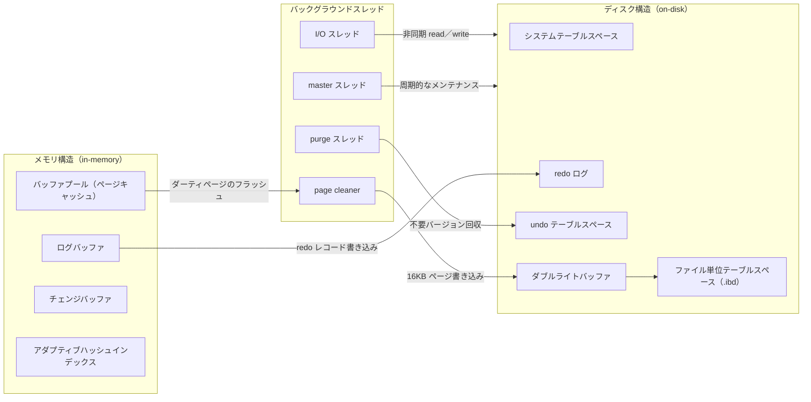

# 第17章 InnoDB アーキテクチャ概観

> **本章で読むソース**
>
> - [`storage/innobase/include/univ.i`](https://github.com/mysql/mysql-server/blob/mysql-8.4.10/storage/innobase/include/univ.i)
> - [`storage/innobase/buf/buf0buf.cc`](https://github.com/mysql/mysql-server/blob/mysql-8.4.10/storage/innobase/buf/buf0buf.cc)
> - [`storage/innobase/srv/srv0srv.cc`](https://github.com/mysql/mysql-server/blob/mysql-8.4.10/storage/innobase/srv/srv0srv.cc)
> - [`storage/innobase/srv/srv0start.cc`](https://github.com/mysql/mysql-server/blob/mysql-8.4.10/storage/innobase/srv/srv0start.cc)
> - [`storage/innobase/include/srv0srv.h`](https://github.com/mysql/mysql-server/blob/mysql-8.4.10/storage/innobase/include/srv0srv.h)
> - [`storage/innobase/buf/buf0flu.cc`](https://github.com/mysql/mysql-server/blob/mysql-8.4.10/storage/innobase/buf/buf0flu.cc)

## この章の狙い

第15章までで、SQL 層がストレージエンジンを `handler` 越しに一様に呼ぶところまで読んだ。
その `handler` の実体である `ha_innobase` の向こう側に、InnoDB という1つのデータベースエンジンが丸ごと広がっている。
本章は、第2部以降で個々の機構を詳しく読む前に、InnoDB の全体像を1枚の地図として描く。

InnoDB の構成要素は、大きく3つの面に分けて捉えられる。
メモリ上のキャッシュとバッファ、ディスク上のファイルとログ、そして両者をつなぐバックグラウンドスレッドである。
本章はこの3面をそれぞれ概観し、各要素が後続のどの章で詳しく読まれるかを示す。
個々のデータ構造の中身には踏み込まず、要素どうしの関係と、全体を貫く設計の軸だけを取り出す。

全体を貫く軸が、固定長16KBの**ページ**である。
InnoDB はテーブルの行を直接読み書きせず、ページという固定長の塊を単位にディスクとメモリの間を行き来させる。
メモリ構造もディスク構造もスレッドの仕事も、すべてこのページを中心に組み立てられている。
本章の最後では、その16KBがソース上のどこで決まるかを確認する。

## 前提

第15章で、`ha_innobase` が `handler` の仮想メソッドを実装し、行の挿入や検索を InnoDB 内部の入口へ橋渡しすることを読んだ。
本章はその入口の先にある InnoDB 全体の作りを俯瞰する。
個々の機構（バッファプール、B+tree、トランザクション、ログ）の詳細はそれぞれ専用の章を持つので、本章では各要素を1段落から数段落で紹介し、詳しい説明は後続章へ送る。

InnoDB のソースは `storage/innobase/` 以下にディレクトリ単位で機能が分かれている。
本章では主に、サーバ全体の起動とスレッド管理を担う `srv/`、バッファプールを担う `buf/`、そして共通の定数を置く `include/univ.i` を読む。

## InnoDB を3つの面で捉える

InnoDB の動作中の姿は、メモリ構造、ディスク構造、バックグラウンドスレッドの3面が同時に動いている状態である。
メモリ構造は、ディスクのページをキャッシュして高速にアクセスするための領域である。
ディスク構造は、データとログを永続化するファイル群である。
バックグラウンドスレッドは、利用者のクエリとは独立に走り、メモリとディスクの間でページやログを運ぶ役割を担う。

この3面の関係を1枚の図にまとめると次のようになる。
左にメモリ、右にディスク、中央にそれらを橋渡しするスレッドを置いた。



矢印は、ページとログがどちらの向きに運ばれるかを示す。
バッファプール上で変更されたページ（ダーティページ）は page cleaner がダブルライトバッファを経由してディスクへ書き、ログバッファに溜まった redo レコードは redo ログへ書かれる。
以下、3面を順に概観する。

## メモリ構造、ページをキャッシュする4つの領域

メモリ構造の中心は**バッファプール**である。
バッファプールは、ディスク上のページをメモリにキャッシュしておく領域であり、InnoDB のほぼすべての読み書きがここを経由する。
バッファプールの実装である `buf/buf0buf.cc` は、ファイル冒頭でこの領域を「データベースバッファ `buf_pool`」と端的に名づけている。

[`storage/innobase/buf/buf0buf.cc` L35-38](https://github.com/mysql/mysql-server/blob/mysql-8.4.10/storage/innobase/buf/buf0buf.cc#L35-L38)

```cpp
/** @file buf/buf0buf.cc
 The database buffer buf_pool

 Created 11/5/1995 Heikki Tuuri
```

行を読むときも書くときも、対象のページがバッファプールに載っていればディスクへは行かない。
載っていなければディスクから16KBを読み込んでバッファプールへ置き、以後はメモリ上で操作する。
このキャッシュの管理（どのページを残し、どれを追い出すか）が InnoDB の性能を大きく左右するため、第20章を丸ごと割いて読む。

残る3つの領域は、バッファプールを補助する特化したバッファである。
**ログバッファ**は、トランザクションが生成する redo レコードを一時的に溜める小さなメモリ領域である。
コミットやバッファの満杯を契機に、ここからディスクの redo ログへまとめて書き出される。
詳細は第32章で読む。

**チェンジバッファ**は、バッファプールに載っていないセカンダリインデックスのページへの変更を、いったんメモリに溜めて遅延適用する領域である。
更新のたびにディスクからインデックスページを読み込む代わりに、変更を記録しておき、後でそのページが読まれるときにまとめて適用する。
ランダムな読み込みを減らす工夫であり、第25章で読む。

**アダプティブハッシュインデックス**は、頻繁に検索されるインデックス値に対して、B+tree をたどらずページ内位置へ直接到達するためのハッシュ表である。
InnoDB が検索パターンを観測し、有効と判断したときに自動で構築する。
第26章で読む。

## ディスク構造、テーブルスペースとログ

ディスク構造は、データを保持する**テーブルスペース**と、永続性を支えるログ群に分かれる。
テーブルスペースは、ページを格納するファイルの論理的なまとまりである。

**システムテーブルスペース**（既定では `ibdata1`）は、InnoDB が最初から持つ共有のテーブルスペースである。
データディクショナリの一部や、後述する内部構造の置き場として使われる。

**ファイル単位テーブルスペース**は、テーブルごとに独立した `.ibd` ファイルを持つ方式である。
既定ではテーブルを作るたびにそのテーブル専用の `.ibd` が作られ、テーブルのデータとインデックスがそこに格納される。
テーブル単位でファイルが分かれるため、テーブルの削除や移動がファイル操作として完結する。
テーブルスペースの内部構造（エクステント、セグメント、空き領域管理）は第18章で読む。

ログ群は、クラッシュからの回復とトランザクションの巻き戻しを支える。
**redo ログ**は、ページへの変更を物理的な再実行ログとして記録する。
クラッシュ後、未反映の変更を redo ログから再適用してデータを最新状態へ戻す（第32章、第34章）。
**undo テーブルスペース**は、変更前の行イメージを記録する undo ログを格納する。
undo ログは、トランザクションの巻き戻しと、MVCC で過去バージョンの行を再構築するために使われる（第29章、第30章）。

**ダブルライトバッファ**は、ページをデータファイルへ書く前に、いったん専用領域へ同じページを二重に書く仕組みである。
ページ書き込みの途中でクラッシュすると、16KBのページが半分だけ書かれた壊れた状態（部分書き込み）になりうる。
ダブルライトバッファに完全なコピーを先に書いておけば、回復時にそこから正しいページを復元できる。
第33章で読む。

## バックグラウンドスレッド、メモリとディスクをつなぐ

利用者のクエリを処理するスレッドとは別に、InnoDB は複数のバックグラウンドスレッドを常駐させる。
これらはメモリとディスクの間でページやログを運び、クエリの待ち時間からディスク I/O を切り離す。
起動時にどのスレッドが立ち上がるかは `srv/srv0start.cc` に集約されている。

中心となるのが **master スレッド**である。
サーバの起動処理 `srv_start_threads` が、このスレッドをパージなどのユーティリティ操作を行う担当として生成する。

[`storage/innobase/srv/srv0start.cc` L2503-2508](https://github.com/mysql/mysql-server/blob/mysql-8.4.10/storage/innobase/srv/srv0start.cc#L2503-L2508)

```cpp
  /* Create the master thread which does purge and other utility
  operations */
  srv_threads.m_master =
      os_thread_create(srv_master_thread_key, 0, srv_master_thread);

  srv_threads.m_master.start();
```

master スレッドの本体 `srv_master_thread` は、サーバが動いている間ずっと周期的なメンテナンス（ログ空間の確認、不要になったテーブルスペースページの掃除など）を回し続ける。

[`storage/innobase/srv/srv0srv.cc` L2735-2737](https://github.com/mysql/mysql-server/blob/mysql-8.4.10/storage/innobase/srv/srv0srv.cc#L2735-L2737)

```cpp
/** The master thread controlling the server. */
void srv_master_thread() {
  DBUG_TRACE;
```

**purge スレッド**は、不要になった行の旧バージョンと undo ログを回収する。
MVCC では削除や更新で古い行バージョンがすぐには消えず、それを参照しうるトランザクションが残っている間は保持される。
どのトランザクションからも見えなくなった時点で、purge スレッドが物理的に取り除く。
起動は `srv_start_purge_threads` が担い、1つのコーディネータと複数のワーカーを生成する。

[`storage/innobase/srv/srv0start.cc` L2448-2457](https://github.com/mysql/mysql-server/blob/mysql-8.4.10/storage/innobase/srv/srv0start.cc#L2448-L2457)

```cpp
  srv_threads.m_purge_coordinator =
      os_thread_create(srv_purge_thread_key, 0, srv_purge_coordinator_thread);

  srv_threads.m_purge_workers[0] = srv_threads.m_purge_coordinator;

  /* We've already created the purge coordinator thread above. */
  for (size_t i = 1; i < srv_threads.m_purge_workers_n; ++i) {
    srv_threads.m_purge_workers[i] =
        os_thread_create(srv_worker_thread_key, i, srv_worker_thread);
  }
```

パージの詳細は第30章で読む。

**page cleaner** は、バッファプール上で変更されたダーティページをディスクへ書き戻すスレッドである。
初期化 `buf_flush_page_cleaner_init` が、コーディネータスレッドを生成して常駐させる。

[`storage/innobase/buf/buf0flu.cc` L2792-2798](https://github.com/mysql/mysql-server/blob/mysql-8.4.10/storage/innobase/buf/buf0flu.cc#L2792-L2798)

```cpp
  srv_threads.m_page_cleaner_coordinator = os_thread_create(
      page_flush_coordinator_thread_key, 0, buf_flush_page_coordinator_thread);

  srv_threads.m_page_cleaner_workers[0] =
      srv_threads.m_page_cleaner_coordinator;

  srv_threads.m_page_cleaner_coordinator.start();
```

ダーティページを継続的に書き戻すことで、チェックポイントの間隔を広げ、利用者スレッドがページ確保のたびに同期書き込みを待たされる事態を避ける。
フラッシュの詳細は第33章で読む。

**I/O スレッド**は、ディスクへの読み書きを非同期に処理する。
起動初期化 `os_aio_init` が、読み込み用と書き込み用のスレッド数を受け取って非同期 I/O の基盤を整える。

[`storage/innobase/srv/srv0start.cc` L1744](https://github.com/mysql/mysql-server/blob/mysql-8.4.10/storage/innobase/srv/srv0start.cc#L1744-L1744)

```cpp
  if (!os_aio_init(srv_n_read_io_threads, srv_n_write_io_threads)) {
```

これらのスレッドの実体は `Srv_threads` 構造体に集約されている。
master スレッド、purge コーディネータとワーカー、page cleaner コーディネータとワーカーが、それぞれメンバとして並んでいる。

[`storage/innobase/include/srv0srv.h` L205-235](https://github.com/mysql/mysql-server/blob/mysql-8.4.10/storage/innobase/include/srv0srv.h#L205-L235)

```cpp
  /** The master thread. */
  IB_thread m_master;

  /** The ts_alter_encrypt thread. */
  IB_thread m_ts_alter_encrypt;

  /** Thread doing rollbacks during recovery. */
  IB_thread m_trx_recovery_rollback;

  /** Thread writing recovered pages during recovery. */
  IB_thread m_recv_writer;

  /** Purge coordinator (also being a worker) */
  IB_thread m_purge_coordinator;

  /** Number of purge workers and size of array below. */
  size_t m_purge_workers_n;

  /** Purge workers. Note that the m_purge_workers[0] is the same shared
  state as m_purge_coordinator. */
  IB_thread *m_purge_workers;

  /** Page cleaner coordinator (also being a worker). */
  IB_thread m_page_cleaner_coordinator;

  /** Number of page cleaner workers and size of array below. */
  size_t m_page_cleaner_workers_n;

  /** Page cleaner workers. Note that m_page_cleaner_workers[0] is the
  same shared state as m_page_cleaner_coordinator. */
  IB_thread *m_page_cleaner_workers;
```

コーディネータとワーカーを分ける構造（コメントが「`m_purge_workers[0]` はコーディネータと同じ共有状態」と述べる）は、パージとフラッシュを複数スレッドで並列に進めるためのものである。

## すべてが16KBページを単位に動く

ここまで見たメモリ構造もディスク構造もスレッドの仕事も、共通の単位として固定長のページを扱う。
バッファプールが載せるのもページ、ディスクが格納するのもページ、page cleaner や I/O スレッドが運ぶのもページである。
このページサイズの既定値16KBは、`include/univ.i` で2の対数の形で定義されている。

[`storage/innobase/include/univ.i` L313-325](https://github.com/mysql/mysql-server/blob/mysql-8.4.10/storage/innobase/include/univ.i#L313-L325)

```cpp
/** Default Page Size Shift (power of 2) */
constexpr uint32_t UNIV_PAGE_SIZE_SHIFT_DEF = 14;
/** Original 16k InnoDB Page Size Shift, in case the default changes */
constexpr uint32_t UNIV_PAGE_SIZE_SHIFT_ORIG = 14;
/** Original 16k InnoDB Page Size as an ssize (log2 - 9) */
constexpr uint32_t UNIV_PAGE_SSIZE_ORIG = UNIV_PAGE_SIZE_SHIFT_ORIG - 9;

/** Minimum page size InnoDB currently supports. */
constexpr uint32_t UNIV_PAGE_SIZE_MIN = 1 << UNIV_PAGE_SIZE_SHIFT_MIN;
/** Maximum page size InnoDB currently supports. */
constexpr size_t UNIV_PAGE_SIZE_MAX = 1 << UNIV_PAGE_SIZE_SHIFT_MAX;
/** Default page size for InnoDB tablespaces. */
constexpr uint32_t UNIV_PAGE_SIZE_DEF = 1 << UNIV_PAGE_SIZE_SHIFT_DEF;
```

既定の指数 `UNIV_PAGE_SIZE_SHIFT_DEF` は14であり、`1 << 14` すなわち16384バイト（16KB）が既定のページサイズになる。
ページサイズをバイト値ではなく2の指数で持つことで、サイズの乗除算をビットシフトに置き換えられる。
実際に使われるページサイズは設定変数 `srv_page_size` を介して参照され、4KBから64KBの範囲で起動時に選べる。

[`storage/innobase/include/univ.i` L293-294](https://github.com/mysql/mysql-server/blob/mysql-8.4.10/storage/innobase/include/univ.i#L293-L294)

```cpp
/** The universal page size of the database */
#define UNIV_PAGE_SIZE ((ulint)srv_page_size)
```

すべてを固定長ページで揃える設計には明確な利点がある。
ディスクとメモリの転送単位、バッファプールの管理単位、ログの参照単位がすべて同じ大きさに揃うため、領域の確保と再利用が単純な配列として扱える。
可変長の行を直接 I/O の単位にすると、断片化や境界の管理が複雑になるが、固定長ページを挟むことでその複雑さをページ内部に封じ込められる。

## 最適化の工夫、master スレッドが活動量に応じて仕事を変える

本章で機構レベルに踏み込んで見る工夫は、master スレッドが**サーバの活動量に応じて作業内容を切り替える**点である。
master スレッドの主ループ `srv_master_main_loop` は、1秒スリープするたびに直近の活動量を確認し、サーバが忙しいときと暇なときで異なるタスク集合を実行する。

[`storage/innobase/srv/srv0srv.cc` L2681-2700](https://github.com/mysql/mysql-server/blob/mysql-8.4.10/storage/innobase/srv/srv0srv.cc#L2681-L2700)

```cpp
  ulint old_activity_count = srv_get_activity_count();

  while (srv_shutdown_state.load() <
         SRV_SHUTDOWN_PRE_DD_AND_SYSTEM_TRANSACTIONS) {
    srv_master_sleep();

    MONITOR_INC(MONITOR_MASTER_THREAD_SLEEP);

    /* Just in case - if there is not much free space in redo,
    try to avoid asking for troubles because of extra work
    performed in such background thread. */
    srv_main_thread_op_info = "checking free log space";
    log_free_check();

    if (srv_check_activity(old_activity_count)) {
      old_activity_count = srv_get_activity_count();
      srv_master_do_active_tasks();
    } else {
      srv_master_do_idle_tasks();
    }
```

`srv_check_activity` が前回確認時からの活動量の増分を見て、サーバが活発なら `srv_master_do_active_tasks`、停滞しているなら `srv_master_do_idle_tasks` を呼ぶ。
この分岐が効くのは、暇な時間帯にこそ重いメンテナンスを寄せ、利用者のクエリが集中している時間帯にはバックグラウンドの負荷を抑えられるからである。
忙しいときに重い掃除を走らせれば利用者の I/O と競合してクエリが遅くなるので、活動量を観測して仕事の量と種類を調整する。

スリープ単位が1秒である点も、この調整の一部である。
ループは `srv_master_sleep` で1秒間 CPU を手放し、その間に蓄積された活動量を次の周回で評価する。

[`storage/innobase/srv/srv0srv.cc` L2641-2648](https://github.com/mysql/mysql-server/blob/mysql-8.4.10/storage/innobase/srv/srv0srv.cc#L2641-L2648)

```cpp
/** Puts master thread to sleep. At this point we are using polling to
 service various activities. Master thread sleeps for one second before
 checking the state of the server again */
static void srv_master_sleep(void) {
  srv_main_thread_op_info = "sleeping";
  std::this_thread::sleep_for(std::chrono::seconds(1));
  srv_main_thread_op_info = "";
}
```

活動量という1つの指標でバックグラウンド作業の強度を動的に変えるこの仕組みは、固定スケジュールでメンテナンスを回す設計に比べて、負荷の山と谷に合わせて自分の働き方を変えられる点で優れている。

## まとめ

InnoDB は、メモリ構造、ディスク構造、バックグラウンドスレッドの3面が同時に動くエンジンである。
メモリ側ではバッファプールがディスクページをキャッシュし、ログバッファ、チェンジバッファ、アダプティブハッシュインデックスがそれを補助する。
ディスク側ではシステムテーブルスペースとファイル単位テーブルスペース（.ibd）がデータを保持し、redo ログと undo テーブルスペースが回復と巻き戻しを支え、ダブルライトバッファが部分書き込みからページを守る。

両者をつなぐのがバックグラウンドスレッドである。
master スレッドが周期的なメンテナンスを回し、purge スレッドが不要な旧バージョンを回収し、page cleaner がダーティページを書き戻し、I/O スレッドが非同期にディスクを読み書きする。
これらはすべて固定長16KBのページを単位に動き、その16KBは `UNIV_PAGE_SIZE_SHIFT_DEF` が14であることから決まる。

本章で読んだ最適化の工夫は、master スレッドが活動量に応じて active タスクと idle タスクを切り替える点である。
サーバが暇なときに重いメンテナンスを寄せ、忙しいときはバックグラウンド負荷を抑えることで、利用者の I/O との競合を避ける。
ここから先の各章は、この地図上のどこか1点を拡大して読むことになる。

## 関連する章

- [第15章 ハンドラ API とストレージエンジンプラグイン](../part01-sql-layer/15-handler-api.md)：本章が概観する InnoDB の入口となる `ha_innobase` を読む。
- [第18章 テーブルスペースとファイル空間管理](18-tablespace-and-fsp.md)：ディスク構造のテーブルスペース内部（エクステント、セグメント）を読む。
- [第19章 ページとレコードのフォーマット](19-page-and-record-format.md)：本章で単位として紹介した16KBページの内部構造を読む。
- [第20章 バッファプール](20-buffer-pool.md)：メモリ構造の中心であるバッファプールの管理を読む。
- [第30章 undo ログとパージ](../part04-transaction-concurrency/30-undo-and-purge.md)：purge スレッドが回収する undo ログと旧バージョンを読む。
- [第33章 ダブルライトバッファとページフラッシュ](../part05-log-recovery/33-doublewrite-and-flush.md)：page cleaner とダブルライトバッファの実装を読む。
