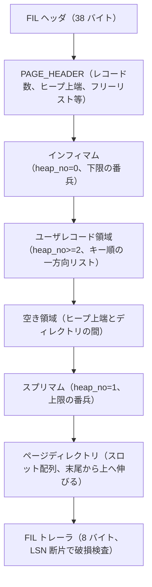

# 第19章 ページとレコードのフォーマット

> **本章で読むソース**
>
> - [`storage/innobase/include/page0types.h`](https://github.com/mysql/mysql-server/blob/mysql-8.4.10/storage/innobase/include/page0types.h)
> - [`storage/innobase/include/page0page.h`](https://github.com/mysql/mysql-server/blob/mysql-8.4.10/storage/innobase/include/page0page.h)
> - [`storage/innobase/page/page0page.cc`](https://github.com/mysql/mysql-server/blob/mysql-8.4.10/storage/innobase/page/page0page.cc)
> - [`storage/innobase/page/page0cur.cc`](https://github.com/mysql/mysql-server/blob/mysql-8.4.10/storage/innobase/page/page0cur.cc)
> - [`storage/innobase/rem/rec.h`](https://github.com/mysql/mysql-server/blob/mysql-8.4.10/storage/innobase/rem/rec.h)
> - [`storage/innobase/rem/rem0rec.cc`](https://github.com/mysql/mysql-server/blob/mysql-8.4.10/storage/innobase/rem/rem0rec.cc)
> - [`storage/innobase/include/rem0rec.ic`](https://github.com/mysql/mysql-server/blob/mysql-8.4.10/storage/innobase/include/rem0rec.ic)
> - [`storage/innobase/include/data0type.h`](https://github.com/mysql/mysql-server/blob/mysql-8.4.10/storage/innobase/include/data0type.h)
> - [`storage/innobase/include/fil0types.h`](https://github.com/mysql/mysql-server/blob/mysql-8.4.10/storage/innobase/include/fil0types.h)

## この章の狙い

第18章まででテーブルスペースを読み、ファイルが固定長のページに分割されることを確認した。
そのページの中でも、行データを実際に保持するのは **INDEX ページ**である。
クラスタ化インデックスもセカンダリインデックスも、B+tree の節点を1つのページに収め、その内部にレコードを並べる。
本章では、デフォルトの16KB の INDEX ページが内部をどう区切り、その上にレコードをどのバイト列として置くかを読む。

ページの読み方が決まれば、そのページ内で目的のレコードを探す道具立ても決まる。
InnoDB は各ページに**ページディレクトリ**という小さなスロット配列を持たせ、ページ内のレコード列を対数時間で二分探索する足場にしている。
本章の最後では、このディレクトリがどう二分探索を可能にするかを `page0cur.cc` の検索関数で確認する。
ページをまたいだ木全体の探索とカーソルの動きは第23章へ送り、ここではページ1枚の中で完結する話に絞る。

## 前提

第18章で、テーブルスペースが `FSP_PAGE_SIZE`（既定で16KB）の固定長ページに分かれること、各ページの先頭に FIL ヘッダが置かれることを読んだ。
本章はその FIL ヘッダの内側、つまり INDEX ページ本体の構造を扱う。

レコードの隠れ列に現れる `DB_TRX_ID` と `DB_ROLL_PTR` は、MVCC とトランザクションのための値である。
本章ではこれらがレコードのどこに何バイトで埋め込まれるかだけを読み、それらをたどって過去バージョンを再構成する仕組みは第29章と第30章で扱う。

## 16KB ページのレイアウト

INDEX ページは、ファイル管理層のための外枠と、インデックス層のための内枠の二重構造になっている。
外枠は FIL モジュールが管理する **FIL ヘッダ**と **FIL トレーラ**である。
FIL ヘッダはページの先頭38バイトを占め、チェックサム、ページ番号、同一レベルの隣接ページをつなぐ前後ポインタ、最終更新 LSN、ページ種別を持つ。

[`storage/innobase/include/fil0types.h` L41-76](https://github.com/mysql/mysql-server/blob/mysql-8.4.10/storage/innobase/include/fil0types.h#L41-L76)

```cpp
/** MySQL-4.0.14 space id the page belongs to (== 0) but in later
versions the 'new' checksum of the page */
constexpr uint32_t FIL_PAGE_SPACE_OR_CHKSUM = 0;

/** page offset inside space */
constexpr uint32_t FIL_PAGE_OFFSET = 4;

/** if there is a 'natural' predecessor of the page, its offset.
Otherwise FIL_NULL. This field is not set on BLOB pages, which are stored as a
singly-linked list. See also FIL_PAGE_NEXT. */
constexpr uint32_t FIL_PAGE_PREV = 8;

// ... (中略) ...

/** if there is a 'natural' successor of the page, its offset. Otherwise
FIL_NULL. B-tree index pages(FIL_PAGE_TYPE contains FIL_PAGE_INDEX) on the
same PAGE_LEVEL are maintained as a doubly linked list via FIL_PAGE_PREV and
FIL_PAGE_NEXT in the collation order of the smallest user record on each
page. */
constexpr uint32_t FIL_PAGE_NEXT = 12;

// ... (中略) ...

/** lsn of the end of the newest modification log record to the page */
constexpr uint32_t FIL_PAGE_LSN = 16;

/** file page type: FIL_PAGE_INDEX,..., 2 bytes. The contents of this field
can only be trusted in the following case: if the page is an uncompressed
B-tree index page, then it is guaranteed that the value is FIL_PAGE_INDEX.
The opposite does not hold.

In tablespaces created by MySQL/InnoDB 5.1.7 or later, the contents of this
field is valid for all uncompressed pages. */
constexpr uint32_t FIL_PAGE_TYPE = 24;
```

`FIL_PAGE_PREV` と `FIL_PAGE_NEXT` は、同じ `PAGE_LEVEL` のページを最小レコードのキー順で双方向リストにつなぐ。
この前後ポインタによって、リーフ層を端から端まで順に走査できる。
ページ種別 `FIL_PAGE_TYPE` が `FIL_PAGE_INDEX`（値は17855）なら、このページが B+tree の節点だとわかる。
データ本体が始まるオフセットは `FIL_PAGE_DATA = 38` であり、ページ末尾の8バイトが FIL トレーラ `FIL_PAGE_DATA_END` として予約される。

[`storage/innobase/include/fil0types.h` L110-119](https://github.com/mysql/mysql-server/blob/mysql-8.4.10/storage/innobase/include/fil0types.h#L110-L119)

```cpp
/** start of the data on the page */
constexpr uint32_t FIL_PAGE_DATA = 38;

/** File page trailer */
/** the low 4 bytes of this are used to store the page checksum, the
last 4 bytes should be identical to the last 4 bytes of FIL_PAGE_LSN */
constexpr uint32_t FIL_PAGE_END_LSN_OLD_CHKSUM = 8;

/** size of the page trailer */
constexpr uint32_t FIL_PAGE_DATA_END = 8;
```

FIL トレーラの末尾4バイトには、FIL ヘッダの LSN 下位4バイトと同じ値を書き込む。
ページの先頭と末尾に同じ LSN の断片を置くことで、ディスクから読んだページが部分書き込みで壊れていないかを安価に検査できる。

内枠は、`FIL_PAGE_DATA` の直後から始まるインデックス層のヘッダ **PAGE_HEADER** である。
`PAGE_HEADER` は、ページ内のレコード配置を管理する固定長の制御領域で、`page0types.h` が各フィールドのオフセットを列挙している。

[`storage/innobase/include/page0types.h` L52-105](https://github.com/mysql/mysql-server/blob/mysql-8.4.10/storage/innobase/include/page0types.h#L52-L105)

```cpp
/** index page header starts at this offset */
constexpr uint32_t PAGE_HEADER = FSEG_PAGE_DATA;

/*-----------------------------*/
/** number of slots in page directory */
constexpr uint32_t PAGE_N_DIR_SLOTS = 0;
/** pointer to record heap top */
constexpr uint32_t PAGE_HEAP_TOP = 2;
/** number of records in the heap, bit 15=flag: new-style compact page format */
constexpr uint32_t PAGE_N_HEAP = 4;
/** pointer to start of page free record list */
constexpr uint32_t PAGE_FREE = 6;
/** number of bytes in deleted records */
constexpr uint32_t PAGE_GARBAGE = 8;
/** pointer to the last inserted record, or NULL if this info has been reset by
 a delete, for example */
constexpr uint32_t PAGE_LAST_INSERT = 10;
/** last insert direction: PAGE_LEFT, ... */
constexpr uint32_t PAGE_DIRECTION = 12;
/** number of consecutive inserts to the same direction */
constexpr uint32_t PAGE_N_DIRECTION = 14;
/** number of user records on the page */
constexpr uint32_t PAGE_N_RECS = 16;
/** highest id of a trx which may have modified a record on the page; trx_id_t;
defined only in secondary indexes and in the insert buffer tree */
constexpr uint32_t PAGE_MAX_TRX_ID = 18;
/** end of private data structure of the page header which are set in a page
create */
constexpr uint32_t PAGE_HEADER_PRIV_END = 26;
/*----*/
/** level of the node in an index tree; the leaf level is the level 0.
This field should not be written to after page creation. */
constexpr uint32_t PAGE_LEVEL = 26;
/** index id where the page belongs. This field should not be written to after
 page creation. */
constexpr uint32_t PAGE_INDEX_ID = 28;
/** file segment header for the leaf pages in a B-tree: defined only on the root
 page of a B-tree, but not in the root of an ibuf tree */
constexpr uint32_t PAGE_BTR_SEG_LEAF = 36;
// ... (中略) ...
constexpr uint32_t PAGE_BTR_SEG_TOP = 36 + FSEG_HEADER_SIZE;
/* file segment header for the non-leaf pages
in a B-tree: defined only on the root page of
a B-tree, but not in the root of an ibuf
tree */
/*----*/
/** start of data on the page */
constexpr uint32_t PAGE_DATA = PAGE_HEADER + 36 + 2 * FSEG_HEADER_SIZE;
```

このヘッダのフィールドは、ページ内のレコード配置を維持するための要約値である。
`PAGE_N_DIR_SLOTS` はページディレクトリのスロット数、`PAGE_N_RECS` はインフィマムとスプリマムを除いたユーザレコード数を保つ。
`PAGE_HEAP_TOP` はレコードを積み上げているヒープの上端へのポインタで、新しいレコードは原則ここに追記される。
`PAGE_FREE` は削除されて空いた領域を再利用するためのフリーリストの先頭を指し、`PAGE_GARBAGE` はそのフリーリストに溜まった総バイト数である。
`PAGE_LEVEL` はこのページが木の何段目かを表し、0 ならリーフである。

`PAGE_HEADER` の直後には、必ず2つの境界レコードが置かれる。
**インフィマム**（infimum）はページ内のどのユーザレコードよりも小さい仮想の下限、**スプリマム**（supremum）はどのユーザレコードよりも大きい仮想の上限である。
コンパクト形式でのこの2レコードの位置は、`PAGE_DATA` を基準に固定オフセットで決まっている。

[`storage/innobase/include/page0types.h` L118-125](https://github.com/mysql/mysql-server/blob/mysql-8.4.10/storage/innobase/include/page0types.h#L118-L125)

```cpp
/** offset of the page infimum record on a new-style compact page */
#define PAGE_NEW_INFIMUM (PAGE_DATA + REC_N_NEW_EXTRA_BYTES)

/** offset of the page supremum record on a new-style compact page */
#define PAGE_NEW_SUPREMUM (PAGE_DATA + 2 * REC_N_NEW_EXTRA_BYTES + 8)

/** offset of the page supremum record end on a new-style compact page */
#define PAGE_NEW_SUPREMUM_END (PAGE_NEW_SUPREMUM + 8)
```

インフィマムとスプリマムは、ページ生成時に固定のバイト列として書き込まれる。
`page0page.h` は、その実バイト列を定数配列として持っている。

[`storage/innobase/include/page0page.h` L79-104](https://github.com/mysql/mysql-server/blob/mysql-8.4.10/storage/innobase/include/page0page.h#L79-L104)

```cpp
/** Extra bytes of an infimum record */
static const byte infimum_extra[] = {
    0x01,          /* info_bits=0, n_owned=1 */
    0x00, 0x02     /* heap_no=0, status=2 */
    /* ?, ?     */ /* next=(first user rec, or supremum) */
};
/** Data bytes of an infimum record */
static const byte infimum_data[] = {
    0x69, 0x6e, 0x66, 0x69, 0x6d, 0x75, 0x6d, 0x00 /* "infimum\0" */
};
/** Extra bytes and data bytes of a supremum record */
static const byte supremum_extra_data[] = {
    /* 0x0?, */ /* info_bits=0, n_owned=1..8 */
    0x00,
    0x0b, /* heap_no=1, status=3 */
    0x00,
    0x00, /* next=0 */
    0x73,
    0x75,
    0x70,
    0x72,
    0x65,
    0x6d,
    0x75,
    0x6d /* "supremum" */
};
```

インフィマムの heap_no は0、スプリマムの heap_no は1で固定されている。
ユーザレコードは heap_no が2以上の領域に積まれる。
インフィマムの next ポインタはページ内の最小キーのユーザレコードを指し、レコード列はそこからキー順にスプリマムまで一方向リストでつながる。
スプリマムの next ポインタは0で、リストの終端を表す。
この2つの番兵があるおかげで、ページ内のレコード走査はつねにインフィマムから始めてスプリマムで止まる単純なループになり、空ページや端の特別扱いを書かずに済む。

ユーザレコードはヒープの上端 `PAGE_HEAP_TOP` から下へ積まれ、ページディレクトリは末尾の `PAGE_DIR` 側から上へ伸びる。
両者の間に挟まれた領域が**空き領域**であり、ここが尽きるとページは満杯と判定される。
これらを1枚の図にまとめると、16KB ページは次の7区画になる。



ページディレクトリのスロットは末尾の `FIL_PAGE_DATA_END` の手前から上へ向かって並ぶため、図の上下と物理アドレスの向きは一致する。
スプリマムを境にして、上側がレコードの積み上げ領域、下側がディレクトリの伸長領域になっている。

## レコードのフォーマット

レコードはページ内に置かれた可変長のバイト列で、キー順の一方向リストの要素になる。
InnoDB には行フォーマットが3種類あり、本章の関心はその物理レイアウトである。
**REDUNDANT** は最も古い形式で、`rem/rec.h` のコメントが冒頭でそのレイアウトを図示している。

[`storage/innobase/rem/rec.h` L38-62](https://github.com/mysql/mysql-server/blob/mysql-8.4.10/storage/innobase/rem/rec.h#L38-L62)

```cpp
/**
Extra Bytes in Redudant Row Format

The extra bytes of the redundant row format (old row format) is explained here.
It contains a total of 6 bytes that occurs before the record origin.  These
bits and bytes are accessed with reference to the record origin.  So when we
say 3rd byte, it means that it is 3rd byte from the record origin.

  byte 6    byte 5    byte 4    byte 3    byte 2    byte 1
[iiiioooo][hhhhhhhh][hhhhhfff][fffffffs][pppppppp][pppppppp]+

1. The + is the record origin.
2. The next record pointer is given by the bits marked as 'p'.  This takes
   2 bytes - 1st and 2nd byte.
3. One bit is used to indicate whether the field offsets array uses 1 byte or
   2 bytes each.  This is given by the bit 's' in 3rd byte.
4. The total number of fields is given by the bits marked as 'f'.  It spans
   the 4th and 3rd bytes.  It uses a total of 10 bits.
5. The heap number of the record is given by the bits marked as 'h'.  It spans
   the 5th and 4th bytes.  It uses a total of 13 bits.
6. The record owned (by dir slot) information is given by bits marked as 'o'.
   It uses a total of 4 bits. It is available in the 6th byte.
7. The info bits are given by the bits marked as 'i'.  It uses a total of 4
   bits. It is available in the 6th byte.
*/
```

レコードは**起点**（origin）と呼ぶ位置を持ち、データの第1フィールドの先頭がそこにあたる。
ヘッダは起点より前の低位アドレス側に置かれ、可変長部分はさらにその前に伸びる。
レコードを指すポインタは一貫してこの起点を指し、ヘッダは負のオフセットで、データは正のオフセットで読む。
REDUNDANT では、起点の前に6バイトの固定ヘッダがあり、その中に次レコードへのポインタ、フィールド数、heap_no、`n_owned`、info bits が詰まっている。

現在の主流は **COMPACT** と **DYNAMIC** で、両者はヘッダの形を共有し、大きな可変長列をページ外に追い出す閾値だけが異なる。
この新形式のレイアウトを `rem0rec.cc` のコメントが図示している。

[`storage/innobase/rem/rem0rec.cc` L94-138](https://github.com/mysql/mysql-server/blob/mysql-8.4.10/storage/innobase/rem/rem0rec.cc#L94-L138)

```cpp
/*                      PHYSICAL RECORD (NEW STYLE)
                        ===========================

The physical record, which is the data type of all the records
found in index pages of the database, has the following format
(lower addresses and more significant bits inside a byte are below
represented on a higher text line):

| length of the last non-null variable-length field of data:
  if the maximum length is 255, one byte; otherwise,
  0xxxxxxx (one byte, length=0..127), or 1exxxxxxxxxxxxxx (two bytes,
  length=128..16383, extern storage flag) |
...
| length of first variable-length field of data |
| SQL-null flags (1 bit per nullable field), padded to full bytes |
| 1 or 2 bytes to indicate number of fields in the record if the table
  where the record resides has undergone an instant ADD COLUMN
  before this record gets inserted; If no instant ADD COLUMN ever
  happened, here should be no byte; So parsing this optional number
  requires the index or table information |
| 4 bits used to delete mark a record, and mark a predefined
  minimum record in alphabetical order |
| 4 bits giving the number of records owned by this record
  (this term is explained in page0page.h) |
| 13 bits giving the order number of this record in the
  heap of the index page |
| 3 bits record type: 000=conventional, 001=node pointer (inside B-tree),
  010=infimum, 011=supremum, 1xx=reserved |
| two bytes giving a relative pointer to the next record in the page |
ORIGIN of the record
| first field of data |
...
| last field of data |

The origin of the record is the start address of the first field
of data. The offsets are given relative to the origin.
The offsets of the data fields are stored in an inverted
order because then the offset of the first fields are near the
origin, giving maybe a better processor cache hit rate in searches.

The offsets of the data fields are given as one-byte
(if there are less than 127 bytes of data in the record)
or two-byte unsigned integers. The most significant bit
is not part of the offset, instead it indicates the SQL-null
if the bit is set to 1. */
```

新形式のヘッダは、起点の直前に固定の5バイトを置く。
その内訳は、`rem/rec.h` がオフセット定数として定義している。

[`storage/innobase/rem/rec.h` L83-124](https://github.com/mysql/mysql-server/blob/mysql-8.4.10/storage/innobase/rem/rec.h#L83-L124)

```cpp
/* The offset of heap_no in a compact record */
constexpr uint32_t REC_NEW_HEAP_NO = 4;
/* The shift of heap_no in a compact record.
The status is stored in the low-order bits. */
constexpr uint32_t REC_HEAP_NO_SHIFT = 3;

/* We list the byte offsets from the origin of the record, the mask,
and the shift needed to obtain each bit-field of the record. */

constexpr uint32_t REC_NEXT = 2;
constexpr uint32_t REC_NEXT_MASK = 0xFFFFUL;
constexpr uint32_t REC_NEXT_SHIFT = 0;
// ... (中略) ...
constexpr uint32_t REC_NEW_STATUS = 3; /* This is single byte bit-field */
constexpr uint32_t REC_NEW_STATUS_MASK = 0x7UL;
constexpr uint32_t REC_NEW_STATUS_SHIFT = 0;

constexpr uint32_t REC_OLD_HEAP_NO = 5;
constexpr uint32_t REC_HEAP_NO_MASK = 0xFFF8UL;
// ... (中略) ...
constexpr uint32_t REC_OLD_N_OWNED = 6; /* This is single byte bit-field */
constexpr uint32_t REC_NEW_N_OWNED = 5; /* This is single byte bit-field */
constexpr uint32_t REC_N_OWNED_MASK = 0xFUL;
constexpr uint32_t REC_N_OWNED_SHIFT = 0;

constexpr uint32_t REC_OLD_INFO_BITS = 6; /* This is single byte bit-field */
constexpr uint32_t REC_NEW_INFO_BITS = 5; /* This is single byte bit-field */
constexpr uint32_t REC_TMP_INFO_BITS = 1; /* This is single byte bit-field */
constexpr uint32_t REC_INFO_BITS_MASK = 0xF0UL;
constexpr uint32_t REC_INFO_BITS_SHIFT = 0;
```

定数の名前から、ヘッダの5バイトが起点から負方向にどう並ぶかが読み取れる。
起点の直前2バイト（`REC_NEXT`）が次レコードへのポインタである。
その前の1バイトの下位3ビットがレコード種別（`REC_NEW_STATUS`）で、000 が通常レコード、001 が B+tree のノードポインタ、010 がインフィマム、011 がスプリマムを表す。
種別の上位ビットから次バイトにかけての13ビットが heap_no で、ヒープに積まれた順序番号である。
残る1バイトには、ディレクトリスロットが所有するレコード数 `n_owned`（4ビット）と info bits（4ビット）が同居する。

info bits の中で挙動を左右するのが削除マークである。

[`storage/innobase/rem/rec.h` L140-152](https://github.com/mysql/mysql-server/blob/mysql-8.4.10/storage/innobase/rem/rec.h#L140-L152)

```cpp
/* Info bit denoting the predefined minimum record: this bit is set
if and only if the record is the first user record on a non-leaf
B-tree page that is the leftmost page on its level
(PAGE_LEVEL is nonzero and FIL_PAGE_PREV is FIL_NULL). */
constexpr uint32_t REC_INFO_MIN_REC_FLAG = 0x10UL;
/** The deleted flag in info bits; when bit is set to 1, it means the record has
 been delete marked */
constexpr uint32_t REC_INFO_DELETED_FLAG = 0x20UL;
/* Use this bit to indicate record has version */
constexpr uint32_t REC_INFO_VERSION_FLAG = 0x40UL;
/** The instant ADD COLUMN flag. When it is set to 1, it means this record
was inserted/updated after an instant ADD COLUMN. */
constexpr uint32_t REC_INFO_INSTANT_FLAG = 0x80UL;
```

`REC_INFO_DELETED_FLAG` が立ったレコードは**削除マーク**された状態である。
InnoDB は削除をその場の物理消去では行わず、まずこのビットを立てるだけにする。
古いリードビューがまだそのレコードを見ている可能性があるため、物理的な回収はパージ処理に委ねる（第30章）。
このため、ページを走査するコードは削除マーク済みレコードもリスト上では普通にたどり、可視性の判定で取捨する。

新形式のヘッダが REDUNDANT より1バイト小さい5バイトで済むのは、可変長部分の表現を変えたためである。
REDUNDANT は全フィールドのオフセット表をレコードごとに持つが、COMPACT と DYNAMIC は**可変長フィールド長のリスト**と **NULL ビットマップ**だけを起点の前に置く。
固定長で非 NULL の列は長さもオフセットも記録せず、列定義から復元する。
NULL ビットマップは NULL 許容列1つにつき1ビットで、NULL の列はデータ部に1バイトも書かない。
この2つの工夫により、固定長中心の行や NULL の多い行ほどレコードが短くなり、1ページに収まる行数が増える。

### 隠れ列

ユーザが定義した列に加えて、InnoDB はクラスタ化インデックスのレコードに**隠れ列**を埋め込む。
それらの内部コードと長さは `data0type.h` が定義している。

[`storage/innobase/include/data0type.h` L176-194](https://github.com/mysql/mysql-server/blob/mysql-8.4.10/storage/innobase/include/data0type.h#L176-L194)

```cpp
/** row id: a 48-bit integer */
constexpr uint32_t DATA_ROW_ID = 0;
/** stored length for row id */
constexpr uint32_t DATA_ROW_ID_LEN = 6;

/** Transaction id: 6 bytes */
constexpr size_t DATA_TRX_ID = 1;

/** Transaction ID type size in bytes. */
constexpr size_t DATA_TRX_ID_LEN = 6;

/** Rollback data pointer: 7 bytes */
constexpr size_t DATA_ROLL_PTR = 2;

/** Rollback data pointer type size in bytes. */
constexpr size_t DATA_ROLL_PTR_LEN = 7;

/** number of system columns defined above */
constexpr uint32_t DATA_N_SYS_COLS = 3;
```

`DB_TRX_ID` は6バイトで、そのレコードを最後に変更したトランザクションの TRX_ID を保持する。
`DB_ROLL_PTR` は7バイトで、変更前の値を記録した undo ログレコードへのポインタである。
読み手はこの2つをたどって、自分のリードビューに見えるべき過去バージョンへ遡る（第29章）。
`DB_ROW_ID` は6バイトの行 ID で、テーブルにプライマリキーがないときだけクラスタ化キーとして補われる。
プライマリキーがあるテーブルでは `DB_ROW_ID` は付かず、隠れ列は `DB_TRX_ID` と `DB_ROLL_PTR` の2つだけになる。
セカンダリインデックスのレコードはこれらを持たず、可視性はクラスタ化インデックスへ戻って判定する。

## ページディレクトリと二分探索の足場

ここまでで、ページ内のレコードがインフィマムから始まる一方向リストになることを見た。
リストをそのまま先頭から線形に走査すれば目的のレコードに到達できるが、300件規模のページではそれは遅い。
InnoDB は、このリストに対する二分探索を可能にするために**ページディレクトリ**を持つ。
`page0page.cc` の冒頭コメントが、この構造の意図を述べている。

[`storage/innobase/page/page0page.cc` L50-90](https://github.com/mysql/mysql-server/blob/mysql-8.4.10/storage/innobase/page/page0page.cc#L50-L90)

```cpp
/*                      THE INDEX PAGE
                        ==============

The index page consists of a page header which contains the page's
id and other information. On top of it are the index records
in a heap linked into a one way linear list according to alphabetic order.

Just below page end is an array of pointers which we call page directory,
to about every sixth record in the list. The pointers are placed in
the directory in the alphabetical order of the records pointed to,
enabling us to make binary search using the array. Each slot n:o I
in the directory points to a record, where a 4-bit field contains a count
of those records which are in the linear list between pointer I and
the pointer I - 1 in the directory, including the record
pointed to by pointer I and not including the record pointed to by I - 1.
We say that the record pointed to by slot I, or that slot I, owns
these records. The count is always kept in the range 4 to 8, with
the exception that it is 1 for the first slot, and 1--8 for the second slot.

An essentially binary search can be performed in the list of index
records, like we could do if we had pointer to every record in the
page directory. The data structure is, however, more efficient when
we are doing inserts, because most inserts are just pushed on a heap.
Only every 8th insert requires block move in the directory pointer
table, which itself is quite small. A record is deleted from the page
by just taking it off the linear list and updating the number of owned
records-field of the record which owns it, and updating the page directory,
if necessary. A special case is the one when the record owns itself.
Because the overhead of inserts is so small, we may also increase the
page size from the projected default of 8 kB to 64 kB without too
much loss of efficiency in inserts. Bigger page becomes actual
when the disk transfer rate compared to seek and latency time rises.
On the present system, the page size is set so that the page transfer
time (3 ms) is 20 % of the disk random access time (15 ms).

// ... (中略) ...

Assuming a page size of 8 kB, a typical index page of a secondary
index contains 300 index entries, and the size of the page directory
is 50 x 4 bytes = 200 bytes. */
```

ディレクトリは、レコード列のおよそ6件ごとに1つ、キー順に並んだ2バイトのスロットを持つ。
各スロットはあるレコードを指し、そのレコードのヘッダの `n_owned` が、直前のスロットから自分までに入るレコード件数を保持する。
この件数は4から8の範囲に保たれ、スロット間隔が一定の上限を超えないことを保証する。
レコードを指すスロットの配列がキー順に並んでいるため、スロットの上では二分探索が成立する。

スロット数を全レコード分ではなく6件に1つに抑えているのは、挿入を速くするためである。
ほとんどの挿入はヒープへの追記で済み、ディレクトリ配列のブロック移動が要るのは所有件数が上限の8を超える8回に1回だけになる。
全レコードにスロットを与えればポインタ1つで目的レコードに飛べるが、その代わり挿入のたびに配列を動かす羽目になる。
6件単位のスロットは、二分探索の対数性と挿入の安さを両立させる折衷点である。

実際の探索は、`page0cur.cc` の `page_cur_search_with_match` が二段構えで行う。

[`storage/innobase/page/page0cur.cc` L328-335](https://github.com/mysql/mysql-server/blob/mysql-8.4.10/storage/innobase/page/page0cur.cc#L328-L335)

```cpp
void page_cur_search_with_match(const buf_block_t *block,
                                const dict_index_t *index,
                                const dtuple_t *tuple, page_cur_mode_t mode,
                                ulint *iup_matched_fields,

                                ulint *ilow_matched_fields,

                                page_cur_t *cursor, rtr_info_t *rtr_info) {
```

第1段は、ディレクトリスロットを対象にした二分探索である。
下限スロットと上限スロットの距離が1になるまで、中点スロットの指すレコードと探索キーを比較して範囲を半分に狭める。

[`storage/innobase/page/page0cur.cc` L485-530](https://github.com/mysql/mysql-server/blob/mysql-8.4.10/storage/innobase/page/page0cur.cc#L485-L530)

```cpp
  /* Perform binary search until the lower and upper limit directory
  slots come to the distance 1 of each other */

  while (up - low > 1) {
    mid = (low + up) / 2;
    slot = page_dir_get_nth_slot(page, mid);
    mid_rec = page_dir_slot_get_rec(slot);

    cur_matched_fields = std::min(low_matched_fields, up_matched_fields);

    auto offsets = get_mid_rec_offsets();

    cmp = tuple->compare(mid_rec, index, offsets, &cur_matched_fields);

    if (cmp > 0) {
    low_slot_match:
      low = mid;
      low_matched_fields = cur_matched_fields;

    } else if (cmp) {
// ... (中略) ...
    up_slot_match:
      up = mid;
      up_matched_fields = cur_matched_fields;

    } else if (mode == PAGE_CUR_G || mode == PAGE_CUR_LE
// ... (中略) ...
    ) {
      goto low_slot_match;
    } else {
      goto up_slot_match;
    }
  }

  slot = page_dir_get_nth_slot(page, low);
  low_rec = page_dir_slot_get_rec(slot);
  slot = page_dir_get_nth_slot(page, up);
  up_rec = page_dir_slot_get_rec(slot);
```

二分探索が終わると、目的のレコードは下限スロットと上限スロットが挟む高々8件の所有グループの中にいる。
第2段は、その狭い区間をリストのポインタで線形に走査して目的位置を確定する。

[`storage/innobase/page/page0cur.cc` L532-536](https://github.com/mysql/mysql-server/blob/mysql-8.4.10/storage/innobase/page/page0cur.cc#L532-L536)

```cpp
  /* Perform linear search until the upper and lower records come to
  distance 1 of each other. */

  while (page_rec_get_next_const(low_rec) != up_rec) {
    mid_rec = page_rec_get_next_const(low_rec);
```

ページ内に N 件のレコードがあっても、スロット上の二分探索が候補を所有グループ単位に絞るため、比較回数はおよそ `log2(N/6)` に収まる。
そのあとは定数件の線形走査で済むので、ページ内検索の全体は対数時間で完了する。
これが、ディレクトリを持つことで線形走査を二分探索に置き換える本章の中心的な工夫である。

第2段の線形走査が `page_rec_get_next_const` でリストをたどる際、新形式の next ポインタは絶対オフセットではなく**相対オフセット**として読まれる。

[`storage/innobase/include/rem0rec.ic` L161-190](https://github.com/mysql/mysql-server/blob/mysql-8.4.10/storage/innobase/include/rem0rec.ic#L161-L190)

```cpp
static inline ulint rec_get_next_offs(const rec_t *rec, ulint comp) {
  ulint field_value;
  static_assert(REC_NEXT_MASK == 0xFFFFUL, "REC_NEXT_MASK != 0xFFFFUL");
  static_assert(REC_NEXT_SHIFT == 0, "REC_NEXT_SHIFT != 0");

  field_value = mach_read_from_2(rec - REC_NEXT);

  if (comp) {
    /** Check if the result offset is still on the same page. We allow
    `field_value` to be interpreted as negative 16bit integer. This check does
    nothing for 64KB pages. */
    ut_ad(static_cast<uint16_t>(field_value +
                                ut_align_offset(rec, UNIV_PAGE_SIZE)));

    if (field_value == 0) {
      return (0);
    }

    /* There must be at least REC_N_NEW_EXTRA_BYTES + 1
    between each record. */
    ut_ad((field_value > REC_N_NEW_EXTRA_BYTES && field_value < 32768) ||
          field_value < (uint16_t)-REC_N_NEW_EXTRA_BYTES);

    return (ut_align_offset(rec + field_value, UNIV_PAGE_SIZE));
  } else {
    ut_ad(field_value < UNIV_PAGE_SIZE);

    return (field_value);
  }
}
```

コンパクト形式（`comp` が真）では、next の2バイトを現在レコードからの符号付き差分として解釈し、`rec + field_value` をページ境界で丸めて次レコードの位置を得る。
旧形式はこの2バイトをページ先頭からの絶対オフセットとして読む。
相対化によって next の値がページ内の位置に依存しなくなるため、ページを別のフレームへコピーしても next を書き換えずに済み、ページ分割や再編成が安くなる。

## まとめ

16KB の INDEX ページは、FIL ヘッダと FIL トレーラの外枠、`PAGE_HEADER` の制御領域、インフィマムとスプリマムの番兵、ユーザレコード領域、空き領域、ページディレクトリの7区画からなる。
レコードは起点を基準にヘッダを負方向、データを正方向に置き、COMPACT と DYNAMIC は可変長長リストと NULL ビットマップで REDUNDANT より小さいヘッダに収める。
クラスタ化インデックスのレコードには `DB_TRX_ID` と `DB_ROLL_PTR`（プライマリキーがなければ `DB_ROW_ID` も）が隠れ列として埋め込まれ、MVCC とパージの足がかりになる。
ページディレクトリは6件ごとのスロット配列で、スロット上の二分配列探索と所有グループ内の定数件線形走査を組み合わせ、ページ内検索を対数時間で済ませる。

## 関連する章

- [第18章 テーブルスペースとファイル空間管理](18-tablespace-and-fsp.md)：本章のページが置かれるファイル空間と、ページ番号の割り当てを扱う。
- [第20章 バッファプール](20-buffer-pool.md)：本章のページがメモリ上でどのフレームに載り、どう管理されるかを扱う。
- [第22章 B+tree インデックス](../part03-index-row/22-btree-index.md)：本章のページを節点とする木構造と、ページ分割や併合を扱う。
- [第23章 レコード検索とカーソル](../part03-index-row/23-search-and-cursor.md)：本章のページ内二分探索を、木をまたぐ探索とカーソル移動へ拡張する。
- [第29章 MVCC とリードビュー](../part04-transaction-concurrency/29-mvcc-and-read-view.md)：本章の隠れ列 `DB_TRX_ID` と `DB_ROLL_PTR` をたどって過去バージョンを再構成する仕組みを扱う。
