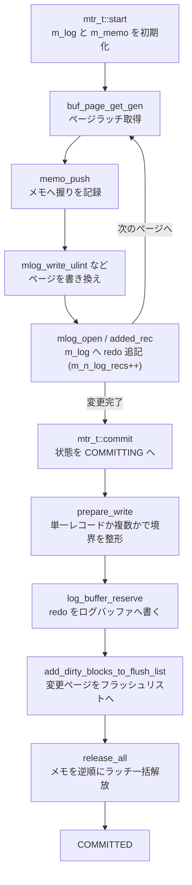

# 第21章 ミニトランザクション

> **本章で読むソース**
>
> - [`storage/innobase/mtr/mtr0mtr.cc`](https://github.com/mysql/mysql-server/blob/mysql-8.4.10/storage/innobase/mtr/mtr0mtr.cc)
> - [`storage/innobase/include/mtr0mtr.h`](https://github.com/mysql/mysql-server/blob/mysql-8.4.10/storage/innobase/include/mtr0mtr.h)
> - [`storage/innobase/include/mtr0mtr.ic`](https://github.com/mysql/mysql-server/blob/mysql-8.4.10/storage/innobase/include/mtr0mtr.ic)
> - [`storage/innobase/include/mtr0types.h`](https://github.com/mysql/mysql-server/blob/mysql-8.4.10/storage/innobase/include/mtr0types.h)
> - [`storage/innobase/mtr/mtr0log.cc`](https://github.com/mysql/mysql-server/blob/mysql-8.4.10/storage/innobase/mtr/mtr0log.cc)
> - [`storage/innobase/include/mtr0log.ic`](https://github.com/mysql/mysql-server/blob/mysql-8.4.10/storage/innobase/include/mtr0log.ic)

## この章の狙い

第20章で読んだバッファプールは、ディスク上のページをメモリへ載せ、変更を遅延させて書き戻す仕組みだった。
だが、1つのページを書き換えるだけで処理が完結することは、ほとんどない。
たとえば B+tree へ1行を挿入すると、リーフページにレコードを書き、その親ページにポインタを足し、ページが満杯ならページを分割し、さらに領域管理のビットマップを更新する。
これらは複数のページにまたがる一連の書き換えであり、途中でクラッシュすれば木構造は壊れる。

InnoDB は、こうした「複数ページへの一続きの変更」を不可分な単位にまとめる。
その単位が本章で読む**ミニトランザクション**（以下「mtr」）である。
mtr は、SQL レベルのトランザクション（第28章）とは別の、もっと低い層の概念である。
SQL の1トランザクションは多数の mtr に分割され、各 mtr が「このページ群への変更はまとめて適用されるか、まったく適用されないかのどちらかである」という保証を担う。

mtr が原子性を実現する道具は2つしかない。
1つはページラッチである。
変更するページをラッチで握り、mtr の終わりまで離さないことで、他スレッドに中途半端な状態を見せない。
もう1つが redo ログである。
変更をページに書くのと同時に、その変更を再現できる redo レコードを mtr の中に貯め、コミット時にまとめて redo ログバッファへ書く。
クラッシュしても、redo を再生すれば mtr の変更は完全な形で復元される。

本章では、mtr の開始（`mtr_t::start`）、ページラッチの取得とメモへの記録、変更ごとの redo レコード追記（`mlog_*`）、そしてコミット（`mtr_t::commit`）でラッチを一括解放し redo を書き出す流れを、`storage/innobase/mtr/mtr0mtr.cc` に即して読む。
redo ログそのものの構造や、書き出した先でどう永続化されるかは第32章へ送る。

## 前提

第20章で、ページはバッファプール上の `buf_block_t` として保持され、各ブロックが `rw_lock_t` のラッチを持つことを読んだ。
本章の mtr は、このラッチを取得し、変更後に解放する主体である。
ページを変更したブロックは「ダーティ」になり、フラッシュリストへ登録されてから後で書き戻される。
mtr のコミットは、まさにこのフラッシュリストへの登録を行う場所でもある。

redo ログについては、本章では「変更を再現するための記録を順に並べたバイト列」という最小限の理解で足りる。
mtr が貯めた redo を、グローバルな redo ログバッファのどこへ、どんなレイアウトで書くかは第32章で読む。

## mtr の状態を持つ `mtr_t`

mtr の実体は `mtr_t` 構造体である。
その内側に、mtr の一生のあいだ保持すべき状態を集めた `Impl` がある。

[`storage/innobase/include/mtr0mtr.h` L176-L223](https://github.com/mysql/mysql-server/blob/mysql-8.4.10/storage/innobase/include/mtr0mtr.h#L176-L223)

```cpp
/** Mini-transaction handle and buffer */
struct mtr_t {
  /** State variables of the mtr */
  struct Impl {
    /** memo stack for locks etc. */
    mtr_buf_t m_memo;

    /** mini-transaction log */
    mtr_buf_t m_log;

    /** true if inside ibuf changes */
    bool m_inside_ibuf;

    /** true if the mini-transaction might have modified buffer pool pages */
    bool m_modifications;

// ... (中略) ...

    /** Count of how many page initial log records have been
    written to the mtr log */
    uint32_t m_n_log_recs;

    /** specifies which operations should be logged; default
    value MTR_LOG_ALL */
    mtr_log_t m_log_mode;

    /** State of the transaction */
    mtr_state_t m_state;

    /** Flush Observer */
    Flush_observer *m_flush_observer;

#ifdef UNIV_DEBUG
    /** For checking corruption. */
    ulint m_magic_n;

#endif /* UNIV_DEBUG */

    /** Owning mini-transaction */
    mtr_t *m_mtr;
  };
```

中核は2つのバッファである。
`m_memo` は**メモ**と呼ぶスタックで、この mtr が取得したラッチやページの参照を、取った順に積む。
コミット時に、このスタックを逆順にたどってラッチを解放する。
`m_log` は、この mtr が生成した redo レコードを順に連結していくバイト列である。
`m_n_log_recs` は、そこへ何件の redo レコードを書いたかの数で、コミット時の分岐に使う。

`m_log_mode` は、この mtr が redo を生成するかどうかを切り替える。
通常は `MTR_LOG_ALL` で、すべての変更を redo に記録する。
一時テーブルのように crash recovery で復元する必要のないページや、redo ログを一時的に止めている局面では、`MTR_LOG_NO_REDO` などに切り替えて redo 生成を省く。

### メモに積むものの型

メモのスロットは `mtr_memo_slot_t` で、握っている対象（`buf_block_t` か `rw_lock_t`）へのポインタと、その種別を持つ。
種別は次の列挙で定義される。

[`storage/innobase/include/mtr0types.h` L268-L288](https://github.com/mysql/mysql-server/blob/mysql-8.4.10/storage/innobase/include/mtr0types.h#L268-L288)

```cpp
/** Types for the mlock objects to store in the mtr memo; NOTE that the
first 3 values must be RW_S_LATCH, RW_X_LATCH, RW_NO_LATCH */
enum mtr_memo_type_t {
  MTR_MEMO_PAGE_S_FIX = RW_S_LATCH,

  MTR_MEMO_PAGE_X_FIX = RW_X_LATCH,

  MTR_MEMO_PAGE_SX_FIX = RW_SX_LATCH,

  MTR_MEMO_BUF_FIX = RW_NO_LATCH,

#ifdef UNIV_DEBUG
  MTR_MEMO_MODIFY = 32,
#endif /* UNIV_DEBUG */

  MTR_MEMO_S_LOCK = 64,

  MTR_MEMO_X_LOCK = 128,

  MTR_MEMO_SX_LOCK = 256
};
```

`MTR_MEMO_PAGE_S_FIX`、`MTR_MEMO_PAGE_X_FIX`、`MTR_MEMO_PAGE_SX_FIX` は、それぞれ共有、排他、共有排他の各モードでページラッチを握っていることを表す。
`MTR_MEMO_BUF_FIX` は、ラッチは取らずバッファフィックス（ブロックが追い出されないようピン留めする参照カウント）だけを持つ状態を指す。
`MTR_MEMO_S_LOCK` 系の3つは、ページではなくインデックスツリー全体やテーブルスペースのラッチなど、ブロックに紐づかない `rw_lock_t` を握る場合である。
この種別ごとに、解放時の処理が分岐する。

## mtr を開始する

mtr は `mtr_t::start` で初期化する。

[`storage/innobase/mtr/mtr0mtr.cc` L562-L599](https://github.com/mysql/mysql-server/blob/mysql-8.4.10/storage/innobase/mtr/mtr0mtr.cc#L562-L599)

```cpp
void mtr_t::start(bool sync) {
  ut_ad(m_impl.m_state == MTR_STATE_INIT ||
        m_impl.m_state == MTR_STATE_COMMITTED);

  UNIV_MEM_INVALID(this, sizeof(*this));
  IF_DEBUG(UNIV_MEM_VALID(&m_restart_count, sizeof(m_restart_count)););

  UNIV_MEM_INVALID(&m_impl, sizeof(m_impl));

  m_sync = sync;

  m_commit_lsn = 0;

  new (&m_impl.m_log) mtr_buf_t();
  new (&m_impl.m_memo) mtr_buf_t();

  m_impl.m_mtr = this;
  m_impl.m_log_mode = MTR_LOG_ALL;
  m_impl.m_inside_ibuf = false;
  m_impl.m_modifications = false;
  m_impl.m_n_log_recs = 0;
  m_impl.m_state = MTR_STATE_ACTIVE;
  m_impl.m_flush_observer = nullptr;
  m_impl.m_marked_nolog = false;

#ifndef UNIV_HOTBACKUP
  check_nolog_and_mark();
#endif /* !UNIV_HOTBACKUP */
  ut_d(m_impl.m_magic_n = MTR_MAGIC_N);

#ifdef UNIV_DEBUG
  auto res = s_my_thread_active_mtrs.insert(this);
  /* Assert there are no collisions in thread local context - it would mean
  reusing MTR without committing or destructing it. */
  ut_a(res.second);
  m_restart_count++;
#endif /* UNIV_DEBUG */
}
```

`start` は2つのバッファ `m_log` と `m_memo` を新規に構築し、ログモードを既定の `MTR_LOG_ALL` に、状態を `MTR_STATE_ACTIVE` にする。
redo レコード件数 `m_n_log_recs` も0にリセットされる。
ここから `commit` までが、この mtr の「アクティブ」な区間である。

`s_my_thread_active_mtrs` への登録はデバッグ時のみの仕掛けで、同じスレッドが mtr をコミットも破棄もせずに再利用していないかを検査する。
mtr はスレッドローカルに使う前提であり、スレッド間で共有しない。

## ページラッチの取得とメモへの記録

mtr が変更するページは、まずバッファプールから取得する。
第20章で読んだ `buf_page_get_gen` 系の取得関数は、要求されたモードでブロックのラッチを取り、そのブロックを mtr のメモへ積む。
取得経路の末尾を見ると、ラッチ種別を決めてから `mtr_memo_push` を呼んでいる。

[`storage/innobase/buf/buf0buf.cc` L4155-L4180](https://github.com/mysql/mysql-server/blob/mysql-8.4.10/storage/innobase/buf/buf0buf.cc#L4155-L4180)

```cpp
  switch (m_rw_latch) {
    case RW_NO_LATCH:

      fix_type = MTR_MEMO_BUF_FIX;
      break;

    case RW_S_LATCH:
      rw_lock_s_lock_gen(&block->lock, 0, loc);
      fix_type = MTR_MEMO_PAGE_S_FIX;
      break;

    case RW_SX_LATCH:
      rw_lock_sx_lock_gen(&block->lock, 0, loc);

      fix_type = MTR_MEMO_PAGE_SX_FIX;
      break;

    default:
      ut_ad(m_rw_latch == RW_X_LATCH);
      rw_lock_x_lock_gen(&block->lock, 0, loc);

      fix_type = MTR_MEMO_PAGE_X_FIX;
      break;
  }

  mtr_memo_push(m_mtr, block, fix_type);
```

ここでラッチを取った直後にメモへ積むのが要点である。
握ったラッチを mtr のメモが覚えているからこそ、コミット時に「この mtr が取ったものだけ」を漏れなく解放できる。
ページ変更とラッチ解放を別々のコードが管理するのではなく、取得点で1か所にまとめている。

メモへ積む `memo_push` の中身は単純で、スロットを1つスタックに伸ばし、対象ポインタと種別を書くだけである。

[`storage/innobase/include/mtr0mtr.ic` L38-L52](https://github.com/mysql/mysql-server/blob/mysql-8.4.10/storage/innobase/include/mtr0mtr.ic#L38-L52)

```cpp
void mtr_t::memo_push(void *object, mtr_memo_type_t type) {
  ut_ad(is_active());
  ut_ad(object != nullptr);
  ut_ad(type >= MTR_MEMO_PAGE_S_FIX);
  ut_ad(type <= MTR_MEMO_SX_LOCK);
  ut_ad(m_impl.m_magic_n == MTR_MAGIC_N);
  ut_ad(ut_is_2pow(type));

  mtr_memo_slot_t *slot;

  slot = m_impl.m_memo.push<mtr_memo_slot_t *>(sizeof(*slot));

  slot->type = type;
  slot->object = object;
}
```

メモはスタックである。
後で積んだものから先に解放することで、ラッチ取得順序の逆順での解放を保証する。
B+tree を上から下へラッチしながら降りた mtr は、解放時には下から上へほどける。

## 変更ごとの redo レコード追記

ラッチを握ったページを実際に書き換えるとき、mtr は同じ操作の中で redo レコードを `m_log` へ追記する。
代表例として、ページ上の整数フィールドを書き換える `mlog_write_ulint` を読む。

[`storage/innobase/mtr/mtr0log.cc` L258-L296](https://github.com/mysql/mysql-server/blob/mysql-8.4.10/storage/innobase/mtr/mtr0log.cc#L258-L296)

```cpp
void mlog_write_ulint(
    byte *ptr,      /*!< in: pointer where to write */
    ulint val,      /*!< in: value to write */
    mlog_id_t type, /*!< in: MLOG_1BYTE, MLOG_2BYTES, MLOG_4BYTES */
    mtr_t *mtr)     /*!< in: mini-transaction handle */
{
  switch (type) {
    case MLOG_1BYTE:
      mach_write_to_1(ptr, val);
      break;
    case MLOG_2BYTES:
      mach_write_to_2(ptr, val);
      break;
    case MLOG_4BYTES:
      mach_write_to_4(ptr, val);
      break;
    default:
      ut_error;
  }

  if (mtr == nullptr) {
    return;
  }

  /* If no logging is requested, we may return now */
  byte *log_ptr = nullptr;
  if (!mlog_open(mtr, REDO_LOG_INITIAL_INFO_SIZE + 2 + 5, log_ptr)) {
    return;
  }

  log_ptr = mlog_write_initial_log_record_fast(ptr, type, log_ptr, mtr);

  mach_write_to_2(log_ptr, page_offset(ptr));
  log_ptr += 2;

  log_ptr += mach_write_compressed(log_ptr, val);

  mlog_close(mtr, log_ptr);
}
```

この関数は2つの仕事を続けて行う。
前半の `mach_write_to_*` は、バッファプール上のページに新しい値をその場で書き込む。
後半は、その変更を再現するための redo レコードを mtr のログへ書く。
`mlog_open` で mtr のログバッファに必要バイト数を確保し、`mlog_write_initial_log_record_fast` がレコード種別とページの識別子（テーブルスペース ID とページ番号）を書き、続けてページ内オフセットと新しい値を書く。
ページへの実変更と、その redo 記録が、同じ1関数の中で対になっている。

`mlog_open` は、ログバッファを開く前に `set_modified` を呼んで「この mtr はページを変更した」という印を立てる。
そして現在のログモードが redo を生成しないモードなら、`nullptr` を返してログ追記を丸ごと省く。

[`storage/innobase/include/mtr0log.ic` L41-L55](https://github.com/mysql/mysql-server/blob/mysql-8.4.10/storage/innobase/include/mtr0log.ic#L41-L55)

```cpp
static inline bool mlog_open(mtr_t *mtr, ulint size, byte *&buffer) {
  mtr->set_modified();
  return (mlog_open_metadata(mtr, size, buffer));
}

static inline bool mlog_open_metadata(mtr_t *mtr, ulint size, byte *&buffer) {
  if (mtr_get_log_mode(mtr) == MTR_LOG_NONE ||
      mtr_get_log_mode(mtr) == MTR_LOG_NO_REDO) {
    buffer = nullptr;
    return (false);
  }

  buffer = mtr->get_log()->open(size);
  return (buffer != nullptr);
}
```

redo レコードの先頭を書く `mlog_write_initial_log_record_low` は、種別とページ識別子を書いた最後に `added_rec` を呼ぶ。

[`storage/innobase/include/mtr0log.ic` L169-L184](https://github.com/mysql/mysql-server/blob/mysql-8.4.10/storage/innobase/include/mtr0log.ic#L169-L184)

```cpp
static inline byte *mlog_write_initial_log_record_low(mlog_id_t type,
                                                      space_id_t space_id,
                                                      page_no_t page_no,
                                                      byte *log_ptr,
                                                      mtr_t *mtr) {
  ut_ad(type <= MLOG_BIGGEST_TYPE);

  mach_write_to_1(log_ptr, type);
  log_ptr++;

  log_ptr += mach_write_compressed(log_ptr, space_id);
  log_ptr += mach_write_compressed(log_ptr, page_no);

  mtr->added_rec();
  return (log_ptr);
}
```

`added_rec` は `m_n_log_recs` を1つ増やすだけの小さなメソッドである。

[`storage/innobase/include/mtr0mtr.h` L600-L601](https://github.com/mysql/mysql-server/blob/mysql-8.4.10/storage/innobase/include/mtr0mtr.h#L600-L601)

```cpp
  /** Note that a record has been added to the log */
  void added_rec() { ++m_impl.m_n_log_recs; }
```

これで mtr は、自分が貯めた redo レコードの件数を常に把握する。
この件数が、次に読むコミットで2通りの動きを分ける。

## コミットでラッチを解放し redo を書き出す

mtr のコミットは `mtr_t::commit` である。

[`storage/innobase/mtr/mtr0mtr.cc` L658-L683](https://github.com/mysql/mysql-server/blob/mysql-8.4.10/storage/innobase/mtr/mtr0mtr.cc#L658-L683)

```cpp
/** Commit a mini-transaction. */
void mtr_t::commit() {
  ut_ad(is_active());
  ut_ad(!is_inside_ibuf());
  ut_ad(m_impl.m_magic_n == MTR_MAGIC_N);
  m_impl.m_state = MTR_STATE_COMMITTING;

  DBUG_EXECUTE_IF("mtr_commit_crash", DBUG_SUICIDE(););

  Command cmd(this);

  if (has_any_log_record() ||
      (has_modifications() && m_impl.m_log_mode == MTR_LOG_NO_REDO)) {
    ut_ad(!srv_read_only_mode || m_impl.m_log_mode == MTR_LOG_NO_REDO);

    cmd.execute();
  } else {
    cmd.release_all();
    cmd.release_resources();
  }
#ifndef UNIV_HOTBACKUP
  check_nolog_and_unmark();
#endif /* !UNIV_HOTBACKUP */

  ut_d(remove_from_debug_list());
}
```

`commit` は状態を `MTR_STATE_COMMITTING` にし、実作業を `Command` という補助クラスへ委ねる。
`Command` は `mtr->m_impl` の所有権を借り受け、redo 書き出しとラッチ解放を一手に行う。

分岐は、この mtr が何か記録すべきものを生成したかどうかである。
redo レコードを1件でも書いたか（`has_any_log_record`）、あるいは redo を生成しないモードでもページを変更したなら、`Command::execute` で完全な後始末を行う。
何もしていなければ、redo の書き出しを省いてラッチと資源の解放だけを行う。
読み取りだけの mtr がこの軽い経路を通り、ログ書き出しの手間を払わずに済む。

### `Command::execute` の流れ

`execute` がコミットの本体である。

[`storage/innobase/mtr/mtr0mtr.cc` L837-L879](https://github.com/mysql/mysql-server/blob/mysql-8.4.10/storage/innobase/mtr/mtr0mtr.cc#L837-L879)

```cpp
/** Write the redo log record, add dirty pages to the flush list and release
the resources. */
void mtr_t::Command::execute() {
  ut_ad(m_impl->m_log_mode != MTR_LOG_NONE);

#ifndef UNIV_HOTBACKUP
  ulint len = prepare_write();

  if (len > 0) {
    mtr_write_log_t write_log;

    write_log.m_left_to_write = len;

    auto handle = log_buffer_reserve(*log_sys, len);

    write_log.m_handle = handle;
    write_log.m_lsn = handle.start_lsn;

    m_impl->m_log.for_each_block(write_log);

    ut_ad(write_log.m_left_to_write == 0);
    ut_ad(write_log.m_lsn == handle.end_lsn);

    log_wait_for_space_in_log_recent_closed(*log_sys, handle.start_lsn);

    DEBUG_SYNC_C("mtr_redo_before_add_dirty_blocks");

    add_dirty_blocks_to_flush_list(handle.start_lsn, handle.end_lsn);

    log_buffer_close(*log_sys, handle);

    m_impl->m_mtr->m_commit_lsn = handle.end_lsn;

  } else {
    DEBUG_SYNC_C("mtr_noredo_before_add_dirty_blocks");

    add_dirty_blocks_to_flush_list(0, 0);
  }
#endif /* !UNIV_HOTBACKUP */

  release_all();
  release_resources();
}
```

実行は4段である。

第1段の `prepare_write` は、貯めた redo の最終整形と書き出しバイト数の確定を行う。
第2段で `log_buffer_reserve` がグローバルな redo ログバッファに `len` バイト分の区画を予約し、`start_lsn` から `end_lsn` までの LSN 範囲を返す。
そこへ `m_impl->m_log` のバイト列をブロック単位で書き込む。
mtr が貯めた redo が、ここで初めて共有のログバッファへ移る。

第3段の `add_dirty_blocks_to_flush_list` が、この mtr で変更したページをフラッシュリストへ登録する。
ここで渡す `start_lsn` と `end_lsn` が、各ページの「最古の変更 LSN」と「最新の変更 LSN」になる。
第4段の `release_all` と `release_resources` で、メモに積んだラッチをすべて解放し、バッファを片付けて状態を `MTR_STATE_COMMITTED` にする。

ログバッファへの書き出しを先に行い、ダーティページのフラッシュリスト登録を後に行う順序が、後述する WAL の規律そのものである。

### redo レコードの最終整形

`prepare_write` は、書き出し直前に redo レコード列へ「ここで mtr が1つ区切れる」という印を埋める。

[`storage/innobase/mtr/mtr0mtr.cc` L757-L812](https://github.com/mysql/mysql-server/blob/mysql-8.4.10/storage/innobase/mtr/mtr0mtr.cc#L757-L812)

```cpp
ulint mtr_t::Command::prepare_write() {
  switch (m_impl->m_log_mode) {
    case MTR_LOG_SHORT_INSERTS:
      ut_d(ut_error);
      /* fall through (write no redo log) */
      [[fallthrough]];
    case MTR_LOG_NO_REDO:
    case MTR_LOG_NONE:
      ut_ad(m_impl->m_log.size() == 0);
      return 0;
    case MTR_LOG_ALL:
      break;
    default:
      ut_d(ut_error);
      ut_o(return 0);
  }

// ... (中略) ...

  ulint len = m_impl->m_log.size();
  ut_ad(len > 0);

  const auto n_recs = m_impl->m_n_log_recs;
  ut_ad(n_recs > 0);

  ut_ad(log_sys != nullptr);

  /* This was not the first time of dirtying a
  tablespace since the latest checkpoint. */

  if (n_recs <= 1) {
    ut_ad(n_recs == 1);

    /* Flag the single log record as the
    only record in this mini-transaction. */

    *m_impl->m_log.front()->begin() |= MLOG_SINGLE_REC_FLAG;

  } else {
    /* Because this mini-transaction comprises
    multiple log records, append MLOG_MULTI_REC_END
    at the end. */

    mlog_catenate_ulint(&m_impl->m_log, MLOG_MULTI_REC_END, MLOG_1BYTE);
    ++len;
  }

  ut_ad(m_impl->m_log_mode == MTR_LOG_ALL);
  ut_ad(m_impl->m_log.size() == len);
  ut_ad(len > 0);

  return len;
}
```

ここに、本章で説明する最適化の工夫がある（次節で詳述する）。
redo を生成しないモードなら、書き出しバイト数として0を返し、`execute` は redo 書き出しを丸ごと飛ばす。
通常モードでは、`m_n_log_recs` が1件か複数件かで境界の印し方を変える。

### ラッチの一括解放

ラッチ解放は `release_all` が担う。

[`storage/innobase/mtr/mtr0mtr.cc` L815-L824](https://github.com/mysql/mysql-server/blob/mysql-8.4.10/storage/innobase/mtr/mtr0mtr.cc#L815-L824)

```cpp
/** Release the latches and blocks acquired by this mini-transaction */
void mtr_t::Command::release_all() {
  Release_all release;
  Iterate<Release_all> iterator(release);

  m_impl->m_memo.for_each_block_in_reverse(iterator);

  /* Note that we have released the latches. */
  m_locks_released = 1;
}
```

`for_each_block_in_reverse` が、メモのスタックを逆順、つまり取得した順序とは逆にたどる。
各スロットに対して `memo_slot_release` を呼び、種別ごとに正しい解放処理を選ぶ。

[`storage/innobase/mtr/mtr0mtr.cc` L239-L278](https://github.com/mysql/mysql-server/blob/mysql-8.4.10/storage/innobase/mtr/mtr0mtr.cc#L239-L278)

```cpp
static void memo_slot_release(mtr_memo_slot_t *slot) {
  switch (slot->type) {
#ifndef UNIV_HOTBACKUP
    buf_block_t *block;
#endif /* !UNIV_HOTBACKUP */

    case MTR_MEMO_BUF_FIX:
    case MTR_MEMO_PAGE_S_FIX:
    case MTR_MEMO_PAGE_SX_FIX:
    case MTR_MEMO_PAGE_X_FIX:
#ifndef UNIV_HOTBACKUP
      block = reinterpret_cast<buf_block_t *>(slot->object);

      buf_page_release_latch(block, slot->type);
      /* The buf_page_release_latch(block,..) call was last action dereferencing
      the `block`, so we can unfix the `block` now, but not sooner.*/
      buf_block_unfix(block);
#endif /* !UNIV_HOTBACKUP */
      break;

    case MTR_MEMO_S_LOCK:
      rw_lock_s_unlock(reinterpret_cast<rw_lock_t *>(slot->object));
      break;

    case MTR_MEMO_SX_LOCK:
      rw_lock_sx_unlock(reinterpret_cast<rw_lock_t *>(slot->object));
      break;

    case MTR_MEMO_X_LOCK:
      rw_lock_x_unlock(reinterpret_cast<rw_lock_t *>(slot->object));
      break;

#ifdef UNIV_DEBUG
    default:
      ut_ad(slot->type == MTR_MEMO_MODIFY);
#endif /* UNIV_DEBUG */
  }

  slot->object = nullptr;
}
```

ページラッチなら `buf_page_release_latch` でラッチを離し、その直後にバッファフィックスを外す。
ツリーやテーブルスペースの `rw_lock_t` なら、共有、排他、共有排他の各 unlock を呼ぶ。
解放したスロットは `object` を `nullptr` にして、二重解放を防ぐ。

ここまでで、mtr の全ラッチが解放される。
解放は、コミット時に1か所でまとめて起きる。
変更のたびにラッチを取り、変更が終わった瞬間に個別解放するのではない。
mtr が終わるまで全ラッチを握り続け、コミットでメモを逆順にたどって一括で離す。
これにより、複数ページにまたがる変更の途中状態が、他スレッドに一度も見えない。

### ダーティページのフラッシュリスト登録

redo を書きラッチを解放するあいだに、変更したページをフラッシュリストへ載せるのが `add_dirty_blocks_to_flush_list` である。
メモを逆順にたどり、ページを変更したスロットだけをフラッシュリストへ登録する。

[`storage/innobase/mtr/mtr0mtr.cc` L318-L338](https://github.com/mysql/mysql-server/blob/mysql-8.4.10/storage/innobase/mtr/mtr0mtr.cc#L318-L338)

```cpp
/** Add blocks modified by the mini-transaction to the flush list. */
struct Add_dirty_blocks_to_flush_list {
  /** Constructor.
  @param[in]    start_lsn       LSN of the first entry that was
                                  added to REDO by the MTR
  @param[in]    end_lsn         LSN after the last entry was
                                  added to REDO by the MTR
  @param[in,out]        observer        flush observer */
  Add_dirty_blocks_to_flush_list(lsn_t start_lsn, lsn_t end_lsn,
                                 Flush_observer *observer);

  /** Add the modified page to the buffer flush list. */
  void add_dirty_page_to_flush_list(mtr_memo_slot_t *slot) const {
    ut_ad(m_end_lsn > m_start_lsn || (m_end_lsn == 0 && m_start_lsn == 0));

#ifndef UNIV_HOTBACKUP
    buf_block_t *block = reinterpret_cast<buf_block_t *>(slot->object);
    buf_flush_note_modification(block, m_start_lsn, m_end_lsn,
                                m_flush_observer);
#endif /* !UNIV_HOTBACKUP */
  }
```

`buf_flush_note_modification` が、ブロックの最新変更 LSN を `end_lsn` に更新し、まだダーティでなければ `start_lsn` を最古変更 LSN としてフラッシュリストへ挿入する。
このとき、redo はすでにログバッファへ書き終えている。
ページがディスクへ書かれるのは、ここでフラッシュリストに載った後の、まったく別のタイミングである。

## 図 mtr の一生

mtr は、開始からコミットまでを通して、ページ変更と redo 追記を交互に積み上げ、最後に一括で後始末する。



ラッチ取得から redo 追記までのループが mtr の本体で、コミット以降の4段が後始末である。
redo の書き出し（`wlog`）が、フラッシュリスト登録（`flush`）より先に来ている点に注目してほしい。
これが次節の WAL の規律である。

## WAL（先行書き込み）の規律

mtr のコミットは、redo の書き出しとフラッシュリスト登録の順序を逆にしない。
`execute` のコードで、`log_buffer_reserve` による redo 書き出しが必ず `add_dirty_blocks_to_flush_list` より前に置かれているのは、偶然ではない。
これが**先行書き込みログ**（Write-Ahead Logging、WAL）の規律である。

WAL の規律は「ページをディスクへ書く前に、そのページの変更を記録した redo を先に書く」と要約できる。
mtr のコミットでこの順序が守られるなら、次が保証される。
あるページが将来ディスクへ書き戻されうるのは、フラッシュリストに載った後である。
そのフラッシュリスト登録は、redo をログバッファへ書いた後にしか起きない。
ゆえに、ディスク上のページに mtr の変更が反映されるときには、その変更の redo がすでにログ側に存在する。

この順序が守られるからこそ、クラッシュリカバリ（第34章）が成立する。
クラッシュ後、ディスク上のページに半端な変更が残っていても、redo を再生すれば mtr の変更を完全な形まで巻き戻すことなく前進復元できる。
逆に、もしページを先に書いて redo を後にする順序なら、ページ書き込みと redo 書き込みのあいだでクラッシュしたとき、ディスクには変更が残るのに、それを正そうにも redo がない状態が生じる。
mtr は、その危険な順序を構造的に起こさない。

なお、ここでの「redo を書く」は、redo ログバッファへ書く段階を指す。
そのバッファをいつディスクへ同期するか、SQL のコミット時にどう待ち合わせるかは第32章の話である。
mtr が担うのは、ページ変更とその redo 記録の順序関係であって、redo のディスク同期そのものではない。

## 高速化の工夫

### 単一レコード mtr の境界省略

`prepare_write` は、mtr に含まれる redo レコードが1件か複数件かで、レコード境界の示し方を変える。
複数件なら、末尾に `MLOG_MULTI_REC_END` という1バイトの終端マーカーを追加し、リカバリ側はこのマーカーを見て「ここまでが1つの mtr」と判断する。
1件だけなら、終端マーカーを足す代わりに、先頭レコードの種別バイトの最上位に `MLOG_SINGLE_REC_FLAG` を立てる。

この使い分けが効くのは、InnoDB の redo の多くが単一ページの単純な書き換えで、1 mtr 1レコードに収まる頻度が高いからである。
そうした mtr に対し、終端マーカーの1バイトを別途書かず、既存の種別バイトへフラグを相乗りさせる。
書き出すバイト数が1つ減り、リカバリも余分な1バイトを読まずに済む。
高頻度の操作で、レコードごとに固定費を1バイト削るこの最適化は、累積すると無視できない量になる。

### フラッシュリスト登録の並行化と recent_closed ウィンドウ

もう1つの工夫は、複数スレッドの mtr コミットを直列化しないための仕掛けである。
`execute` は、redo をログバッファへ書いた後、フラッシュリストへ登録する前に `log_wait_for_space_in_log_recent_closed` を呼ぶ。
これは、redo の LSN 順とフラッシュリストへの登録順を完全一致させる制約を、意図的に緩めるための待ち合わせである。

仮に「フラッシュリストの順序は LSN 順と厳密に一致しなければならない」と要求すると、mtr のコミットは LSN を確定した順に1つずつ直列で登録するしかなく、多コアでスケールしない。
InnoDB はこれを緩め、複数のスレッドが任意の順序でフラッシュリストへ登録してよいことにする。
ただし完全に無秩序を許すと、チェックポイントが進められなくなる。
そこで `recent_closed` というウィンドウを設け、未登録の LSN 範囲が一定幅 `L` を超えないようにする。

[`storage/innobase/log/log0buf.cc` L359-L372](https://github.com/mysql/mysql-server/blob/mysql-8.4.10/storage/innobase/log/log0buf.cc#L359-L372)

```cpp
 -# Wait for the recent closed buffer covering _end_lsn_.

    Before moving the pages, user thread waits until there is free space for
    a link pointing from _start_lsn_ to _end_lsn_ in the recent closed buffer.
    The free space is available when:

         end_lsn - log.buf_dirty_pages_added_up_to_lsn < L

    where _L_ is a number of slots in the log recent closed buffer.

    This way we have guarantee, that the maximum delay in flush lists is limited
    by _L_. That's because we disallow adding dirty page with too high lsn value
    until pages with smaller lsn values (smaller by more than _L_), have been
    added!
```

待ち条件は `end_lsn - buf_dirty_pages_added_up_to_lsn < L` で、自分の LSN が、まだフラッシュリストへ反映済みの LSN から `L` 以内に収まるまで待つ。
これにより、フラッシュリストの順序の乱れは最大でも `L` の幅に抑えられる。
順序を「厳密一致」から「幅 `L` 以内の乱れを許す」へと緩めたことで、コミットの大半は待たずに並行して登録でき、それでいてチェックポイントが追いつけなくなる事態は防がれる。
mtr のコミットが多コアでスケールする鍵が、この緩い順序制約である。

## まとめ

ミニトランザクションは、複数ページへの一続きの変更を不可分な単位にまとめる、InnoDB の最下層のトランザクションである。
`mtr_t::start` で開始し、変更するページのラッチを取ってメモに積み、ページを書き換えるたびに redo レコードを `m_log` へ追記する。
`mtr_t::commit` は、貯めた redo をログバッファへ書き、変更ページをフラッシュリストへ登録し、メモを逆順にたどってラッチを一括解放する。

mtr が原子性を実現する道具は、ラッチと redo の2つだけである。
mtr の終わりまでラッチを握り続けることで途中状態を隠し、変更と対で redo を記録することでクラッシュ後の前進復元を可能にする。
コミットで redo を先に書き、ページのフラッシュリスト登録を後に置く順序が、WAL の規律そのものである。
仕上げに、単一レコード mtr の境界省略と、`recent_closed` ウィンドウによるフラッシュリスト登録の並行化という2つの工夫が、高頻度のコミットを軽く速く保つ。

## 関連する章

- [第20章 バッファプール](20-buffer-pool.md)：mtr がラッチを取り、ダーティページとしてフラッシュリストへ登録する `buf_block_t` の管理を読む。
- [第22章 B+tree インデックス](../part03-index-row/22-btree-index.md)：複数ページにまたがる挿入や分割を、mtr がどう1単位にまとめるかを読む。
- [第32章 redo ログ](../part05-log-recovery/32-redo-log.md)：mtr が書き出した redo を、ログバッファからどう永続化するかを読む。
- [第34章 チェックポイントとクラッシュリカバリ](../part05-log-recovery/34-checkpoint-and-recovery.md)：mtr の redo を再生して、クラッシュ後にページを復元する仕組みを読む。
