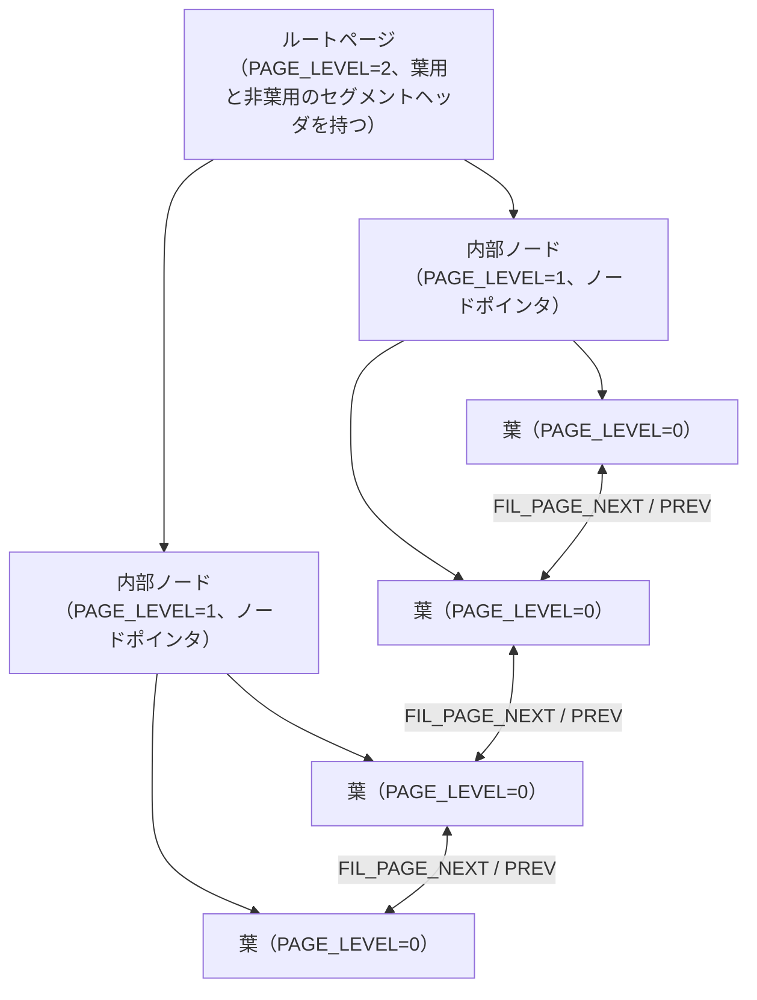

# 第17章 B+tree インデックス

> **本章で読むソース**
>
> - [`storage/innobase/include/btr0btr.h`](https://github.com/mysql/mysql-server/blob/mysql-8.4.10/storage/innobase/include/btr0btr.h)
> - [`storage/innobase/btr/btr0btr.cc`](https://github.com/mysql/mysql-server/blob/mysql-8.4.10/storage/innobase/btr/btr0btr.cc)
> - [`storage/innobase/btr/btr0cur.cc`](https://github.com/mysql/mysql-server/blob/mysql-8.4.10/storage/innobase/btr/btr0cur.cc)
> - [`storage/innobase/include/btr0cur.h`](https://github.com/mysql/mysql-server/blob/mysql-8.4.10/storage/innobase/include/btr0cur.h)
> - [`storage/innobase/include/dict0mem.h`](https://github.com/mysql/mysql-server/blob/mysql-8.4.10/storage/innobase/include/dict0mem.h)
> - [`storage/innobase/dict/dict0dict.cc`](https://github.com/mysql/mysql-server/blob/mysql-8.4.10/storage/innobase/dict/dict0dict.cc)

## この章の狙い

第14章で、16KB の INDEX ページが内部にレコードをキー順の一方向リストとして並べ、ページディレクトリで対数時間の二分探索を可能にすることを読んだ。
本章では、そのページを節点として木に組み上げる **B+tree** を読む。
InnoDB の通常のクラスタ化インデックスとセカンダリインデックスは、すべてこの1つのデータ構造の上に載っている。
空間インデックスの R-tree や全文検索（FTS）インデックスは別の構造をとる。

木として読むときの最初の問いは、データ本体がどこにあるかである。
InnoDB はテーブルの行そのものを**クラスタ化インデックス**の葉に格納し、それ以外のインデックスは**セカンダリインデックス**として、葉に主キー値だけを置く。
この違いを押さえたうえで、ルートから内部ノード、葉へと至るツリーの構造と、ページがあふれたときの**ページ分割**、空いたときの**ページのマージ**を `btr0btr.cc` で追う。

挿入の道筋には、木の形を変えずに1ページの中で完結する**楽観的挿入**と、ページ分割を伴って木構造を書き換える**悲観的挿入**の2つがある。
本章の中心は、後者がページのどこで分割するかを決めるヒューリスティックである。
昇順挿入という現実によくあるパターンを検出し、半分ずつに割るのをやめて偏った分割を選ぶことで、B+tree の充填率を上げる工夫を機構レベルで読む。

## 前提

第13章でテーブルスペースとファイル空間管理を、第14章でページとレコードのフォーマットを読んだ。
本章はそれらのページを節点として扱い、ページ間のリンクをたどる。
ページ内のレコード走査やページディレクトリの二分探索は第14章の範囲とし、本章では木をまたぐ部分に絞る。

木をまたぐ検索（ルートから目的の葉へ降りるカーソル）の詳細は第18章へ送る。
本章は木の構造そのものと、挿入や削除によって木の形が変わる場面を扱う。

## クラスタ化インデックスとセカンダリインデックス

InnoDB のインデックスは、ディクショナリ上では `dict_index_t` という構造体で表される。
そのインデックスがクラスタ化インデックスかどうかは、`type` の `DICT_CLUSTERED` ビットで区別する。

[`storage/innobase/include/dict0mem.h` L1311-L1315](https://github.com/mysql/mysql-server/blob/mysql-8.4.10/storage/innobase/include/dict0mem.h#L1311-L1315)

```cpp
  bool is_clustered() const {
    ut_ad(magic_n == DICT_INDEX_MAGIC_N);

    return (type & DICT_CLUSTERED);
  }
```

クラスタ化インデックスは、テーブルにつき1つだけ存在し、主キーの順序で行データ本体を葉に並べる。
主キーを定義しないテーブルでは、6バイトの行 ID `DB_ROW_ID` が補われ、それがクラスタ化キーになる。
行の列と隠れ列 `DB_TRX_ID`、`DB_ROLL_PTR` は、原則としてこのクラスタ化インデックスの葉レコードに収まる。
ただし葉レコードに収まらない大きな値はページ外へ追い出され、葉には20バイトの参照だけが残る（第22章）。
つまりクラスタ化インデックスは、行を主キー順に整列して格納する木そのものである。

セカンダリインデックスは、ユーザが定義した列の値で並ぶ別の木である。
その葉レコードは、インデックス列の値に加えて、対応する行のクラスタ化キー（主キー）の値を持つ。
セカンダリインデックスから行本体へ到達するには、葉で得た主キー値でクラスタ化インデックスをもう一度たどる必要がある。
この二段の探索を**回り込み**（covering でないインデックスでの主キー参照）と呼び、セカンダリインデックスが行ポインタではなく主キー値を持つことの帰結である。

木の各段を区別するのに使われるのが、第14章で見た `PAGE_LEVEL` である。
葉のレベルは0で、ルートに向かって1ずつ増える。
クラスタ化インデックスとセカンダリインデックスは、葉レコードの中身が違うだけで、木の骨格（ルート、内部ノード、葉、ページ間リンク）は共通である。

## ツリーの構造

各 B+tree には、ファイル空間上の決まったページに**ルートページ**がある。
ルートのページ番号は `dict_index_t` が保持し、`btr_root_block_get` がそれをたどってルートブロックを取得する。

[`storage/innobase/btr/btr0btr.cc` L165-L191](https://github.com/mysql/mysql-server/blob/mysql-8.4.10/storage/innobase/btr/btr0btr.cc#L165-L191)

```cpp
buf_block_t *btr_root_block_get(
    const dict_index_t *index, /*!< in: index tree */
    ulint mode,                /*!< in: either RW_S_LATCH
                               or RW_X_LATCH */
    mtr_t *mtr)                /*!< in: mtr */
{
  const space_id_t space_id = dict_index_get_space(index);
  const page_id_t page_id(space_id, dict_index_get_page(index));
  const page_size_t page_size(dict_table_page_size(index->table));

  buf_block_t *block =
      btr_block_get(page_id, page_size, mode, UT_LOCATION_HERE, index, mtr);

  btr_assert_not_corrupted(block, index);
#ifdef UNIV_BTR_DEBUG
  if (!dict_index_is_ibuf(index)) {
    const page_t *root = buf_block_get_frame(block);

    ut_a(btr_root_fseg_validate(FIL_PAGE_DATA + PAGE_BTR_SEG_LEAF + root,
                                space_id));
    ut_a(btr_root_fseg_validate(FIL_PAGE_DATA + PAGE_BTR_SEG_TOP + root,
                                space_id));
  }
#endif /* UNIV_BTR_DEBUG */

  return (block);
}
```

ルートページは、木全体への入口であると同時に、葉用と非葉用の2つのファイルセグメントヘッダ（`PAGE_BTR_SEG_LEAF` と `PAGE_BTR_SEG_TOP`）を持つ特別なページである。
これらのセグメントヘッダは、木が成長してもルートのページ番号が変わらないことを保証する。
木の高さが増しても入口の位置が動かないため、ディクショナリにルートのページ番号を1つ記録しておくだけで木全体を参照できる。

ルートより下の段は、内部ノードと葉に分かれる。
葉には実データ（クラスタ化なら行本体、セカンダリなら主キー値つきのインデックスエントリ）が入り、内部ノードには子ページを指す**ノードポインタ**が入る。
ノードポインタは `dict_index_build_node_ptr` が組み立てる。

[`storage/innobase/dict/dict0dict.cc` L3687-L3710](https://github.com/mysql/mysql-server/blob/mysql-8.4.10/storage/innobase/dict/dict0dict.cc#L3687-L3710)

```cpp
  tuple = dtuple_create(heap, n_unique + 1);

  /* When searching in the tree for the node pointer, we must not do
  comparison on the last field, the page number field, as on upper
  levels in the tree there may be identical node pointers with a
  different page number; therefore, we set the n_fields_cmp to one
  less: */

  dtuple_set_n_fields_cmp(tuple, n_unique);

  dict_index_copy_types(tuple, index, n_unique);

  buf = static_cast<byte *>(mem_heap_alloc(heap, 4));

  mach_write_to_4(buf, page_no);

  field = dtuple_get_nth_field(tuple, n_unique);
  dfield_set_data(field, buf, 4);

  dtype_set(dfield_get_type(field), DATA_SYS_CHILD, DATA_NOT_NULL, 4);

  rec_copy_prefix_to_dtuple(tuple, rec, index, n_unique, heap);
  dtuple_set_info_bits(tuple,
                       dtuple_get_info_bits(tuple) | REC_STATUS_NODE_PTR);
```

ノードポインタは、子ページの最小キーを一意に決めるだけのキー前置部分と、子ページのページ番号（4バイト）を末尾に並べたタプルである。
キー前置部分の長さ `n_unique` は `dict_index_get_n_unique_in_tree_nonleaf` が返し、行を一意に特定するのに足りる列数だけを取る。
ノードポインタのレコード種別には `REC_STATUS_NODE_PTR` が立ち、第14章で見たレコードヘッダの3ビット種別が001になる。
比較に使うフィールド数を `n_fields_cmp` でページ番号フィールドの手前までに制限しているのは、上位の段では同じキーで別ページを指すノードポインタが共存しうるため、ページ番号で比較してはならないからである。

同じ段に並ぶページは、第14章で見た `FIL_PAGE_PREV` と `FIL_PAGE_NEXT` で双方向リストにつながれている。
このリンクは最小キーの順序で張られ、葉の段では端から端まで順にたどることで全件の範囲スキャンができる。
ルート、内部ノード、葉、そして葉の双方向リンクをまとめると、木は次の形になる。



ノードポインタは下向きに子を指し、同じ段のページ間リンクは横向きに隣を指す。
範囲スキャンは、目的の開始キーを持つ葉までルートから降り、そこから葉のリンクを横にたどって終了キーまで読む。
この横方向のリンクがあるおかげで、範囲スキャンの2件目以降はルートへ戻らずに次の葉へ進める。

## ページ分割と挿入

挿入は、まず木を降りて目的の葉ページにカーソルを置き、そのページにレコードを書き込む。
ページに空きがあれば、`btr_cur_optimistic_insert` が1ページ内で挿入を完了する。

[`storage/innobase/btr/btr0cur.cc` L2663-L2684](https://github.com/mysql/mysql-server/blob/mysql-8.4.10/storage/innobase/btr/btr0cur.cc#L2663-L2684)

```cpp
dberr_t btr_cur_optimistic_insert(
    ulint flags,         /*!< in: undo logging and locking flags: if not
                         zero, the parameters index and thr should be
                         specified */
    btr_cur_t *cursor,   /*!< in: cursor on page after which to insert;
                         cursor stays valid */
    ulint **offsets,     /*!< out: offsets on *rec */
    mem_heap_t **heap,   /*!< in/out: pointer to memory heap, or NULL */
    dtuple_t *entry,     /*!< in/out: entry to insert */
    rec_t **rec,         /*!< out: pointer to inserted record if
                         succeed */
    big_rec_t **big_rec, /*!< out: big rec vector whose fields have to
                         be stored externally by the caller, or
                         NULL */
    que_thr_t *thr,      /*!< in: query thread or NULL */
    mtr_t *mtr)          /*!< in/out: mini-transaction;
                         if this function returns DB_SUCCESS on
                         a leaf page of a secondary index in a
                         compressed tablespace, the caller must
                         mtr_commit(mtr) before latching
                         any further pages */
{
```

楽観的挿入は、対象ページだけに X ラッチを取り、木全体のラッチを必要としない。
レコードが現在のページに収まる限り、木構造は一切変わらず、親をたどることもない。
ほとんどの挿入はこの経路で完了する。

レコードが収まらないとき、挿入は悲観的な経路に切り替わり、最終的に `btr_page_split_and_insert` がページを2枚に割る。
この関数は、自身の冒頭コメントが述べるように、いったん始めたら巻き戻せない。

[`storage/innobase/btr/btr0btr.cc` L2298-L2314](https://github.com/mysql/mysql-server/blob/mysql-8.4.10/storage/innobase/btr/btr0btr.cc#L2298-L2314)

```cpp
/** Splits an index page to halves and inserts the tuple. It is assumed
 that mtr holds an x-latch to the index tree. NOTE: the tree x-latch is
 released within this function! NOTE that the operation of this
 function must always succeed, we cannot reverse it: therefore enough
 free disk space (2 pages) must be guaranteed to be available before
 this function is called.
 @return inserted record */
rec_t *btr_page_split_and_insert(
    uint32_t flags,        /*!< in: undo logging and locking flags */
    btr_cur_t *cursor,     /*!< in: cursor at which to insert; when the
                           function returns, the cursor is positioned
                           on the predecessor of the inserted record */
    ulint **offsets,       /*!< out: offsets on inserted record */
    mem_heap_t **heap,     /*!< in/out: pointer to memory heap, or NULL */
    const dtuple_t *tuple, /*!< in: tuple to insert */
    mtr_t *mtr)            /*!< in: mtr */
{
```

巻き戻せない操作だからこそ、開始前に2ページ分の空きディスクが確保されていなければならない。
分割は、新しいページを割り当て、もとのページのレコードを分割点で2つに分け、片方を新ページへ移し、親に新ページへのノードポインタを挿入する、という一連の修正からなる。
これらは1つのミニトランザクションにまとまり、途中でクラッシュしても redo ログから一貫した状態に復旧する。

分割の手順は、関数内の番号付きコメントが順に示している。
最初の山は、どのレコードを境にページを割るか、つまり**分割点**の決定である。

[`storage/innobase/btr/btr0btr.cc` L2383-L2421](https://github.com/mysql/mysql-server/blob/mysql-8.4.10/storage/innobase/btr/btr0btr.cc#L2383-L2421)

```cpp
  /* 1. Decide the split record; split_rec == NULL means that the
  tuple to be inserted should be the first record on the upper
  half-page */
  insert_left = false;

  if (n_iterations > 0) {
    direction = FSP_UP;
    hint_page_no = page_no + 1;
    split_rec = btr_page_get_split_rec(cursor, tuple);

    if (split_rec == nullptr) {
      insert_left =
          btr_page_tuple_smaller(cursor, tuple, offsets, n_uniq, heap);
    }
  } else if (btr_page_get_split_rec_to_right(cursor, &split_rec)) {
    direction = FSP_UP;
    hint_page_no = page_no + 1;

  } else if (btr_page_get_split_rec_to_left(cursor, &split_rec)) {
    direction = FSP_DOWN;
    hint_page_no = page_no - 1;
    ut_ad(split_rec);
  } else {
    direction = FSP_UP;
    hint_page_no = page_no + 1;

    /* If there is only one record in the index page, we
    can't split the node in the middle by default. We need
    to determine whether the new record will be inserted
    to the left or right. */

    if (page_get_n_recs(page) > 1) {
      split_rec = page_get_middle_rec(page);
    } else if (btr_page_tuple_smaller(cursor, tuple, offsets, n_uniq, heap)) {
      split_rec = page_rec_get_next(page_get_infimum_rec(page));
    } else {
      split_rec = nullptr;
    }
  }
```

この分岐が分割点の決定の中核である。
判定は優先順位つきで、まず右への偏り（`btr_page_get_split_rec_to_right`）、次に左への偏り（`btr_page_get_split_rec_to_left`）を試し、どちらの偏りも検出できないときだけ、最後の `else` でページ中央 `page_get_middle_rec` を境にする。
ページにレコードが1件しかないときは中央で割れないため、挿入キーが既存レコードより小さいか（`btr_page_tuple_smaller`）で左右どちらの新ページに置くかを決める。
分割方向 `direction` が `FSP_UP` なら新ページを右隣に、`FSP_DOWN` なら左隣に割り当て、隣接ページ番号をヒントとして渡す。

### 昇順挿入を検出する分割点ヒューリスティック

右への偏りを判定する `btr_page_get_split_rec_to_right` が、本章の中心となる最適化である。

[`storage/innobase/btr/btr0btr.cc` L1716-L1746](https://github.com/mysql/mysql-server/blob/mysql-8.4.10/storage/innobase/btr/btr0btr.cc#L1716-L1746)

```cpp
  /* We use eager heuristics: if the new insert would be right after
  the previous insert on the same page, we assume that there is a
  pattern of sequential inserts here. */

  if (page_header_get_ptr(page, PAGE_LAST_INSERT) == insert_point) {
    rec_t *next_rec;

    next_rec = page_rec_get_next(insert_point);

    if (page_rec_is_supremum(next_rec)) {
    split_at_new:
      /* Split at the new record to insert */
      *split_rec = nullptr;
    } else {
      rec_t *next_next_rec = page_rec_get_next(next_rec);
      if (page_rec_is_supremum(next_next_rec)) {
        goto split_at_new;
      }

      /* If there are >= 2 user records up from the insert
      point, split all but 1 off. We want to keep one because
      then sequential inserts can use the adaptive hash
      index, as they can do the necessary checks of the right
      search position just by looking at the records on this
      page. */

      *split_rec = next_next_rec;
    }

    return true;
  }
```

この判定は、第14章で見たページヘッダの `PAGE_LAST_INSERT`（直前に挿入したレコードの位置）を手がかりにする。
新しい挿入点が直前の挿入点の直後なら、連続した昇順挿入のパターンだとみなす。
このとき分割点を中央ではなく、挿入点のごく近く（新レコードそのもの、または挿入点から2件目の `next_next_rec`）に寄せる。
結果として、もとのページにはほぼ全件が残り、新ページにはわずかな件数だけが移る。

なぜ中央で割らないほうがよいのか。
主キーが `AUTO_INCREMENT` のような単調増加列のとき、挿入はつねに木のいちばん右の葉に来る。
ここを律儀に半分ずつ割ると、左半分には二度と挿入が来ず、各ページはおよそ半分しか埋まらないまま固定される。
偏った分割なら、満杯になった古いページはほぼ満杯のまま残り、新しい挿入は新ページに集まる。
このため昇順挿入のもとでも各ページの充填率が高く保たれ、同じ件数をより少ないページに収められる。

対称的に、左への偏り `btr_page_get_split_rec_to_left` は、挿入が降順に左へ集まるパターンを検出して分割点を左に寄せる。

[`storage/innobase/btr/btr0btr.cc` L1679-L1695](https://github.com/mysql/mysql-server/blob/mysql-8.4.10/storage/innobase/btr/btr0btr.cc#L1679-L1695)

```cpp
  if (page_header_get_ptr(page, PAGE_LAST_INSERT) ==
      page_rec_get_next(insert_point)) {
    infimum = page_get_infimum_rec(page);

    /* If the convergence is in the middle of a page, include also
    the record immediately before the new insert to the upper
    page. Otherwise, we could repeatedly move from page to page
    lots of records smaller than the convergence point. */

    if (infimum != insert_point && page_rec_get_next(infimum) != insert_point) {
      *split_rec = insert_point;
    } else {
      *split_rec = page_rec_get_next(insert_point);
    }

    return true;
  }
```

ランダムな挿入では、`PAGE_LAST_INSERT` との一致が起きにくく、どちらの偏りも検出されない。
その場合は中央分割になり、B+tree は左右が均等に育つ。
偏りの検出と中央分割の使い分けによって、昇順、降順、ランダムのどのパターンでも充填率が極端に悪化しないようにしている。

### 楽観的な分割と悲観的な分割

分割の途中には、木全体のラッチを早めに手放せる場合がある。
葉での分割で、挿入が分割後の片方のページに確実に収まると見込めるときは、木の X ラッチを解放してよい。

[`storage/innobase/btr/btr0btr.cc` L2477-L2505](https://github.com/mysql/mysql-server/blob/mysql-8.4.10/storage/innobase/btr/btr0btr.cc#L2477-L2505)

```cpp
  /* If the split is made on the leaf level and the insert will fit
  on the appropriate half-page, we may release the tree x-latch.
  We can then move the records after releasing the tree latch,
  thus reducing the tree latch contention. */

  if (split_rec) {
    insert_will_fit =
        !new_page_zip &&
        btr_page_insert_fits(cursor, split_rec, offsets, tuple, heap);
  } else {
    if (!insert_left) {
      ut::delete_arr(buf);
      buf = nullptr;
    }

    insert_will_fit =
        !new_page_zip &&
        btr_page_insert_fits(cursor, nullptr, offsets, tuple, heap);
  }

  if (!srv_read_only_mode && !cursor->index->table->is_intrinsic() &&
      insert_will_fit && page_is_leaf(page) &&
      !dict_index_is_online_ddl(cursor->index)) {
    mtr->memo_release(dict_index_get_lock(cursor->index),
                      MTR_MEMO_X_LOCK | MTR_MEMO_SX_LOCK);

    /* NOTE: We cannot release root block latch here, because it
    has segment header and already modified in most of cases.*/
  }
```

`btr_page_insert_fits` が、分割後に挿入レコードが入る側のページへ確実に収まると判定したとき、`insert_will_fit` が立つ。
このとき木全体の X ラッチをミニトランザクションから解放し、以降のレコード移動は対象ページのラッチだけで進める。
木のラッチは全挿入が奪い合う資源なので、収まりが確定した時点で早く手放すことで、木全体の競合を減らす。

それでも挿入が収まらないとき、関数の末尾は分割をやり直す。

[`storage/innobase/btr/btr0btr.cc` L2648-L2664](https://github.com/mysql/mysql-server/blob/mysql-8.4.10/storage/innobase/btr/btr0btr.cc#L2648-L2664)

```cpp
  if (rec == nullptr) {
    /* The insert did not fit on the page: loop back to the
    start of the function for a new split */
  insert_failed:
    /* We play safe and reset the free bits for new_page */
    if (!cursor->index->is_clustered() &&
        !cursor->index->table->is_temporary()) {
      ibuf_reset_free_bits(new_block);
      ibuf_reset_free_bits(block);
    }

    n_iterations++;
    ut_ad(n_iterations < 2 || buf_block_get_page_zip(insert_block));
    ut_ad(!insert_will_fit);

    goto func_start;
  }
```

1回目の分割でも収まらないと、`n_iterations` を増やして関数先頭の `func_start` へ戻り、もう一度分割する。
2回目以降の分割点は、ヒューリスティックではなく `btr_page_get_split_rec` が選ぶ。
これは、挿入レコードが確実に半ページに収まる位置を、レコードサイズを積算して計算する関数である。

[`storage/innobase/btr/btr0btr.cc` L1806-L1834](https://github.com/mysql/mysql-server/blob/mysql-8.4.10/storage/innobase/btr/btr0btr.cc#L1806-L1834)

```cpp
  /* We start to include records to the left half, and when the
  space reserved by them exceeds half of total_space, then if
  the included records fit on the left page, they will be put there
  if something was left over also for the right page,
  otherwise the last included record will be the first on the right
  half page */

  do {
    /* Decide the next record to include */
    if (rec == ins_rec) {
      rec = nullptr; /* NULL denotes that tuple is
                  now included */
    } else if (rec == nullptr) {
      rec = page_rec_get_next(ins_rec);
    } else {
      rec = page_rec_get_next(rec);
    }

    if (rec == nullptr) {
      /* Include tuple */
      incl_data += insert_size;
    } else {
      offsets = rec_get_offsets(rec, cursor->index, offsets, ULINT_UNDEFINED,
                                UT_LOCATION_HERE, &heap);
      incl_data += rec_offs_size(offsets);
    }

    n++;
  } while (incl_data + page_dir_calc_reserved_space(n) < total_space / 2);
```

この関数は、左半分にレコードを1件ずつ含めながら、確保サイズが全体の半分を超えた時点で打ち切る。
挿入レコードの実サイズを含めて積算するため、可変長レコードが極端に偏っていても、分割後に挿入が片方に収まる位置を選べる。
ヒューリスティックで偏らせた分割が結局収まらなかったときの、確実に成立する後退手段である。

木のルートが満杯になった場合は、`btr_root_raise_and_insert` が木の高さを1段増やす。

[`storage/innobase/btr/btr0btr.cc` L1532-L1538](https://github.com/mysql/mysql-server/blob/mysql-8.4.10/storage/innobase/btr/btr0btr.cc#L1532-L1538)

```cpp
  /* Allocate a new page to the tree. Root splitting is done by first
  moving the root records to the new page, emptying the root, putting
  a node pointer to the new page, and then splitting the new page. */

  level = btr_page_get_level(root);

  new_block = btr_page_alloc(index, 0, FSP_NO_DIR, level, mtr, mtr);
```

ルート分割は、まずルートの全レコードを新ページへ移してルートを空にし、新ページへのノードポインタをルートに置いてから、その新ページを分割する。
この手順を取ることで、ルートのページ番号を変えずに木を高くできる。
ルートの位置が固定されているおかげで、木が何段成長してもディクショナリの参照を書き換えずに済む。

## ページのマージと縮約

削除によってページが空いてくると、木は逆向きに縮む。
悲観的な削除でページのデータサイズが一定の閾値を下回ると、`btr_compress` が隣接ページとのマージを試みる。
閾値は `BTR_CUR_PAGE_COMPRESS_LIMIT` が決める。

[`storage/innobase/include/btr0cur.h` L608-L611](https://github.com/mysql/mysql-server/blob/mysql-8.4.10/storage/innobase/include/btr0cur.h#L608-L611)

```cpp
/** In the pessimistic delete, if the page data size drops below this
limit, merging it to a neighbor is tried */
#define BTR_CUR_PAGE_COMPRESS_LIMIT(index) \
  ((UNIV_PAGE_SIZE * (ulint)((index)->merge_threshold)) / 100)
```

閾値はページサイズに `merge_threshold` パーセントを掛けた値で、`merge_threshold` の既定は50である。

[`storage/innobase/include/dict0mem.h` L1041-L1041](https://github.com/mysql/mysql-server/blob/mysql-8.4.10/storage/innobase/include/dict0mem.h#L1041-L1041)

```cpp
constexpr uint32_t DICT_INDEX_MERGE_THRESHOLD_DEFAULT = 50;
```

つまり既定では、ページの使用量が半分を切るとマージの対象になる。
この値はインデックスごとに変更でき、マージを起こしにくくすればページの再編が減り、起こしやすくすれば空き領域の回収が早まる。

`btr_compress` はまず、対象ページの親（ノードポインタを持つページ）を `btr_page_get_father_block` で突き止め、左右どちらの隣にマージするかを決める。

[`storage/innobase/btr/btr0btr.cc` L3068-L3069](https://github.com/mysql/mysql-server/blob/mysql-8.4.10/storage/innobase/btr/btr0btr.cc#L3068-L3069)

```cpp
  left_page_no = btr_page_get_prev(page, mtr);
  right_page_no = btr_page_get_next(page, mtr);
```

左右の隣ページ番号は、第14章で見た `FIL_PAGE_PREV` と `FIL_PAGE_NEXT` から得る。
両隣がともに存在しない（このページが段に1枚だけ）なら、マージではなく親へレコードを引き上げて木を1段低くする。

[`storage/innobase/btr/btr0btr.cc` L3106-L3112](https://github.com/mysql/mysql-server/blob/mysql-8.4.10/storage/innobase/btr/btr0btr.cc#L3106-L3112)

```cpp
  if (left_page_no == FIL_NULL && right_page_no == FIL_NULL) {
    /* The page is the only one on the level, lift the records
    to the father */

    merge_block = btr_lift_page_up(index, block, mtr);
    goto func_exit;
  }
```

隣がある場合は、マージできるかどうかを `btr_can_merge_with_page` が判定する。

[`storage/innobase/btr/btr0btr.cc` L4698-L4705](https://github.com/mysql/mysql-server/blob/mysql-8.4.10/storage/innobase/btr/btr0btr.cc#L4698-L4705)

```cpp
  n_recs = page_get_n_recs(page);
  data_size = page_get_data_size(page);

  max_ins_size_reorg = page_get_max_insert_size_after_reorganize(mpage, n_recs);

  if (data_size > max_ins_size_reorg) {
    goto error;
  }
```

判定は単純で、対象ページの全レコードが隣ページの空きに（必要なら隣を再編成したうえで）収まるかを確かめる。
収まるなら、対象ページのレコードを隣へ移し、対象ページを段の双方向リストから外して、親からそのノードポインタを取り除く。
この一連の操作も1つのミニトランザクションにまとまり、分割と同様に redo ログで保護される。

マージによって木は密になり、削除が進んでも葉ページがまばらに散らばらない。
分割が充填率の上限側を、マージが下限側をそれぞれ支え、両者で木の密度を一定の幅に保つ。

## まとめ

InnoDB の通常のクラスタ化インデックスとセカンダリインデックスは B+tree であり（空間 R-tree や全文 FTS は別構造）、クラスタ化インデックスは葉に行本体を主キー順で持ち、セカンダリインデックスは葉にインデックス値と主キー値を持つ。
木はルート、内部ノード、葉からなり、内部ノードのノードポインタが下向きに子を指し、同じ段のページは `FIL_PAGE_PREV` と `FIL_PAGE_NEXT` で双方向にリンクされて範囲スキャンの横移動を支える。
挿入は、1ページで完結する楽観的挿入と、`btr_page_split_and_insert` がページを割る悲観的挿入に分かれ、後者は分割点を決めてから新ページを割り当て、親にノードポインタを挿入する。
分割点の決定は `btr_page_get_split_rec_to_right` と `btr_page_get_split_rec_to_left` が `PAGE_LAST_INSERT` から昇順や降順の挿入を検出し、中央分割をやめて偏った分割を選ぶことで充填率を高く保つ。
削除側では `btr_compress` が `merge_threshold`（既定50パーセント）を下回ったページを隣とマージし、分割と対をなして木の密度を一定の幅に維持する。

## 関連する章

- [第14章 ページとレコードのフォーマット](../part02-innodb-foundation/14-page-and-record-format.md)：本章のページ1枚の内部構造と、ページディレクトリによるページ内二分探索を扱う。
- [第16章 ミニトランザクション](../part02-innodb-foundation/16-mini-transaction.md)：本章の分割やマージを1つの原子的な単位にまとめ、redo ログで保護する仕組みを扱う。
- [第18章 レコード検索とカーソル](18-search-and-cursor.md)：本章の木をルートから葉へ降りる探索と、葉のリンクをたどるカーソル移動を扱う。
- [第19章 行の挿入、更新、削除](19-row-dml.md)：本章の楽観的挿入と悲観的挿入を、行 DML の処理全体の中に位置づける。
- [第21章 アダプティブハッシュインデックス](21-adaptive-hash-index.md)：本章の分割ヒューリスティックが1件残す理由となる、ページ内探索位置のハッシュキャッシュを扱う。
