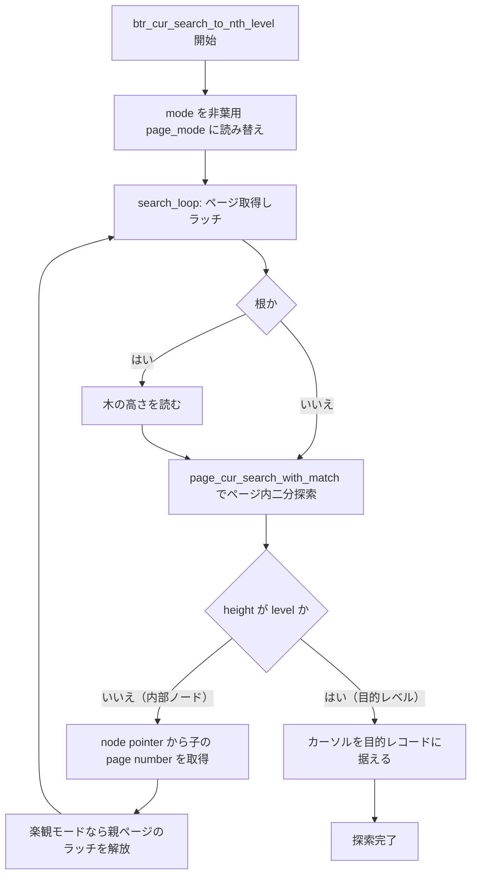
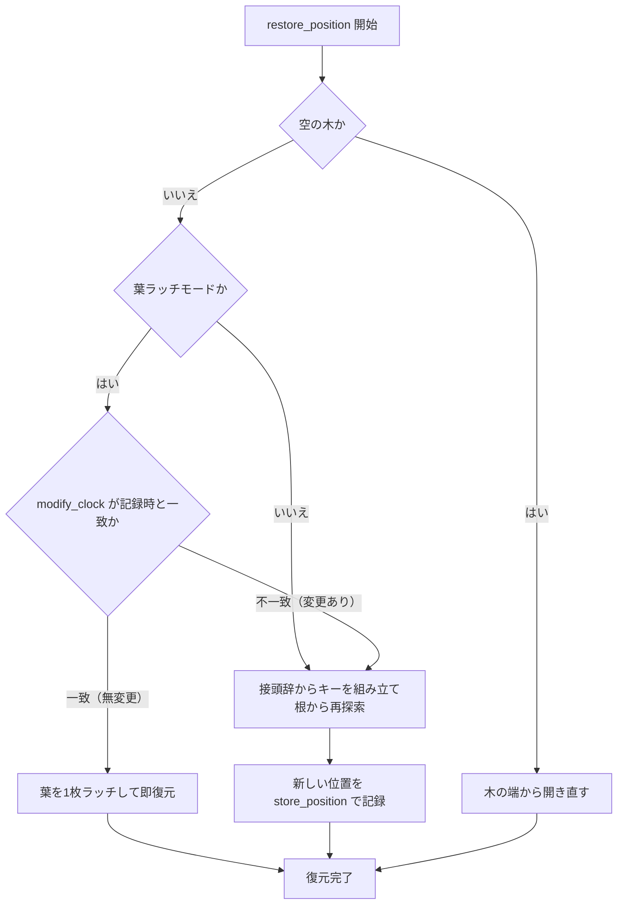

# 第18章 レコード検索とカーソル

> **本章で読むソース**
>
> - [`storage/innobase/btr/btr0cur.cc`](https://github.com/mysql/mysql-server/blob/mysql-8.4.10/storage/innobase/btr/btr0cur.cc)
> - [`storage/innobase/page/page0cur.cc`](https://github.com/mysql/mysql-server/blob/mysql-8.4.10/storage/innobase/page/page0cur.cc)
> - [`storage/innobase/include/page0cur.h`](https://github.com/mysql/mysql-server/blob/mysql-8.4.10/storage/innobase/include/page0cur.h)
> - [`storage/innobase/include/page0cur.ic`](https://github.com/mysql/mysql-server/blob/mysql-8.4.10/storage/innobase/include/page0cur.ic)
> - [`storage/innobase/include/page0types.h`](https://github.com/mysql/mysql-server/blob/mysql-8.4.10/storage/innobase/include/page0types.h)
> - [`storage/innobase/btr/btr0pcur.cc`](https://github.com/mysql/mysql-server/blob/mysql-8.4.10/storage/innobase/btr/btr0pcur.cc)
> - [`storage/innobase/include/btr0pcur.h`](https://github.com/mysql/mysql-server/blob/mysql-8.4.10/storage/innobase/include/btr0pcur.h)
> - [`storage/innobase/include/btr0btr.h`](https://github.com/mysql/mysql-server/blob/mysql-8.4.10/storage/innobase/include/btr0btr.h)

## この章の狙い

第17章で、InnoDB のインデックスが B+tree であり、根から葉までが node pointer でつながることを読んだ。
第14章では、1枚の INDEX ページの内部をページディレクトリで二分探索する手順までを確認した。
本章は、この2つを縦につなぐ。
根のページから出発し、各ページで二分探索して次に降りる子を選び、葉に着いたら目的のレコードへカーソルを据える一連の流れを読む。

検索の主役は `btr0cur.cc` の `btr_cur_search_to_nth_level` である。
この関数は木を1レベルずつ降り、各ページで第14章の `page_cur_search_with_match` を呼んで子レコードを選ぶ。
降下のあいだ、木全体を1つのロックで止めるのではなく、ページのラッチを親から子へ順に渡していく。
この受け渡しが、多数のスレッドが同じ木を同時に探索できる土台になっている。

葉に着いてレコードを見つけても、ページのラッチを離せば位置はすぐ失われる。
SQL カーソルや行スキャンは、ラッチを解放した後でも同じ位置から再開したい。
そのための仕組みが `btr0pcur.cc` の**永続カーソル**である。
本章の後半では、永続カーソルがどう位置を退避し、次にどう復元するか、そして復元を速くする楽観的な近道を読む。

## 前提

第14章で、INDEX ページがページディレクトリのスロット配列を持ち、`page_cur_search_with_match` がスロットの二分探索と所有グループの線形走査の二段でページ内のレコードを探すことを読んだ。
本章はその関数を、木を降りる各ページで繰り返し呼ぶ側から見る。

第16章で、ミニトランザクション（mtr）がページラッチを取得し、mtr のコミットまでまとめて保持してから一括で解放することを読んだ。
本章の降下では、この mtr に**セーブポイント**を打ち、もう不要になった上位ページのラッチだけを途中で先に解放する。
ラッチの取得と解放の単位は mtr であり、その仕組みは第16章を前提とする。

ロックとラッチは別物である。
本章で扱う**ラッチ**は、ページの物理的な一貫性を短時間守る同期プリミティブであり、レコードロック（第26章）とは目的も寿命も異なる。

## 検索モードとラッチモード

探索の入口で、呼び出し側は2つのモードを指定する。
1つは何を探すかを表す**検索モード** `page_cur_mode_t`、もう1つは探索中にどの強さでラッチを取るかを表す**ラッチモード** `btr_latch_mode` である。

検索モードは、探索キーに対してカーソルをどの位置へ据えるかを決める。

[`storage/innobase/include/page0types.h` L176-198](https://github.com/mysql/mysql-server/blob/mysql-8.4.10/storage/innobase/include/page0types.h#L176-L198)

```cpp
enum page_cur_mode_t {
  PAGE_CUR_UNSUPP = 0,
  PAGE_CUR_G = 1,
  PAGE_CUR_GE = 2,
  PAGE_CUR_L = 3,
  PAGE_CUR_LE = 4,

  /*      PAGE_CUR_LE_OR_EXTENDS = 5,*/ /* This is a search mode used in
                                   "column LIKE 'abc%' ORDER BY column DESC";
                                   we have to find strings which are <= 'abc' or
                                   which extend it */

  /* These search mode is for search R-tree index. */
  PAGE_CUR_CONTAIN = 7,
  PAGE_CUR_INTERSECT = 8,
  PAGE_CUR_WITHIN = 9,
  PAGE_CUR_DISJOINT = 10,
  PAGE_CUR_MBR_EQUAL = 11,
  PAGE_CUR_RTREE_INSERT = 12,
  PAGE_CUR_RTREE_LOCATE = 13,
  PAGE_CUR_RTREE_GET_FATHER = 14,
  PAGE_CUR_NN = 15
};
```

`PAGE_CUR_GE` は探索キー以上の最初のレコード、`PAGE_CUR_G` はキーより大きい最初のレコードを指す。
`PAGE_CUR_LE` はキー以下の最後のレコード、`PAGE_CUR_L` はキーより小さい最後のレコードを指す。
範囲スキャンの始点や等値検索は `PAGE_CUR_GE`、挿入位置の特定は `PAGE_CUR_LE` を使う。
7番以降はすべて R-tree（空間インデックス）専用で、本章の B+tree 探索では使わない。

ラッチモードは、葉ページをどう守るかと、木全体を止めるかどうかを決める。

[`storage/innobase/include/btr0btr.h` L61-81](https://github.com/mysql/mysql-server/blob/mysql-8.4.10/storage/innobase/include/btr0btr.h#L61-L81)

```cpp
/** Latching modes for btr_cur_search_to_nth_level(). */
enum btr_latch_mode : size_t {
  /** Search a record on a leaf page and S-latch it. */
  BTR_SEARCH_LEAF = RW_S_LATCH,
  /** (Prepare to) modify a record on a leaf page and X-latch it. */
  BTR_MODIFY_LEAF = RW_X_LATCH,
  /** Obtain no latches. */
  BTR_NO_LATCHES = RW_NO_LATCH,
  /** Start modifying the entire B-tree. */
  BTR_MODIFY_TREE = 33,
  /** Continue modifying the entire B-tree. */
  BTR_CONT_MODIFY_TREE = 34,
  /** Search the previous record. */
  BTR_SEARCH_PREV = 35,
  /** Modify the previous record. */
  BTR_MODIFY_PREV = 36,
  /** Start searching the entire B-tree. */
  BTR_SEARCH_TREE = 37,
  /** Continue searching the entire B-tree. */
  BTR_CONT_SEARCH_TREE = 38
};
```

`BTR_SEARCH_LEAF` と `BTR_MODIFY_LEAF` が、本章で中心になる**楽観的**なラッチモードである。
読み取りは葉に S ラッチ、更新の準備は葉に X ラッチを取り、降下中の上位ページのラッチは順に手放す。
この2つは葉1枚をいじるだけで完了すると見込んだ経路であり、ほとんどの探索はここを通る。

`BTR_MODIFY_TREE` は**悲観的**なモードである。
ページ分割やマージが木の構造を上位へ波及させうるとき、インデックスの木ラッチを SX もしくは X で確保し、降下したページのラッチを途中で手放さずに保持し続ける。
楽観的経路で構造変更が必要だと判明したときに、このモードへ切り替えて再探索する。
楽観と悲観の使い分けは第19章の行操作で具体的に現れる。

## ツリーを降りる: btr_cur_search_to_nth_level

`btr_cur_search_to_nth_level` は、`level` で指定したレベルまで木を降りる。
葉まで降りるなら `level` は0である。
入口の引数で、探索対象 `tuple`、検索モード `mode`、ラッチモード `latch_mode` を受け取る。

[`storage/innobase/btr/btr0cur.cc` L620-648](https://github.com/mysql/mysql-server/blob/mysql-8.4.10/storage/innobase/btr/btr0cur.cc#L620-L648)

```cpp
void btr_cur_search_to_nth_level(
    dict_index_t *index,   /*!< in: index */
    ulint level,           /*!< in: the tree level of search */
    const dtuple_t *tuple, /*!< in: data tuple; NOTE: n_fields_cmp in
                           tuple must be set so that it cannot get
                           compared to the node ptr page number field! */
    page_cur_mode_t mode,  /*!< in: PAGE_CUR_L, ...;
                           Inserts should always be made using
                           PAGE_CUR_LE to search the position! */
    ulint latch_mode,      /*!< in: BTR_SEARCH_LEAF, ..., ORed with
                       at most one of BTR_INSERT, BTR_DELETE_MARK,
                       BTR_DELETE, or BTR_ESTIMATE;
                       cursor->left_block is used to store a pointer
                       to the left neighbor page, in the cases
                       BTR_SEARCH_PREV and BTR_MODIFY_PREV;
                       NOTE that if has_search_latch
                       is != 0, we maybe do not have a latch set
                       on the cursor page, we assume
                       the caller uses his search latch
                       to protect the record! */
    btr_cur_t *cursor,     /*!< in/out: tree cursor; the cursor page is
                           s- or x-latched, but see also above! */
    ulint has_search_latch,
    /*!< in: info on the latch mode the
    caller currently has on search system:
    RW_S_LATCH, or 0 */
    const char *file, /*!< in: file name */
    ulint line,       /*!< in: line where called */
    mtr_t *mtr)       /*!< in: mtr */
```

### 非葉ページでは検索モードを読み替える

探索本体に入る前に、`btr_cur_search_to_nth_level` は検索モードを非葉ページ用に読み替える。
利用者が指定した `mode` をそのまま全レベルに使うのではなく、内部ノードでは別の `page_mode` を使う。

[`storage/innobase/btr/btr0cur.cc` L897-918](https://github.com/mysql/mysql-server/blob/mysql-8.4.10/storage/innobase/btr/btr0cur.cc#L897-L918)

```cpp
  /* We use these modified search modes on non-leaf levels of the
  B-tree. These let us end up in the right B-tree leaf. In that leaf
  we use the original search mode. */

  switch (mode) {
    case PAGE_CUR_GE:
      page_mode = PAGE_CUR_L;
      break;
    case PAGE_CUR_G:
      page_mode = PAGE_CUR_LE;
      break;
    default:
#ifdef PAGE_CUR_LE_OR_EXTENDS
      ut_ad(mode == PAGE_CUR_L || mode == PAGE_CUR_LE ||
            RTREE_SEARCH_MODE(mode) || mode == PAGE_CUR_LE_OR_EXTENDS);
#else  /* PAGE_CUR_LE_OR_EXTENDS */
      ut_ad(mode == PAGE_CUR_L || mode == PAGE_CUR_LE ||
            RTREE_SEARCH_MODE(mode));
#endif /* PAGE_CUR_LE_OR_EXTENDS */
      page_mode = mode;
      break;
  }
```

葉で「キー以上の最初」（`PAGE_CUR_GE`）を探したいとき、内部ノードでは「キーより小さい最後」（`PAGE_CUR_L`）の node pointer を選ぶ。
内部ノードの各レコードは部分木の最小キーを表すので、探索キー未満で最大の node pointer をたどれば、目的のレコードを含みうる部分木へ確実に入れるからである。
葉に着いたときだけ、利用者が指定した本来の `mode` に戻して最終位置を決める。
この読み替えは降下の方向を正しく保つための工夫であり、葉での意味論を内部ノードへそのまま持ち込まないために要る。

### 降下ループ: ラッチを取り、子を選び、降りる

降下は `search_loop` ラベルへの `goto` で回るループである。
1周ごとに1つのページを取得し、二分探索し、子の page number を求めて次の周回に渡す。

[`storage/innobase/btr/btr0cur.cc` L920-925](https://github.com/mysql/mysql-server/blob/mysql-8.4.10/storage/innobase/btr/btr0cur.cc#L920-L925)

```cpp
  /* Loop and search until we arrive at the desired level */
  btr_latch_leaves_t latch_leaves = {{nullptr, nullptr, nullptr}, {0, 0, 0}};

search_loop:
  fetch = cursor->m_fetch_mode;
  rw_latch = RW_NO_LATCH;
```

ループはまず、このページをどの強さでラッチするかを決める。
葉でないページ（`height != 0`）では、原則として上位ページ用のラッチ `upper_rw_latch` を使う。
ただし `BTR_MODIFY_TREE` で木ラッチをすでに保持しているときは、個々のページにラッチを取らず `RW_NO_LATCH` のままにする。

[`storage/innobase/btr/btr0cur.cc` L928-954](https://github.com/mysql/mysql-server/blob/mysql-8.4.10/storage/innobase/btr/btr0cur.cc#L928-L954)

```cpp
  if (height != 0) {
    /* We are about to fetch the root or a non-leaf page. */
    if ((latch_mode != BTR_MODIFY_TREE || height == level) &&
        !retrying_for_search_prev) {
      /* If doesn't have SX or X latch of index,
      each pages should be latched before reading. */
      if (modify_external && height == ULINT_UNDEFINED &&
          upper_rw_latch == RW_S_LATCH) {
        /* needs sx-latch of root page
        for fseg operation */
        rw_latch = RW_SX_LATCH;
      } else {
        rw_latch = upper_rw_latch;
      }
    }
  } else if (latch_mode <= BTR_MODIFY_LEAF) {
    rw_latch = latch_mode;

    if (btr_op != BTR_NO_OP &&
        ibuf_should_try(index, btr_op != BTR_INSERT_OP)) {
      /* Try to buffer the operation if the leaf
      page is not in the buffer pool. */

      fetch = btr_op == BTR_DELETE_OP ? Page_fetch::IF_IN_POOL_OR_WATCH
                                      : Page_fetch::IF_IN_POOL;
    }
  }
```

ラッチの強さが決まると、`buf_page_get_gen` でページをバッファプールから取得する。
取得と同時にラッチがかかり、その savepoint を mtr に記録しておく。

[`storage/innobase/btr/btr0cur.cc` L956-964](https://github.com/mysql/mysql-server/blob/mysql-8.4.10/storage/innobase/btr/btr0cur.cc#L956-L964)

```cpp
retry_page_get:
  ut_ad(n_blocks < BTR_MAX_LEVELS);
  tree_savepoints[n_blocks] = mtr_set_savepoint(mtr);
  block = buf_page_get_gen(
      page_id, page_size, rw_latch,
      (height == ULINT_UNDEFINED ? index->search_info->root_guess : nullptr),
      fetch, {file, line}, mtr);

  tree_blocks[n_blocks] = block;
```

最初の周回では `height` が `ULINT_UNDEFINED` なので、取得したページが根である。
根のページ種別から木の高さを読み取り、`cursor->tree_height` に保持する。

[`storage/innobase/btr/btr0cur.cc` L1102-1107](https://github.com/mysql/mysql-server/blob/mysql-8.4.10/storage/innobase/btr/btr0cur.cc#L1102-L1107)

```cpp
  if (UNIV_UNLIKELY(height == ULINT_UNDEFINED)) {
    /* We are in the root node */

    height = btr_page_get_level(page);
    root_height = height;
    cursor->tree_height = root_height + 1;
```

ページが手元に来たら、ページ内検索を呼ぶ。
葉でアダプティブハッシュインデックスの更新材料が要る場合だけ `page_cur_search_with_match_bytes` を使い、それ以外は第14章で読んだ `page_cur_search_with_match` を呼ぶ。

[`storage/innobase/btr/btr0cur.cc` L1255-1261](https://github.com/mysql/mysql-server/blob/mysql-8.4.10/storage/innobase/btr/btr0cur.cc#L1255-L1261)

```cpp
  } else {
    /* Search for complete index fields. */
    up_bytes = low_bytes = 0;
    page_cur_search_with_match(block, index, tuple, page_mode, &up_match,
                               &low_match, page_cursor,
                               need_path ? cursor->rtr_info : nullptr);
  }
```

ここでまだ目的のレベルに達していなければ（`level != height`）、二分探索が選んだレコードは内部ノードの node pointer である。
そのレコードから子の page number を取り出し、`page_id` を子ページに付け替えて、`search_loop` へ戻る。

[`storage/innobase/btr/btr0cur.cc` L1541-1544](https://github.com/mysql/mysql-server/blob/mysql-8.4.10/storage/innobase/btr/btr0cur.cc#L1541-L1544)

```cpp
    /* Go to the child node */
    page_id.reset(space, btr_node_ptr_get_child_page_no(node_ptr, offsets));

    n_blocks++;
```

このループが「ページ内二分探索 → 子の特定 → 子ページへ降りる」を高さの回数だけ繰り返す。
葉に着くと `height == 0` になり、検索モードが本来の `mode` に戻され、ループを抜けてカーソルが目的のレコード位置に据えられる。

### 最適化: ラッチを親から子へ手渡す

降下の核心は、木全体を1つのロックで止めずに探索する点にある。
楽観的なラッチモードでは、葉に着いた時点でまず木の S ラッチを解放し、続いて上位ページのラッチを順に手放す。

[`storage/innobase/btr/btr0cur.cc` L1146-1174](https://github.com/mysql/mysql-server/blob/mysql-8.4.10/storage/innobase/btr/btr0cur.cc#L1146-L1174)

```cpp
        if (!s_latch_by_caller && !srv_read_only_mode && !modify_external) {
          /* Release the tree s-latch */
          /* NOTE: BTR_MODIFY_EXTERNAL
          needs to keep tree sx-latch */
          mtr_release_s_latch_at_savepoint(mtr, savepoint,
                                           dict_index_get_lock(index));
        }

        /* release upper blocks */
        if (retrying_for_search_prev) {
          for (; prev_n_releases < prev_n_blocks; prev_n_releases++) {
            mtr_release_block_at_savepoint(
                mtr, prev_tree_savepoints[prev_n_releases],
                prev_tree_blocks[prev_n_releases]);
          }
        }

        for (; n_releases < n_blocks; n_releases++) {
          if (n_releases == 0 && modify_external) {
            /* keep latch of root page */
            ut_ad(mtr_memo_contains_flagged(
                mtr, tree_blocks[n_releases],
                MTR_MEMO_PAGE_SX_FIX | MTR_MEMO_PAGE_X_FIX));
            continue;
          }

          mtr_release_block_at_savepoint(mtr, tree_savepoints[n_releases],
                                         tree_blocks[n_releases]);
        }
```

子のラッチを取ってから親のラッチを離す順序により、探索が任意の瞬間に保持するラッチは木の1経路の一部だけになる。
そのため、別のスレッドは同じ木の別の経路を同時に降りられるし、同じ経路でも親を離した後ろから追従できる。
これが、木全体を1つのロックで止める素朴な実装に比べて並行度を大きく上げる仕組みである。
理由は単純で、降下は親から子へ一方向にしか進まないため、子を確保したあとの親はその探索にとって用済みになるからである。

悲観的な `BTR_MODIFY_TREE` だけは例外で、構造変更が上位へ波及しうるぶん、降下したページのラッチを葉まで保持し続ける。
この場合でも木ラッチは SX で取るので、別スレッドの読み取り（S）とは両立し、書き込み同士だけが直列化される。

降下の全体像を図示する。



## ページ内検索の入口: page_cur_search

各ページでの検索は、第14章で読んだ `page_cur_search_with_match` が担う。
`btr_cur_search_to_nth_level` はこの関数を直接呼ぶが、上位レイヤやほかの呼び出し側のために、戻り値を簡略化したインライン版 `page_cur_search` も用意されている。

[`storage/innobase/include/page0cur.ic` L161-173](https://github.com/mysql/mysql-server/blob/mysql-8.4.10/storage/innobase/include/page0cur.ic#L161-L173)

```cpp
static inline ulint page_cur_search(const buf_block_t *block,
                                    const dict_index_t *index,
                                    const dtuple_t *tuple, page_cur_mode_t mode,
                                    page_cur_t *cursor) {
  ulint low_match = 0;
  ulint up_match = 0;

  ut_ad(dtuple_check_typed(tuple));

  page_cur_search_with_match(block, index, tuple, mode, &up_match, &low_match,
                             cursor, nullptr);
  return (low_match);
}
```

`page_cur_search` は `up_match` と `low_match` をローカルに用意して `page_cur_search_with_match` に渡し、下限側の一致フィールド数だけを返す薄いラッパーである。
`up_match` と `low_match` は、探索位置の上下のレコードが探索キーと先頭から何フィールド一致したかを表す。
降下では、この一致数を上位ページから引き継いで下位ページの比較開始点に使うため、同じ接頭辞の比較を各レベルでやり直さずに済む。

### ページ内検索の最適化: 単調挿入の近道

`page_cur_search_with_match` は、二分探索に入る前に1つの近道を試す。
直前まで右端への挿入が続いているページで `PAGE_CUR_LE` を探すなら、ページ末尾の付近に答えがある公算が高い。

[`storage/innobase/page/page0cur.cc` L373-382](https://github.com/mysql/mysql-server/blob/mysql-8.4.10/storage/innobase/page/page0cur.cc#L373-L382)

```cpp
#ifdef PAGE_CUR_ADAPT
  if (page_is_leaf(page) && (mode == PAGE_CUR_LE) &&
      !dict_index_is_spatial(index) &&
      (page_header_get_field(page, PAGE_N_DIRECTION) > 3) &&
      (page_header_get_ptr(page, PAGE_LAST_INSERT)) &&
      (page_header_get_field(page, PAGE_DIRECTION) == PAGE_RIGHT)) {
    if (page_cur_try_search_shortcut(block, index, tuple, iup_matched_fields,
                                     ilow_matched_fields, cursor)) {
      return;
    }
```

`PAGE_DIRECTION` が右向きで、その向きの連続挿入回数 `PAGE_N_DIRECTION` が3を超えているとき、直近の挿入位置を起点に近道を試す。
近道が当たれば二分探索を丸ごと省ける。
オートインクリメントの主キーのように昇順で挿入が続く典型的な負荷では、挿入位置の特定がほぼ定数時間になる。
これは、ワークロードの偏り（単調増加）をページヘッダの統計で検知して、平均計算量を下げる工夫である。
近道が外れたら通常の二分探索に落ちるので、判定を誤っても正しさは保たれる。

近道が当たらない通常経路では、第14章で読んだとおり、ページディレクトリのスロットを二分探索し、所有グループ内を線形に走査して目的レコードを確定する。

## ラッチを跨いで位置を保つ: btr_pcur

`btr_cur_search_to_nth_level` が据えるカーソルは、ページのラッチが生きているあいだだけ有効である。
mtr をコミットしてラッチを解放すれば、そのページは他スレッドに更新されうるので、生のレコードポインタは当てにできなくなる。
それでも SQL カーソルや行スキャンは、ラッチを解放した後に同じ位置から再開したい。
この要求に応えるのが**永続カーソル** `btr_pcur_t` である。

永続カーソルは、ラッチを離す前に位置を「記録」し、再開時に位置を「復元」する。
記録するのは、レコードそのものへのポインタではなく、レコードを再発見するための手がかりである。

[`storage/innobase/include/btr0pcur.h` L50-62](https://github.com/mysql/mysql-server/blob/mysql-8.4.10/storage/innobase/include/btr0pcur.h#L50-L62)

```cpp
/** Relative positions for a stored cursor position */
enum btr_pcur_pos_t {
  BTR_PCUR_UNSET = 0,
  BTR_PCUR_ON = 1,
  BTR_PCUR_BEFORE = 2,
  BTR_PCUR_AFTER = 3,
  /* Note that if the tree is not empty, btr_pcur::store_position does
  not use the following, but only uses the above three alternatives,
  where the position is stored relative to a specific record: this makes
  implementation of a scroll cursor easier */
  BTR_PCUR_BEFORE_FIRST_IN_TREE = 4, /* in an empty tree */
  BTR_PCUR_AFTER_LAST_IN_TREE = 5    /* in an empty tree */
};
```

### 位置を記録する: store_position

`store_position` は、カーソルが今いるレコードの**並び順の接頭辞**を複製して保持する。
レコードのポインタは保持しない。
ポインタはページが更新されれば無効になるが、キーの接頭辞は同じ位置を再発見する手がかりとして残るからである。

[`storage/innobase/btr/btr0pcur.cc` L93-114](https://github.com/mysql/mysql-server/blob/mysql-8.4.10/storage/innobase/btr/btr0pcur.cc#L93-L114)

```cpp
  if (page_rec_is_supremum_low(offs)) {
    rec = page_rec_get_prev(rec);

    m_rel_pos = BTR_PCUR_AFTER;

  } else if (page_rec_is_infimum_low(offs)) {
    rec = page_rec_get_next(rec);

    m_rel_pos = BTR_PCUR_BEFORE;
  } else {
    m_rel_pos = BTR_PCUR_ON;
  }

  m_old_stored = true;

  m_old_rec = dict_index_copy_rec_order_prefix(index, rec, &m_old_n_fields,
                                               &m_old_rec_buf, &m_buf_size);
  m_block_when_stored.store(block);

  m_modify_clock = block->get_modify_clock(
      IF_DEBUG(fsp_is_system_temporary(block->page.id.space())));
}
```

カーソルがユーザレコードの上にあれば `BTR_PCUR_ON` として、そのレコードの接頭辞を保持する。
インフィマムやスプリマムのような境界の上にあるときは、隣のユーザレコードを基準に取り直し、`BTR_PCUR_BEFORE` または `BTR_PCUR_AFTER` として「そのレコードの直前」または「直後」という相対位置で覚える。
あわせて、位置を記録した時点のブロックと、そのブロックの `modify_clock` の値も保持する。
`modify_clock` はページが変更されるたびに増える版番号であり、後の復元で「このページはまだ無変更か」を一発で判定する鍵になる。

### 位置を復元する: restore_position と楽観的な近道

`restore_position` は、記録した位置からカーソルを復元する。
最初に試すのは、木を降り直さない楽観的な近道である。

[`storage/innobase/btr/btr0pcur.cc` L181-191](https://github.com/mysql/mysql-server/blob/mysql-8.4.10/storage/innobase/btr/btr0pcur.cc#L181-L191)

```cpp
  if ((latch_mode == BTR_SEARCH_LEAF || latch_mode == BTR_MODIFY_LEAF ||
       latch_mode == BTR_SEARCH_PREV || latch_mode == BTR_MODIFY_PREV) &&
      !m_btr_cur.index->table->is_intrinsic()) {
    /* Try optimistic restoration. */
    if (m_block_when_stored.run_with_hint([&](buf_block_t *hint) {
          return hint != nullptr &&
                 btr_cur_optimistic_latch_leaves(
                     hint, m_modify_clock, &latch_mode, &m_btr_cur,
                     location.filename, location.line, mtr);
        })) {
      m_pos_state = BTR_PCUR_IS_POSITIONED;
```

近道では、記録しておいたブロックをヒントに取り、`btr_cur_optimistic_latch_leaves` でそのブロックをラッチし直す。
このとき記録済みの `m_modify_clock` と現在のブロックの版番号を突き合わせる。
一致していれば、そのページは記録以後に1度も変更されておらず、保持した接頭辞が指すレコードはまだ同じ場所にいる。
木を根から降り直す必要はなく、葉ページを1枚ラッチするだけで復元が完了する。

近道が成立しなかったときは、記録した接頭辞からキーのタプルを組み立て、相対位置に応じた検索モードで木を根から探索し直す。

[`storage/innobase/btr/btr0pcur.cc` L233-256](https://github.com/mysql/mysql-server/blob/mysql-8.4.10/storage/innobase/btr/btr0pcur.cc#L233-L256)

```cpp
  /* If optimistic restoration did not succeed, open the cursor anew */

  auto heap = mem_heap_create(256, UT_LOCATION_HERE);

  tuple = dict_index_build_data_tuple(index, m_old_rec, m_old_n_fields, heap);

  /* Save the old search mode of the cursor */
  auto old_mode = m_search_mode;

  switch (m_rel_pos) {
    case BTR_PCUR_ON:
      mode = PAGE_CUR_LE;
      break;
    case BTR_PCUR_AFTER:
      mode = PAGE_CUR_G;
      break;
    case BTR_PCUR_BEFORE:
      mode = PAGE_CUR_L;
      break;
    default:
      ut_error;
  }

  open_no_init(index, tuple, mode, latch_mode, 0, mtr, location);
```

相対位置が `BTR_PCUR_ON` なら `PAGE_CUR_LE`、`BTR_PCUR_AFTER` なら `PAGE_CUR_G`、`BTR_PCUR_BEFORE` なら `PAGE_CUR_L` に対応づけて再探索する。
記録時のレコードが削除されていても、この検索モードのおかげでカーソルは順序の上で隣接するレコードに着地し、スキャンを破綻させずに続けられる。

### 最適化: modify_clock による無変更の即時判定

永続カーソルの速さは、`modify_clock` による無変更判定にある。
記録時と復元時の版番号が一致すれば、ページの中身を一切調べずに「無変更」と即断でき、根からの再探索を丸ごと省ける。

これが効くのは、行スキャンが同じページ上のレコードを連続して読むからである。
1レコードごとにラッチを離して再取得しても、その間に同じページが他スレッドに更新される確率は低い。
ほとんどの復元は楽観的な近道で済み、木の高さに比例する再探索は版番号が食い違ったときだけに減る。

復元の判断を図にまとめる。



## まとめ

本章では、レコード検索を木の降下とページ内検索の2層で読んだ。
`btr_cur_search_to_nth_level` は根から葉まで1レベルずつ降り、各ページで `page_cur_search_with_match` を呼んで子を選ぶ。
内部ノードでは検索モードを読み替え、葉に着いてから本来のモードで最終位置を決める。

降下中はラッチを親から子へ順に手渡し、楽観的なモードでは用済みの親ページのラッチをその場で解放する。
木全体を1つのロックで止めないため、多数のスレッドが同じ木を同時に探索できる。
構造変更が波及しうるときだけ悲観的な `BTR_MODIFY_TREE` に切り替え、降下経路のラッチを葉まで保持する。

ページのラッチを跨いで位置を保つのが永続カーソル `btr_pcur` である。
`store_position` はレコードのポインタではなくキーの接頭辞とブロックの `modify_clock` を記録し、`restore_position` はまず版番号の一致で無変更を即判定して葉1枚のラッチで復元を試みる。
失敗したときだけ接頭辞から根を再探索するため、連続スキャンの大半が木の高さに依存しない速さで再開できる。

## 関連する章

- [第14章 ページとレコードのフォーマット](../part02-innodb-foundation/14-page-and-record-format.md)：ページディレクトリと `page_cur_search_with_match` の二段検索。
- [第16章 ミニトランザクション](../part02-innodb-foundation/16-mini-transaction.md)：ページラッチの取得と一括解放、セーブポイント。
- [第17章 B+tree インデックス](17-btree-index.md)：木の構造と node pointer。
- [第19章 行の挿入、更新、削除](19-row-dml.md)：楽観的なラッチモードと悲観的なラッチモードの使い分け、構造変更。
- [第21章 アダプティブハッシュインデックス](21-adaptive-hash-index.md)：木の降下を省くハッシュ探索。
