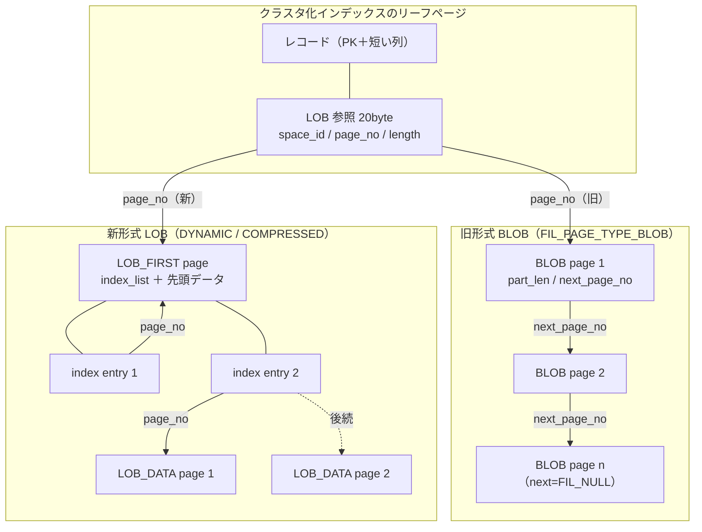

# 第22章 大きな値の格納（LOB）

> **本章で読むソース**
>
> - [`storage/innobase/include/lob0lob.h`](https://github.com/mysql/mysql-server/blob/mysql-8.4.10/storage/innobase/include/lob0lob.h)
> - [`storage/innobase/lob/lob0lob.cc`](https://github.com/mysql/mysql-server/blob/mysql-8.4.10/storage/innobase/lob/lob0lob.cc)
> - [`storage/innobase/lob/lob0ins.cc`](https://github.com/mysql/mysql-server/blob/mysql-8.4.10/storage/innobase/lob/lob0ins.cc)
> - [`storage/innobase/lob/lob0impl.cc`](https://github.com/mysql/mysql-server/blob/mysql-8.4.10/storage/innobase/lob/lob0impl.cc)
> - [`storage/innobase/data/data0data.cc`](https://github.com/mysql/mysql-server/blob/mysql-8.4.10/storage/innobase/data/data0data.cc)
> - [`storage/innobase/include/page0size.h`](https://github.com/mysql/mysql-server/blob/mysql-8.4.10/storage/innobase/include/page0size.h)
> - [`storage/innobase/include/fil0fil.h`](https://github.com/mysql/mysql-server/blob/mysql-8.4.10/storage/innobase/include/fil0fil.h)

## この章の狙い

第14章で、InnoDB のレコードが INDEX ページの内部に置かれるバイト列であることを読んだ。
ページは既定で16KB の固定長であり、B+tree のリーフ1枚に複数のレコードを並べる前提がある。
この前提を素直に守ると、ひとつの列値がページに収まらないほど大きいとき、レコードそのものがページに入らなくなる。
BLOB や TEXT、長い VARCHAR はこの問題を直接引き起こす。

本章では、ページに収まらない大きな列値を別のページ群へ追い出し、レコードには短い参照だけを残す仕組みを読む。
この参照を InnoDB は **LOB 参照**と呼び、`ref_t` という20バイトの構造でレコードの中に埋め込む。
参照の先には、大きな値だけを保持する専用のページ群が連なる。
本章はこの参照のレイアウト、書き込み（`lob::insert`）、読み出し（`lob::read`）の三つを軸にたどる。

LOB の格納形式は、テーブルの行フォーマットによって二系統に分かれる。
古い形式は BLOB ページを単方向リストでつないだだけのものであり、DYNAMIC と COMPRESSED の新形式は LOB の中に索引（LOB index）を持つ。
両者を分けるのは部分更新を効率よく行えるかどうかであり、本章では両形式の構造を対比しながら読む。

## 前提

第14章で、DYNAMIC 行フォーマットがオフページ格納と相性のよい既定の形式であること、レコードの可変長列がどう符号化されるかを読んだ。
本章はその続きとして、可変長列のうち長すぎるものをオフページへ送る判断と、送った先のページ構造を扱う。

LOB 参照の中には `DB_TRX_ID` 相当のトランザクション識別子や LOB バージョンが現れる。
これらが過去バージョンの再構成にどう使われるかは第24章の MVCC で、undo によるロールバックとパージの詳細は第25章で扱う。
本章では、参照と LOB ページがそれらの値をどこに何バイトで保持するかと、読み出しがバージョンをどう選ぶかの骨格だけを読む。

## なぜ大きな値をオフページへ追い出すのか

レコードを原則1ページに収めたいのは、B+tree の探索とリーフ走査の効率のためである。
1レコードが複数ページにまたがると、キー比較のたびに複数ページを読む必要が生じ、リーフを端から走査するスキャンの I/O も膨らむ。
そこで InnoDB は、レコードがページに収まらないと判明したとき、可変長の大きな列を選んでオフページへ送り、レコードにはその列の代わりに20バイトの参照を置く。

どの列を追い出すかは、レコードをページに収めるための変換 `dtuple_convert_big_rec` が決める。
この関数は、レコードの変換後サイズがページに収まらない間、外部化したときに最も多くのバイトを節約できる可変長列を1本ずつ選ぶ。

[`storage/innobase/data/data0data.cc` L465-L502](https://github.com/mysql/mysql-server/blob/mysql-8.4.10/storage/innobase/data/data0data.cc#L465-L502)

```cpp
  /* Decide which fields to shorten: the algorithm is to look for
  a variable-length field that yields the biggest savings when
  stored externally */

  n_fields = 0;

  while (page_zip_rec_needs_ext(
      rec_get_converted_size(index, entry), dict_table_is_comp(index->table),
      dict_index_get_n_fields(index), dict_table_page_size(index->table))) {
    byte *data;
    ulint longest = 0;
    ulint longest_i = ULINT_MAX;
    const upd_field_t *uf = nullptr;

    for (ulint i = dict_index_get_n_unique_in_tree(index);
         i < dtuple_get_n_fields(entry); i++) {
      ulint savings;

      dfield = dtuple_get_nth_field(entry, i);
      ifield = index->get_field(i);

      ut_ad(dfield_get_len(dfield) != UNIV_SQL_INSTANT_DROP_COL);

      /* Skip fixed-length, NULL, externally stored,
      or short columns */

      if (ifield->fixed_len || dfield_is_null(dfield) ||
          dfield_is_ext(dfield) || dfield_get_len(dfield) <= local_len ||
          dfield_get_len(dfield) <= BTR_EXTERN_LOCAL_STORED_MAX_SIZE) {
        goto skip_field;
      }

      savings = dfield_get_len(dfield) - local_len;

      /* Check that there would be savings */
      if (longest >= savings) {
        goto skip_field;
      }
```

`while` の条件 `page_zip_rec_needs_ext` が、現在のレコードサイズではページに収まらないことを判定する。
収まらない間、内側のループが追い出し候補のうち最も節約効果の大きい列を選び、外部化する。
固定長の列、NULL、すでに外部化済みの列、参照1本分より短い列は候補から外す。
木をたどるのに必要なキー列（`dict_index_get_n_unique_in_tree` より前のフィールド）も対象にしない。

レコードに局所的に残すバイト数 `local_len` は、行フォーマットで変わる。

[`storage/innobase/data/data0data.cc` L440-L446](https://github.com/mysql/mysql-server/blob/mysql-8.4.10/storage/innobase/data/data0data.cc#L440-L446)

```cpp
  if (!dict_table_has_atomic_blobs(index->table)) {
    /* up to MySQL 5.1: store a 768-byte prefix locally */
    local_len = BTR_EXTERN_FIELD_REF_SIZE + DICT_ANTELOPE_MAX_INDEX_COL_LEN;
  } else {
    /* new-format table: do not store any BLOB prefix locally */
    local_len = BTR_EXTERN_FIELD_REF_SIZE;
  }
```

古い REDUNDANT と COMPACT 形式では、外部化した列でも先頭768バイトのプレフィックスをレコード内に残す（`DICT_ANTELOPE_MAX_INDEX_COL_LEN` は3×256＝768バイト）。
これに対し DYNAMIC と COMPRESSED 形式（`dict_table_has_atomic_blobs` が真の atomic BLOBs）では、プレフィックスを一切残さず、20バイトの参照だけを置く。
この完全オフページ格納が、第14章で見た DYNAMIC 行フォーマットの特徴である。

ここで決まった外部化対象は `big_rec_t` というベクタにまとめられ、行の挿入や更新の本体（第19章）から `lob::btr_store_big_rec_extern_fields` へ渡される。
レコードはまず参照の置き場所だけを確保した状態で B+tree に挿入され、そのあとで大きな値が別ページへ書かれて参照が埋められる。

## 20バイトの LOB 参照

レコードの中に残る20バイトの参照のレイアウトを読む。
参照のサイズは `FIELD_REF_SIZE` で固定されている。

[`storage/innobase/include/page0size.h` L39-L39](https://github.com/mysql/mysql-server/blob/mysql-8.4.10/storage/innobase/include/page0size.h#L39)

```cpp
constexpr size_t FIELD_REF_SIZE = 20;
```

20バイトの内訳は `lob0lob.h` のオフセット定数が定める。

[`storage/innobase/include/lob0lob.h` L101-L115](https://github.com/mysql/mysql-server/blob/mysql-8.4.10/storage/innobase/include/lob0lob.h#L101-L115)

```cpp
/** Space identifier where stored. */
const ulint BTR_EXTERN_SPACE_ID = 0;

/** page number where stored */
const ulint BTR_EXTERN_PAGE_NO = 4;

/** offset of BLOB header on that page */
const ulint BTR_EXTERN_OFFSET = 8;

/** Version number of LOB (LOB in new format)*/
const ulint BTR_EXTERN_VERSION = BTR_EXTERN_OFFSET;

/** 8 bytes containing the length of the externally stored part of the LOB.
The 2 highest bits are reserved to the flags below. */
const ulint BTR_EXTERN_LEN = 12;
```

先頭4バイトがテーブルスペース識別子、次の4バイトが LOB の先頭ページ番号、続く4バイトがそのページ内のオフセットである。
新形式ではこのオフセット位置を LOB バージョン（`BTR_EXTERN_VERSION`）として読み替える。
最後の8バイトのうち下位4バイトが LOB の全長を表し、上位4バイトの先頭側は3つのフラグに使われる。

このフラグは `BTR_EXTERN_LEN` の最上位バイトに置かれる。

[`storage/innobase/include/lob0lob.h` L119-L136](https://github.com/mysql/mysql-server/blob/mysql-8.4.10/storage/innobase/include/lob0lob.h#L119-L136)

```cpp
/** The most significant bit of BTR_EXTERN_LEN (i.e., the most
significant bit of the byte at smallest address) is set to 1 if this
field does not 'own' the externally stored field; only the owner field
is allowed to free the field in purge! */
const ulint BTR_EXTERN_OWNER_FLAG = 128UL;

/** If the second most significant bit of BTR_EXTERN_LEN (i.e., the
second most significant bit of the byte at smallest address) is 1 then
it means that the externally stored field was inherited from an
earlier version of the row.  In rollback we are not allowed to free an
inherited external field. */
const ulint BTR_EXTERN_INHERITED_FLAG = 64UL;

/** If the 3rd most significant bit of BTR_EXTERN_LEN is 1, then it
means that the externally stored field is currently being modified.
This is mainly used by the READ UNCOMMITTED transaction to avoid returning
inconsistent blob data. */
const ulint BTR_EXTERN_BEING_MODIFIED_FLAG = 32UL;
```

`OWNER` フラグは、この参照が LOB の所有者かどうかを示す。
更新で古いバージョンへ引き継がれた参照は所有権を持たず、所有者だけがパージで LOB を解放できる。
`INHERITED` フラグは、参照が古い行バージョンから継承されたものであることを示し、ロールバックでこの LOB を解放してはならない目印になる。
`BEING_MODIFIED` フラグは、LOB がいままさに書き換え中であることを示し、READ UNCOMMITTED のトランザクションが中途半端な LOB を読まないようにする。

参照を介して値を読み書きするのが `ref_t` 構造である。
`ref_t` は20バイトの領域へのポインタを保持し、各フィールドへの読み書きをアクセサにまとめている。

[`storage/innobase/include/lob0lob.h` L399-L419](https://github.com/mysql/mysql-server/blob/mysql-8.4.10/storage/innobase/include/lob0lob.h#L399-L419)

```cpp
  /** Read the page number from the blob reference.
  @return the page number */
  page_no_t page_no() const {
    return (mach_read_from_4(m_ref + BTR_EXTERN_PAGE_NO));
  }

  /** Read the offset of blob header from the blob reference.
  @return the offset of the blob header */
  ulint offset() const { return (mach_read_from_4(m_ref + BTR_EXTERN_OFFSET)); }

  /** Read the LOB version from the blob reference.
  @return the LOB version number. */
  uint32_t version() const {
    return (mach_read_from_4(m_ref + BTR_EXTERN_VERSION));
  }

  /** Read the length from the blob reference.
  @return length of the blob */
  ulint length() const {
    return (mach_read_from_4(m_ref + BTR_EXTERN_LEN + 4));
  }
```

`page_no()` が LOB の先頭ページへ、`length()` がオフページに置かれた値の全長へたどり着く道具である。
これらは20バイトの参照から計算で求まるので、レコードを読むだけで LOB の所在と長さがわかる。

## LOB ページ群の格納構造

参照の先に連なる LOB ページの形は、行フォーマットで二系統に分かれる。
ページ種別を表す `FIL_PAGE_TYPE` がどちらの形式かを区別する。

[`storage/innobase/include/fil0fil.h` L1305-L1311](https://github.com/mysql/mysql-server/blob/mysql-8.4.10/storage/innobase/include/fil0fil.h#L1305-L1311)

```cpp
constexpr page_type_t FIL_PAGE_TYPE_LOB_INDEX = 22;

/** Data pages of uncompressed LOB */
constexpr page_type_t FIL_PAGE_TYPE_LOB_DATA = 23;

/** The first page of an uncompressed LOB */
constexpr page_type_t FIL_PAGE_TYPE_LOB_FIRST = 24;
```

古い形式の BLOB ページは `FIL_PAGE_TYPE_BLOB`（値は10）であり、ページが単方向リストでつながる。
新形式は先頭ページが `FIL_PAGE_TYPE_LOB_FIRST`、データページが `FIL_PAGE_TYPE_LOB_DATA`、索引ページが `FIL_PAGE_TYPE_LOB_INDEX` の三種からなる。
新形式の先頭ページは LOB index（索引エントリのリスト）を持ち、各エントリが1枚のデータページを指す。
この索引が、LOB の一部だけを差し替える部分更新や、過去バージョンの保持を可能にする。

下の図は、レコード内の20バイト参照から両形式の LOB ページ群へたどる経路を示す。



## 大きな値を書く（lob::insert）

新形式の書き込みは `lob::insert` が担う。
この関数は LOB の先頭ページを確保し、そこに索引リストの起点と最初のデータを置く。

[`storage/innobase/lob/lob0impl.cc` L947-L1005](https://github.com/mysql/mysql-server/blob/mysql-8.4.10/storage/innobase/lob/lob0impl.cc#L947-L1005)

```cpp
  if (!ref_t::is_big(page_size, len)) {
    /* The LOB is not big enough to build LOB index. Insert the LOB without an
    LOB index. */
    Inserter blob_writer(ctx);
    return blob_writer.write_one_small_blob(field_j);
  }

  ut_ad(ref_t::is_big(page_size, len));

  DBUG_LOG("lob", PrintBuffer(ptr, len));
  ut_ad(ref.validate(ctx->get_mtr()));

  first_page_t first(mtr, index);
  buf_block_t *first_block = first.alloc(mtr, ctx->is_bulk());

  if (first_block == nullptr) {
    /* Allocation of the first page of LOB failed. */
    return DB_OUT_OF_FILE_SPACE;
  }

  first.set_last_trx_id(trxid);
  first.init_lob_version();

  page_no_t first_page_no = first.get_page_no();

  if (dict_index_is_online_ddl(index)) {
    row_log_table_blob_alloc(index, first_page_no);
  }

  page_id_t first_page_id(space_id, first_page_no);

  flst_base_node_t *index_list = first.index_list();

  ulint to_write = first.write(trxid, ptr, len);
  total_written += to_write;
  ulint remaining = len;

  {
    /* Insert an index entry in LOB index. */
    flst_node_t *node = first.alloc_index_entry(ctx->is_bulk());

    /* Here the first index entry is being allocated.  Since this will be
    allocated in the first page of LOB, it cannot be nullptr. */
    ut_ad(node != nullptr);

    index_entry_t entry(node, mtr, index);
    entry.set_versions_null();
    entry.set_trx_id(trxid);
    entry.set_trx_id_modifier(trxid);
    entry.set_trx_undo_no(undo_no);
    entry.set_trx_undo_no_modifier(undo_no);
    entry.set_page_no(first.get_page_no());
    entry.set_data_len(to_write);
    entry.set_lob_version(1);
    flst_add_last(index_list, node, mtr);

    first.set_trx_id(trxid);
    first.set_data_len(to_write);
  }
```

冒頭の分岐が二形式の入口になる。
`ref_t::is_big` が偽、つまり LOB index を作る価値がないほど小さいときは、`Inserter::write_one_small_blob` に回して索引を持たない単純なリストとして書く。
それ以外は先頭ページ `first_page_t` を確保し、`first.write` で値の先頭部分を書き込む。
そのうえで索引エントリを1つ確保し、書いたデータページ（この時点では先頭ページ自身）の番号と長さ、トランザクション識別子、LOB バージョンを記録して索引リストに追加する。

先頭ページに入りきらない残りは、データページを1枚ずつ確保して書き、そのつど索引エントリを末尾に足していく。

[`storage/innobase/lob/lob0impl.cc` L1010-L1058](https://github.com/mysql/mysql-server/blob/mysql-8.4.10/storage/innobase/lob/lob0impl.cc#L1010-L1058)

```cpp
  while (remaining > 0) {
    data_page_t data_page(mtr, index);
    buf_block_t *block = data_page.alloc(mtr, ctx->is_bulk());

    if (block == nullptr) {
      ret = DB_OUT_OF_FILE_SPACE;
      break;
    }

    to_write = data_page.write(ptr, remaining);
    total_written += to_write;
    data_page.set_trx_id(trxid);

    /* Allocate a new index entry */
    flst_node_t *node = first.alloc_index_entry(ctx->is_bulk());

    if (node == nullptr) {
      ret = DB_OUT_OF_FILE_SPACE;
      break;
    }

    index_entry_t entry(node, mtr, index);
    entry.set_versions_null();
    entry.set_trx_id(trxid);
    entry.set_trx_id_modifier(trxid);
    entry.set_trx_undo_no(undo_no);
    entry.set_trx_undo_no_modifier(undo_no);
    entry.set_page_no(data_page.get_page_no());
    entry.set_data_len(to_write);
    entry.set_lob_version(1);
    entry.push_back(first.index_list());

    ut_ad(!entry.get_self().is_equal(entry.get_prev()));
    ut_ad(!entry.get_self().is_equal(entry.get_next()));

    page_type_t type = fil_page_get_type(block->frame);
    ut_a(type == FIL_PAGE_TYPE_LOB_DATA);

    if (++nth_blob_page % commit_freq == 0) {
      ctx->check_redolog();
      ref.set_ref(ctx->get_field_ref(field->field_no));
      first.load_x(first_page_id, page_size);
    }
  }

  if (ret == DB_SUCCESS) {
    ref.update(space_id, first_page_no, 1, mtr);
    ref.set_length(total_written, mtr);
  }
```

ループは残りバイトがなくなるまで、データページの確保、書き込み、索引エントリの追加を繰り返す。
4ページごとに `check_redolog` を呼び、ミニトランザクションをいったん区切って redo ログが肥大しないようにする（区切りのたびに参照と先頭ページを取り直す）。
すべて書き終えると、参照に先頭ページ番号とバージョン1、そして書き込んだ全長を書き込んで締める。

旧形式の書き込みは `lob0ins.cc` の `Inserter` が担う。
こちらは索引を持たず、各ページのヘッダに自ページの長さと次ページ番号だけを書く。

[`storage/innobase/lob/lob0ins.cc` L237-L255](https://github.com/mysql/mysql-server/blob/mysql-8.4.10/storage/innobase/lob/lob0ins.cc#L237-L255)

```cpp
void Inserter::write_into_single_page(big_rec_field_t &field) {
  const ulint payload_size = payload();
  const ulint store_len =
      (m_remaining > payload_size) ? payload_size : m_remaining;

  page_t *page = buf_block_get_frame(m_cur_blob_block);

  mlog_write_string(page + FIL_PAGE_DATA + LOB_HDR_SIZE,
                    (const byte *)field.data + field.len - m_remaining,
                    store_len, &m_blob_mtr);

  mlog_write_ulint(page + FIL_PAGE_DATA + LOB_HDR_PART_LEN, store_len,
                   MLOG_4BYTES, &m_blob_mtr);

  mlog_write_ulint(page + FIL_PAGE_DATA + LOB_HDR_NEXT_PAGE_NO, FIL_NULL,
                   MLOG_4BYTES, &m_blob_mtr);

  m_remaining -= store_len;
}
```

各 BLOB ページの先頭8バイトのヘッダ（`LOB_HDR_SIZE`）に、このページが持つデータ長（`LOB_HDR_PART_LEN`）と次ページ番号（`LOB_HDR_NEXT_PAGE_NO`）を置く。
書いた直後は次ページ番号を `FIL_NULL` にしておき、後続ページを確保した時点で前ページのこの欄を書き換えて単方向リストをつなぐ。
索引が無いので、特定の位置のデータページに直接たどり着く手段はなく、常に先頭から順にたどる。

## 大きな値を読む（lob::read）

読み出しの入口は `lob::read` である。
この関数は参照から先頭ページを開き、ページ種別を見て二形式に分岐する。

[`storage/innobase/lob/lob0impl.cc` L1114-L1139](https://github.com/mysql/mysql-server/blob/mysql-8.4.10/storage/innobase/lob/lob0impl.cc#L1114-L1139)

```cpp
  mtr_start(&mtr);

  first_page_t first_page(&mtr, ctx->m_index);
  first_page.load_s(page_id, ctx->m_page_size);

  page_type_t page_type = first_page.get_page_type();

  if (page_type == FIL_PAGE_TYPE_BLOB || page_type == FIL_PAGE_SDI_BLOB) {
    mtr_commit(&mtr);
    Reader reader(*ctx);
    ulint fetch_len = reader.fetch();
    return fetch_len;
  }

  ut_ad(page_type == FIL_PAGE_TYPE_LOB_FIRST);

  cached_blocks.insert(
      std::pair<page_no_t, buf_block_t *>(page_no, first_page.get_block()));

  ctx->m_lob_version = first_page.get_lob_version();

  page_no_t first_page_no = first_page.get_page_no();

  flst_base_node_t *base_node = first_page.index_list();

  fil_addr_t node_loc = flst_get_first(base_node, &mtr);
```

先頭ページの種別が旧形式の `FIL_PAGE_TYPE_BLOB` なら、`Reader::fetch` に委ねて単方向リストを先頭から順にたどる。
新形式の `FIL_PAGE_TYPE_LOB_FIRST` なら、先頭ページの索引リストの先頭ノードを取り出し、エントリを順にたどる準備をする。

新形式の読み出しループは、各索引エントリの LOB バージョンを見て、読み手から見えるべきバージョンを選びながらデータページを読む。

[`storage/innobase/lob/lob0impl.cc` L1161-L1219](https://github.com/mysql/mysql-server/blob/mysql-8.4.10/storage/innobase/lob/lob0impl.cc#L1161-L1219)

```cpp
  while (!fil_addr_is_null(node_loc) && want > 0) {
    old_version.reset(nullptr);

    node = first_page.addr2ptr_s_cache(cached_blocks, node_loc);
    cur_entry.reset(node);

    cur_entry.read(entry_mem);

    const uint32_t entry_lob_version = cur_entry.get_lob_version();

    if (entry_lob_version > lob_version) {
      flst_base_node_t *ver_list = cur_entry.get_versions_list();
      /* Look at older versions. */
      fil_addr_t node_versions = flst_get_first(ver_list, &mtr);

      while (!fil_addr_is_null(node_versions)) {
        flst_node_t *node_old_version =
            first_page.addr2ptr_s_cache(cached_blocks, node_versions);

        old_version.reset(node_old_version);

        old_version.read(entry_mem);

        const uint32_t old_lob_version = old_version.get_lob_version();

        if (old_lob_version <= lob_version) {
          /* The current trx can see this
          entry. */
          break;
        }
        node_versions = old_version.get_next();
        old_version.reset(nullptr);
      }
    }

    page_no_t read_from_page_no = FIL_NULL;

    if (old_version.is_null()) {
      read_from_page_no = cur_entry.get_page_no();
    } else {
      read_from_page_no = old_version.get_page_no();
    }

    actual_read = 0;
    if (read_from_page_no != FIL_NULL) {
      if (read_from_page_no == first_page_no) {
        actual_read = first_page.read(page_offset, ptr, want);
        ptr += actual_read;
        want -= actual_read;

      } else {
        buf_block_t *block = buf_page_get(
            page_id_t(ctx->m_space_id, read_from_page_no), ctx->m_page_size,
            RW_S_LATCH, UT_LOCATION_HERE, &data_mtr);

        data_page_t page(block, &data_mtr);
        actual_read = page.read(page_offset, ptr, want);
        ptr += actual_read;
        want -= actual_read;
```

エントリの LOB バージョンが、読み手が見るべきバージョンより新しければ、そのエントリの旧バージョンリストをたどり、読み手から見えるバージョンを探す。
見えるエントリが定まったら、その `page_no` のデータページを開き、必要なバイト数だけバッファへコピーする。
読み出すべき長さ `want` が尽きるまで、エントリを順に進めながらこれを繰り返す。
このバージョン選択が、更新や部分更新で生じた過去バージョンの LOB を MVCC のもとで正しく読み分ける仕組みである（詳細な再構成は第24章）。

旧形式の `Reader::fetch_page` は、索引を介さず単方向リストを直接たどる。

[`storage/innobase/lob/lob0lob.cc` L762-L771](https://github.com/mysql/mysql-server/blob/mysql-8.4.10/storage/innobase/lob/lob0lob.cc#L762-L771)

```cpp
  byte *blob_header = page + m_rctx.m_offset;
  part_len = btr_blob_get_part_len(blob_header);
  copy_len = std::min(part_len, m_rctx.m_len - m_copied_len);

  memcpy(m_rctx.m_buf + m_copied_len, blob_header + LOB_HDR_SIZE, copy_len);

  m_copied_len += copy_len;
  m_rctx.m_page_no = btr_blob_get_next_page_no(blob_header);
  mtr_commit(&mtr);
  m_rctx.m_offset = FIL_PAGE_DATA;
```

ページヘッダから自ページのデータ長を読み、ヘッダの直後（`LOB_HDR_SIZE` バイト目以降）のデータをコピーする。
そのうえでヘッダの次ページ番号を取り出し、次の反復で開くページにする。
次ページ番号が `FIL_NULL` になるか、要求バイトを満たすまで、この単方向の走査を続ける。

## 更新、部分更新、ロールバックでの扱い

更新時の LOB の扱いは、`btr_store_big_rec_extern_fields` が op コードと更新内容を見て決める。
非圧縮 LOB の場合の分岐を読む。

[`storage/innobase/lob/lob0lob.cc` L547-L578](https://github.com/mysql/mysql-server/blob/mysql-8.4.10/storage/innobase/lob/lob0lob.cc#L547-L578)

```cpp
    } else {
      /* Uncompressed LOB */
      bool do_insert = true;

      if (op == lob::OPCODE_UPDATE && upd != nullptr &&
          blobref.is_big(rec_block->page.size) && can_do_partial_update) {
        if (upd->is_partially_updated(field_no)) {
          /* Do partial update. */
          error = lob::update(ctx, trx, index, upd, field_no, blobref);
          switch (error) {
            case DB_SUCCESS:
              do_insert = false;
              break;
            case DB_FAIL:
              break;
            case DB_OUT_OF_FILE_SPACE:
              break;
            default:
              ut_error;
          }

        } else {
          /* This is to inform the purge thread that
          the older version LOB in this update operation
          can be freed. */
          blobref.mark_not_partially_updatable(trx, btr_mtr, index,
                                               dict_table_page_size(table));
        }
      }

      if (do_insert) {
        error = lob::insert(&ctx, trx, blobref, &big_rec_vec->fields[i], i);
```

更新の対象列が部分更新の条件を満たす（新形式で、十分大きく、部分更新可能な）とき、`lob::update` で LOB の一部だけを差し替える。
部分更新は LOB index のエントリ単位でデータページを差し替え、変更前のエントリを旧バージョンリストへ退避する。
そのため、変更しないデータページはそのまま使い回せる。
部分更新の条件を満たさないときは `do_insert` のまま `lob::insert` を呼び、LOB を丸ごと書き直す。

ロールバックでは、参照に立つフラグが LOB を解放してよいかを決める。
所有権を持たず（`OWNER` フラグが立たない）、あるいは古いバージョンから継承された（`INHERITED` フラグが立つ）参照は、ロールバックでもパージでも勝手に解放しない。
小さな変更（既定で100バイト以下）は、ほかの更新と同様に undo ログに記録して巻き戻す。

[`storage/innobase/include/lob0lob.h` L206-L210](https://github.com/mysql/mysql-server/blob/mysql-8.4.10/storage/innobase/include/lob0lob.h#L206-L210)

```cpp
  /** If the total number of bytes modified in an LOB, in an update
  operation, is less than or equal to this threshold LOB_SMALL_CHANGE_THRESHOLD,
  then it is considered as a small change.  For small changes to LOB,
  the changes are undo logged like any other update operation. */
  static const ulint LOB_SMALL_CHANGE_THRESHOLD = 100;
```

undo ログの本体とパージによる遅延解放、LOB バージョンの世代管理の詳細は第25章で扱う。

## 高速化の工夫

LOB のオフページ格納が効くのは、主キーが並ぶクラスタ化インデックスのページ密度を保つ点にある。
大きな値をレコードに直接埋め込むと、リーフ1ページに収まるレコード数が激減し、B+tree が縦に深くなって探索の I/O が増える。
さらに、リーフを順に走査するレンジスキャンでは、SELECT が大きな列を必要としなくても、その値を抱えたページを次々に読み込まされる。

大きな値を20バイトの参照に置き換えると、リーフページには小さな列とキーだけが残り、1ページあたりのレコード数が高く保たれる。
キーだけを比較する探索や、大きな列を参照しないスキャンは、LOB ページに一切触れずに済む。
LOB の実体を読むのは、その列を実際に必要とする問い合わせがアクセサ `page_no()` をたどったときだけになる。
大きな値を主キーの走査経路から分離することで、頻度の高いキー探索とレンジスキャンの I/O を、値の大きさと無関係に低く抑える設計である。

新形式の LOB index は、この分離をさらに更新側へ広げる。
LOB をデータページ単位の索引エントリに分割しておくことで、巨大な値の一部だけを書き換える更新が、変更したページとその索引エントリだけの差し替えで済む。
LOB 全体を読み直して書き直す必要がなくなり、大きな値への部分更新のコストが LOB 全長ではなく変更量に比例するようになる。

## まとめ

InnoDB は、ページに収まらない大きな列値をオフページの LOB ページ群へ追い出し、レコードには20バイトの `ref_t` 参照だけを残す。
参照はテーブルスペース識別子、先頭ページ番号、長さ、所有権や継承を示すフラグを持ち、`page_no()` と `length()` で LOB の所在と全長にたどり着く。
書き込みは `lob::insert`、読み出しは `lob::read` が担い、ページ種別を見て旧形式（単方向リスト）と新形式（LOB index を持つ）に分岐する。
DYNAMIC と COMPRESSED 行フォーマットは、プレフィックスをレコードに残さない完全オフページ格納をとり、新形式の LOB index によって部分更新と過去バージョンの保持を効率よく行う。
この分離は、主キーのページ密度を保ってキー探索とレンジスキャンの I/O を抑えるとともに、大きな値の部分更新を変更量に比例するコストに収める。

## 関連する章

- [第14章 ページとレコードのフォーマット](../part02-innodb-foundation/14-page-and-record-format.md)：レコードのバイト列レイアウトと DYNAMIC 行フォーマットの前提。
- [第19章 行の挿入、更新、削除](19-row-dml.md)：`big_rec_t` を組み立てて LOB 格納を呼び出す行操作の本体。
- [第24章 MVCC とリードビュー](../part04-transaction-concurrency/24-mvcc-and-read-view.md)：LOB バージョンと過去バージョンの可視性判定。
- [第25章 undo ログとパージ](../part04-transaction-concurrency/25-undo-and-purge.md)：LOB のロールバックとパージによる遅延解放の詳細。
