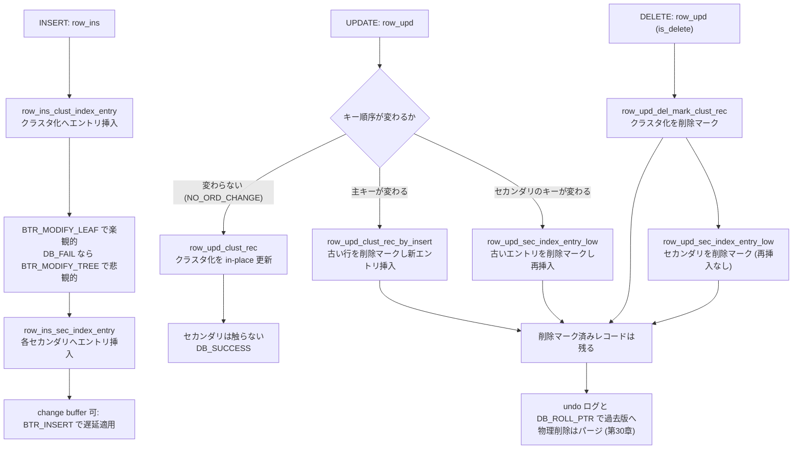

# 第24章 行の挿入、更新、削除

> **本章で読むソース**
>
> - [`storage/innobase/row/row0ins.cc`](https://github.com/mysql/mysql-server/blob/mysql-8.4.10/storage/innobase/row/row0ins.cc)
> - [`storage/innobase/row/row0upd.cc`](https://github.com/mysql/mysql-server/blob/mysql-8.4.10/storage/innobase/row/row0upd.cc)
> - [`storage/innobase/row/row0mysql.cc`](https://github.com/mysql/mysql-server/blob/mysql-8.4.10/storage/innobase/row/row0mysql.cc)

## この章の狙い

第15章で、SQL 層が `handler` の `write_row`、`update_row`、`delete_row` を通じて InnoDB に1行の DML を渡すまでを読んだ。
本章では、その続きを読む。
受け取った1行を、InnoDB がクラスタ化インデックスとセカンダリインデックスの両方へどう反映させるかである。

InnoDB のテーブルは、第22章で読んだとおり、行そのものをクラスタ化インデックスの葉に格納する1本の B+tree である。
セカンダリインデックスは、同じ行を別のキー順で並べた別の B+tree で、葉には主キー値を置く。
だから1行の挿入は、クラスタ化インデックスへの1エントリの挿入と、各セカンダリインデックスへの1エントリの挿入の集まりになる。
更新と削除も同じく、複数のインデックスにまたがる操作になる。

本章で押さえる要点は3つである。
第1に、挿入も更新も、まず木の形を変えない**楽観的**な経路を試し、1ページに収まらないときだけ木構造を書き換える**悲観的**な経路へ切り替える二段構えになっている。
第2に、更新がどのインデックスのキー順序も変えないなら、セカンダリインデックスを一切触らずにクラスタ化インデックスだけを書き換える近道がある。
第3に、削除は行を物理的に消さず、**削除マーク**（delete-mark）を立てるだけにとどめる。
この論理削除が、過去のバージョンを読む MVCC（第29章）と、後で物理削除を行うパージ（第30章）の前提になる。

## 前提

第22章で B+tree の構造とページ分割を、第23章でルートから葉へ降りるカーソルと楽観的、悲観的の2つの降り方を読んだ。
本章の挿入と更新は、このカーソルを使ってリーフページを特定し、そこへエントリを書く。

第21章で読んだミニトランザクション（mtr）が、本章の各操作の単位になる。
1つの挿入や更新は1つの mtr の中で行われ、変更したページのラッチは mtr のコミットまで握り続ける。
undo ログの生成、redo の記録、ラッチの解放は mtr が引き受けるので、本章はインデックスへの論理的な書き換えに集中する。

行が持つ隠れ列のうち、`DB_TRX_ID` はその行を最後に変更したトランザクションの ID を、`DB_ROLL_PTR`（ロールポインタ）は変更前のバージョンを指す undo ログへのポインタを保持する。
本章では、これらの領域を挿入時に確保し、値が確定する筋道までを読む。
undo ログそのものの構造と、それをたどって過去のバージョンを再構成する仕組みは第30章へ送る。

## 挿入の入口 `row_insert_for_mysql`

SQL 層からの挿入は `row_insert_for_mysql` に入る。

[`storage/innobase/row/row0mysql.cc` L1709-L1718](https://github.com/mysql/mysql-server/blob/mysql-8.4.10/storage/innobase/row/row0mysql.cc#L1709-L1718)

```cpp
dberr_t row_insert_for_mysql(const byte *mysql_rec, row_prebuilt_t *prebuilt) {
  /* For intrinsic tables there a lot of restrictions that can be
  relaxed including locking of table, transaction handling, etc.
  Use direct cursor interface for inserting to intrinsic tables. */
  if (prebuilt->table->is_intrinsic()) {
    return (row_insert_for_mysql_using_cursor(mysql_rec, prebuilt));
  } else {
    return (row_insert_for_mysql_using_ins_graph(mysql_rec, prebuilt));
  }
}
```

分岐の対象はテーブルの種別である。
**intrinsic テーブル**は、オプティマイザが内部処理に使う一時テーブルで、ロックもトランザクション処理も省ける。
これにはカーソルを直接操作する軽い経路を使う。
通常のテーブルは `row_insert_for_mysql_using_ins_graph` を通り、挿入ノード（`ins_node_t`）を組み込んだクエリグラフを実行する。
本章が読むのは後者である。

### 隠れ列の領域を確保する

挿入を実行する前に、行に追加する隠れ列の領域を確保する。
`row_ins_alloc_sys_fields` が、`DATA_ROW_ID`、`DATA_TRX_ID`、`DATA_ROLL_PTR` の3つ分の領域を1つの連続バッファに割り当て、それぞれを行の対応するフィールドに結びつける。

[`storage/innobase/row/row0ins.cc` L152-L188](https://github.com/mysql/mysql-server/blob/mysql-8.4.10/storage/innobase/row/row0ins.cc#L152-L188)

```cpp
  /* allocate buffer to hold the needed system created hidden columns. */
  uint len = DATA_ROW_ID_LEN + DATA_TRX_ID_LEN;
  if (!table->is_intrinsic()) {
    len += DATA_ROLL_PTR_LEN;
  }
  ptr = static_cast<byte *>(mem_heap_zalloc(heap, len));

  /* 1. Populate row-id */
  col = table->get_sys_col(DATA_ROW_ID);

  dfield = dtuple_get_nth_field(row, dict_col_get_no(col));

  dfield_set_data(dfield, ptr, DATA_ROW_ID_LEN);

  node->row_id_buf = ptr;

  ptr += DATA_ROW_ID_LEN;

  /* 2. Populate trx id */
  col = table->get_sys_col(DATA_TRX_ID);

  dfield = dtuple_get_nth_field(row, dict_col_get_no(col));

  dfield_set_data(dfield, ptr, DATA_TRX_ID_LEN);

  node->trx_id_buf = ptr;

  ptr += DATA_TRX_ID_LEN;

  if (!table->is_intrinsic()) {
    col = table->get_sys_col(DATA_ROLL_PTR);

    dfield = dtuple_get_nth_field(row, dict_col_get_no(col));

    dfield_set_data(dfield, ptr, DATA_ROLL_PTR_LEN);
  }
}
```

`DATA_ROW_ID` は、主キーを明示しなかったテーブルに InnoDB が自動で振る行 ID で、明示の主キーがあれば使わない。
本章で意味を持つのは残り2つである。
`DATA_TRX_ID` と `DATA_ROLL_PTR` の領域はここで確保するだけで、実際の値はまだ入らない。
`node->trx_id_buf` にこのバッファの位置を覚えておき、後でトランザクション ID を書き込む。
ロールポインタは、挿入が undo レコードを生成する段で確定する。

### インデックスを順にたどる `row_ins`

挿入の本体は `row_ins` である。
最初のインデックス（クラスタ化インデックス）から始め、`next()` でセカンダリインデックスへと順にたどり、各インデックスに対応するエントリを1つずつ挿入する。

[`storage/innobase/row/row0ins.cc` L3606-L3642](https://github.com/mysql/mysql-server/blob/mysql-8.4.10/storage/innobase/row/row0ins.cc#L3606-L3642)

```cpp
  ut_ad(node->state == INS_NODE_INSERT_ENTRIES);

  while (node->index != nullptr) {
    if (node->index->type != DICT_FTS) {
      err = row_ins_index_entry_step(node, thr);

      switch (err) {
        case DB_SUCCESS:
          break;
        case DB_DUPLICATE_KEY:
          thr_get_trx(thr)->error_state = DB_DUPLICATE_KEY;
          thr_get_trx(thr)->error_index = node->index;
          [[fallthrough]];
        default:
          return err;
      }
    }

    node->index = node->index->next();
    node->entry = UT_LIST_GET_NEXT(tuple_list, node->entry);

    DBUG_EXECUTE_IF("row_ins_skip_sec", node->index = nullptr;
                    node->entry = nullptr; break;);

    /* Skip corrupted secondary index and its entry */
    while (node->index && node->index->is_corrupted()) {
      node->index = node->index->next();
      node->entry = UT_LIST_GET_NEXT(tuple_list, node->entry);
    }
  }

  ut_ad(node->entry == nullptr);

  thr_get_trx(thr)->error_index = nullptr;
  node->state = INS_NODE_ALLOC_ROW_ID;

  return DB_SUCCESS;
```

ループは各インデックスに対し `row_ins_index_entry_step` を呼ぶ。
一意キーの重複を検出すると `DB_DUPLICATE_KEY` を返し、どのインデックスで起きたかを `error_index` に記録して中断する。
壊れたセカンダリインデックスは、内側の `while` で読み飛ばす。
すべてのインデックスへ挿入し終えると、`node->entry` は末尾の `nullptr` に達し、状態を初期へ戻して成功を返す。

### IX ロックの取得とトランザクション ID の書き込み

クエリグラフから `row_ins` を呼ぶ手前で、`row_ins_step` がテーブルへの意図ロックとトランザクション ID の書き込みを行う。

[`storage/innobase/row/row0ins.cc` L3686-L3701](https://github.com/mysql/mysql-server/blob/mysql-8.4.10/storage/innobase/row/row0ins.cc#L3686-L3701)

```cpp
  memset(node->trx_id_buf, 0, DATA_TRX_ID_LEN);
  trx_write_trx_id(node->trx_id_buf, trx->id);

  if (node->state == INS_NODE_SET_IX_LOCK) {
    node->state = INS_NODE_ALLOC_ROW_ID;

    /* It may be that the current session has not yet started
    its transaction, or it has been committed: */

    if (trx->id == node->trx_id) {
      /* No need to do IX-locking */

      goto same_trx;
    }

    err = lock_table(0, node->table, LOCK_IX, thr);
```

`trx_write_trx_id` が、先ほど `row_ins_alloc_sys_fields` で確保した `trx_id_buf` へ、現在のトランザクション ID を書き込む。
これで行の `DB_TRX_ID` 隠れ列の値が確定する。
`lock_table` は、テーブルに `LOCK_IX`（意図排他ロック）を取る。
これは行レベルの排他ロックを取る意図を表すテーブル単位のロックで、他のトランザクションがテーブル全体を排他ロックしようとするのを防ぐ。
レコードロックそのものの詳細は第31章へ送る。

### エントリ1つの挿入とインデックスの種別による分岐

`row_ins_index_entry_step` は、行から現在のインデックス用のエントリを組み立て、`row_ins_index_entry` に渡す。

[`storage/innobase/row/row0ins.cc` L3474-L3498](https://github.com/mysql/mysql-server/blob/mysql-8.4.10/storage/innobase/row/row0ins.cc#L3474-L3498)

```cpp
[[nodiscard]] static dberr_t row_ins_index_entry_step(
    ins_node_t *node, /*!< in: row insert node */
    que_thr_t *thr)   /*!< in: query thread */
{
  dberr_t err;

  DBUG_TRACE;

  ut_ad(dtuple_check_typed(node->row));

  err = row_ins_index_entry_set_vals(node->index, node->entry, node->row);

  if (err != DB_SUCCESS) {
    return err;
  }

  ut_ad(dtuple_check_typed(node->entry));

  err = row_ins_index_entry(node->index, node->entry, node->ins_multi_val_pos,
                            thr);

  DEBUG_SYNC(thr_get_trx(thr)->mysql_thd, "after_row_ins_index_entry_step");

  return err;
}
```

`row_ins_index_entry` は、インデックスがクラスタ化かセカンダリかで挿入先の関数を選ぶ。

[`storage/innobase/row/row0ins.cc` L3354-L3361](https://github.com/mysql/mysql-server/blob/mysql-8.4.10/storage/innobase/row/row0ins.cc#L3354-L3361)

```cpp
  if (index->is_clustered()) {
    return (row_ins_clust_index_entry(index, entry, thr, false));
  } else if (index->is_multi_value()) {
    return (
        row_ins_sec_index_multi_value_entry(index, entry, multi_val_pos, thr));
  } else {
    return (row_ins_sec_index_entry(index, entry, thr, false));
  }
```

クラスタ化インデックスへの挿入は `row_ins_clust_index_entry`、セカンダリインデックスへの挿入は `row_ins_sec_index_entry` が担う。
どちらも、次に読む楽観的、悲観的の二段構えを持つ。

## 楽観的、悲観的の二段構え

クラスタ化インデックスへのエントリ挿入は `row_ins_clust_index_entry` である。
この関数は、同じ挿入を2回試みる構造になっている。

[`storage/innobase/row/row0ins.cc` L3138-L3192](https://github.com/mysql/mysql-server/blob/mysql-8.4.10/storage/innobase/row/row0ins.cc#L3138-L3192)

```cpp
  /* Try first optimistic descent to the B-tree */
  uint32_t flags;

  if (!index->table->is_intrinsic()) {
    log_free_check();
    flags = index->table->is_temporary() ? BTR_NO_LOCKING_FLAG : 0;

    /* For intermediate table of copy alter operation,
    skip undo logging and record lock checking for
    insertion operation. */
    if (index->table->skip_alter_undo) {
      flags |= BTR_NO_UNDO_LOG_FLAG | BTR_NO_LOCKING_FLAG;
    }

  } else {
    flags = BTR_NO_LOCKING_FLAG | BTR_NO_UNDO_LOG_FLAG;
  }

  if (index->table->is_intrinsic() && dict_index_is_auto_gen_clust(index)) {
    /* Check if the memory allocated for intrinsic cache*/
    if (!index->last_ins_cur) {
      dict_allocate_mem_intrinsic_cache(index);
    }
    err = row_ins_sorted_clust_index_entry(BTR_MODIFY_LEAF, index, entry, thr);
  } else {
    err = row_ins_clust_index_entry_low(flags, BTR_MODIFY_LEAF, index, n_uniq,
                                        entry, thr, dup_chk_only);
  }

  DEBUG_SYNC(thr_get_trx(thr)->mysql_thd,
             "after_row_ins_clust_index_entry_leaf");

  if (err != DB_FAIL) {
    DEBUG_SYNC_C("row_ins_clust_index_entry_leaf_after");
    return err;
  }

  /* Try then pessimistic descent to the B-tree */
  if (!index->table->is_intrinsic()) {
    log_free_check();
  } else if (!index->last_sel_cur) {
    dict_allocate_mem_intrinsic_cache(index);
    index->last_sel_cur->invalid = true;
  } else {
    index->last_sel_cur->invalid = true;
  }

  if (index->table->is_intrinsic() && dict_index_is_auto_gen_clust(index)) {
    err = row_ins_sorted_clust_index_entry(BTR_MODIFY_TREE, index, entry, thr);
  } else {
    err = row_ins_clust_index_entry_low(flags, BTR_MODIFY_TREE, index, n_uniq,
                                        entry, thr, dup_chk_only);
  }

  return err;
```

1回目の呼び出しは `BTR_MODIFY_LEAF` で `row_ins_clust_index_entry_low` を呼ぶ。
これは、対象のリーフページだけにラッチを取り、そのページの中にエントリが収まる前提で挿入する**楽観的**な経路である。
ページに空きがあれば、これだけで挿入は完了する。
木の上位ノードやインデックス全体のラッチを取らないので、他スレッドの挿入と並行して進められる。

エントリがページに収まらないときは、`row_ins_clust_index_entry_low` が `DB_FAIL` を返す。
`if (err != DB_FAIL)` の判定でこれを受け、2回目の呼び出しに進む。
2回目は `BTR_MODIFY_TREE` を渡す。
これはルートから葉までの経路上のページにラッチを取り、ページ分割によって木構造を書き換えてよい**悲観的**な経路である。

この二段構えが速いのは、ページ分割を伴う挿入が現実には少数だからである。
大多数の挿入は対象リーフ1ページの中で完結し、楽観的経路だけで済む。
木全体に影響しうる重いラッチを、ほんとうに分割が要るときにだけ取る。
セカンダリインデックスへの `row_ins_sec_index_entry` も、まったく同じ `BTR_MODIFY_LEAF` から `BTR_MODIFY_TREE` への切り替えを持つ。

### カーソルを葉に下ろす

`row_ins_clust_index_entry_low` は、渡されたモードでカーソルを葉まで下ろす。

[`storage/innobase/row/row0ins.cc` L2455-L2459](https://github.com/mysql/mysql-server/blob/mysql-8.4.10/storage/innobase/row/row0ins.cc#L2455-L2459)

```cpp
  /* Note that we use PAGE_CUR_LE as the search mode, because then
  the function will return in both low_match and up_match of the
  cursor sensible values */
  pcur.open(index, 0, entry, PAGE_CUR_LE, mode, &mtr, UT_LOCATION_HERE);
  cursor = pcur.get_btr_cur();
```

検索モードは `PAGE_CUR_LE` で、挿入するエントリのキー以下で最大のレコードへカーソルを置く。
ここから新しいエントリを挿入する位置が決まる。
カーソルが木をどう降りるかは第23章の範囲なので、本章ではこの呼び出しの意味だけを押さえる。

## セカンダリインデックス挿入とチェンジバッファ

セカンダリインデックスへの挿入は、クラスタ化インデックスにない2つの仕掛けを持つ。
1つはチェンジバッファ、もう1つは削除マーク済みレコードの再利用である。
どちらも `row_ins_sec_index_entry_low` の中にある。

まず、対象がセカンダリインデックスで一時テーブルでも空間インデックスでもないとき、検索モードに `BTR_INSERT` を立てる。

[`storage/innobase/row/row0ins.cc` L2868-L2872](https://github.com/mysql/mysql-server/blob/mysql-8.4.10/storage/innobase/row/row0ins.cc#L2868-L2872)

```cpp
  } else if (!dict_index_is_spatial(index)) {
    /* Enable insert buffering if it's neither temp-table
    nor spatial index. */
    search_mode |= BTR_INSERT;
  }
```

`BTR_INSERT` は、挿入先のリーフページがバッファプールにキャッシュされていないとき、ディスクから読み込まずに挿入を**チェンジバッファ**へ記録してよいという指示である。
セカンダリインデックスのキー順はクラスタ化インデックスと無関係なので、ランダムな位置のページが対象になりやすく、毎回ディスクから読むのは高くつく。
記録だけ貯めておき、後でそのページがキャッシュへ載ったときにまとめて適用する。

カーソルがこのバッファリングを選ぶと、戻りフラグが `BTR_CUR_INSERT_TO_IBUF` になり、その時点で挿入は完了する。

[`storage/innobase/row/row0ins.cc` L2954-L2958](https://github.com/mysql/mysql-server/blob/mysql-8.4.10/storage/innobase/row/row0ins.cc#L2954-L2958)

```cpp
  if (cursor.flag == BTR_CUR_INSERT_TO_IBUF) {
    ut_ad(!dict_index_is_spatial(index));
    /* The insert was buffered during the search: we are done */
    goto func_exit;
  }
```

チェンジバッファに記録された挿入が、いつどう本来のページへ反映されるかは第25章で読む。

### 削除マーク済みレコードの再利用

セカンダリインデックスのもう1つの仕掛けは、既存の削除マーク済みレコードを使い回すことである。

[`storage/innobase/row/row0ins.cc` L3042-L3058](https://github.com/mysql/mysql-server/blob/mysql-8.4.10/storage/innobase/row/row0ins.cc#L3042-L3058)

```cpp
  if (row_ins_must_modify_rec(&cursor)) {
    /* If the existing record is being modified and the new record
    is doesn't fit the provided slot then existing record is added
    to free list and new record is inserted. This also means
    cursor that we have cached for SELECT is now invalid. */
    if (index->last_sel_cur) {
      index->last_sel_cur->invalid = true;
    }

    /* There is already an index entry with a long enough common
    prefix, we must convert the insert into a modify of an
    existing record */
    offsets = rec_get_offsets(btr_cur_get_rec(&cursor), index, offsets,
                              ULINT_UNDEFINED, UT_LOCATION_HERE, &offsets_heap);

    err = row_ins_sec_index_entry_by_modify(
        flags, mode, &cursor, &offsets, offsets_heap, heap, entry, thr, &mtr);
```

`row_ins_must_modify_rec` が真になるのは、挿入しようとするエントリと一致する削除マーク済みレコードが、すでにその位置にある場合である。
このとき、新しいレコードを別途挿入する代わりに、`row_ins_sec_index_entry_by_modify` で既存のレコードの削除マークを外し、内容を書き換えて再利用する。
削除と挿入を繰り返すパターンで、レコードの場所を作り直さずに済む。

## 更新と削除の入口 `row_update_for_mysql`

更新と削除は、どちらも `row_update_for_mysql` に入る。

[`storage/innobase/row/row0mysql.cc` L2443-L2452](https://github.com/mysql/mysql-server/blob/mysql-8.4.10/storage/innobase/row/row0mysql.cc#L2443-L2452)

```cpp
dberr_t row_update_for_mysql(const byte *mysql_rec, row_prebuilt_t *prebuilt) {
  if (prebuilt->table->is_intrinsic()) {
    return (row_del_upd_for_mysql_using_cursor(prebuilt));
  } else {
    ut_a(prebuilt->template_type == ROW_MYSQL_WHOLE_ROW ||
         (dict_table_get_n_v_cols(prebuilt->table) > 0 &&
          prebuilt->read_just_key));
    return (row_update_for_mysql_using_upd_graph(mysql_rec, prebuilt));
  }
}
```

通常のテーブルは `row_update_for_mysql_using_upd_graph` を通る。
UPDATE と DELETE は、同じ更新ノード（`upd_node_t`）と同じ実行経路を共有する。
両者は `node->is_delete` フラグで区別される。
削除は「全列を削除マークする更新」として扱われる。

`row_update_for_mysql_using_upd_graph` は、保存しておいたカーソル位置を更新ノードへ復元し、状態を `UPD_NODE_UPDATE_CLUSTERED` に設定して `row_upd_step` を実行する。

[`storage/innobase/row/row0mysql.cc` L2346-L2359](https://github.com/mysql/mysql-server/blob/mysql-8.4.10/storage/innobase/row/row0mysql.cc#L2346-L2359)

```cpp
  thr = que_fork_get_first_thr(prebuilt->upd_graph);

  node->state = UPD_NODE_UPDATE_CLUSTERED;

  ut_ad(!prebuilt->sql_stat_start);

  que_thr_move_to_run_state_for_mysql(thr, trx);

run_again:

  thr->run_node = node;
  thr->prev_node = node;
  thr->fk_cascade_depth = 0;
  row_upd_step(thr);
```

更新の対象行は、第23章で読んだ検索によってすでにカーソルが指している。
更新は、その位置のクラスタ化インデックスレコードから始める。

## 更新本体 `row_upd` と順序変更の判定

更新の本体は `row_upd` である。
ここで、この更新がインデックスのキー順序を変えるかどうかを最初に判定する。
この判定が、後段でセカンダリインデックスを触るか触らないかを分ける。

[`storage/innobase/row/row0upd.cc` L3179-L3210](https://github.com/mysql/mysql-server/blob/mysql-8.4.10/storage/innobase/row/row0upd.cc#L3179-L3210)

```cpp
  if (UNIV_LIKELY(node->in_mysql_interface)) {
    /* We do not get the cmpl_info value from the MySQL
    interpreter: we must calculate it on the fly: */

    if (node->is_delete || row_upd_changes_some_index_ord_field_binary(
                               node->table, node->update)) {
      node->cmpl_info = 0;
    } else {
      node->cmpl_info = UPD_NODE_NO_ORD_CHANGE;
    }
  }

  switch (node->state) {
    case UPD_NODE_UPDATE_CLUSTERED:
    case UPD_NODE_INSERT_CLUSTERED:
      if (!node->table->is_intrinsic()) {
        log_free_check();
      }
      err = row_upd_clust_step(node, thr);

      if (err != DB_SUCCESS) {
        return err;
      }
  }

  ut_ad(trx_can_be_handled_by_current_thread(thr_get_trx(thr)));
  DEBUG_SYNC(thr_get_trx(thr)->mysql_thd, "after_row_upd_clust");

  if (node->index == nullptr ||
      (!node->is_delete && (node->cmpl_info & UPD_NODE_NO_ORD_CHANGE))) {
    return DB_SUCCESS;
  }
```

`cmpl_info` の算出が要点である。
削除であるか、いずれかのインデックスのキー（順序づけフィールド）が変わる更新なら、`cmpl_info` を0にする。
どのインデックスのキー順序も変えない更新なら、`UPD_NODE_NO_ORD_CHANGE` を立てる。

まず `row_upd_clust_step` でクラスタ化インデックスのレコードを処理する。
その直後の `if` 文に、本章の近道がある。
削除でなく、かつ `UPD_NODE_NO_ORD_CHANGE` が立っているなら、その場で `DB_SUCCESS` を返してセカンダリインデックスを一切触らない。

非キー列だけを変える更新では、セカンダリインデックスのキー順序は変わらない。
セカンダリインデックスの葉に並ぶエントリは、キーと主キー値だけなので、非キー列の値はそもそも記録されていない。
だから書き換える必要がない。
この判定が効くのは、更新の多くが非キー列の更新だからである。
セカンダリインデックスごとの削除マークと再挿入を丸ごと省き、I/O と undo ログ、redo の量を減らす。

順序が変わる更新や削除では、`if` を抜けてセカンダリインデックスの更新ループに入る。

[`storage/innobase/row/row0upd.cc` L3214-L3231](https://github.com/mysql/mysql-server/blob/mysql-8.4.10/storage/innobase/row/row0upd.cc#L3214-L3231)

```cpp
  do {
    /* Skip corrupted index */
    dict_table_skip_corrupt_index(node->index);

    if (!node->index) {
      break;
    }

    if (node->index->type != DICT_FTS) {
      err = row_upd_sec_step(node, thr);

      if (err != DB_SUCCESS) {
        return err;
      }
    }

    node->index = node->index->next();
  } while (node->index != nullptr);
```

各セカンダリインデックスに対し `row_upd_sec_step` を呼び、順にたどる。

## クラスタ化インデックスの更新 `row_upd_clust_step`

クラスタ化インデックスの処理は `row_upd_clust_step` が行う。
ここで、更新を in-place で済ませるか、削除マークと再挿入に分けるかが決まる。

[`storage/innobase/row/row0upd.cc` L3108-L3145](https://github.com/mysql/mysql-server/blob/mysql-8.4.10/storage/innobase/row/row0upd.cc#L3108-L3145)

```cpp
  if (node->cmpl_info & UPD_NODE_NO_ORD_CHANGE) {
    err = row_upd_clust_rec(flags, node, index, offsets, &heap, thr, &mtr);
    goto exit_func;
  }

  row_upd_store_row(node, trx->mysql_thd,
                    thr->prebuilt ? thr->prebuilt->m_mysql_table : nullptr);

  if (row_upd_changes_ord_field_binary(index, node->update, thr, node->row,
                                       node->ext, nullptr)) {
    /* Update causes an ordering field (ordering fields within
    the B-tree) of the clustered index record to change: perform
    the update by delete marking and inserting.

    TODO! What to do to the 'Halloween problem', where an update
    moves the record forward in index so that it is again
    updated when the cursor arrives there? Solution: the
    read operation must check the undo record undo number when
    choosing records to update. MySQL solves now the problem
    externally! */

    err =
        row_upd_clust_rec_by_insert(flags, node, index, thr, referenced, &mtr);

    if (err != DB_SUCCESS) {
      goto exit_func;
    }

    node->state = UPD_NODE_UPDATE_ALL_SEC;
  } else {
    err = row_upd_clust_rec(flags, node, index, offsets, &heap, thr, &mtr);

    if (err != DB_SUCCESS) {
      goto exit_func;
    }

    node->state = UPD_NODE_UPDATE_SOME_SEC;
  }
```

分岐は2つある。
`UPD_NODE_NO_ORD_CHANGE` が立っているなら、クラスタ化インデックスのキー順序も変わらないので、`row_upd_clust_rec` でレコードをその場で書き換える。
クラスタ化インデックスのキーが変わる場合、つまり主キーを更新する場合は、`row_upd_clust_rec_by_insert` で古いレコードを削除マークし、新しいエントリを別の位置へ挿入する。
レコードの並び順が変わるなら、その場で書き換えることはできず、いったん消して入れ直すしかない。

コメントが**Halloween 問題**に触れている。
更新がレコードを木の前方へ動かすと、走査中のカーソルが後でその同じレコードに再び出会い、同じ行を何度も更新してしまう危険である。
InnoDB は、undo レコードの undo 番号を読み取り側が見て対象を選ぶことで、これを回避する。

### in-place 更新 `row_upd_clust_rec`

キー順序を変えない更新は `row_upd_clust_rec` が行う。
更新後のサイズ変化の有無で、3段階の経路を持つ。

[`storage/innobase/row/row0upd.cc` L2828-L2840](https://github.com/mysql/mysql-server/blob/mysql-8.4.10/storage/innobase/row/row0upd.cc#L2828-L2840)

```cpp
  /* Try optimistic updating of the record, keeping changes within
  the page; we do not check locks because we assume the x-lock on the
  record to update */

  if (node->cmpl_info & UPD_NODE_NO_SIZE_CHANGE) {
    err = btr_cur_update_in_place(flags | BTR_NO_LOCKING_FLAG, btr_cur, offsets,
                                  node->update, node->cmpl_info, thr,
                                  thr_get_trx(thr)->id, mtr);
  } else {
    err = btr_cur_optimistic_update(
        flags | BTR_NO_LOCKING_FLAG, btr_cur, &offsets, offsets_heap,
        node->update, node->cmpl_info, thr, thr_get_trx(thr)->id, mtr);
  }
```

更新後のレコードサイズが変わらないなら、`btr_cur_update_in_place` で値だけを上書きする。
これがいちばん軽い。
サイズが変わるなら `btr_cur_optimistic_update` で、ページの中に収まる前提で更新する。

この楽観的更新が `DB_FAIL` で失敗したときは、後段の `btr_cur_pessimistic_update` で木構造を書き換える更新へ進む。

[`storage/innobase/row/row0upd.cc` L2885-L2888](https://github.com/mysql/mysql-server/blob/mysql-8.4.10/storage/innobase/row/row0upd.cc#L2885-L2888)

```cpp
  err = btr_cur_pessimistic_update(
      flags | BTR_NO_LOCKING_FLAG | BTR_KEEP_POS_FLAG, btr_cur, &offsets,
      offsets_heap, heap, &big_rec, node->update, node->cmpl_info, thr, trx_id,
      trx->undo_no, mtr);
```

更新もまた、挿入と同じく楽観的経路を先に試し、ページに収まらないときだけ悲観的経路へ落ちる二段構えになっている。

### 主キー更新 `row_upd_clust_rec_by_insert`

主キーを変える更新は `row_upd_clust_rec_by_insert` が担う。
古いレコードを削除マークし、新しいエントリにトランザクション ID をセットして挿入する。

[`storage/innobase/row/row0upd.cc` L2582-L2615](https://github.com/mysql/mysql-server/blob/mysql-8.4.10/storage/innobase/row/row0upd.cc#L2582-L2615)

```cpp
  row_upd_index_entry_sys_field(entry, index, DATA_TRX_ID, trx->id);

  switch (node->state) {
    default:
      ut_error;
    case UPD_NODE_INSERT_CLUSTERED:
      /* A lock wait occurred in row_ins_clust_index_entry() in
      the previous invocation of this function. */
      row_upd_clust_rec_by_insert_inherit(index, nullptr, nullptr, entry,
                                          node->update);
      break;
    case UPD_NODE_UPDATE_CLUSTERED:
      /* This is the first invocation of the function where
      we update the primary key.  Delete-mark the old record
      in the clustered index and prepare to insert a new entry. */
      rec = btr_cur_get_rec(btr_cur);
      offsets = rec_get_offsets(rec, index, nullptr, ULINT_UNDEFINED,
                                UT_LOCATION_HERE, &heap);
      ut_ad(page_rec_is_user_rec(rec));

      if (rec_get_deleted_flag(rec, rec_offs_comp(offsets))) {
        /* If the clustered index record is already delete
        marked, then we are here after a DB_LOCK_WAIT.
        Skip delete marking clustered index and disowning
        its blobs. */
        ut_ad(rec_get_trx_id(rec, index) == trx->id);
        ut_ad(!trx_undo_roll_ptr_is_insert(
            row_get_rec_roll_ptr(rec, index, offsets)));
        goto check_fk;
      }

      err =
          btr_cur_del_mark_set_clust_rec(flags, btr_cur_get_block(btr_cur), rec,
                                         index, offsets, thr, node->row, mtr);
```

`row_upd_index_entry_sys_field` が新しいエントリの `DATA_TRX_ID` に現在のトランザクション ID を入れる。
`btr_cur_del_mark_set_clust_rec` が古いレコードに削除マークを立てる。
新しいエントリの挿入は、この後で `row_ins_clust_index_entry` を呼んで行う。
主キー更新が、削除マークと挿入の組み合わせに分解されるのがここで見える。

## セカンダリインデックスの更新は常に削除マークと再挿入

セカンダリインデックスの更新は `row_upd_sec_index_entry_low` が行う。
クラスタ化インデックスと違い、in-place 更新はしない。
古いエントリを削除マークし、新しいエントリを別途挿入する。

セカンダリインデックスのエントリ全体がキーの一部なので、値が変わればキー順序が変わる。
だから常に「消して入れ直す」になる。

まず、検索モードに削除マークのバッファリングを許す `BTR_DELETE_MARK` を立てるかどうかを決める。

[`storage/innobase/row/row0upd.cc` L2257-L2264](https://github.com/mysql/mysql-server/blob/mysql-8.4.10/storage/innobase/row/row0upd.cc#L2257-L2264)

```cpp
    /* We can only buffer delete-mark operations if there
    are no foreign key constraints referring to the index.
    Change buffering is disabled for temporary tables and
    spatial index. */
    mode = (referenced || index->table->is_temporary() ||
            dict_index_is_spatial(index))
               ? BTR_MODIFY_LEAF
               : BTR_MODIFY_LEAF | BTR_DELETE_MARK;
```

外部キーで参照されておらず、一時テーブルでも空間インデックスでもないなら、`BTR_DELETE_MARK` を立てる。
これは、削除マークの操作を**チェンジバッファ**へ載せてよいという指示で、対象ページがキャッシュにないとき遅延適用できる。
セカンダリインデックスへの挿入で `BTR_INSERT` がしたのと同じ理屈で、ランダムな位置のページへのアクセスを減らす。

カーソルが古いエントリを見つけたら、削除マークを立てる。

[`storage/innobase/row/row0upd.cc` L2325-L2336](https://github.com/mysql/mysql-server/blob/mysql-8.4.10/storage/innobase/row/row0upd.cc#L2325-L2336)

```cpp
    case ROW_FOUND:
      ut_ad(err == DB_SUCCESS);

      /* Delete mark the old index record; it can already be
      delete marked if we return after a lock wait in
      row_ins_sec_index_entry() below */
      if (!rec_get_deleted_flag(rec, dict_table_is_comp(index->table))) {
        err = btr_cur_del_mark_set_sec_rec(flags, btr_cur, true, thr, &mtr);
        if (err != DB_SUCCESS) {
          break;
        }
      }
```

`btr_cur_del_mark_set_sec_rec` が古いレコードに削除マークを立てる。
ここでも古いレコードは物理的には消えない。

削除でなければ、新しいエントリを組み立てて挿入する。

[`storage/innobase/row/row0upd.cc` L2357-L2368](https://github.com/mysql/mysql-server/blob/mysql-8.4.10/storage/innobase/row/row0upd.cc#L2357-L2368)

```cpp
  if (node->is_delete || err != DB_SUCCESS) {
    goto func_exit;
  }

  mem_heap_empty(heap);

  /* Build a new index entry */
  entry = row_build_index_entry(node->upd_row, node->upd_ext, index, heap);
  ut_a(entry);

  /* Insert new index entry */
  err = row_ins_sec_index_entry(index, entry, thr, false);
```

`node->is_delete` が立っているなら、新しいエントリは作らずに終わる。
削除では、古いエントリを削除マークするだけでよい。
更新では、`row_build_index_entry` で新しいエントリを組み立て、`row_ins_sec_index_entry` で挿入する。
この挿入は、すでに読んだ挿入の経路をそのまま通る。

`row_upd_sec_step` は、`row_upd_sec_index_entry` を呼んでこの処理に入る入口にあたる。

[`storage/innobase/row/row0upd.cc` L2381-L2384](https://github.com/mysql/mysql-server/blob/mysql-8.4.10/storage/innobase/row/row0upd.cc#L2381-L2384)

```cpp
[[nodiscard]] static inline dberr_t row_upd_sec_index_entry(upd_node_t *node,
                                                            que_thr_t *thr) {
  return row_upd_sec_index_entry_low(node, nullptr, thr);
}
```

## 削除は削除マークにとどまる

ここまでで、削除の正体はほぼ見えている。
DELETE は UPDATE と同じ `row_update_for_mysql` から入り、`node->is_delete` が `true` の更新ノードとして処理される。
クラスタ化インデックスでは `row_upd_clust_step` の中で `row_upd_del_mark_clust_rec` がレコードに削除マークを立て、セカンダリインデックスでは `row_upd_sec_index_entry_low` が古いエントリに削除マークを立てる。
どちらも、レコードを物理的にページから取り除くことはしない。

この論理削除には2つの意味がある。
第1に、削除マークされたレコードは消えていないので、より古いリードビューを持つトランザクションは、`DB_ROLL_PTR` から undo ログをたどって削除前のバージョンを再構成できる。
これが MVCC の前提である。
第2に、削除マーク済みレコードを実際にページから取り除くのは、後で**パージ**が行う。
パージは、そのレコードを参照しうるトランザクションがもう存在しないと確かめてから物理削除する。
削除マークと物理削除を分けることで、削除した行を読む権利のあるトランザクションが読み終えるまで、行の実体を残せる。

MVCC とリードビューは第29章、undo ログとパージは第30章で読む。
本章では、削除が削除マークで止まり、`DB_TRX_ID` と `DB_ROLL_PTR` を通じて過去のバージョンへの道を残す点までを押さえる。

### 隠れ列が undo ログへつながる

挿入時に `row_ins_alloc_sys_fields` で `DATA_TRX_ID` と `DATA_ROLL_PTR` の領域を確保し、`row_ins_step` で `DATA_TRX_ID` にトランザクション ID を書き込んだ。
残る `DATA_ROLL_PTR` は、挿入や更新が undo レコードを生成するとき、`trx_undo_report_row_operation` の中で確定する。
この関数が変更前のバージョンを undo ログへ書き、そのログの位置をロールポインタとしてレコードに埋める。

こうして、各レコードは自分を最後に変更したトランザクションの ID と、変更前バージョンへのロールポインタを持つ。
レコードからロールポインタをたどれば1つ前のバージョンに届き、そのバージョンのロールポインタをたどればさらに前へと、過去のバージョンの鎖を遡れる。
この鎖が、MVCC が古いバージョンを読む仕組みと、ロールバックやパージが変更を巻き戻す仕組みの土台になる。
undo レコードの形式とこの鎖の構造は第30章へ送る。

## 図 INSERT、UPDATE、DELETE の内部処理

3つの DML が、クラスタ化インデックスとセカンダリインデックスをどう書き換えるかをまとめる。



クラスタ化インデックスへの書き換えが先で、セカンダリインデックスはその後に続く。
キー順序を変えない更新だけが、セカンダリインデックスを飛ばす近道を通る。
削除マークされたレコードは消えずに残り、undo ログとロールポインタを通じて過去のバージョンへの道を保つ。

## まとめ

InnoDB の行レベル DML は、1行の操作をクラスタ化インデックスとセカンダリインデックスへの複数のエントリ操作に分解する。
挿入は `row_ins` がインデックスを順にたどり、各インデックスへ1エントリずつ挿入する。
更新と削除は `row_upd` が同じ更新ノードを共有し、`is_delete` フラグで区別する。

本章で読んだ最適化の工夫は3つである。
第1に、挿入も更新も `BTR_MODIFY_LEAF` で楽観的にリーフ1ページへ書こうとし、収まらないときだけ `BTR_MODIFY_TREE` で木構造を書き換える悲観的経路へ落ちる。
大多数の操作が1ページで完結するので、木全体のラッチを取らずに済み、並行度が上がる。
第2に、キー順序を変えない更新は `UPD_NODE_NO_ORD_CHANGE` を立て、クラスタ化インデックスの in-place 更新だけで終え、セカンダリインデックスを一切触らない。
非キー列の更新で、セカンダリインデックスの削除マークと再挿入を丸ごと省ける。
第3に、セカンダリインデックスへの挿入と削除マークは、`BTR_INSERT` や `BTR_DELETE_MARK` でチェンジバッファに載せ、対象ページが未キャッシュでも遅延適用できる。

削除は行を物理的に消さず、削除マークを立てるだけにとどめる。
削除マーク済みレコードは、`DB_TRX_ID` と `DB_ROLL_PTR` を通じて undo ログへつながり、過去のバージョンを再構成する道を残す。
この論理削除が、MVCC とパージの前提になる。

## 関連する章

- [第15章 ハンドラ API](../part01-sql-layer/15-handler-api.md)：SQL 層が `write_row`、`update_row`、`delete_row` を通じて本章の入口関数を呼ぶまでを読む。
- [第21章 ミニトランザクション](../part02-innodb-foundation/21-mini-transaction.md)：本章の各操作が1つの mtr の中で行われ、ラッチと redo をどう扱うかを読む。
- [第22章 B+tree インデックス](22-btree-index.md)：クラスタ化インデックスとセカンダリインデックスの構造、楽観的挿入と悲観的挿入によるページ分割を読む。
- [第23章 レコード検索とカーソル](23-search-and-cursor.md)：本章がエントリを書き込む位置を定めるカーソルが、ルートから葉へどう降りるかを読む。
- [第25章 チェンジバッファ](25-change-buffer.md)：セカンダリインデックスへの挿入や削除マークを、未キャッシュのページに遅延適用する仕組みを読む。
- [第29章 MVCC とリードビュー](../part04-transaction-concurrency/29-mvcc-and-read-view.md)：削除マーク済みレコードと undo ログから、トランザクションが過去のバージョンを読む仕組みを読む。
- [第30章 undo ログとパージ](../part04-transaction-concurrency/30-undo-and-purge.md)：本章が残した削除マーク済みレコードを物理削除し、undo ログを巻き戻すパージを読む。
- [第31章 ロック](../part04-transaction-concurrency/31-locking.md)：本章で取得した `LOCK_IX` やレコードロックの詳細を読む。
