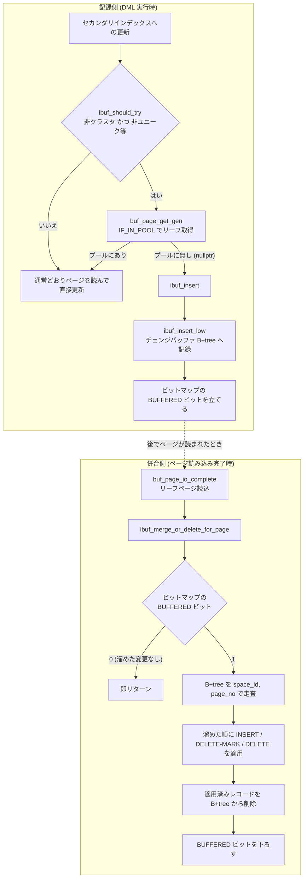

# 第25章 チェンジバッファ

> **本章で読むソース**
>
> - [`storage/innobase/include/ibuf0ibuf.h`](https://github.com/mysql/mysql-server/blob/mysql-8.4.10/storage/innobase/include/ibuf0ibuf.h)
> - [`storage/innobase/include/ibuf0ibuf.ic`](https://github.com/mysql/mysql-server/blob/mysql-8.4.10/storage/innobase/include/ibuf0ibuf.ic)
> - [`storage/innobase/ibuf/ibuf0ibuf.cc`](https://github.com/mysql/mysql-server/blob/mysql-8.4.10/storage/innobase/ibuf/ibuf0ibuf.cc)
> - [`storage/innobase/btr/btr0cur.cc`](https://github.com/mysql/mysql-server/blob/mysql-8.4.10/storage/innobase/btr/btr0cur.cc)

## この章の狙い

第24章で、行の挿入と更新と削除がクラスタ化インデックスとセカンダリインデックスの両方を書き換えることを読んだ。
クラスタ化インデックスへの書き込みはたいてい主キー順の近傍に集まるが、セカンダリインデックスへの書き込みはそうではない。
更新対象のセカンダリキーの値は主キーと相関しないため、1回の DML が触るセカンダリインデックスのリーフページは B+tree 上に散らばる。
そのリーフページがバッファプールに載っていなければ、InnoDB は1ページずつディスクからランダムに読み込まなければならない。

**チェンジバッファ** は、このランダム読み込みを避けるための仕組みである。
対象のセカンダリインデックスのリーフページがバッファプールに無いとき、InnoDB はそのページをすぐには読まず、適用すべき変更を別の場所に溜めておく。
変更を溜める先は、システムテーブルスペースに置かれた1本の B+tree である。
後でそのリーフページが何らかの理由でバッファプールに読み込まれたとき、溜めておいた変更をまとめてページに適用する。
この適用を **併合**（merge）と呼ぶ。

本章では、変更を溜める入口である `ibuf_insert`（`ibuf0ibuf.cc`）と、ページ読み込み時に併合を行う `ibuf_merge_or_delete_for_page`（`ibuf0ibuf.cc`）を中心に読む。
あわせて、どの操作がバッファ可能かを判定する `ibuf_should_try`（`ibuf0ibuf.ic`）と、ユニークインデックスでの制約を読む。
ソースコードのシンボル名は歴史的経緯から `ibuf`（insert buffer）の語を含むが、本章では現在の機能名であるチェンジバッファに統一して説明する。

## 前提

第20章で、バッファプールがページ単位のキャッシュであり、要求されたページがメモリに無ければディスクから読み込むことを読んだ。
チェンジバッファは、この「メモリに無ければ読み込む」という動作のうち、セカンダリインデックスのリーフページへの読み込みを遅延させる仕掛けである。

第22章で、B+tree のリーフページにレコードが格納されることを読んだ。
チェンジバッファ自身も1本の B+tree であり、そのレコードは「どのテーブルスペースの、どのページに対する、どんな変更か」を表す。
チェンジバッファのレコードは、対象ページを `(space_id, page_no)` で指す検索キーを先頭に持ち、続く各種フィールドに適用すべき変更内容を埋め込む。

操作はミニトランザクション（mtr）の文脈で行われる。
チェンジバッファ専用の mtr を開始したり終了したりする `ibuf_mtr_start` と `ibuf_mtr_commit` があり、これらは mtr に「チェンジバッファ処理中」の印を付ける。
この印は、チェンジバッファの処理中にさらに別のチェンジバッファ操作を呼び出してしまう再入を防ぐために使われる。

## チェンジバッファの目的とレコードの構造

チェンジバッファの目的は、ヘッダコメントが端的に述べている。
非ユニークなセカンダリインデックスにレコードを挿入したいが、対象リーフページがバッファプールに無いとき、ページを読まずにチェンジバッファの B+tree へレコードを溜める。

[`storage/innobase/include/ibuf0ibuf.h` L78-L85](https://github.com/mysql/mysql-server/blob/mysql-8.4.10/storage/innobase/include/ibuf0ibuf.h#L78-L85)

```cpp
/* The purpose of the insert buffer is to reduce random disk access.
When we wish to insert a record into a non-unique secondary index and
the B-tree leaf page where the record belongs to is not in the buffer
pool, we insert the record into the insert buffer B-tree, indexed by
(space_id, page_no).  When the page is eventually read into the buffer
pool, we look up the insert buffer B-tree for any modifications to the
page, and apply these upon the completion of the read operation.  This
is called the insert buffer merge. */
```

溜められる操作には3種類あり、`ibuf_op_t` で表す。
挿入（`IBUF_OP_INSERT`）、削除マーク（`IBUF_OP_DELETE_MARK`）、物理削除（`IBUF_OP_DELETE`）である。
これらの値はチェンジバッファの B+tree レコードに1バイトで格納されるため、ディスク上の表現として固定されている。

[`storage/innobase/include/ibuf0ibuf.h` L52-L59](https://github.com/mysql/mysql-server/blob/mysql-8.4.10/storage/innobase/include/ibuf0ibuf.h#L52-L59)

```cpp
typedef enum {
  IBUF_OP_INSERT = 0,
  IBUF_OP_DELETE_MARK = 1,
  IBUF_OP_DELETE = 2,

  /* Number of different operation types. */
  IBUF_OP_COUNT = 3
} ibuf_op_t;
```

これら3種が、第24章で見た DML の3つの局面に対応する。
新しい行を挿入するときセカンダリキーを足す挿入、行を削除するときまずレコードに削除フラグを立てる削除マーク、そしてパージが不要になったレコードを実際に取り除く物理削除である。
同じ `(space_id, page_no)` に複数の操作が溜まるため、操作を適用する順序が問題になる。
チェンジバッファのレコードには2バイトのカウンタ field があり、追加された順に番号が振られる。
これにより、たとえば「INSERT x, DEL MARK x, INSERT x」のように同じキーへの操作が連続しても、溜めた順に正しく適用できる。

## どの操作をバッファできるか

すべての更新をバッファできるわけではない。
バッファできる条件を高速に判定するのが `ibuf_should_try` である。
B+tree カーソルが挿入や削除のためにリーフページを引く直前に、この判定を呼ぶ。

[`storage/innobase/include/ibuf0ibuf.ic` L116-L130](https://github.com/mysql/mysql-server/blob/mysql-8.4.10/storage/innobase/include/ibuf0ibuf.ic#L116-L130)

```cpp
static inline bool ibuf_should_try(
    dict_index_t *index,     /*!< in: index where to insert */
    ulint ignore_sec_unique) /*!< in: if != 0, we should
                             ignore UNIQUE constraint on
                             a secondary index when we
                             decide */
{
  return (innodb_change_buffering != IBUF_USE_NONE && ibuf->max_size != 0 &&
          index->space != dict_sys_t::s_dict_space_id &&
          !index->is_clustered() && !dict_index_is_spatial(index) &&
          !dict_index_has_desc(index) &&
          index->table->quiesce == QUIESCE_NONE &&
          (ignore_sec_unique || !dict_index_is_unique(index)) &&
          srv_force_recovery < SRV_FORCE_NO_IBUF_MERGE);
}
```

条件を順に読むと、バッファの対象から外れるインデックスがわかる。
クラスタ化インデックスは `!index->is_clustered()` で除外される。
クラスタ化インデックスへの挿入位置は主キー順に決まり、ユニーク制約の検査のために対象ページを必ず読む必要があるため、遅延させても意味がない。
空間インデックスと降順インデックスも、構造上バッファに馴染まないため除外される。
データディクショナリのテーブルスペースに属するインデックスも対象外である。

ユニーク制約のあるセカンダリインデックスは、原則として除外される。
`!dict_index_is_unique(index)` がその判定で、ユニークインデックスへの挿入は重複の有無を確かめなければ完了できないからである。
重複の有無は対象リーフページを実際に読まないと分からないため、読み込みを遅延させるチェンジバッファとは両立しない。
ただし第2引数 `ignore_sec_unique` が立っているときは、ユニーク制約を無視してよい。
これは削除や削除マークのように、新しいキー値を挿入せず重複検査が不要な操作のために用意された逃げ道である。

先頭の条件 `innodb_change_buffering != IBUF_USE_NONE` も重要である。
システム変数 `innodb_change_buffering` がチェンジバッファ全体のスイッチであり、`IBUF_USE_NONE` ならどの操作も溜めない。
MySQL 8.4 では、この変数の既定値が `IBUF_USE_NONE`（OFF）に設定されている。

[`storage/innobase/handler/ha_innodb.cc` L23198-L23202](https://github.com/mysql/mysql-server/blob/mysql-8.4.10/storage/innobase/handler/ha_innodb.cc#L23198-L23202)

```cpp
static MYSQL_SYSVAR_ENUM(
    change_buffering, innodb_change_buffering, PLUGIN_VAR_RQCMDARG,
    "Buffer changes to reduce random access:"
    " OFF (default), ON, inserting, deleting, changing, or purging.",
    nullptr, nullptr, IBUF_USE_NONE, &innodb_change_buffering_typelib);
```

チェンジバッファは長くセカンダリインデックス更新の重要な最適化だったが、MySQL 8.4.10 では `innodb_change_buffering` が既定で無効である。
本章のコードは既定 OFF の状態でも残っており、`innodb_change_buffering` を明示的に有効化したときに機能する。

## バッファへの記録（`ibuf_insert`）

B+tree カーソルがリーフページを引こうとして、そのページがバッファプールに無かったとき、`ibuf_insert` が呼ばれる。
呼び出し側を `btr0cur.cc` に見ると、`ibuf_should_try` が真ならページの取得モードを「プールにあるときだけ取得する」`Page_fetch::IF_IN_POOL` に切り替える。

[`storage/innobase/btr/btr0cur.cc` L943-L954](https://github.com/mysql/mysql-server/blob/mysql-8.4.10/storage/innobase/btr/btr0cur.cc#L943-L954)

```cpp
  } else if (latch_mode <= BTR_MODIFY_LEAF) {
    rw_latch = latch_mode;

    if (btr_op != BTR_NO_OP &&
        ibuf_should_try(index, btr_op != BTR_INSERT_OP)) {
      /* Try to buffer the operation if the leaf
      page is not in the buffer pool. */

      fetch = btr_op == BTR_DELETE_OP ? Page_fetch::IF_IN_POOL_OR_WATCH
                                      : Page_fetch::IF_IN_POOL;
    }
  }
```

この取得モードで `buf_page_get_gen` を呼ぶと、ページがプールに無ければ `nullptr` が返る。
`nullptr` が返ったときに限り、操作種別に応じた `ibuf_insert` を呼んで変更を溜める。
挿入なら `IBUF_OP_INSERT`、削除マークなら `IBUF_OP_DELETE_MARK`、物理削除なら `IBUF_OP_DELETE` を渡す。

[`storage/innobase/btr/btr0cur.cc` L973-L985](https://github.com/mysql/mysql-server/blob/mysql-8.4.10/storage/innobase/btr/btr0cur.cc#L973-L985)

```cpp
    switch (btr_op) {
      case BTR_INSERT_OP:
      case BTR_INSERT_IGNORE_UNIQUE_OP:
        ut_ad(fetch == Page_fetch::IF_IN_POOL);
        ut_ad(!dict_index_is_spatial(index));

        if (ibuf_insert(IBUF_OP_INSERT, tuple, index, page_id, page_size,
                        cursor->thr)) {
          cursor->flag = BTR_CUR_INSERT_TO_IBUF;

          goto func_exit;
        }
        break;
```

`ibuf_insert` が真を返せば、変更はチェンジバッファに溜まったので、対象ページを読まずに DML を完了できる。
偽を返したときは、後続の処理が通常どおりページを読み込んで直接書き換える。

`ibuf_insert` 本体は、まず操作種別とシステム変数の組み合わせを照合し、その組み合わせがバッファ可能でなければ早期に偽を返す。
たとえば `innodb_change_buffering` が挿入のみ許す設定なら、削除マークや物理削除の要求はここで弾かれる。
照合を抜けると、対象ページにパージが進行中でないかを確認する `check_watch` の段に進む。

[`storage/innobase/ibuf/ibuf0ibuf.cc` L3352-L3378](https://github.com/mysql/mysql-server/blob/mysql-8.4.10/storage/innobase/ibuf/ibuf0ibuf.cc#L3352-L3378)

```cpp
check_watch:
  /* If a thread attempts to buffer an insert on a page while a
  purge is in progress on the same page, the purge must not be
  buffered, because it could remove a record that was
  re-inserted later.  For simplicity, we block the buffering of
  all operations on a page that has a purge pending.

  We do not check this in the IBUF_OP_DELETE case, because that
  would always trigger the buffer pool watch during purge and
  thus prevent the buffering of delete operations.  We assume
  that the issuer of IBUF_OP_DELETE has called
  buf_pool_watch_set(space, page_no). */

  {
    buf_pool_t *buf_pool = buf_pool_get(page_id);
    buf_page_t *bpage = buf_page_get_also_watch(buf_pool, page_id);

    if (bpage != nullptr) {
      /* A buffer pool watch has been set or the
      page has been read into the buffer pool.
      Do not buffer the request.  If a purge operation
      is being buffered, have this request executed
      directly on the page in the buffer pool after the
      buffered entries for this page have been merged. */
      return false;
    }
  }
```

ここでの `buf_pool_watch` は、対象ページに「読み込まれたら知らせる」印を置く仕組みである。
パージ対象になっているページへの操作をすべて溜めるのをやめる判断を、この印で行う。
監視を抜けると、溜めるレコードのサイズを確かめる。

[`storage/innobase/ibuf/ibuf0ibuf.cc` L3380-L3394](https://github.com/mysql/mysql-server/blob/mysql-8.4.10/storage/innobase/ibuf/ibuf0ibuf.cc#L3380-L3394)

```cpp
skip_watch:
  entry_size = rec_get_converted_size(index, entry);

  if (entry_size >=
      page_get_free_space_of_empty(dict_table_is_comp(index->table)) / 2) {
    return false;
  }

  err = ibuf_insert_low(BTR_MODIFY_PREV, op, no_counter, entry, entry_size,
                        index, page_id, page_size, thr);
  if (err == DB_FAIL) {
    err =
        ibuf_insert_low(BTR_MODIFY_TREE | BTR_LATCH_FOR_INSERT, op, no_counter,
                        entry, entry_size, index, page_id, page_size, thr);
  }
```

レコードが空ページの空き容量の半分以上を占めるなら、溜めても効率が悪いので偽を返す。
実際にチェンジバッファの B+tree へ挿入するのは `ibuf_insert_low` である。
まず楽観的な `BTR_MODIFY_PREV` で試し、それが `DB_FAIL` を返したらツリー全体をラッチする悲観的な `BTR_MODIFY_TREE` で再試行する。
この二段構えは、第23章と第24章で見た B+tree の楽観的な操作と悲観的な操作の使い分けと同じ考え方である。

`ibuf_insert_low` は、溜める前にチェンジバッファ自身の大きさを点検する。
チェンジバッファが推奨上限を超えていれば、新たに溜めず、代わりに既存のレコードを併合して縮める `ibuf_contract` を呼ぶ。

[`storage/innobase/ibuf/ibuf0ibuf.cc` L3017-L3031](https://github.com/mysql/mysql-server/blob/mysql-8.4.10/storage/innobase/ibuf/ibuf0ibuf.cc#L3017-L3031)

```cpp
  if (ibuf->max_size == 0) {
    return (DB_STRONG_FAIL);
  }

  if (ibuf->size >= ibuf->max_size + IBUF_CONTRACT_DO_NOT_INSERT) {
    /* Insert buffer is now too big, contract it but do not try
    to insert */

#ifdef UNIV_IBUF_DEBUG
    ib::info() << "Ibuf too big";
#endif
    ibuf_contract(true);

    return (DB_STRONG_FAIL);
  }
```

チェンジバッファの大きさはバッファプールに対する割合で制限される。
既定の上限はバッファプールの25%である。

[`storage/innobase/include/ibuf0ibuf.h` L45-L47](https://github.com/mysql/mysql-server/blob/mysql-8.4.10/storage/innobase/include/ibuf0ibuf.h#L45-L47)

```cpp
/** Default value for maximum on-disk size of change buffer in terms
of percentage of the buffer pool. */
constexpr uint32_t CHANGE_BUFFER_DEFAULT_SIZE = 25;
```

## ページ読み込み時の併合（`ibuf_merge_or_delete_for_page`）

溜めた変更は、対象ページがバッファプールに読み込まれた瞬間に適用される。
読み込み完了を処理する `buf_page_io_complete`（第20章）が、セカンダリインデックスのリーフページに対して `ibuf_merge_or_delete_for_page` を呼ぶ。

[`storage/innobase/buf/buf0buf.cc` L4040-L4048](https://github.com/mysql/mysql-server/blob/mysql-8.4.10/storage/innobase/buf/buf0buf.cc#L4040-L4048)

```cpp
  if (!recv_no_ibuf_operations) {
    if (access_time != std::chrono::steady_clock::time_point{}) {
#ifdef UNIV_IBUF_COUNT_DEBUG
      ut_a(ibuf_count_get(m_page_id) == 0);
#endif /* UNIV_IBUF_COUNT_DEBUG */
    } else {
      ibuf_merge_or_delete_for_page(block, m_page_id, &m_page_size, true);
    }
  }
```

この関数の役割は名前のとおり二つある。
ページがディスクから読み込まれたなら、溜めた変更を適用してチェンジバッファから消す（併合）。
ページがインデックスの削除などで使われなくなっていたなら、適用せずにチェンジバッファのレコードを消す（破棄）だけでよい。

[`storage/innobase/ibuf/ibuf0ibuf.cc` L3949-L3964](https://github.com/mysql/mysql-server/blob/mysql-8.4.10/storage/innobase/ibuf/ibuf0ibuf.cc#L3949-L3964)

```cpp
/** When an index page is read from a disk to the buffer pool, this function
applies any buffered operations to the page and deletes the entries from the
insert buffer. If the page is not read, but created in the buffer pool, this
function deletes its buffered entries from the insert buffer; there can
exist entries for such a page if the page belonged to an index which
subsequently was dropped.
@param[in,out]  block                   if page has been read from disk,
pointer to the page x-latched, else NULL
@param[in]      page_id                 page id of the index page
@param[in]      update_ibuf_bitmap      normally this is set to true, but
if we have deleted or are deleting the tablespace, then we naturally do not
want to update a non-existent bitmap page
@param[in]      page_size               page size */
void ibuf_merge_or_delete_for_page(buf_block_t *block, const page_id_t &page_id,
                                   const page_size_t *page_size,
                                   bool update_ibuf_bitmap) {
```

併合に入る前に無駄な探索を避ける工夫がある。
各データページには **ビットマップページ** が対応し、そのページにチェンジバッファのレコードがあるかどうかを1ビットで記録している。
このビットが立っていなければ、チェンジバッファの B+tree を引くまでもなく、溜めた変更が無いと即断できる。

[`storage/innobase/ibuf/ibuf0ibuf.cc` L4025-L4038](https://github.com/mysql/mysql-server/blob/mysql-8.4.10/storage/innobase/ibuf/ibuf0ibuf.cc#L4025-L4038)

```cpp
      bitmap_page =
          ibuf_bitmap_get_map_page(page_id, *page_size, UT_LOCATION_HERE, &mtr);

      bitmap_bits = ibuf_bitmap_page_get_bits(bitmap_page, page_id, *page_size,
                                              IBUF_BITMAP_BUFFERED, &mtr);

      ibuf_mtr_commit(&mtr);

      if (!bitmap_bits) {
        /* No inserts buffered for this page */

        fil_space_release(space);
        return;
      }
```

ビットが立っていれば、対象ページのレコードを溜めた順にたどって適用する。
チェンジバッファの B+tree に `(space_id, page_no)` をキーとしたカーソルを置き、そのページ向けのレコードを先頭から走査する。
各レコードの操作種別を読み、挿入と削除マークと物理削除のいずれかをページに適用する。

[`storage/innobase/ibuf/ibuf0ibuf.cc` L4151-L4168](https://github.com/mysql/mysql-server/blob/mysql-8.4.10/storage/innobase/ibuf/ibuf0ibuf.cc#L4151-L4168)

```cpp
      switch (op) {
        case IBUF_OP_INSERT:
#ifdef UNIV_IBUF_DEBUG
          volume += rec_get_converted_size(dummy_index, entry);

          volume += page_dir_calc_reserved_space(1);

          ut_a(volume <= 4 * UNIV_PAGE_SIZE / IBUF_PAGE_SIZE_PER_FREE_SPACE);
#endif
          ibuf_insert_to_index_page(entry, block, dummy_index, &mtr);
          break;

        case IBUF_OP_DELETE_MARK:
          ibuf_set_del_mark(entry, block, dummy_index, &mtr);
          break;

        case IBUF_OP_DELETE:
          ibuf_delete(entry, block, dummy_index, &mtr);
```

挿入は `ibuf_insert_to_index_page` でページにレコードを追加する。
削除マークは `ibuf_set_del_mark` でレコードに削除フラグを立てる。
物理削除は `ibuf_delete` でレコードを取り除く。
適用したレコードはチェンジバッファの B+tree から削除し、走査を進める。
最後に、対象ページのビットマップを更新し、溜めた変更が無くなったことを記録する。

ここで効いているのが「併合が必ず成功する」という不変条件である。
チェンジバッファのレコードが対象ページに収まらなければ、読み込み直後のページが壊れてしまう。
これを防ぐため、ビットマップは各ページの空き容量を粗い段階で記録し、空き容量が足りないページには新たな挿入を溜めないようにしている。
ヘッダコメントがこの保証を明記している。

[`storage/innobase/include/ibuf0ibuf.h` L87-L96](https://github.com/mysql/mysql-server/blob/mysql-8.4.10/storage/innobase/include/ibuf0ibuf.h#L87-L96)

```cpp
/* The insert buffer merge must always succeed.  To guarantee this,
the insert buffer subsystem keeps track of the free space in pages for
which it can buffer operations.  Two bits per page in the insert
buffer bitmap indicate the available space in coarse increments.  The
free bits in the insert buffer bitmap must never exceed the free space
on a page.  It is safe to decrement or reset the bits in the bitmap in
a mini-transaction that is committed before the mini-transaction that
affects the free space.  It is unsafe to increment the bits in a
separately committed mini-transaction, because in crash recovery, the
free bits could momentarily be set too high. */
```

## 記録と併合の全体像

ここまでの流れを、記録側（DML 時）と併合側（ページ読み込み時）の二つに分けて図にする。



記録側はランダムなリーフページごとに1件ずつ溜めるが、その記録先はチェンジバッファという1本の B+tree に集約される。
併合側は、ページが読まれたときに、そのページ向けに溜まった複数の変更をまとめて1回で適用する。

## 高速化の工夫

チェンジバッファの本質は、ランダムな書き込みを順次の併合に変換し、ディスク I/O をまとめる点にある。

セカンダリインデックスへの更新は、キー値が主キーと相関しないため、B+tree 上のばらばらなリーフページに当たる。
もしチェンジバッファが無ければ、更新のたびに対象リーフページをディスクからランダムに読み込み、書き換え、いずれ書き戻すことになる。
ランダム読み込みは、回転ディスクではシークが伴うため特に高くつく。

チェンジバッファは、この読み込みをまるごと省く。
対象ページがメモリに無ければ、変更を `(space_id, page_no)` をキーとする1本の B+tree に溜めるだけで DML を終える。
この時点でランダムなディスク読み込みは発生しない。
溜めた変更が実際にページへ適用されるのは、そのページが別の問い合わせなどで読み込まれたときである。

ここで二重の節約が効く。
第一に、同じページに対する複数の変更を1回の読み込みでまとめて適用できる。
あるページに10件の変更が溜まっていれば、そのページを1回読むだけで10件すべてを片付けられる。
第二に、そのページがそもそも読まれなければ、併合は起きず、読み込み自体が省ける。
更新したきり参照されないセカンダリキーは、ページを読まないまま `ibuf_contract` による定期的な縮約のなかで処理される。

無駄な探索を避けるビットマップの工夫も、この最適化を支える。
ページを読むたびにチェンジバッファの B+tree を引いていては、溜めた変更が無いページの読み込みまで遅くなる。
各ページ1ビットの `IBUF_BITMAP_BUFFERED` を先に見て、立っていないページでは B+tree の探索そのものを省く。
これにより、チェンジバッファが空、あるいは当該ページに関係しないときの読み込みは、ほぼ何も払わずに通り抜ける。

## まとめ

チェンジバッファは、セカンダリインデックスのリーフページがバッファプールに無いときに、その変更をシステムテーブルスペースの1本の B+tree へ溜める仕組みである。
溜められる操作は挿入と削除マークと物理削除の3種で、`ibuf_op_t` がディスク上の固定値として表す。
`ibuf_should_try` がバッファ可能なインデックスを判定し、クラスタ化インデックスとユニークなセカンダリインデックスは原則として除外される。
ユニークインデックスを除くのは、重複検査のために対象ページを必ず読む必要があり、読み込みの遅延と両立しないからである。

記録は `ibuf_insert` から `ibuf_insert_low` を通じて行われ、対象ページがバッファプールに無いときに限って発生する。
併合は `ibuf_merge_or_delete_for_page` が担い、ページ読み込みの完了時に、溜めた変更を溜めた順にまとめて適用する。
ビットマップの1ビットが「溜めた変更の有無」を表し、無駄な B+tree 探索を省く。
この一連の仕組みにより、ランダムなセカンダリ更新が順次の併合に変換され、ディスク I/O がまとまる。

機能としては既定で無効（`innodb_change_buffering = none`）である。
コード自体は残っており、明示的に有効化すれば本章で読んだとおりに動作する。

## 関連する章

- [第20章 バッファプール](../part02-innodb-foundation/20-buffer-pool.md)：ページ読み込みの完了時に併合が起動する。
- [第21章 ミニトランザクション](../part02-innodb-foundation/21-mini-transaction.md)：チェンジバッファの記録と併合は専用 mtr の文脈で行われる。
- [第22章 B+tree インデックス](22-btree-index.md)：チェンジバッファ自身も1本の B+tree である。
- [第24章 行の挿入、更新、削除](24-row-dml.md)：本章でバッファする3種の操作は、ここで見た DML の局面に対応する。
- [第30章 undo ログとパージ](../part04-transaction-concurrency/30-undo-and-purge.md)：物理削除のバッファはパージ処理から発行される。
