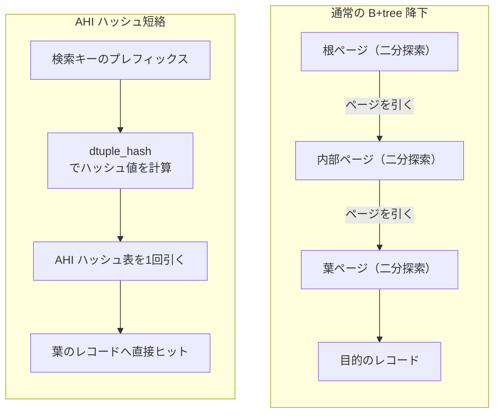
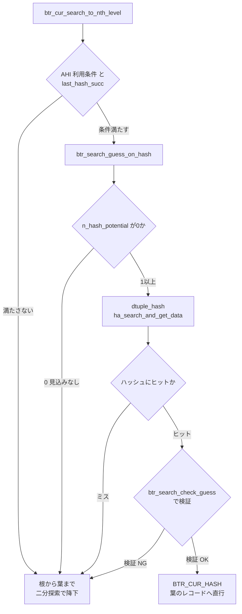

# 第26章 アダプティブハッシュインデックス

> **本章で読むソース**
>
> - [`storage/innobase/include/btr0sea.h`](https://github.com/mysql/mysql-server/blob/mysql-8.4.10/storage/innobase/include/btr0sea.h)
> - [`storage/innobase/include/btr0sea.ic`](https://github.com/mysql/mysql-server/blob/mysql-8.4.10/storage/innobase/include/btr0sea.ic)
> - [`storage/innobase/btr/btr0sea.cc`](https://github.com/mysql/mysql-server/blob/mysql-8.4.10/storage/innobase/btr/btr0sea.cc)
> - [`storage/innobase/ha/ha0ha.cc`](https://github.com/mysql/mysql-server/blob/mysql-8.4.10/storage/innobase/ha/ha0ha.cc)
> - [`storage/innobase/include/ha0ha.ic`](https://github.com/mysql/mysql-server/blob/mysql-8.4.10/storage/innobase/include/ha0ha.ic)
> - [`storage/innobase/btr/btr0cur.cc`](https://github.com/mysql/mysql-server/blob/mysql-8.4.10/storage/innobase/btr/btr0cur.cc)

## この章の狙い

第22章で B+tree のインデックスを、第23章でレコード検索とカーソルを読んだ。
InnoDB のテーブルへの問い合わせは、根ページから内部ページをたどって葉ページへ降り、葉の中をバイナリサーチして目的のレコードを見つける。
木が高ければ降下するページ数だけバッファプールからページを引き、各ページ内で二分探索を繰り返す。

同じプレフィックスで同じ葉を繰り返し引くアクセスでは、この降下は毎回ほぼ同じ道をたどる。
**アダプティブハッシュインデックス**（adaptive hash index、以下 AHI）は、こうしたホットなアクセスを観測し、検索キーのハッシュからレコードへの参照を1段で引けるようにする仕組みである。
当たれば根からの降下を省き、葉のレコードへ直接ヒットする。

本章は、AHI がいつ作られ、いつ使われ、外れたときにどうフォールバックするかを読む。
観測は `btr_search_info_update`（`btr0sea.ic`、`btr0sea.cc`）が、構築は `btr_search_build_page_hash_index`（`btr0sea.cc`）が、利用は `btr_search_guess_on_hash`（`btr0sea.cc`）が担う。
ハッシュ表そのものは `ha0ha.cc` の関数で操作する。

## 前提

第22章で、InnoDB のインデックスがクラスタ化インデックスもセカンダリインデックスも B+tree であることを読んだ。
カーソルがレコードを探す入口は `btr_cur_search_to_nth_level`（第23章）であり、本章の AHI 利用はこの関数の冒頭から呼ばれる。

ページの取得はミニトランザクション（mtr、第21章）の文脈で行う。
AHI が当たると、本来なら mtr に登録するはずだった内部ページのラッチを取らずに、葉ページのラッチだけを取って返す。
ここで言う「ホットなページ」は、第20章のバッファプールに載っているページである。
AHI のエントリは常にバッファプール上のレコードを指し、ページが追い出されるときは対応するエントリも捨てられる。

AHI は既定で有効であり、`innodb_adaptive_hash_index` で切り替えられる。
本章はコードの動作を追うので、有効である前提で読む。

## AHI が短絡するもの

通常の B+tree 検索は、根から葉まで木の高さぶんのページを引き、各ページで二分探索する。
AHI はこの降下を、検索キーのハッシュ1回とハッシュ表の探索1回に置き換える。

[`storage/innobase/include/btr0sea.h` L28-32](https://github.com/mysql/mysql-server/blob/mysql-8.4.10/storage/innobase/include/btr0sea.h#L28-L32)

```cpp
/** @file include/btr0sea.h
 The index tree adaptive search

 Created 2/17/1996 Heikki Tuuri
 *************************************************************************/
```

ハッシュのキーは、「レコード全体」ではなく「インデックスキーの先頭プレフィックス」である。
プレフィックスは完全な列の本数 `n_fields` と、その次の列の途中までを使う `n_bytes` の組で表される。
この組をどう推薦するかは、後で読む観測ロジックが決める。

[`storage/innobase/include/buf0buf.h` L1737-1748](https://github.com/mysql/mysql-server/blob/mysql-8.4.10/storage/innobase/include/buf0buf.h#L1737-L1748)

```cpp
/** Structure used by AHI to contain information on record prefixes to be
considered in hash index subsystem. It is meant for using as a single 64bit
atomic value, thus it needs to be aligned properly. */
struct alignas(alignof(uint64_t)) btr_search_prefix_info_t {
  /** recommended prefix: number of bytes in an incomplete field
  @see BTR_PAGE_MAX_REC_SIZE */
  uint32_t n_bytes;
  /** recommended prefix length for hash search: number of full fields */
  uint16_t n_fields;
  /** true or false, depending on whether the leftmost record of several records
  with the same prefix should be indexed in the hash index */
  bool left_side;
```

プレフィックスでハッシュするので、同じプレフィックスを持つレコードはハッシュ値が衝突する。
AHI は同じプレフィックスを持つレコード群（equal-prefix-group）から1つだけを代表として登録する。
代表を群の左端にするか右端にするかが `left_side` であり、これも推薦の一部である。



## ハッシュ表とパーティション

AHI のハッシュ表は InnoDB 汎用のハッシュ表（`ha0ha.cc`）で作る。
キーは 64bit のハッシュ値、値はバッファプール上のレコードへのポインタ `rec_t *` である。
同じハッシュ値に対しては高々1つのレコードしか保持しない。

[`storage/innobase/include/btr0sea.h` L105-115](https://github.com/mysql/mysql-server/blob/mysql-8.4.10/storage/innobase/include/btr0sea.h#L105-L115)

```cpp
    alignas(ut::INNODB_CACHE_LINE_SIZE) rw_lock_t latch;
    /** The adaptive hash table, mapping dtuple_hash values to rec_t pointers
    on index pages. For any hash value at most one pointer is hold. Is protected
    by the part's latch. It is in a separate cache line to not collide with the
    possible multiple readers that are registering for the latching. */
    alignas(ut::INNODB_CACHE_LINE_SIZE) hash_table_t *hash_table;
    /** A pointer to a free block that the heap in the hash table may use for
    adding new hash nodes. Changes to nullptr are done under appropriate
    X-latched rwlock. Changes from nullptr to non-nullptr are done without any
    protection. Changes from non-null to a different non-null are prohibited. */
    std::atomic<buf_block_t *> free_block_for_heap;
```

AHI システムは1つのハッシュ表ではなく、複数の **パーティション** に分かれる。
各パーティションは自前のハッシュ表と、それを守る読み書きラッチ `latch` を持つ。
パーティション数 `btr_ahi_parts` は既定で8である。

[`storage/innobase/btr/btr0sea.cc` L73-73](https://github.com/mysql/mysql-server/blob/mysql-8.4.10/storage/innobase/btr/btr0sea.cc#L73-L73)

```cpp
ulong btr_ahi_parts = 8;
```

どのインデックスがどのパーティションに属するかは、インデックスのテーブルスペース ID とインデックス ID の組から決まる。
同じインデックスは常に同じパーティションへ写像されるため、あるインデックスの AHI 操作は1つのラッチだけを握ればよい。

[`storage/innobase/include/btr0sea.ic` L143-159](https://github.com/mysql/mysql-server/blob/mysql-8.4.10/storage/innobase/include/btr0sea.ic#L143-L159)

```cpp
static inline size_t btr_search_hash_index_id(const dict_index_t *index) {
  return ut::hash_uint64_pair(index->space, index->id);
}

static inline btr_search_sys_t::search_part_t &btr_get_search_part(
    const dict_index_t *index) {
  ut_ad(index != nullptr);

  const auto index_slot =
      btr_search_hash_index_id(index) % btr_ahi_parts_fast_modulo;

  return btr_search_sys->parts[index_slot];
}

static inline rw_lock_t *btr_get_search_latch(const dict_index_t *index) {
  return &btr_get_search_part(index).latch;
}
```

インデックス ID でパーティションを分けることで、別々のインデックスへの AHI 操作が別々のラッチを握る。
全インデックスが単一のラッチに集中するのを避け、ラッチ競合をパーティション単位に分散させている。

## アクセス傾向の観測

AHI は明示的に作るものではなく、検索のたびに傾向を観測して自動的に育つ。
カーソルが葉でレコードを引いたあと、`btr_cur_search_to_nth_level` は `btr_search_info_update` を呼ぶ。

[`storage/innobase/btr/btr0cur.cc` L1655-1661](https://github.com/mysql/mysql-server/blob/mysql-8.4.10/storage/innobase/btr/btr0cur.cc#L1655-L1661)

```cpp
    /* We do a dirty read of btr_search_enabled here.  We
    will properly check btr_search_enabled again in
    btr_search_build_page_hash_index() before building a
    page hash index, while holding search latch. */
    if (btr_search_enabled && !index->disable_ahi) {
      btr_search_info_update(cursor);
    }
```

この入口は、毎回の検索で重い処理をしないように間引かれている。
インデックスごとのカウンタ `hash_analysis` を増やし、しきい値 `BTR_SEARCH_HASH_ANALYSIS`（17）に満たないうちは何もせず返る。
AHI が当たった検索（`BTR_CUR_HASH`）も観測の対象外である。

[`storage/innobase/include/btr0sea.ic` L46-69](https://github.com/mysql/mysql-server/blob/mysql-8.4.10/storage/innobase/include/btr0sea.ic#L46-L69)

```cpp
static inline void btr_search_info_update(btr_cur_t *cursor) {
  const auto index = cursor->index;
  ut_ad(!rw_lock_own(btr_get_search_latch(index), RW_LOCK_S));
  ut_ad(!rw_lock_own(btr_get_search_latch(index), RW_LOCK_X));

  if (dict_index_is_spatial(index) || !btr_search_enabled) {
    return;
  }
  if (cursor->flag == BTR_CUR_HASH_NOT_ATTEMPTED) {
    return;
  }

  const auto hash_analysis_value = ++index->search_info->hash_analysis;

  if (hash_analysis_value < BTR_SEARCH_HASH_ANALYSIS) {
    /* Do nothing */

    return;
  }

  ut_ad(cursor->flag != BTR_CUR_HASH);

  btr_search_info_update_slow(cursor);
}
```

しきい値を越えたときだけ `btr_search_info_update_slow` へ進む。
ここで2つの観測を順に行う。
1つはインデックス単位の「どんなプレフィックスが効きそうか」、もう1つはブロック（葉ページ）単位の「このページに実際にハッシュ索引を張るべきか」である。

[`storage/innobase/btr/btr0sea.cc` L649-679](https://github.com/mysql/mysql-server/blob/mysql-8.4.10/storage/innobase/btr/btr0sea.cc#L649-L679)

```cpp
void btr_search_info_update_slow(btr_cur_t *cursor) {
  ut_ad(!rw_lock_own(btr_get_search_latch(cursor->index), RW_LOCK_S));
  ut_ad(!rw_lock_own(btr_get_search_latch(cursor->index), RW_LOCK_X));

  const auto block = btr_cur_get_block(cursor);

  /* NOTE that the following two function calls do NOT protect
  info or block->ahi with any semaphore, to save CPU time!
  We cannot assume the fields are consistent when we return from
  those functions! */
  btr_search_info_update_hash(cursor);

#ifdef UNIV_SEARCH_PERF_STAT
  if (cursor->flag == BTR_CUR_HASH_FAIL) {
    btr_search_n_hash_fail++;
  }
#endif /* UNIV_SEARCH_PERF_STAT */

  if (btr_search_update_block_hash_info(block, cursor)) {
    /* Note that since we did not protect block->ahi with any semaphore, the
    values can be inconsistent. We have to check inside the function call that
    they make sense. */
    btr_search_build_page_hash_index(cursor->index, block, false);
  } else if (cursor->flag == BTR_CUR_HASH_FAIL) {
    /* Update the hash node reference, if appropriate. If
    btr_search_update_block_hash_info decided to build the index for this
    block, the record should be hashed correctly with the rest of the block's
    records. */
    btr_search_update_hash_ref(block, cursor);
  }
}
```

ここでコメントが述べるとおり、観測対象のフィールドはどのラッチでも保護されない。
観測は速度のためのヒューリスティックなので、値が多少不整合でも検索の正しさには影響しない。
それを利用してラッチを取らずに観測し、CPU 時間を節約している。

### プレフィックスの推薦

`btr_search_info_update_hash` は、検索が止まった位置からどんなプレフィックスならハッシュで当たったかを推測する。
カーソルは目的タプルに対し、直前のレコード（low）と直後のレコード（up）の間で止まる。
すでに推薦中のプレフィックスで当たり続けていれば、当たりの連続回数 `n_hash_potential` を増やす。

[`storage/innobase/btr/btr0sea.cc` L420-441](https://github.com/mysql/mysql-server/blob/mysql-8.4.10/storage/innobase/btr/btr0sea.cc#L420-L441)

```cpp
  const uint16_t n_unique = dict_index_get_n_unique_in_tree(index);
  const auto info = index->search_info;
  if (info->n_hash_potential != 0) {
    const auto prefix_info = info->prefix_info.load();

    /* Test if the search would have succeeded using the recommended
    hash prefix */

    /* If AHI uses all unique columns as a key, then each record is in its own
    equal-prefix-group, so it doesn't matter if we use left_side or not. Such
    a cache is only useful for searches with the whole unique part of the key
    specified in the query. */

    ut_a(prefix_info.n_fields <= n_unique);
    ut_ad(cursor->up_match <= n_unique);
    ut_ad(cursor->low_match <= n_unique);
    if (prefix_info.n_fields == n_unique &&
        std::max(cursor->up_match, cursor->low_match) == n_unique) {
      info->n_hash_potential++;

      return;
    }
```

推薦中のプレフィックスで当たらなくなったときは、いま止まった位置の low と up の一致長を見て、新しいプレフィックスを推薦し直す。
このとき `n_hash_potential` を1に戻し、`hash_analysis` も0に戻して、しばらく分析を控える。
推薦が変わった直後に何度も分析するのは無駄なので、見込みが薄い間は CPU 時間を使わない。

[`storage/innobase/btr/btr0sea.cc` L471-498](https://github.com/mysql/mysql-server/blob/mysql-8.4.10/storage/innobase/btr/btr0sea.cc#L471-L498)

```cpp
  /* We have to set a new recommendation; skip the hash analysis
  for a while to avoid unnecessary CPU time usage when there is no
  chance for success */

  info->hash_analysis = 0;

  cmp = ut_pair_cmp(cursor->up_match, cursor->up_bytes, cursor->low_match,
                    cursor->low_bytes);
  if (cmp == 0) {
    info->n_hash_potential = 0;

    /* For extra safety, we set some sensible values here */
    info->prefix_info = {0, 1, true};
  } else if (cmp > 0) {
    info->n_hash_potential = 1;

    ut_ad(cursor->up_match <= n_unique);
    if (cursor->up_match == n_unique) {
      info->prefix_info = {0, n_unique, true};

    } else if (cursor->low_match < cursor->up_match) {
      info->prefix_info = {0, static_cast<uint16_t>(cursor->low_match + 1),
                           true};
    } else {
      info->prefix_info = {static_cast<uint32_t>(cursor->low_bytes + 1),
                           static_cast<uint16_t>(cursor->low_match), true};
    }
  } else {
```

### ページに索引を張るかの判定

`btr_search_update_block_hash_info` は、いま触った葉ページ（block）について、ハッシュ索引を張るべきかを判定する。
ページごとのカウンタ `n_hash_helps` を増やし、グローバルな当たり連続回数とページ内当たり率の両方がしきい値を越えたときに「張るべき」と返す。

[`storage/innobase/btr/btr0sea.cc` L556-574](https://github.com/mysql/mysql-server/blob/mysql-8.4.10/storage/innobase/btr/btr0sea.cc#L556-L574)

```cpp
  if (info->n_hash_potential >= BTR_SEARCH_BUILD_LIMIT &&
      block->n_hash_helps >
          page_get_n_recs(block->frame) / BTR_SEARCH_PAGE_BUILD_LIMIT) {
    if (!block->ahi.index ||
        block->n_hash_helps > 2 * page_get_n_recs(block->frame) ||
        block->ahi.recommended_prefix_info.load() !=
            block->ahi.prefix_info.load()) {
      /* Build a new hash index on the page if:
      - the block is not yet in AHI, or
      - we queried 2 times the number of records on this page successfully (TODO
      explain the reason why it is needed), or
      - the recommendation differs from what prefix info is currently used in
      block for hashing in AHI. */

      return true;
    }
  }

  return false;
```

しきい値は2段ある。
`BTR_SEARCH_BUILD_LIMIT`（100）が、推薦プレフィックスで当たり続けた連続回数のグローバルな下限である。
`BTR_SEARCH_PAGE_BUILD_LIMIT`（16）が、ページ内のレコード数に対する当たり数の割合を決める。

[`storage/innobase/btr/btr0sea.cc` L87-94](https://github.com/mysql/mysql-server/blob/mysql-8.4.10/storage/innobase/btr/btr0sea.cc#L87-L94)

```cpp
/** If the number of records on the page divided by this parameter
would have been successfully accessed using a hash index, the index
is then built on the page, assuming the global limit has been reached */
constexpr uint32_t BTR_SEARCH_PAGE_BUILD_LIMIT = 16;

/** The global limit for consecutive potentially successful hash searches,
before hash index building is started */
constexpr uint32_t BTR_SEARCH_BUILD_LIMIT = 100;
```

100回連続で同じプレフィックスが効き、かつそのページの全レコードの 1/16 を超える当たりがあって初めて、索引を張る。
十分にホットなページだけをハッシュ化するための門限である。

## ページハッシュ索引の構築

判定が真なら `btr_search_build_page_hash_index` がそのページの全レコードをハッシュ表へ登録する。
推薦されたプレフィックスでページの各レコードのハッシュ値を計算し、配列にためる。

[`storage/innobase/btr/btr0sea.cc` L1449-1476](https://github.com/mysql/mysql-server/blob/mysql-8.4.10/storage/innobase/btr/btr0sea.cc#L1449-L1476)

```cpp
  /* Calculate and cache hash values and corresponding records into
  an array for fast insertion to the hash index */

  auto hashes = ut::make_unique<uint64_t[]>(UT_NEW_THIS_FILE_PSI_KEY, n_recs);
  auto recs = ut::make_unique<rec_t *[]>(UT_NEW_THIS_FILE_PSI_KEY, n_recs);

  ut_a(index->id == btr_page_get_index_id(page));

  auto rec = page_rec_get_next(page_get_infimum_rec(page));

  Rec_offsets offsets;
  ut_ad(
      page_rec_is_supremum(rec) ||
      btr_search_get_n_fields(prefix_info) ==
          rec_offs_n_fields(offsets.compute(rec, index, n_fields_for_offsets)));

  const auto index_hash = btr_hash_seed_for_record(index);

  auto hash_value =
      rec_hash(rec, offsets.compute(rec, index, n_fields_for_offsets),
               prefix_info.n_fields, prefix_info.n_bytes, index_hash, index);

  size_t n_cached = 0;
  if (prefix_info.left_side) {
    hashes[n_cached] = hash_value;
    recs[n_cached] = rec;
    n_cached++;
  }
```

レコードを先頭から走査し、隣のレコードとハッシュ値が変わる境界でだけエントリを作る。
これにより、同じプレフィックスを持つレコード群から代表が1つだけ登録される。
`left_side` が真なら群の左端を、偽なら右端を代表にする。

[`storage/innobase/btr/btr0sea.cc` L1478-1511](https://github.com/mysql/mysql-server/blob/mysql-8.4.10/storage/innobase/btr/btr0sea.cc#L1478-L1511)

```cpp
  for (;;) {
    const auto next_rec = page_rec_get_next(rec);

    if (page_rec_is_supremum(next_rec)) {
      if (!prefix_info.left_side) {
        hashes[n_cached] = hash_value;
        recs[n_cached] = rec;
        n_cached++;
      }

      break;
    }

    const auto next_hash_value = rec_hash(
        next_rec, offsets.compute(next_rec, index, n_fields_for_offsets),
        prefix_info.n_fields, prefix_info.n_bytes, index_hash, index);

    if (hash_value != next_hash_value) {
      /* Insert an entry into the hash index */

      if (prefix_info.left_side) {
        hashes[n_cached] = next_hash_value;
        recs[n_cached] = next_rec;
        n_cached++;
      } else {
        hashes[n_cached] = hash_value;
        recs[n_cached] = rec;
        n_cached++;
      }
    }

    rec = next_rec;
    hash_value = next_hash_value;
  }
```

ハッシュ値と代表レコードを配列にためてから AHI ラッチを取る理由は、ラッチを握る時間を縮めるためである。
ハッシュ計算をラッチの外で済ませ、ラッチを取ってからは配列の中身を一気に挿入する。
構築は速度のためのヒューリスティックなので、ラッチがすぐ取れなければあきらめて次回に回す。

[`storage/innobase/btr/btr0sea.cc` L1515-1525](https://github.com/mysql/mysql-server/blob/mysql-8.4.10/storage/innobase/btr/btr0sea.cc#L1515-L1525)

```cpp
  /* The AHI is supposed to be heuristic for speed-up. When adding a block
  to index, waiting here for the latch would defy the purpose. We will try
  to add the block to index next time. However, for updates this must
  succeed so the index doesn't contain wrong entries. */
  if (update) {
    btr_search_x_lock(index, UT_LOCATION_HERE);
  } else {
    if (!btr_search_x_lock_nowait(index, UT_LOCATION_HERE)) {
      return;
    }
  }
```

ラッチを取ったら、ブロックに索引の参照を結び付け、ためた配列をハッシュ表へ挿入する。
ブロックがまだ AHI に載っていなければ、インデックスの参照カウント `ref_count` を増やす。
このカウントは、AHI 無効化時にすべての参照が外れるのを待つために使う。

[`storage/innobase/btr/btr0sea.cc` L1560-1573](https://github.com/mysql/mysql-server/blob/mysql-8.4.10/storage/innobase/btr/btr0sea.cc#L1560-L1573)

```cpp
  if (block->ahi.index == nullptr) {
    block->ahi.assert_empty();
    index->search_info->ref_count++;
  }

  block->n_hash_helps = 0;

  block->ahi.prefix_info = prefix_info;
  block->ahi.index = index;

  const auto table = btr_get_search_table(index);
  for (size_t i = 0; i < n_cached; i++) {
    ha_insert_for_hash(table, hashes[i], block, recs[i]);
  }
```

挿入は `ha_insert_for_hash` がハッシュ表のチェインにノードを足す。
ノードを置くメモリは、あらかじめ確保しておいた空きブロックから取る。
`btr_search_check_free_space_in_heap` が、AHI ラッチを握る前にバッファプールから空きブロックを1つ用意しておく。

[`storage/innobase/btr/btr0sea.cc` L164-183](https://github.com/mysql/mysql-server/blob/mysql-8.4.10/storage/innobase/btr/btr0sea.cc#L164-L183)

```cpp
  const bool no_free_block = free_block_for_heap.load() == nullptr;

  /* We can't do this check and alloc a block from Buffer pool only when needed
  while inserting new nodes to AHI hash table, as in case the eviction is needed
  to free up a block from LRU, the AHI latches may be required to complete the
  page eviction. The execution can reach the following path: buf_block_alloc ->
  buf_LRU_get_free_block -> buf_LRU_scan_and_free_block ->
  buf_LRU_free_from_common_LRU_list -> buf_LRU_free_page ->
  btr_search_drop_page_hash_index */
  if (no_free_block) {
    const auto block = buf_block_alloc(nullptr);
    buf_block_t *expected = nullptr;
    ut_ad(block != nullptr);

    if (!free_block_for_heap.compare_exchange_strong(expected, block)) {
      /* Someone must have set the free_block in meantime, return the allocated
      block to pool. */
      buf_block_free(block);
    }
  }
```

空きブロックの確保を AHI ラッチの外でやるのには理由がある。
コメントが示すとおり、ラッチを握ったままバッファプールから空きを取ろうとすると、追い出しの過程で同じ AHI ラッチが要求されてデッドロックしうる。
そこでラッチを取る前に空きを用意し、ラッチ下ではその空きを消費するだけにしている。

## ハッシュ短絡による検索

索引が張られたページに対しては、次回以降の検索で `btr_search_guess_on_hash` がまずハッシュを引く。
カーソル検索 `btr_cur_search_to_nth_level` の冒頭で、いくつかの前提条件が満たされ、かつ直近の検索でハッシュが当たっていれば、この関数を呼ぶ。

[`storage/innobase/btr/btr0cur.cc` L776-798](https://github.com/mysql/mysql-server/blob/mysql-8.4.10/storage/innobase/btr/btr0cur.cc#L776-L798)

```cpp
  if (rw_lock_get_writer(btr_get_search_latch(index)) == RW_LOCK_NOT_LOCKED &&
      latch_mode <= BTR_MODIFY_LEAF && index->search_info->last_hash_succ &&
      !index->disable_ahi && !estimate
#ifdef PAGE_CUR_LE_OR_EXTENDS
      && mode != PAGE_CUR_LE_OR_EXTENDS
#endif /* PAGE_CUR_LE_OR_EXTENDS */
      && !dict_index_is_spatial(index)
      /* If !has_search_latch, we do a dirty read of
      btr_search_enabled below, and btr_search_guess_on_hash()
      will have to check it again. */
      && UNIV_LIKELY(btr_search_enabled) && !modify_external &&
      btr_search_guess_on_hash(tuple, mode, latch_mode, cursor,
                               has_search_latch, mtr)) {

    /* Search using the hash index succeeded */

    ut_ad(cursor->up_match != ULINT_UNDEFINED || mode != PAGE_CUR_GE);
    ut_ad(cursor->up_match != ULINT_UNDEFINED || mode != PAGE_CUR_LE);
    ut_ad(cursor->low_match != ULINT_UNDEFINED || mode != PAGE_CUR_LE);
    btr_cur_n_sea++;

    return;
  }
```

`btr_search_guess_on_hash` は、推薦プレフィックスで目的タプルのハッシュ値を計算し、AHI ラッチを共有モードで取ってハッシュ表を引く。
当たり連続回数 `n_hash_potential` が0なら、そもそも見込みがないので即座に諦める。

[`storage/innobase/btr/btr0sea.cc` L834-856](https://github.com/mysql/mysql-server/blob/mysql-8.4.10/storage/innobase/btr/btr0sea.cc#L834-L856)

```cpp
  if (info->n_hash_potential == 0) {
    return false;
  }

  const auto prefix_info = info->prefix_info.load();

  cursor->ahi.prefix_info = prefix_info;

  if (dtuple_get_n_fields(tuple) < btr_search_get_n_fields(cursor)) {
    return false;
  }

  const auto hash_value =
      dtuple_hash(tuple, prefix_info.n_fields, prefix_info.n_bytes,
                  btr_hash_seed_for_record(index));

  cursor->ahi.ahi_hash_value = hash_value;

  if (!has_search_latch) {
    if (!btr_search_s_lock_nowait(index, UT_LOCATION_HERE)) {
      return false;
    }
  }
```

ハッシュ表の探索は `ha_search_and_get_data` が行う。
ハッシュ値のチェインをたどり、同じハッシュ値のノードのデータ（レコードポインタ）を返す。

[`storage/innobase/include/ha0ha.ic` L83-98](https://github.com/mysql/mysql-server/blob/mysql-8.4.10/storage/innobase/include/ha0ha.ic#L83-L98)

```cpp
static inline const rec_t *ha_search_and_get_data(
    hash_table_t *table, /*!< in: hash table */
    uint64_t hash_value) /*!< in: hashed value of the searched data */
{
  hash_assert_can_search(table, hash_value);
  ut_ad(btr_search_enabled);

  for (const ha_node_t *node = ha_chain_get_first(table, hash_value);
       node != nullptr; node = ha_chain_get_next(node)) {
    if (node->hash_value == hash_value) {
      return node->data;
    }
  }

  return nullptr;
}
```

レコードポインタが得られたら、それがどのブロックに属するかを `buf_block_from_ahi` で逆引きし、そのブロックのラッチを取る。
ここまでで、根からの降下なしに目的の葉ページとレコードへ到達できる。

[`storage/innobase/btr/btr0sea.cc` L887-907](https://github.com/mysql/mysql-server/blob/mysql-8.4.10/storage/innobase/btr/btr0sea.cc#L887-L907)

```cpp
  if (rec == nullptr) {
    return false;
  }

  buf_block_t *block = buf_block_from_ahi(rec);

  if (!has_search_latch) {
    if (!buf_page_get_known_nowait(latch_mode, block, Cache_hint::MAKE_YOUNG,
                                   __FILE__, __LINE__, mtr)) {
      return false;
    }

    /* Release the AHI S-latch. It is released after the
    buf_page_get_known_nowait which is latching the block, so no one else can
    remove it. Up to this point we have the AHI is S-latched and since we found
    an AHI entry that leads to this block, the entry can't be removed and thus
    the block must be still in the buffer pool. */
    latch_guard.reset();

    buf_block_dbg_add_level(block, SYNC_TREE_NODE_FROM_HASH);
  }
```

AHI ラッチを握っている間はそのエントリが消えないので、エントリが指すブロックは確実にバッファプール上にある。
ブロックのラッチを取ってから AHI ラッチを離すこの順序が、ブロックが追い出されないことを保証する。

### 当たりの検証とフォールバック

ハッシュは当たることがあるが、正しさは別に検証する。
AHI はプレフィックスでハッシュするのでハッシュ衝突がありうるし、ページ境界の扱いやプレフィックスの推薦更新で、エントリが古いことがある。
そこで `btr_search_check_guess` が、ヒットしたレコードが本当に目的タプルと整合するかを確かめる。

[`storage/innobase/btr/btr0sea.cc` L921-938](https://github.com/mysql/mysql-server/blob/mysql-8.4.10/storage/innobase/btr/btr0sea.cc#L921-L938)

```cpp
  btr_cur_position(index, (rec_t *)rec, block, cursor);

  /* Check the validity of the guess within the page */

  /* If we only have the latch on search system, not on the
  page, it only protects the columns of the record the cursor
  is positioned on. We cannot look at the next of the previous
  record to determine if our guess for the cursor position is
  right. */
  if (index->space != block->page.id.space() ||
      index->id != btr_page_get_index_id(block->frame) ||
      !btr_search_check_guess(cursor, has_search_latch, tuple, mode, mtr)) {
    if (!has_search_latch) {
      btr_leaf_page_release(block, latch_mode, mtr);
    }

    return false;
  }
```

検証が通れば当たりであり、`cursor->flag` を `BTR_CUR_HASH` にして真を返す。
このとき `last_hash_succ` を真にし、次回の検索でもハッシュを試すよう促す。

[`storage/innobase/btr/btr0sea.cc` L978-980](https://github.com/mysql/mysql-server/blob/mysql-8.4.10/storage/innobase/btr/btr0sea.cc#L978-L980)

```cpp
  info->last_hash_succ = true;
  cursor->flag = BTR_CUR_HASH;

```

検証が通らない場合、ハッシュ表が見つからなかった場合、ラッチが取れなかった場合は、いずれも `false` を返す。
返り値が偽なら、呼び出し元の `btr_cur_search_to_nth_level` は通常の B+tree 降下へ進む。

[`storage/innobase/btr/btr0cur.cc` L803-809](https://github.com/mysql/mysql-server/blob/mysql-8.4.10/storage/innobase/btr/btr0cur.cc#L803-L809)

```cpp
  /* If the hash search did not succeed, do binary search down the
  tree */

  if (has_search_latch) {
    /* Release possible search latch to obey latching order */
    rw_lock_s_unlock(btr_get_search_latch(index));
  }
```

AHI は降下の省略という最適化にすぎず、外れても正しさには関わらない。
外れたときは根からの二分探索へフォールバックし、必ず正しいレコードへたどり着く。



## 自動的に捨てられる側

AHI は自動的に作られるだけでなく、自動的に捨てられる。
ページがバッファプールから追い出されるとき、変更されるとき、分割や併合で再編されるときには、そのページに対応する AHI エントリを落とす。
落とすのは `btr_search_drop_page_hash_index` であり、ブロックがどのインデックスの AHI に載っているかを `block->ahi.index` で確かめてからエントリを除去する。

[`storage/innobase/btr/btr0sea.cc` L1005-1013](https://github.com/mysql/mysql-server/blob/mysql-8.4.10/storage/innobase/btr/btr0sea.cc#L1005-L1013)

```cpp
void btr_search_drop_page_hash_index(buf_block_t *block, bool force) {
  for (;;) {
    /* Do a dirty check on block->index, return if the block is
    not in the adaptive hash index. */
    const auto index = block->ahi.index.load();

    if (index == nullptr) {
      return;
    }
```

レコードが挿入されたページについては、`btr_search_update_hash_on_insert` がページ全体を作り直さずに、増えたレコードのぶんだけエントリを更新する。
こうして AHI は、ホットさが続く間だけページに張られ、ホットでなくなれば追い出しとともに自然に消える。
作るも捨てるも観測まかせで動的に追従する点が、adaptive の名の由来である。

## 高速化と最適化の工夫

本章の最適化の核心は **ホットなアクセスだけをハッシュ化して降下を1段に短絡する** ことである。
通常の B+tree 検索は木の高さぶんのページを引き、各ページで二分探索する。
AHI が当たれば、検索キーのプレフィックスのハッシュ計算1回とハッシュ表探索1回だけで、根からの降下を省いて葉のレコードへ直接到達する。
なぜ速くなるのかは、引くページ数が木の高さから1まで減り、ページ内二分探索の繰り返しがハッシュ1回に置き換わるからである。

短絡を全レコードに用意するのではなく、ホットなページだけに限る点が肝である。
推薦プレフィックスでの当たりが100回連続し（`BTR_SEARCH_BUILD_LIMIT`）、かつページ内レコードの 1/16 を超える当たりがあって初めて索引を張る（`BTR_SEARCH_PAGE_BUILD_LIMIT`）。
ハッシュ表の構築と保守にもコストがかかるので、よく引かれるページに投資を集中させ、一度しか触らないページには張らない。

ラッチ設計にも工夫がある。
AHI システムを既定8個のパーティションに分け、インデックス ID でパーティションを選ぶことで、別々のインデックスへの操作が別々のラッチを握る。
構築時はハッシュ値の計算をラッチの外で済ませ、ノード用の空きブロックも事前に確保しておき、ラッチを握る区間を挿入だけに縮めている。

正しさを保ったまま速度を稼げるのは、AHI が降下の省略にすぎないからである。
ハッシュが外れても `btr_search_check_guess` の検証で弾かれ、通常の B+tree 降下へフォールバックする。
当たれば速く、外れても正しいという非対称性が、ヒューリスティックをラッチなしの軽い観測で回せる土台になっている。

## まとめ

アダプティブハッシュインデックスは、ホットな B+tree 検索を観測し、検索キーのプレフィックスのハッシュからレコードへの参照を作って降下を1段に短絡する仕組みである。
ハッシュ表は `ha0ha.cc` の汎用ハッシュ表で、既定8個のパーティションに分かれ、インデックス ID でパーティションとラッチが決まる。

観測は `btr_search_info_update` が間引いて行い、しきい値を越えると `btr_search_info_update_slow` がプレフィックスを推薦し、十分ホットなページに `btr_search_build_page_hash_index` で索引を張る。
利用は `btr_search_guess_on_hash` がハッシュを引き、`btr_search_check_guess` で当たりを検証する。
外れたときは通常の B+tree 降下へフォールバックするため、AHI は速度だけに効き正しさには関わらない。

ページが追い出されたり変更されたりすると、対応するエントリは自動的に捨てられる。
作るも捨てるも観測まかせで動的に追従する点が adaptive の名の由来であり、ホットなアクセスへ短絡を集中させることで降下のページ数を1に減らしている。

## 関連する章

- [第22章 B+tree インデックス](22-btree-index.md)：AHI が短絡する対象である B+tree の構造と降下。
- [第23章 レコード検索とカーソル](23-search-and-cursor.md)：AHI の利用と観測を呼び出すカーソル検索の入口。
- [第20章 バッファプール](../part02-innodb-foundation/20-buffer-pool.md)：AHI のエントリが指すレコードを載せるページのキャッシュと、追い出し時のエントリ破棄。
- [第21章 ミニトランザクション](../part02-innodb-foundation/21-mini-transaction.md)：AHI 当たり時に取得する葉ページラッチを登録する mtr。
