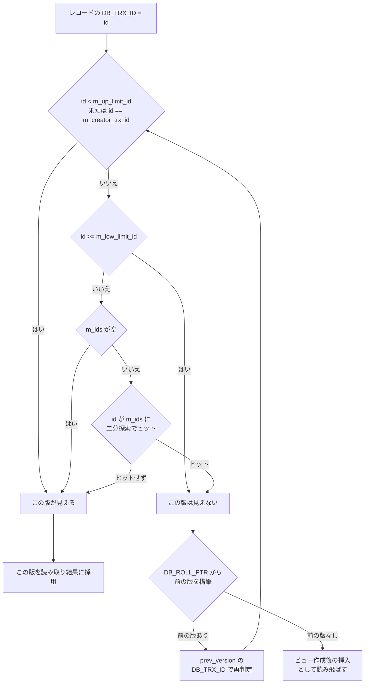

# 第24章 MVCC とリードビュー

> **本章で読むソース**
>
> - [`storage/innobase/include/read0types.h`](https://github.com/mysql/mysql-server/blob/mysql-8.4.10/storage/innobase/include/read0types.h)
> - [`storage/innobase/read/read0read.cc`](https://github.com/mysql/mysql-server/blob/mysql-8.4.10/storage/innobase/read/read0read.cc)
> - [`storage/innobase/row/row0vers.cc`](https://github.com/mysql/mysql-server/blob/mysql-8.4.10/storage/innobase/row/row0vers.cc)
> - [`storage/innobase/row/row0sel.cc`](https://github.com/mysql/mysql-server/blob/mysql-8.4.10/storage/innobase/row/row0sel.cc)
> - [`storage/innobase/lock/lock0lock.cc`](https://github.com/mysql/mysql-server/blob/mysql-8.4.10/storage/innobase/lock/lock0lock.cc)

## この章の狙い

第19章で、InnoDB の削除は行を物理的に消さず削除マークを立てるだけにとどまり、変更前のレコードは `DB_TRX_ID` と `DB_ROLL_PTR` を通じて undo ログにつながったまま残ることを読んだ。
本章では、その残された過去のバージョンを使って、ロックを取らない読み取りに一貫した断面を見せる仕組みを読む。

InnoDB は同じ行に複数のバージョンを同居させる。
クラスタ化インデックスの葉に置かれた最新版は、`DB_ROLL_PTR` から undo ログをたどると一つ前の版を復元でき、それをまたたどればさらに前の版が出る。
この履歴の鎖を**MVCC**（多版同時実行制御、Multi Version Concurrency Control）と呼ぶ。
書き手は最新版を上書きしながら古い版を undo ログに積み、読み手はその鎖の中から自分に見えるべき版を選ぶ。
だから読み手は書き手をブロックせず、書き手も読み手をブロックしない。

選択の基準を与えるのが**リードビュー**（read view、`ReadView`）である。
リードビューは、ある時点で「まだコミットしていなかった読み書きトランザクションの集合」を凍結したスナップショットで、一度作ればその後に他のトランザクションが何をコミットしても中身は変わらない。
あるレコードの版が自分に見えるかどうかは、その版を作ったトランザクションの ID をこのスナップショットに照らして決まる。

本章で押さえる要点は3つである。
第1に、リードビューは作成時点のアクティブな ID 集合を、上限と下限という2つの境界値とともに捉える。
第2に、可視性判定 `ReadView::changes_visible` は、この上下限で大半のレコードを集合の探索なしに即決し、境界の内側に落ちたものだけを二分探索で判定する。
第3に、見えない版に当たったら `DB_ROLL_PTR` から undo をたどり、見える版が出るまで履歴を遡って復元する。

## 前提

第19章で、行が持つ隠れ列 `DB_TRX_ID`（その行を最後に変更したトランザクションの ID）と `DB_ROLL_PTR`（変更前の版を指す undo ログへのポインタ）を読んだ。
本章の可視性判定はこの `DB_TRX_ID` を入力に取り、版の復元はこの `DB_ROLL_PTR` をたどる。

undo ログそのものの構造と、不要になった古い版を物理的に回収するパージは第25章へ送る。
本章は、すでに undo ログとして存在する過去の版を、読み手がどう選び取るかに集中する。
トランザクション ID の採番やトランザクションの状態管理は第23章で扱う。

## リードビューが捉えるもの

リードビューの本体は、4つのトランザクション ID と1つの ID 集合である。

[`storage/innobase/include/read0types.h` L281-L297](https://github.com/mysql/mysql-server/blob/mysql-8.4.10/storage/innobase/include/read0types.h#L281-L297)

```cpp
 private:
  /** The read should not see any transaction with trx id >= this
  value. In other words, this is the "high water mark". */
  trx_id_t m_low_limit_id;

  /** The read should see all trx ids which are strictly
  smaller (<) than this value.  In other words, this is the
  low water mark". */
  trx_id_t m_up_limit_id;

  /** trx id of creating transaction, set to TRX_ID_MAX for free
  views. */
  trx_id_t m_creator_trx_id;

  /** Set of RW transactions that was active when this snapshot
  was taken */
  ids_t m_ids;
```

`m_ids` が、ビュー作成時に走っていた読み書きトランザクションの ID 集合である。
これらのトランザクションはまだコミットしていないので、その変更は自分には見えてはならない。

`m_low_limit_id` と `m_up_limit_id` は、この集合を挟む2つの境界値である。
`m_low_limit_id` は「次に採番される ID」で、これ以上の ID を持つ変更はビュー作成より後に始まったものだから見えない（上の水位）。
`m_up_limit_id` はアクティブ集合の最小 ID で、これより小さい ID は集合に属さずすでにコミット済みだから無条件で見える（下の水位）。
`m_creator_trx_id` はビューを作った自分自身の ID で、自分の変更は常に見えなければならない。

この境界値はビューを開くときに確定する。

[`storage/innobase/read/read0read.cc` L447-L471](https://github.com/mysql/mysql-server/blob/mysql-8.4.10/storage/innobase/read/read0read.cc#L447-L471)

```cpp
void ReadView::prepare(trx_id_t id) {
  ut_ad(trx_sys_mutex_own());

  m_creator_trx_id = id;

  m_low_limit_no = trx_get_serialisation_min_trx_no();

  m_low_limit_id = trx_sys_get_next_trx_id_or_no();

  ut_a(m_low_limit_no <= m_low_limit_id);

  if (!trx_sys->rw_trx_ids.empty()) {
    copy_trx_ids(trx_sys->rw_trx_ids);
  } else {
    m_ids.clear();
  }

  /* The first active transaction has the smallest id. */
  m_up_limit_id = !m_ids.empty() ? m_ids.front() : m_low_limit_id;

  ut_a(m_up_limit_id <= m_low_limit_id);

  ut_d(m_view_low_limit_no = m_low_limit_no);
  m_closed = false;
}
```

`prepare` はトランザクションシステムのミューテックスを握った状態で呼ばれる。
`m_low_limit_id` には、その瞬間に次へ払い出される ID（`trx_sys_get_next_trx_id_or_no`）を入れる。
`m_ids` には、グローバルなアクティブ読み書きトランザクションの ID リスト `trx_sys->rw_trx_ids` を `copy_trx_ids` でコピーする。
このコピーの中で `m_up_limit_id` には集合の先頭、つまり最小の ID が入る（リストは ID 昇順に保たれている）。
アクティブな読み書きトランザクションが1つもなければ、`m_up_limit_id` は `m_low_limit_id` と同じになり、その時点までの全コミットが見える状態になる。

凍結はこの一瞬で完結する。
ミューテックスを離した後は、他のトランザクションが新たに始まろうとコミットしようと、このビューの4値と集合は書き換わらない。
だからリードビューは、作成時点でのデータベースの一貫した断面を表し続ける。

`copy_trx_ids` はコピーの際に、自分自身の ID をアクティブ集合から取り除く。

[`storage/innobase/read/read0read.cc` L374-L408](https://github.com/mysql/mysql-server/blob/mysql-8.4.10/storage/innobase/read/read0read.cc#L374-L408)

```cpp
  /* Copy all the trx_ids except the creator trx id */

  if (m_creator_trx_id > 0) {
    /* Note: We go through all this trouble because it is
    unclear whether std::vector::resize() will cause an
    overhead or not. We should test this extensively and
    if the vector to vector copy is fast enough then get
    rid of this code and replace it with more readable
    and obvious code. The code below does exactly one copy,
    and filters out the creator's trx id. */

    trx_ids_t::const_iterator it =
        std::lower_bound(trx_ids.begin(), trx_ids.end(), m_creator_trx_id);

    ut_ad(it != trx_ids.end() && *it == m_creator_trx_id);

    ulint i = std::distance(trx_ids.begin(), it);
    ulint n = i * sizeof(trx_ids_t::value_type);

    ::memmove(p, &trx_ids[0], n);

    n = (trx_ids.size() - i - 1) * sizeof(trx_ids_t::value_type);

    ut_ad(i + (n / sizeof(trx_ids_t::value_type)) == m_ids.size());

    if (n > 0) {
      ::memmove(p + i, &trx_ids[i + 1], n);
    }
  } else {
    ulint n = size * sizeof(trx_ids_t::value_type);

    ::memmove(p, &trx_ids[0], n);
  }

  m_up_limit_id = m_ids.front();
```

自分の ID をアクティブ集合に残さないのは、後の可視性判定で自分の変更を見えないものとして弾かないためである。
自分の ID は `m_creator_trx_id` が別に保持し、判定では特別扱いする。
コピーは、自分の ID の位置を二分探索（`std::lower_bound`）で見つけ、その前後を2回の `memmove` で詰めて1回のパスで済ませている。

## 可視性判定 `changes_visible`

あるレコードの版が見えるかどうかは、その版の `DB_TRX_ID` を1つ受け取り、ビューに照らして真偽を返す `changes_visible` が決める。

[`storage/innobase/include/read0types.h` L163-L183](https://github.com/mysql/mysql-server/blob/mysql-8.4.10/storage/innobase/include/read0types.h#L163-L183)

```cpp
  [[nodiscard]] bool changes_visible(trx_id_t id,
                                     const table_name_t &name) const {
    ut_ad(id > 0);

    if (id < m_up_limit_id || id == m_creator_trx_id) {
      return (true);
    }

    check_trx_id_sanity(id, name);

    if (id >= m_low_limit_id) {
      return (false);

    } else if (m_ids.empty()) {
      return (true);
    }

    const ids_t::value_type *p = m_ids.data();

    return (!std::binary_search(p, p + m_ids.size(), id));
  }
```

判定は4段の関門で進む。
第1に、`id` が下の水位 `m_up_limit_id` より小さいか、自分自身の `m_creator_trx_id` と等しければ、即座に見える。
下の水位より小さい ID はアクティブ集合に含まれずすでにコミット済みであり、自分の変更は常に見えるべきだからである。
第2に、`id` が上の水位 `m_low_limit_id` 以上なら、ビュー作成より後に始まった変更なので見えない。
第3に、アクティブ集合が空なら、上下の水位の間に弾く相手はいないので見える。
第4に、ここまで決着しなかった ID、つまり下の水位以上で上の水位未満のものだけを、アクティブ集合 `m_ids` への二分探索で確かめる。
集合に含まれていれば、それはビュー作成時に走っていた未コミットの変更だから見えず、含まれていなければコミット済みだから見える。

二分探索が成り立つのは、`m_ids` が ID 昇順に並んでいるからである。
`std::binary_search` がヒットすれば「アクティブだった」ので不可視、ヒットしなければ可視となる。
判定は `!std::binary_search(...)` の否定で返している。

### 上下の水位で大半を即決する設計

可視性判定の高速化は、この上下2つの水位にある。
リードビューは、ビュー作成時に走っていた読み書きトランザクションの ID を昇順の集合 `m_ids` として持つが、毎回この集合を探索すると、長時間走るトランザクションが多い環境では1レコードごとの判定が重くなる。

そこで InnoDB は、集合の最小 ID を `m_up_limit_id`、その時点での次の採番値を `m_low_limit_id` として持ち、この2値で集合の外側を先に切り落とす。
読み取り中に出会うレコードの `DB_TRX_ID` は、その多くが「ずっと前にコミット済み」か「ビュー作成より後に変更された」かのどちらかに寄る。
前者は `m_up_limit_id` 未満で、後者は `m_low_limit_id` 以上で、いずれも比較1回で決着し、集合へのアクセスが要らない。
二分探索に入るのは、2つの水位に挟まれた狭い区間に `DB_TRX_ID` が落ちた版だけである。
つまり、ソート済み集合の探索を回避できる比率を最大化する境界の取り方が、この判定の速さを支えている。

## 見えない版を undo から復元する

`changes_visible` が偽を返したら、目の前のレコードは自分には新しすぎる。
そのときは `DB_ROLL_PTR` から undo ログをたどり、自分に見える版が出るまで履歴を遡る。
これを担うのが `row_vers_build_for_consistent_read` である。

[`storage/innobase/row/row0vers.cc` L1281-L1337](https://github.com/mysql/mysql-server/blob/mysql-8.4.10/storage/innobase/row/row0vers.cc#L1281-L1337)

```cpp
  for (;;) {
    mem_heap_t *prev_heap = heap;

    heap = mem_heap_create(1024, UT_LOCATION_HERE);

    if (vrow) {
      *vrow = nullptr;
    }

    /* If purge can't see the record then we can't rely on
    the UNDO log record. */

    bool purge_sees =
        trx_undo_prev_version_build(rec, mtr, version, index, *offsets, heap,
                                    &prev_version, nullptr, vrow, 0, lob_undo);

    err = (purge_sees) ? DB_SUCCESS : DB_MISSING_HISTORY;

    if (prev_heap != nullptr) {
      mem_heap_free(prev_heap);
    }

    if (prev_version == nullptr) {
      /* It was a freshly inserted version */
      *old_vers = nullptr;
      ut_ad(!vrow || !(*vrow));
      break;
    }

    *offsets = rec_get_offsets(prev_version, index, *offsets, ULINT_UNDEFINED,
                               UT_LOCATION_HERE, offset_heap);

// ... (中略) ...

    trx_id = row_get_rec_trx_id(prev_version, index, *offsets);

    if (view->changes_visible(trx_id, index->table->name)) {
      /* The view already sees this version: we can copy
      it to in_heap and return */

      buf =
          static_cast<byte *>(mem_heap_alloc(in_heap, rec_offs_size(*offsets)));

      *old_vers = rec_copy(buf, prev_version, *offsets);
      rec_offs_make_valid(*old_vers, index, *offsets);

      if (vrow && *vrow) {
        *vrow = dtuple_copy(*vrow, in_heap);
        dtuple_dup_v_fld(*vrow, in_heap);
      }
      break;
    }

    version = prev_version;
  }
```

ループは現在の版から1つ前の版を作り、それが見えるかを確かめる、を繰り返す。
`trx_undo_prev_version_build` が `DB_ROLL_PTR` の指す undo レコードを適用して `prev_version` を組み立てる。
`prev_version` が `nullptr` になるのは、現在の版より前に履歴がない場合で、それはこの行がビュー作成より後に挿入されたことを意味する。
このとき `old_vers` を `nullptr` にして返し、呼び出し側はこの行を「自分にはまだ存在しない」として読み飛ばす。

前の版が得られたら、その `DB_TRX_ID` を取り出し、再び `changes_visible` に通す。
見えればその版を呼び出し側のヒープへコピーして返し、ループを抜ける。
まだ見えなければ `version` を1つ前へ進め、さらに古い版へとたどる。
こうして、自分のリードビューに見える最初の版が、一貫読みの結果になる。

この関数は、入口で渡された `rec`（最新版）がそもそも見えないこと（`!view->changes_visible(trx_id, ...)`）を前提に呼ばれる。
最新版が見えるかどうかの最初の判定は、呼び出し側がすでに済ませている。

## 一貫読みでの版選択

選択の流れを呼び出し側から見ると、判定と復元の役割分担がはっきりする。
ロックを取らない `SELECT`（一貫読み）の本体 `row_search_mvcc` は、レコードごとに次のように分岐する。

[`storage/innobase/row/row0sel.cc` L5319-L5347](https://github.com/mysql/mysql-server/blob/mysql-8.4.10/storage/innobase/row/row0sel.cc#L5319-L5347)

```cpp
    } else if (index == clust_index) {
      /* Fetch a previous version of the row if the current
      one is not visible in the snapshot; if we have a very
      high force recovery level set, we try to avoid crashes
      by skipping this lookup */

      if (srv_force_recovery < 5 &&
          !lock_clust_rec_cons_read_sees(rec, index, offsets,
                                         trx_get_read_view(trx))) {
        rec_t *old_vers;
        /* The following call returns 'offsets' associated with 'old_vers' */
        err = row_sel_build_prev_vers_for_mysql(
            trx->read_view, clust_index, prebuilt, rec, &offsets, &heap,
            &old_vers, need_vrow ? &vrow : nullptr, &mtr,
            prebuilt->get_lob_undo());

        if (err != DB_SUCCESS) {
          goto lock_wait_or_error;
        }

        if (old_vers == nullptr) {
          /* The row did not exist yet in
          the read view */

          goto next_rec;
        }

        rec = old_vers;
        prev_rec = rec;
```

クラスタ化インデックスのレコードについては、まず `lock_clust_rec_cons_read_sees` で最新版が見えるかを問う。
見えればそのまま使い、見えなければ前の版の構築（`row_sel_build_prev_vers_for_mysql` を経て `row_vers_build_for_consistent_read`）に入る。
復元結果が `nullptr`（ビュー作成より後の挿入）なら `next_rec` へ飛び、その行を読み飛ばす。

最新版が見えるかの判定は、結局 `changes_visible` の呼び出しに帰着する。

[`storage/innobase/lock/lock0lock.cc` L235-L261](https://github.com/mysql/mysql-server/blob/mysql-8.4.10/storage/innobase/lock/lock0lock.cc#L235-L261)

```cpp
bool lock_clust_rec_cons_read_sees(
    const rec_t *rec,     /*!< in: user record which should be read or
                          passed over by a read cursor */
    dict_index_t *index,  /*!< in: clustered index */
    const ulint *offsets, /*!< in: rec_get_offsets(rec, index) */
    ReadView *view)       /*!< in: consistent read view */
{
  ut_ad(index->is_clustered());
  ut_ad(page_rec_is_user_rec(rec));
  ut_ad(rec_offs_validate(rec, index, offsets));

  /* Temp-tables are not shared across connections and multiple
  transactions from different connections cannot simultaneously
  operate on same temp-table and so read of temp-table is
  always consistent read. */
  if (srv_read_only_mode || index->table->is_temporary()) {
    ut_ad(view == nullptr || index->table->is_temporary());
    return (true);
  }

  /* NOTE that we call this function while holding the search
  system latch. */

  trx_id_t trx_id = row_get_rec_trx_id(rec, index, offsets);

  return (view->changes_visible(trx_id, index->table->name));
}
```

この関数はレコードから `DB_TRX_ID` を取り出し、ビューの `changes_visible` に渡すだけである。
一時テーブルは接続をまたいで共有されないので、常に見えるものとして判定を省く。

セカンダリインデックスのレコードには、それ自体に `DB_TRX_ID` の正確な版情報がない。
セカンダリインデックスのページが持つのは、そのページを最後に更新したトランザクションの ID だけなので、`lock_sec_rec_cons_read_sees` はページ単位の上限で「確実に見える」場合だけを即答し、確証が持てなければクラスタ化インデックスへ降りて版を確かめる。
このため、セカンダリインデックス経由の一貫読みでも、最終的な版選択はクラスタ化インデックスの `changes_visible` と undo の遡りに帰着する。

判定から復元までの流れを図にすると、次のようになる。



## 分離レベルとビュー取得のタイミング

リードビューが捉える断面の鮮度は、分離レベルで決まる。
違いは、ビューを作る関数ではなく、いつ古いビューを閉じて作り直すかにある。

一貫読みの入口では、文の開始時にビューを割り当てる。

[`storage/innobase/row/row0sel.cc` L4824-L4832](https://github.com/mysql/mysql-server/blob/mysql-8.4.10/storage/innobase/row/row0sel.cc#L4824-L4832)

```cpp
  } else if (prebuilt->select_lock_type == LOCK_NONE) {
    /* This is a consistent read */
    /* Assign a read view for the query */

    if (!srv_read_only_mode) {
      trx_assign_read_view(trx);
    }

    prebuilt->sql_stat_start = false;
```

`trx_assign_read_view` は、ビューがまだ無いときだけ新しく開く。

[`storage/innobase/trx/trx0trx.cc` L2319-L2333](https://github.com/mysql/mysql-server/blob/mysql-8.4.10/storage/innobase/trx/trx0trx.cc#L2319-L2333)

```cpp
ReadView *trx_assign_read_view(trx_t *trx) /*!< in/out: active transaction */
{
  ut_ad(trx_can_be_handled_by_current_thread_or_is_hp_victim(trx));
  ut_ad(trx->state.load(std::memory_order_relaxed) == TRX_STATE_ACTIVE);

  if (srv_read_only_mode) {
    ut_ad(trx->read_view == nullptr);
    return (nullptr);

  } else if (!MVCC::is_view_active(trx->read_view)) {
    trx_sys->mvcc->view_open(trx->read_view, trx);
  }

  return (trx->read_view);
}
```

ここがアクティブなビューを持っていれば何もしないので、トランザクション内で同じビューを使い回せる。
そこで違いを生むのが、文の終わりにビューを閉じるかどうかである。

READ COMMITTED 以下の分離レベルでは、文の完了時にビューを明示的に閉じる。

[`storage/innobase/handler/ha_innodb.cc` L19132-L19139](https://github.com/mysql/mysql-server/blob/mysql-8.4.10/storage/innobase/handler/ha_innodb.cc#L19132-L19139)

```cpp
    } else if (trx->isolation_level <= TRX_ISO_READ_COMMITTED &&
               MVCC::is_view_active(trx->read_view)) {
      mutex_enter(&trx_sys->mutex);

      trx_sys->mvcc->view_close(trx->read_view, true);

      mutex_exit(&trx_sys->mutex);
    }
```

この閉鎖によって、次の文の入口で `trx_assign_read_view` がアクティブなビューを見つけられず、新しいビューを開き直す。
だから READ COMMITTED では、文ごとに最新の断面が取り直され、同じトランザクション内でも文をまたぐと他トランザクションのコミットが見える。

REPEATABLE READ では、この閉鎖を行わない。
ビューは最初の一貫読みで開かれた後、コミットまで閉じられないので、トランザクションの間ずっと同じ断面を見続ける。
同じ行を2回読めば、間に他トランザクションがコミットしていても同じ値が返る。
ビューを作る `prepare` の処理は両者で同一であり、断面の固定と取り直しの違いは、文末でビューを閉じるかどうかという一点に集約されている。

## まとめ

InnoDB の MVCC は、書き手が上書きしながら undo ログに積んだ古い版を、読み手がリードビューに照らして選び取る仕組みである。
リードビューは作成時のアクティブな読み書きトランザクション集合 `m_ids` を、下の水位 `m_up_limit_id` と上の水位 `m_low_limit_id` とともに凍結する。
可視性判定 `changes_visible` は、この上下の水位で集合の外側を比較1回ずつ切り落とし、間に挟まれた ID だけを `m_ids` への二分探索で確かめる。

本章で読んだ最適化の工夫は、この上下2つの水位で大半のレコードを集合の探索なしに即決する点にある。
読み取りで出会う `DB_TRX_ID` の多くは、ずっと前のコミット（下の水位未満で可視）かビュー作成後の変更（上の水位以上で不可視）のどちらかに寄るので、ソート済み集合 `m_ids` への二分探索に入るのは2つの水位に挟まれた狭い区間だけになる。

最新版が見えないと判定されたら、`row_vers_build_for_consistent_read` が `DB_ROLL_PTR` から undo をたどり、見える版が出るまで履歴を遡って復元する。
履歴の先頭まで遡っても見える版がなければ、その行はビュー作成より後の挿入なので読み飛ばす。

ビューを取り直すタイミングは分離レベルで分かれる。
REPEATABLE READ は最初の読みでビューを固定してコミットまで保ち、READ COMMITTED は文の完了ごとにビューを閉じて次の文で取り直す。

## 関連する章

- [第19章 行の挿入、更新、削除](../part03-index-row/19-row-dml.md)：本章が遡る古い版の生成元である、`DB_TRX_ID` と `DB_ROLL_PTR` の設定と削除マークを読む。
- [第18章 レコード検索とカーソル](../part03-index-row/18-search-and-cursor.md)：本章が版を判定するレコードを、カーソルがどう探し当てるかを読む。
- [第16章 ミニトランザクション](../part02-innodb-foundation/16-mini-transaction.md)：本章の版復元がページのラッチを取りながら undo を読む、その mtr の枠組みを読む。
- [第11章 ハンドラ API](../part01-sql-layer/11-handler-api.md)：SQL 層の `SELECT` が一貫読みとして本章の入口へ届くまでを読む。
