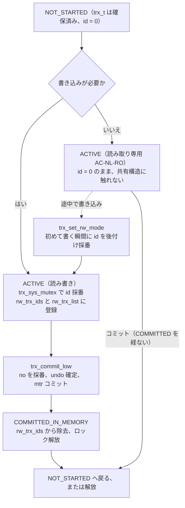

# 第28章 トランザクション管理

> **本章で読むソース**
>
> - [`storage/innobase/trx/trx0trx.cc`](https://github.com/mysql/mysql-server/blob/mysql-8.4.10/storage/innobase/trx/trx0trx.cc)
> - [`storage/innobase/include/trx0trx.h`](https://github.com/mysql/mysql-server/blob/mysql-8.4.10/storage/innobase/include/trx0trx.h)
> - [`storage/innobase/include/trx0types.h`](https://github.com/mysql/mysql-server/blob/mysql-8.4.10/storage/innobase/include/trx0types.h)
> - [`storage/innobase/trx/trx0sys.cc`](https://github.com/mysql/mysql-server/blob/mysql-8.4.10/storage/innobase/trx/trx0sys.cc)
> - [`storage/innobase/include/trx0sys.h`](https://github.com/mysql/mysql-server/blob/mysql-8.4.10/storage/innobase/include/trx0sys.h)
> - [`storage/innobase/include/trx0sys.ic`](https://github.com/mysql/mysql-server/blob/mysql-8.4.10/storage/innobase/include/trx0sys.ic)

## この章の狙い

第21章で読んだミニトランザクション（mtr）は、複数ページへの一続きの変更を不可分にまとめる低い層の単位だった。
その上に、SQL が見るトランザクションがある。
`BEGIN` から `COMMIT` までの一連の文を、すべて反映するかまったく反映しないかのどちらかに保ち、他のトランザクションには一貫した状態だけを見せる。
この保証を担うのが、本章で読む InnoDB のトランザクション本体 `trx_t` である。

`trx_t` は、状態、分離レベル、リードビュー、undo ログへのポインタを束ねた構造体である。
1つのトランザクションは、開始されてから `trx_t` の状態を `TRX_STATE_ACTIVE` に変え、コミットで `TRX_STATE_COMMITTED_IN_MEMORY` を経て `TRX_STATE_NOT_STARTED` に戻る。
本章では、この状態がどこで遷移し、各遷移で何が確定するのかを `storage/innobase/trx/trx0trx.cc` に即して読む。

トランザクションの開始には、InnoDB ならではの遅延がある。
`trx_t` は接続ごとに用意されるが、トランザクション ID（TRX_ID）は開始時点では割り当てない。
書き込みが必要になって初めて採番し、それまでは ID を持たないまま読み取りを進める。
この遅延採番が、読み取り専用トランザクションを軽量に保つ鍵である。
開始の関数 `trx_start_low` を読み、なぜ ID を遅らせるのかを見る。

トランザクション全体を束ねるグローバル構造が、トランザクションシステム `trx_sys` である。
アクティブな読み書きトランザクションの ID 集合 `rw_trx_ids` と、次に配る ID の源 `next_trx_id_or_no` を持つ。
リードビューはこの `rw_trx_ids` のスナップショットから作られる（第29章）。
コミット時に `trx_t` が `trx_sys` からどう外れ、undo がどう確定するかまでを追う。

MVCC とリードビューの中身は第29章、undo ログとパージは第30章、ロックは第31章で読む。
本章は、その土台となるトランザクションの一生に絞る。

## 前提

第21章で、InnoDB のページ変更は mtr 単位で原子的に適用され、コミット時に redo ログへ書き出されることを読んだ。
本章のトランザクションのコミットは、内部でこの mtr を1つ起こし、undo ログの確定とコミットの記録を1つの mtr に押し込んでコミットする。
つまり SQL のトランザクションの確定は、mtr のコミットの上に乗っている。

undo ログについては、本章では「変更前の値を記録し、ロールバックと MVCC の古いバージョン再構成に使うログ」という理解で足りる。
トランザクションが書き込みを行うと、ロールバックセグメント（rseg）上の undo ログにレコードが積まれる。
その undo の確定と、パージ（不要になった undo の回収）の詳細は第30章で読む。

## トランザクションの状態 `trx_state_t`

`trx_t` の中心にあるのは、トランザクションが今どの段階にいるかを表す状態である。
状態は `trx_state_t` 列挙型で、5つの値を持つ。

[`storage/innobase/include/trx0types.h` L79-L94](https://github.com/mysql/mysql-server/blob/mysql-8.4.10/storage/innobase/include/trx0types.h#L79-L94)

```cpp
/** Transaction states (trx_t::state) */
enum trx_state_t {

  TRX_STATE_NOT_STARTED,

  /** Same as not started but with additional semantics that it
  was rolled back asynchronously the last time it was active. */
  TRX_STATE_FORCED_ROLLBACK,

  TRX_STATE_ACTIVE,

  /** Support for 2PC/XA */
  TRX_STATE_PREPARED,

  TRX_STATE_COMMITTED_IN_MEMORY
};
```

`TRX_STATE_NOT_STARTED` は、まだ InnoDB 内で始まっていない状態である。
接続ごとの `trx_t` は、文が実行されるまでこの状態でいる。
`TRX_STATE_ACTIVE` は実行中、`TRX_STATE_PREPARED` は XA の2相コミットで準備が済んだ状態、`TRX_STATE_COMMITTED_IN_MEMORY` はメモリ上ではコミットが済み、後始末（ロック解放やリードビューの破棄）を残す状態である。
`TRX_STATE_FORCED_ROLLBACK` は、高優先度トランザクションに割り込まれて非同期にロールバックされた後の `NOT_STARTED` 相当を表す。

許される状態遷移は `trx_t` の `state` フィールドのコメントに整理されている。

[`storage/innobase/include/trx0trx.h` L748-L763](https://github.com/mysql/mysql-server/blob/mysql-8.4.10/storage/innobase/include/trx0trx.h#L748-L763)

```cpp
  Valid state transitions are:

  Regular transactions:
  * NOT_STARTED -> ACTIVE -> COMMITTED -> NOT_STARTED

  Auto-commit non-locking read-only:
  * NOT_STARTED -> ACTIVE -> NOT_STARTED

  XA (2PC):
  * NOT_STARTED -> ACTIVE -> PREPARED -> COMMITTED -> NOT_STARTED

  Recovered XA:
  * NOT_STARTED -> PREPARED -> COMMITTED -> (freed)

  XA (2PC) (shutdown or disconnect before ROLLBACK or COMMIT):
  * NOT_STARTED -> PREPARED -> (freed)
```

通常のトランザクションは `NOT_STARTED -> ACTIVE -> COMMITTED -> NOT_STARTED` をたどる。
注目したいのは2つ目の経路である。
オートコミットの非ロック読み取り専用トランザクション（コメントの「Auto-commit non-locking read-only」、以下「AC-NL-RO」）は、`COMMITTED` を経ずに `ACTIVE` から直接 `NOT_STARTED` に戻る。
コミットで確定すべき書き込みも、解放すべきロックも持たないため、後始末の段階が要らないからである。
この分岐が、本章で説明する最適化の核心になる。

状態 `state` は `std::atomic` として持たれ、`trx->mutex` で保護される。

[`storage/innobase/include/trx0trx.h` L800-L800](https://github.com/mysql/mysql-server/blob/mysql-8.4.10/storage/innobase/include/trx0trx.h#L800-L800)

```cpp
  std::atomic<trx_state_t> state;
```

## ID と分離レベルを束ねる `trx_t`

状態のほかに、`trx_t` はトランザクションを識別し、可視性を決める値を持つ。
まずトランザクション ID である。

[`storage/innobase/include/trx0trx.h` L727-L727](https://github.com/mysql/mysql-server/blob/mysql-8.4.10/storage/innobase/include/trx0trx.h#L727-L727)

```cpp
  trx_id_t id; /*!< transaction id */
```

`id` は書き込みを行うトランザクションを一意に識別する番号である。
更新したレコードのヘッダには、この `id` が TRX_ID として刻まれ、どのトランザクションが最後に触ったかを示す。
重要なのは、`id` の初期値が `0` であり、書き込みが必要になるまで採番されないことである。
読み取りだけのトランザクションは `id == 0` のまま終わり、共有構造への登録もしない。

`id` と別に、コミット順を表す番号 `no` がある。

[`storage/innobase/include/trx0trx.h` L729-L735](https://github.com/mysql/mysql-server/blob/mysql-8.4.10/storage/innobase/include/trx0trx.h#L729-L735)

```cpp
  trx_id_t no; /*!< transaction serialization number:
               max trx id shortly before the
               transaction is moved to
               COMMITTED_IN_MEMORY state.
               Protected by trx_sys_t::mutex
               when trx->in_rw_trx_list. Initially
               set to TRX_ID_MAX. */
```

`no` はコミットの直前に割り当てるシリアライズ番号である。
`id` がトランザクションの「生まれた順」を表すのに対し、`no` は「コミットした順」を表す。
パージはこの `no` の昇順で undo を回収し、リードビューはこの番号でコミット済みかどうかの境界を決める。
初期値は `TRX_ID_MAX` であり、コミットしないかぎり「まだ非常に大きい」とみなされる。

可視性のもう1つの軸が分離レベルである。
`isolation_level_t` は4段階を持ち、`trx_t::isolation_level` に保持される。

[`storage/innobase/include/trx0trx.h` L676-L699](https://github.com/mysql/mysql-server/blob/mysql-8.4.10/storage/innobase/include/trx0trx.h#L676-L699)

```cpp
  enum isolation_level_t {

    /** dirty read: non-locking SELECTs are performed so that we
    do not look at a possible earlier version of a record; thus
    they are not 'consistent' reads under this isolation level;
    otherwise like level 2 */
    READ_UNCOMMITTED,

    /** somewhat Oracle-like isolation, except that in range UPDATE
    and DELETE we must block phantom rows with next-key locks;
    SELECT ... FOR UPDATE and ...  LOCK IN SHARE MODE only lock
    the index records, NOT the gaps before them, and thus allow
    free inserting; each consistent read reads its own snapshot */
    READ_COMMITTED,

    /** this is the default; all consistent reads in the same trx
    read the same snapshot; full next-key locking used in locking
    reads to block insertions into gaps */
    REPEATABLE_READ,

    /** all plain SELECTs are converted to LOCK IN SHARE MODE
    reads */
    SERIALIZABLE
  };
```

InnoDB の既定は `REPEATABLE_READ` である。
このとき同一トランザクション内の一貫読み取りは同じスナップショット（リードビュー）を共有する。
分離レベルはリードビューをいつ作り直すかを左右し、`READ_COMMITTED` では各文ごとにビューを取り直す。
ビューそのものの作り方は第29章で読む。

可視性に使うリードビューへのポインタは `read_view` に持つ。

[`storage/innobase/include/trx0trx.h` L809-L810](https://github.com/mysql/mysql-server/blob/mysql-8.4.10/storage/innobase/include/trx0trx.h#L809-L810)

```cpp
  ReadView *read_view; /*!< consistent read view used in the
                       transaction, or NULL if not yet set */
```

`read_view` も `id` と同じく遅延して作られ、必要になるまで `NULL` のままである。
この「必要になるまで作らない、登録しない」という姿勢が、`trx_t` の各所に通底している。

## 遅延した開始 `trx_start_low`

トランザクションの開始は `trx_start_low` で行う。
ただし接続のたびに呼ばれるわけではない。
実際の入口は `trx_start_if_not_started_low` であり、状態を見てまだ始まっていなければ `trx_start_low` を呼ぶ。

[`storage/innobase/trx/trx0trx.cc` L3366-L3388](https://github.com/mysql/mysql-server/blob/mysql-8.4.10/storage/innobase/trx/trx0trx.cc#L3366-L3388)

```cpp
void trx_start_if_not_started_low(trx_t *trx, bool read_write) {
  ut_ad(trx_can_be_handled_by_current_thread_or_is_hp_victim(trx));
  switch (trx->state.load(std::memory_order_relaxed)) {
    case TRX_STATE_NOT_STARTED:
    case TRX_STATE_FORCED_ROLLBACK:

      trx_start_low(trx, read_write);
      return;

    case TRX_STATE_ACTIVE:

      if (read_write && trx->id == 0 && !trx->read_only) {
        trx_set_rw_mode(trx);
      }
      return;

    case TRX_STATE_PREPARED:
    case TRX_STATE_COMMITTED_IN_MEMORY:
      break;
  }

  ut_error;
}
```

この関数には2段階の遅延がある。
1段目は、すでに `NOT_STARTED` なら `trx_start_low` でまとめて始める遅延である。
2段目は、すでに `ACTIVE` でも `id == 0` のまま読み取りだけで来たトランザクションが、初めて書き込みを要求した瞬間（`read_write` が真）に `trx_set_rw_mode` で読み書きへ昇格する遅延である。
ID は、この昇格の中で初めて割り当てられる。

`trx_start_low` の本体を見る。
まず実行種別を判定し、`read_only` かどうかを決める。

[`storage/innobase/trx/trx0trx.cc` L1324-L1337](https://github.com/mysql/mysql-server/blob/mysql-8.4.10/storage/innobase/trx/trx0trx.cc#L1324-L1337)

```cpp
  /* Check whether it is an AUTOCOMMIT SELECT */
  trx->auto_commit = (trx->api_trx && trx->api_auto_commit) ||
                     thd_trx_is_auto_commit(trx->mysql_thd);

  trx->read_only = (trx->api_trx && !trx->read_write) ||
                   (!trx->internal && thd_trx_is_read_only(trx->mysql_thd)) ||
                   srv_read_only_mode;

  if (!trx->auto_commit) {
    ++trx->will_lock;
  } else if (trx->will_lock == 0) {
    trx->read_only = true;
  }
  trx->persists_gtid = false;
```

`auto_commit` かつ `will_lock == 0`、すなわちロックを取らないオートコミット SELECT は、ここで `read_only` に確定する。
これが先ほどの AC-NL-RO であり、`trx_is_autocommit_non_locking` が真になるトランザクションである。

[`storage/innobase/include/trx0trx.h` L1151-L1153](https://github.com/mysql/mysql-server/blob/mysql-8.4.10/storage/innobase/include/trx0trx.h#L1151-L1153)

```cpp
static inline bool trx_is_autocommit_non_locking(const trx_t *t) {
  return t->auto_commit && t->will_lock == 0;
}
```

`no` の初期値もここで設定する。

[`storage/innobase/trx/trx0trx.cc` L1372-L1375](https://github.com/mysql/mysql-server/blob/mysql-8.4.10/storage/innobase/trx/trx0trx.cc#L1372-L1375)

```cpp
  /* The initial value for trx->no: TRX_ID_MAX is used in
  read_view_open_now: */

  trx->no = TRX_ID_MAX;
```

そして開始処理の山場が、ID を割り当てるかどうかの分岐である。

[`storage/innobase/trx/trx0trx.cc` L1401-L1458](https://github.com/mysql/mysql-server/blob/mysql-8.4.10/storage/innobase/trx/trx0trx.cc#L1401-L1458)

```cpp
  if (!trx->read_only &&
      (trx->mysql_thd == nullptr || read_write || trx->ddl_operation)) {
    trx_assign_rseg_durable(trx);

    /* Temporary rseg is assigned only if the transaction
    updates a temporary table */
    DEBUG_SYNC_C("trx_sys_before_assign_id");

    trx_sys_mutex_enter();

    trx->id = trx_sys_allocate_trx_id();

    trx_sys->rw_trx_ids.push_back(trx->id);

    ut_ad(trx->rsegs.m_redo.rseg != nullptr || srv_read_only_mode ||
          srv_force_recovery >= SRV_FORCE_NO_TRX_UNDO);

    trx_add_to_rw_trx_list(trx);

    trx->state.store(TRX_STATE_ACTIVE, std::memory_order_relaxed);

    ut_ad(trx_sys_validate_trx_list());

    trx_sys_mutex_exit();

    trx_sys_rw_trx_add(trx);

  } else {
    trx->id = 0;

    if (!trx_is_autocommit_non_locking(trx)) {
      /* If this is a read-only transaction that is writing
      to a temporary table then it needs a transaction id
      to write to the temporary table. */

      if (read_write) {
        trx_sys_mutex_enter();

        ut_ad(!srv_read_only_mode);

        trx->state.store(TRX_STATE_ACTIVE, std::memory_order_relaxed);

        trx->id = trx_sys_allocate_trx_id();

        trx_sys->rw_trx_ids.push_back(trx->id);

        trx_sys_mutex_exit();

        trx_sys_rw_trx_add(trx);

      } else {
        trx->state.store(TRX_STATE_ACTIVE, std::memory_order_relaxed);
      }
    } else {
      ut_ad(!read_write);
      trx->state.store(TRX_STATE_ACTIVE, std::memory_order_relaxed);
    }
  }
```

読み書きトランザクションのときだけ、上の枝に入る。
`trx_sys_mutex` を取って `trx_sys_allocate_trx_id` で `id` を採番し、それを `rw_trx_ids` に積み、`rw_trx_list` に登録してから `ACTIVE` にする。
この4つの操作（採番、ID 集合への追加、リストへの登録、状態遷移）が、グローバルな `trx_sys` への書き込みである。

読み取り専用のときは下の枝に入り、`trx->id = 0` のまま状態だけを `ACTIVE` にする。
`trx_sys_mutex` の取得も、`rw_trx_ids` への追加も、`rw_trx_list` への登録もしない。
共有構造に触れないため、読み取り専用トランザクションは互いにロックを競合させずに開始できる。
読み取り専用が一時テーブルへ書く特殊な場合だけ、ID が要るので中央の枝で採番する。

## 最適化の機構：読み取り専用は採番もロックも避ける

ここまでで、最適化の核心が見えている。
通常のトランザクションシステムなら、トランザクションを開始するたびに一意な番号を中央のカウンタから取り、アクティブな集合に登録する。
この登録は全スレッドで共有する構造への書き込みであり、`trx_sys_mutex` という1つのラッチで直列化される。
コネクションが何千とあり、その大半が SELECT を流すだけのワークロードでは、このラッチが律速になりかねない。

InnoDB は、読み取り専用トランザクションをこの直列化点から外す。
`trx_start_low` の下の枝で見たとおり、AC-NL-RO は `id = 0` のまま `ACTIVE` になり、`trx_sys_mutex` をいっさい取らない。
ID を採番しないので、グローバルカウンタ `next_trx_id_or_no` への `fetch_add` も発生しない。
`rw_trx_ids` にも `rw_trx_list` にも載らないので、他スレッドのリードビュー作成がこのトランザクションを走査することもない。
読み取り専用トランザクションは、自分の `trx_t` を `ACTIVE` にするだけで開始する。

この設計が効くのは、ID とアクティブ集合への登録が、読み取りには本来不要だからである。
TRX_ID は「自分が書いた行に刻む印」であり、書き込みがなければ刻む先がない。
`rw_trx_ids` は「他者から見えてはいけない未コミットの書き込み主」の一覧であり、書き込まないトランザクションは載る理由がない。
だから読み取り専用は、これらをまるごと省いても可視性の正しさを損なわない。
省いた分だけ、`trx_sys_mutex` の取得とアトミックなインクリメントが消え、読み取りの多いワークロードでスループットが上がる。

書き込みが本当に必要になったときだけ、`trx_set_rw_mode` が後から ID を与える。

[`storage/innobase/trx/trx0trx.cc` L3447-L3462](https://github.com/mysql/mysql-server/blob/mysql-8.4.10/storage/innobase/trx/trx0trx.cc#L3447-L3462)

```cpp
  trx_sys_mutex_enter();

  ut_ad(trx->id == 0);
  trx->id = trx_sys_allocate_trx_id();

  trx_sys->rw_trx_ids.push_back(trx->id);

  /* So that we can see our own changes. */
  if (MVCC::is_view_active(trx->read_view)) {
    MVCC::set_view_creator_trx_id(trx->read_view, trx->id);
  }
  trx_add_to_rw_trx_list(trx);

  trx_sys_mutex_exit();

  trx_sys_rw_trx_add(trx);
```

読み取りで始まったトランザクションが初めて行を更新する瞬間に、この昇格が走る。
ここで初めて `trx_sys_mutex` を取り、ID を採番し、`rw_trx_ids` と `rw_trx_list` に登録する。
すでにリードビューを開いていれば、自分の書き込みを自分には見せるため、ビューの作成者 ID を新しい `id` に書き換える。
読み取りで終わるトランザクションは、この昇格に一度も到達しない。

## トランザクションシステム `trx_sys`

採番と登録の相手が、グローバルなトランザクションシステム `trx_sys` である。
ID の源は `next_trx_id_or_no` という1つのアトミック変数で、ID と `no` の両方をここから配る。

[`storage/innobase/include/trx0sys.h` L486-L495](https://github.com/mysql/mysql-server/blob/mysql-8.4.10/storage/innobase/include/trx0sys.h#L486-L495)

```cpp
  /** The smallest number not yet assigned as a transaction id
  or transaction number. This is declared as atomic because it
  can be accessed without holding any mutex during AC-NL-RO
  view creation. When it is used for assignment of the trx->id,
  it is synchronized by the trx_sys_t::mutex. When it is used
  for assignment of the trx->no, it is synchronized by the
  trx_sys_t::serialisation_mutex. Note: it might be in parallel
  used for both trx->id and trx->no assignments (for different
  trx_t objects). */
  std::atomic<trx_id_t> next_trx_id_or_no;
```

`id`（生まれた順）と `no`（コミットした順）は同じ番号空間から配られる。
`id` の採番は `trx_sys_mutex` で、`no` の採番は別の `serialisation_mutex` で守られる。
2つのラッチを使い分けることで、開始の採番とコミットの採番が互いをブロックせず並行できる。

アクティブな読み書きトランザクションの ID 集合が `rw_trx_ids` である。

[`storage/innobase/include/trx0sys.h` L548-L552](https://github.com/mysql/mysql-server/blob/mysql-8.4.10/storage/innobase/include/trx0sys.h#L548-L552)

```cpp
  /** Array of Read write transaction IDs for MVCC snapshot. A ReadView would
  take a snapshot of these transactions whose changes are not visible to it.
  We should remove transactions from the list before committing in memory and
  releasing locks to ensure right order of removal and consistent snapshot. */
  trx_ids_t rw_trx_ids;
```

リードビューを作るとき、この `rw_trx_ids` のスナップショットを取る（第29章）。
ビューにとって、ここに載っている ID のトランザクションはまだコミットしていないため、その書き込みは見えない。
だからコミットでは、ロックを解放する前にこの集合から自分を外す順序が要る。

実際の採番は `trx_sys_allocate_trx_id_or_no` で行う。

[`storage/innobase/include/trx0sys.ic` L234-L266](https://github.com/mysql/mysql-server/blob/mysql-8.4.10/storage/innobase/include/trx0sys.ic#L234-L266)

```cpp
/** Allocates a new transaction id or transaction number.
@return new, allocated trx id or trx no */
inline trx_id_t trx_sys_allocate_trx_id_or_no() {
  ut_ad(trx_sys_mutex_own() || trx_sys_serialisation_mutex_own());

  trx_id_t trx_id = trx_sys->next_trx_id_or_no.fetch_add(1);

  if (trx_id % trx_sys_get_trx_id_write_margin() == 0) {
    /* Reserve the next range of trx_id values. This thread has acquired
    either the trx_sys_mutex or the trx_sys_serialisation_mutex.

    Therefore at least one of these two mutexes, is latched and it stays
    latched until the call to trx_sys_write_max_trx_id() is finished.

    Meanwhile other threads could be acquiring the other of these two mutexes,
    reserving more and more trx_id values, until TRX_SYS_TRX_ID_WRITE_MARGIN
    next values are reserved, when another trx_sys_write_max_trx_id() would
    be called. */

    trx_sys_write_max_trx_id();
  }
  return trx_id;
}

inline trx_id_t trx_sys_allocate_trx_id() {
  ut_ad(trx_sys_mutex_own());
  return trx_sys_allocate_trx_id_or_no();
}

inline trx_id_t trx_sys_allocate_trx_no() {
  ut_ad(trx_sys_serialisation_mutex_own());
  return trx_sys_allocate_trx_id_or_no();
}
```

採番自体は `fetch_add(1)` 1回で済む。
クラッシュ後も ID が後戻りしないよう、`next_trx_id_or_no` はディスク上の `max_trx_id` として永続化する必要がある。
だが採番のたびに書くと遅いので、`TRX_SYS_TRX_ID_WRITE_MARGIN`（256）ごとに1回だけ、未来の値をまとめてトランザクションシステムページに書き込む。

その書き込みが `trx_sys_write_max_trx_id` である。

[`storage/innobase/trx/trx0sys.cc` L100-L138](https://github.com/mysql/mysql-server/blob/mysql-8.4.10/storage/innobase/trx/trx0sys.cc#L100-L138)

```cpp
/** Writes the value of max_trx_id to the file based trx system header. */
void trx_sys_write_max_trx_id(void) {
  mtr_t mtr;
  trx_sysf_t *sys_header;

  /* The final synchronization happens here between maximum 2 threads,
  one holding the trx_sys_t::mutex and one holding the serialisation
  mutex. They can concurrently enter here, and start their mtrs.
  They will synchronize inside trx_sysf_get because only one of them
  could succeed in acquiring the x-lock for the header page to modify.
  That thread will then read the max_trx_id and write to the page.
  After it finishes mtr_commit, the another thread will succeed in
  acquiring the x-lock and it will again read the newest max_trx_id,
  and possibly re-write it. */

  ut_ad(trx_sys_mutex_own() || trx_sys_serialisation_mutex_own());

  if (!srv_read_only_mode) {
    DBUG_EXECUTE_IF(
        "trx_sys_write_max_trx_id__all_blocked",
        while (true) { std::this_thread::sleep_for(std::chrono::seconds(1)); });

#ifdef UNIV_DEBUG
    if (trx_sys_serialisation_mutex_own()) {
      DEBUG_SYNC_C("trx_sys_write_max_trx_id__ser");
    }
#endif /* UNIV_DEBUG */

    mtr_start(&mtr);

    sys_header = trx_sysf_get(&mtr);

    const trx_id_t max_trx_id = trx_sys->next_trx_id_or_no.load();

    mlog_write_ull(sys_header + TRX_SYS_TRX_ID_STORE, max_trx_id, &mtr);

    mtr_commit(&mtr);
  }
}
```

ページに書くのは、現在の `next_trx_id_or_no` そのものではなく、すでに次の256個分まで先に進めた値である。
こうしておけば、書き込んだ値より小さい ID しか実際には配っていないため、クラッシュしてこのページを読み戻したときに、再起動後の採番が過去の ID と衝突しない。
書き込みの回数を256分の1に減らしつつ、ID の単調性を保つ。

## コミット `trx_commit`

トランザクションの確定は `trx_commit` から始まる。
書き込みを行ったトランザクション（rseg を更新した）だけが mtr を起こし、それを `trx_commit_low` に渡す。

[`storage/innobase/trx/trx0trx.cc` L2256-L2277](https://github.com/mysql/mysql-server/blob/mysql-8.4.10/storage/innobase/trx/trx0trx.cc#L2256-L2277)

```cpp
/** Commits a transaction. */
void trx_commit(trx_t *trx) /*!< in/out: transaction */
{
  mtr_t *mtr;
  mtr_t local_mtr;

  DBUG_EXECUTE_IF("ib_trx_commit_crash_before_trx_commit_start",
                  DBUG_SUICIDE(););

  if (trx_is_rseg_updated(trx)) {
    mtr = &local_mtr;

    DBUG_EXECUTE_IF("ib_trx_commit_crash_rseg_updated", DBUG_SUICIDE(););

    mtr_start_sync(mtr);

  } else {
    mtr = nullptr;
  }

  trx_commit_low(trx, mtr);
}
```

何も書いていないトランザクションでは `mtr` が `nullptr` になる。
コミットを mtr の有無で二分するのが、コミット側の遅延である。
書き込みのないトランザクションには、undo の確定も redo へのコミット記録も要らないからである。

`trx_commit_low` は、その mtr の中で undo を確定し、コミットを記録する。

[`storage/innobase/trx/trx0trx.cc` L2192-L2238](https://github.com/mysql/mysql-server/blob/mysql-8.4.10/storage/innobase/trx/trx0trx.cc#L2192-L2238)

```cpp
  bool serialised;

  if (mtr != nullptr) {
    mtr->set_sync();

    DEBUG_SYNC_C("trx_sys_before_assign_no");

    serialised = trx_write_serialisation_history(trx, mtr);

    /* The following call commits the mini-transaction, making the
    whole transaction committed in the file-based world, at this
    log sequence number. The transaction becomes 'durable' when
    we write the log to disk, but in the logical sense the commit
    in the file-based data structures (undo logs etc.) happens
    here.

    NOTE that transaction numbers, which are assigned only to
    transactions with an update undo log, do not necessarily come
    in exactly the same order as commit lsn's, if the transactions
    have different rollback segments. To get exactly the same
    order we should hold the kernel mutex up to this point,
    adding to the contention of the kernel mutex. However, if
    a transaction T2 is able to see modifications made by
    a transaction T1, T2 will always get a bigger transaction
    number and a bigger commit lsn than T1. */

    /*--------------*/

    DBUG_EXECUTE_IF("trx_commit_to_the_end_of_log_block", {
      const size_t space_left = mtr->get_expected_log_size();
      mtr_commit_mlog_test_filling_block(*log_sys, space_left);
    });

    mtr_commit(mtr);

    DBUG_PRINT("trx_commit", ("commit lsn at " LSN_PF, mtr->commit_lsn()));

    DBUG_EXECUTE_IF(
        "ib_crash_during_trx_commit_in_mem", if (trx_is_rseg_updated(trx)) {
          log_make_latest_checkpoint();
          DBUG_SUICIDE();
        });
    /*--------------*/

  } else {
    serialised = false;
  }
```

`trx_write_serialisation_history` が、コミットの番号 `no` を採番し、undo ログヘッダの状態を `TRX_UNDO_ACTIVE` から確定状態へ変える。
その直後の `mtr_commit(mtr)` で、これらの変更が1つの mtr としてコミットされる。
コメントが述べるとおり、ファイルベースの世界でトランザクションがコミットされるのは、論理的にはこの mtr のコミット点である。
redo がディスクへ届けば「durable」になるが、undo ログなどデータ構造上のコミットはここで起きる。

`no` の採番は `trx_write_serialisation_history` が内部で呼ぶ `trx_add_to_serialisation_list` で行う。

[`storage/innobase/trx/trx0trx.cc` L1470-L1491](https://github.com/mysql/mysql-server/blob/mysql-8.4.10/storage/innobase/trx/trx0trx.cc#L1470-L1491)

```cpp
static inline bool trx_add_to_serialisation_list(trx_t *trx) {
  trx_sys_serialisation_mutex_enter();

  trx->no = trx_sys_allocate_trx_no();

  /* Update the latest transaction number. */
  ut_d(trx_sys->rw_max_trx_no = trx->no);

  if (trx->read_only) {
    trx_sys_serialisation_mutex_exit();
    return false;
  }

  UT_LIST_ADD_LAST(trx_sys->serialisation_list, trx);

  if (UT_LIST_GET_LEN(trx_sys->serialisation_list) == 1) {
    trx_sys->serialisation_min_trx_no.store(trx->no);
  }

  trx_sys_serialisation_mutex_exit();
  return true;
}
```

`no` の採番は `serialisation_mutex` で守られ、開始時の ID 採番（`trx_sys_mutex`）とは別のラッチを使う。
読み書きトランザクションは `serialisation_list` に `no` の順で並び、パージはこのリストの先頭（最小の `no`）から undo を回収できる。
読み取り専用のときは `no` だけ与えてリストには載せず、すぐに抜ける。

## メモリ上のコミット `trx_commit_in_memory`

mtr のコミットでファイル上の確定が済むと、`trx_commit_in_memory` が残りの後始末を行う。
ここで、本章で見た読み取り専用の分岐がもう一度現れる。

[`storage/innobase/trx/trx0trx.cc` L1977-L2019](https://github.com/mysql/mysql-server/blob/mysql-8.4.10/storage/innobase/trx/trx0trx.cc#L1977-L2019)

```cpp
  if (trx_is_autocommit_non_locking(trx)) {
    ut_ad(trx->id == 0);
    ut_ad(trx->read_only);
    ut_a(!trx->is_recovered);
    ut_ad(trx->rsegs.m_redo.rseg == nullptr);
    ut_ad(!trx->in_rw_trx_list);

    /* Note: We are asserting without holding the locksys latch. But
    that is OK because this transaction is not waiting and cannot
    be rolled back and no new locks can (or should not) be added
    because it is flagged as a non-locking read-only transaction. */

    ut_a(UT_LIST_GET_LEN(trx->lock.trx_locks) == 0);

    /* This state change is not protected by any mutex, therefore
    there is an inherent race here around state transition during
    printouts. We ignore this race for the sake of efficiency.
    However, the trx_sys_t::mutex will protect the trx_t instance
    and it cannot be removed from the mysql_trx_list and freed
    without first acquiring the trx_sys_t::mutex. */

    ut_ad(trx_state_eq(trx, TRX_STATE_ACTIVE));

    if (trx->read_view != nullptr) {
      trx_sys->mvcc->view_close(trx->read_view, false);
    }

    MONITOR_INC(MONITOR_TRX_NL_RO_COMMIT);

    /* AC-NL-RO transactions can't be rolled back asynchronously. */
    ut_ad(!trx->abort);
    ut_ad(!(trx->in_innodb & TRX_FORCE_ROLLBACK));

    trx->state.store(TRX_STATE_NOT_STARTED, std::memory_order_relaxed);

  } else {
    trx_release_impl_and_expl_locks(trx, serialised);

    /* Removed the transaction from the list of active transactions.
    It no longer holds any user locks. */

    ut_ad(trx_state_eq(trx, TRX_STATE_COMMITTED_IN_MEMORY));
    DEBUG_SYNC_C("after_trx_committed_in_memory");
```

AC-NL-RO のコミットは、リードビューがあれば閉じ、状態をいきなり `TRX_STATE_NOT_STARTED` に戻す。
`COMMITTED_IN_MEMORY` を経由しない。
解放すべきロックも、`rw_trx_ids` から外す登録もないため、状態を遷移するためのラッチすら取らない。
冒頭の状態遷移図で見た `ACTIVE -> NOT_STARTED` の直行が、ここで起きている。

読み書きトランザクションは `else` 側に進み、`trx_release_impl_and_expl_locks` でロックを解放する。
その中で `rw_trx_ids` から自分を外し、状態を `TRX_STATE_COMMITTED_IN_MEMORY` に変える。

[`storage/innobase/trx/trx0trx.cc` L1880-L1916](https://github.com/mysql/mysql-server/blob/mysql-8.4.10/storage/innobase/trx/trx0trx.cc#L1880-L1916)

```cpp
  if (trx->id > 0) {
    /* For consistent snapshot, we need to remove current
    transaction from running transaction id list for mvcc
    before doing commit and releasing locks. */
    trx_erase_lists(trx);
  }

  if (trx_state_eq(trx, TRX_STATE_PREPARED)) {
    ut_a(trx_sys->n_prepared_trx > 0);
    --trx_sys->n_prepared_trx;
  }

  if (trx_sys_latch_is_needed) {
    trx_sys_mutex_exit();
  }

  auto state_transition = [&]() {
    trx_mutex_enter(trx);
    /* Please consider this particular point in time as the moment the trx's
    implicit locks become released.
    This change is protected by both Trx_shard's mutex and trx->mutex.
    Therefore, there are two secure ways to check if the trx still can hold
    implicit locks:
    (1) if you only know id of the trx, then you can obtain Trx_shard's mutex
    and check if trx is still in the Trx_shard's active_rw_trxs. This works,
        because the removal from the active_rw_trxs is also protected by the
        same mutex. We use this approach in lock_rec_convert_impl_to_expl() by
        using trx_rw_is_active()
    (2) if you have pointer to trx, and you know it is safe to access (say, you
        hold reference to this trx which prevents it from being freed) then you
        can obtain trx->mutex and check if trx->state is equal to
        TRX_STATE_COMMITTED_IN_MEMORY. We use this approach in
        lock_rec_convert_impl_to_expl_for_trx() when deciding for the final time
        if we really want to create explicit lock on behalf of implicit lock
        holder. */
    trx->state.store(TRX_STATE_COMMITTED_IN_MEMORY, std::memory_order_relaxed);
    trx_mutex_exit(trx);
```

`trx_erase_lists` が `rw_trx_ids` と `rw_trx_list` から自分を外すのは、ロックを解放するより前である。
この順序が一貫スナップショットの正しさを支える。
もしロックを先に解放してから ID 集合を外すと、その隙間に別のトランザクションが「ロックは解けたのに、まだ未コミット扱いの ID が残る」という中途半端な状態を見るおそれがあるからである。
状態が `COMMITTED_IN_MEMORY` になった瞬間が、暗黙ロックが解放された時点と定義される。

この後、`trx_commit_in_memory` は redo の永続化（`srv_flush_log_at_trx_commit` に従う）、undo の後始末、rseg の参照カウント減算を行い、最終的に `trx_t` を初期化して `NOT_STARTED` に戻すか、プールへ返す。
durable にするための redo フラッシュとグループコミットの詳細は第32章で読む。

## トランザクションの一生を図にする

ここまでの開始とコミットを、読み書きと読み取り専用の分岐としてまとめる。
開始で ID を採番するか、コミットで `COMMITTED_IN_MEMORY` を経るかが、2つの経路を分ける。



左の経路が読み書き、右の経路が読み取り専用である。
読み取り専用は `trx_sys_mutex` の取得も ID 採番も `COMMITTED_IN_MEMORY` も通らず、`ACTIVE` から直接終端へ戻る。
途中で書き込みが必要になったときだけ、破線の `trx_set_rw_mode` を経て読み書きの経路へ合流する。

## まとめ

InnoDB のトランザクション本体 `trx_t` は、状態 `trx_state_t`、識別子 `id`、コミット順 `no`、分離レベル、リードビューを束ねる。
状態は `NOT_STARTED` から `ACTIVE` を経てコミットへ至り、通常のトランザクションは `COMMITTED_IN_MEMORY` を通って `NOT_STARTED` に戻る。

開始の `trx_start_low` は、必要になるまで何も採番しない。
書き込みを伴う読み書きトランザクションだけが `trx_sys_mutex` を取って `id` を採番し、`rw_trx_ids` と `rw_trx_list` に登録する。
読み取り専用トランザクション（AC-NL-RO）は `id = 0` のまま `ACTIVE` になり、共有構造にいっさい触れない。
これが本章で見た最適化であり、読み取りの多いワークロードで `trx_sys_mutex` の競合とアトミックな採番を丸ごと省く。
書き込みが本当に要るときだけ、`trx_set_rw_mode` が後から `id` を与える。

コミットの `trx_commit` は、書き込みのあるトランザクションだけが mtr を起こし、`trx_commit_low` で `no` を採番して undo を確定し、その mtr をコミットしてファイル上の確定点を作る。
`trx_commit_in_memory` は後始末を担い、読み書きトランザクションでは `rw_trx_ids` から自分を外してからロックを解放し、状態を `COMMITTED_IN_MEMORY` にする。
読み取り専用はこの後始末を経ず、`ACTIVE` から `NOT_STARTED` へ直行する。

グローバルな `trx_sys` は、`next_trx_id_or_no` から `id` と `no` を配り、`rw_trx_ids` でアクティブな書き込み主を管理する。
ID は256個ごとにまとめて `max_trx_id` として永続化し、クラッシュ後も単調性を保つ。

## 関連する章

- [第21章 ミニトランザクション](../part02-innodb-foundation/21-mini-transaction.md)：本章のコミットが内部で起こす mtr の仕組み。
- [第29章 MVCC とリードビュー](29-mvcc-and-read-view.md)：`rw_trx_ids` のスナップショットからリードビューを作り、可視性を決める。
- [第30章 undo ログとパージ](30-undo-and-purge.md)：本章で確定した undo を `no` の順に回収する。
- [第31章 ロック](31-locking.md)：コミット時に解放するレコードロックと暗黙ロックの実装。
