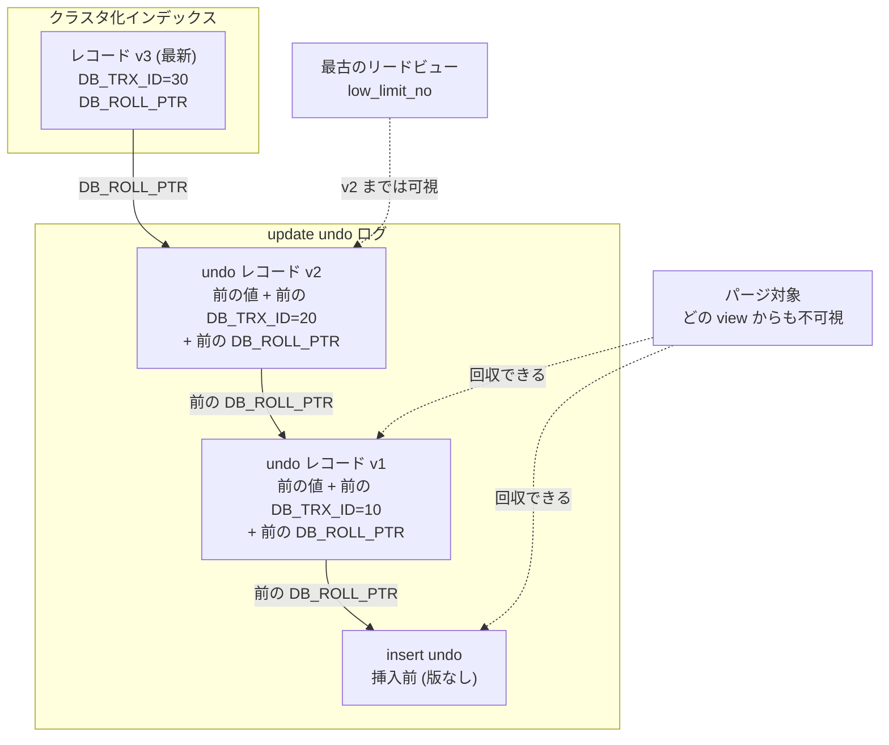

# 第30章 undo ログとパージ

> **本章で読むソース**
>
> - [`storage/innobase/trx/trx0undo.cc`](https://github.com/mysql/mysql-server/blob/mysql-8.4.10/storage/innobase/trx/trx0undo.cc)
> - [`storage/innobase/trx/trx0rec.cc`](https://github.com/mysql/mysql-server/blob/mysql-8.4.10/storage/innobase/trx/trx0rec.cc)
> - [`storage/innobase/trx/trx0purge.cc`](https://github.com/mysql/mysql-server/blob/mysql-8.4.10/storage/innobase/trx/trx0purge.cc)
> - [`storage/innobase/include/trx0purge.h`](https://github.com/mysql/mysql-server/blob/mysql-8.4.10/storage/innobase/include/trx0purge.h)
> - [`storage/innobase/row/row0undo.cc`](https://github.com/mysql/mysql-server/blob/mysql-8.4.10/storage/innobase/row/row0undo.cc)

## この章の狙い

第29章では、リードビューが各レコードの `DB_TRX_ID` を見て、自分に見える版だけを選び出す仕組みを読んだ。
レコードに「自分には見えない新しい版」が乗っていたとき、リードビューはその版を素通りして、より古い版へとたどり直す。
このたどり先となる過去の版を供給するのが undo ログである。

本章は、その undo ログがどう書かれ、どう版の鎖を作るかを読む。
更新前のイメージを記録する `trx_undo_report_row_operation` から始め、レコードの `DB_ROLL_PTR` が undo レコードを指し、その undo レコードがさらに前の版を指すという連鎖の作られ方を追う。
次に、コミット済みトランザクションの undo を集めた history list と、どのリードビューからも見えなくなった版を回収するパージを読む。
最後にロールバック時の undo 適用を概観し、パージを専用スレッドへ非同期化した設計の狙いを述べる。

## 前提

クラスタ化インデックスのレコードが、ユーザ列のほかに `DB_TRX_ID`（最後に更新したトランザクションの ID）と `DB_ROLL_PTR`（直前の版を指すロールポインタ）という2つのシステム列を持つことは、第19章と第29章で見た。
本章ではこの `DB_ROLL_PTR` を起点に話を進める。
リードビューの可視判定そのものは第29章で扱ったので、ここでは「見えない版を見つけたあと、どうやって古い版へ降りるか」に焦点を絞る。

## undo ログの2つの種類

InnoDB の undo ログは、操作の種類によって2系統に分かれる。
挿入を記録する **insert undo** と、更新と削除マークを記録する **update undo** である。
トランザクションは更新前イメージを記録するとき、まずこのどちらの系統に書くかを選び、対応する undo ログをロールバックセグメント（rseg）から割り当てる。

`trx_undo_assign_undo` が割り当てを行う。
種類は引数 `type` で渡され、`TRX_UNDO_INSERT` か `TRX_UNDO_UPDATE` のいずれかをとる。

[`storage/innobase/trx/trx0undo.cc` L1764-L1772](https://github.com/mysql/mysql-server/blob/mysql-8.4.10/storage/innobase/trx/trx0undo.cc#L1764-L1772)

```cpp
  if (type == TRX_UNDO_INSERT) {
    UT_LIST_ADD_FIRST(rseg->insert_undo_list, undo);
    ut_ad(undo_ptr->insert_undo == nullptr);
    undo_ptr->insert_undo = undo;
  } else {
    UT_LIST_ADD_FIRST(rseg->update_undo_list, undo);
    ut_ad(undo_ptr->update_undo == nullptr);
    undo_ptr->update_undo = undo;
  }
```

割り当てた undo ログは rseg の `insert_undo_list` か `update_undo_list` につながれ、同時にトランザクションの `undo_ptr`（`insert_undo` か `update_undo`）からも参照される。
この割り当ての直前では、新規セグメントを作るのではなく、コミット時にキャッシュへ戻された undo ログを再利用しようと `trx_undo_reuse_cached` を先に試す。

[`storage/innobase/trx/trx0undo.cc` L1747-L1762](https://github.com/mysql/mysql-server/blob/mysql-8.4.10/storage/innobase/trx/trx0undo.cc#L1747-L1762)

```cpp
  undo =
#ifdef UNIV_DEBUG
      srv_inject_too_many_concurrent_trxs
          ? nullptr
          :
#endif
          trx_undo_reuse_cached(rseg, type, trx->id, trx->xid, gtid_storage,
                                &mtr);

  if (undo == nullptr) {
    err = trx_undo_create(rseg, type, trx->id, trx->xid, gtid_storage, &undo,
                          &mtr);
    if (err != DB_SUCCESS) {
      goto func_exit;
    }
  }
```

insert undo と update undo を分ける理由は、回収のタイミングが違うからである。
挿入された行は、挿入したトランザクションがロールバックすればその場で消えるべきだが、コミットされれば過去の版を残す必要がない（挿入前は「行が存在しない」だけで、古い版というものがない）。
そのため insert undo は、コミット時にパージへ回さずそのまま破棄できる。
一方 update undo は、更新前の値を過去の版として残すので、それを見るリードビューがいなくなるまで回収できない。
この差が、後で見る history list への登録対象を update undo に限ることへつながる。

## 更新前イメージの記録と版の鎖

行の挿入、更新、削除マークが起きるたびに、`trx_undo_report_row_operation` が呼ばれて undo レコードを書く。
操作種別 `op_type` が `TRX_UNDO_INSERT_OP` なら挿入用、それ以外なら更新用の undo ログへ書き分ける。

[`storage/innobase/trx/trx0rec.cc` L2257-L2267](https://github.com/mysql/mysql-server/blob/mysql-8.4.10/storage/innobase/trx/trx0rec.cc#L2257-L2267)

```cpp
    switch (op_type) {
      case TRX_UNDO_INSERT_OP:
        offset = trx_undo_page_report_insert(undo_page, trx, index, clust_entry,
                                             &mtr);
        break;
      default:
        ut_ad(op_type == TRX_UNDO_MODIFY_OP);
        offset =
            trx_undo_page_report_modify(undo_page, trx, index, rec, offsets,
                                        update, cmpl_info, clust_entry, &mtr);
    }
```

undo レコードを書き終えると、その位置（テーブルスペース、ページ番号、ページ内オフセット）からロールポインタを組み立て、`roll_ptr` 引数に返す。

[`storage/innobase/trx/trx0rec.cc` L2321-L2324](https://github.com/mysql/mysql-server/blob/mysql-8.4.10/storage/innobase/trx/trx0rec.cc#L2321-L2324)

```cpp
      *roll_ptr =
          trx_undo_build_roll_ptr(op_type == TRX_UNDO_INSERT_OP,
                                  undo_ptr->rseg->space_id, page_no, offset);
      return (DB_SUCCESS);
```

返ったロールポインタは、呼び出し側の行操作がレコードの `DB_ROLL_PTR` 列へ書き込む。
ロールポインタは1つの64ビット整数に、insert 由来かどうかのフラグ、rseg の番号、ページ番号、ページ内オフセットを詰めたものである。

[`storage/innobase/include/trx0undo.ic` L45-L57](https://github.com/mysql/mysql-server/blob/mysql-8.4.10/storage/innobase/include/trx0undo.ic#L45-L57)

```cpp
inline roll_ptr_t trx_undo_build_roll_ptr(bool is_insert, space_id_t space_id,
                                          page_no_t page_no, ulint offset) {
  roll_ptr_t roll_ptr;
  ulint id;

  ut_ad(offset < 65536);

  id = (fsp_is_undo_tablespace(space_id) ? undo::id2num(space_id) : 0);

  roll_ptr = (roll_ptr_t)is_insert << 55 | (roll_ptr_t)id << 48 |
             (roll_ptr_t)page_no << 16 | offset;
  return (roll_ptr);
}
```

ここまでで、レコードの `DB_ROLL_PTR` が「最後に書かれた undo レコード」を指すことがわかった。
版の鎖は、もう一段の仕掛けで成り立つ。
更新用の undo レコードを書く `trx_undo_page_report_modify` は、更新前レコードが持っていた `DB_TRX_ID` と `DB_ROLL_PTR` の値を、その undo レコードの中にも書き込む。

[`storage/innobase/trx/trx0rec.cc` L1267-L1273](https://github.com/mysql/mysql-server/blob/mysql-8.4.10/storage/innobase/trx/trx0rec.cc#L1267-L1273)

```cpp
  ptr += mach_u64_write_compressed(ptr, trx_id);

  field = rec_get_nth_field(nullptr, rec, offsets,
                            index->get_sys_col_pos(DATA_ROLL_PTR), &flen);
  ut_ad(flen == DATA_ROLL_PTR_LEN);

  ptr += mach_u64_write_compressed(ptr, trx_read_roll_ptr(field));
```

`trx_id` は同じ関数の少し上で、更新前レコードの `DATA_TRX_ID` 列から読み出した値である。
つまり新しい undo レコードは、自分が上書きする前の版が指していたロールポインタを保持する。
この結果、レコードの `DB_ROLL_PTR` から最新の undo レコードへ降り、その undo レコードに記録された前の `DB_ROLL_PTR` からさらに前の undo レコードへ、と数珠つなぎにたどれる。
これが版の鎖である。

過去の版を実際に組み立てるのが `trx_undo_prev_version_build` である。
レコードのロールポインタを読み、それが insert 由来なら「これが最初に挿入された版で、前の版はない」と判断して終わる。

[`storage/innobase/trx/trx0rec.cc` L2476-L2483](https://github.com/mysql/mysql-server/blob/mysql-8.4.10/storage/innobase/trx/trx0rec.cc#L2476-L2483)

```cpp
  roll_ptr = row_get_rec_roll_ptr(rec, index, offsets);

  *old_vers = nullptr;

  if (trx_undo_roll_ptr_is_insert(roll_ptr)) {
    /* The record rec is the first inserted version */
    return true;
  }
```

insert 由来でなければ、ロールポインタの指す undo レコードを取り出し、そこに記録された前の版の `DB_TRX_ID` と `DB_ROLL_PTR` を読み出して、1つ前の版を `old_vers` に組み立てる。

[`storage/innobase/trx/trx0rec.cc` L2505-L2516](https://github.com/mysql/mysql-server/blob/mysql-8.4.10/storage/innobase/trx/trx0rec.cc#L2505-L2516)

```cpp
  type_cmpl_t type_cmpl;
  ptr = trx_undo_rec_get_pars(undo_rec, &type, &cmpl_info, &dummy_extern,
                              &undo_no, &table_id, type_cmpl);

  if (table_id != index->table->id) {
    /* The table should have been rebuilt, but purge has
    not yet removed the undo log records for the
    now-dropped old table (table_id). */
    return true;
  }

  ptr = trx_undo_update_rec_get_sys_cols(ptr, &trx_id, &roll_ptr, &info_bits);
```

第29章のリードビューは、レコードの `DB_TRX_ID` が見えないと判定したとき、この `trx_undo_prev_version_build` を繰り返し呼んで、自分に見える版へ降りていく。

次の図は、レコードの `DB_ROLL_PTR` を起点とする版の鎖と、後述するパージによる回収の対象を表す。



## history list とパージの起点

トランザクションがコミットすると、その update undo ログは即座に捨てられず、**history list** へ登録される。
history list は、rseg ごとに「コミット済みトランザクションの update undo ログ」をトランザクション番号順につないだリストである。
登録は `trx_purge_add_update_undo_to_history` が行い、undo ログのヘッダノードを rseg ヘッダの履歴リストの先頭に追加する。

[`storage/innobase/trx/trx0purge.cc` L364-L374](https://github.com/mysql/mysql-server/blob/mysql-8.4.10/storage/innobase/trx/trx0purge.cc#L364-L374)

```cpp
  /* Add the log as the first in the history list */
  flst_add_first(rseg_header + TRX_RSEG_HISTORY,
                 undo_header + TRX_UNDO_HISTORY_NODE, mtr);

  if (update_rseg_history_len) {
    trx_sys->rseg_history_len.fetch_add(n_added_logs);
    if (trx_sys->rseg_history_len.load() >
        srv_n_purge_threads * srv_purge_batch_size) {
      srv_wake_purge_thread_if_not_active();
    }
  }
```

`trx_sys->rseg_history_len` は、全 rseg の history list の合計長を持つカウンタである。
この長さが「パージスレッド数掛けるバッチサイズ」を超えると `srv_wake_purge_thread_if_not_active` でパージスレッドを起こす。
コミット側は履歴を積むだけで、回収はパージへ委ねる。
この履歴長は、たまった未回収 undo の量の目安として運用上も参照される。

履歴長は、`std::atomic<uint64_t>` のカウンタとしてトランザクションシステムに置かれている。

[`storage/innobase/include/trx0sys.h` L475-L477](https://github.com/mysql/mysql-server/blob/mysql-8.4.10/storage/innobase/include/trx0sys.h#L475-L477)

```cpp
  /** Length of the TRX_RSEG_HISTORY list (update undo logs for committed
  transactions). */
  std::atomic<uint64_t> rseg_history_len;
```

## パージはどの版を回収できるか

パージの仕事は、どのリードビューからも見えなくなった版を回収することである。
回収の対象は2つある。
削除マークだけ付いて実体が残っているレコードの本体と、過去の版を供給する古い undo ログである。

「どの版から見えなくなったか」を決める基準が **purge view** である。
`trx_purge` は処理の冒頭で、現在生きている最古のリードビューを複製して `purge_sys->view` に保持する。

[`storage/innobase/trx/trx0purge.cc` L2404-L2408](https://github.com/mysql/mysql-server/blob/mysql-8.4.10/storage/innobase/trx/trx0purge.cc#L2404-L2408)

```cpp
  rw_lock_x_lock(&purge_sys->latch, UT_LOCATION_HERE);

  trx_sys->mvcc->clone_oldest_view(&purge_sys->view);

  rw_lock_x_unlock(&purge_sys->latch);
```

回収して安全なのは、purge view より古いトランザクションが残した版に限る。
undo レコードを1件ずつ取り出す `trx_purge_get_next_rec` は、取り出す前に「いま見ているトランザクション番号が purge view の `low_limit_no` より小さい」ことを表明する。

[`storage/innobase/trx/trx0purge.cc` L1892-L1893](https://github.com/mysql/mysql-server/blob/mysql-8.4.10/storage/innobase/trx/trx0purge.cc#L1892-L1893)

```cpp
  ut_ad(purge_sys->next_stored);
  ut_ad(purge_sys->iter.trx_no < purge_sys->view.low_limit_no());
```

`low_limit_no` は、最古のリードビューが生成された時点で「これ以上のトランザクション番号はまだ確定していない」とした境界である。
これより小さい番号のトランザクションがコミットした版は、どのリードビューも過去の版として参照しない。
だからその undo は安全に捨てられる。

パージがたどる順序は、トランザクション番号の小さい順である。
複数の rseg にまたがる history list を、番号順に1つの優先度つきキューへ束ねるのが `TrxUndoRsegsIterator::set_next` である。

[`storage/innobase/trx/trx0purge.cc` L124-L146](https://github.com/mysql/mysql-server/blob/mysql-8.4.10/storage/innobase/trx/trx0purge.cc#L124-L146)

```cpp
  } else if (!m_purge_sys->purge_queue->empty()) {
    /* Read the next element from the queue.
    Combine elements if they have same transaction number.
    This can happen if a transaction shares redo rollback segment
    with another transaction that has already added it to purge
    queue and former transaction also needs to schedule non-redo
    rollback segment for purge. */
    m_trx_undo_rsegs = NullElement;

    while (!m_purge_sys->purge_queue->empty()) {
      if (m_trx_undo_rsegs.get_trx_no() == UINT64_UNDEFINED) {
        m_trx_undo_rsegs = purge_sys->purge_queue->top();
      } else if (purge_sys->purge_queue->top().get_trx_no() ==
                 m_trx_undo_rsegs.get_trx_no()) {
        m_trx_undo_rsegs.insert(purge_sys->purge_queue->top());
      } else {
        break;
      }

      m_purge_sys->purge_queue->pop();
    }

    m_iter = m_trx_undo_rsegs.begin();
```

キューの先頭は常にトランザクション番号が最小の rseg なので、パージは履歴の古い側から順に回収していける。

## パージの一括処理と非同期化

`trx_purge` は、回収を1件ずつ同期的に進めるのではなく、まとめて取り出してワーカスレッドへ投げる。
purge view を確定したあと、`trx_purge_attach_undo_recs` で回収すべき undo レコードをバッチ分集め、ワーカへ配ってから実行する。

[`storage/innobase/trx/trx0purge.cc` L2416-L2435](https://github.com/mysql/mysql-server/blob/mysql-8.4.10/storage/innobase/trx/trx0purge.cc#L2416-L2435)

```cpp
  /* Fetch the UNDO recs that need to be purged. */
  n_pages_handled = trx_purge_attach_undo_recs(n_purge_threads, batch_size);

  /* Submit the tasks to the work queue. */
  for (ulint i = 0; i < n_purge_threads - 1; ++i) {
    thr = que_fork_scheduler_round_robin(purge_sys->query, thr);

    ut_a(thr != nullptr);

    srv_que_task_enqueue_low(thr);
  }

  thr = que_fork_scheduler_round_robin(purge_sys->query, thr);
  ut_a(thr != nullptr);

  purge_sys->n_submitted += n_purge_threads - 1;

  que_run_threads(thr);

  trx_purge_wait_for_workers_to_complete();
```

この `trx_purge` を駆動するのが、専用のバックグラウンドスレッドである **パージコーディネータ**（`srv_purge_coordinator_thread`）である。
コーディネータは回収すべき履歴がないときはスリープし、`srv_do_purge` を通じて `trx_purge` を繰り返し呼ぶループを回す。

[`storage/innobase/srv/srv0srv.cc` L3106-L3124](https://github.com/mysql/mysql-server/blob/mysql-8.4.10/storage/innobase/srv/srv0srv.cc#L3106-L3124)

```cpp
  do {
    /* If there are no records to purge or the last
    purge didn't purge any records then wait for activity. */

    if (srv_shutdown_state.load() < SRV_SHUTDOWN_PURGE &&
        (purge_sys->state == PURGE_STATE_STOP || n_total_purged == 0)) {
      srv_purge_coordinator_suspend(slot, rseg_history_len);
    }

    if (srv_purge_should_exit(n_total_purged)) {
      ut_a(!slot->suspended);
      break;
    }

    n_total_purged = 0;

    rseg_history_len = srv_do_purge(&n_total_purged);

  } while (!srv_purge_should_exit(n_total_purged));
```

ここが本章の最適化の核である。
版の回収を、それを生んだ更新トランザクションの中で同期的にやると、コミットのたびに過去の版が見られなくなったかを確認し、不要なら消す処理が前景の経路に乗る。
InnoDB はこれを切り離し、コミット側は update undo を history list へ積んでカウンタを増やすだけにした。
回収は専用のコーディネータとワーカが、purge view を1回確定してから不要な版をバッチでまとめて消す。
これにより、版が見えなくなったかの判定（最古のリードビューとの比較）をレコードごとに前景でやらずに済み、コミットのレイテンシを回収コストから独立させられる。
さらにバッチ化によって、同じ undo ページへのアクセスやラッチの取得が1回の処理にまとまり、ページ単位の効率も上がる。

## ロールバック時の undo 適用

undo ログは、回収のための過去の版だけでなく、ロールバックの巻き戻しにも使われる。
トランザクションがロールバックすると、自分が書いた undo レコードを新しい順に1件ずつ取り出し、逆操作を当てて変更を取り消す。
1件分の処理を行うのが `row_undo` である。

ロールバック対象のレコードは、まず `trx_roll_pop_top_rec_of_trx` でそのトランザクションの undo の先頭（最後に書いた undo レコード）を取り出す。

[`storage/innobase/row/row0undo.cc` L324-L352](https://github.com/mysql/mysql-server/blob/mysql-8.4.10/storage/innobase/row/row0undo.cc#L324-L352)

```cpp
  if (node->state == UNDO_NODE_FETCH_NEXT) {
    node->undo_rec = trx_roll_pop_top_rec_of_trx(&trx, trx.roll_limit,
                                                 &roll_ptr, node->heap);

    if (!node->undo_rec) {
      /* Rollback completed for this query thread */

      thr->run_node = que_node_get_parent(node);

      /* Mark any partial rollback completed, so
      that if the transaction object is committed
      and reused later, the roll_limit will remain
      at 0. trx->roll_limit will be nonzero during a
      partial rollback only. */
      trx.roll_limit = 0;
      ut_d(trx.in_rollback = false);

      return (DB_SUCCESS);
    }

    node->roll_ptr = roll_ptr;
    node->undo_no = trx_undo_rec_get_undo_no(node->undo_rec);

    if (trx_undo_roll_ptr_is_insert(roll_ptr)) {
      node->state = UNDO_NODE_INSERT;
    } else {
      node->state = UNDO_NODE_MODIFY;
    }
  }
```

取り出した undo レコードが insert 由来なら、挿入を取り消すため `row_undo_ins` で行を物理的に削除する。
更新や削除マーク由来なら、`row_undo_mod` で記録された更新前の値へレコードを戻す。

[`storage/innobase/row/row0undo.cc` L358-L365](https://github.com/mysql/mysql-server/blob/mysql-8.4.10/storage/innobase/row/row0undo.cc#L358-L365)

```cpp
  if (node->state == UNDO_NODE_INSERT) {
    err = row_undo_ins(node, thr);

    node->state = UNDO_NODE_FETCH_NEXT;
  } else {
    ut_ad(node->state == UNDO_NODE_MODIFY);
    err = row_undo_mod(node, thr);
  }
```

ロールバックは、トランザクションの undo を逆順にこの処理へ通し、最後の操作から順に巻き戻していく。
パージが「未来から見えなくなった過去の版」を回収するのに対し、ロールバックは「自分が作った版」を消して直前の状態へ戻す。
どちらも同じ undo レコードを読むが、向きと目的が違う。

## まとめ

undo ログは、MVCC とロールバックの両方を支える。
更新前イメージを記録する `trx_undo_report_row_operation` は、insert undo と update undo に書き分け、書いた位置からロールポインタを返す。
レコードの `DB_ROLL_PTR` がそのロールポインタを保持し、update undo レコードが「前の版の `DB_TRX_ID` と `DB_ROLL_PTR`」を内部に持つことで、版の鎖ができる。
リードビューはこの鎖を `trx_undo_prev_version_build` でたどり、自分に見える版へ降りる。

コミット済みの update undo は history list へ積まれ、回収はパージへ委ねられる。
パージは purge view（最古のリードビュー）を基準に、どのリードビューからも見えなくなった削除マーク済みレコードと古い undo を、トランザクション番号の古い側から回収する。
この回収を専用のコーディネータとワーカへ非同期化し、purge view を1回確定してバッチでまとめて消す設計により、版が見えなくなったかの判定をコミットの前景経路から切り離している。
ロールバックは同じ undo レコードを逆順にたどり、自分が書いた版を巻き戻す。

## 関連する章

- [第19章 ページとレコードのフォーマット](../part02-innodb-foundation/19-page-and-record-format.md)：`DB_TRX_ID` と `DB_ROLL_PTR` のシステム列がレコードのどこに置かれるか。
- [第28章 トランザクション管理](28-transaction-management.md)：rseg の割り当てとコミットの流れ。
- [第29章 MVCC とリードビュー](29-mvcc-and-read-view.md)：リードビューの可視判定と、本章の版の鎖をたどる呼び出し元。
- [第31章 ロック](31-locking.md)：削除マークと回収のあいだの並行制御。
