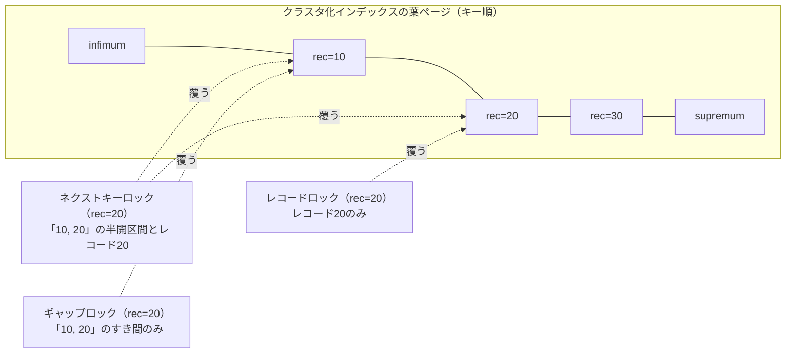
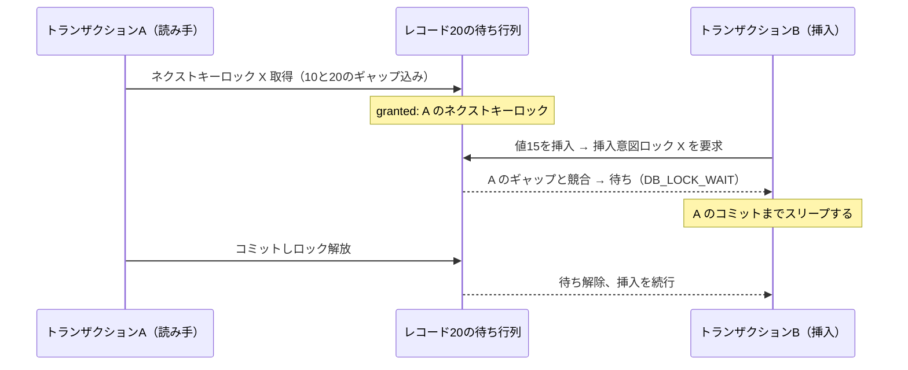
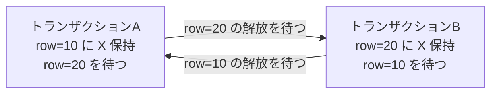

# 第31章 ロック

> **本章で読むソース**
>
> - [`storage/innobase/include/lock0types.h`](https://github.com/mysql/mysql-server/blob/mysql-8.4.10/storage/innobase/include/lock0types.h)
> - [`storage/innobase/include/lock0lock.h`](https://github.com/mysql/mysql-server/blob/mysql-8.4.10/storage/innobase/include/lock0lock.h)
> - [`storage/innobase/include/lock0priv.h`](https://github.com/mysql/mysql-server/blob/mysql-8.4.10/storage/innobase/include/lock0priv.h)
> - [`storage/innobase/lock/lock0lock.cc`](https://github.com/mysql/mysql-server/blob/mysql-8.4.10/storage/innobase/lock/lock0lock.cc)
> - [`storage/innobase/lock/lock0wait.cc`](https://github.com/mysql/mysql-server/blob/mysql-8.4.10/storage/innobase/lock/lock0wait.cc)

## この章の狙い

第29章で読んだ MVCC は、読み取り専用のクエリに過去のバージョンを見せることで、書き手と読み手を衝突させずに並行実行させる仕組みだった。
しかし MVCC だけでは、同じ行を2つのトランザクションが同時に更新しようとする場面や、`SELECT ... FOR UPDATE` のように現在の行をロックして読む場面は扱えない。
これらを担うのが本章のロックである。

本章では、InnoDB の行レベルロックを実装から読む。
押さえる要点は3つある。
第1に、ロックは「どの強さか」を表すモード（共有 S と排他 X）と、「行のどの範囲を覆うか」を表すフラグ（レコードロック、ギャップロック、ネクストキーロック）の組み合わせで表現される。
第2に、ロックを取れるかどうかは、同じレコードに並ぶ既存のロックとの競合判定で決まり、その判定規則がギャップとレコードで非対称になっている。
第3に、この非対称な規則の中でネクストキーロックと挿入意図ロックが噛み合うことで、REPEATABLE READ のファントムが防がれる。

最後に、待ちが循環したときにそれを検出するデッドロック検出を読む。
InnoDB の待ちグラフは「各待機者が待つ相手は高々1つ」という性質を持つため、循環検出が単純な彩色 DFS で済む。

## 前提

第28章のトランザクション管理で、`trx_t` がトランザクションの状態を持ち、`trx->lock` 配下にそのトランザクションが取得したロックの一覧があることを読んだ。
第21章のミニトランザクション（mtr）で、ページを変更する操作がページのラッチを mtr のコミットまで握ることを読んだ。
ロックはこのラッチとは別の機構である。
ラッチがページの物理的な一貫性を数命令の間だけ守る短命なものであるのに対し、ロックはトランザクションの論理的な分離をコミットまで守る長命なものである。

第22章で読んだとおり、InnoDB のテーブルはクラスタ化インデックスという1本の B+tree で、葉ページにレコードがキー順で並ぶ。
本章のギャップロックは、このキー順に並んだレコードの「すき間」を対象にする。

## ロックモードと種別フラグ

ロックの強さを表す基本モードは `lock_mode` 列挙体で定義される。

[`storage/innobase/include/lock0types.h` L53-L64](https://github.com/mysql/mysql-server/blob/mysql-8.4.10/storage/innobase/include/lock0types.h#L53-L64)

```cpp
/* Basic lock modes */
enum lock_mode {
  LOCK_IS = 0,          /* intention shared */
  LOCK_IX,              /* intention exclusive */
  LOCK_S,               /* shared */
  LOCK_X,               /* exclusive */
  LOCK_AUTO_INC,        /* locks the auto-inc counter of a table
                        in an exclusive mode */
  LOCK_NONE,            /* this is used elsewhere to note consistent read */
  LOCK_NUM = LOCK_NONE, /* number of lock modes */
  LOCK_NONE_UNSET = 255
};
```

行に対しては `LOCK_S`（共有）または `LOCK_X`（排他）だけを使う。
`LOCK_IS` と `LOCK_IX` はテーブルに対する**意図ロック**で、後述する階層化のために置かれる。
`LOCK_AUTO_INC` は `AUTO_INCREMENT` のカウンタを保護するテーブルロックである。

このモードは、1つのロックオブジェクトが持つ `type_mode` というビット列の下位4ビットに格納される。
残りのビットが、種別を表すフラグになる。

[`storage/innobase/include/lock0lock.h` L949-L962](https://github.com/mysql/mysql-server/blob/mysql-8.4.10/storage/innobase/include/lock0lock.h#L949-L962)

```cpp
constexpr uint32_t LOCK_MODE_MASK = 0xF;
/** Lock types */
/** table lock */
constexpr uint32_t LOCK_TABLE = 16;
/** record lock */
constexpr uint32_t LOCK_REC = 32;
/** mask used to extract lock type from the type_mode field in a lock */
constexpr uint32_t LOCK_TYPE_MASK = 0xF0UL;
static_assert((LOCK_MODE_MASK & LOCK_TYPE_MASK) == 0,
              "LOCK_MODE_MASK & LOCK_TYPE_MASK");

/** Waiting lock flag; when set, it  means that the lock has not yet been
 granted, it is just waiting for its  turn in the wait queue */
constexpr uint32_t LOCK_WAIT = 256;
```

`LOCK_TABLE` と `LOCK_REC` が、そのロックがテーブル全体に効くのか1ページ上のレコードに効くのかを区別する。
`LOCK_WAIT` は、そのロック要求がまだ許可されず待ち行列で順番待ちしていることを示す。

行レベルロックの肝になるのが、レコードのどの範囲を覆うかを表す精密モードのフラグである。

[`storage/innobase/include/lock0lock.h` L966-L987](https://github.com/mysql/mysql-server/blob/mysql-8.4.10/storage/innobase/include/lock0lock.h#L966-L987)

```cpp
constexpr uint32_t LOCK_ORDINARY = 0;
/** when this bit is set, it means that the lock holds only on the gap before
  the record; for instance, an x-lock on the gap does not give permission to
  modify the record on which the bit is set; locks of this type are created
  when records are removed from the index chain of records */
constexpr uint32_t LOCK_GAP = 512;
/** this bit means that the lock is only on the index record and does NOT
   block inserts to the gap before the index record; this is used in the case
   when we retrieve a record with a unique key, and is also used in locking
   plain SELECTs (not part of UPDATE or DELETE) when the user has set the READ
   COMMITTED isolation level */
constexpr uint32_t LOCK_REC_NOT_GAP = 1024;
/** this bit is set when we place a waiting gap type record lock request in
   order to let an insert of an index record to wait until there are no
   conflicting locks by other transactions on the gap; note that this flag
   remains set when the waiting lock is granted, or if the lock is inherited to
   a neighboring record */
constexpr uint32_t LOCK_INSERT_INTENTION = 2048;
/** Predicate lock */
constexpr uint32_t LOCK_PREDICATE = 8192;
/** Page lock */
constexpr uint32_t LOCK_PRDT_PAGE = 16384;
```

3種類の覆い方が、ここで定義される。
**ネクストキーロック**（`LOCK_ORDINARY`、値は0）は、レコードそのものと、そのレコードの手前のギャップの両方を覆う。
**ギャップロック**（`LOCK_GAP`）は、レコードの手前のすき間だけを覆い、レコード自体の変更は妨げない。
**レコードロック**（`LOCK_REC_NOT_GAP`）は、インデックスレコードだけを覆い、手前のギャップへの挿入を妨げない。

**挿入意図ロック**（`LOCK_INSERT_INTENTION`）はギャップに対する特殊なロックで、挿入が他のトランザクションの競合するギャップロックの解放を待つために置かれる。
`LOCK_PREDICATE` と `LOCK_PRDT_PAGE` は空間インデックスの述語ロックで、本章では扱わない。

これらの覆い方をキー順のレコード列の上に並べると、次の図のようになる。



ネクストキーロックは、レコード20とその手前のギャップ（10と20のすき間）をまとめて覆う。
この「手前のギャップ込み」という性質が、後でファントム防止の鍵になる。

## モードの両立可能性

2つのロックが同じ対象に同時に存在できるかは、両立可能性の表で決まる。

[`storage/innobase/include/lock0priv.h` L593-L599](https://github.com/mysql/mysql-server/blob/mysql-8.4.10/storage/innobase/include/lock0priv.h#L593-L599)

```cpp
static const byte lock_compatibility_matrix[5][5] = {
    /**         IS     IX       S     X       AI */
    /* IS */ {true, true, true, false, true},
    /* IX */ {true, true, false, false, true},
    /* S  */ {true, false, true, false, false},
    /* X  */ {false, false, false, false, false},
    /* AI */ {true, true, false, false, false}};
```

行と列が要求モードと既存モードを表し、`true` なら両立、`false` なら競合する。
読み取れる規則は3つある。
第1に、`X` はどのモードとも両立しない（`X` の行と列がすべて `false`）。
第2に、`S` と `S` は両立する。
第3に、意図ロックの `IS` と `IX` は、互いにも、そして相手の `IS`、`IX` とも両立する。
意図ロックどうしが競合するのは、相手が `S` か `X` のテーブルロックを持つ場合だけである。

この表が `lock_mode_compatible` を通じて競合判定の土台になる。
ただし、行レベルロックでは、これにギャップとレコードの覆い方を加味した、もっと込み入った規則が重なる。

## 競合判定 `rec_lock_check_conflict`

行レベルロックの競合判定の中核が `rec_lock_check_conflict` である。
要求するロックの `type_mode` と、同じレコードにすでに並ぶ既存ロック `lock2` を受け取り、待つ必要があるかを返す。

[`storage/innobase/lock/lock0lock.cc` L563-L587](https://github.com/mysql/mysql-server/blob/mysql-8.4.10/storage/innobase/lock/lock0lock.cc#L563-L587)

```cpp
  if (trx == lock2->trx ||
      lock_mode_compatible(static_cast<lock_mode>(LOCK_MODE_MASK & type_mode),
                           lock_get_mode(lock2))) {
    return Conflict::NO_CONFLICT;
  }

  const bool is_hp = trx_is_high_priority(trx);
  /* If our trx is High Priority and the existing lock is WAITING and not
      high priority, then we can ignore it. */
  if (is_hp && lock2->is_waiting() && !trx_is_high_priority(lock2->trx)) {
    return Conflict::NO_CONFLICT;
  }

  /* We have somewhat complex rules when gap type record locks
  cause waits */

  if ((lock_is_on_supremum || (type_mode & LOCK_GAP)) &&
      !(type_mode & LOCK_INSERT_INTENTION)) {
    /* Gap type locks without LOCK_INSERT_INTENTION flag
    do not need to wait for anything. This is because
    different users can have conflicting lock types
    on gaps. */

    return Conflict::NO_CONFLICT;
  }
```

最初に、自分自身のロックとモードが両立する相手は競合しない。
ここまでは前節の表どおりである。

そこからギャップにまつわる非対称な規則が始まる。
まず、挿入意図でない純粋なギャップロックは、何も待たない（L579-L587）。
複数のトランザクションが同じギャップに競合するモードのギャップロックを同時に持ってよい、という設計だからである。
読み手がギャップを共有ロックで覆い、別の読み手も同じギャップを覆える。
ギャップロックどうしは衝突しない。

続いて、レコード側からギャップ側への非対称が現れる。

[`storage/innobase/lock/lock0lock.cc` L589-L616](https://github.com/mysql/mysql-server/blob/mysql-8.4.10/storage/innobase/lock/lock0lock.cc#L589-L616)

```cpp
  if (!(type_mode & LOCK_INSERT_INTENTION) && lock_rec_get_gap(lock2)) {
    /* Record lock (LOCK_ORDINARY or LOCK_REC_NOT_GAP
    does not need to wait for a gap type lock */

    return Conflict::NO_CONFLICT;
  }

  if ((type_mode & LOCK_GAP) && lock_rec_get_rec_not_gap(lock2)) {
    /* Lock on gap does not need to wait for
    a LOCK_REC_NOT_GAP type lock */

    return Conflict::NO_CONFLICT;
  }

  if (lock_rec_get_insert_intention(lock2)) {
    /* No lock request needs to wait for an insert
    intention lock to be removed. This is ok since our
    rules allow conflicting locks on gaps. This eliminates
    a spurious deadlock caused by a next-key lock waiting
    for an insert intention lock; when the insert
    intention lock was granted, the insert deadlocked on
    the waiting next-key lock.

    Also, insert intention locks do not disturb each
    other. */

    return Conflict::NO_CONFLICT;
  }
```

挿入意図でない要求は、既存のギャップロックを待たない（L589-L594）。
逆に、ギャップだけを覆う要求は、既存のレコードロック（`LOCK_REC_NOT_GAP`）を待たない（L596-L601）。
そして、どんな要求も挿入意図ロックの解放を待たない（L603-L616）。
ここまでをすべてくぐり抜けた要求だけが `Conflict::HAS_TO_WAIT` を返す。

非対称の核心は、ここまでの規則のうち最初の2つにある。
レコードロックとギャップロックは、互いに相手を待たない。
両者が競合するのは、要求がレコードを覆い、かつ既存ロックもレコードを覆っているときだけである。
言い換えると、衝突はレコード本体の取り合いでだけ起きる。
ギャップを覆うかどうかは、挿入を止めるかどうかという別の役割を担い、ロックの強さとは独立に判定される。

この `rec_lock_check_conflict` を `lock1`（待機側のロック）と `lock2`（既存ロック）の対で呼ぶのが `rec_lock_has_to_wait` である。

[`storage/innobase/lock/lock0lock.cc` L653-L661](https://github.com/mysql/mysql-server/blob/mysql-8.4.10/storage/innobase/lock/lock0lock.cc#L653-L661)

```cpp
static inline bool rec_lock_has_to_wait(const lock_t *lock1,
                                        const lock_t *lock2,
                                        Trx_locks_cache &lock1_cache) {
  ut_ad(lock1->is_waiting());
  ut_ad(lock_rec_get_nth_bit(lock2, lock_rec_find_set_bit(lock1)));
  return rec_lock_check_conflict(lock1->trx, lock1->type_mode, lock2,
                                 lock1->includes_supremum(),
                                 lock1_cache) == Conflict::HAS_TO_WAIT;
}
```

テーブルロックどうしの競合判定はずっと単純で、`has_to_wait` の末尾でモードの両立可能性だけを見て済ませる。

[`storage/innobase/lock/lock0lock.cc` L674-L677](https://github.com/mysql/mysql-server/blob/mysql-8.4.10/storage/innobase/lock/lock0lock.cc#L674-L677)

```cpp
  // Rules for LOCK_TABLE are much simpler:
  return (lock1->trx != lock2->trx &&
          !lock_mode_compatible(lock_get_mode(lock1), lock_get_mode(lock2)));
}
```

## ロックの取得 `lock_rec_lock`

読み取りでロックを取る入口が `lock_clust_rec_read_check_and_lock` である。
`SELECT ... FOR UPDATE` や `FOR SHARE` が、クラスタ化インデックスのレコードを読むときにここを通る。

[`storage/innobase/lock/lock0lock.cc` L5527-L5547](https://github.com/mysql/mysql-server/blob/mysql-8.4.10/storage/innobase/lock/lock0lock.cc#L5527-L5547)

```cpp
  heap_no = page_rec_get_heap_no(rec);

  if (heap_no != PAGE_HEAP_NO_SUPREMUM) {
    lock_rec_convert_impl_to_expl(block, rec, index, offsets);
  }

  DEBUG_SYNC_C("after_lock_clust_rec_read_check_and_lock_impl_to_expl");
  {
    locksys::Shard_latch_guard guard{UT_LOCATION_HERE, block->get_page_id()};

    if (duration == lock_duration_t::AT_LEAST_STATEMENT) {
      lock_protect_locks_till_statement_end(thr);
    }

    ut_ad(mode != LOCK_X ||
          lock_table_has(thr_get_trx(thr), index->table, LOCK_IX));
    ut_ad(mode != LOCK_S ||
          lock_table_has(thr_get_trx(thr), index->table, LOCK_IS));

    err = lock_rec_lock(false, sel_mode, mode | gap_mode, block, heap_no, index,
                        thr);
```

`gap_mode` 引数に `LOCK_ORDINARY`、`LOCK_GAP`、`LOCK_REC_NOT_GAP` のどれを渡すかで、覆い方が決まる。
REPEATABLE READ の通常の読みでは `LOCK_ORDINARY` を渡し、ネクストキーロックになる。
処理本体に入る前のアサートが、行ロックを取る前にテーブルへ意図ロック（`X` なら `IX`、`S` なら `IS`）が取られていることを確認している。
これが次節で読む階層化の前提である。

実際のロック取得は `lock_rec_lock` が担い、まず軽量経路の `lock_rec_lock_fast` を試す。

[`storage/innobase/lock/lock0lock.cc` L1895-L1908](https://github.com/mysql/mysql-server/blob/mysql-8.4.10/storage/innobase/lock/lock0lock.cc#L1895-L1908)

```cpp
  /* We try a simplified and faster subroutine for the most
  common cases */
  switch (lock_rec_lock_fast(impl, mode, block, heap_no, index, thr)) {
    case LOCK_REC_SUCCESS:
      return (DB_SUCCESS);
    case LOCK_REC_SUCCESS_CREATED:
      return (DB_SUCCESS_LOCKED_REC);
    case LOCK_REC_FAIL:
      return (
          lock_rec_lock_slow(impl, sel_mode, mode, block, heap_no, index, thr));
    default:
      ut_error;
  }
}
```

`lock_rec_lock_fast` は、そのページにロックが1つもないか、あるいは自分のトランザクションが同一モードの既存ロックを持つ場合だけを高速に処理する。
最も多い「競合がなく素直にロックが取れる」場面をここで短絡し、ハッシュ表の走査も待ち行列の操作も省く。
それ以外は `LOCK_REC_FAIL` を返し、`lock_rec_lock_slow` に処理が移る。

`lock_rec_lock_slow` は、まず自分が十分強いロックをすでに持っていないかを調べ、持っていなければ競合を探す。

[`storage/innobase/lock/lock0lock.cc` L1821-L1847](https://github.com/mysql/mysql-server/blob/mysql-8.4.10/storage/innobase/lock/lock0lock.cc#L1821-L1847)

```cpp
  const auto conflicting =
      lock_rec_other_has_conflicting(mode, block, heap_no, trx);

  if (conflicting.wait_for != nullptr) {
    switch (sel_mode) {
      case SELECT_SKIP_LOCKED:
        return (DB_SKIP_LOCKED);
      case SELECT_NOWAIT:
        return (DB_LOCK_NOWAIT);
      case SELECT_ORDINARY:
        /* If another transaction has a non-gap conflicting request in the
        queue, as this transaction does not have a lock strong enough already
        granted on the record, we may have to wait. */

        RecLock rec_lock(thr, index, block, heap_no, mode);

        trx_mutex_enter(trx);

        dberr_t err = rec_lock.add_to_waitq(conflicting.wait_for);

        trx_mutex_exit(trx);

        ut_ad(err == DB_SUCCESS_LOCKED_REC || err == DB_LOCK_WAIT ||
              err == DB_DEADLOCK);
        return (err);
    }
  }
```

`lock_rec_other_has_conflicting` は、前節の `rec_lock_check_conflict` を同じレコードに並ぶ各ロックへ適用し、競合する相手を探す。
競合が見つかると、`SELECT ... SKIP LOCKED` なら即座にその行を飛ばし、`NOWAIT` なら即座にエラーを返す。
通常の `SELECT_ORDINARY` では `add_to_waitq` で待ち行列に並ぶ。

`add_to_waitq` は、待ちロックを生成して `LOCK_WAIT` を立て、待ち相手へのエッジを張る。

[`storage/innobase/lock/lock0lock.cc` L1474-L1492](https://github.com/mysql/mysql-server/blob/mysql-8.4.10/storage/innobase/lock/lock0lock.cc#L1474-L1492)

```cpp
  m_mode |= LOCK_WAIT;

  /* Do the preliminary checks, and set query thread state */

  prepare();

  /* Don't queue the lock to hash table, if high priority transaction. */
  lock_t *lock = create(m_trx, prdt);

  lock_create_wait_for_edge(lock, wait_for);

  ut_ad(lock_get_wait(lock));

  set_wait_state(lock);

  MONITOR_INC(MONITOR_LOCKREC_WAIT);

  return (DB_LOCK_WAIT);
}
```

`lock_create_wait_for_edge` が、待つ側から待たれる側への辺を記録する。
この辺の集まりが、後のデッドロック検出が走査する待ちグラフになる。

## 意図ロックによる階層化

ここで本章の最適化の工夫を読む。
InnoDB はテーブルロックと行ロックという粒度の違うロックを併用する。
問題は、あるトランザクションがテーブル全体に `X` ロックを取りたいとき、そのテーブルのどこかの行を別のトランザクションがロックしていないかを、どう速く確かめるかである。
全行を走査して行ロックの有無を調べるのは現実的でない。

InnoDB の答えが**意図ロック**による階層化である。
あるトランザクションが行に `X` ロックを取る前に、必ずそのテーブルに `IX`（intention exclusive）ロックを取る。
前節で読んだ `lock_clust_rec_read_check_and_lock` のアサートが、この順序を保証していた。
すると、テーブルへの `X` ロック要求は、テーブルロックの待ち行列に並ぶ `IX` を見るだけで、行ロックの存在を知れる。
両立可能性の表で `X` と `IX` は競合する（前掲 L598 の `X` 行）ので、行ロックを持つトランザクションがいる限り、テーブルへの `X` は待たされる。

このとき、意図ロックどうしは互いに両立する点が効く。
`IX` と `IX` は競合しないので、別々の行をロックする無数の DML が、同じテーブルに `IX` を取りながら互いに邪魔せず並行できる。
テーブルロックの競合判定 `lock_table_other_has_incompatible` には、この性質を使った短絡がある。

[`storage/innobase/lock/lock0lock.cc` L3520-L3532](https://github.com/mysql/mysql-server/blob/mysql-8.4.10/storage/innobase/lock/lock0lock.cc#L3520-L3532)

```cpp
  // According to lock_compatibility_matrix, an intention lock can wait only
  // for LOCK_S or LOCK_X. If there are no LOCK_S nor LOCK_X locks in the queue,
  // then we can avoid iterating through the list and return immediately.
  // This might help in OLTP scenarios, with no DDL queries,
  // as then there are almost no LOCK_S nor LOCK_X, but many DML queries still
  // need to get an intention lock to perform their action - while this never
  // causes them to wait for a "data lock", it might cause them to wait for
  // lock_sys table shard latch for the duration of table lock queue operation.

  if ((mode == LOCK_IS || mode == LOCK_IX) &&
      table->count_by_mode[LOCK_S] == 0 && table->count_by_mode[LOCK_X] == 0) {
    return nullptr;
  }
```

要求が意図ロックで、かつそのテーブルに `S` も `X` もないなら、待ち行列を一切走査せず即座に「競合なし」と返す。
DDL が走っていない通常の OLTP では `S` や `X` のテーブルロックはほぼ存在しないため、大量の DML が取る意図ロックは、この短絡でテーブルロック待ち行列の走査を丸ごと省ける。
階層化の効果は2つある。
テーブル全体をロックしたい側は、行を1つも見ずにテーブルロックだけで衝突を判定できる。
行をロックする側は、意図ロックどうしが両立するため、互いを待たずに並行できる。

## ネクストキーロックがファントムを防ぐ仕組み

REPEATABLE READ のファントムとは、同じ条件の `SELECT` を1つのトランザクション内で2回実行したとき、間に別のトランザクションが条件に合う行を挿入したために、2回目で「幽霊」の行が現れる現象である。
MVCC の一貫読みは過去のスナップショットを見せるのでファントムを起こさないが、`SELECT ... FOR UPDATE` のようなロック読みは現在の行を見るため、挿入を別の手段で止める必要がある。
それを担うのがネクストキーロックである。

ロック読みは、条件に合う各レコードにネクストキーロックを取る。
ネクストキーロックはレコードとその手前のギャップを覆うので、条件に合う範囲のすき間すべてが、いずれかのネクストキーロックのギャップ部分で覆われる。
この状態で別のトランザクションが範囲内に行を挿入しようとすると、挿入は `lock_rec_insert_check_and_lock` を通る。

[`storage/innobase/lock/lock0lock.cc` L5195-L5214](https://github.com/mysql/mysql-server/blob/mysql-8.4.10/storage/innobase/lock/lock0lock.cc#L5195-L5214)

```cpp
      const ulint type_mode = LOCK_X | LOCK_GAP | LOCK_INSERT_INTENTION;

      const auto conflicting =
          lock_rec_other_has_conflicting(type_mode, block, heap_no, trx);

      /* LOCK_INSERT_INTENTION locks can not be allowed to bypass waiting locks,
      because they allow insertion of a record which splits the gap which would
      lead to duplication of the waiting lock, violating the constraint that
      each transaction can wait for at most one lock at any given time */
      ut_a(!conflicting.bypassed);

      if (conflicting.wait_for != nullptr) {
        RecLock rec_lock(thr, index, block, heap_no, type_mode);

        trx_mutex_enter(trx);

        err = rec_lock.add_to_waitq(conflicting.wait_for);

        trx_mutex_exit(trx);
      }
```

挿入は、挿入先のすぐ後ろのレコードに対して挿入意図ロック（`LOCK_X | LOCK_GAP | LOCK_INSERT_INTENTION`）を要求する。
このとき競合判定 `rec_lock_check_conflict` を思い出すと、挿入意図ロックは `LOCK_INSERT_INTENTION` フラグを持つので、ギャップロックを無条件に素通りさせる早期 return（前掲 L579-L594）には当てはまらない。
そのため、すでにそのギャップを覆っているネクストキーロックと競合し、挿入は `add_to_waitq` で待たされる。
読み手がコミットしてネクストキーロックを解放するまで、挿入は進めない。
これでファントムが防がれる。

挿入意図ロックがギャップロックと「非対称に」競合する点が要になっている。
ギャップロックどうしは互いに両立し、ギャップロックは挿入意図ロックを待たない。
しかし挿入意図ロックの側は、先に置かれたギャップを覆うロックを待つ。
この一方向の競合が、「読み手はギャップを共有して並行できるが、挿入だけはギャップの解放を待つ」という非対称をつくる。



なお READ COMMITTED では、ロック読みに `LOCK_REC_NOT_GAP` を使ってギャップを覆わない。
ギャップを覆わないので挿入が止まらず、ファントムが起こりうる。
分離レベルの違いは、ロック読みに渡す `gap_mode` の違いとして実装に現れる。

## デッドロック検出

待ちが循環すると、どのトランザクションも進めないデッドロックになる。
InnoDB はこれを待ちグラフの循環検出で見つける。
検出の鍵は、待ちグラフの形にある。

待ちグラフを組み立てる `lock_wait_build_wait_for_graph` は、各待機者について、その待ち相手への辺を高々1本だけ張る。

[`storage/innobase/lock/lock0wait.cc` L643-L649](https://github.com/mysql/mysql-server/blob/mysql-8.4.10/storage/innobase/lock/lock0wait.cc#L643-L649)

```cpp
builds a (subset of) list of edges from waiting transactions to blocking
transactions, such that for each waiter we have one outgoing edge.
@param[in]    infos     information about all waiting transactions
@param[out]   outgoing  The outgoing[from] will contain either the index such
                        that infos[outgoing[from]].trx is the reason
                        infos[from].trx has to wait, or -1 if the reason for
                        waiting is not among transactions in infos[].trx. */
```

各ノードから出る辺がちょうど1本（待たない場合は0本）になる。
これは、各トランザクションは同時に高々1つのロックしか待たないという不変条件から来る。
出辺が高々1本のグラフは関数グラフであり、辺をたどる経路は1本道になる。
だから、ある始点から辺をたどり続けると、いずれ既訪のノードに行き着くか、出辺のないノードで止まる。
循環検出は、この1本道を彩色しながらたどるだけで済む。

[`storage/innobase/lock/lock0wait.cc` L1281-L1313](https://github.com/mysql/mysql-server/blob/mysql-8.4.10/storage/innobase/lock/lock0wait.cc#L1281-L1313)

```cpp
  for (uint start = 0; start < n; ++start) {
    if (colors[start] != 0) {
      /* This node was already fully processed*/
      continue;
    }
    ++current_color;
    for (int id = start; 0 <= id; id = outgoing[id]) {
      /* We don't expect transaction to deadlock with itself only
      and we do not handle cycles of length=1 correctly */
      ut_ad(id != outgoing[id]);
      if (colors[id] == 0) {
        /* This node was never visited yet */
        colors[id] = current_color;
        continue;
      }
      /* This node was already visited:
      - either it has current_color which means we've visited it during current
        DFS descend, which means we have found a cycle, which we need to verify,
      - or, it has a color used in a previous DFS which means that current DFS
        path merges into an already processed portion of wait-for graph, so we
        can stop now */
      if (colors[id] == current_color) {
        /* found a candidate cycle! */
        lock_wait_extract_cycle_ids(cycle_ids, id, outgoing);
        if (lock_wait_check_candidate_cycle(cycle_ids, infos, new_weights)) {
          MONITOR_INC(MONITOR_DEADLOCK);
        } else {
          MONITOR_INC(MONITOR_DEADLOCK_FALSE_POSITIVES);
        }
      }
      break;
    }
  }
```

各始点に固有の色（`current_color`）を割り当て、出辺を `id = outgoing[id]` でたどる。
たどった先が未訪なら、その色を塗って進む。
たどった先が今回の色で塗られていれば、今回の探索の中で同じノードに戻ってきたことになり、循環が見つかる。
過去の探索の色で塗られていれば、すでに処理済みの部分に合流したので、循環はないと判断して打ち切る。
各ノードは高々1度しか塗られないので、全体の計算量はノード数に比例する。

循環候補が見つかると、`lock_wait_extract_cycle_ids` が辺をたどって循環上のトランザクション列を取り出す。

[`storage/innobase/lock/lock0wait.cc` L1238-L1247](https://github.com/mysql/mysql-server/blob/mysql-8.4.10/storage/innobase/lock/lock0wait.cc#L1238-L1247)

```cpp
static void lock_wait_extract_cycle_ids(ut::vector<uint> &cycle_ids,
                                        const uint start,
                                        const ut::vector<int> &outgoing) {
  cycle_ids.clear();
  uint id = start;
  do {
    cycle_ids.push_back(id);
    id = outgoing[id];
  } while (id != start);
}
```

次の図は、2つのトランザクションが互いの行ロックを待って循環する最小のデッドロックである。



循環が本物だと確認できると、`lock_wait_choose_victim` が巻き戻す犠牲者を選ぶ。
選択の基準はトランザクションの重みである。

[`storage/innobase/include/trx0trx.h` L1248-L1254](https://github.com/mysql/mysql-server/blob/mysql-8.4.10/storage/innobase/include/trx0trx.h#L1248-L1254)

```cpp
/** Calculates the "weight" of a transaction. The weight of one transaction
 is estimated as the number of altered rows + the number of locked rows.
 @param t transaction
 @return transaction weight */
static inline uint64_t TRX_WEIGHT(const trx_t *t) {
  return t->undo_no + UT_LIST_GET_LEN(t->lock.trx_locks);
}
```

重みは「変更した行数」と「ロックした行数」の和で見積もる。
`lock_wait_choose_victim` は循環上のトランザクションを比べ、より軽いほうを犠牲者に選ぶ。

[`storage/innobase/lock/lock0wait.cc` L949-L958](https://github.com/mysql/mysql-server/blob/mysql-8.4.10/storage/innobase/lock/lock0wait.cc#L949-L958)

```cpp
    if (trx_weight_ge(chosen_victim, trx)) {
      /* The joining transaction is 'smaller',
      choose it as the victim and roll it back. */
      chosen_victim = trx;
    }
  }

  ut_a(chosen_victim);
  return chosen_victim;
}
```

軽いトランザクションを巻き戻せば、undo の取り消し量が少なく、巻き戻しのコストが小さい。
選ばれた犠牲者は `was_chosen_as_deadlock_victim` を立てられ、待ちから起こされて巻き戻され、相手のトランザクションは待ちを解いて先に進む。
高優先度トランザクションが絡む場合は、重みより先に `trx_arbitrate` の優先度判定が犠牲者を決める。

## まとめ

InnoDB の行レベルロックは、強さを表すモード（`S`、`X`）と覆い方を表すフラグ（レコードロック、ギャップロック、ネクストキーロック、挿入意図ロック）の組で表される。
競合判定 `rec_lock_check_conflict` は、レコード本体の取り合いでだけ衝突を起こし、ギャップの覆い方は挿入を止めるかどうかという別軸で非対称に扱う。
ネクストキーロックがレコードと手前のギャップを覆い、挿入意図ロックがそのギャップと一方向に競合することで、REPEATABLE READ のファントムが防がれる。

意図ロックは、テーブルと行という粒度の違うロックを階層化する。
テーブル全体をロックしたい側は行を1つも走査せずに衝突を判定でき、行をロックする側は意図ロックどうしが両立するため互いを待たずに並行できる。

デッドロック検出は、各待機者の出辺が高々1本という不変条件を生かし、彩色 DFS で待ちグラフの循環を線形時間で見つける。
循環が確定すると、変更行数とロック行数の和で測った重みが軽いトランザクションを犠牲者に選び、巻き戻す。

## 関連する章

- [第28章 トランザクション管理](28-transaction-management.md)：`trx_t` の状態と `trx->lock` の構造。
- [第29章 MVCC とリードビュー](29-mvcc-and-read-view.md)：ロックを取らない一貫読みとの対比。
- [第24章 行の挿入、更新、削除](../part03-index-row/24-row-dml.md)：DML が挿入意図ロックやレコードロックを取る箇所。
- [第21章 ミニトランザクション](../part02-innodb-foundation/21-mini-transaction.md)：ロックと別物のページラッチ。
