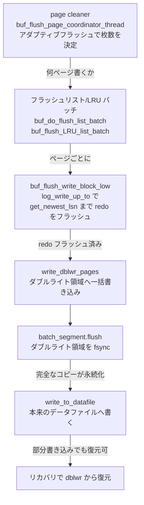

# 第28章 ダブルライトバッファとページフラッシュ

> **本章で読むソース**
>
> - [`storage/innobase/buf/buf0flu.cc`](https://github.com/mysql/mysql-server/blob/mysql-8.4.10/storage/innobase/buf/buf0flu.cc)
> - [`storage/innobase/buf/buf0dblwr.cc`](https://github.com/mysql/mysql-server/blob/mysql-8.4.10/storage/innobase/buf/buf0dblwr.cc)
> - [`storage/innobase/include/buf0dblwr.h`](https://github.com/mysql/mysql-server/blob/mysql-8.4.10/storage/innobase/include/buf0dblwr.h)

## この章の狙い

第15章で、バッファプールのページが変更されるとダーティになり、フラッシュリストにつながれることを読んだ。
第27章では、ページを変更する前にその変更を redo ログへ書く WAL を読み、redo がディスクへ届くまでの経路を追った。
だが、ダーティページそのものをいつ、どうやってディスクのデータファイルへ書き戻すかは、第15章で第28章へ送っていた。
本章はその続きを読む。

ダーティページの書き戻しには、性能と正しさの2つの課題がある。
性能の課題は、書き戻しが一気に集中するとディスクの I/O が飽和し、チェックポイントの進行が詰まることである。
正しさの課題は、ページの途中までしか書けずに電源が落ちると、ディスク上のページが新旧入り混じった壊れた姿で残ることである。
これを**部分書き込み**（torn page、ちぎれたページ）と呼ぶ。

InnoDB はこの2つを別々の仕組みで解く。
性能の課題は、**page cleaner** という専用スレッドが、redo の生成量とダーティページの量から「いま書くべきページ数」を見積もり、書き戻しを時間方向へ平滑化する**アダプティブフラッシュ**で解く。
正しさの課題は、データファイルへ書く前に同じページを別の連続領域へもう一度書いておく**ダブルライトバッファ**で解く。
本章では、フラッシュリストと LRU からの書き出し、page cleaner とアダプティブフラッシュ、ダブルライトの二重書き、そしてページを書く前に redo をフラッシュする WAL の規律を順に読む。

## 前提

第15章で、バッファプールのページがディスクリプタ `buf_page_t` で表され、ダーティページがフラッシュリストに、追い出し候補が LRU リストにつながれることを読んだ。
本章は、そのフラッシュリストと LRU からページをディスクへ書き戻す側を読む。

第27章で、redo がすべてのバイトに LSN を持ち、`log_write_up_to` を呼べば指定 LSN まで redo をディスクへフラッシュできることを読んだ。
本章では、ページを書く前にこの `log_write_up_to` を呼んで WAL の順序を守る箇所を読む。
各ページのヘッダ `FIL_PAGE_LSN` に、そのページへ最後に適用された変更の LSN が刻まれることも前提になる。
このページの最新 LSN を InnoDB は `get_newest_lsn` で取り出す。

## ページを書く前に redo をフラッシュする

1枚のダーティページをディスクへ書き出す中心が `buf_flush_page` である。
この関数はフラッシュの種類（フラッシュリスト由来か LRU 由来か単一ページか）を決め、ページを IO 固定し、最後に実際の書き出しを `buf_flush_write_block_low` へ委ねる。
その `buf_flush_write_block_low` の冒頭に、本章でもっとも重要な規律がある。

[`storage/innobase/buf/buf0flu.cc` L1197-L1215](https://github.com/mysql/mysql-server/blob/mysql-8.4.10/storage/innobase/buf/buf0flu.cc#L1197-L1215)

```cpp
  ut_ad(recv_recovery_is_on() || bpage->get_newest_lsn() != 0);

  /* Force the log to the disk before writing the modified block */
  if (!srv_read_only_mode) {
    const lsn_t flush_to_lsn = bpage->get_newest_lsn();

    /* Do the check before calling log_write_up_to() because in most
    cases it would allow to avoid call, and because of that we don't
    want those calls because they would have bad impact on the counter
    of calls, which is monitored to save CPU on spinning in log threads. */

    if (log_sys->flushed_to_disk_lsn.load() < flush_to_lsn) {
      Wait_stats wait_stats;

      wait_stats = log_write_up_to(*log_sys, flush_to_lsn, true);

      MONITOR_INC_WAIT_STATS_EX(MONITOR_ON_LOG_, _PAGE_WRITTEN, wait_stats);
    }
  }
```

ページの最新 LSN を `get_newest_lsn` で `flush_to_lsn` に取り、`log_write_up_to` でそこまで redo をディスクへフラッシュしてから、ページを書く。
これが第27章で読んだ WAL の規律の、ページ書き出し側からの実装である。
ページを先に書いてしまうと、そのページの変更を記録した redo がまだディスクに無いまま新しいページがディスクに残り、クラッシュ後にそのページの古い姿を redo で復元できなくなる。
redo を先にフラッシュしておけば、ディスクにそのページの完全な姿（旧か新のどちらか）が残っている限り、redo を適用して正しい姿へ進められる。
ただしページが部分的に書かれて壊れると redo を適用する土台が崩れるので、その場合を救うのが後述のダブルライトである。

直前の `if` で `flushed_to_disk_lsn < flush_to_lsn` を確かめてから `log_write_up_to` を呼んでいるのは、コメントどおり多くの場合に呼び出し自体を省くためである。
redo は第27章の `log_flusher` がバックグラウンドで先へ進めているので、ページの最新 LSN まではすでにフラッシュ済みのことが多い。
すでに済んでいれば `log_write_up_to` を呼ばずに通過し、ログスレッドのスピンを増やさずに済む。

redo のフラッシュを確かめた後、`buf_flush_write_block_low` はページを `dblwr::write` へ渡す。
ここからがダブルライトの経路である。

## ダブルライトバッファ

`dblwr::write` が、1枚のページをダブルライトバッファ経由でディスクへ書き出す入口である。
ヘッダのコメントが、この関数のすることを1文で述べている。

[`storage/innobase/include/buf0dblwr.h` L185-L192](https://github.com/mysql/mysql-server/blob/mysql-8.4.10/storage/innobase/include/buf0dblwr.h#L185-L192)

```cpp
/** Writes a page to the doublewrite buffer on disk, syncs it,
then writes the page to the datafile.
@param[in]  flush_type          Flush type
@param[in]      bpage                       Buffer block to write
@param[in]      sync                        True if sync IO requested
@return DB_SUCCESS or error code */
[[nodiscard]] dberr_t write(buf_flush_t flush_type, buf_page_t *bpage,
                            bool sync) noexcept;
```

ページをダブルライトバッファ（ディスク上の専用領域）へ書き、それを `fsync` し、その後で本来のデータファイルへ書く。
同じページを2回書くので「ダブルライト」と呼ぶ。

なぜ2回書くのか。
InnoDB のページは 16 KB だが、OS やディスクが原子的に書ける単位はもっと小さい（多くは 512 バイトや 4 KB）。
データファイルへの 16 KB の書き込みの途中で電源が落ちると、ページの前半は新しく後半は古い、という部分書き込みが起こりうる。
こうなると、そのページは redo を適用する土台としても壊れている。
redo はページへの差分なので、適用するには適用前の正しいページがディスクに残っている必要がある。

ダブルライトは、この土台を必ず1つ残す。
データファイルのページが部分書き込みで壊れても、ダブルライト領域にはその直前に書いた完全なコピーが残っている。
リカバリ時にデータファイルのページが壊れていれば、ダブルライト領域の完全なコピーで上書きし直し、そこから redo を適用できる。

### 二重書きの本体

複数ページをまとめてダブルライトする本体が `Double_write::write_pages` である。
することは2つの呼び出しに集約される。

[`storage/innobase/buf/buf0dblwr.cc` L2249-L2255](https://github.com/mysql/mysql-server/blob/mysql-8.4.10/storage/innobase/buf/buf0dblwr.cc#L2249-L2255)

```cpp
void Double_write::write_pages(buf_flush_t flush_type) noexcept {
  ut_ad(mutex_own(&m_mutex));
  ut_a(!m_buffer.empty());

  const uint16_t batch_id = write_dblwr_pages(flush_type);
  write_data_pages(flush_type, batch_id);
}
```

先に `write_dblwr_pages` がページのバッチをダブルライト領域へ書いて `fsync` し、その後で `write_data_pages` が同じページを本来のデータファイルへ書く。
2回の書き込みの順序が、この2行に表れている。

最初の書き込み `write_dblwr_pages` が、二重書きの肝である。

[`storage/innobase/buf/buf0dblwr.cc` L2163-L2193](https://github.com/mysql/mysql-server/blob/mysql-8.4.10/storage/innobase/buf/buf0dblwr.cc#L2163-L2193)

```cpp
uint16_t Double_write::write_dblwr_pages(buf_flush_t flush_type) noexcept {
  ut_ad(mutex_own(&m_mutex));
  ut_a(!m_buffer.empty());

  Batch_segment *batch_segment{};

  auto segments = flush_type == BUF_FLUSH_LRU ? s_LRU_batch_segments
                                              : s_flush_list_batch_segments;

  while (!segments->dequeue(batch_segment)) {
    std::this_thread::yield();
  }

  batch_segment->start(this);

  batch_segment->write(m_buffer);

  m_bytes_written += m_buffer.size();

  m_buffer.clear();

#ifndef _WIN32
  if (is_fsync_required()) {
    batch_segment->flush();
  }
#endif /* !_WIN32 */

  batch_segment->set_batch_size(m_buf_pages.size());

  return batch_segment->id();
}
```

バッチに溜めたページ群 `m_buffer` を、ダブルライトファイルの予約区画（`Batch_segment`）へ連続して書き、`batch_segment->flush` で `fsync` する。
この `fsync` が終わるまでは、データファイルへの書き込みは始まらない。
ダブルライト領域に完全なコピーが永続化されたことを確かめてから、はじめてデータファイルへ進む順序になっている。

データファイルへの2回目の書き込みが `write_to_datafile` である。

[`storage/innobase/buf/buf0dblwr.cc` L1603-L1616](https://github.com/mysql/mysql-server/blob/mysql-8.4.10/storage/innobase/buf/buf0dblwr.cc#L1603-L1616)

```cpp
dberr_t Double_write::write_to_datafile(const buf_page_t *in_bpage, bool sync,
                                        const file::Block *e_block) noexcept {
  ut_ad(buf_page_in_file(in_bpage));
  ut_ad(in_bpage->current_thread_has_io_responsibility());
  ut_ad(in_bpage->is_io_fix_write());
  uint32_t len;
  void *frame{};

  if (e_block == nullptr) {
    Double_write::prepare(in_bpage, &frame, &len);
  } else {
    frame = os_block_get_frame(e_block);
    len = e_block->m_size;
  }
```

`write_to_datafile` は、ページを `fil_io` で本来のテーブルスペースの本来の位置へ書く。
ここでの書き込みが部分書き込みで壊れても、ダブルライト領域には完全なコピーが残っているので、リカバリで復元できる。

### ダブルライトを省く場合

ダブルライトには「同じページを2回書く」というコストがある。
このコストが要らない場合には省く。
`dblwr::write` の冒頭がその判定である。

[`storage/innobase/buf/buf0dblwr.cc` L2501-L2508](https://github.com/mysql/mysql-server/blob/mysql-8.4.10/storage/innobase/buf/buf0dblwr.cc#L2501-L2508)

```cpp
  if (srv_read_only_mode || fsp_is_system_temporary(space_id) ||
      !dblwr::is_enabled() || Double_write::s_instances == nullptr ||
      mtr_t::s_logging.dblwr_disabled()) {
    /* Skip the double-write buffer since it is not needed. Temporary
    tablespaces are never recovered, therefore we don't care about
    torn writes. */
    bpage->set_dblwr_batch_id(std::numeric_limits<uint16_t>::max());
    err = Double_write::write_to_datafile(bpage, sync, nullptr);
```

一時テーブルスペースはコメントどおりリカバリの対象でないので、部分書き込みを気にする必要がなく、ダブルライトを飛ばして直接データファイルへ書く。
逆に言えば、通常のテーブルスペースに対してダブルライトが存在するのは、部分書き込みを生き延びるためにほかならない。

ダブルライトの先には、もう一段の防御もある。
データファイルへ書こうとするページがすでに壊れて見えるなら、InnoDB は書き込まずにわざと停止する。

[`storage/innobase/buf/buf0dblwr.cc` L1533-L1541](https://github.com/mysql/mysql-server/blob/mysql-8.4.10/storage/innobase/buf/buf0dblwr.cc#L1533-L1541)

```cpp
void Double_write::croak(const buf_block_t *block) noexcept {
  buf_page_print(block->frame, univ_page_size, BUF_PAGE_PRINT_NO_CRASH);

  ib::fatal(UT_LOCATION_HERE, ER_IB_MSG_112)
      << "Apparent corruption of an index page " << block->page.id
      << " to be written to data file. We intentionally crash"
         " the server to prevent corrupt data from ending up in"
         " data files.";
}
```

メモリ上のページが壊れているなら、それをデータファイルへ書くと壊れたデータが永続化されてしまう。
それを避けるため、書き込む前にわざとサーバを落とす。
ダブルライトが守るのはディスク書き込みの途中での破損であり、`croak` が守るのはメモリ上ですでに壊れたページの流出であって、防ぐ対象が異なる。

## フラッシュリストと LRU からの書き出し

`buf_flush_page` を呼ぶ側、すなわち「どのページを書くか」を選ぶのが2つのバッチである。
1つはフラッシュリストから古い変更のページを選ぶフラッシュリストバッチ、もう1つは LRU リストの末尾から追い出し候補を選ぶ LRU バッチである。

フラッシュリストバッチ `buf_do_flush_list_batch` は、フラッシュリストの末尾（最古の変更）から先頭へ向かって走査する。

[`storage/innobase/buf/buf0flu.cc` L1870-L1905](https://github.com/mysql/mysql-server/blob/mysql-8.4.10/storage/innobase/buf/buf0flu.cc#L1870-L1905)

```cpp
static ulint buf_do_flush_list_batch(buf_pool_t *buf_pool, ulint min_n,
                                     lsn_t lsn_limit) {
  ulint count = 0;
  ulint scanned = 0;

  /* Start from the end of the list looking for a suitable
  block to be flushed. */
  buf_flush_list_mutex_enter(buf_pool);
  ulint len = UT_LIST_GET_LEN(buf_pool->flush_list);

  /* In order not to degenerate this scan to O(n*n) we attempt
  to preserve pointer of previous block in the flush list. To do
  so we declare it a hazard pointer. Any thread working on the
  flush list must check the hazard pointer and if it is removing
  the same block then it must reset it. */
  for (buf_page_t *bpage = UT_LIST_GET_LAST(buf_pool->flush_list);
       count < min_n && bpage != nullptr && len > 0 &&
       bpage->get_oldest_lsn() < lsn_limit;
       bpage = buf_pool->flush_hp.get(), ++scanned) {
    buf_page_t *prev;

    ut_a(bpage->is_dirty());
    ut_ad(bpage->in_flush_list);

    prev = UT_LIST_GET_PREV(list, bpage);
    buf_pool->flush_hp.set(prev);

#ifdef UNIV_DEBUG
    bool flushed =
#endif /* UNIV_DEBUG */
        buf_flush_page_and_try_neighbors(bpage, BUF_FLUSH_LIST, min_n, &count);

    ut_ad(flushed || buf_pool->flush_hp.is_hp(prev));

    --len;
  }
```

末尾から走査するのは、フラッシュリストが変更 LSN の古い順に並んでいるからである。
古いページから書き戻せば、チェックポイントを進められる上限（第29章で読むフラッシュリストの最古 LSN）が上がる。
走査は、書いた枚数が要求数 `min_n` に達するか、ページの最古 LSN が `lsn_limit` を超えるまで続く。

ここで `flush_hp` という**ハザードポインタ**を使うのが工夫である。
走査中に別スレッドが同じページをフラッシュリストから外すと、`prev` の指す先が宙に浮き、走査をやり直すはめになる。
これが重なると走査が O(n^2) に劣化する。
そこで「次に見る予定の前ページ」を `flush_hp` に登録しておき、ページを外す側はこのハザードポインタを見て、外すのが登録中のページならポインタを進めておく。
走査側は毎回 `flush_hp.get()` で次のページを取り直すので、外されても破綻せず、走査は O(n) に保たれる。

もう1つの LRU バッチ `buf_flush_LRU_list_batch` は、LRU リストの末尾から走査する。

[`storage/innobase/buf/buf0flu.cc` L1762-L1796](https://github.com/mysql/mysql-server/blob/mysql-8.4.10/storage/innobase/buf/buf0flu.cc#L1762-L1796)

```cpp
  for (bpage = UT_LIST_GET_LAST(buf_pool->LRU);
       bpage != nullptr && count + evict_count < max &&
       free_len < srv_LRU_scan_depth + withdraw_depth &&
       lru_len > BUF_LRU_MIN_LEN;
       ++scanned, bpage = buf_pool->lru_hp.get()) {
    ut_ad(mutex_own(&buf_pool->LRU_list_mutex));

    auto prev = UT_LIST_GET_PREV(LRU, bpage);
    buf_pool->lru_hp.set(prev);

    auto block_mutex = buf_page_get_mutex(bpage);

    if (bpage->was_stale()) {
      if (buf_page_free_stale(buf_pool, bpage)) {
        ++evict_count;
        mutex_enter(&buf_pool->LRU_list_mutex);
      }
    } else {
      auto acquired = mutex_enter_nowait(block_mutex) == 0;

      if (acquired && buf_flush_ready_for_replace(bpage)) {
        /* block is ready for eviction i.e., it is
        clean and is not IO-fixed or buffer fixed. */
        if (buf_LRU_free_page(bpage, true)) {
          ++evict_count;
          mutex_enter(&buf_pool->LRU_list_mutex);
        } else {
          mutex_exit(block_mutex);
        }
      } else if (acquired && buf_flush_ready_for_flush(bpage, BUF_FLUSH_LRU)) {
        /* Block is ready for flush. Dispatch an IO request. The IO helper
        thread will put it on the free list in the IO completion routine. */
        mutex_exit(block_mutex);
        buf_flush_page_and_try_neighbors(bpage, BUF_FLUSH_LRU, max, &count);
      } else if (!acquired) {
```

LRU バッチの狙いは、フラッシュリストバッチと違って、空きブロックの確保にある。
末尾のページがクリーン（ダーティでない）なら `buf_LRU_free_page` でそのまま追い出して空きにする。
ダーティなら `buf_flush_page_and_try_neighbors` で書き出してから空きにできるようにする。
LRU の末尾にダーティページが溜まると、ページを読むための空きブロックを探すユーザスレッドが、自分でフラッシュを待たされる。
それを避けるため、page cleaner が先回りして末尾のダーティページを書き出しておく。

## page cleaner とアダプティブフラッシュ

これら2つのバッチを駆動するのが、**page cleaner** のコーディネータスレッド `buf_flush_page_coordinator_thread` である。
このスレッドは、最大1秒のスリープを挟みながらループし、毎周回で「いま何ページ書くべきか」を見積もって書き出しを発注する。
ループの中で、ページを書く前にまず redo をできるだけフラッシュする箇所がある。

[`storage/innobase/buf/buf0flu.cc` L3303-L3308](https://github.com/mysql/mysql-server/blob/mysql-8.4.10/storage/innobase/buf/buf0flu.cc#L3303-L3308)

```cpp
      /* For smooth page flushing along with WAL,
      flushes log as much as possible. */
      log_sys->recent_written.advance_tail();
      auto wait_stats = log_write_up_to(
          *log_sys, log_buffer_ready_for_write_lsn(*log_sys), true);
      MONITOR_INC_WAIT_STATS_EX(MONITOR_ON_LOG_, _PAGE_WRITTEN, wait_stats);
```

コメントどおり「WAL と歩調を合わせた滑らかなページフラッシュ」のため、ページを書く前に redo を先へフラッシュしておく。
こうしておけば、後で個々のページを書く `buf_flush_write_block_low` が、自分の LSN まで redo フラッシュ済みのことが多くなり、待ちなしで通過できる。

毎周回で書くページ数を決めるのが、アダプティブフラッシュの計算である。
中心は `Adaptive_flush::set_flush_target_by_lsn` で、ダーティページの割合から決まる比率と、redo の生成速度から決まる比率の、大きいほうを採る。

[`storage/innobase/buf/buf0flu.cc` L2497-L2522](https://github.com/mysql/mysql-server/blob/mysql-8.4.10/storage/innobase/buf/buf0flu.cc#L2497-L2522)

```cpp
ulint set_flush_target_by_lsn(bool sync_flush, lsn_t sync_flush_limit_lsn) {
  lsn_t oldest_lsn = buf_pool_get_oldest_modification_approx();
  ut_ad(oldest_lsn <= log_get_lsn(*log_sys));

  lsn_t age = cur_iter_lsn > oldest_lsn ? cur_iter_lsn - oldest_lsn : 0;

  ulint pct_for_dirty = get_pct_for_dirty();
  ulint pct_for_lsn = get_pct_for_lsn(age);
  ulint pct_total = std::max(pct_for_dirty, pct_for_lsn);

  /* Estimate pages to be flushed for the lsn progress */
  ulint sum_pages_for_lsn = 0;

  lsn_t target_lsn;
  uint scan_factor;

  if (sync_flush) {
    target_lsn = sync_flush_limit_lsn;
    ut_a(target_lsn < LSN_MAX);
    scan_factor = 1;
    buf_flush_sync_lsn = target_lsn;
  } else {
    target_lsn = oldest_lsn + lsn_avg_rate * buf_flush_lsn_scan_factor;
    scan_factor = buf_flush_lsn_scan_factor;
    buf_flush_sync_lsn = 0;
  }
```

`age` は、いまの LSN とフラッシュリストの最古 LSN の差、すなわち「まだ書き戻されていない redo がどれだけ溜まっているか」を表す。
この `age` から `get_pct_for_lsn` が「redo 圧力に応じて I/O 能力の何パーセントを使うべきか」を返す。

その `get_pct_for_lsn` の本体が、アダプティブフラッシュの効きを決める。

[`storage/innobase/buf/buf0flu.cc` L2452-L2490](https://github.com/mysql/mysql-server/blob/mysql-8.4.10/storage/innobase/buf/buf0flu.cc#L2452-L2490)

```cpp
/** Calculates if flushing is required based on redo generation rate.
 @return percent of io_capacity to flush to manage redo space */
ulint get_pct_for_lsn(lsn_t age) /*!< in: current age of LSN. */
{
  ut_a(log_sys != nullptr);
  log_t &log = *log_sys;

  lsn_t limit_for_free_check;
  lsn_t limit_for_dirty_page_age;

  log_files_capacity_get_limits(log, limit_for_free_check,
                                limit_for_dirty_page_age);

  double lsn_age_factor;
  lsn_t af_lwm = (srv_adaptive_flushing_lwm * limit_for_free_check) / 100;

  if (age < af_lwm) {
    /* No adaptive flushing. */
    return (0);
  }

  if (age < limit_for_dirty_page_age && !srv_adaptive_flushing) {
    /* We have still not reached the max_async point and
    the user has disabled adaptive flushing. */
    return (0);
  }

  /* If we are here then we know that either:
  1) User has enabled adaptive flushing
  2) User may have disabled adaptive flushing but we have reached
  limit_for_dirty_page_age. */
  lsn_age_factor = (age * 100.0) / limit_for_dirty_page_age;

  ut_ad(srv_max_io_capacity >= srv_io_capacity);

  return (static_cast<ulint>(((srv_max_io_capacity / srv_io_capacity) *
                              (lsn_age_factor * sqrt(lsn_age_factor))) /
                             7.5));
}
```

`age` が低水位 `af_lwm` を下回るあいだは 0 を返し、アダプティブフラッシュは働かない。
redo が溜まって `age` が上がると、`lsn_age_factor` の `1.5` 乗（`lsn_age_factor * sqrt(lsn_age_factor)`）に比例して返す比率が増える。
この超線形の増え方が要点で、redo がlog の容量を圧迫するほど書き出しを急激に強める。

最後に、この比率と最近の平均書き出し速度、redo を目標 LSN まで進めるのに要するページ数の3つを平均して、書くページ数を決める。

[`storage/innobase/buf/buf0flu.cc` L2578-L2583](https://github.com/mysql/mysql-server/blob/mysql-8.4.10/storage/innobase/buf/buf0flu.cc#L2578-L2583)

```cpp
  } else {
    n_pages = (PCT_IO(pct_total) + page_avg_rate + pages_for_lsn) / 3;
    if (n_pages > srv_max_io_capacity) {
      n_pages = srv_max_io_capacity;
    }
  }
```

`PCT_IO(pct_total)` が比率から導いたページ数、`page_avg_rate` が最近の平均書き出し速度、`pages_for_lsn` が目標 LSN までに必要なページ数である。
3つの平均をとり、上限 `srv_max_io_capacity` で頭打ちにする。

## 高速化の工夫

### アダプティブフラッシュによる I/O の平滑化

本章の中心の工夫が、アダプティブフラッシュである。
これが解くのは、ダーティページの書き戻しが一時に集中する問題である。

もし「フラッシュリストが満杯に近づいてから慌てて書き出す」方式なら、書き戻しが特定の瞬間に集中し、ディスクの I/O がそこで飽和する。
飽和すれば、その間にコミットしようとするトランザクションも、空きブロックを探すユーザスレッドも、I/O 待ちで詰まる。
チェックポイントもフラッシュリストの最古 LSN を進められず、止まってしまう。

アダプティブフラッシュは、この集中を時間方向へ均す。
`get_pct_for_lsn` が redo の溜まり具合 `age` を常に監視し、まだ余裕があるうちから少しずつ書き出しを始める。
`age` が低いうちは弱く、上がるにつれて `1.5` 乗で強める超線形の応答にしてあるので、平時は I/O を使いすぎず、redo が逼迫し始めると急いで追いつく。
書くページ数を、比率、平均速度、目標 LSN までの必要ページ数の平均で決めるのも、急な変動を1周回で吸収しすぎないためである。

結果として、ピーク時の I/O が低く抑えられ、書き戻しが一定のペースに保たれる。
これにより、チェックポイントが一時に集中するのを避け、コミットや空きブロック確保が I/O 待ちで詰まりにくくなる。
書き戻しの総量は変わらなくても、時間方向へ広げることで瞬間最大の I/O を下げるのが、この工夫の効きどころである。

### ダブルライトのバッチ化と fsync の共有

ダブルライトは同じページを2回書くので、素朴には書き込み量が倍になる。
これを和らげるのが、ページを1枚ずつではなくバッチでまとめて書く設計である。

`write_dblwr_pages` は、溜めたページ群 `m_buffer` をダブルライト領域の連続区画へ一括して書き、その後で1回だけ `fsync` する。
ダブルライト領域は連続したディスク領域なので、ばらばらの位置にあるデータファイルへの書き込みと違い、シーケンシャルな1回の書き込みで済む。
そして `fsync` は、バッチ全体に対して1回だけ呼ぶ。
ページ1枚ごとに `fsync` すれば書き出し枚数だけ `fsync` が走るが、バッチでまとめれば `fsync` の回数はバッチ数まで減る。

データファイルへの2回目の書き込みは、ダブルライトの `fsync` が終わってから始まる。
2回目はばらばらの位置への書き込みになるが、ダブルライト領域に完全なコピーが残っているので、こちらが部分書き込みで壊れても復元できる。
シーケンシャルな1回の書き込みと共有された `fsync` で1回目のコストを抑え、2回目の正しさをダブルライト領域に肩代わりさせるのが、この設計の要点である。

## 図 ダーティページがデータファイルへ届くまで

page cleaner が選んだダーティページは、redo のフラッシュを確かめ、ダブルライト領域への二重書きと `fsync` を経て、本来のデータファイルへ書かれる。



WAL のフラッシュ（`walcheck`）がダブルライトより前にあるので、ディスクにページの完全な姿が残っていれば redo で正しい姿へ進められる。
部分書き込みで完全な姿が残らない場合は、次のダブルライトの完全なコピーが土台を戻す。
ダブルライト領域の `fsync`（`dwsync`）がデータファイルへの書き込みより前にあるので、データファイルが部分書き込みで壊れても完全なコピーが残る。
この2つの順序が、ページ書き戻しの正しさを支えている。

## まとめ

ダーティページの書き戻しは、性能と正しさの2つの課題を別々の仕組みで解く。
性能は page cleaner とアダプティブフラッシュで、正しさはダブルライトバッファで解く。

page cleaner のコーディネータスレッド `buf_flush_page_coordinator_thread` は、最大1秒のスリープを挟むループで、アダプティブフラッシュの計算から「いま書くべきページ数」を見積もる。
`get_pct_for_lsn` が redo の溜まり具合 `age` から書き出し比率を `1.5` 乗で強め、書き戻しを時間方向へ平滑化することで、I/O のピークとチェックポイントの集中を避ける。
書くページは、フラッシュリストバッチが最古の変更から、LRU バッチが追い出し候補から選び、いずれもハザードポインタで走査を O(n) に保つ。

選ばれたページは `buf_flush_write_block_low` で書き出される。
冒頭で `log_write_up_to` を呼び、ページの最新 LSN まで redo をフラッシュしてから書くのが、第27章で読んだ WAL の規律の実装である。
その後ページは `dblwr::write` へ渡り、`write_dblwr_pages` がダブルライト領域へ一括して書いて `fsync` し、`write_to_datafile` が本来のデータファイルへ書く。
データファイルが部分書き込みで壊れても、ダブルライト領域の完全なコピーからリカバリで復元できる。

## 関連する章

- [第15章 バッファプール](../part02-innodb-foundation/15-buffer-pool.md)：本章で書き戻すダーティページがフラッシュリストへ、追い出し候補が LRU リストへつながれる仕組みを読む。
- [第27章 redo ログ](27-redo-log.md)：本章でページを書く前に呼ぶ `log_write_up_to` の実装と、WAL の順序を読む。
- [第29章 チェックポイントとクラッシュリカバリ](29-checkpoint-and-recovery.md)：本章で書き戻したページのフラッシュリスト最古 LSN を使ってチェックポイントを進め、ダブルライトで残したコピーから部分書き込みを復元する仕組みを読む。
