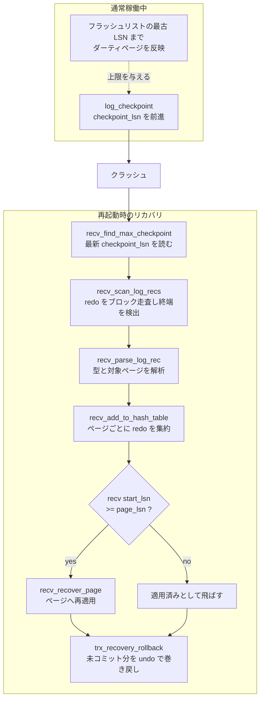

# 第29章 チェックポイントとクラッシュリカバリ

> **本章で読むソース**
>
> - [`storage/innobase/log/log0chkp.cc`](https://github.com/mysql/mysql-server/blob/mysql-8.4.10/storage/innobase/log/log0chkp.cc)
> - [`storage/innobase/log/log0recv.cc`](https://github.com/mysql/mysql-server/blob/mysql-8.4.10/storage/innobase/log/log0recv.cc)
> - [`storage/innobase/trx/trx0roll.cc`](https://github.com/mysql/mysql-server/blob/mysql-8.4.10/storage/innobase/trx/trx0roll.cc)

## この章の狙い

第27章では、ページを変更する前にその変更を redo ログへ書く WAL の仕組みを読んだ。
redo ログがディスクに残ってさえいれば、ダーティページがバッファプールに留まったまま電源が落ちても、再起動時に redo を読み直してページを作り直せる。

だが、redo ログを毎回先頭から読み直すわけにはいかない。
稼働を続ければ redo は際限なく伸び、リカバリ時間も伸びてしまう。
そこで InnoDB は、ある時点までの変更がすべてデータファイルへ反映済みであることを記録した目印を redo ログに置く。
これが**チェックポイント**であり、その目印の位置を表す LSN が `checkpoint_lsn` である。
リカバリはこの目印より手前の redo を読む必要がない。

本章は2つの局面を読む。
前半は、`checkpoint_lsn` をどこまで進められるかを決める計算と、それをログファイルへ書き出す `log_checkpoint` である。
後半は、再起動時にチェックポイントから redo を読み、ページごとに再適用し、最後に未コミットトランザクションを巻き戻すクラッシュリカバリである。
両者をつなぐのは、ページに刻まれた LSN を使って「すでに適用済みの redo を飛ばす」という冪等性の仕組みである。

## 前提

LSN（log sequence number）が、redo ログを書いた総バイト数に対応する単調増加の番号であることは第27章で見た。
各ページのヘッダ `FIL_PAGE_LSN` には、そのページに最後に適用された変更の LSN が刻まれる。
バッファプールのダーティページは**フラッシュリスト**につながれ、その先頭にはもっとも古い未フラッシュの変更の LSN（oldest modification）が並ぶことは第15章で見た。
本章ではこのフラッシュリストの最古 LSN を、チェックポイントを進められる上限の根拠として使う。

未コミットトランザクションの巻き戻しに使う undo ログと、その適用については第25章で読んだ。
本章の最後は、その undo 適用がクラッシュリカバリの仕上げとして呼ばれる箇所につなぐ。

## fuzzy checkpoint がどこまで進めるか

チェックポイントを進めるとは、`checkpoint_lsn` をより大きな値へ更新することである。
ただし無制限には進められない。
`checkpoint_lsn` より手前の redo は「もうデータファイルに反映済みだから読まなくてよい」という意味を持つので、まだバッファプールにダーティのまま残っている変更の LSN を追い越してはならない。
追い越せば、リカバリがその変更の redo を読み飛ばし、ディスク上の古いページが復元できなくなる。

この上限を計算するのが `log_compute_available_for_checkpoint_lsn` である。
中心は、フラッシュリストの最古 LSN をバッファプールから取り、それを超えない値に丸める部分にある。

[`storage/innobase/log/log0chkp.cc` L199-L218](https://github.com/mysql/mysql-server/blob/mysql-8.4.10/storage/innobase/log/log0chkp.cc#L199-L218)

```cpp
  const lsn_t dpa_lsn = log_buffer_dirty_pages_added_up_to_lsn(log);

  ut_ad(dpa_lsn >= log.last_checkpoint_lsn.load() ||
        !log_checkpointer_mutex_own(log));

  log_sync_point("log_get_available_for_chkp_lsn_before_buf_pool");

  lsn_t lwm_lsn = buf_pool_get_oldest_modification_lwm();

  /* We cannot return lsn larger than dpa_lsn,
  because some mtr's commit could be in the middle, after
  its log records have been written to log buffer, but before
  its dirty pages have been added to flush lists. */

  if (lwm_lsn == 0) {
    /* Empty flush list. */
    lwm_lsn = dpa_lsn;
  } else {
    lwm_lsn = std::min(lwm_lsn, dpa_lsn);
  }
```

`buf_pool_get_oldest_modification_lwm` がフラッシュリストの最古の変更 LSN（の下限）を返す。
フラッシュリストが空、つまりダーティページが1つもないなら、その時点までに redo を書いたところまで進めてよい（`dpa_lsn`）。
ダーティページがあれば、その最古 LSN を超えてはならないので、両者の最小値をとる。
これが**fuzzy checkpoint**（曖昧チェックポイント）と呼ばれる方式である。
すべてのダーティページをフラッシュし終えるのを待ってから目印を置く（sharp checkpoint）のではなく、いま反映済みと確実に言える範囲まで目印を進める。
ダーティページのフラッシュは別途バックグラウンドで進むので、チェックポイントのために書き込みを止めて待つ時間が要らない。

上限はもう一段絞られる。
チェックポイントは、redo がディスクへフラッシュ済みの位置（`flushed_to_disk_lsn`）も超えられない。

[`storage/innobase/log/log0chkp.cc` L220-L235](https://github.com/mysql/mysql-server/blob/mysql-8.4.10/storage/innobase/log/log0chkp.cc#L220-L235)

```cpp
  /* Cannot go beyond flushed lsn.

  We cannot write checkpoint at higher lsn than lsn up to which
  redo is flushed to disk. We must not wait for log writer/flusher
  in log_checkpoint(). Therefore we need to limit lsn for checkpoint.
  That's because we would risk a deadlock otherwise - because writer
  waits for advanced checkpoint, when it detected that there is no
  free space in log files.

  However, note that the deadlock would happen only if we created
  log records without dirty pages (during page flush we anyway wait
  for redo flushed up to page's newest_modification). */

  const lsn_t flushed_lsn = log.flushed_to_disk_lsn.load();

  lsn_t lsn = std::min(lwm_lsn, flushed_lsn);
```

`checkpoint_lsn` を `flushed_to_disk_lsn` まで抑えるのは、目印が指す位置までの redo 自体がディスクに残っていなければ、リカバリの起点として使えないからである。
ここで log writer や flusher の完了を待たない設計は、デッドロックを避けるためだとコメントが説明している。
ログファイルに空きがないとき writer はチェックポイントの前進を待ち、もしチェックポイント側も writer の完了を待てば、互いに待ち合う。

## checkpoint_lsn をログファイルへ書く

上限が決まれば、実際に目印を進めるのが `log_checkpoint` である。
書く LSN を確定し、ダーティページの fsync を挟んでから、ログファイルのチェックポイントヘッダへ書き出す。

[`storage/innobase/log/log0chkp.cc` L456-L472](https://github.com/mysql/mysql-server/blob/mysql-8.4.10/storage/innobase/log/log0chkp.cc#L456-L472)

```cpp
  const lsn_t checkpoint_lsn = log_determine_checkpoint_lsn(log);

  if (arch_page_sys != nullptr) {
    arch_page_sys->flush_at_checkpoint(checkpoint_lsn);
  }

  log_sync_point("log_before_checkpoint_data_flush");

  buf_flush_fsync();

  if (log_test != nullptr) {
    log_test->fsync_written_pages();
  }

  ut_a(checkpoint_lsn >= log.last_checkpoint_lsn.load());

  ut_a(checkpoint_lsn <= log_buffer_dirty_pages_added_up_to_lsn(log));
```

`log_determine_checkpoint_lsn` が、前節で計算した上限を踏まえて書く LSN を返す。
直後の `buf_flush_fsync` は、すでにディスクへ書き出した（write した）データページを fsync で確実に永続化する。
これにより、目印が指す位置までの変更がデータファイルに残っていることを保証する。
2つの `ut_a` は不変条件の検査である。
新しい `checkpoint_lsn` は前回の値以上であり（後退しない）、ダーティページがフラッシュリストへ追加された位置を超えない。

書き出しは `log_files_next_checkpoint` が担い、その内部でヘッダをファイルへ書いてから `last_checkpoint_lsn` を更新する。

[`storage/innobase/log/log0chkp.cc` L374-L393](https://github.com/mysql/mysql-server/blob/mysql-8.4.10/storage/innobase/log/log0chkp.cc#L374-L393)

```cpp
  const dberr_t err = log_files_write_checkpoint_low(
      log, next_file_handle, log.next_checkpoint_header_no,
      next_checkpoint_lsn);

  if (err != DB_SUCCESS) {
    return err;
  }

  log_sync_point("log_before_checkpoint_flush");

  next_file_handle.fsync();

  DBUG_PRINT("ib_log", ("checkpoint info written"));

  log.next_checkpoint_header_no =
      log_next_checkpoint_header(log.next_checkpoint_header_no);

  log_sync_point("log_before_checkpoint_lsn_update");

  log.last_checkpoint_lsn.store(next_checkpoint_lsn);
```

ヘッダを書いたあと `fsync` でそれを永続化し、最後にメモリ上の `last_checkpoint_lsn` を更新する。
順序が重要である。
ファイル上のヘッダが先に確定してから、メモリの値を進める。
この `checkpoint_lsn` が、次のクラッシュリカバリで redo を読み始める起点になる。

チェックポイントは `log_checkpointer` という専用スレッドが周期的に呼ぶ。
ダーティページがたまり、`checkpoint_lsn` から現在位置までの距離（checkpoint age）が大きくなると、より積極的にチェックポイントを書いてリカバリ時間を抑える。
ここがチェックポイントの設計の要点である。
ダーティページのフラッシュを止めずに目印だけを前進させ続けることで、停止時間を作らずにリカバリの起点を新しく保つ。

## リカバリの起点を見つける

ここからは再起動側を読む。
起動時に呼ばれる `recv_recovery_from_checkpoint_start` が、リカバリの入り口である。

[`storage/innobase/log/log0recv.cc` L3839-L3863](https://github.com/mysql/mysql-server/blob/mysql-8.4.10/storage/innobase/log/log0recv.cc#L3839-L3863)

```cpp
dberr_t recv_recovery_from_checkpoint_start(log_t &log, lsn_t flush_lsn) {
  /* Initialize red-black tree for fast insertions into the
  flush_list during recovery process. */
  buf_flush_init_flush_rbt();

  if (srv_force_recovery >= SRV_FORCE_NO_LOG_REDO) {
    ib::info(ER_IB_MSG_728);

    /* We leave redo log not started and this is read-only mode. */
    ut_a(log.sn == 0);
    ut_a(srv_read_only_mode);

    return DB_SUCCESS;
  }

  recv_recovery_on = true;

  ut_a(log.m_format == Log_format::CURRENT);

  /* Look for the latest checkpoint */
  Log_checkpoint_location checkpoint;
  if (!recv_find_max_checkpoint(log, checkpoint)) {
    ib::error(ER_IB_MSG_RECOVERY_CHECKPOINT_NOT_FOUND);
    return DB_ERROR;
  }
```

最初に `recv_find_max_checkpoint` がログファイルから最新のチェックポイントを探す。
InnoDB はチェックポイントヘッダを2つ持ち、交互に書く（前節で見た `next_checkpoint_header_no` の切り替え）。
書き込み中のクラッシュで一方が壊れても、もう一方から最新の有効な `checkpoint_lsn` を読めるようにする多重化である。

見つけた `checkpoint_lsn` を起点に redo の読み出しを始める。
読み出しと適用の準備が整うと、起動側へ「ここからバックグラウンドで進めてよい」と返す。

[`storage/innobase/log/log0recv.cc` L4009-L4018](https://github.com/mysql/mysql-server/blob/mysql-8.4.10/storage/innobase/log/log0recv.cc#L4009-L4018)

```cpp
  mutex_enter(&recv_sys->mutex);
  recv_sys->apply_log_recs = true;
  mutex_exit(&recv_sys->mutex);

  /* The database is now ready to start almost normal processing of user
  transactions: transaction rollbacks and the application of the log
  records in the hash table can be run in background. */

  return DB_SUCCESS;
}
```

コメントが、このあとに残る2つの作業を予告している。
ハッシュテーブルに集めた redo レコードの適用と、トランザクションのロールバックである。
順に読む。

## redo を走査してページごとに振り分ける

`checkpoint_lsn` から先の redo は、ブロック単位で走査される。
走査は `recv_scan_log_recs` が担い、各ブロックのヘッダ番号とチェックサムを検査しながら進む。
クラッシュで途中まで書かれた redo は、ここで「壊れたブロック」として検出され、redo の終端と見なされる。

[`storage/innobase/log/log0recv.cc` L3405-L3419](https://github.com/mysql/mysql-server/blob/mysql-8.4.10/storage/innobase/log/log0recv.cc#L3405-L3419)

```cpp
    const uint32_t expected_hdr_no =
        log_block_convert_lsn_to_hdr_no(scanned_lsn);

    if (block_header.m_hdr_no != expected_hdr_no) {
      /* Garbage or an incompletely written log block.

      We will not report any error, because this can
      happen when InnoDB was killed while it was
      writing redo log. We simply treat this as an
      abrupt end of the redo log. */

      finished = true;

      break;
    }
```

ブロック番号が期待値と食い違えば、それ以上は有効な redo ではないと判断して走査を止める。
エラーにしないのは、書き込み途中で InnoDB が落ちれば当然そうなるからだ、とコメントが述べている。
ここで止めた位置が、再適用すべき redo の終端になる。

走査で取り出した1件ずつのレコードは、`recv_parse_log_rec` が型と対象（テーブルスペース ID とページ番号）を解析する。

[`storage/innobase/log/log0recv.cc` L2822-L2832](https://github.com/mysql/mysql-server/blob/mysql-8.4.10/storage/innobase/log/log0recv.cc#L2822-L2832)

```cpp
static ulint recv_parse_log_rec(mlog_id_t *type, const byte *ptr,
                                const byte *end_ptr, space_id_t *space_id,
                                page_no_t *page_no, const byte **body) {
  const byte *new_ptr;

  *body = nullptr;

  UNIV_MEM_INVALID(type, sizeof *type);
  UNIV_MEM_INVALID(space_id, sizeof *space_id);
  UNIV_MEM_INVALID(page_no, sizeof *page_no);
  UNIV_MEM_INVALID(body, sizeof *body);
```

解析できたレコードは、対象ページごとにまとめてハッシュテーブルへ登録される。
これを行うのが `recv_add_to_hash_table` である。

[`storage/innobase/log/log0recv.cc` L2421-L2430](https://github.com/mysql/mysql-server/blob/mysql-8.4.10/storage/innobase/log/log0recv.cc#L2421-L2430)

```cpp
  recv_t *recv;

  recv = static_cast<recv_t *>(mem_heap_alloc(space->m_heap, sizeof(*recv)));

  recv->type = type;
  recv->end_lsn = end_lsn;
  recv->len = rec_end - body;
  recv->start_lsn = start_lsn;

  auto it = space->m_pages.find(page_no);
```

`recv` レコードには、そのレコードの開始 LSN（`start_lsn`）と終了 LSN（`end_lsn`）が保持される。
この `start_lsn` が、後でページ LSN と比べる側の値になる。
レコードは対象ページのリスト（`recv_addr->rec_list`）の末尾につながれ、LSN の昇順に並ぶ。
redo をいったんページ単位に振り分けてからまとめて適用するのは、同じページへの複数の変更をページ1回の読み込みで処理し、ランダムな読み込みを減らすためである。

## ページ LSN で適用済みを飛ばす

集めた redo は `recv_apply_hashed_log_recs` がテーブルスペースとページを順にたどって適用する。
1ページぶんの適用は、最終的に `recv_recover_page_func` が行う。
ここが、リカバリの冪等性を支える中心である。

まず、対象ページの現在の LSN を読む。

[`storage/innobase/log/log0recv.cc` L2652-L2667](https://github.com/mysql/mysql-server/blob/mysql-8.4.10/storage/innobase/log/log0recv.cc#L2652-L2667)

```cpp
  /* Read the newest modification lsn from the page */
  lsn_t page_lsn = mach_read_from_8(page + FIL_PAGE_LSN);

#ifndef UNIV_HOTBACKUP

  /* It may be that the page has been modified in the buffer
  pool: read the newest modification LSN there */

  lsn_t page_newest_lsn;

  page_newest_lsn = buf_page_get_newest_modification(&block->page);

  if (page_newest_lsn) {
    page_lsn = page_newest_lsn;
  }
#else  /* !UNIV_HOTBACKUP */
```

`page_lsn` は、いまディスク（またはバッファプール）にあるページに最後に適用された変更の LSN である。
チェックポイント時にすでにフラッシュ済みだったページは、`checkpoint_lsn` 以降の変更を含む場合もあれば含まない場合もある。
fuzzy checkpoint では、目印より新しい変更がデータファイルに反映済みのページが混じりうるからだ。
どこまで反映済みかは、ページ自身に刻まれた `page_lsn` だけが正確に知っている。

そこで、ページに集まった redo レコードを1件ずつ見て、`start_lsn` が `page_lsn` 以上のものだけを適用する。

[`storage/innobase/log/log0recv.cc` L2725-L2737](https://github.com/mysql/mysql-server/blob/mysql-8.4.10/storage/innobase/log/log0recv.cc#L2725-L2737)

```cpp
    if (recv->start_lsn >= page_lsn
#ifndef UNIV_HOTBACKUP
        && undo::is_active(recv_addr->space)
#endif /* !UNIV_HOTBACKUP */
    ) {

      if (!modification_to_page) {
#ifndef UNIV_HOTBACKUP
        ut_a(recv_needed_recovery);
#endif /* !UNIV_HOTBACKUP */
        modification_to_page = true;
        start_lsn = recv->start_lsn;
      }
```

`recv->start_lsn >= page_lsn` が冪等性の判定である。
あるレコードの `start_lsn` がページの `page_lsn` より小さければ、その変更はすでにこのページへ適用済みなので飛ばす。
等しいか大きいものだけを適用する。
この一行があるおかげで、リカバリが途中でもう一度落ちて最初からやり直しても、結果は変わらない。
同じ redo を二度適用しても、二度目はページ LSN がすでに進んでいるので素通りされる。

ここが本章で最低1つ求められる、機構レベルの最適化である。
チェックポイントですべてのダーティページのフラッシュを待たないかわりに、リカバリ側でページ LSN とレコード LSN を比べ、適用済みの redo を1件ずつ飛ばす。
チェックポイントの停止時間をなくす代償を、リカバリ時の安価な LSN 比較が引き受けている。
比較は8バイト整数1回の大小判定であり、ページを読み込んだあとに付随して行えるので、再適用そのものより十分に軽い。

なお、適用はバッファプール上のページに対して行われ、`recv_apply_log_rec` がページを `RW_X_LATCH` で固定したうえで `recv_recover_page` を呼ぶ。

[`storage/innobase/log/log0recv.cc` L1106-L1115](https://github.com/mysql/mysql-server/blob/mysql-8.4.10/storage/innobase/log/log0recv.cc#L1106-L1115)

```cpp
      buf_block_t *block;

      block =
          buf_page_get(page_id, page_size, RW_X_LATCH, UT_LOCATION_HERE, &mtr);

      buf_block_dbg_add_level(block, SYNC_NO_ORDER_CHECK);

      recv_recover_page(false, block);

      mtr_commit(&mtr);
```

適用後のページはダーティになり、通常のフラッシュ経路でデータファイルへ書き戻される。
これで redo の再適用が完了し、ディスク上のページはクラッシュ直前の状態まで前進する。

## 未コミットトランザクションの巻き戻し

redo の再適用で、ページはクラッシュ直前の論理状態まで復元される。
だが、その状態には、コミットされないまま落ちたトランザクションが書きかけた変更も含まれている。
redo はミニトランザクション単位の物理的な変更を記録するので、トランザクションがコミットしたかどうかとは無関係に、書かれた変更はすべて再現されるからだ。
コミットしていない変更は取り消さなければならない。

これを担うのが、第25章で読んだ undo ログである。
リカバリは、resurrect（復活）したトランザクションのうちコミットされなかったものを `trx_recovery_rollback` で巻き戻す。

[`storage/innobase/trx/trx0roll.cc` L784-L786](https://github.com/mysql/mysql-server/blob/mysql-8.4.10/storage/innobase/trx/trx0roll.cc#L784-L786)

```cpp
void trx_recovery_rollback(THD *thd) {
  std::vector<MDL_ticket *> shared_mdl_list;
  ut_ad(!srv_read_only_mode);
```

この関数は専用スレッド（`trx_recovery_rollback_thread`）として走り、対象テーブルの MDL を取りながら、未完了トランザクションの undo を適用して変更を取り消す。
undo の適用そのものは第25章で読んだロールバックと同じ仕組みであり、`DB_ROLL_PTR` をたどって更新前イメージを書き戻す。

ロールバックがバックグラウンドの別スレッドに置かれているのは、redo の再適用が終わればデータベースが論理的に一貫した状態になり、未コミット分の取り消しを待たずに新しい接続を受け付けられるからである。
巻き戻しの対象だったレコードには、まだ undo が残っているので、新しいトランザクションがそれを読んでも MVCC が過去の版を見せる（第24章）。
こうしてリカバリの最終段を非同期化し、再起動から利用可能になるまでの時間を短くする。

## リカバリの全体像

ここまでの流れを1つの図にまとめる。
チェックポイントが起点を作り、redo 走査がレコードをページごとに集め、ページ LSN 比較で適用済みを飛ばしながら再適用し、最後に未コミット分を undo で巻き戻す。



## まとめ

チェックポイントは、`checkpoint_lsn` という1つの LSN で「ここまでの redo はデータファイルに反映済み」と宣言し、リカバリが redo を読み始める起点を作る。
`log_compute_available_for_checkpoint_lsn` は、フラッシュリストの最古 LSN と redo のフラッシュ位置の最小値までしか目印を進めない。
これが fuzzy checkpoint であり、ダーティページのフラッシュ完了を待たずに目印だけを前進させ、停止時間を作らない。

クラッシュリカバリは、最新の `checkpoint_lsn` を見つけ、そこから redo をブロック単位で走査し、壊れたブロックで終端を判定する。
取り出したレコードはページごとにハッシュテーブルへ集約され、`recv_recover_page_func` が `recv->start_lsn >= page_lsn` の判定で適用済みを飛ばしながら再適用する。
このページ LSN 比較が、何度やり直しても同じ結果に収束する冪等性を支える。
最後に `trx_recovery_rollback` が、コミットされなかったトランザクションの変更を undo で取り消し、リカバリを締めくくる。

## 関連する章

- [第15章 バッファプール](../part02-innodb-foundation/15-buffer-pool.md)：フラッシュリストと oldest modification を扱い、チェックポイントの上限の根拠を与える。
- [第16章 ミニトランザクション](../part02-innodb-foundation/16-mini-transaction.md)：redo を生む単位であり、再適用される変更の粒度を決める。
- [第24章 MVCC とリードビュー](../part04-transaction-concurrency/24-mvcc-and-read-view.md)：巻き戻し対象の版を、新しいトランザクションがどう見るかを扱う。
- [第25章 undo ログとパージ](../part04-transaction-concurrency/25-undo-and-purge.md)：未コミットトランザクションの巻き戻しに使う undo の仕組みを扱う。
- [第27章 redo ログ](27-redo-log.md)：LSN と WAL の基礎を扱い、本章の起点となるログを書く側を読む。
