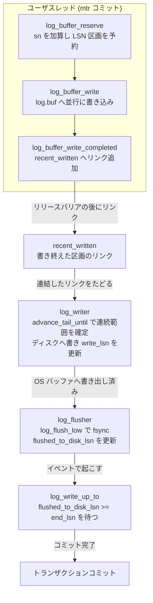

# 第32章 redo ログ

> **本章で読むソース**
>
> - [`storage/innobase/include/log0types.h`](https://github.com/mysql/mysql-server/blob/mysql-8.4.10/storage/innobase/include/log0types.h)
> - [`storage/innobase/include/log0log.h`](https://github.com/mysql/mysql-server/blob/mysql-8.4.10/storage/innobase/include/log0log.h)
> - [`storage/innobase/include/log0sys.h`](https://github.com/mysql/mysql-server/blob/mysql-8.4.10/storage/innobase/include/log0sys.h)
> - [`storage/innobase/log/log0buf.cc`](https://github.com/mysql/mysql-server/blob/mysql-8.4.10/storage/innobase/log/log0buf.cc)
> - [`storage/innobase/log/log0write.cc`](https://github.com/mysql/mysql-server/blob/mysql-8.4.10/storage/innobase/log/log0write.cc)

## この章の狙い

第21章で、InnoDB のページ変更は mtr 単位で原子的に行われ、コミット時に mtr が貯めた redo を共有のログバッファへ書くことを読んだ。
そこで `log_buffer_reserve` が LSN の区画を予約し、`recent_closed` ウィンドウでフラッシュリスト登録の順序を緩めるところまでは見たが、ログバッファへ移った redo がその後どうディスクへ届くかは第32章へ送っていた。
本章はその続きを読む。

redo ログが守る規律は1つである。
ページをディスクのデータファイルへ書く前に、そのページの変更を記録した redo を先にログへ書く。
これが**先行書き込みログ**（Write-Ahead Logging、WAL）であり、クラッシュ後に redo を再生してページを復元できる根拠になる。
mtr のコミットがページのフラッシュリスト登録より先に redo をログバッファへ書く順序は、第21章で読んだ。
本章で読むのは、そのログバッファの中身が専用スレッドの手でディスクへ書かれ、`fsync` で永続化され、トランザクションのコミットがその完了を待ち合わせるまでの経路である。

InnoDB 8.x の redo は、複数のコアが同時にログバッファへ書き込むことを前提に再設計されている。
ユーザスレッドは LSN の区画だけを奪い合い、書き込み自体は順序を気にせず並行で行う。
乱れた順序を後から回復する `recent_written` リンクバッファと、書き出しと `fsync` を一手に引き受ける `log_writer`、`log_flusher` の2スレッドが、その設計の中心にある。
本章では、LSN という座標、`log_t` とログバッファ、予約から書き込み完了まで、書き出しスレッドとフラッシュスレッド、そしてコミットの待ち合わせ `log_write_up_to` とグループコミットを順に読む。

## 前提

第21章で、mtr のコミットが `log_buffer_reserve` でログバッファに区画を予約し、`log_buffer_write` でバイト列を書き、`log_buffer_close` で締めるところまでを読んだ。
本章は、その予約と書き込みの内側、そして書いた先の永続化を読む。
第20章のバッファプールと、ダーティページがフラッシュリストへ載る流れも前提になる。

redo ログのディスク上の構造（ログファイルの並び、ブロックのヘッダとフッタ、チェックポイントヘッダ）は、本章では必要な範囲だけ触れる。
チェックポイントによるログ領域の回収と、クラッシュ後に redo を再生する手順は第34章で読む。

## LSN という座標

redo ログのすべてのバイトには、**LSN**（log sequence number）という単調増加の番号が振られる。
LSN は「ログの先頭から数えて何バイト目か」を表す座標であり、ページの変更時刻の代わりに使われる。
あるページが「LSN 1000 まで変更を受けた」とは、そのページに反映された最新の redo がログ上の 1000 バイト目までに書かれている、という意味になる。

InnoDB は LSN とよく似た **sn**（sequence number）という第2の座標も持つ。
両者の違いは、ログブロックのヘッダとフッタを数えるかどうかにある。
redo ログはディスク上で 512 バイトのブロックに区切られ、各ブロックは先頭 12 バイトのヘッダと末尾 4 バイトのフッタを持つ。
sn は実データのバイトだけを数え、LSN はヘッダとフッタも含めて数える。
この2つの座標を相互変換するのが `log_translate_sn_to_lsn` である。

[`storage/innobase/include/log0log.h` L85-L88](https://github.com/mysql/mysql-server/blob/mysql-8.4.10/storage/innobase/include/log0log.h#L85-L88)

```cpp
constexpr inline lsn_t log_translate_sn_to_lsn(sn_t sn) {
  return sn / LOG_BLOCK_DATA_SIZE * OS_FILE_LOG_BLOCK_SIZE +
         sn % LOG_BLOCK_DATA_SIZE + LOG_BLOCK_HDR_SIZE;
}
```

`LOG_BLOCK_DATA_SIZE` 分（512 から 12 と 4 を引いた 496 バイト）の sn が進むごとに、LSN は 1 ブロック分の 512 バイト進む。
ユーザスレッドが奪い合うのは sn の区画だが、ページやチェックポイントが記録するのは LSN である。
予約のたびに `log_translate_sn_to_lsn` で sn を LSN へ直すのは、書き出し位置の計算にブロックの物理レイアウトを含めるためである。

LSN と sn はどちらも 64 ビットの符号なし整数で表される。

[`storage/innobase/include/log0types.h` L62-L89](https://github.com/mysql/mysql-server/blob/mysql-8.4.10/storage/innobase/include/log0types.h#L62-L89)

```cpp
/** Type used for all log sequence number storage and arithmetic. */
typedef uint64_t lsn_t;

// ... (中略) ...

/** Alias for atomic based on lsn_t. */
using atomic_lsn_t = std::atomic<lsn_t>;

/** Type used for sn values, which enumerate bytes of data stored in the log.
Note that these values skip bytes of headers and footers of log blocks. */
typedef uint64_t sn_t;

/** Alias for atomic based on sn_t. */
using atomic_sn_t = std::atomic<sn_t>;
```

本章で追う LSN の値はいくつもある。
予約済みの先端を指す現在 LSN、ディスクへ書き終えた `write_lsn`、`fsync` まで終えた `flushed_to_disk_lsn` の3つが軸になる。
これらが追いかけっこをしながら、後ろの2つが前の1つを追って進む。

## ログバッファを持つ `log_t`

redo ログシステムの状態は、`log_t` という1つの構造体に集約される。
グローバル変数 `log_sys` がその唯一の実体である。
mtr が書き込むログバッファ `buf` と、LSN を奪い合う基準になる現在 sn が、その先頭付近に置かれる。

[`storage/innobase/include/log0sys.h` L98-L120](https://github.com/mysql/mysql-server/blob/mysql-8.4.10/storage/innobase/include/log0sys.h#L98-L120)

```cpp
  /** Current sn value. Used to reserve space in the redo log,
  and used to acquire an exclusive access to the log buffer.
  Represents number of data bytes that have ever been reserved.
  Bytes of headers and footers of log blocks are not included.
  Its highest bit is used for locking the access to the log buffer. */
  alignas(ut::INNODB_CACHE_LINE_SIZE) atomic_sn_t sn;

  /** Intended sn value while x-locked. */
  atomic_sn_t sn_locked;

  /** Mutex which can be used for x-lock sn value */
  mutable ib_mutex_t sn_x_lock_mutex;

  /** Aligned log buffer. Committing mini-transactions write there
  redo records, and the log_writer thread writes the log buffer to
  disk in background.
  Protected by: locking sn not to add. */
  alignas(ut::INNODB_CACHE_LINE_SIZE)
      ut::aligned_array_pointer<byte, LOG_BUFFER_ALIGNMENT> buf;

  /** Size of the log buffer expressed in number of data bytes,
  that is excluding bytes for headers and footers of log blocks. */
  atomic_sn_t buf_size_sn;
```

`sn` は「これまでに予約された実データの総バイト数」を表すアトミック変数である。
mtr のコミットがログ領域を奪うとき、必要バイト数を `sn` に足し込み、足す前の値を自分の区画の先頭にする。
`buf` がログバッファ本体で、`buf_size_sn` がその容量を sn 単位で表す。
ログバッファはリングバッファであり、`buf` 上の位置は LSN を容量で割った余りで決まる。

mtr の側から見たログバッファへの書き込みは、第21章で読んだ予約と書き込みのループに集約される。
ここから先は、その予約と書き込みの内側、そしてユーザスレッドと書き出しスレッドのあいだの受け渡しを読む。

### 3つの LSN 境界

`log_t` には、redo の進行を表す LSN がいくつも置かれる。
本章の主役は次の3つである。
`sn`（から導く現在 LSN）が予約の先端、`write_lsn` がディスクへ書き終えた地点、`flushed_to_disk_lsn` が `fsync` まで終えた地点を指す。

[`storage/innobase/include/log0sys.h` L176-L234](https://github.com/mysql/mysql-server/blob/mysql-8.4.10/storage/innobase/include/log0sys.h#L176-L234)

```cpp
  /** Up to this lsn, data has been written to disk (fsync not required).
  Protected by: writer_mutex (writes). */
  alignas(ut::INNODB_CACHE_LINE_SIZE) atomic_lsn_t write_lsn;

// ... (中略) ...

  /** Up to this lsn data has been flushed to disk (fsynced). */
  alignas(ut::INNODB_CACHE_LINE_SIZE) atomic_lsn_t flushed_to_disk_lsn;
```

`write_lsn` は `log_writer` スレッドが、`flushed_to_disk_lsn` は `log_flusher` スレッドがそれぞれ前へ進める。
両者は常に `flushed_to_disk_lsn <= write_lsn <= 現在 LSN` の関係を保つ。
トランザクションのコミットが「redo が永続化されたか」を知るには、`flushed_to_disk_lsn` が自分の LSN に追いついたかを見ればよい。

各境界が別々のキャッシュラインに乗るよう `alignas(ut::INNODB_CACHE_LINE_SIZE)` が付いている。
別スレッドが頻繁に書き換える `write_lsn` と `flushed_to_disk_lsn` を同じラインに同居させると、片方の更新がもう片方を読むコアのキャッシュを無効化してしまう。
境界ごとにラインを分けることで、この偽共有を避けている。

## 予約から書き込み完了まで

mtr のコミットは `log_buffer_reserve` でログ領域の区画を予約する。
この関数は、必要バイト数 `len` を受け取り、sn の区画を奪い、その範囲を LSN に直して返す。

[`storage/innobase/log/log0buf.cc` L859-L910](https://github.com/mysql/mysql-server/blob/mysql-8.4.10/storage/innobase/log/log0buf.cc#L859-L910)

```cpp
Log_handle log_buffer_reserve(log_t &log, size_t len) {
  Log_handle handle;

  /* In 5.7, we incremented log_write_requests for each single
  write to log buffer in commit of mini-transaction.

  However, writes which were solved by log_reserve_and_write_fast
  missed to increment the counter. Therefore it wasn't reliable.

  Dimitri and I have decided to change meaning of the counter
  to reflect mtr commit rate. */
  srv_stats.log_write_requests.inc();

  ut_ad(srv_shutdown_state_matches([](auto state) {
    return state <= SRV_SHUTDOWN_FLUSH_PHASE ||
           state == SRV_SHUTDOWN_EXIT_THREADS;
  }));

  ut_a(len > 0);

  /* Reserve space in sequence of data bytes: */
  const sn_t start_sn = log_buffer_s_lock_enter_reserve(log, len);

  /* Ensure that redo log has been initialized properly. */
  ut_a(start_sn > 0);

#ifdef UNIV_DEBUG
  if (!recv_recovery_is_on()) {
    log_background_threads_active_validate(log);
  } else {
    ut_a(!recv_no_ibuf_operations);
  }
#endif

  /* Headers in redo blocks are not calculated to sn values: */
  const sn_t end_sn = start_sn + len;

  log_sync_point("log_buffer_reserve_before_buf_limit_sn");

  /* Translate sn to lsn (which includes also headers in redo blocks): */
  handle.start_lsn = log_translate_sn_to_lsn(start_sn);
  handle.end_lsn = log_translate_sn_to_lsn(end_sn);

  if (unlikely(end_sn > log.buf_limit_sn.load())) {
    log_wait_for_space_after_reserving(log, handle);
  }

  ut_a(log_is_data_lsn(handle.start_lsn));
  ut_a(log_is_data_lsn(handle.end_lsn));

  return handle;
}
```

区画の奪取は `log_buffer_s_lock_enter_reserve` の中で、`sn` への単純なアトミック加算で行う。
加算前の値が `start_sn`、`start_sn + len` が `end_sn` で、この2つを `log_translate_sn_to_lsn` で LSN に直したものが、返す `Log_handle` の `start_lsn` と `end_lsn` になる。
複数スレッドが同時に予約しても、アトミック加算が区画を重ならせない。
ここでロックを取らずに区画だけを配るのが、並行書き込みを支える土台である。

予約した LSN がログバッファや、ログファイルの空きを超える場合だけ、`log_wait_for_space_after_reserving` で空くまで待つ。
空きが足りていれば、待ちなしで区画を受け取り、ただちにバッファへの書き込みへ進む。

### ログバッファへの書き込み

`log_buffer_write` が、mtr のバイト列をログバッファ `log.buf` の所定の位置へ写す。
リングバッファである `log.buf` の上では、512 バイトのブロックごとにヘッダとフッタを避けて書く必要がある。
コピーはブロック境界で区切りながら進む。

[`storage/innobase/log/log0buf.cc` L965-L995](https://github.com/mysql/mysql-server/blob/mysql-8.4.10/storage/innobase/log/log0buf.cc#L965-L995)

```cpp
    /* Calculate how many free data bytes are available
    within current log block. */
    const auto left = OS_FILE_LOG_BLOCK_SIZE - LOG_BLOCK_TRL_SIZE - offset;

    ut_a(left > 0);
    ut_a(left < OS_FILE_LOG_BLOCK_SIZE);

    size_t len, lsn_diff;

    if (left > str_len) {
      /* There are enough free bytes to finish copying
      the remaining part, leaving at least single free
      data byte in the log block. */

      len = str_len;

      lsn_diff = str_len;

    } else {
      /* We have more to copy than the current log block
      has remaining data bytes, or exactly the same.

      In both cases, next lsn value will belong to the
      next log block. Copy data up to the end of the
      current log block and start a next iteration if
      there is more to copy. */

      len = left;

      lsn_diff = left + LOG_BLOCK_TRL_SIZE + LOG_BLOCK_HDR_SIZE;
    }
```

現在のブロックに残るデータバイト数 `left` を求め、書き残し `str_len` がそこへ収まるなら一気に写す。
収まらなければブロックの終わりまで写し、次の反復で次ブロックの先頭（ヘッダの後）から続ける。
`lsn_diff` にフッタとヘッダの分を足しているのは、LSN がブロックの境界をまたぐとき、データを持たないヘッダとフッタの分も LSN を進めるためである。
この複数ブロックへの書き込みを、複数のスレッドが互いの区画を気にせず並行で行う。

### 書き込み完了を `recent_written` へ記録する

ここで問題が起きる。
スレッド A が LSN 1000 から 1500 までの区画を、スレッド B が 1500 から 2000 までの区画を予約したとする。
両者は並行に書くので、B が先に書き終え、A がまだ書いている瞬間がありうる。
このとき `log_writer` が 2000 まで書けると思い込んでディスクへ写すと、A の未完成の区画（1000 から 1500）をディスクへ書いてしまう。

これを防ぐのが `recent_written` リンクバッファである。
各ユーザスレッドは、自分の区画を書き終えた時点で、`recent_written` に「`start_lsn` から `end_lsn` までを書き終えた」というリンクを置く。
ソースのコメントが、このリングバッファの役割を説明している。

[`storage/innobase/log/log0buf.cc` L259-L290](https://github.com/mysql/mysql-server/blob/mysql-8.4.10/storage/innobase/log/log0buf.cc#L259-L290)

```cpp
 The log recent written buffer is responsible for tracking which of concurrent
 writes to the log buffer, have been finished. It allows the log writer thread
 to update @ref subsect_redo_log_buf_ready_for_write_lsn, which allows to find
 the next complete fragment of the log buffer to write. It is enough to track
 only recent writes, because we know that up to _log.buf_ready_for_write_lsn_,
 all writes have been finished. Hence this lsn value defines the beginning of
 lsn range represented by the recent written buffer in a given time. The recent
 written buffer is a ring buffer, directly addressed by lsn value. When there
 is no space in the buffer, user thread needs to wait.

 @note Size of the log recent written buffer is limited, so concurrency might
 be limited if the recent written buffer is too small and user threads start
 to wait for each other then (indirectly by waiting for the space reclaimed
 in the recent written buffer by the log writer thread).

 Let us describe the procedure used for adding the links.

 Suppose, user thread has just written some of mtr's log records to a range
 of lsn values _tmp_start_lsn_ .. _tmp_end_lsn_, then:

 -# User thread waits for free space in the recent written buffer, until:

         tmp_end_lsn - log.buf_ready_for_write_lsn <= S

    where _S_ is a number of slots in the log recent_written buffer.

 -# User thread adds the link by setting value of slot for _tmp_start_lsn_:

         log.recent_written[tmp_start_lsn % S] = tmp_end_lsn

    The value gives information about how much to advance lsn when traversing
    the link.
```

リンクの追加は `log_buffer_write_completed` が行う。

[`storage/innobase/log/log0buf.cc` L1078-L1106](https://github.com/mysql/mysql-server/blob/mysql-8.4.10/storage/innobase/log/log0buf.cc#L1078-L1106)

```cpp
  while (!log.recent_written.has_space(start_lsn)) {
    os_event_set(log.writer_event);
    ++wait_loops;
    std::this_thread::sleep_for(std::chrono::microseconds(20));
  }

  if (unlikely(wait_loops != 0)) {
    MONITOR_INC_VALUE(MONITOR_LOG_ON_RECENT_WRITTEN_WAIT_LOOPS, wait_loops);
  }

  /* Disallow reordering of writes to log buffer after this point.
  This is actually redundant, because we use seq_cst inside the
  log.recent_written.add_link(). However, we've decided to leave
  the separate acq-rel synchronization between user threads and
  log writer. Reasons:
          1. Not to rely on internals of Link_buf::add_link.
          2. Stress that this synchronization is required in
             case someone decided to weaken memory ordering
             inside Link_buf. */
  std::atomic_thread_fence(std::memory_order_release);

  log_sync_point("log_buffer_write_completed_before_store");

  ut_ad(log.write_lsn.load() <= start_lsn);
  ut_ad(log_buffer_ready_for_write_lsn(log) <= start_lsn);

  /* Note that end_lsn will not point to just before footer,
  because we have already validated that end_lsn is valid. */
  log.recent_written.add_link_advance_tail(start_lsn, end_lsn);
```

リンクを置く前の `std::atomic_thread_fence(std::memory_order_release)` が要点である。
ログバッファへのデータ書き込みが、リンクの追加より必ず前に完了することを保証する。
もしコンパイラや CPU がこの順序を入れ替えれば、リンクだけ先に現れてデータが未完成、という危険な状態が見えてしまう。
リリースバリアがそれを禁じ、リンクが見えたならデータは確実に書き終えている、という不変条件を立てる。

`recent_written.has_space` に空きがなければ、ユーザスレッドは `writer_event` で `log_writer` を起こし、空くまで短くスリープして待つ。
`recent_written` のスロットは `log_writer` がリンクをたどって回収するので、書き出しが滞ると空きが減り、ユーザスレッドが間接的に待たされる。

## 書き出しスレッド `log_writer`

`log_writer` は、`recent_written` のリンクをたどって「途切れなく書き終えた地点」を求め、そこまでをディスクへ書く専用スレッドである。
その「途切れなく書き終えた地点」を進めるのが `log_advance_ready_for_write_lsn` である。

[`storage/innobase/log/log0buf.cc` L1304-L1325](https://github.com/mysql/mysql-server/blob/mysql-8.4.10/storage/innobase/log/log0buf.cc#L1304-L1325)

```cpp
  const lsn_t previous_lsn = log_buffer_ready_for_write_lsn(log);

  ut_a(previous_lsn >= write_lsn);

  if (log.recent_written.advance_tail_until(stop_condition)) {
    log_sync_point("log_advance_ready_for_write_before_update");

    /* Validation of recent_written is optional because
    it takes significant time (delaying the log writer). */
    if (log_test != nullptr &&
        log_test->enabled(Log_test::Options::VALIDATE_RECENT_WRITTEN)) {
      /* All links between ready_lsn and lsn have
      been traversed. The slots can't be re-used
      before we updated the tail. */
      log.recent_written.validate_no_links(previous_lsn,
                                           log_buffer_ready_for_write_lsn(log));
    }

    ut_a(log_buffer_ready_for_write_lsn(log) > previous_lsn);

    std::atomic_thread_fence(std::memory_order_acquire);
  }
```

`advance_tail_until` が、`recent_written` のリンクを先頭から連結している限りたどり、たどり着いた地点まで境界を進める。
先ほどの例で A の区画（1000 から 1500）がまだ書き終わっていなければ、A のリンクが欠けているので境界は 1000 で止まる。
B のリンク（1500 から 2000）が先にあっても、A が抜けている穴の先へは進めない。
こうして、途切れなく書き終えた連続した範囲だけが書き出しの対象になる。

`log_writer` の本体は、この境界を待ち、進んだら実際の書き出しを行うループである。

[`storage/innobase/log/log0write.cc` L2264-L2275](https://github.com/mysql/mysql-server/blob/mysql-8.4.10/storage/innobase/log/log0write.cc#L2264-L2275)

```cpp
      /* Advance lsn up to which data is ready in log buffer. */
      log_advance_ready_for_write_lsn(log);

      ready_lsn = log_buffer_ready_for_write_lsn(log);

      /* Wait until any of following conditions holds:
              1) There is some unwritten data in log buffer
              2) We should close threads. */

      if (log.write_lsn.load() < ready_lsn || log.should_stop_threads.load()) {
        return true;
      }
```

書き終えた境界 `ready_lsn` が現在の `write_lsn` より先にあれば、未書き出しのデータがある。
ループは `log_writer_write_buffer` を呼んでそこまでをディスクへ書き、書き終えると `write_lsn` を進める。

[`storage/innobase/log/log0write.cc` L1798-L1805](https://github.com/mysql/mysql-server/blob/mysql-8.4.10/storage/innobase/log/log0write.cc#L1798-L1805)

```cpp
  const lsn_t old_write_lsn = log.write_lsn.load();

  const lsn_t new_write_lsn = start_lsn + lsn_advance;
  ut_a(new_write_lsn > log.write_lsn.load());

  log.write_lsn.store(new_write_lsn);

  notify_about_advanced_write_lsn(log, old_write_lsn, new_write_lsn);
```

`write_lsn` を進めた後、`notify_about_advanced_write_lsn` で write_notifier スレッドを起こす。
write_notifier は、`write_lsn` が追い越したブロックのイベントを順に立て、そのブロックの書き出しを待っていたユーザスレッドを起こす。
ここまでで redo は OS のバッファへは届くが、まだディスクへ同期されてはいない。

## フラッシュスレッド `log_flusher`

`fsync` を担うのが `log_flusher` である。
`write_lsn` が `flushed_to_disk_lsn` より先にあれば、書き出し済みでまだ `fsync` していないデータがある。
`log_flusher` のループは、その差を見つけると `log_flush_low` を呼んで `fsync` する。

[`storage/innobase/log/log0write.cc` L2543-L2560](https://github.com/mysql/mysql-server/blob/mysql-8.4.10/storage/innobase/log/log0write.cc#L2543-L2560)

```cpp
      const lsn_t last_flush_lsn = log.flushed_to_disk_lsn.load();

      ut_a(last_flush_lsn <= log.write_lsn.load());

      if (last_flush_lsn < log.write_lsn.load()) {
        /* Flush and stop waiting. */
        log_flush_low(log);

        if (step % 1024 == 0) {
          log_flusher_mutex_exit(log);

          std::this_thread::yield();

          log_flusher_mutex_enter(log);
        }

        return true;
      }
```

`log_flush_low` が `fsync` の本体である。
今この瞬間の `write_lsn` を `flush_up_to_lsn` として読み、1回の `fsync` でそこまでを永続化し、`flushed_to_disk_lsn` をその値へ一気に進める。

[`storage/innobase/log/log0write.cc` L2443-L2474](https://github.com/mysql/mysql-server/blob/mysql-8.4.10/storage/innobase/log/log0write.cc#L2443-L2474)

```cpp
  const lsn_t last_flush_lsn = log.flushed_to_disk_lsn.load();

  const lsn_t flush_up_to_lsn = log.write_lsn.load();

  if (flush_up_to_lsn == last_flush_lsn) {
    os_event_set(log.old_flush_event);
    return;
  }

  log.last_flush_start_time = Log_clock::now();

  ut_a(flush_up_to_lsn > last_flush_lsn);

  if (do_flush) {
    log_sync_point("log_flush_before_fsync");
    log.m_current_file_handle.fsync();
  }

  log.last_flush_end_time = Log_clock::now();

  if (log.last_flush_end_time < log.last_flush_start_time) {
    /* Time was moved backward after we set start_time.
    Let assume that the fsync operation was instant.

    We move start_time backward, because we don't want
    it to remain in the future. */
    log.last_flush_start_time = log.last_flush_end_time;
  }

  log_sync_point("log_flush_before_flushed_to_disk_lsn");

  log.flushed_to_disk_lsn.store(flush_up_to_lsn);
```

ここに本章の中心になる工夫がある（後の節で詳述する）。
`fsync` は1回で、その時点の `write_lsn` まで一括して永続化する。
`flushed_to_disk_lsn` を進めた後、その境界が追い越したブロックのイベントを立て、永続化を待っていたユーザスレッドを起こす。
イベントが同じブロックに収まれば直接立て、またがるなら flush_notifier スレッドへ委ねる。

## コミットの待ち合わせ `log_write_up_to`

トランザクションのコミットは、自分の変更の redo が永続化されるまで待つ。
その待ち合わせの窓口が `log_write_up_to` である。
指定した LSN まで redo が書かれる（または `fsync` される）のを待ち、すでに条件を満たしていればただちに返る。

[`storage/innobase/log/log0write.cc` L1150-L1196](https://github.com/mysql/mysql-server/blob/mysql-8.4.10/storage/innobase/log/log0write.cc#L1150-L1196)

```cpp
  /* the log writer threads are working for high concurrency scale */
  if (flush_to_disk) {
    if (log.flushed_to_disk_lsn.load() >= end_lsn) {
      DEBUG_SYNC_C("log_flushed_by_writer");
      return wait_stats;
    }

    if (srv_flush_log_at_trx_commit != 1) {
      /* We need redo flushed, but because trx != 1, we have
      disabled notifications sent from log_writer to log_flusher.

      The log_flusher might be sleeping for 1 second, and we need
      quick response here. Log_writer avoids waking up log_flusher,
      so we must do it ourselves here.

      However, before we wake up log_flusher, we must ensure that
      log.write_lsn >= lsn. Otherwise log_flusher could flush some
      data which was ready for lsn values smaller than end_lsn and
      return to sleeping for next 1 second. */

      if (log.write_lsn.load() < end_lsn) {
        wait_stats += log_wait_for_write(log, end_lsn, &interrupted);
      }
    }

    /* Wait until log gets flushed up to end_lsn. */
    wait_stats += log_wait_for_flush(log, end_lsn, &interrupted);

    if (UNIV_UNLIKELY(interrupted)) {
      /* the log writer threads might be paused. retry. */
      goto retry;
    }

    DEBUG_SYNC_C("log_flushed_by_writer");
  } else {
    if (log.write_lsn.load() >= end_lsn) {
      return wait_stats;
    }

    /* Wait until log gets written up to end_lsn. */
    wait_stats += log_wait_for_write(log, end_lsn, &interrupted);

    if (UNIV_UNLIKELY(interrupted)) {
      /* the log writer threads might be paused. retry. */
      goto retry;
    }
  }
```

`flush_to_disk` が真なら、`flushed_to_disk_lsn` が `end_lsn` に達しているかをまず見る。
達していれば待たずに返る。
これが速い経路で、自分より後のコミットがすでに `fsync` を引き起こしていれば、自分は何もせずに済む。
達していなければ `log_wait_for_flush` で、`flushed_to_disk_lsn` が `end_lsn` を超えるまでイベントで待つ。

待ちは、LSN が属するログブロックに対応するイベントスロットで行う。
`log_flusher` が `flushed_to_disk_lsn` を進めたとき、そのブロックのイベントを立てて待ち手を起こす。
コミットがどの境界（`write_lsn` か `flushed_to_disk_lsn` か）を待つかは、`innodb_flush_log_at_trx_commit` の設定で変わる。
値が 1 なら毎コミットで `fsync` の完了を待ち、それ以外なら書き出しだけを待つか、何も待たない。

## 高速化の工夫

### 順序を乱して書き、`recent_written` で順序を回復する

8.x の redo 設計の核心は、ログバッファへの書き込みを直列化しないことにある。
仮に「LSN の小さい区画から順にしか書き込めない」と要求すれば、ユーザスレッドは前のスレッドの書き込み完了を待ってからしか自分の区画を書けず、多コアで詰まる。
InnoDB はこれを捨てる。
ユーザスレッドは `sn` へのアトミック加算で区画だけを奪い、書き込み自体は他スレッドの順序を一切気にせず並行に行う。

この緩和の代償は、ログバッファ上に「書き終えた区画」と「まだ書いている区画」が LSN 順に乱れて並ぶことである。
`log_writer` がこの乱れたバッファをそのまま書けば、未完成の区画をディスクへ書いてしまう。
そこで `recent_written` リンクバッファが、各区画の書き込み完了を `start_lsn` から `end_lsn` へのリンクとして記録する。
`log_writer` は `advance_tail_until` でこのリンクを先頭から連結している限りたどり、途切れた地点で止まる。

この仕掛けにより、書き込みは順序を乱して並行に行いつつ、ディスクへ書く範囲だけは「先頭から途切れず書き終えた連続範囲」に保たれる。
ロック競合を避けて書き込みを並行化しながら、書き出しの正しさは欠けたリンクで止まることで守られる。
順序の保証をロックではなくリンクの連結性に肩代わりさせたのが、この設計の要点である。
`recent_written` のリングは LSN で直接アドレスされるので、リンクの追加も回収も `O(1)` で済む。

### グループコミットによる `fsync` のまとめ

もう1つの工夫が、`fsync` のまとめ、すなわち**グループコミット**である。
`fsync` は redo の永続化で最も重い操作で、ディスクが実際に書き込みを確定するまで返らない。
これをコミットごとに1回ずつ呼べば、コミット頻度がそのまま `fsync` 頻度になり、スループットが `fsync` の遅延で頭打ちになる。

`log_flusher` は、この `fsync` を1スレッドに集約してまとめる。
`log_flush_low` は、`fsync` の直前に今この瞬間の `write_lsn` を `flush_up_to_lsn` として読み、1回の `fsync` でそこまでを一括して永続化する。
`fsync` が走っているあいだに書き出された redo は、次にまとめて永続化される。
多数のトランザクションが同時にコミットを待っていても、`fsync` の回数はコミット数ではなく `log_flusher` の周回数で決まる。

待ち手の側から見ると、これは「自分より後のコミットが引き起こした `fsync` に相乗りする」形になる。
`log_write_up_to` は、`flushed_to_disk_lsn` が自分の `end_lsn` を超えていれば待たずに返る。
あるコミットが `fsync` を起こせば `flushed_to_disk_lsn` が一気に進み、その範囲に入る他のコミットはすべて、自分では `fsync` を起こさずに通過できる。
コミット待ちのスレッドがこの待ち合わせをグループコミットとして識別できるよう、待ちには `THD_WAIT_GROUP_COMMIT` の印が付く。

[`storage/innobase/log/log0write.cc` L928-L933](https://github.com/mysql/mysql-server/blob/mysql-8.4.10/storage/innobase/log/log0write.cc#L928-L933)

```cpp
  const size_t slot = log_compute_flush_event_slot(log, lsn);

  thd_wait_begin(nullptr, THD_WAIT_GROUP_COMMIT);
  const auto wait_stats =
      os_event_wait_for(log.flush_events[slot], max_spins,
                        get_srv_log_wait_for_flush_timeout(), stop_condition);
```

同時コミットが多いほど、1回の `fsync` がまとめる範囲が広がり、コミット1件あたりの `fsync` 負担が下がる。
負荷が高いときほど効率が上がるのが、グループコミットの効きどころである。

## 図 redo がディスクへ届くまで

mtr のコミットがログバッファへ書いた redo は、`recent_written` を経て `log_writer` がディスクへ書き、`log_flusher` が `fsync` し、コミットがその完了を待つ。
4つのスレッドが、3つの LSN 境界を次々に追い越しながら redo を前へ送る。



書き込み（`wbuf`）が順序を乱して並行に進むのに対し、`log_writer` が読む範囲はリンクの連結で「先頭から途切れない連続範囲」に保たれる。
`log_flusher` の1回の `fsync` が `write_lsn` まで一括で永続化することが、グループコミットの実体である。

## まとめ

redo ログは、ページをディスクへ書く前に変更の記録を先にログへ書く WAL を実装する仕組みである。
すべてのバイトに単調増加の LSN が振られ、ページの変更地点もコミットの待ち合わせ点も LSN で表される。
redo ログシステムの状態は `log_t` に集約され、現在 LSN、`write_lsn`、`flushed_to_disk_lsn` の3つの境界が、後ろの2つが前を追う形で進む。

mtr のコミットは `log_buffer_reserve` で `sn` をアトミックに加算して区画を奪い、`log_buffer_write` でログバッファへ並行に書き、`log_buffer_write_completed` で `recent_written` へ書き込み完了のリンクを置く。
`log_writer` は `recent_written` の連結したリンクをたどって途切れず書き終えた範囲を確定し、ディスクへ書いて `write_lsn` を進める。
`log_flusher` は `write_lsn` まで1回の `fsync` で永続化し、`flushed_to_disk_lsn` を進める。
コミットは `log_write_up_to` で `flushed_to_disk_lsn` が自分の LSN に追いつくのを待つ。

この設計の鍵は2つの緩和にある。
ログバッファへの書き込みを直列化せず、乱れた順序を `recent_written` のリンク連結で回復することで、ロック競合を避けて並行に書き込む。
`fsync` を `log_flusher` に集約してまとめるグループコミットにより、同時コミットが多いほどコミット1件あたりの `fsync` 負担が下がる。

## 関連する章

- [第20章 バッファプール](../part02-innodb-foundation/20-buffer-pool.md)：redo が永続化された後にダーティページが書き戻されるフラッシュリストの管理を読む。
- [第21章 ミニトランザクション](../part02-innodb-foundation/21-mini-transaction.md)：本章のログバッファへ redo を書く `log_buffer_reserve` の呼び出し元と、WAL の順序を読む。
- [第28章 トランザクション管理](../part04-transaction-concurrency/28-transaction-management.md)：本章のグループコミットを待つコミット処理と、durable 化の流れを読む。
- [第34章 チェックポイントとクラッシュリカバリ](34-checkpoint-and-recovery.md)：本章で永続化した redo を再生して、クラッシュ後にページを復元する仕組みを読む。
