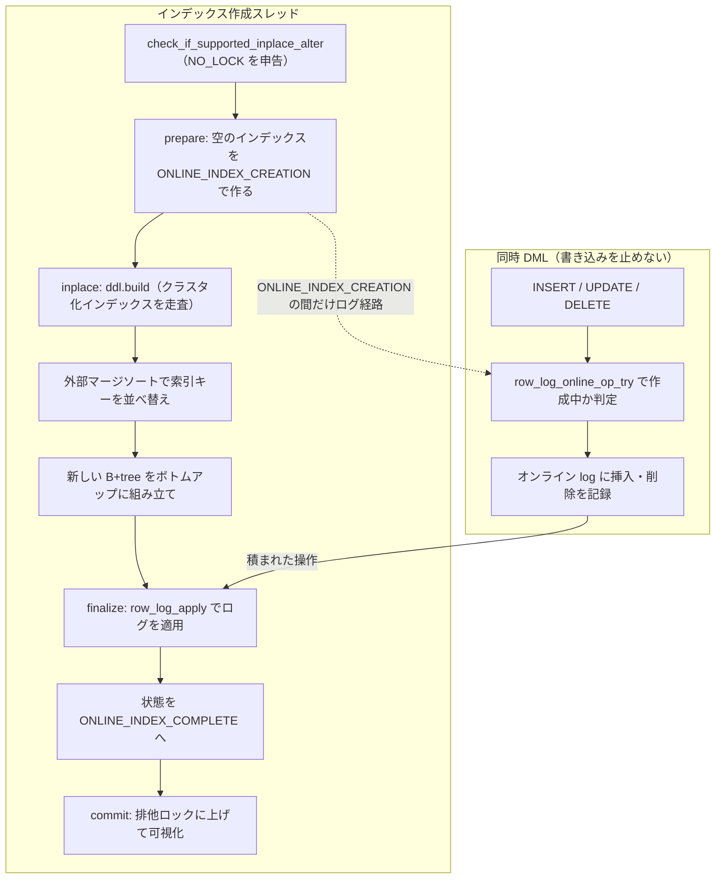

# 第31章 オンライン DDL とインスタント DDL

> **本章で読むソース**
>
> - [`sql/handler.h`](https://github.com/mysql/mysql-server/blob/mysql-8.4.10/sql/handler.h)
> - [`sql/sql_alter.h`](https://github.com/mysql/mysql-server/blob/mysql-8.4.10/sql/sql_alter.h)
> - [`storage/innobase/handler/handler0alter.cc`](https://github.com/mysql/mysql-server/blob/mysql-8.4.10/storage/innobase/handler/handler0alter.cc)
> - [`storage/innobase/dict/dict0inst.cc`](https://github.com/mysql/mysql-server/blob/mysql-8.4.10/storage/innobase/dict/dict0inst.cc)
> - [`storage/innobase/ddl/ddl0builder.cc`](https://github.com/mysql/mysql-server/blob/mysql-8.4.10/storage/innobase/ddl/ddl0builder.cc)
> - [`storage/innobase/row/row0log.cc`](https://github.com/mysql/mysql-server/blob/mysql-8.4.10/storage/innobase/row/row0log.cc)
> - [`storage/innobase/row/row0ins.cc`](https://github.com/mysql/mysql-server/blob/mysql-8.4.10/storage/innobase/row/row0ins.cc)

## この章の狙い

`ALTER TABLE` はテーブルの定義を変える操作である。
素朴に実装すれば、新しい定義で空のテーブルを作り、古いテーブルの全行をコピーし、入れ替える。
このコピー方式は確実だが、コピーの間ずっとテーブルへの書き込みを止めるうえ、行数に比例した時間とディスクを使う。
大きなテーブルでは、この停止時間が運用上の障害になる。

本章では、InnoDB が `ALTER TABLE` をなるべく止めずに実行する仕組みを実装から読む。
押さえる要点は3つある。
第1に、SQL 層とストレージエンジンは、変更可能かどうかを問い合わせてから実行する3段プロトコルでやり取りする。
このプロトコルが、変更ごとに必要なロックの強さをエンジンに申告させ、SQL 層が利用者の要求と突き合わせる。
第2に、インデックス作成のように行を読み直す必要がある変更では、作成中に走る同時 DML を**オンライン log**（行ログ）にためておき、作成の最後にまとめて適用する。
これにより、インデックスを作っている間も書き込みを止めずに済む。
第3に、`ADD COLUMN` のように既存行の物理表現を変えずに済む変更では、データディクショナリのメタデータだけを書き換えて即座に完了する。
これが**インスタント DDL** であり、行を1つも書き換えないため、テーブルの大きさによらず一定時間で終わる。

## 前提

第11章で読んだとおり、SQL 層とストレージエンジンは `handler` クラスの仮想メソッドでやり取りし、SQL 層は `ha_` 接頭辞の公開ラッパーを介して仮想メソッドを呼ぶ。
本章の3段プロトコルも、この公開ラッパーと仮想メソッドの二重化に沿っている。

第17章で読んだとおり、InnoDB のテーブルはクラスタ化インデックスという1本の B+tree であり、行はその葉ページにキー順で並ぶ。
セカンダリインデックスを作るとは、クラスタ化インデックスを走査して索引キーを取り出し、別の B+tree を組み立てることである。
第26章で読んだロックは行レベルの論理ロックだったが、本章で扱う `ALTER TABLE` のロックは、テーブル定義そのものを保護するメタデータロック（MDL）であり、別の階層にある。

## ALTER の3段プロトコル

`ALTER TABLE` のうち、テーブルをまるごとコピーしない経路は、`handler` の4つのメソッドで構成される。
まず変更が可能かを問い合わせる `check_if_supported_inplace_alter`、続いて準備、実行、コミットの3段である。
`sql/handler.h` のモジュールコメントが、この4メソッドを列挙している。

[`sql/handler.h` L4518-L4523](https://github.com/mysql/mysql-server/blob/mysql-8.4.10/sql/handler.h#L4518-L4523)

```cpp
  Methods:
    check_if_supported_inplace_alter()
    prepare_inplace_alter_table()
    inplace_alter_table()
    commit_inplace_alter_table()
    notify_table_changed()
```

最初の `check_if_supported_inplace_alter` は、要求された変更をこのエンジンがコピーなしで実行できるかを判定し、できる場合は必要なロックの強さを戻り値で申告する。
戻り値の型 `enum_alter_inplace_result` が、その申告の語彙を定める。

[`sql/handler.h` L200-L209](https://github.com/mysql/mysql-server/blob/mysql-8.4.10/sql/handler.h#L200-L209)

```cpp
enum enum_alter_inplace_result {
  HA_ALTER_ERROR,
  HA_ALTER_INPLACE_NOT_SUPPORTED,
  HA_ALTER_INPLACE_EXCLUSIVE_LOCK,
  HA_ALTER_INPLACE_SHARED_LOCK_AFTER_PREPARE,
  HA_ALTER_INPLACE_SHARED_LOCK,
  HA_ALTER_INPLACE_NO_LOCK_AFTER_PREPARE,
  HA_ALTER_INPLACE_NO_LOCK,
  HA_ALTER_INPLACE_INSTANT
};
```

`HA_ALTER_INPLACE_NOT_SUPPORTED` はコピー方式しかないことを意味する。
`HA_ALTER_INPLACE_NO_LOCK` は同時の読み書きを許す（オンライン DDL）。
`HA_ALTER_INPLACE_SHARED_LOCK` は同時の読みだけを許す。
`HA_ALTER_INPLACE_EXCLUSIVE_LOCK` は読み書きとも止める。
最後の `HA_ALTER_INPLACE_INSTANT` がインスタント DDL で、準備と実行を何もしない段にし、コミットの段でメタデータだけを変える。

問い合わせのあと、SQL 層は申告されたロックを取り、3つのメソッドを順に呼ぶ。
`handler.h` のフェーズ説明コメントが、各段の役割と、インスタントのときに各段が何もしないことを明記している。

[`sql/handler.h` L6270-L6286](https://github.com/mysql/mysql-server/blob/mysql-8.4.10/sql/handler.h#L6270-L6286)

```cpp
    *) After that we call handler::ha_prepare_inplace_alter_table() to give the
       storage engine a chance to update its internal structures with a higher
       lock level than the one that will be used for the main step of algorithm.
       After that we downgrade the lock if it is necessary.
       This step should be no-op for instant algorithm.
    *) After that, the main step of this phase and algorithm is executed.
       We call the handler::ha_inplace_alter_table() method, which carries out
       the changes requested by ALTER TABLE but does not makes them visible to
       other connections yet.
       This step should be no-op for instant algorithm as well.
    *) We ensure that no other connection uses the table by upgrading our
       lock on it to exclusive.
    *) a) If the previous step succeeds,
    handler::ha_commit_inplace_alter_table() is called to allow the storage
    engine to do any final updates to its structures, to make all earlier
    changes durable and visible to other connections.
    For instant algorithm this is the step during which SE changes are done.
```

`prepare_inplace_alter_table` は、強いロックの下で内部構造を準備する段である。
たとえばオンラインのインデックス作成では、ここで新しいインデックスの空の枠を作る。
`inplace_alter_table` が主処理で、ここでインデックスの中身を組み立てる。
最後に SQL 層がロックを排他に上げてから `commit_inplace_alter_table` を呼び、変更を可視化する。

これらの段の本体は仮想メソッドで、各エンジンが実装する。
基底クラスの既定実装は、いずれも `false`（エラーなし）を返すだけの空実装である。

[`sql/handler.h` L6497-L6504](https://github.com/mysql/mysql-server/blob/mysql-8.4.10/sql/handler.h#L6497-L6504)

```cpp
  virtual bool inplace_alter_table(TABLE *altered_table [[maybe_unused]],
                                   Alter_inplace_info *ha_alter_info
                                   [[maybe_unused]],
                                   const dd::Table *old_table_def
                                   [[maybe_unused]],
                                   dd::Table *new_table_def [[maybe_unused]]) {
    return false;
  }
```

`commit_inplace_alter_table` の宣言につくコメントは、インスタント DDL の実体がここで起きることを述べている。

[`sql/handler.h` L6515-L6515](https://github.com/mysql/mysql-server/blob/mysql-8.4.10/sql/handler.h#L6515-L6515)

```cpp
     @note This is the place where SE changes happen for instant algorithm.
```

3段に分けるのは、ロックの強さを段ごとに変えて停止時間を削るためである。
準備で一瞬だけ強いロックを取り、主処理は弱いロックの下で長く走らせ、可視化の一瞬だけ排他に上げる。
この粒度の制御を可能にするのが、最初の `check_if_supported_inplace_alter` による申告である。

## 利用者が指定する ALGORITHM と LOCK

利用者は `ALTER TABLE ... ALGORITHM=... LOCK=...` で、使ってよいアルゴリズムと許す並行度を明示できる。
パーサはこれを `Alter_info` の2つの列挙体に落とす。
アルゴリズムの選択肢は次のとおりである。

[`sql/sql_alter.h` L355-L367](https://github.com/mysql/mysql-server/blob/mysql-8.4.10/sql/sql_alter.h#L355-L367)

```cpp
  enum enum_alter_table_algorithm {
    // In-place if supported, copy otherwise.
    ALTER_TABLE_ALGORITHM_DEFAULT,

    // In-place if supported, error otherwise.
    ALTER_TABLE_ALGORITHM_INPLACE,

    // Instant if supported, error otherwise.
    ALTER_TABLE_ALGORITHM_INSTANT,

    // Copy if supported, error otherwise.
    ALTER_TABLE_ALGORITHM_COPY
  };
```

`DEFAULT` は、コピーなしでできるならそうし、できなければコピーに落とす。
`INPLACE` や `INSTANT` を明示すると、その方式でできないときはエラーになる。
コメントが示すとおり、`INSTANT` を選んでインスタントが使えなければ実行せずに失敗する。

並行度の選択肢が `LOCK` 句である。

[`sql/sql_alter.h` L373-L385](https://github.com/mysql/mysql-server/blob/mysql-8.4.10/sql/sql_alter.h#L373-L385)

```cpp
  enum enum_alter_table_lock {
    // Maximum supported level of concurrency for the given operation.
    ALTER_TABLE_LOCK_DEFAULT,

    // Allow concurrent reads & writes. If not supported, give error.
    ALTER_TABLE_LOCK_NONE,

    // Allow concurrent reads only. If not supported, give error.
    ALTER_TABLE_LOCK_SHARED,

    // Block reads and writes.
    ALTER_TABLE_LOCK_EXCLUSIVE
  };
```

`LOCK=NONE` は読み書きを止めないことを要求し、`LOCK=SHARED` は読みだけを許し、`LOCK=EXCLUSIVE` は両方を止める。
`LOCK=DEFAULT` は、その操作でエンジンが申告できる最大の並行度に任せる。
利用者の `LOCK` 要求と、`check_if_supported_inplace_alter` がエンジンとして申告したロックの強さが噛み合わないとき、SQL 層はコピー方式に切り替えるか、エラーを返す。
要求と申告という2方向の情報が、ここで突き合わされる。

## インスタント判定、何をインスタントにできるか

InnoDB の `check_if_supported_inplace_alter` は、まず要求された変更がインスタントで済むかを `innobase_support_instant` に判定させ、その結果を `Instant_Type` で受け取る。

[`storage/innobase/handler/handler0alter.cc` L1036-L1044](https://github.com/mysql/mysql-server/blob/mysql-8.4.10/storage/innobase/handler/handler0alter.cc#L1036-L1044)

```cpp
  Instant_Type instant_type = innobase_support_instant(
      ha_alter_info, m_prebuilt->table, this->table, altered_table);

  ha_alter_info->handler_trivial_ctx =
      instant_type_to_int(Instant_Type::INSTANT_IMPOSSIBLE);

  const bool is_instant_requested =
      ha_alter_info->alter_info->requested_algorithm ==
      Alter_info::ALTER_TABLE_ALGORITHM_INSTANT;
```

`Instant_Type` の各値が、インスタントにできる変更の種類を表す。

[`storage/innobase/include/dict0inst.h` L40-L56](https://github.com/mysql/mysql-server/blob/mysql-8.4.10/storage/innobase/include/dict0inst.h#L40-L56)

```cpp
enum class Instant_Type : uint16_t {
  /** Impossible to alter instantly */
  INSTANT_IMPOSSIBLE,

  /** Can be instant without any change */
  INSTANT_NO_CHANGE,

  /** Adding or dropping virtual columns only */
  INSTANT_VIRTUAL_ONLY,

  /** ADD/DROP COLUMN which can be done instantly, including adding/dropping
  stored column only (or along with adding/dropping virtual columns) */
  INSTANT_ADD_DROP_COLUMN,

  /** Column rename */
  INSTANT_COLUMN_RENAME
};
```

カラムのリネーム、仮想カラムだけの増減、そして格納カラムの追加削除がインスタントの対象である。
このうち格納カラムの `ADD`／`DROP` が `INSTANT_ADD_DROP_COLUMN` で、本章の山場にあたる。

判定結果を受けた `check_if_supported_inplace_alter` は、種類ごとに分岐する。
`INSTANT_ADD_DROP_COLUMN` の場合でも、いくつかの条件ではインスタントをやめて INPLACE に落とす。

[`storage/innobase/handler/handler0alter.cc` L1050-L1063](https://github.com/mysql/mysql-server/blob/mysql-8.4.10/storage/innobase/handler/handler0alter.cc#L1050-L1063)

```cpp
      case Instant_Type::INSTANT_ADD_DROP_COLUMN:
        if (ha_alter_info->alter_info->requested_algorithm ==
            Alter_info::ALTER_TABLE_ALGORITHM_INPLACE) {
          /* Still fall back to INPLACE since the behaviour is different */
          break;
        } else if ((ha_alter_info->alter_info->requested_algorithm ==
                    Alter_info::ALTER_TABLE_ALGORITHM_DEFAULT) &&
                   !dict_table_is_discarded(m_prebuilt->table) &&
                   btr_is_index_empty(m_prebuilt->table->first_index())) {
          /* No records: prefer INPLACE to prevent bumping row version */
          break;
        } else if (!((m_prebuilt->table->n_def +
                      get_num_cols_added(ha_alter_info)) <=
                     REC_MAX_N_USER_FIELDS + DATA_N_SYS_COLS)) {
```

利用者が `ALGORITHM=INPLACE` を明示したときや、テーブルが空のとき、カラム数や行バージョンが上限に達したときには、`break` でこの分岐を抜けて INPLACE 経路へ進む。
空のテーブルで INPLACE を選ぶのは、後述する行バージョンを無駄に増やさないためである。
これらの脱出条件をどれも踏まなければ、`fallthrough` して `HA_ALTER_INPLACE_INSTANT` を返す。

[`storage/innobase/handler/handler0alter.cc` L1099-L1104](https://github.com/mysql/mysql-server/blob/mysql-8.4.10/storage/innobase/handler/handler0alter.cc#L1099-L1104)

```cpp
        [[fallthrough]];
      case Instant_Type::INSTANT_NO_CHANGE:
      case Instant_Type::INSTANT_VIRTUAL_ONLY:
      case Instant_Type::INSTANT_COLUMN_RENAME:
        ha_alter_info->handler_trivial_ctx = instant_type_to_int(instant_type);
        return HA_ALTER_INPLACE_INSTANT;
```

この戻り値を受けた SQL 層は、準備と実行の段を何もしないまま素通りさせ、コミットの段だけを実体のある処理にする。

## インスタント DDL、メタデータだけを書き換える

`HA_ALTER_INPLACE_INSTANT` が返ると、準備と実行の段は InnoDB 側でも空回りする。
`inplace_alter_table` の本体は、冒頭で `is_instant` を見て即座に戻る。

[`storage/innobase/handler/handler0alter.cc` L6166-L6169](https://github.com/mysql/mysql-server/blob/mysql-8.4.10/storage/innobase/handler/handler0alter.cc#L6166-L6169)

```cpp
  if (!(ha_alter_info->handler_flags & INNOBASE_ALTER_DATA) ||
      is_instant(ha_alter_info)) {
    return all_ok();
  }
```

実体はコミットの段にある。
`commit_inplace_alter_table` は `is_instant` のときに `Instant_ddl_impl` を組み立て、`commit_instant_ddl` を呼ぶ。

[`storage/innobase/handler/handler0alter.cc` L1629-L1640](https://github.com/mysql/mysql-server/blob/mysql-8.4.10/storage/innobase/handler/handler0alter.cc#L1629-L1640)

```cpp
  if (is_instant(ha_alter_info)) {
    ut_ad(!res);

    Instant_ddl_impl<dd::Table> executor(
        ha_alter_info, m_user_thd, m_prebuilt->trx, m_prebuilt->table, table,
        altered_table, old_dd_tab, new_dd_tab,
        altered_table->found_next_number_field != nullptr
            ? &m_prebuilt->table->autoinc
            : nullptr);

    /* Execute Instant DDL */
    if (executor.commit_instant_ddl()) return true;
```

`commit_instant_ddl` の `INSTANT_ADD_DROP_COLUMN` 分岐が、インスタント DDL の核心である。
ここで行われるのはデータディクショナリの更新だけで、テーブルの行は1つも触らない。

[`storage/innobase/dict/dict0inst.cc` L238-L258](https://github.com/mysql/mysql-server/blob/mysql-8.4.10/storage/innobase/dict/dict0inst.cc#L238-L258)

```cpp
    case Instant_Type::INSTANT_ADD_DROP_COLUMN:
      trx_start_if_not_started(m_trx, true, UT_LOCATION_HERE);
      dd_copy_private(*m_new_dd_tab, *m_old_dd_tab);

      /* Fetch the columns which are to be added or dropped */
      populate_to_be_instant_columns();

      ut_ad(!m_cols_to_add.empty() || !m_cols_to_drop.empty());

      if (!m_cols_to_drop.empty()) {
        /* INSTANT DROP */
        if (commit_instant_drop_col()) return true;
      }

      if (!m_cols_to_add.empty()) {
        /* INSTANT ADD */
        if (commit_instant_add_col()) return true;
      }

      /* Update the current row version in dictionary cache */
      m_dict_table->current_row_version++;
```

追加削除するカラムの集合を求め、削除と追加をディクショナリ上で反映し、最後にテーブルの**行バージョン**（`current_row_version`）を1つ進める。
行バージョンが、この仕組みの要になる。
インスタント `ADD COLUMN` は既存行に新しいカラムのバイト列を書き込まないため、古い行はそのカラムを物理的に持たないまま残る。
あとから古い行を読むとき、InnoDB はその行が作られたときの行バージョンと現在の定義を突き合わせ、欠けているカラムには定義の既定値を補って返す。
行を1つも書き換えないからこそ、この操作はテーブルの大きさによらず一定時間で終わる。

ここがコピー方式やオンライン方式と決定的に違う点である。
コピー方式は全行をコピーし、オンラインのインデックス作成も全行を走査する。
インスタント `ADD COLUMN` はどちらもせず、新しいカラムの存在をメタデータに記録して、読み取り側に解釈を委ねる。

## オンライン DDL、ビルド中の DML を行ログにためる

インデックスの作成は、メタデータの書き換えだけでは済まない。
既存の全行から索引キーを取り出し、新しい B+tree を組み立てる必要がある。
この走査と組み立ての間も書き込みを止めないのが、オンライン DDL である。

実行段の `inplace_alter_table` は、インデックス作成のような実データを伴う変更で `ddl::Context` を組み立て、`build` を呼ぶ。

[`storage/innobase/handler/handler0alter.cc` L6366-L6373](https://github.com/mysql/mysql-server/blob/mysql-8.4.10/storage/innobase/handler/handler0alter.cc#L6366-L6373)

```cpp
  ddl::Context ddl(trx, m_prebuilt->table, ctx->new_table, ctx->online,
                   ctx->add_index, ctx->add_key_numbers, ctx->num_to_add_index,
                   altered_table, ctx->add_cols, ctx->col_map, ctx->add_autoinc,
                   ctx->sequence, ctx->skip_pk_sort, ctx->m_stage, add_v,
                   eval_table, thd_ddl_buffer_size(m_prebuilt->trx->mysql_thd),
                   thd_ddl_threads(m_prebuilt->trx->mysql_thd));

  const auto err = clean_up(ddl.build());
```

`build` は、クラスタ化インデックスを走査して索引キーを取り出し、外部マージソートで並べ替え、新しい B+tree をボトムアップに組み立てる。
このソートビルドが、行を1つずつ B+tree に挿入するより速い理由は、ソート済みのキーを葉ページへ順番に詰めるため、ページ分割やランダムなページアクセスを避けられるからである。

組み立てている間、作成中のインデックスは「作成中」の状態に置かれる。
インデックスのオンライン状態を表す列挙体が、その遷移を定める。

[`storage/innobase/include/dict0mem.h` L1638-L1643](https://github.com/mysql/mysql-server/blob/mysql-8.4.10/storage/innobase/include/dict0mem.h#L1638-L1643)

```cpp
enum online_index_status {
  /** the index is complete and ready for access */
  ONLINE_INDEX_COMPLETE = 0,
  /** the index is being created, online
  (allowing concurrent modifications) */
  ONLINE_INDEX_CREATION,
```

`ONLINE_INDEX_CREATION` の間に走る DML は、まだ完成していないインデックスに直接挿入できない。
そこで、その変更をオンライン log に書きとめる。
セカンダリインデックスへの挿入を担う `row_ins_sec_index_entry_low` は、インデックスがオンライン作成中なら、本体への挿入の代わりにログ書き込みを試みる。

[`storage/innobase/row/row0ins.cc` L2896-L2898](https://github.com/mysql/mysql-server/blob/mysql-8.4.10/storage/innobase/row/row0ins.cc#L2896-L2898)

```cpp
    if (row_log_online_op_try(index, entry, thr_get_trx(thr)->id)) {
      goto func_exit;
    }
```

ログに記録する本体が `row_log_online_op` である。
挿入と削除を、作成中のインデックスに向けて記録する。

[`storage/innobase/row/row0log.cc` L278-L284](https://github.com/mysql/mysql-server/blob/mysql-8.4.10/storage/innobase/row/row0log.cc#L278-L284)

```cpp
/** Logs an operation to a secondary index that is (or was) being created. */
void row_log_online_op(
    dict_index_t *index,   /*!< in/out: index, S or X latched */
    const dtuple_t *tuple, /*!< in: index tuple */
    trx_id_t trx_id)       /*!< in: transaction ID for insert,
                           or 0 for delete */
{
```

走査とソートビルドが終わると、ためておいたオンライン log をインデックスに適用する。
ビルドの最終段 `Builder::finalize` が、redo を書いたあと `row_log_apply` を呼ぶ。

[`storage/innobase/ddl/ddl0builder.cc` L1994-L2002](https://github.com/mysql/mysql-server/blob/mysql-8.4.10/storage/innobase/ddl/ddl0builder.cc#L1994-L2002)

```cpp
  if (err == DB_SUCCESS) {
    write_redo(m_index);

    DEBUG_SYNC(m_ctx.thd(), "row_log_apply_before");

    err = row_log_apply(m_ctx.m_trx, m_index, m_ctx.m_table, m_local_stage);

    DEBUG_SYNC(m_ctx.thd(), "row_log_apply_after");
  }
```

`row_log_apply` は、ためておいた操作を順に再生してインデックスへ反映し、最後にインデックスの状態を `ONLINE_INDEX_COMPLETE` に進める。

[`storage/innobase/row/row0log.cc` L3801-L3808](https://github.com/mysql/mysql-server/blob/mysql-8.4.10/storage/innobase/row/row0log.cc#L3801-L3808)

```cpp
dberr_t row_log_apply(const trx_t *trx, dict_index_t *index,
                      struct TABLE *table, Alter_stage *stage) {
  dberr_t error;
  row_log_t *log;
  ddl::Dup dup = {index, table, nullptr, 0};
  DBUG_TRACE;

  ut_ad(dict_index_is_online_ddl(index));
```

走査の開始からログ適用までの間、テーブルへの書き込みは止まらない。
この間に入った変更はログに積まれ、適用フェーズで取り込まれる。
適用の終盤でだけ短く同期を取れば、ビルド中に積まれた分と適用中に積まれた分の境目を整合させられる。

オンライン log がもたらす停止時間の削減を、機構として一言でまとめる。
全行を読む重い処理（走査とソートビルド）を、書き込みを止めない弱いロックの下で長く走らせ、止める必要のある可視化だけを最後の一瞬に押し込む。
DML を捨てずにログへ退避し、最後にまとめて適用するからこそ、この「重い処理を止めずに走らせる」が成り立つ。

## オンライン DDL の流れ

オンラインのセカンダリインデックス作成で、ビルドと同時 DML がどう噛み合うかを図にする。
左の縦列がインデックスを作るスレッド、右の縦列が同じテーブルへ書き込む同時 DML である。



図の破線が、インデックスが作成中である間だけ DML がログ経路を通ることを示す。
実線の縦の流れがビルドの進行で、右の DML が積んだログを最後の `finalize` が回収する。

## まとめ

InnoDB の `ALTER TABLE` は、コピー方式のほかに、コピーなしの3段プロトコルを持つ。
`check_if_supported_inplace_alter` が変更可能かを判定して必要なロックの強さを申告し、`prepare`、`inplace`、`commit` の3段が、段ごとにロックの強さを変えながら実行する。
利用者の `ALGORITHM` と `LOCK` の要求は、このエンジン側の申告と突き合わされる。

インスタント DDL は、`ADD COLUMN` などをデータディクショナリの書き換えだけで済ませる。
既存行を触らず、行バージョンを進めて、古い行は読み取り時に既定値を補って解釈する。
行を1つも書き換えないため、テーブルの大きさによらず一定時間で完了する。

オンライン DDL は、インデックス作成のように全行を読む必要がある変更を、書き込みを止めずに実行する。
作成中のインデックスに走る DML をオンライン log にためておき、走査とソートビルドが終わったあとに `row_log_apply` でまとめて適用する。
重い走査を弱いロックの下で長く走らせ、止める必要のある可視化だけを最後の一瞬に押し込むことで、停止時間を削る。

## 関連する章

- [第11章 ハンドラ API とストレージエンジンプラグイン](../part01-sql-layer/11-handler-api.md)：公開ラッパーと仮想メソッドの二重化、本章の3段プロトコルの土台。
- [第17章 B+tree インデックス](../part03-index-row/17-btree-index.md)：オンライン作成が組み立てる B+tree の構造。
- [第19章 行の挿入、更新、削除](../part03-index-row/19-row-dml.md)：作成中インデックスへの DML がオンライン log へ退避する箇所。
- [第26章 ロック](../part04-transaction-concurrency/26-locking.md)：行レベルロックと、本章のメタデータロックの違い。
