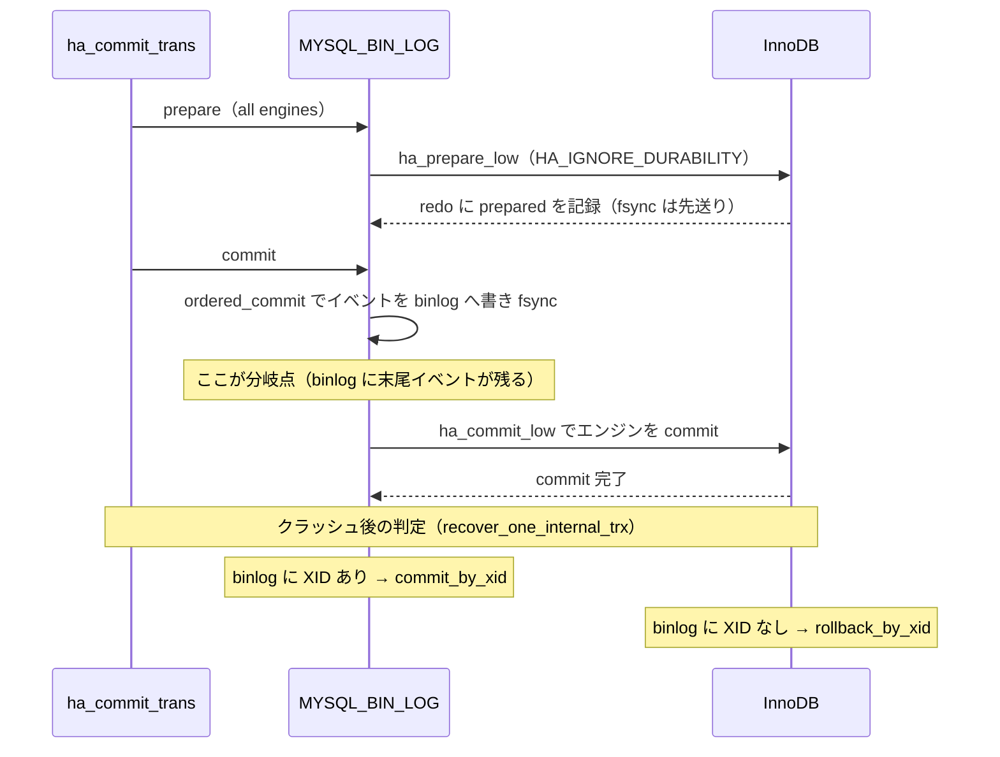
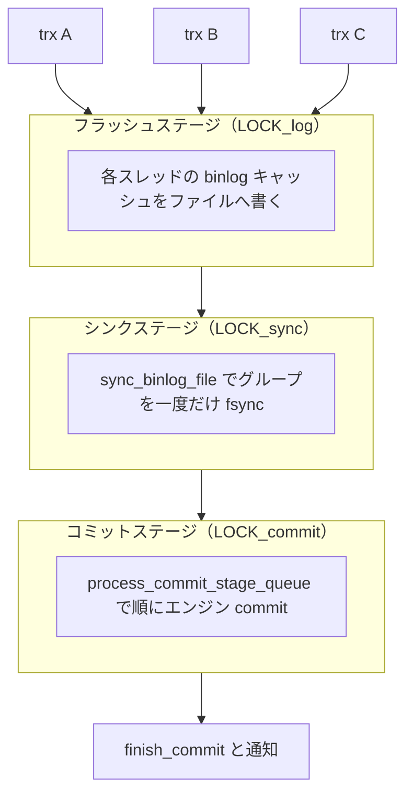
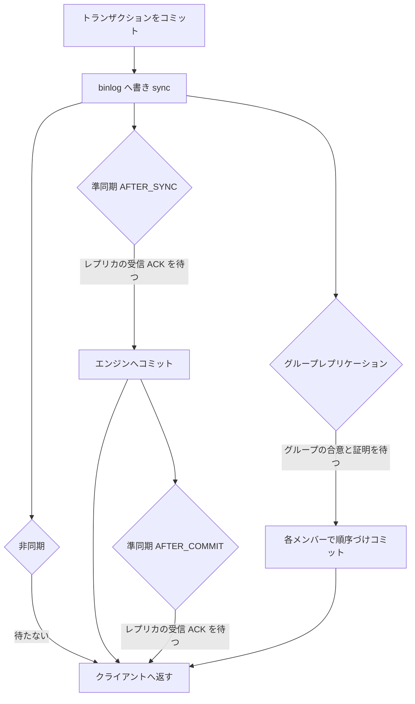

# 第32章 バイナリログとレプリケーション

> **本章で読むソース**
>
> - [`sql/binlog.cc`](https://github.com/mysql/mysql-server/blob/mysql-8.4.10/sql/binlog.cc)
> - [`sql/handler.cc`](https://github.com/mysql/mysql-server/blob/mysql-8.4.10/sql/handler.cc)
> - [`sql/binlog/recovery.cc`](https://github.com/mysql/mysql-server/blob/mysql-8.4.10/sql/binlog/recovery.cc)
> - [`sql/xa/recovery.cc`](https://github.com/mysql/mysql-server/blob/mysql-8.4.10/sql/xa/recovery.cc)
> - [`sql/rpl_source.cc`](https://github.com/mysql/mysql-server/blob/mysql-8.4.10/sql/rpl_source.cc)
> - [`sql/rpl_replica.cc`](https://github.com/mysql/mysql-server/blob/mysql-8.4.10/sql/rpl_replica.cc)
> - [`plugin/semisync/semisync_source_plugin.cc`](https://github.com/mysql/mysql-server/blob/mysql-8.4.10/plugin/semisync/semisync_source_plugin.cc)
> - [`plugin/semisync/semisync_source.cc`](https://github.com/mysql/mysql-server/blob/mysql-8.4.10/plugin/semisync/semisync_source.cc)

## この章の狙い

**バイナリログ**（binlog）は、サーバが実行した変更を順序付きで記録するサーバ層のログである。
InnoDB の redo ログがストレージエンジンの内部状態を物理的に復元するためのログだったのに対し、binlog は変更を論理的に記録し、レプリケーションとポイントインタイムリカバリを支える。
binlog はサーバ層が持つログなので、InnoDB の commit とは独立に書かれる。
この独立性は、放っておけば「binlog には書いたがエンジンには反映されていない」あるいはその逆という不整合を生む。

本章は三つの問いに答える。
第一に、binlog はどの単位で何を記録するのか。
第二に、サーバ層の binlog 書き込みと InnoDB の commit を、クラッシュをまたいでどう原子的にそろえるのか（XA 2相コミット）。
第三に、多数のトランザクションが同時にコミットするとき、fsync の回数をどう束ねて性能を保つのか（グループコミット）。
最後に、記録した binlog をレプリカがどう受けて適用するかを概観する。

## 前提

第23章「トランザクション管理」で `ha_commit_trans` を入口とするコミット経路を、第27章「redo ログ」で InnoDB の redo によるクラッシュリカバリを扱った。
本章はその上に、サーバ層のログである binlog と、サーバ層とエンジンを束ねる2相コミットを重ねる。
`handler` を通したストレージエンジンの抽象（第11章）と、ミニトランザクション（第16章）の用語を前提とする。

## バイナリログが記録する単位

binlog に書かれるイベントには三つの形式がある。
`binlog_format` が選ぶこの三値は、`enum_binlog_format` として定義されている。

[`sql/system_variables.h L45-L51`](https://github.com/mysql/mysql-server/blob/mysql-8.4.10/sql/system_variables.h#L45-L51)

```cpp
// Values for binlog_format sysvar
enum enum_binlog_format {
  BINLOG_FORMAT_MIXED = 0,  ///< statement if safe, otherwise row - autodetected
  BINLOG_FORMAT_STMT = 1,   ///< statement-based
  BINLOG_FORMAT_ROW = 2,    ///< row-based
  BINLOG_FORMAT_UNSPEC =
      3  ///< thd_binlog_format() returns it when binlog is closed
```

`STATEMENT` は実行した SQL 文をそのまま記録する。
`ROW` は変更された行のイメージ（前像と後像）を記録する。
`MIXED` は通常は文ベースで記録し、結果が再実行で一意に定まらない文（非決定的な関数を含むなど）に限って行ベースへ自動的に切り替える。
MySQL 8.4 の既定は `ROW` であり、再実行しても同じ結果を保証しやすいことから、レプリケーションの安全性ではこれが基準になる。

binlog ファイルそのものを管理するのが `MYSQL_BIN_LOG` クラスである。
このクラスは、サーバ層とエンジンのコミットを束ねる調整役である `TC_LOG` を継承する。

[`sql/binlog.h L139`](https://github.com/mysql/mysql-server/blob/mysql-8.4.10/sql/binlog.h#L139)

```cpp
class MYSQL_BIN_LOG : public TC_LOG {
```

`TC_LOG` の `prepare` と `commit` を `MYSQL_BIN_LOG` が実装することで、binlog がトランザクションコーディネータの役割を担う。
次節の2相コミットは、この継承関係の上に成り立つ。

## InnoDB との XA 2相コミット

トランザクションのコミットは `ha_commit_trans` から始まる。
この関数は、まず登録済みのストレージエンジンに対して `prepare` を要求する。

[`sql/handler.cc L1792-L1793`](https://github.com/mysql/mysql-server/blob/mysql-8.4.10/sql/handler.cc#L1792-L1793)

```cpp
    if (!trn_ctx->no_2pc(trx_scope) && (trn_ctx->rw_ha_count(trx_scope) > 1))
      error = tc_log->prepare(thd, all);
```

`tc_log` はサーバ起動時に `MYSQL_BIN_LOG` のインスタンスへ束ねられる。
したがって `tc_log->prepare` は `MYSQL_BIN_LOG::prepare` を呼び、その中で各エンジンの `prepare` を起動する。

[`sql/binlog.cc L8083-L8108`](https://github.com/mysql/mysql-server/blob/mysql-8.4.10/sql/binlog.cc#L8083-L8108)

```cpp
int MYSQL_BIN_LOG::prepare(THD *thd, bool all) {
  DBUG_TRACE;

  assert(opt_bin_log);

  /*
    Set HA_IGNORE_DURABILITY to not flush the prepared record of the
    transaction to the log of storage engine (for example, InnoDB
    redo log) during the prepare phase. So that we can flush prepared
    records of transactions to the log of storage engine in a group
    right before flushing them to binary log during binlog group
    commit flush stage. Reset to HA_REGULAR_DURABILITY at the
    beginning of parsing next command.
  */
  thd->durability_property = HA_IGNORE_DURABILITY;

  CONDITIONAL_SYNC_POINT_FOR_TIMESTAMP("before_prepare_in_engines");
  int error = ha_prepare_low(thd, all);

  CONDITIONAL_SYNC_POINT_FOR_TIMESTAMP("after_ha_prepare_low");
  // Invoke `commit` if we're dealing with `XA PREPARE` in order to use BCG
  // to write the event to file.
  if (!error && all && is_xa_prepare(thd)) return this->commit(thd, true);

  return error;
}
```

ここで `prepare` は `durability_property` を `HA_IGNORE_DURABILITY` に設定してから `ha_prepare_low` を呼ぶ。
これは「prepare の時点では InnoDB の redo を個別に fsync しない」という指示である。
InnoDB は prepare 状態を redo に書くものの、その永続化は後段のグループコミットのフラッシュステージへ先送りされる。
冒頭のコメントが述べるとおり、複数トランザクションの prepared レコードをまとめてフラッシュするための布石である。

prepare が成功すると、`ha_commit_trans` は同じ `tc_log` の `commit` を呼ぶ。

[`sql/handler.cc L1808-L1812`](https://github.com/mysql/mysql-server/blob/mysql-8.4.10/sql/handler.cc#L1808-L1812)

```cpp
  if (error || (error = tc_log->commit(thd, all))) {
    ha_rollback_trans(thd, all);
    error = 1;
    goto end;
  }
```

`MYSQL_BIN_LOG::commit` の役割は、コメントが三つに分けて述べている。

[`sql/binlog.cc L8119-L8135`](https://github.com/mysql/mysql-server/blob/mysql-8.4.10/sql/binlog.cc#L8119-L8135)

```cpp
  For binary log group commit, the commit is separated into three
  parts:

  1. First part consists of filling the necessary caches and
     finalizing them (if they need to be finalized). After this,
     nothing is added to any of the caches.

  2. Second part execute an ordered flush and commit. This will be
     done using the group commit functionality in ordered_commit.

  3. Third part checks any errors resulting from the ordered commit
     and handles them appropriately.

  @retval RESULT_SUCCESS   success
  @retval RESULT_ABORTED   error, transaction was neither logged nor committed
  @retval RESULT_INCONSISTENT  error, transaction was logged but not committed
*/
```

第1部でトランザクションのイベントをスレッドローカルのキャッシュへ詰め、末尾に `Xid_log_event`（または `COMMIT` の `Query_log_event`）を置いて確定する。
第2部の `ordered_commit` がそのキャッシュを binlog ファイルへ書き、fsync し、エンジンを commit する。
戻り値の三値が、2相コミットの整合性の核心を表している。
`RESULT_ABORTED` は「binlog にも書かれず、エンジンも commit していない」状態で、安全にロールバックできる。
`RESULT_INCONSISTENT` は「binlog には書いたが、エンジンの commit に失敗した」状態で、復旧時に手当てが要る。

順序を言葉でまとめると、エンジンを prepared にする、binlog へ書く、エンジンを commit する、の三手である。
binlog への書き込みが、コミットするかどうかの分岐点になる。
binlog に当該トランザクションの末尾イベントが残れば、それは「コミットすると決めた」印になる。

### クラッシュ後の整合

この分岐点があるおかげで、クラッシュリカバリは binlog を真実の源として使える。
binlog が正常に閉じられていなければクラッシュとみなし、`Binlog_recovery::recover` が binlog を走査して、prepared のまま残ったトランザクションの XID を集める。

[`sql/binlog/recovery.cc L53-L63`](https://github.com/mysql/mysql-server/blob/mysql-8.4.10/sql/binlog/recovery.cc#L53-L63)

```cpp
binlog::Binlog_recovery &binlog::Binlog_recovery::recover() {
  process_logs(m_reader);
  if (!this->is_log_malformed() && total_ha_2pc > 1) {
    Xa_state_list xa_list{this->m_external_xids};
    this->m_no_engine_recovery = ha_recover(&this->m_internal_xids, &xa_list);
    if (this->m_no_engine_recovery) {
      this->m_failure_message.assign("Recovery failed in storage engines");
    }
  }
  return (*this);
}
```

`process_logs` が binlog を読み、内部 XID の集合 `m_internal_xids` を作る。
これが「binlog に末尾イベントまで書かれたトランザクション」の一覧である。
続く `ha_recover` が、エンジン側で prepared のまま残っている各トランザクションについて、この一覧を照合して決着をつける。
照合の本体は、エンジンの prepared XID を一つずつ処理する次の関数にある。

[`sql/xa/recovery.cc L242-L275`](https://github.com/mysql/mysql-server/blob/mysql-8.4.10/sql/xa/recovery.cc#L242-L275)

```cpp
void recover_one_internal_trx(xarecover_st const &info, handlerton &ht,
                              XA_recover_txn const &xa_trx, my_xid xid,
                              ::recovery_statistics &stats) {
  if (info.commit_list ? info.commit_list->count(xid) != 0
                       : tc_heuristic_recover == TC_HEURISTIC_RECOVER_COMMIT) {
    enum xa_status_code exec_status;
    if (DBUG_EVALUATE_IF("xa_recovery_error_reporting", true, false))
      exec_status = ::generate_xa_recovery_error();
    else
      exec_status = ht.commit_by_xid(&ht, const_cast<XID *>(&xa_trx.id));

    if (exec_status == XA_OK)
      ::add_to_stats<STATS_SUCCESS, STATS_COMMITTED>(stats);
    else {
      ::add_to_stats<STATS_FAILURE, STATS_COMMITTED>(stats);
      ::report_trx_recovery_error(ER_BINLOG_CRASH_RECOVERY_COMMIT_FAILED, xid,
                                  ht, exec_status);
    }
  } else {
    enum xa_status_code exec_status;
    if (DBUG_EVALUATE_IF("xa_recovery_error_reporting", true, false))
      exec_status = ::generate_xa_recovery_error();
    else
      exec_status = ht.rollback_by_xid(&ht, const_cast<XID *>(&xa_trx.id));

    if (exec_status == XA_OK)
      ::add_to_stats<STATS_SUCCESS, STATS_ROLLEDBACK>(stats);
    else {
      ::add_to_stats<STATS_FAILURE, STATS_ROLLEDBACK>(stats);
      ::report_trx_recovery_error(ER_BINLOG_CRASH_RECOVERY_ROLLBACK_FAILED, xid,
                                  ht, exec_status);
    }
  }
}
```

`info.commit_list` が binlog から集めた XID の集合である。
prepared の XID がこの集合にあれば `commit_by_xid` で前進コミットし、なければ `rollback_by_xid` でロールバックする。
規則を一文で言えば、binlog に末尾イベントがあれば commit、なければ rollback である。
binlog の書き込みがコミットの可否を決めるという第2部の分岐点が、クラッシュをまたいでもそのまま判定基準として効く。

下図は、prepare から commit までの三手と、クラッシュ後の判定がどこで分かれるかを示す。



## グループコミットの3ステージ

多数のトランザクションが同時にコミットするとき、各々が個別に binlog を fsync すると、ディスクへの同期回数が増えてスループットが落ちる。
`MYSQL_BIN_LOG::ordered_commit` は、コミット処理を**フラッシュ**、**シンク**、**コミット**の三つのステージに分け、各ステージで複数トランザクションを一つの待ち行列へ束ねることでこれを避ける。

ステージへの参加は `change_stage` を通して行う。
各スレッドは自分のステージのキューへ並び、キューが空だったスレッドがそのステージの**リーダー**になる。

[`sql/rpl_commit_stage_manager.cc L238-L255`](https://github.com/mysql/mysql-server/blob/mysql-8.4.10/sql/rpl_commit_stage_manager.cc#L238-L255)

```cpp
bool Commit_stage_manager::enroll_for(StageID stage, THD *thd,
                                      mysql_mutex_t *stage_mutex,
                                      mysql_mutex_t *enter_mutex) {
  DBUG_TRACE;

  // If the queue was empty: we're the leader for this batch
  DBUG_PRINT("debug",
             ("Enqueue 0x%llx to queue for stage %d", (ulonglong)thd, stage));

  thd->rpl_thd_ctx.binlog_group_commit_ctx().assign_ticket();
  bool leader = this->append_to(stage, thd);

  /*
   if its FLUSH stage queue (BINLOG_FLUSH_STAGE or COMMIT_ORDER_FLUSH_STAGE)
   and not empty then this thread should not become leader as other queue
   already has leader. The leader acquires enter_mutex.
  */
  if (leader) {
```

リーダーは次のステージのミューテックスを取得し、キューに並んだ全スレッド（**フォロワー**）の作業を代表して一括処理する。
フォロワーは自分でフラッシュや fsync をせず、リーダーの完了通知を待つ。
これがグループコミットの肝で、待ち行列に並んだ N 個のトランザクションを1人のリーダーがまとめて処理することで、特にフラッシュとシンクの回数が N 回から1回へ縮む。

`ordered_commit` の三ステージを順に見る。
第1ステージのフラッシュは、リーダーがキュー上の各スレッドの binlog キャッシュをファイルへ書き出す。

[`sql/binlog.cc L8967-L8993`](https://github.com/mysql/mysql-server/blob/mysql-8.4.10/sql/binlog.cc#L8967-L8993)

```cpp
  if (change_stage(thd, Commit_stage_manager::BINLOG_FLUSH_STAGE, thd, nullptr,
                   &LOCK_log)) {
    DBUG_PRINT("return", ("Thread ID: %u, commit_error: %d", thd->thread_id(),
                          thd->commit_error));
    return finish_commit(thd);
  }

  THD *wait_queue = nullptr, *final_queue = nullptr;
  mysql_mutex_t *leave_mutex_before_commit_stage = nullptr;
  my_off_t flush_end_pos = 0;
  bool update_binlog_end_pos_after_sync;
  if (unlikely(!is_open())) {
    final_queue = fetch_and_process_flush_stage_queue(true);
    leave_mutex_before_commit_stage = &LOCK_log;
    /*
      binary log is closed, flush stage and sync stage should be
      ignored. Binlog cache should be cleared, but instead of doing
      it here, do that work in 'finish_commit' function so that
      leader and followers thread caches will be cleared.
    */
    goto commit_stage;
  }
  DEBUG_SYNC(thd, "waiting_in_the_middle_of_flush_stage");
  flush_error = process_flush_stage_queue(&total_bytes, &wait_queue);

  if (flush_error == 0 && total_bytes > 0)
    flush_error = flush_cache_to_file(&flush_end_pos);
```

`process_flush_stage_queue` がキューの全スレッドをたどり、それぞれのキャッシュをフラッシュする。
ループの一巡で、グループ全体のイベントが OS のファイルバッファへ移る。

[`sql/binlog.cc L8535-L8544`](https://github.com/mysql/mysql-server/blob/mysql-8.4.10/sql/binlog.cc#L8535-L8544)

```cpp
  /* Flush thread caches to binary log. */
  for (THD *head = first_seen; head; head = head->next_to_commit) {
    Thd_backup_and_restore switch_thd(current_thd, head);
    const auto [error, flushed_bytes] = flush_thread_caches(head);
    total_bytes += flushed_bytes;
    if (flush_error == 1) flush_error = error;
#ifndef NDEBUG
    no_flushes++;
#endif
  }
```

第2ステージのシンクは、`sync_binlog_file` で binlog ファイルを fsync する。
グループ全体で `total_bytes > 0` のときに一度だけ呼ばれる点が、回数を束ねる効果の本体である。

[`sql/binlog.cc L9035-L9062`](https://github.com/mysql/mysql-server/blob/mysql-8.4.10/sql/binlog.cc#L9035-L9062)

```cpp
  if (change_stage(thd, Commit_stage_manager::SYNC_STAGE, wait_queue, &LOCK_log,
                   &LOCK_sync)) {
    DBUG_PRINT("return", ("Thread ID: %u, commit_error: %d", thd->thread_id(),
                          thd->commit_error));
    return finish_commit(thd);
  }

  /*
    Shall introduce a delay only if it is going to do sync
    in this ongoing SYNC stage. The "+1" used below in the
    if condition is to count the ongoing sync stage.
    When sync_binlog=0 (where we never do sync in BGC group),
    it is considered as a special case and delay will be executed
    for every group just like how it is done when sync_binlog= 1.
  */
  if (!flush_error && (sync_counter + 1 >= get_sync_period()))
    Commit_stage_manager::get_instance().wait_count_or_timeout(
        opt_binlog_group_commit_sync_no_delay_count,
        opt_binlog_group_commit_sync_delay, Commit_stage_manager::SYNC_STAGE);

  final_queue = Commit_stage_manager::get_instance().fetch_queue_acquire_lock(
      Commit_stage_manager::SYNC_STAGE);

  if (flush_error == 0 && total_bytes > 0) {
    DEBUG_SYNC(thd, "before_sync_binlog_file");
    std::pair<bool, bool> result = sync_binlog_file(false);
    sync_error = result.first;
  }
```

シンクステージには意図的な遅延の仕掛けもある。
`binlog_group_commit_sync_delay` の分だけ待つことで、待っている間に後続のトランザクションがキューへ加わり、一度の fsync でまとめられる数を増やせる。
レイテンシをわずかに犠牲にして、グループあたりの効率を上げる調整つまみである。

第3ステージのコミットは、リーダーが `process_commit_stage_queue` でキューの各トランザクションをエンジンへコミットする。

[`sql/binlog.cc L9105-L9135`](https://github.com/mysql/mysql-server/blob/mysql-8.4.10/sql/binlog.cc#L9105-L9135)

```cpp
    if (change_stage(thd, Commit_stage_manager::COMMIT_STAGE, final_queue,
                     leave_mutex_before_commit_stage, &LOCK_commit)) {
      DBUG_PRINT("return", ("Thread ID: %u, commit_error: %d", thd->thread_id(),
                            thd->commit_error));
      return finish_commit(thd);
    }
    THD *commit_queue =
        Commit_stage_manager::get_instance().fetch_queue_acquire_lock(
            Commit_stage_manager::COMMIT_STAGE);
    DBUG_EXECUTE_IF("semi_sync_3-way_deadlock",
                    DEBUG_SYNC(thd, "before_process_commit_stage_queue"););

    if (flush_error == 0 && sync_error == 0)
      sync_error = call_after_sync_hook(commit_queue);

    /*
      process_commit_stage_queue will call update_on_commit or
      update_on_rollback for the GTID owned by each thd in the queue.

      This will be done this way to guarantee that GTIDs are added to
      gtid_executed in order, to avoid creating unnecessary temporary
      gaps and keep gtid_executed as a single interval at all times.

      If we allow each thread to call update_on_commit only when they
      are at finish_commit, the GTID order cannot be guaranteed and
      temporary gaps may appear in gtid_executed. When this happen,
      the server would have to add and remove intervals from the
      Gtid_set, and adding and removing intervals requires a mutex,
      which would reduce performance.
    */
    process_commit_stage_queue(thd, commit_queue);
```

コミットステージをリーダーが順序どおりに代行する理由は、コメントが GTID の管理コストとして説明している。
binlog に書いた順とエンジンへ commit する順をそろえれば、`gtid_executed` が単一の連続区間のまま保たれる。
各スレッドがばらばらに commit すると区間に一時的な隙間ができ、その出し入れにミューテックスを要して性能が落ちる。
つまり、コミット順序の保存は単なる見た目の整列ではなく、GTID 集合をひとつながりに保つための仕掛けである。

下図は、三ステージで待ち行列がどう束ねられ、どこで fsync が一度に縮むかを示す。



## レプリケーション概観

binlog は、レプリケーションの転送単位でもある。
プライマリで確定した binlog をレプリカが受け取り、自分のデータに適用することで複製が成り立つ。

レプリカが接続すると、プライマリ側では**ダンプスレッド**が起動する。
ダンプスレッドは、レプリカが要求した位置から binlog のイベントを読み、ネットワークへ送り続ける。
その本体は `Binlog_sender` で、`mysql_binlog_send` がそれを生成して走らせる。

[`sql/rpl_source.cc L1043-L1048`](https://github.com/mysql/mysql-server/blob/mysql-8.4.10/sql/rpl_source.cc#L1043-L1048)

```cpp
void mysql_binlog_send(THD *thd, char *log_ident, my_off_t pos,
                       Gtid_set *slave_gtid_executed, uint32 flags) {
  Binlog_sender sender(thd, log_ident, pos, slave_gtid_executed, flags);

  sender.run();
}
```

レプリカ側には二つのスレッドがある。
**I/Oスレッド**がダンプスレッドからイベントを受け取り、ローカルのリレーログへ書く。
**SQLスレッド**がリレーログを読んでイベントを適用する。
受信と適用を分けることで、ネットワークの遅延と適用の遅延が互いに干渉しにくくなる。
I/Oスレッドは `handle_slave_io` を入口として起動される。

[`sql/rpl_replica.cc L2112-L2115`](https://github.com/mysql/mysql-server/blob/mysql-8.4.10/sql/rpl_replica.cc#L2112-L2115)

```cpp
  if (thread_mask & REPLICA_IO)
    is_error = start_slave_thread(key_thread_replica_io, handle_slave_io,
                                  lock_io, lock_cond_io, cond_io,
                                  &mi->slave_running, &mi->slave_run_id, mi);
```

SQLスレッドは `handle_slave_sql` を入口として起動される。

[`sql/rpl_replica.cc L2139-L2142`](https://github.com/mysql/mysql-server/blob/mysql-8.4.10/sql/rpl_replica.cc#L2139-L2142)

```cpp
    if (!is_error)
      is_error = start_slave_thread(
          key_thread_replica_sql, handle_slave_sql, lock_sql, lock_cond_sql,
          cond_sql, &mi->rli->slave_running, &mi->rli->slave_run_id, mi);
```

トランザクションを一意に識別する仕組みが **GTID**（global transaction identifier）である。
GTID は各トランザクションへ世界で一意な識別子を与え、レプリカが「どこまで適用済みか」を位置ではなく集合（`gtid_executed`）として把握できるようにする。
前節で `ordered_commit` がコミット順を保ってこの集合を連続区間に保とうとしていたのは、レプリカが自動で続きの位置を決められるようにするためでもある。

## レプリケーションの方式、非同期と準同期と同期

前節までのダンプスレッドとI/OスレッドとSQLスレッドの連携は、プライマリがレプリカの受信を待たずにコミットを返す**非同期レプリケーション**を前提にしていた。
プライマリがどこまでレプリカを待つかという一点を変えると、レプリケーションは非同期、準同期、同期という三つの方式に分かれる。
この節は、待つ場所の違いに注目して三方式を対比する。

### 非同期レプリケーション（既定）

非同期は MySQL の既定の方式である。
プライマリは binlog を書いてコミットを確定し、その変更がレプリカへ届いたかどうかを確認しない。
ダンプスレッドはコミットとは独立に動き、レプリカが要求した位置からイベントを送り続けるだけである。
プライマリの応答はレプリカの状態に左右されないので、コミットのレイテンシは低く保たれ、レプリカが停止したり遅れたりしてもプライマリの処理は止まらない。
その代わり、レプリカがどこまで追いついているかはプライマリが関知しないため、**レプリカ遅延**が生じうる。
さらに、コミット済みだがまだ送信していないトランザクションを抱えたままプライマリが障害で失われると、そのトランザクションはレプリカに残らず失われうる。

### 準同期レプリケーション（semisync プラグイン）

準同期は、非同期とのこの隙間を埋めるために `rpl_semi_sync_source` プラグインが提供する方式である。
プライマリは、トランザクションのイベントを少なくとも `rpl_semi_sync_source_wait_for_replica_count` 台のレプリカが受信してリレーログへ書いたという ACK を受け取るまで、クライアントへ結果を返すのを待つ。
この待機台数の既定値は1である。

[`plugin/semisync/semisync_source_plugin.cc L328-L338`](https://github.com/mysql/mysql-server/blob/mysql-8.4.10/plugin/semisync/semisync_source_plugin.cc#L328-L338)

```cpp
#define DEFINE_WAIT_FOR_REPLICA_COUNT(NAME)                             \
  static MYSQL_SYSVAR_UINT(                                             \
      NAME,                                        /* name  */          \
      rpl_semi_sync_source_wait_for_replica_count, /* var   */          \
      PLUGIN_VAR_OPCMDARG,                         /* flags */          \
      "The number of replicas that need to acknowledge that they have " \
      "received a transaction, before the transaction can complete on " \
      "the source.",                                                    \
      nullptr /* check */,                                              \
      &fix_rpl_semi_sync_source_wait_for_replica_count, /* update */    \
      1, 1, 65535, 1);
```

プラグインはサーバが用意したフックへ自分の処理を差し込むことで動く。
イベント送信の直前に呼ばれる `updateSyncHeader` が、ACK を求めるイベントのヘッダに印を付ける。
印を付けるのはトランザクションの末尾イベントだけで、`is_tranx_end_pos` でそれを判定してから `sync` を立てる。

[`plugin/semisync/semisync_source.cc L991-L1021`](https://github.com/mysql/mysql-server/blob/mysql-8.4.10/plugin/semisync/semisync_source.cc#L991-L1021)

```cpp
    if (cmp >= 0) {
      /*
       * We only wait if the event is a transaction's ending event.
       */
      assert(active_tranxs_ != nullptr);
      sync = active_tranxs_->is_tranx_end_pos(log_file_name, log_file_pos);
    }
  } else {
    if (commit_file_name_inited_) {
      int cmp = ActiveTranx::compare(log_file_name, log_file_pos,
                                     commit_file_name_, commit_file_pos_);
      sync = (cmp >= 0);
    } else {
      sync = true;
    }
  }

  if (trace_level_ & kTraceDetail)
    LogErr(INFORMATION_LEVEL, ER_SEMISYNC_SYNC_HEADER_UPDATE_INFO, kWho,
           server_id, log_file_name, (unsigned long)log_file_pos, sync,
           (int)is_on());

l_end:
  unlock();

  /* We do not need to clear sync flag because we set it to 0 when we
   * reserve the packet header.
   */
  if (sync) {
    (packet)[2] = kPacketFlagSync;
  }
```

印の付いたイベントを受け取ったレプリカは、リレーログへ書いた後でプライマリへ ACK を返す。
この ACK を集めるのは、プライマリ側で動く `Ack_receiver` という専用スレッドである。
このスレッドは各レプリカのソケットを監視し、ACK のパケットを読むたびに `reportReplyPacket` を呼んで、どのレプリカがどこまで受信したかをプラグインへ知らせる。

[`plugin/semisync/semisync_source_ack_receiver.cc L308-L318`](https://github.com/mysql/mysql-server/blob/mysql-8.4.10/plugin/semisync/semisync_source_ack_receiver.cc#L308-L318)

```cpp
        do {
          net_clear(&net, false);

          len = my_net_read(&net);
          if (likely(len != packet_error))
            repl_semisync->reportReplyPacket(slave_obj.server_id, net.read_pos,
                                             len);
          else if (net.last_errno == ER_NET_READ_ERROR) {
            listener.clear_socket_info(i);
          }
        } while (net.vio->has_data(net.vio) && m_status == ST_UP);
```

ACK の受信を専用スレッドへ分けたことが、準同期の性能上の工夫である。
コミットしようとするトランザクションのスレッドは ACK を自分でポーリングせず、条件変数の上でスリープして待つだけでよい。
`Ack_receiver` が ACK を受けて該当位置まで進んだと判断すると、待っているスレッドを起こす。
待つ側の本体が `commitTrx` で、ここでプライマリは ACK が必要な位置まで進むのを `mysql_cond_timedwait` で待つ。

[`plugin/semisync/semisync_source.cc L783-L807`](https://github.com/mysql/mysql-server/blob/mysql-8.4.10/plugin/semisync/semisync_source.cc#L783-L807)

```cpp
      /* wait for the position to be ACK'ed back */
      assert(entry);
      entry->n_waiters++;
      wait_result = mysql_cond_timedwait(&entry->cond, &LOCK_binlog_, &abstime);
      entry->n_waiters--;
      /*
        After we release LOCK_binlog_ above while waiting for the condition,
        it can happen that some other parallel client session executed
        RESET BINARY LOGS AND GTIDS.
        That can set rpl_semi_sync_source_wait_sessions to zero.
        Hence check the value before decrementing it and decrement it only if it
        is non-zero value.
      */
      if (rpl_semi_sync_source_wait_sessions > 0)
        rpl_semi_sync_source_wait_sessions--;

      if (wait_result != 0) {
        /* This is a real wait timeout. */
        LogErr(WARNING_LEVEL, ER_SEMISYNC_WAIT_FOR_BINLOG_TIMEDOUT,
               trx_wait_binlog_name, (unsigned long)trx_wait_binlog_pos,
               reply_file_name_, (unsigned long)reply_file_pos_);
        rpl_semi_sync_source_wait_timeouts++;

        /* switch semi-sync off */
        switch_off();
```

プライマリがこの `commitTrx` をいつ呼ぶか、つまりどの瞬間まで待つかを決めるのが**待機点**である。
`rpl_semi_sync_source_wait_point` という変数が `AFTER_SYNC` と `AFTER_COMMIT` のいずれかを取る。
`AFTER_SYNC` は、binlog を sync した後でストレージエンジンへコミットする前に ACK を待つ。
`AFTER_COMMIT` は、エンジンへコミットした後でクライアントへ ACK を返す前に待つ。
二つの待機点は別々のフックに結び付いていて、`AFTER_SYNC` なら `report_binlog_sync`、`AFTER_COMMIT` なら `report_commit` から `commitTrx` が呼ばれる。

[`plugin/semisync/semisync_source_plugin.cc L96-L119`](https://github.com/mysql/mysql-server/blob/mysql-8.4.10/plugin/semisync/semisync_source_plugin.cc#L96-L119)

```cpp
static int repl_semi_report_binlog_sync(Binlog_storage_param *,
                                        const char *log_file,
                                        my_off_t log_pos) {
  if (rpl_semi_sync_source_wait_point == WAIT_AFTER_SYNC)
    return repl_semisync->commitTrx(log_file, log_pos);
  return 0;
}

static int repl_semi_report_before_dml(Trans_param *, int &) { return 0; }

static int repl_semi_report_before_commit(Trans_param *) { return 0; }

static int repl_semi_report_before_rollback(Trans_param *) { return 0; }

static int repl_semi_report_commit(Trans_param *param) {
  bool is_real_trans = param->flags & TRANS_IS_REAL_TRANS;

  if (rpl_semi_sync_source_wait_point == WAIT_AFTER_COMMIT && is_real_trans &&
      param->log_pos) {
    const char *binlog_name = param->log_file;
    return repl_semisync->commitTrx(binlog_name, param->log_pos);
  }
  return 0;
}
```

待機点の既定値を読むときは注意が要る。
ファイル先頭の静的初期化子では変数が `WAIT_AFTER_COMMIT` で初期化されているが、これはプラグインのロード前の暫定値にすぎない。

[`plugin/semisync/semisync_source_plugin.cc L66-L69`](https://github.com/mysql/mysql-server/blob/mysql-8.4.10/plugin/semisync/semisync_source_plugin.cc#L66-L69)

```cpp
/* The places at where semisync waits for binlog ACKs. */
enum enum_wait_point { WAIT_AFTER_SYNC, WAIT_AFTER_COMMIT };

static ulong rpl_semi_sync_source_wait_point = WAIT_AFTER_COMMIT;
```

実際にプラグインが適用する既定値は、システム変数の登録で指定される。
`MYSQL_SYSVAR_ENUM` の既定値の引数は `WAIT_AFTER_SYNC` であり、説明文も `AFTER_SYNC` が既定だと明記している。

[`plugin/semisync/semisync_source_plugin.cc L303-L326`](https://github.com/mysql/mysql-server/blob/mysql-8.4.10/plugin/semisync/semisync_source_plugin.cc#L303-L326)

```cpp
static MYSQL_SYSVAR_ENUM(
    wait_point,                      /* name     */
    rpl_semi_sync_source_wait_point, /* var      */
    PLUGIN_VAR_OPCMDARG,             /* flags    */
    "The semisync source plugin can wait for replica replies at one of two "
    "alternative points: AFTER_SYNC or AFTER_COMMIT. "
    "AFTER_SYNC is the default value. AFTER_SYNC means that the "
    "source-side semisynchronous plugin waits for the replies just after it "
    "has synced the binary log file (or would have synced, but may have "
    "skipped it, when sync_binlog!=1), but before it has committed in the "
    "engine on the source side. Therefore, it guarantees that no other "
    "sessions on the source can see the effects of the transaction before "
    "the replica has received it. "
    "AFTER_COMMIT means that the source-side semisynchronous plugin "
    "waits for the replies from the replica just after the source has "
    "committed the transaction in the engine, and before it sends an ACK "
    "packet to the client session. Other sessions may see the effects of "
    "the transaction before it has been replicated, even though the current "
    "session is still waiting for the replies from the replica.",
    nullptr,            /* check()  */
    nullptr,            /* update() */
    WAIT_AFTER_SYNC,    /* default  */
    &wait_point_typelib /* typelib  */
);
```

したがって近年の MySQL では待機点の既定は `AFTER_SYNC` である。
`AFTER_SYNC` がエンジンへのコミット前に待つ点が、データ損失を抑えるうえで効く。
プライマリが ACK を受けた時点では、まだ自身のエンジンにそのトランザクションを反映していない。
コメントが述べるとおり、プライマリ上の他のセッションも、レプリカが受信するまではそのトランザクションの効果を見ない。
プライマリがコミットの直前で失われても、変更はすでにレプリカへ渡っているので、損失が起きにくい。
この性質から `AFTER_SYNC` は無損失（lossless）の待機点と呼ばれる。

待機が無限に続くわけではない。
`commitTrx` が待つ時間は `rpl_semi_sync_source_timeout` で上限が定められ、その既定値は10000ミリ秒である。

[`plugin/semisync/semisync_source_plugin.cc L259-L269`](https://github.com/mysql/mysql-server/blob/mysql-8.4.10/plugin/semisync/semisync_source_plugin.cc#L259-L269)

```cpp
static MYSQL_SYSVAR_ULONG(
    timeout, rpl_semi_sync_source_timeout, PLUGIN_VAR_OPCMDARG,
    "The timeout value (in milliseconds) for semi-synchronous replication on "
    "the source. If less than "
    "rpl_semi_sync_" SOURCE_NAME "_wait_for_" REPLICA_NAME
    "_count "
    "replicas have replied after this amount of time, switch to asynchronous "
    "replication.",
    nullptr,                           // check
    fix_rpl_semi_sync_source_timeout,  // update
    10000, 0, ~0UL, 1);
```

タイムアウトに達すると、先に引用した `commitTrx` が `switch_off` を呼んで準同期を切り、プライマリは非同期へフォールバックする。
規定の台数のレプリカから ACK が返らない状況でもプライマリが止まり続けるのを防ぐ仕掛けである。
準同期の利点は、単一障害でのデータ損失を抑えられる点にあり、とくに `AFTER_SYNC` では無損失に近い。
欠点は三つある。
ACK を待つぶんコミットのレイテンシが増える。
レプリカからの応答が遅れるとタイムアウトで非同期へ退化する。
そして待つのは受信の確認までであって適用までではないので、これは真の同期ではない。

### 同期レプリケーション

古典的なレプリケーションには、プライマリとレプリカが完全に歩調をそろえる同期モードがない。
準同期はレプリカの受信を待つだけで、レプリカがトランザクションを適用し終えるのを待つわけではない。
MySQL で同期に最も近いのは**グループレプリケーション**である。
グループレプリケーションは、各トランザクションをコミットする前にグループの合意と証明にかけ、グループ全体で順序づけてからコミットする。
この方式は、全レプリカが常に同じ状態にあるわけではないが論理的には同期したように振る舞うことから「virtually synchronous」と呼ばれる。
仕組みの詳細は第35章「グループレプリケーション」で扱う。
なお NDB Cluster も同期レプリケーションを提供するが、本書の対象外である。

下図は、三方式でプライマリがクライアントへ結果を返すまでにどこまで待つかの違いを示す。



## まとめ

binlog は、変更を論理的に順序付けて記録するサーバ層のログである。
イベント形式には文ベース、行ベース、混在の三種があり、MySQL 8.4 の既定は行ベースである。
サーバ層の binlog 書き込みと InnoDB の commit は、`MYSQL_BIN_LOG` が `TC_LOG` として担う XA 2相コミットでそろえられる。
prepare でエンジンを prepared にし、binlog へ末尾イベントを書き、エンジンを commit する三手のうち、binlog の書き込みがコミットの可否を決める分岐点になる。
クラッシュ後は、binlog から集めた XID の集合を照合し、あれば前進コミット、なければロールバックして整合を回復する。
グループコミットは、この commit 処理をフラッシュ、シンク、コミットの三ステージに分け、各ステージでリーダーが待ち行列のトランザクションを代表して処理することで、特に fsync の回数を束ねてスループットを保つ。
記録した binlog は、プライマリのダンプスレッドからレプリカの I/Oスレッドと SQLスレッドへ流れ、GTID によって適用済みの範囲が集合として管理される。

## 関連する章

- [第11章 ハンドラ API とストレージエンジンプラグイン](../part01-sql-layer/11-handler-api.md)：`handler` を通したエンジンの抽象。
- [第16章 ミニトランザクション](../part02-innodb-foundation/16-mini-transaction.md)：InnoDB の redo 書き込みの単位。
- [第23章 トランザクション管理](../part04-transaction-concurrency/23-transaction-management.md)：`ha_commit_trans` を入口とするコミット経路。
- [第27章 redo ログ](../part05-log-recovery/27-redo-log.md)：InnoDB 内部のクラッシュリカバリ。
- [第29章 チェックポイントとクラッシュリカバリ](../part05-log-recovery/29-checkpoint-and-recovery.md)：エンジン側の復旧との対応。
- [第35章 グループレプリケーション](35-group-replication.md)：合意と証明による virtually synchronous な複製。
