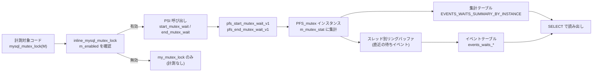

# 第33章 Performance Schema と監視

> **本章で読むソース**
>
> - [`include/mysql/psi/mysql_mutex.h`](https://github.com/mysql/mysql-server/blob/mysql-8.4.10/include/mysql/psi/mysql_mutex.h)
> - [`storage/perfschema/pfs.cc`](https://github.com/mysql/mysql-server/blob/mysql-8.4.10/storage/perfschema/pfs.cc)
> - [`storage/perfschema/pfs_instr.h`](https://github.com/mysql/mysql-server/blob/mysql-8.4.10/storage/perfschema/pfs_instr.h)
> - [`storage/perfschema/ha_perfschema.cc`](https://github.com/mysql/mysql-server/blob/mysql-8.4.10/storage/perfschema/ha_perfschema.cc)

## この章の狙い

サーバが内部で何にどれだけ時間を使っているかを、SQL から観測できるようにするのが **Performance Schema** である。
ミューテックスの待ち、I/O、ステートメントの実行、ステージの進行といった計測値を、専用のテーブル群として `SELECT` で読み出せる。
本章はこの仕組みを深入りせず概観する。
計測点がコードのどこに埋め込まれ、どの抽象（**PSI**）を通り、最終的にどのテーブルへ集まるのかという流れを追い、計測を無効化したときにホットパスのコストをほぼゼロに保つ設計を機構レベルで一つ示す。

## 前提

Performance Schema は、`handler` インターフェースを実装した一つのストレージエンジンとして組み込まれている。
ハンドラ API の枠組みは[第11章 ハンドラ API とストレージエンジンプラグイン](../part01-sql-layer/11-handler-api.md)で扱った。
計測対象として本章が例にとるミューテックスは、InnoDB をはじめサーバ全体で使われる排他制御の基本部品であり、[第16章 ミニトランザクション](../part02-innodb-foundation/16-mini-transaction.md)や[第26章 ロック](../part04-transaction-concurrency/26-locking.md)で触れたラッチ操作の下層にある。

## ストレージエンジンとしての Performance Schema

Performance Schema は、`PERFORMANCE_SCHEMA` という名前のストレージエンジンとして実装されている。
エンジン名は `ha_perfschema.cc` に定数として置かれている。

[`storage/perfschema/ha_perfschema.cc` L1605-L1605](https://github.com/mysql/mysql-server/blob/mysql-8.4.10/storage/perfschema/ha_perfschema.cc#L1605-L1605)

```cpp
const char *pfs_engine_name = "PERFORMANCE_SCHEMA";
```

ディスク上のテーブルを読み書きする普通のエンジンと違い、このエンジンが返す行は、サーバがメモリ上に持つ計測値を表として見せたものである。
`performance_schema` データベースの各テーブルへの `SELECT` は、`handler` を経由してメモリ上の集計構造を走査し、行に変換して返す。
これにより、計測値の読み出しが特別な API ではなく通常の SQL に統一される。

## 計測点と PSI

計測は、対象コードに埋め込まれたフック（**instrumentation**）から始まる。
ミューテックス、読み書きロック、I/O、ソケット、ステートメント、ステージといった種類ごとに、計測の入口と出口を表す呼び出しがコードに差し込まれている。
これらの呼び出しは、具体的な Performance Schema の実装を直接呼ばず、**PSI**（Performance Schema Interface）という抽象を介する。
`PSI_mutex` などの不透明型と関数ポインタの表を挟むことで、計測対象のコードは Performance Schema の内部構造を知らずに済み、計測機能をビルドから外すこともできる。

ミューテックスのロックを例にとる。
サーバのコードが書く `mysql_mutex_lock(M)` は、マクロとして次のように展開され、ソース位置（ファイル名と行番号）を引き連れて実体の関数へ渡る。

[`include/mysql/psi/mysql_mutex.h` L170-L172](https://github.com/mysql/mysql-server/blob/mysql-8.4.10/include/mysql/psi/mysql_mutex.h#L170-L172)

```cpp
#define mysql_mutex_lock(M) mysql_mutex_lock_with_src(M, __FILE__, __LINE__)

#define mysql_mutex_lock_with_src(M, F, L) inline_mysql_mutex_lock(M, F, L)
```

展開先の `inline_mysql_mutex_lock` が、計測の有無を切り替える要である。

[`include/mysql/psi/mysql_mutex.h` L242-L283](https://github.com/mysql/mysql-server/blob/mysql-8.4.10/include/mysql/psi/mysql_mutex.h#L242-L283)

```cpp
static inline int inline_mysql_mutex_lock(mysql_mutex_t *that,
                                          const char *src_file [[maybe_unused]],
                                          uint src_line [[maybe_unused]]) {
  int result;

#ifdef HAVE_PSI_MUTEX_INTERFACE
  if (that->m_psi != nullptr) {
    if (that->m_psi->m_enabled) {
      /* Instrumentation start */
      PSI_mutex_locker *locker;
      PSI_mutex_locker_state state;
      locker = PSI_MUTEX_CALL(start_mutex_wait)(
          &state, that->m_psi, PSI_MUTEX_LOCK, src_file, src_line);

      /* Instrumented code */
      result = my_mutex_lock(&that->m_mutex
#ifdef SAFE_MUTEX
                             ,
                             src_file, src_line
#endif
      );

      /* Instrumentation end */
      if (locker != nullptr) {
        PSI_MUTEX_CALL(end_mutex_wait)(locker, result);
      }

      return result;
    }
  }
#endif

  /* Non instrumented code */
  result = my_mutex_lock(&that->m_mutex
#ifdef SAFE_MUTEX
                         ,
                         src_file, src_line
#endif
  );

  return result;
}
```

計測が有効な経路では、実際のロック取得 `my_mutex_lock` の前後を `start_mutex_wait` と `end_mutex_wait` で挟む。
`PSI_MUTEX_CALL` は PSI の関数ポインタ表を引く呼び出しで、ここから Performance Schema の実装へ入る。

## 計測フックの中身

`start_mutex_wait` の実体が `pfs.cc` の `pfs_start_mutex_wait_v1` である。
待ちの計測を開始し、後で出口側に渡す `state` を組み立てる。

[`storage/perfschema/pfs.cc` L3775-L3812](https://github.com/mysql/mysql-server/blob/mysql-8.4.10/storage/perfschema/pfs.cc#L3775-L3812)

```cpp
PSI_mutex_locker *pfs_start_mutex_wait_v1(PSI_mutex_locker_state *state,
                                          PSI_mutex *mutex,
                                          PSI_mutex_operation op,
                                          const char *src_file, uint src_line) {
  auto *pfs_mutex = reinterpret_cast<PFS_mutex *>(mutex);
  assert((int)op >= 0);
  assert((uint)op < array_elements(mutex_operation_map));
  assert(state != nullptr);

  assert(pfs_mutex != nullptr);
  assert(pfs_mutex->m_class != nullptr);

  /* The caller checks for m_enabled. */
#if 0
  if (!pfs_mutex->m_enabled) {
    return nullptr;
  }
#endif

  uint flags;
  ulonglong timer_start = 0;

  if (flag_thread_instrumentation) {
    PFS_thread *pfs_thread = my_thread_get_THR_PFS();
    if (unlikely(pfs_thread == nullptr)) {
      return nullptr;
    }
    if (!pfs_thread->m_enabled) {
      return nullptr;
    }
    state->m_thread = reinterpret_cast<PSI_thread *>(pfs_thread);
    flags = STATE_FLAG_THREAD;

    if (pfs_mutex->m_timed) {
      timer_start = get_wait_timer();
      state->m_timer_start = timer_start;
      flags |= STATE_FLAG_TIMED;
    }
```

ここでさらに二段の絞り込みが働く。
`m_timed` が立っているときだけ `get_wait_timer` でタイマーを読む。
時間まで測るか回数だけ数えるかを計測点ごとに切り替えられ、回数で足りる対象ではタイマー読み取りのコストを省ける。

出口の `pfs_end_mutex_wait_v1` は、開始時に記録した `state` から待ち時間を算出し、集計構造へ畳み込む。

[`storage/perfschema/pfs.cc` L5105-L5126](https://github.com/mysql/mysql-server/blob/mysql-8.4.10/storage/perfschema/pfs.cc#L5105-L5126)

```cpp
void pfs_end_mutex_wait_v1(PSI_mutex_locker *locker, int rc) {
  const auto *state = reinterpret_cast<PSI_mutex_locker_state *>(locker);
  assert(state != nullptr);

  ulonglong timer_end = 0;
  ulonglong wait_time = 0;

  auto *mutex = reinterpret_cast<PFS_mutex *>(state->m_mutex);
  assert(mutex != nullptr);
  auto *thread = reinterpret_cast<PFS_thread *>(state->m_thread);

  const uint flags = state->m_flags;

  if (flags & STATE_FLAG_TIMED) {
    timer_end = get_wait_timer();
    wait_time = timer_end - state->m_timer_start;
    /* Aggregate to EVENTS_WAITS_SUMMARY_BY_INSTANCE (timed) */
    mutex->m_mutex_stat.m_wait_stat.aggregate_value(wait_time);
  } else {
    /* Aggregate to EVENTS_WAITS_SUMMARY_BY_INSTANCE (counted) */
    mutex->m_mutex_stat.m_wait_stat.aggregate_counted();
  }
```

時間まで測った場合は `aggregate_value` で待ち時間を足し込み、回数だけの場合は `aggregate_counted` で件数を増やす。
畳み込み先はミューテックスのインスタンスが持つ `m_mutex_stat` で、コメントが示すとおり `EVENTS_WAITS_SUMMARY_BY_INSTANCE` テーブルが見せる値の元になる。

## 計測値を溜める構造

計測対象のミューテックスは、Performance Schema 側では `PFS_mutex` というインスタンスとして表される。
個々の計測値はこの構造体に常駐し、新たな待ちが起きるたびに更新される。

[`storage/perfschema/pfs_instr.h` L102-L126](https://github.com/mysql/mysql-server/blob/mysql-8.4.10/storage/perfschema/pfs_instr.h#L102-L126)

```cpp
/** Instrumented mutex implementation. @see PSI_mutex. */
struct PFS_mutex : public PSI_mutex {
  /** Internal lock. */
  pfs_lock m_lock;
  /** Timed flag. */
  bool m_timed;
  /** Container page. */
  PFS_opaque_container_page *m_page;

  /** Mutex identity, typically a @c pthread_mutex_t. */
  const void *m_identity;
  /** Mutex class. */
  PFS_mutex_class *m_class;
  /** Instrument statistics. */
  PFS_mutex_stat m_mutex_stat;
  /** Current owner. */
  PFS_thread *m_owner;
#ifdef LATER_WL2333
  /**
    Time stamp of the last lock.
    This statistic is not exposed in user visible tables yet.
  */
  ulonglong m_last_locked;
#endif /* LATER_WL2333 */
};
```

`m_class` は同種のミューテックスをまとめる分類（クラス）を指し、`m_mutex_stat` がそのインスタンスの待ち統計を保持する。
`m_owner` は現在の保持スレッドである。
これらのインスタンスは、サーバ起動時に確保した固定容量のバッファに置かれ、計測のたびに割り当てと解放を繰り返さない。
スレッドごとの直近イベントも、固定長のリングバッファ（待ちスタック）に書き込まれ、容量を超えた古いイベントは上書きされていく。
集計テーブル（`EVENTS_WAITS_SUMMARY_BY_INSTANCE` など）は、こうした常駐インスタンスの `m_mutex_stat` を `handler` 経由で走査して行に変換する。

## 計測点から PSI、そしてテーブルへ

ここまでの流れを図にまとめる。
計測対象のコードは PSI の入口と出口だけを呼び、Performance Schema の内部表現には触れない。



## オーバーヘッドを抑える設計

計測は常時走るホットパスに挿入されるため、無効時のコストを抑えることが設計の中心にある。
工夫は段階的なゲートとして現れる。

第一のゲートはコンパイル時にある。
`HAVE_PSI_MUTEX_INTERFACE` が定義されていなければ、`inline_mysql_mutex_lock` の計測ブロックはプリプロセッサごと消え、残るのは素のロック取得だけになる。
計測機構をビルドから外した構成では、`mysql_mutex_lock` は実質的に `my_mutex_lock` の呼び出しへ展開され、計測のための分岐も呼び出しも残らない。

第二のゲートは実行時にある。
計測を組み込んだ構成でも、`that->m_psi->m_enabled` が偽なら計測ブロックには入らず、すぐ下の非計測経路へ抜ける。
有効と無効の判定は単純なポインタ確認とフラグ確認だけで、PSI の関数呼び出しまで到達しない。
さらに `m_timed` の確認で、時間を測るか回数だけ数えるかを計測点ごとに切り替え、不要なタイマー読み取りを避ける。

これらが重なることで、計測を使わない運用では待ち計測のコストをほぼゼロに、必要な箇所だけ時間計測を有効にする運用ではタイマーのコストを最小限に抑えられる。
ホットパスのコストを動的設定で削れるのは、計測の判断（有効か、時間まで測るか）を関数ポインタ表の手前のフラグ確認に前倒しし、無効時に PSI 実装へ一切踏み込ませない構造による。

## まとめ

Performance Schema は、`PERFORMANCE_SCHEMA` というストレージエンジンとして組み込まれ、メモリ常駐の計測値を `handler` 経由で表として見せる。
計測対象のコードは PSI という抽象の入口と出口（`start_mutex_wait`、`end_mutex_wait` など）だけを呼び、Performance Schema の内部構造には触れない。
計測フック `pfs_start_mutex_wait_v1` と `pfs_end_mutex_wait_v1` が待ち時間を測り、`PFS_mutex` インスタンスの `m_mutex_stat` へ畳み込む。
集計テーブルとスレッド別リングバッファは、この常駐構造を走査して `SELECT` の行に変換する。

オーバーヘッドは、コンパイル時の `HAVE_PSI_MUTEX_INTERFACE` と実行時の `m_enabled`、`m_timed` という段階的なゲートで抑えられる。
無効時には計測ブロックがプリプロセッサごと消えるか、フラグ確認だけで非計測経路へ抜けるため、ホットパスのコストがほぼ残らない。

## 関連する章

- [第11章 ハンドラ API とストレージエンジンプラグイン](../part01-sql-layer/11-handler-api.md)：Performance Schema が `handler` として計測値を表に見せる土台。
- [第16章 ミニトランザクション](../part02-innodb-foundation/16-mini-transaction.md)：計測対象となるラッチ操作の典型。
- [第26章 ロック](../part04-transaction-concurrency/26-locking.md)：ミューテックス待ちが観測される並行制御の文脈。
