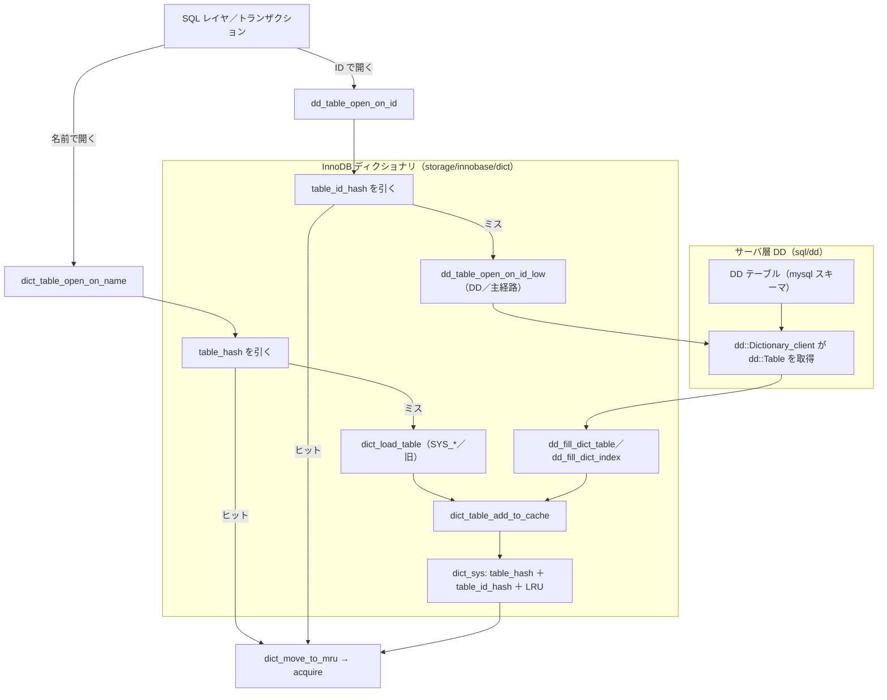

# 第35章 データディクショナリ

> **本章で読むソース**
>
> - [`sql/dd/dd.h`](https://github.com/mysql/mysql-server/blob/mysql-8.4.10/sql/dd/dd.h)
> - [`sql/dd/dictionary.h`](https://github.com/mysql/mysql-server/blob/mysql-8.4.10/sql/dd/dictionary.h)
> - [`storage/innobase/include/dict0mem.h`](https://github.com/mysql/mysql-server/blob/mysql-8.4.10/storage/innobase/include/dict0mem.h)
> - [`storage/innobase/include/dict0dict.h`](https://github.com/mysql/mysql-server/blob/mysql-8.4.10/storage/innobase/include/dict0dict.h)
> - [`storage/innobase/dict/dict0dict.cc`](https://github.com/mysql/mysql-server/blob/mysql-8.4.10/storage/innobase/dict/dict0dict.cc)
> - [`storage/innobase/dict/dict0dd.cc`](https://github.com/mysql/mysql-server/blob/mysql-8.4.10/storage/innobase/dict/dict0dd.cc)
> - [`storage/innobase/dict/dict0load.cc`](https://github.com/mysql/mysql-server/blob/mysql-8.4.10/storage/innobase/dict/dict0load.cc)
> - [`storage/innobase/include/dict0priv.ic`](https://github.com/mysql/mysql-server/blob/mysql-8.4.10/storage/innobase/include/dict0priv.ic)

## この章の狙い

ここまでの章は、テーブルやインデックスの定義がすでにメモリにある前提で読んできた。
第22章の B+tree は `dict_index_t` を、第24章の行操作は `dict_table_t` を当然のように受け取っていた。
本章は、その定義そのものがどこに永続化され、どうやってメモリへ運ばれるのかを読む。

定義の置き場所は、MySQL 8.0 で大きく変わった。
それ以前は各テーブルの定義を `.frm` という専用ファイルに、加えて InnoDB が内部に持つ `SYS_TABLES` などのシステムテーブルに、二重に持っていた。
8.0 以降は **トランザクショナルデータディクショナリ** に一本化し、定義を InnoDB のテーブル（**DD テーブル**）へ格納して `.frm` を廃止した。
定義の更新がふつうのトランザクションになり、DDL の途中でクラッシュしても定義とデータの整合が保たれる。

本章では二つの層を区別して読む。
一つはサーバ層のデータディクショナリ（`sql/dd/`）で、定義を `mysql` スキーマの DD テーブルに格納し、`dd::Table` などの C++ オブジェクトとして提供する。
もう一つは InnoDB のインメモリディクショナリキャッシュ（`storage/innobase/dict/`）で、実行時に必要な `dict_table_t` や `dict_index_t` を常駐させる。
この二層の橋渡し、つまりサーバ層 DD から InnoDB キャッシュへ定義をどう運ぶかが、本章の中心である。

最適化の工夫としては、開いたテーブルの定義をインメモリキャッシュに常駐させ、二回目以降の参照で DD の読み出しを丸ごと省く仕組みを機構レベルで読む。
キャッシュは無制限には膨らまず、`dict_make_room_in_cache` が LRU で古いものを退避する。

## 前提

第15章でハンドラ API を、第18章でテーブルスペースとファイル空間管理を読んだ。
DD テーブルもまた InnoDB のテーブルであり、`mysql` テーブルスペースに B+tree として格納される。
本章で扱う `dict_table_t` と `dict_index_t` は、第22章と第24章ですでに使ってきた構造体である。
ここではその構造体の中身と、生成経路を読む。

DDL がこれらの定義をどう書き換えるか（オンライン DDL、インスタント DDL）は第36章に送る。
本章は定義の格納形式と読み出し経路に絞り、定義を変更する側は扱わない。

## サーバ層のデータディクショナリ

サーバ層 DD の入口は `sql/dd/dd.h` である。
ここにはディクショナリ全体の初期化と終了、そしてディクショナリ実体の取得だけが宣言されている。

[`sql/dd/dd.h` L40-L50](https://github.com/mysql/mysql-server/blob/mysql-8.4.10/sql/dd/dd.h#L40-L50)

```cpp
/**
  Initialize data dictionary upon server startup, server startup on old
  data directory or install data dictionary for the first time.

  @param dd_init - Option for initialization, population or deletion
                   of data dictionary.

  @return false - On success
  @return true - On error
*/
bool init(enum_dd_init_type dd_init);
```

`init` はサーバ起動時に一度だけ呼ばれ、DD テーブルが未作成なら作成し、既存ならそのまま使う。
定義の実体は `mysql` スキーマに作られた DD テーブル群（`tables`、`columns`、`indexes` など）に行として入る。
このスキーマが DD の格納先であることは、`dd::Dictionary` の問い合わせメソッドに表れている。

[`sql/dd/dictionary.h` L69-L78](https://github.com/mysql/mysql-server/blob/mysql-8.4.10/sql/dd/dictionary.h#L69-L78)

```cpp
  /**
    Check if the given schema name is 'mysql', which where
    the DD tables are stored.

    @param schema_name    Schema name to check.

    @returns true - If schema_name is 'mysql'
    @returns false - If schema_name is not 'mysql'
  */
  virtual bool is_dd_schema_name(const String_type &schema_name) const = 0;
```

`dd::Dictionary` は、SQL レイヤから DD を操作するときの主インターフェースである。

[`sql/dd/dictionary.h` L50-L51](https://github.com/mysql/mysql-server/blob/mysql-8.4.10/sql/dd/dictionary.h#L50-L51)

```cpp
/// Main interface class enabling users to operate on data dictionary.
class Dictionary {
```

実際にテーブル定義を取り出すときは、`dd::cache::Dictionary_client` を介して `dd::Table` オブジェクトを取得する。
本章ではサーバ層 DD に深入りせず、ここで得られる `dd::Table` が InnoDB へ渡る定義の出発点である、という点だけ押さえる。
DD テーブルそのものは InnoDB のテーブルなので、定義の更新は通常のトランザクションになり、redo ログと undo ログの保護を受ける。
これが「トランザクショナル」と呼ばれる理由であり、`.frm` というトランザクション外のファイルを廃止できた根拠である。

## InnoDB のインメモリディクショナリ構造体

InnoDB は実行時、テーブル一つを `dict_table_t` で、インデックス一つを `dict_index_t` で、列一つを `dict_col_t` で表す。
これらはディスク上の DD 行をそのまま写したものではなく、検索や行操作にすぐ使える形に展開したメモリ上の表現である。

テーブルを表す `dict_table_t` は、ID と名前、列の配列、インデックスのリストを持つ。

[`storage/innobase/include/dict0mem.h` L1979-L1993](https://github.com/mysql/mysql-server/blob/mysql-8.4.10/storage/innobase/include/dict0mem.h#L1979-L1993)

```cpp
  table_id_t id;

  /** Memory heap. If you allocate from this heap after the table has
  been created then be sure to account the allocation into
  dict_sys->size. When closing the table we do something like
  dict_sys->size -= mem_heap_get_size(table->heap) and if that is going
  to become negative then we would assert. Something like this should do:
  old_size = mem_heap_get_size()
  mem_heap_alloc()
  new_size = mem_heap_get_size()
  dict_sys->size += new_size - old_size. */
  mem_heap_t *heap;

  /** Table name. */
  table_name_t name;
```

テーブルが持つインデックスは、双方向リストとしてつながっている。

[`storage/innobase/include/dict0mem.h` L2129-L2132](https://github.com/mysql/mysql-server/blob/mysql-8.4.10/storage/innobase/include/dict0mem.h#L2129-L2132)

```cpp
  /** List of indexes of the table. */
  UT_LIST_BASE_NODE_T(dict_index_t, indexes) indexes;

  size_t get_index_count() const { return UT_LIST_GET_LEN(indexes); }
```

インデックスを表す `dict_index_t` は、自分が属するテーブルへの逆ポインタ、木の根ページ番号、フィールドの配列を持つ。

[`storage/innobase/include/dict0mem.h` L1046-L1066](https://github.com/mysql/mysql-server/blob/mysql-8.4.10/storage/innobase/include/dict0mem.h#L1046-L1066)

```cpp
struct dict_index_t {
  /** id of the index */
  space_index_t id;

  /** memory heap */
  mem_heap_t *heap;

  /** index name */
  id_name_t name;

  /** table name */
  const char *table_name;

  /** back pointer to table */
  dict_table_t *table;

  /** space where the index tree is placed */
  unsigned space : 32;

  /** index tree root page number */
  unsigned page : 32;
```

`page` がインデックスの根ページ番号である。
第22章でルートから葉へ降りたとき、出発点になったのがこの値である。
つまり `dict_index_t` は、B+tree の入口をディクショナリ側で保持する構造体でもある。

列を表す `dict_col_t` は、型と長さ、テーブル内での位置を、ビットフィールドで詰めて持つ。

[`storage/innobase/include/dict0mem.h` L499-L529](https://github.com/mysql/mysql-server/blob/mysql-8.4.10/storage/innobase/include/dict0mem.h#L499-L529)

```cpp
  unsigned prtype : 32; /*!< precise type; MySQL data
                        type, charset code, flags to
                        indicate nullability,
                        signedness, whether this is a
                        binary string, whether this is
                        a true VARCHAR where MySQL
                        uses 2 bytes to store the length */
  unsigned mtype : 8;   /*!< main data type */

  /* the remaining fields do not affect alphabetical ordering: */

  unsigned len : 16; /*!< length; for MySQL data this
                     is field->pack_length(),
                     except that for a >= 5.0.3
                     type true VARCHAR this is the
                     maximum byte length of the
                     string data (in addition to
                     the string, MySQL uses 1 or 2
                     bytes to store the string length) */

  unsigned mbminmaxlen : 5; /*!< minimum and maximum length of a
                            character, in bytes;
                            DATA_MBMINMAXLEN(mbminlen,mbmaxlen);
                            mbminlen=DATA_MBMINLEN(mbminmaxlen);
                            mbmaxlen=DATA_MBMINLEN(mbminmaxlen) */
  /*----------------------*/
  /* End of definitions copied from dtype_t */
  /** @} */

  unsigned ind : 10;        /*!< table column position
                            (starting from 0) */
```

`mtype` が主たるデータ型、`prtype` が精密型（文字セットや符号の有無、NULL 可否などのフラグを含む）である。
この二つで、レコードのバイト列をどう解釈するかが決まる。
列定義をビットフィールドに詰めるのは、`dict_col_t` がテーブルの列数だけ並ぶ配列であり、メモリ占有を抑えるためと考えられる。

## ディクショナリキャッシュ dict_sys

これらの構造体をまとめて管理するのが、InnoDB に唯一存在する **ディクショナリキャッシュ** `dict_sys` である。
`dict_sys_t` は、開いているテーブルを名前と ID の二つのハッシュ表で索引し、退避可能なものと退避できないものを別々の LRU リストで持つ。

[`storage/innobase/include/dict0dict.h` L1025-L1052](https://github.com/mysql/mysql-server/blob/mysql-8.4.10/storage/innobase/include/dict0dict.h#L1025-L1052)

```cpp
  hash_table_t *table_hash;    /*!< hash table of the tables, based
                               on name */
  hash_table_t *table_id_hash; /*!< hash table of the tables, based
                               on id */
  size_t size;                 /*!< varying space in bytes occupied
                               by the data dictionary table and
                               index objects */
  /** Handler to sys_* tables, they're only for upgrade */
  dict_table_t *sys_tables;  /*!< SYS_TABLES table */
  dict_table_t *sys_columns; /*!< SYS_COLUMNS table */
  dict_table_t *sys_indexes; /*!< SYS_INDEXES table */
  dict_table_t *sys_fields;  /*!< SYS_FIELDS table */
  dict_table_t *sys_virtual; /*!< SYS_VIRTUAL table */

  /** Permanent handle to mysql.innodb_table_stats */
  dict_table_t *table_stats;
  /** Permanent handle to mysql.innodb_index_stats */
  dict_table_t *index_stats;
  /** Permanent handle to mysql.innodb_ddl_log */
  dict_table_t *ddl_log;
  /** Permanent handle to mysql.innodb_dynamic_metadata */
  dict_table_t *dynamic_metadata;
  using Table_LRU_list_base = UT_LIST_BASE_NODE_T(dict_table_t, table_LRU);

  /** List of tables that can be evicted from the cache */
  Table_LRU_list_base table_LRU;
  /** List of tables that can't be evicted from the cache */
  Table_LRU_list_base table_non_LRU;
```

名前引きのための `table_hash` と ID 引きのための `table_id_hash` を別に持つのは、検索の経路が二通りあるからである。
SQL レイヤがテーブル名で開くときは名前ハッシュを、トランザクションやログ回復が内部 ID で開くときは ID ハッシュをたどる。
`dict_table_t` 自身がこの二つのハッシュチェーン用のノードを内蔵している。

[`storage/innobase/include/dict0mem.h` L2120-L2124](https://github.com/mysql/mysql-server/blob/mysql-8.4.10/storage/innobase/include/dict0mem.h#L2120-L2124)

```cpp
  /** Hash chain node. */
  hash_node_t name_hash;

  /** Hash chain node. */
  hash_node_t id_hash;
```

二つの LRU リストの分割は、退避してよいテーブルと、常駐させ続けたいテーブルを分けるためである。
`table_non_LRU` には DD テーブルや統計テーブルなど、サーバ稼働中つねに必要なものが入り、退避の対象から外れる。
ユーザのテーブルは `table_LRU` に入り、後述するキャッシュ容量の調整で退避され得る。

`dict_sys` のハッシュ表は、起動時の `dict_init` でバッファプールの大きさに比例した大きさで確保される。

[`storage/innobase/dict/dict0dict.cc` L1021-L1025](https://github.com/mysql/mysql-server/blob/mysql-8.4.10/storage/innobase/dict/dict0dict.cc#L1021-L1025)

```cpp
  dict_sys->table_hash = ut::new_<hash_table_t>(
      buf_pool_get_curr_size() / (DICT_POOL_PER_TABLE_HASH * UNIV_WORD_SIZE));

  dict_sys->table_id_hash = ut::new_<hash_table_t>(
      buf_pool_get_curr_size() / (DICT_POOL_PER_TABLE_HASH * UNIV_WORD_SIZE));
```

## 名前からテーブルを開く

テーブルを名前で開く高水準の入口が `dict_table_open_on_name` である。
まずキャッシュを引き、ヒットしなければロード経路に回す。

[`storage/innobase/dict/dict0dict.cc` L1088-L1092](https://github.com/mysql/mysql-server/blob/mysql-8.4.10/storage/innobase/dict/dict0dict.cc#L1088-L1092)

```cpp
  table = dict_table_check_if_in_cache_low(table_str.c_str());

  if (table == nullptr) {
    table = dict_load_table(table_name, true, ignore_err);
  }
```

`dict_table_check_if_in_cache_low` は、名前のハッシュ値で `table_hash` をたどるだけの軽い関数である。

[`storage/innobase/include/dict0priv.ic` L79-L85](https://github.com/mysql/mysql-server/blob/mysql-8.4.10/storage/innobase/include/dict0priv.ic#L79-L85)

```cpp
  /* Look for the table name in the hash table */
  const auto table_name_hash_value = ut::hash_string(table_name);

  HASH_SEARCH(name_hash, dict_sys->table_hash, table_name_hash_value,
              dict_table_t *, table, ut_ad(table->cached),
              !strcmp(table->name.m_name, table_name));
  return table;
```

ヒットしたら、そのテーブルを LRU の先頭へ動かし、参照カウントを上げて返す。

[`storage/innobase/dict/dict0dict.cc` L1111-L1116](https://github.com/mysql/mysql-server/blob/mysql-8.4.10/storage/innobase/dict/dict0dict.cc#L1111-L1116)

```cpp
    if (table->can_be_evicted) {
      dict_move_to_mru(table);
    }

    table->acquire();
  }
```

`dict_move_to_mru` で先頭へ動かすのは、最近使われたテーブルほど退避されにくくするためである。
これが LRU の更新であり、後述の容量調整と対になっている。

## 定義のロードとサーバ層 DD からの橋渡し

キャッシュにないときのロード経路は、8.0 で二系統に分かれた。
一つは旧来の `dict0load.cc` で、InnoDB 内部の `SYS_TABLES` などから定義を読む。
もう一つは `dict0dd.cc` で、サーバ層 DD の `dd::Table` から定義を組み立てる。
8.4 で実際に使われる主経路は後者であり、`dict0load.cc` は 5.7 からのアップグレードや内部システムテーブルの読み出しに残る。

旧来側の `dict0load.cc` は、ファイル冒頭が示すとおり、ディクショナリテーブルからメモリキャッシュへ定義を読み込む役割を持つ。

[`storage/innobase/dict/dict0load.cc` L28-L33](https://github.com/mysql/mysql-server/blob/mysql-8.4.10/storage/innobase/dict/dict0load.cc#L28-L33)

```cpp
/** @file dict/dict0load.cc
 Loads to the memory cache database object definitions
 from dictionary tables

 Created 4/24/1996 Heikki Tuuri
 *******************************************************/
```

この経路でも、`dict_load_table` はまずキャッシュを確認してから、`SYS_TABLES` を読む下請けへ進む。

[`storage/innobase/dict/dict0load.cc` L2202-L2208](https://github.com/mysql/mysql-server/blob/mysql-8.4.10/storage/innobase/dict/dict0load.cc#L2202-L2208)

```cpp
  result = dict_table_check_if_in_cache_low(name);

  table_name.m_name = const_cast<char *>(name);

  if (!result) {
    result = dict_load_table_one(table_name, cached, ignore_err, fk_list,
                                 &cur_table);
```

読み込んだ定義をキャッシュへ載せるのは `dict_table_add_to_cache` である。

[`storage/innobase/dict/dict0load.cc` L2471-L2473](https://github.com/mysql/mysql-server/blob/mysql-8.4.10/storage/innobase/dict/dict0load.cc#L2471-L2473)

```cpp
    if (cached) {
      dict_table_add_to_cache(table, true);
    }
```

主経路である `dict0dd.cc` 側は、ID からテーブルを開く `dd_table_open_on_id` がキャッシュとサーバ層 DD をつなぐ。
まず ID ハッシュを引き、ヒットしなければ DD を読む下請けへ回す。

[`storage/innobase/dict/dict0dd.cc` L708-L745](https://github.com/mysql/mysql-server/blob/mysql-8.4.10/storage/innobase/dict/dict0dd.cc#L708-L745)

```cpp
  HASH_SEARCH(id_hash, dict_sys->table_id_hash, hash_value, dict_table_t *,
              ib_table, ut_ad(ib_table->cached), ib_table->id == table_id);

reopen:
  if (ib_table == nullptr) {
#ifndef UNIV_HOTBACKUP
    if (dict_table_is_sdi(table_id)) {
      /* The table is SDI table */
      space_id_t space_id = dict_sdi_get_space_id(table_id);

      /* Create in-memory table object for SDI table */
      dict_index_t *sdi_index =
          dict_sdi_create_idx_in_mem(space_id, false, 0, false);

      if (sdi_index == nullptr) {
        if (!dict_locked) {
          dict_sys_mutex_exit();
        }
        return nullptr;
      }

      ib_table = sdi_index->table;

      ut_ad(ib_table != nullptr);
      ib_table->acquire();

      if (!dict_locked) {
        dict_sys_mutex_exit();
      }
    } else {
      dict_sys_mutex_exit();

      ib_table = dd_table_open_on_id_low(thd, mdl, table_id);

      if (dict_locked) {
        dict_sys_mutex_enter();
      }
    }
```

キャッシュにあれば、`HASH_SEARCH` だけで `ib_table` が得られ、DD には一切触れない。
ないときだけ `dd_table_open_on_id_low` へ進み、ここでサーバ層 DD を読む。
この下請けは、InnoDB 内部 ID からスキーマ名とテーブル名を引き直し、`dd::cache::Dictionary_client` で `dd::Table` を取得して、それを InnoDB の構造体へ変換する。
変換の末尾で `dict_table_add_to_cache` を呼び、できた `dict_table_t` をキャッシュへ載せる。
これでサーバ層 DD（`dd::Table`）と InnoDB キャッシュ（`dict_table_t`）が一本につながる。

[`storage/innobase/dict/dict0dd.cc` L5237](https://github.com/mysql/mysql-server/blob/mysql-8.4.10/storage/innobase/dict/dict0dd.cc#L5237-L5237)

```cpp
    dict_table_add_to_cache(m_table, true);
```

`dict_table_add_to_cache` の中身は、`dict_sys` の二つのハッシュ表へ同じテーブルを登録する処理である。

[`storage/innobase/dict/dict0dict.cc` L1234-L1248](https://github.com/mysql/mysql-server/blob/mysql-8.4.10/storage/innobase/dict/dict0dict.cc#L1234-L1248)

```cpp
  /* Add table to hash table of tables */
  HASH_INSERT(dict_table_t, name_hash, dict_sys->table_hash, name_hash_value,
              table);

  /* Add table to hash table of tables based on table id */
  HASH_INSERT(dict_table_t, id_hash, dict_sys->table_id_hash,
              index_id_hash_value, table);

  table->can_be_evicted = can_be_evicted;

  if (table->can_be_evicted) {
    UT_LIST_ADD_FIRST(dict_sys->table_LRU, table);
  } else {
    UT_LIST_ADD_FIRST(dict_sys->table_non_LRU, table);
  }
```

名前ハッシュと ID ハッシュの両方へ同一ポインタを登録するので、以後は名前でも ID でも同じ `dict_table_t` に到達する。
退避可能かどうかで二つの LRU リストのどちらに入れるかを分ける。
この一度の登録によって、同じテーブルへの二回目以降のアクセスは、ロード経路を通らずハッシュ検索だけで済む。

二つの開く経路と二つの格納経路の関係を、図に整理する。



## キャッシュ常駐とLRU退避による高速化

本章の最適化は、定義をインメモリキャッシュへ常駐させ、二回目以降の参照で DD 読み出しを省く点にある。
DD テーブルは `mysql` テーブルスペースに置かれた B+tree なので、定義を読むには第23章のカーソルで木を降り、ページを読む必要がある。
一度開いたテーブルの定義を `dict_table_t` としてメモリに残しておけば、次回は `table_hash` か `table_id_hash` のハッシュ検索一回で同じ構造体に到達し、この木の探索をまるごと省ける。
これは第20章のバッファプールがページを常駐させるのと同じ発想を、定義オブジェクトの層で行うものである。

常駐は容量と引き換えになるので、無制限には残せない。
退避可能なテーブルを古い順に捨てて容量を調整するのが `dict_make_room_in_cache` である。

[`storage/innobase/dict/dict0dict.cc` L1346-L1370](https://github.com/mysql/mysql-server/blob/mysql-8.4.10/storage/innobase/dict/dict0dict.cc#L1346-L1370)

```cpp
  for (table = UT_LIST_GET_LAST(dict_sys->table_LRU);
       table != nullptr && i > check_up_to && (len - n_evicted) > max_tables;
       --i) {
    dict_table_t *prev_table;

    prev_table = UT_LIST_GET_PREV(table_LRU, table);

    table->lock();

    if (dict_table_can_be_evicted(table)) {
      table->unlock();
      DBUG_EXECUTE_IF("crash_if_fts_table_is_evicted", {
        if (table->fts && dict_table_has_fts_index(table)) {
          ut_d(ut_error);
        }
      };);
      dict_table_remove_from_cache_low(table, true);

      ++n_evicted;
    } else {
      table->unlock();
    }

    table = prev_table;
  }
```

走査は `table_LRU` の末尾、つまり最も長く使われていない側から始める。
`dict_table_open_on_name` が開くたびに `dict_move_to_mru` で先頭へ動かしていたので、末尾には参照されていないテーブルがたまる。
退避できるのは `dict_table_can_be_evicted` が真を返すもの、すなわち参照カウントがゼロでロックも外部キー関係も持たないテーブルに限る。
使用中のテーブルを誤って捨てない、という安全条件がここに効く。

走査が `table_LRU` だけを対象にするのは、`table_non_LRU` の DD テーブルや統計テーブルを退避の候補から外すためである。
これらは稼働中つねに必要なので、二つのリストへ最初から振り分けておけば、退避ループはユーザのテーブルだけを見ればよい。
常駐で読み出しを省く工夫と、容量を保つ退避の工夫は、この二リスト構造の上で両立している。

## まとめ

MySQL 8.0 以降のデータディクショナリは、定義を InnoDB の DD テーブルへ格納し、`.frm` を廃止した。
定義の更新が通常のトランザクションになり、DDL の途中でクラッシュしても定義とデータの整合が保たれる。
サーバ層 DD（`sql/dd/`）が `dd::Table` として定義を提供し、InnoDB がそれを `dict_table_t` や `dict_index_t` へ変換してインメモリディクショナリキャッシュ `dict_sys` に常駐させる。

キャッシュは名前と ID の二つのハッシュ表でテーブルを索引し、`dict_table_open_on_name` と `dd_table_open_on_id` がそれぞれの経路の入口になる。
キャッシュにあればハッシュ検索だけで定義に到達し、DD の B+tree 探索を省く。
ないときだけ `dict_load_table` か `dd_table_open_on_id_low` がロードし、`dict_table_add_to_cache` で両ハッシュ表へ登録する。
常駐するテーブルは LRU で並べ、`dict_make_room_in_cache` が退避可能なものを末尾から捨てて容量を保つ。

## 関連する章

- [第15章 ハンドラ API とストレージエンジンプラグイン](../part01-sql-layer/15-handler-api.md)：DD がまたがるサーバ層とストレージエンジンの境界を扱う。
- [第18章 テーブルスペースとファイル空間管理](../part02-innodb-foundation/18-tablespace-and-fsp.md)：DD テーブルが格納される `mysql` テーブルスペースの管理を扱う。
- [第22章 B+tree インデックス](../part03-index-row/22-btree-index.md)：`dict_index_t` が指す根ページから始まる木構造を扱う。
- [第23章 レコード検索とカーソル](../part03-index-row/23-search-and-cursor.md)：DD テーブルから定義を読むときに使う木の降下を扱う。
- [第36章 オンライン DDL とインスタント DDL](36-online-and-instant-ddl.md)：本章で読んだ定義を変更する側の処理を扱う。
