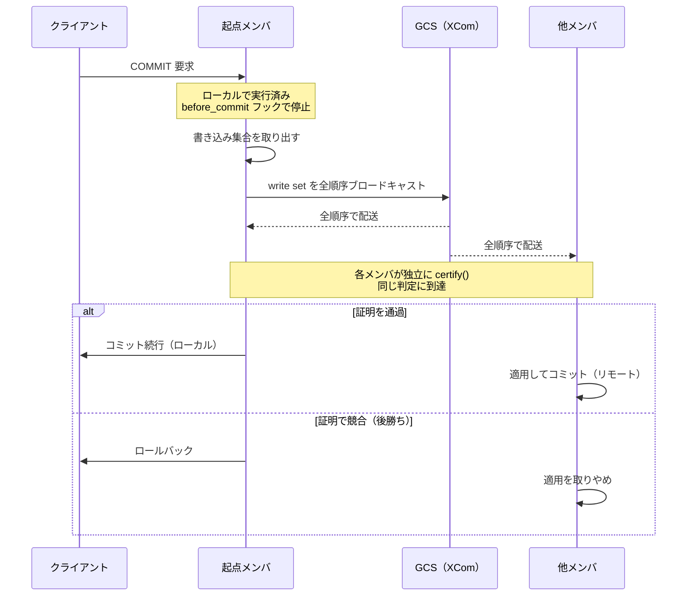

# 第40章 グループレプリケーション

> **本章で読むソース**
>
> - [`plugin/group_replication/src/observer_trans.cc`](https://github.com/mysql/mysql-server/blob/mysql-8.4.10/plugin/group_replication/src/observer_trans.cc)
> - [`plugin/group_replication/src/certifier.cc`](https://github.com/mysql/mysql-server/blob/mysql-8.4.10/plugin/group_replication/src/certifier.cc)
> - [`plugin/group_replication/include/certifier.h`](https://github.com/mysql/mysql-server/blob/mysql-8.4.10/plugin/group_replication/include/certifier.h)
> - [`plugin/group_replication/src/applier.cc`](https://github.com/mysql/mysql-server/blob/mysql-8.4.10/plugin/group_replication/src/applier.cc)
> - [`plugin/group_replication/src/consistency_manager.cc`](https://github.com/mysql/mysql-server/blob/mysql-8.4.10/plugin/group_replication/src/consistency_manager.cc)
> - [`plugin/group_replication/libmysqlgcs/include/mysql/gcs/gcs_communication_interface.h`](https://github.com/mysql/mysql-server/blob/mysql-8.4.10/plugin/group_replication/libmysqlgcs/include/mysql/gcs/gcs_communication_interface.h)
> - [`plugin/group_replication/src/plugin.cc`](https://github.com/mysql/mysql-server/blob/mysql-8.4.10/plugin/group_replication/src/plugin.cc)

## この章の狙い

第37章のレプリケーションは、binlog に記録した変更をレプリカが受けて適用する方式だった。
非同期レプリケーションではプライマリが先にコミットし、レプリカは遅れて追従する。
準同期レプリケーションはレプリカへの到達を待つが、それでも適用までは待たない。
どちらも、プライマリとレプリカのデータが一瞬ずれることを許す。

本章で読む**グループレプリケーション**（GR）は、複数のサーバが一つのグループを作り、合意と証明によってトランザクションの整合をとる方式である。
各メンバはほぼ同じデータを持ち、メンバが落ちると残りのメンバへ自動でフェイルオーバーする。
公式ドキュメントはこれを「virtually synchronous」（仮想的に同期的）な複製と呼ぶ。
完全な同期複製ではないが、コミットの前にグループ全体で順序と競合の合意をとる点で、第37章の方式より同期に最も近い。

GR は MySQL 本体ではなくプラグイン `plugin/group_replication/` として実装される。
本章は三つの問いに答える。
第一に、ローカルで実行したトランザクションを、コミット直前にどう止めてグループへ渡すのか。
第二に、各メンバが独立に、しかも同じ判定で競合を検出する**証明**（certification）はどう動くのか。
第三に、グループ全体の一貫性レベルをどう選び、どこで待つのか。

## 前提

第37章「バイナリログとレプリケーション」で binlog、GTID、適用チャネルの仕組みを扱った。
本章はその用語を前提とする。
GR のトランザクションは binlog 形式のイベントとしてグループへ流れ、各メンバの適用チャネルが消費する。
第28章「トランザクション管理」の `ha_commit_trans` を入口とするコミット経路と、第31章「ロック」の楽観的並行制御の発想も前提になる。

## シングルプライマリとマルチプライマリ

GR には二つの動作モードがある。
**シングルプライマリモード**は既定で、グループの中で書き込みを受け付けるメンバを1台に限る。
残りのメンバは読み取り専用で、プライマリが落ちると自動選出で新しいプライマリが決まる。
**マルチプライマリモード**では、すべてのメンバが書き込みを受け付ける。
このモードでは複数のメンバが同じ行を並行に更新しうるため、後述の証明による競合検出が本質的に効いてくる。

プラグインは `mysql_declare_plugin` で名前 `group_replication` として登録される。

[`plugin/group_replication/src/plugin.cc L5463-L5478`](https://github.com/mysql/mysql-server/blob/mysql-8.4.10/plugin/group_replication/src/plugin.cc#L5463-L5478)

```cpp
mysql_declare_plugin(group_replication_plugin){
    MYSQL_GROUP_REPLICATION_PLUGIN,
    &group_replication_descriptor,
    "group_replication",
    PLUGIN_AUTHOR_ORACLE,
    "Group Replication (1.1.0)", /* Plugin name with full version*/
    PLUGIN_LICENSE_GPL,
    plugin_group_replication_init,            /* Plugin Init */
    plugin_group_replication_check_uninstall, /* Plugin Check uninstall */
    plugin_group_replication_deinit,          /* Plugin Deinit */
    0x0101,                                   /* Plugin Version: major.minor */
    group_replication_status_vars,            /* status variables */
    group_replication_system_vars,            /* system variables */
    nullptr,                                  /* config options */
    0,                                        /* flags */
} mysql_declare_plugin_end;
```

`START GROUP_REPLICATION` 文が呼ぶ入口が `plugin_group_replication_start` である。
この関数は、プラグインがアンインストール中でないこと、まだ起動していないこと、サーバ構成とグループ名が妥当であることを順に確認する。

[`plugin/group_replication/src/plugin.cc L566-L579`](https://github.com/mysql/mysql-server/blob/mysql-8.4.10/plugin/group_replication/src/plugin.cc#L566-L579)

```cpp
  if (plugin_is_group_replication_running()) {
    error = GROUP_REPLICATION_ALREADY_RUNNING;
    goto err;
  }

  if (check_if_server_properly_configured()) {
    error = GROUP_REPLICATION_CONFIGURATION_ERROR;
    goto err;
  }

  if (check_group_name_string(ov.group_name_var)) {
    error = GROUP_REPLICATION_CONFIGURATION_ERROR;
    goto err;
  }
```

確認を通ると、最終的に `initialize_plugin_and_join` がモジュール群を初期化してグループへ参加する。

[`plugin/group_replication/src/plugin.cc L704-L708`](https://github.com/mysql/mysql-server/blob/mysql-8.4.10/plugin/group_replication/src/plugin.cc#L704-L708)

```cpp
  error = initialize_plugin_and_join(PSESSION_DEDICATED_THREAD, nullptr);
  if (!error) {
    LogPluginErr(SYSTEM_LEVEL, ER_GRP_RPL_HAS_STARTED);
  }
  return error;
```

参加が済むと、このメンバはグループの一員としてトランザクションを送受信できるようになる。

## コミット直前のフックでトランザクションを止める

GR の出発点は、ローカルで実行したトランザクションをコミットの直前で捕まえることである。
MySQL のサーバ層は、トランザクションのライフサイクルの各点で呼ばれるオブザーバ（コールバック群）を用意している。
GR プラグインはこのうち `before_commit` の枠に自分の関数を差し込む。

[`plugin/group_replication/src/observer_trans.cc L718-L727`](https://github.com/mysql/mysql-server/blob/mysql-8.4.10/plugin/group_replication/src/observer_trans.cc#L718-L727)

```cpp
Trans_observer trans_observer = {
    sizeof(Trans_observer),

    group_replication_trans_before_dml,
    group_replication_trans_before_commit,
    group_replication_trans_before_rollback,
    group_replication_trans_after_commit,
    group_replication_trans_after_rollback,
    group_replication_trans_begin,
};
```

差し込まれた `group_replication_trans_before_commit` が、本章の中心となる関数である。
クライアントがコミットを要求すると、InnoDB が実際にコミットする前にこの関数が呼ばれる。

[`plugin/group_replication/src/observer_trans.cc L162-L168`](https://github.com/mysql/mysql-server/blob/mysql-8.4.10/plugin/group_replication/src/observer_trans.cc#L162-L168)

```cpp
int group_replication_trans_before_commit(Trans_param *param) {
  DBUG_TRACE;
  int error = 0;
  const int pre_wait_error = 1;
  const int post_wait_error = 2;
  int64 last_committed = 0;
  int64 sequence_number = 1;
```

この関数は、トランザクションの由来でまず分岐する。
GR では、適用チャネル `GR_APPLIER_CHANNEL` を通って届くトランザクションは、すでに別のメンバで証明を通って配送されてきたリモート由来のものである。
これらは証明をやり直す必要がないので、統計だけ更新して早期に返る。

[`plugin/group_replication/src/observer_trans.cc L192-L196`](https://github.com/mysql/mysql-server/blob/mysql-8.4.10/plugin/group_replication/src/observer_trans.cc#L192-L196)

```cpp
  Replication_thread_api channel_interface;
  if (GR_APPLIER_CHANNEL == param->rpl_channel_type) {
    // If plugin is not initialized, there is nothing to do.
    if (nullptr == local_member_info) {
      return 0;
```

ローカル由来のトランザクションだけが、この先の証明と配送の経路へ進む。
進む前に、プラグインが停止中ならその場でトランザクションを止める。
この関数が非ゼロを返すと、サーバ層はトランザクションをロールバックする。
コミットを止める仕組みは、特別な割り込みではなく、フックの戻り値そのものである。

[`plugin/group_replication/src/observer_trans.cc L233-L236`](https://github.com/mysql/mysql-server/blob/mysql-8.4.10/plugin/group_replication/src/observer_trans.cc#L233-L236)

```cpp
  if (shared_plugin_stop_lock->try_grab_read_lock()) {
    /* If plugin is stopping, rollback the transaction immediately. */
    return 1;
  }
```

## 書き込み集合を取り出してグループへ配送する

止めたローカルトランザクションについて、GR は何をグループへ送るかを決める。
送るのは、変更後のデータそのもの（binlog のキャッシュ）と、証明に必要な**書き込み集合**（write set）である。
書き込み集合とは、そのトランザクションが変更した行を識別するハッシュ値の集合で、第37章で触れた binlog の行ベース記録と並んでサーバ層が収集している。

`before_commit` フックは、まずトランザクションの文脈を表す `Transaction_context_log_event` を作る。

[`plugin/group_replication/src/observer_trans.cc L345-L348`](https://github.com/mysql/mysql-server/blob/mysql-8.4.10/plugin/group_replication/src/observer_trans.cc#L345-L348)

```cpp
  // Create transaction context.
  tcle = new Transaction_context_log_event(param->server_uuid,
                                           is_dml || param->is_atomic_ddl,
                                           param->thread_id, is_gtid_specified);
```

続いて、トランザクションの書き込み集合を取り出してこのイベントに詰める。
取り出し元は `Rpl_transaction_write_set_ctx` で、DML 実行中にサーバ層が変更行のハッシュを溜めておく場所である。

[`plugin/group_replication/src/observer_trans.cc L358-L362`](https://github.com/mysql/mysql-server/blob/mysql-8.4.10/plugin/group_replication/src/observer_trans.cc#L358-L362)

```cpp
  if (is_dml) {
    Rpl_transaction_write_set_ctx *transaction_write_set_ctx =
        param->thd->get_transaction()->get_transaction_write_set_ctx();

    std::vector<uint64> *write_set = transaction_write_set_ctx->get_write_set();
```

文脈イベントと書き込み集合、それに変更後データの binlog キャッシュをまとめたメッセージを、GR はグループへブロードキャストする。
送信は `gcs_module->send_transaction_message` が行う。
ここがローカルメンバから見たトランザクションの転回点で、送信後はその場で待ちに入る。

[`plugin/group_replication/src/observer_trans.cc L563-L564`](https://github.com/mysql/mysql-server/blob/mysql-8.4.10/plugin/group_replication/src/observer_trans.cc#L563-L564)

```cpp
  // Broadcast the Transaction Message
  send_error = gcs_module->send_transaction_message(*transaction_msg);
```

送信が済むと、フックは「チケット」を待つ。
このチケットは、自分が送ったトランザクションが証明を通って結果が出たときに解放される。
証明が通れば待ちが解けてコミットへ進み、証明が落ちればトランザクションはロールバックされる。

[`plugin/group_replication/src/observer_trans.cc L588-L596`](https://github.com/mysql/mysql-server/blob/mysql-8.4.10/plugin/group_replication/src/observer_trans.cc#L588-L596)

```cpp
  if (transactions_latch->waitTicket(param->thread_id)) {
    /* purecov: begin inspected */
    LogPluginErr(ERROR_LEVEL,
                 ER_GRP_RPL_ERROR_WHILE_WAITING_FOR_CONFLICT_DETECTION,
                 param->thread_id);
    error = post_wait_error;
    goto err;
    /* purecov: end */
  }
```

クライアントから見ると、コミットはこの待ちの分だけ伸びる。
GR の書き込みスループットが合意のコストに律速されるのは、この同期的な待ちが原因である。

## グループ通信システム（GCS）

トランザクションメッセージの配送を担うのが、プラグイン同梱のライブラリ `libmysqlgcs` である。
GR はこのライブラリが提供する**グループ通信システム**（GCS）を通じてメッセージを送受信する。
GCS はバインディングに依存しない抽象として、グループへのブロードキャストとメンバーシップ管理の二つのインターフェースを定める。
ブロードキャストは `Gcs_communication_interface::send_message` が担う。

[`plugin/group_replication/libmysqlgcs/include/mysql/gcs/gcs_communication_interface.h L92-L106`](https://github.com/mysql/mysql-server/blob/mysql-8.4.10/plugin/group_replication/libmysqlgcs/include/mysql/gcs/gcs_communication_interface.h#L92-L106)

```cpp
  /**
    Method used to broadcast a message to a group in which this interface
    pertains.

    Note that one must belong to an active group to send messages.

    @param[in] message_to_send the Gcs_message object to send
    @return A gcs_error value
      @retval GCS_OK When message is transmitted successfully
      @retval GCS_ERROR When error occurred while transmitting message
      @retval GCS_MESSAGE_TOO_BIG When message is bigger than
                                  the GCS can handle
  */

  virtual enum_gcs_error send_message(const Gcs_message &message_to_send) = 0;
```

このインターフェースは、配送の保証そのものは規定せず、保証はバインディングの実装に委ねる。
MySQL に同梱されるバインディングは XCom だけで、これは Paxos 系のアルゴリズムを実装したエンジンである。
XCom の保証は、ソース冒頭のコメントが端的に述べている。

[`plugin/group_replication/libmysqlgcs/src/bindings/xcom/xcom/xcom_base.cc L62-L67`](https://github.com/mysql/mysql-server/blob/mysql-8.4.10/plugin/group_replication/libmysqlgcs/src/bindings/xcom/xcom/xcom_base.cc#L62-L67)

```c
    IMPORTANT: What xcom does and what it does not do:

    xcom messages are received in the same order on all nodes.

    xcom guarantees that if a message is delivered to one node, it will
    eventually be seen on all other nodes as well.
```

「すべてのノードで同じ順序でメッセージを受け取る」という性質を**全順序ブロードキャスト**（total order broadcast）と呼ぶ。
この性質が、次節の証明が各メンバで一致するための土台になる。
すべてのメンバが書き込み集合を同じ順序で受け取れば、各メンバは互いに通信せず独立に証明を走らせても、必ず同じ判定に到達する。

## 証明（certification）による楽観的な競合検出

証明は GR の心臓部である。
担当するのは `Certifier` クラスで、ヘッダのクラスコメントがその役割と原理を述べている。

[`plugin/group_replication/include/certifier.h L131-L152`](https://github.com/mysql/mysql-server/blob/mysql-8.4.10/plugin/group_replication/include/certifier.h#L131-L152)

```cpp
/**
  This class is a core component of the database state machine
  replication protocol. It implements conflict detection based
  on a certification procedure.

  Snapshot Isolation is based on assigning logical timestamp to optimistic
  transactions, i.e. the ones which successfully meet certification and
  are good to commit on all members in the group. This timestamp is a
  monotonically increasing counter, and is same across all members in the group.

  This timestamp, which in our algorithm is the snapshot version, is further
  used to update the certification info.
  The snapshot version maps the items in a transaction to the GTID_EXECUTED
  that this transaction saw when it was executed, that is, on which version
  the transaction was executed.

  If the incoming transaction snapshot version is a subset of a
  previous certified transaction for the same write set, the current
  transaction was executed on top of outdated data, so it will be
  negatively certified. Otherwise, this transaction is marked
  certified and goes into applier.
*/
```

証明が参照するのが**証明データベース**（certification database）で、`Certifier` は書き込み集合の各項目から、その項目を最後に変更したトランザクションのスナップショットバージョンへの対応を持つ。
実体は項目文字列をキーとするハッシュマップである。

[`plugin/group_replication/include/certifier.h L238-L244`](https://github.com/mysql/mysql-server/blob/mysql-8.4.10/plugin/group_replication/include/certifier.h#L238-L244)

```cpp
  typedef std::unordered_map<
      std::string, Gtid_set_ref *, std::hash<std::string>,
      std::equal_to<std::string>,
      Malloc_allocator<std::pair<const std::string, Gtid_set_ref *>>>
      Certification_info;

  typedef protobuf_replication_group_recovery_metadata::
```

判定本体は `Certifier::certify` である。
全順序で届いた書き込み集合のストリームを、各メンバがこの関数で一つずつ処理する。

[`plugin/group_replication/src/certifier.cc L863-L867`](https://github.com/mysql/mysql-server/blob/mysql-8.4.10/plugin/group_replication/src/certifier.cc#L863-L867)

```cpp
Certified_gtid Certifier::certify(Gtid_set *snapshot_version,
                                  std::list<const char *> *write_set,
                                  bool is_gtid_specified,
                                  const char *member_uuid, Gtid_log_event *gle,
                                  bool local_transaction) {
```

競合検出の核心は、この関数の一つのループにある。
書き込み集合の各項目について証明データベースを引き、その項目を最後に変更したトランザクションのスナップショットバージョンを取り出す。
そのバージョンが、いま証明しようとしているトランザクションのスナップショットバージョンの部分集合でなければ、両者は並行に走ったと判定する。
並行に走った後勝ちのトランザクションは古いデータの上で実行されたことになり、否定的に証明されて中止する。

[`plugin/group_replication/src/certifier.cc L902-L919`](https://github.com/mysql/mysql-server/blob/mysql-8.4.10/plugin/group_replication/src/certifier.cc#L902-L919)

```cpp
  if (conflict_detection_enable) {
    for (std::list<const char *>::iterator it = write_set->begin();
         it != write_set->end(); ++it) {
      Gtid_set *certified_write_set_snapshot_version =
          get_certified_write_set_snapshot_version(*it);

      /*
        If the previous certified transaction snapshot version is not
        a subset of the incoming transaction snapshot version, the current
        transaction was executed on top of outdated data, so it will be
        negatively certified. Otherwise, this transaction is marked
        certified and goes into applier.
      */
      if (certified_write_set_snapshot_version != nullptr &&
          !certified_write_set_snapshot_version->is_subset(snapshot_version))
        return end_certification(Certification_result::negative);
    }
  }
```

ここでの「スナップショットバージョン」は単一の整数ではなく、トランザクションが見た `GTID_EXECUTED` という GTID の集合である。
だから競合判定は整数の大小比較ではなく集合の部分集合判定 `is_subset` になる。
最後に変更したトランザクションの集合が、いまのトランザクションが見ていた集合に含まれていれば、いまのトランザクションはその変更を見た上で実行したことになり、競合しない。
含まれていなければ、互いを見ずに並行に走ったことになり、後から証明されるほうが中止する。

証明を通ったトランザクションは、自分の書き込み集合を証明データベースへ書き込み、その項目の最新の変更者として自分を記録する。

[`plugin/group_replication/src/certifier.cc L993-L1003`](https://github.com/mysql/mysql-server/blob/mysql-8.4.10/plugin/group_replication/src/certifier.cc#L993-L1003)

```cpp
  /*
    Add the transaction's write set to certification info.
  */
  if (has_write_set && !write_set_large_size) {
    auto add_writeset_code = add_writeset_to_certification_info(
        transaction_last_committed, snapshot_version, write_set,
        local_transaction);
    if (add_writeset_code != Certification_result::positive) {
      return end_certification(Certification_result::error);
    }
  }
```

この方式が**楽観的並行制御**である理由は、トランザクションの実行中に行ロックをグループ全体で取らないからである。
各メンバはローカルでだけ実行し、コミットの直前に書き込み集合を持ち寄って、初めて競合の有無を確かめる。
競合がなければそのまま通すので、競合しない並行トランザクションはグローバルなロックを待たずに進める。

そして証明はグループ全体で一つの調停役を立てない。
各メンバが同じ証明データベースを持ち、全順序で届く同じストリームを同じ `certify` に通すので、互いに通信せずとも全員が同じ通過と中止の判定に至る。
中止すべきトランザクションをローカルで握っているメンバは待ちチケットを解放してロールバックさせ、リモート由来なら適用を取りやめる。
シングルプライマリモードでは並行する書き込み元が一つなので、`conflict_detection_enable` が偽になりこのループ自体が省かれる。

### 最適化の工夫：グローバルロックなしの分散合意

GR の設計でもっとも効いている工夫は、証明ベースの楽観的並行制御である。
分散したメンバ間でデータの整合をとる素朴な方法は、行や表をグループ全体でロックすることだが、それはネットワークをまたぐロック獲得のたびに往復のコストを払う。
GR はその代わりに、各メンバがローカルで実行を進め、全順序ブロードキャストで届く書き込み集合だけを突き合わせて競合を検出する。
全順序という共通の入力と、各メンバが等しく持つ証明データベースがあれば、判定は決定的に一致する。
だから分散ロックも単一の調停役も要らず、合意のコストはトランザクションごとの1回の全順序ブロードキャストに収まる。
競合しないトランザクションどうしは互いに待たないので、競合の少ない負荷ではメンバを増やしても書き込みが直列化しない。

## 適用（applier）

証明を通ったトランザクションは、各メンバの**適用モジュール**（applier）が処理する。
中心は `Applier_module::applier_thread_handle` のループで、受信キューの先頭をブロッキングで取り出し、パケットの種別で分岐する。

[`plugin/group_replication/src/applier.cc L524-L545`](https://github.com/mysql/mysql-server/blob/mysql-8.4.10/plugin/group_replication/src/applier.cc#L524-L545)

```cpp
  // applier main loop
  while (!applier_error && !packet_application_error && !loop_termination) {
    if (is_applier_thread_aborted()) break;

    this->incoming->front(&packet);  // blocking

    switch (packet->get_packet_type()) {
      case ACTION_PACKET_TYPE:
        this->incoming->pop();
        loop_termination = apply_action_packet((Action_packet *)packet);
        break;
      case VIEW_CHANGE_PACKET_TYPE:
        packet_application_error = apply_view_change_packet(
            (View_change_packet *)packet, fde_evt, cont);
        this->incoming->pop();
        break;
      case DATA_PACKET_TYPE:
        packet_application_error =
            apply_data_packet((Data_packet *)packet, fde_evt, cont);
        // Remove from queue here, so the size only decreases after packet
        // handling
        this->incoming->pop();
```

データパケット（`DATA_PACKET_TYPE`）は、トランザクションの変更を運ぶ。
適用モジュールはこれを `Pipeline_event` に包み、パイプラインの一連のハンドラへ流す。
このとき後述の一貫性レベルと、prepare を確認すべきオンラインメンバの一覧をイベントに付ける。

[`plugin/group_replication/src/applier.cc L383-L386`](https://github.com/mysql/mysql-server/blob/mysql-8.4.10/plugin/group_replication/src/applier.cc#L383-L386)

```cpp
    Pipeline_event *pevent =
        new Pipeline_event(new_packet, fde_evt, UNDEFINED_EVENT_MODIFIER,
                           data_packet->m_consistency_level, online_members);
    error = inject_event_into_pipeline(pevent, cont);
```

ここでローカル由来とリモート由来の扱いが分かれる。
リモート由来のトランザクションは、各メンバが適用チャネルを通じて実際に書き込んでコミットする。
ローカル由来のトランザクションは、すでにそのメンバで実行済みなので、適用パイプラインを通り抜けたあと、止めておいた `before_commit` フックの待ちを解いて元のコミットを続行する。
適用モジュール自身はこの由来で commit を分岐せず、由来の区別とそれに応じた待ちの解放は一貫性マネージャが受け持つ。

## 一貫性レベル

GR の一貫性は `group_replication_consistency` システム変数で選ぶ。
列挙の定義は次のとおりで、`EVENTUAL` から `BEFORE_AND_AFTER` まで五段階ある。

[`include/mysql/plugin_group_replication.h L35-L43`](https://github.com/mysql/mysql-server/blob/mysql-8.4.10/include/mysql/plugin_group_replication.h#L35-L43)

```cpp
enum enum_group_replication_consistency_level {
  // allow executing reads from newer primary even when backlog isn't applied
  GROUP_REPLICATION_CONSISTENCY_EVENTUAL = 0,
  // hold data reads and writes on the new primary until applies all the backlog
  GROUP_REPLICATION_CONSISTENCY_BEFORE_ON_PRIMARY_FAILOVER = 1,
  GROUP_REPLICATION_CONSISTENCY_BEFORE = 2,
  GROUP_REPLICATION_CONSISTENCY_AFTER = 3,
  GROUP_REPLICATION_CONSISTENCY_BEFORE_AND_AFTER = 4
};
```

`EVENTUAL` は待ちを入れない既定の挙動で、証明を通れば即コミットする。
`BEFORE` は、トランザクションを始める前に、グループがすでに通したトランザクションがこのメンバで適用され終わるのを待つ。
これにより、直前にグループで起きた更新を必ず読めるようになる。
担当する `Transaction_consistency_manager` は、レベルが `BEFORE` か `BEFORE_AND_AFTER` のときに、トランザクション開始の前で待ちへ入る。

[`plugin/group_replication/src/consistency_manager.cc L661-L668`](https://github.com/mysql/mysql-server/blob/mysql-8.4.10/plugin/group_replication/src/consistency_manager.cc#L661-L668)

```cpp
  if (GROUP_REPLICATION_CONSISTENCY_BEFORE == consistency_level ||
      GROUP_REPLICATION_CONSISTENCY_BEFORE_AND_AFTER == consistency_level) {
    error = transaction_begin_sync_before_execution(
        thread_id, consistency_level, timeout, thd);
    if (error) {
      return error;
    }
  }
```

`AFTER` は逆方向で、トランザクションのコミットを、グループの必要なメンバ全員がそれを prepare し終えるまで待たせる。
各メンバが prepare を済ませると prepare 済みメッセージをグループへ送り、必要なメンバ全員の prepare がそろい、かつ自分もローカルで prepare していれば、待ちチケットを解放してコミットを許す。

[`plugin/group_replication/src/consistency_manager.cc L198-L220`](https://github.com/mysql/mysql-server/blob/mysql-8.4.10/plugin/group_replication/src/consistency_manager.cc#L198-L220)

```cpp
  if (members_that_must_prepare_the_transaction_empty) {
    m_transaction_prepared_remotely = true;

    if (m_transaction_prepared_locally) {
      if (transactions_latch->releaseTicket(m_thread_id)) {
        /* purecov: begin inspected */
        const std::string tsid_str = m_tsid.to_string();
        LogPluginErr(ERROR_LEVEL,
                     ER_GRP_RPL_RELEASE_COMMIT_AFTER_GROUP_PREPARE_FAILED,
                     tsid_str.c_str(), m_gno, m_thread_id);
        return CONSISTENCY_INFO_OUTCOME_ERROR;
        /* purecov: end */
      }

      if (m_local_transaction) {
        const auto end_timestamp = Metrics_handler::get_current_time();
        metrics_handler->add_transaction_consistency_after_termination(
            m_begin_timestamp, end_timestamp);
      }

      return CONSISTENCY_INFO_OUTCOME_COMMIT;
    }
  }
```

`BEFORE_AND_AFTER` は両方を課す。
レベルが上がるほど読み書きの整合は強まるが、待ちが増えてコミットの遅延は伸びる。
どこまでの一貫性が要るかを、トランザクションごとに選べるのが GR の一貫性モデルである。

## 可用性とスプリットブレイン

GR は障害時の可用性を、**過半数**（quorum）の合意で支える。
メンバの一部が落ちたり分断されたりしても、残りが過半数を保つ側はサービスを続けられる。
逆に過半数を割った少数派の側は書き込みを止める。
これは、両側がそれぞれ独立に書き込みを進めてデータが食い違う**スプリットブレイン**を防ぐためである。

過半数を割った少数派が黙る規則は、安全側に倒した設計である。
分断が起きたとき、どちらの側が「正しい」かをネットワーク越しに判定する確実な方法はない。
そこで GR は、過半数を保てない側を常に止めることで、少なくとも二つの側が同時に書き込む事態は起こさせない。
止まった少数派は、分断が解消して過半数へ復帰すれば、欠けていた変更を受け取って追いつく。

## トランザクションフロー全体図

ここまでの流れを一つの図にまとめる。
ローカルでの実行から、書き込み集合の全順序ブロードキャスト、各メンバでの証明、コミットか中止、そして適用までが、GR のトランザクションの一生である。



起点メンバから見ると、コミットは書き込み集合のブロードキャストと証明結果の待ちの分だけ伸びる。
他メンバから見ると、全順序で届いた書き込み集合を同じ証明にかけ、通れば適用する。
全員が同じストリームを同じ手順で処理するから、どのメンバも同じ結論に着く。

## Pros と Cons

GR の利点は、高い可用性と自動フェイルオーバー、そしてグループ内のデータ整合である。
メンバが落ちても過半数を保つ側がサービスを継続し、シングルプライマリモードなら新しいプライマリが自動で選ばれる。
コミット前に証明を通すので、グループのメンバ間でデータが恒久的に食い違うことを避けられる。

欠点は、書き込みのコストである。
すべての書き込みトランザクションが、コミット前に1回の全順序ブロードキャストと証明の待ちを払う。
書き込みスループットはこの合意のコストに律速され、メンバ間のネットワーク遅延に敏感になる。
さらにマルチプライマリモードでは、同じ行を並行に更新するトランザクションが証明で中止されるため、競合の多い負荷では中止が増えてやり直しのコストがかさむ。
GR が向くのは、可用性と整合を最優先し、書き込みの競合が比較的少ない負荷である。

## まとめ

グループレプリケーションは、複数のメンバが全順序ブロードキャストで書き込み集合を共有し、各メンバが独立な証明で競合を検出して整合をとる、仮想的に同期的な複製である。
ローカルで実行したトランザクションをコミット直前のフックで止め、書き込み集合をグループへ配送し、証明の結果を待ってからコミットするかロールバックするかを決める。
証明はグローバルなロックを取らずに、全順序という共通の入力と各メンバが等しく持つ証明データベースだけで、全員が同じ通過と中止の判定に到達する。
一貫性レベルで読み書きの整合の強さを選べ、過半数の合意でスプリットブレインを防ぐ。
高可用と自動フェイルオーバーと引き換えに、書き込みは合意のコストとネットワーク遅延に律速される。

## 関連する章

- [第37章 バイナリログとレプリケーション](37-binlog-and-replication.md)：GR の土台となる binlog、GTID、適用チャネルを扱う。
- [第28章 トランザクション管理](../part04-transaction-concurrency/28-transaction-management.md)：`before_commit` フックが差し込まれるコミット経路を扱う。
- [第31章 ロック](../part04-transaction-concurrency/31-locking.md)：証明が採る楽観的並行制御と対になる、InnoDB の悲観的ロックを扱う。
