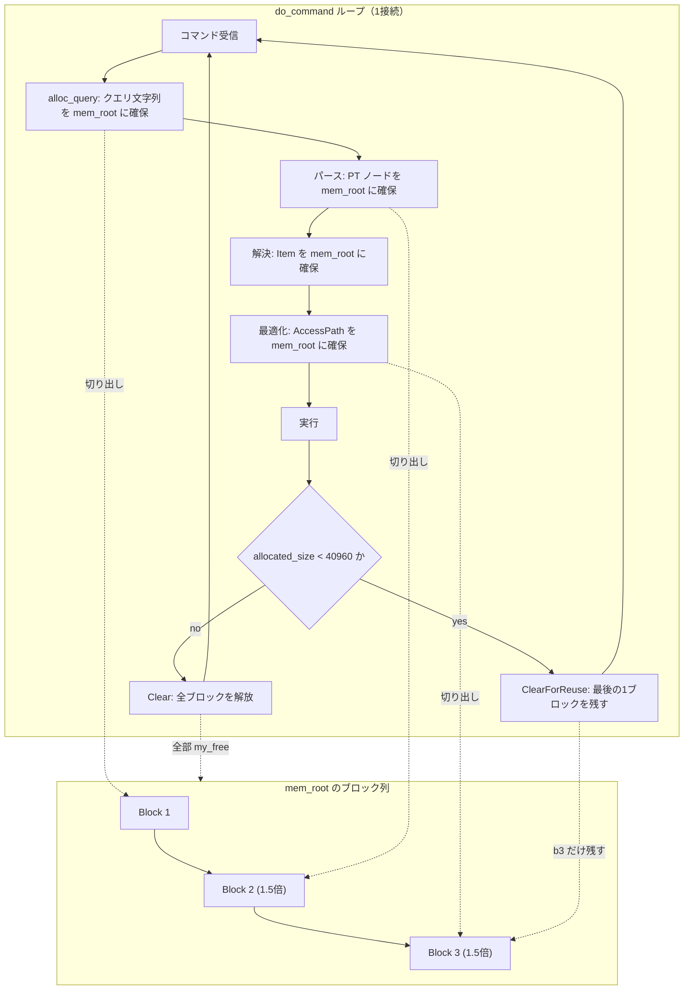

# 第37章 MEM_ROOT と文単位のメモリ寿命

> **本章で読むソース**
>
> - [`include/my_alloc.h`](https://github.com/mysql/mysql-server/blob/mysql-8.4.10/include/my_alloc.h)
> - [`mysys/my_alloc.cc`](https://github.com/mysql/mysql-server/blob/mysql-8.4.10/mysys/my_alloc.cc)
> - [`sql/sql_class.h`](https://github.com/mysql/mysql-server/blob/mysql-8.4.10/sql/sql_class.h)
> - [`sql/sql_class.cc`](https://github.com/mysql/mysql-server/blob/mysql-8.4.10/sql/sql_class.cc)
> - [`sql/sql_parse.cc`](https://github.com/mysql/mysql-server/blob/mysql-8.4.10/sql/sql_parse.cc)
> - [`sql/sql_prepare.h`](https://github.com/mysql/mysql-server/blob/mysql-8.4.10/sql/sql_prepare.h)

## この章の狙い

1つの SQL 文を処理する間に、サーバ層は無数の小さなオブジェクトを確保する。
パースツリーのノード、`Item`（式のノード）、`AccessPath`（実行計画の節点）、文字列のコピー、こうした断片が文1つにつき数百から数千個生まれる。
これらを個別に `malloc` し、文の終わりに1つずつ `free` していたのでは、確保と解放のコストもメモリの断片化も無視できない。

MySQL はこの問題を**アリーナ**と呼ばれる方式で解く。
アリーナは大きなメモリブロックを少数だけ OS から取り、その中から要求を切り出して渡す。
個々の確保に対応する解放は行わず、寿命をともにするオブジェクト群をまとめて1回で捨てる。
この章では、そのアリーナの実装である `MEM_ROOT`（`include/my_alloc.h`、`mysys/my_alloc.cc`）と、それが文の処理にどう結びついて寿命を区切るのかを読む。

文の処理に紐づくメモリの持ち主は `THD`（セッションオブジェクト）が抱える `MEM_ROOT` であり、文と文の境界でそれが一括解放される。
その境界がどこにあり、なぜ個別解放を不要にできるのかを、機構として説明する。

## 前提

第3章で、1接続を表すセッションオブジェクト `THD` と、そのスレッドが回すコマンドループ `do_command` を読んだ。
第4章で、パーサがパースツリーのノードを `thd->mem_root` 上に確保することを見た。
本章は、その `mem_root` の実体と寿命管理を掘り下げる位置にある。

対象はサーバ層（`sql/`、`mysys/`）に閉じており、ストレージエンジンには立ち入らない。

## MEM_ROOT はブロックを切り出すアリーナである

`MEM_ROOT` は構造体だが、設計上はクラスとして扱われる。
冒頭のコメントが、この型がアリーナであることと、その利点を述べている。

[`include/my_alloc.h` L52-L64](https://github.com/mysql/mysql-server/blob/mysql-8.4.10/include/my_alloc.h#L52-L64)

```cpp
/**
 * The MEM_ROOT is a simple arena, where allocations are carved out of
 * larger blocks. Using an arena over plain malloc gives you two main
 * advantages:
 *
 *   * Allocation is very cheap (only a few CPU cycles on the fast path).
 *   * You do not need to keep track of which memory you have allocated,
 *     as it will all be freed when the arena is destroyed.
 *
 * Thus, if you need to do many small allocations that all are to have
 * roughly the same lifetime, the MEM_ROOT is probably a good choice.
 * The flip side is that _no_ memory is freed until the arena is destroyed,
 * and no destructors are run (although you can run them manually yourself).
```

利点は2つである。
確保がほぼ数 CPU サイクルで済むこと、そしてどのメモリを確保したかを覚えておく必要がないことである。
裏返しとして、アリーナを破棄するまで個々のメモリは解放されず、デストラクタも自動では走らない。
だから「だいたい同じ寿命を持つ多数の小さな確保」にこそ向く。

内部状態は、確保したブロックの連結リストと、いま切り出し中のブロックの空き範囲を指す2つのポインタからなる。

[`include/my_alloc.h` L386-L399](https://github.com/mysql/mysql-server/blob/mysql-8.4.10/include/my_alloc.h#L386-L399)

```cpp
  /** The current block we are giving out memory from. nullptr if none. */
  Block *m_current_block = nullptr;

  /** Start (inclusive) of the current free block. */
  char *m_current_free_start = &s_dummy_target;

  /** End (exclusive) of the current free block. */
  char *m_current_free_end = &s_dummy_target;

  /** Size of the _next_ block we intend to allocate. */
  size_t m_block_size;

  /** The original block size the user asked for on construction. */
  size_t m_orig_block_size;
```

`m_current_free_start` から `m_current_free_end` までが、いま割り当てに使えるバイト範囲である。
ブロックは先頭に小さなヘッダ `Block` を持ち、`prev` で1つ前のブロックへつながる片方向リストになっている。

[`include/my_alloc.h` L85-L88](https://github.com/mysql/mysql-server/blob/mysql-8.4.10/include/my_alloc.h#L85-L88)

```cpp
  struct Block {
    Block *prev{nullptr}; /** Previous block; used for freeing. */
    char *end{nullptr};   /** One byte past the end; used for Contains(). */
  };
```

## 確保の速い経路と遅い経路

確保の本体は `Alloc` である。
要求サイズを8バイト境界へ切り上げ、いまのブロックに収まるなら、空き先頭ポインタを進めて返すだけで終わる。

[`include/my_alloc.h` L145-L166](https://github.com/mysql/mysql-server/blob/mysql-8.4.10/include/my_alloc.h#L145-L166)

```cpp
  void *Alloc(size_t length) MY_ATTRIBUTE((malloc)) {
    length = ALIGN_SIZE(length);

    // Skip the straight path if simulating OOM; it should always fail.
    DBUG_EXECUTE_IF("simulate_out_of_memory", return AllocSlow(length););

    // Fast path, used in the majority of cases. It would be faster here
    // (saving one register due to CSE) to instead test
    //
    //   m_current_free_start + length <= m_current_free_end
    //
    // but it would invoke undefined behavior, and in particular be prone
    // to wraparound on 32-bit platforms.
    if (static_cast<size_t>(m_current_free_end - m_current_free_start) >=
        length) {
      void *ret = m_current_free_start;
      m_current_free_start += length;
      return ret;
    }

    return AllocSlow(length);
  }
```

この速い経路が、確保の大多数を占める。
比較1つとポインタ加算1つしかなく、`malloc` の呼び出しもロックも入らない。

いまのブロックに収まらないときだけ `AllocSlow` へ落ちる。
ここで新しいブロックを OS から取る。

[`mysys/my_alloc.cc` L109-L152](https://github.com/mysql/mysql-server/blob/mysql-8.4.10/mysys/my_alloc.cc#L109-L152)

```cpp
void *MEM_ROOT::AllocSlow(size_t length) {
  DBUG_TRACE;
  DBUG_PRINT("enter", ("root: %p", this));

  // We need to allocate a new block to satisfy this allocation;
  // otherwise, the fast path in Alloc() would not have sent us here.
  // We plan to allocate a block of <block_size> bytes; see if that
  // would be enough or not.
  if (length >= m_block_size || MEM_ROOT_SINGLE_CHUNKS) {
    // The next block we'd allocate would _not_ be big enough
    // (or we're in Valgrind/ASAN mode, and want everything in single chunks).
    // Allocate an entirely new block, not disturbing anything;
    // since the new block isn't going to be used for the next allocation
    // anyway, we can just as well keep the previous one.
    Block *new_block =
        AllocBlock(/*wanted_length=*/length, /*minimum_length=*/length);
    if (new_block == nullptr) return nullptr;

    if (m_current_block == nullptr) {
      // This is the only block, so it has to be the current block, too.
      // However, it will be full, so we won't be allocating from it
      // unless ClearForReuse() is called.
      new_block->prev = nullptr;
      m_current_block = new_block;
      m_current_free_end = new_block->end;
      m_current_free_start = m_current_free_end;
    } else {
      // Insert the new block in the second-to-last position.
      new_block->prev = m_current_block->prev;
      m_current_block->prev = new_block;
    }

    return pointer_cast<char *>(new_block) + ALIGN_SIZE(sizeof(*new_block));
  } else {
    // The normal case: Throw away the current block, allocate a new block,
    // and use that to satisfy the new allocation.
    if (ForceNewBlock(/*minimum_length=*/length)) {
      return nullptr;
    }
    char *new_mem = m_current_free_start;
    m_current_free_start += length;
    return new_mem;
  }
}
```

要求が次に取るブロックサイズより大きい巨大な確保は、専用の1ブロックを取って既存のブロックを温存する。
普通の場合は、いまのブロックを捨てて新しいブロックへ切り替える。
捨てると言っても解放するのではなく、空き範囲だけを新ブロックへ移し、古いブロックは `prev` のリストに残したまま、解放のときまで保持する。

新しいブロックを取る `AllocBlock` には、アリーナの肝になる工夫が1つ入っている。
ブロックを取るたびに次回のブロックサイズを1.5倍へ広げる。

[`mysys/my_alloc.cc` L99-L107](https://github.com/mysql/mysql-server/blob/mysql-8.4.10/mysys/my_alloc.cc#L99-L107)

```cpp
  m_allocated_size += length;

  // Make the default block size 50% larger next time.
  // This ensures O(1) total mallocs (assuming Clear() is not called).
  if (!MEM_ROOT_SINGLE_CHUNKS) {
    m_block_size += m_block_size / 2;
  }
  return new_block;
}
```

ブロックを等倍で増やすと、確保量に比例した回数の `malloc` が必要になる。
1.5倍ずつ広げると、総確保量が増えても `malloc` の総回数は確保量の対数ではなく定数の係数に収まり、コメントが言うとおり総 `malloc` 回数が `O(1)`（償却定数）になる。
最初の文で大きめのブロックを取れば、続く小さな確保はほとんど速い経路だけで片付く。

## 一括解放と再利用

寿命の終わりに呼ばれるのが `Clear` である。
連結リストの先頭をローカルに退避してから内部状態を初期状態へ戻し、そのうえでブロック群をまとめて解放する。

[`mysys/my_alloc.cc` L172-L188](https://github.com/mysql/mysql-server/blob/mysql-8.4.10/mysys/my_alloc.cc#L172-L188)

```cpp
void MEM_ROOT::Clear() {
  DBUG_TRACE;
  DBUG_PRINT("enter", ("root: %p", this));

  // Already cleared, or memset() to zero, so just ignore.
  if (m_current_block == nullptr) return;

  Block *start = m_current_block;

  m_current_block = nullptr;
  m_block_size = m_orig_block_size;
  m_current_free_start = &s_dummy_target;
  m_current_free_end = &s_dummy_target;
  m_allocated_size = 0;

  FreeBlocks(start);
}
```

退避してから状態をリセットするのは、`MEM_ROOT` 自身がそのアリーナ上に置かれている場合に、解放の途中で自分自身に触れないようにするためである。
`FreeBlocks` は `prev` をたどってブロックを1つずつ `my_free` する。

[`mysys/my_alloc.cc` L212-L221](https://github.com/mysql/mysql-server/blob/mysql-8.4.10/mysys/my_alloc.cc#L212-L221)

```cpp
void MEM_ROOT::FreeBlocks(Block *start) {
  // The MEM_ROOT might be allocated on itself, so make sure we don't
  // touch it after we've started freeing.
  for (Block *block = start; block != nullptr;) {
    Block *prev = block->prev;
    TRASH(block, std::distance(pointer_cast<char *>(block), block->end));
    my_free(block);
    block = prev;
  }
}
```

文の終わりに `Clear` を1回呼べば、その文が確保した数千個のオブジェクトがブロック単位で一掃される。
個々の `Item` や `AccessPath` を追跡して解放する処理は要らない。
これが冒頭で見た「どのメモリを確保したかを覚えておく必要がない」の中身である。

ただし全部を OS へ返してしまうと、次の文がまた最初のブロックから取り直すことになる。
そこで `ClearForReuse` は、最後のブロック（多くは最も大きい）を1つだけ手元に残す。

[`mysys/my_alloc.cc` L190-L210](https://github.com/mysql/mysql-server/blob/mysql-8.4.10/mysys/my_alloc.cc#L190-L210)

```cpp
void MEM_ROOT::ClearForReuse() {
  DBUG_TRACE;

  if (MEM_ROOT_SINGLE_CHUNKS) {
    Clear();
    return;
  }

  // Already cleared, or memset() to zero, so just ignore.
  if (m_current_block == nullptr) return;

  // Keep the last block, which is usually the biggest one.
  m_current_free_start = pointer_cast<char *>(m_current_block) +
                         ALIGN_SIZE(sizeof(*m_current_block));
  Block *start = m_current_block->prev;
  m_current_block->prev = nullptr;
  m_allocated_size = m_current_free_end - m_current_free_start;
  TRASH(m_current_free_start, m_allocated_size);

  FreeBlocks(start);
}
```

残した1ブロックの空き範囲を先頭へ巻き戻し、それより前のブロックだけを解放する。
次の文は、このブロックから OS に問い合わせず即座に確保を始められる。
ブロックサイズ `m_block_size` を初期値へ戻さない点も `Clear` との違いで、前の文が広げたブロックサイズを引き継ぐ。

## Query_arena と THD の mem_root

アリーナを文の処理へ結びつけるのが `Query_arena` である。
このクラスは「いまどの `MEM_ROOT` から確保するか」を指すポインタと、その上に作った `Item` のリスト、文の実行状態を持つ。

[`sql/sql_class.h` L352-L361](https://github.com/mysql/mysql-server/blob/mysql-8.4.10/sql/sql_class.h#L352-L361)

```cpp
class Query_arena {
 private:
  /*
    List of items created for this query. Every item adds itself to the list
    on creation (see Item::Item() for details)
  */
  Item *m_item_list;

 public:
  MEM_ROOT *mem_root;  // Pointer to current memroot
```

`Query_arena::alloc` などの確保関数は、すべてこの `mem_root` ポインタへ委譲する。

[`sql/sql_class.h` L426-L444](https://github.com/mysql/mysql-server/blob/mysql-8.4.10/sql/sql_class.h#L426-L444)

```cpp
  void *alloc(size_t size) { return mem_root->Alloc(size); }
  void *mem_calloc(size_t size) {
    void *ptr;
    if ((ptr = mem_root->Alloc(size))) memset(ptr, 0, size);
    return ptr;
  }
  template <typename T>
  T *alloc_typed() {
    void *m = alloc(sizeof(T));
    return m == nullptr ? nullptr : new (m) T;
  }
  template <typename T>
  T *memdup_typed(const T *mem) {
    return static_cast<T *>(memdup_root(mem_root, mem, sizeof(T)));
  }
  char *mem_strdup(const char *str) { return strdup_root(mem_root, str); }
  char *strmake(const char *str, size_t size) const {
    return strmake_root(mem_root, str, size);
  }
```

`THD` は `Query_arena` を継承しており、セッションが回す文の確保はこの継承した `mem_root` を通る。

[`sql/sql_class.h` L952-L954](https://github.com/mysql/mysql-server/blob/mysql-8.4.10/sql/sql_class.h#L952-L954)

```cpp
class THD : public MDL_context_owner,
            public Query_arena,
            public Open_tables_state {
```

`mem_root` はポインタなので、実体となる `MEM_ROOT` は別に要る。
`THD` はその実体 `main_mem_root` を自身のメンバとして持つ。

[`sql/sql_class.h` L4465](https://github.com/mysql/mysql-server/blob/mysql-8.4.10/sql/sql_class.h#L4465)

```cpp
  MEM_ROOT main_mem_root;
```

`THD` の構築時に `main_mem_root` が初期化され、`Query_arena` の `mem_root` ポインタはこれを指すよう仕込まれる。

[`sql/sql_class.cc` L631](https://github.com/mysql/mysql-server/blob/mysql-8.4.10/sql/sql_class.cc#L631)

```cpp
    : Query_arena(&main_mem_root, STMT_REGULAR_EXECUTION),
```

通常の文では、パースツリーも実行時の確保も同じ `main_mem_root` に乗る。
`mem_root` ポインタを別の `MEM_ROOT` へ差し替えれば、以後の確保先がそちらへ切り替わる。
その差し替えは `set_query_arena` と、退避と復元を同時に行う `swap_query_arena` が担う。

[`sql/sql_class.cc` L2072-L2082](https://github.com/mysql/mysql-server/blob/mysql-8.4.10/sql/sql_class.cc#L2072-L2082)

```cpp
void Query_arena::set_query_arena(const Query_arena &set) {
  mem_root = set.mem_root;
  set_item_list(set.item_list());
  state = set.state;
}

void Query_arena::swap_query_arena(const Query_arena &source,
                                   Query_arena *backup) {
  backup->set_query_arena(*this);
  set_query_arena(source);
}
```

この差し替えの仕組みが、後で見るプリペアドステートメントの長い寿命を支える。

## コマンド境界で文用 MEM_ROOT が解放される

ここまでの部品が、文と文の境界でどう動くかを `dispatch_command` の末尾で確認する。
`do_command` がクライアントから1コマンドを読み、`dispatch_command` がそれを処理する。
`COM_QUERY` であれば、まず `alloc_query` がクエリ文字列のコピーを `thd->alloc` で `mem_root` 上に確保し、`THD` に載せる。

[`sql/sql_parse.cc` L2672-L2677](https://github.com/mysql/mysql-server/blob/mysql-8.4.10/sql/sql_parse.cc#L2672-L2677)

```cpp
  char *query = static_cast<char *>(thd->alloc(packet_length + 1));
  if (!query) return true;
  memcpy(query, packet, packet_length);
  query[packet_length] = '\0';

  thd->set_query(query, packet_length);
```

この文字列に始まり、パースツリー、`Item`、`AccessPath` まで、文の処理で生まれるオブジェクトはすべて `mem_root` 上に積まれていく。
そして処理が終わると、`dispatch_command` の末尾の後始末で、この `mem_root` がまとめて掃除される。

[`sql/sql_parse.cc` L2501-L2515](https://github.com/mysql/mysql-server/blob/mysql-8.4.10/sql/sql_parse.cc#L2501-L2515)

```cpp
  /*
    If we've allocated a lot of memory (compared to the default preallocation
    size = 8192; note that we don't actually preallocate anymore), free
    it so that one big query won't cause us to hold on to a lot of RAM forever.
    If not, keep the last block so that the next query will hopefully be able to
    run without allocating memory from the OS.

    The factor 5 is pretty much arbitrary, but ends up allowing three
    allocations (1 + 1.5 + 1.5²) under the current allocation policy.
  */
  constexpr size_t kPreallocSz = 40960;
  if (thd->mem_root->allocated_size() < kPreallocSz)
    thd->mem_root->ClearForReuse();
  else
    thd->mem_root->Clear();
```

ここで2つの掃除を使い分ける。
その文が確保した総量が `kPreallocSz`（40960 バイト）未満なら `ClearForReuse` で最後の1ブロックを残し、次の文の確保を OS への問い合わせなしで始められるようにする。
総量がしきい値を超えていれば `Clear` で全ブロックを返し、1つの大きなクエリが大量の RAM を抱え込み続けないようにする。
コメントが言う「係数5」は、デフォルトブロックサイズ 8192 の5倍がしきい値であり、1.5倍成長で3回ぶんの確保（1 + 1.5 + 1.5²）に相当する。

文ごとにこの掃除が走るので、文の処理中に積み上がったメモリの寿命は、ちょうど1コマンドの境界で区切られる。
個々のオブジェクトに対する `free` も `delete` も書かれていないのに、リークしないのはこのためである。

文の処理ライフサイクルと、その中でのブロック確保から一括解放までを図にすると次のようになる。



## プリペアドステートメントは別アリーナで寿命が長い

通常の文が `main_mem_root` の上で生き、コマンド境界で消えるのに対し、プリペアドステートメントはパースツリーをまたいで保持しなければならない。
1回 `PREPARE` した文を、何度も `EXECUTE` で再実行するからである。
そこで `Prepared_statement` は、自前の `MEM_ROOT` と `Query_arena` を持つ。

[`sql/sql_prepare.h` L152-L155](https://github.com/mysql/mysql-server/blob/mysql-8.4.10/sql/sql_prepare.h#L152-L155)

```cpp
class Prepared_statement final {
 public:
  /// Memory allocation arena, for permanent allocations to statement.
  Query_arena m_arena;
```

このアリーナに置かれたパースツリーは、`PREPARE` から `DEALLOCATE` までという、1コマンドより長い寿命を持つ。
実行のたびの一時オブジェクトは別の実行時 `mem_root` へ振り分けられ、各実行の終わりに捨てられる。
この振り分けに、前節で見た `swap_query_arena` による `mem_root` ポインタの差し替えが使われる。
恒久的なツリーは長寿命のアリーナへ、使い捨ての一時オブジェクトは短命のアリーナへと、確保先を文の状態に応じて切り替える。

## まとめ

`MEM_ROOT` は、大きなブロックを少数だけ OS から取り、要求をその中から切り出すアリーナである。
確保の速い経路は比較1つとポインタ加算1つで終わり、ブロックサイズを1.5倍ずつ広げることで総 `malloc` 回数を償却定数に抑える。
個々の解放は行わず、`Clear` で全ブロックを、`ClearForReuse` で最後の1ブロックを残して一掃する。

この一括解放が、文単位のメモリ寿命を成立させる。
`THD` は `Query_arena` を継承し、`main_mem_root` を文の確保先として持つ。
パースツリー、`Item`、`AccessPath`、クエリ文字列まで、文が生むオブジェクトはこの `mem_root` に積まれ、`dispatch_command` の末尾でコマンド境界ごとにまとめて解放される。
だから個々のオブジェクトに `free` を書かなくてもリークしない。

最適化の機構を1つ挙げれば、文の終わりにアリーナを一括解放する設計そのものである。
多数の小さな確保を個別に解放する手間と、それに伴う断片化を避け、なおかつ `ClearForReuse` で1ブロックを再利用して次の文の最初の確保を OS への問い合わせなしで済ませる。

## 関連する章

- [第4章 パーサ](../part01-sql-layer/04-parser.md)：パースツリーのノードを `mem_root` 上に確保する `NEW_PTN` と、パース前後の `mem_root` への上限設定を扱う。
- [第3章 コネクション、スレッド、セッション](../part00-introduction/03-connection-thread-session.md)：`THD` とコマンドループ `do_command` の入口を扱う。
