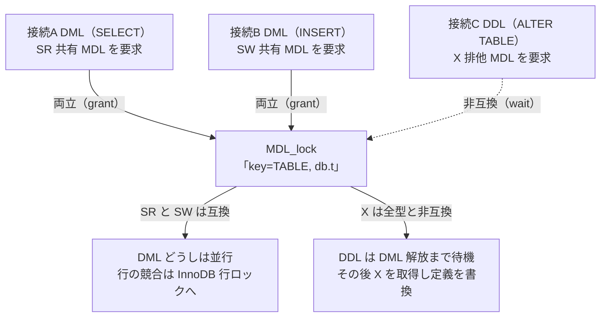

# 第39章 メタデータロック（MDL）

> **本章で読むソース**
>
> - [`sql/mdl.h`](https://github.com/mysql/mysql-server/blob/mysql-8.4.10/sql/mdl.h)
> - [`sql/mdl.cc`](https://github.com/mysql/mysql-server/blob/mysql-8.4.10/sql/mdl.cc)
> - [`sql/sql_base.cc`](https://github.com/mysql/mysql-server/blob/mysql-8.4.10/sql/sql_base.cc)
> - [`sql/table.h`](https://github.com/mysql/mysql-server/blob/mysql-8.4.10/sql/table.h)

## この章の狙い

第26章で読んだ InnoDB の行ロックは、トランザクションが触る個々の行を、ストレージエンジンの内部で保護していた。
しかし行ロックだけでは守れないものがある。
`SELECT * FROM t` を実行している最中に、別の接続が `DROP TABLE t` や `ALTER TABLE t` を走らせてテーブル定義そのものを消したり作り変えたりすると、実行中の文が前提にしていた列構成やインデックスが足元から崩れる。
これを防ぐのが本章の**メタデータロック**（MDL）である。

MDL は、テーブルやスキーマといったオブジェクトの定義を、文やトランザクションをまたいで保護する。
行ロックが InnoDB の内部にあるのに対し、MDL は SQL を解釈するサーバ層に置かれ、ストレージエンジンより上の階層で働く。
PostgreSQL 編でロックマネージャを独立章として読んだのと同じ位置づけの仕組みである。

本章で押さえる要点は3つある。
第1に、MDL は「どのオブジェクトか」を表すキーと、「どの強さか」を表す型と、「いつまで保持するか」を表す期間の三つで要求を表現する。
第2に、DML は弱い共有ロックを取り、DDL は排他ロックを取る。
読み書きの DML どうしは並行を許しつつ、DDL とだけ衝突させる規則が、型ごとの互換性行列に書かれている。
第3に、ロックが取れずに待つとき、待ちが循環すればデッドロックとして検出する。
MDL の待ちグラフは「各接続が待つ相手は高々1つ」という性質を持つため、循環検出は単純な深さ優先探索で済む。

## 前提

第3章で読んだとおり、各クライアント接続は `THD` を持ち、その中に MDL の保持状態を表す `MDL_context` が1つ置かれる。
第31章で読んだ DDL は、テーブル定義を書き換える前に MDL の排他ロックを取り、書き換えが終わるまで保持する。
本章は、その DDL と、第9章以降で読んだ DML の実行とが、テーブルオープンの時点でどう調停されるかを下から読む。

## オブジェクトと型と期間

MDL の要求は `MDL_request` で表される。
要求は3つの情報を持つ。
第1に、どのオブジェクトを対象にするかを表す `key`（後述の `MDL_key`）。
第2に、どの強さのロックかを表す `type`。
第3に、いつまで保持するかを表す `duration` である。

[`sql/mdl.h` L802-L807](https://github.com/mysql/mysql-server/blob/mysql-8.4.10/sql/mdl.h#L802-L807)

```cpp
class MDL_request {
 public:
  /** Type of metadata lock. */
  enum_mdl_type type{MDL_INTENTION_EXCLUSIVE};
  /** Duration for requested lock. */
  enum_mdl_duration duration{MDL_STATEMENT};
```

要求が満たされると、許可されたロックは `MDL_ticket` として表現され、`MDL_request::ticket` がそれを指す。
要求とチケットを別クラスに分けるのは、両者の寿命と確保場所が違うためである。
要求は MDL の外側（SQL 層）が確保し、チケットは MDL の内部が確保する。

[`sql/mdl.h` L792-L800](https://github.com/mysql/mysql-server/blob/mysql-8.4.10/sql/mdl.h#L792-L800)

```cpp
/**
  A pending metadata lock request.

  A lock request and a granted metadata lock are represented by
  different classes because they have different allocation
  sites and hence different lifetimes. The allocation of lock requests is
  controlled from outside of the MDL subsystem, while allocation of granted
  locks (tickets) is controlled within the MDL subsystem.
*/
```

### 対象を指すキー

どのオブジェクトを保護するかは `MDL_key` で表される。
キーはオブジェクトの種類を表す**名前空間**と、完全修飾名（データベース名とオブジェクト名）からなる。
名前空間には、テーブルやビューを表す `TABLE`、スキーマを表す `SCHEMA`、テーブルスペースを表す `TABLESPACE`、ストアドファンクションを表す `FUNCTION` などがある。

[`sql/mdl.h` L400-L421](https://github.com/mysql/mysql-server/blob/mysql-8.4.10/sql/mdl.h#L400-L421)

```cpp
  enum enum_mdl_namespace {
    GLOBAL = 0,
    BACKUP_LOCK,
    TABLESPACE,
    SCHEMA,
    TABLE,
    FUNCTION,
    PROCEDURE,
    TRIGGER,
    EVENT,
    COMMIT,
    USER_LEVEL_LOCK,
    LOCKING_SERVICE,
    SRID,
    ACL_CACHE,
    COLUMN_STATISTICS,
    RESOURCE_GROUPS,
    FOREIGN_KEY,
    CHECK_CONSTRAINT,
    /* This should be the last ! */
    NAMESPACE_END
  };
```

名前空間とフルネームでオブジェクトを識別するため、同じテーブルに対する複数接続の要求は、同じ `MDL_key` に集約される。
この集約先が、後で読む `MDL_lock` である。

### 強さを表す型

ロックの強さは `enum_mdl_type` で表される。
弱いものから強いものへ並んでおり、本章で要点になるのは次の4つである。

`MDL_SHARED_READ`（SR）：テーブルからデータを読む意図がある共有ロックである。
`SELECT` やサブクエリのテーブルが取る。

`MDL_SHARED_WRITE`（SW）：テーブルのデータを変更する意図がある共有ロックである。
`INSERT`、`UPDATE`、`DELETE` のテーブルが取る。

`MDL_SHARED_UPGRADABLE`（SU）：データの読みと並行更新を許す、昇格可能な共有ロックである。
`ALTER TABLE` の第1段階が取り、後で SNW や X へ昇格する。

`MDL_EXCLUSIVE`（X）：テーブルの定義とデータの両方を変更できる排他ロックである。
このロックを保持する間、他のいかなる型のロックも許可されない。
`CREATE`、`DROP`、`RENAME TABLE` と、他の DDL の特定の段階が取る。

ソースのコメントは、それぞれの型がどの文で使われるかを明記している。
SW の説明は次のとおりである。

[`sql/mdl.h` L260-L269](https://github.com/mysql/mysql-server/blob/mysql-8.4.10/sql/mdl.h#L260-L269)

```cpp
  /*
    A shared metadata lock for cases when there is an intention to modify
    (and not just read) data in the table.
    A connection holding SW lock can read table metadata and modify or read
    table data (after acquiring appropriate table and row-level locks).
    To be used for tables to be modified by INSERT, UPDATE, DELETE
    statements, but not LOCK TABLE ... WRITE or DDL). Also taken by
    SELECT ... FOR UPDATE.
  */
  MDL_SHARED_WRITE,
```

排他ロック X の説明は次のとおりである。

[`sql/mdl.h` L319-L329](https://github.com/mysql/mysql-server/blob/mysql-8.4.10/sql/mdl.h#L319-L329)

```cpp
  /*
    An exclusive metadata lock.
    A connection holding this lock can modify both table's metadata and data.
    No other type of metadata lock can be granted while this lock is held.
    To be used for CREATE/DROP/RENAME TABLE statements and for execution of
    certain phases of other DDL statements.
  */
  MDL_EXCLUSIVE,
  /* This should be the last !!! */
  MDL_TYPE_END
};
```

DML が SR や SW を取り、DDL が X を取る。
この型の選び方が、読み書きの並行と DDL の安全をどう両立させるかは「DML と DDL の衝突」の節で読む。

### 保持する期間

ロックをいつまで握るかは `enum_mdl_duration` で表される。

[`sql/mdl.h` L333-L351](https://github.com/mysql/mysql-server/blob/mysql-8.4.10/sql/mdl.h#L333-L351)

```cpp
enum enum_mdl_duration {
  /**
    Locks with statement duration are automatically released at the end
    of statement or transaction.
  */
  MDL_STATEMENT = 0,
  /**
    Locks with transaction duration are automatically released at the end
    of transaction.
  */
  MDL_TRANSACTION,
  /**
    Locks with explicit duration survive the end of statement and transaction.
    They have to be released explicitly by calling MDL_context::release_lock().
  */
  MDL_EXPLICIT,
  /* This should be the last ! */
  MDL_DURATION_END
};
```

`MDL_STATEMENT` は文の終わりで解放される。
`MDL_TRANSACTION` はトランザクションの終わりまで保持される。
`MDL_EXPLICIT` は文とトランザクションをまたいで生き残り、明示的な解放呼び出しを必要とする。
DML や DDL がテーブルに対して取るロックは `MDL_TRANSACTION` 期間で、これが「文をまたいでテーブル定義を守る」という MDL の役割を支える。
あるトランザクションが `t` に SW を取れば、そのロックはコミットまで保持され、その間 `t` に X を取ろうとする DDL は待たされる。

## DML がテーブルを開くとき MDL を取る

DML や DDL がテーブルを使うには、まずテーブルを開く必要がある。
第9章以降で読んだ実行は、その前段でテーブルを開き、定義をテーブル定義キャッシュから取る。
このテーブルオープンの中で MDL が取得される。
`open_table` から呼ばれる `open_table_get_mdl_lock` が、その取得を担う。

[`sql/sql_base.cc` L2674-L2677](https://github.com/mysql/mysql-server/blob/mysql-8.4.10/sql/sql_base.cc#L2674-L2677)

```cpp
static bool open_table_get_mdl_lock(THD *thd, Open_table_context *ot_ctx,
                                    Table_ref *table_list, uint flags,
                                    MDL_ticket **mdl_ticket) {
  MDL_request *mdl_request = &table_list->mdl_request;
```

要求の型（SR か SW か）は、その文がそのテーブルを読むのか書くのかから決まる。
対応づけは `mdl_type_for_dml` が行う。

[`sql/table.h` L2797-L2802](https://github.com/mysql/mysql-server/blob/mysql-8.4.10/sql/table.h#L2797-L2802)

```cpp
inline enum enum_mdl_type mdl_type_for_dml(enum thr_lock_type lock_type) {
  return lock_type >= TL_WRITE_ALLOW_WRITE
             ? (lock_type == TL_WRITE_LOW_PRIORITY ? MDL_SHARED_WRITE_LOW_PRIO
                                                   : MDL_SHARED_WRITE)
             : MDL_SHARED_READ;
}
```

書き込みのテーブルロックなら SW を、それ以外なら SR を返す。
こうして `SELECT` のテーブルには SR が、`INSERT` や `UPDATE` のテーブルには SW が要求として設定される。

通常のテーブルオープンでは、`open_table_get_mdl_lock` は `MDL_context::acquire_lock` を呼ぶ。
衝突するロックがあれば、`acquire_lock` はそれが消えるまで待つ。

[`sql/sql_base.cc` L2783-L2792](https://github.com/mysql/mysql-server/blob/mysql-8.4.10/sql/sql_base.cc#L2783-L2792)

```cpp
    MDL_deadlock_handler mdl_deadlock_handler(ot_ctx);

    thd->push_internal_handler(&mdl_deadlock_handler);
    thd->mdl_context.set_force_dml_deadlock_weight(ot_ctx->can_back_off());

    bool result =
        thd->mdl_context.acquire_lock(mdl_request, ot_ctx->get_timeout());

    thd->mdl_context.set_force_dml_deadlock_weight(false);
    thd->pop_internal_handler();
```

待ちがデッドロックになった場合に備えて、`acquire_lock` の前に `MDL_deadlock_handler` を内部ハンドラとして積む。
MDL のデッドロックが検出されると、このハンドラがバックオフと再試行を要求し、ユーザーにエラーを返さずに済ませようとする。

## ロックを取る経路

`MDL_context::acquire_lock` がロック取得の中心である。
まず待たずに取れるかを試し、取れなければ待機に入る。

[`sql/mdl.cc` L3401-L3410](https://github.com/mysql/mysql-server/blob/mysql-8.4.10/sql/mdl.cc#L3401-L3410)

```cpp
  if (try_acquire_lock_impl(mdl_request, &ticket)) return true;

  if (mdl_request->ticket) {
    /*
      We have managed to acquire lock without waiting.
      MDL_lock, MDL_context and MDL_request were updated
      accordingly, so we can simply return success.
    */
    return false;
  }
```

`try_acquire_lock_impl` が即座に成功すれば、`mdl_request->ticket` が埋まり、待たずに帰る。
即座には取れなかったときは、チケットが待機列に並び、待機に入る。

[`sql/mdl.cc` L3418-L3432](https://github.com/mysql/mysql-server/blob/mysql-8.4.10/sql/mdl.cc#L3418-L3432)

```cpp
  lock = ticket->m_lock;

  lock->m_waiting.add_ticket(ticket);

  /*
    Once we added a pending ticket to the waiting queue,
    we must ensure that our wait slot is empty, so
    that our lock request can be scheduled. Do that in the
    critical section formed by the acquired write lock on MDL_lock.
  */
  m_wait.reset_status();

  if (lock->needs_notification(ticket)) lock->notify_conflicting_locks(this);

  mysql_prlock_unlock(&lock->m_rwlock);
```

待機に入る前に、自分が何を待っているかをデッドロック検出器へ知らせ、検出を走らせる。

[`sql/mdl.cc` L3444-L3447](https://github.com/mysql/mysql-server/blob/mysql-8.4.10/sql/mdl.cc#L3444-L3447)

```cpp
  will_wait_for(ticket);

  /* There is a shared or exclusive lock on the object. */
  DEBUG_SYNC(get_thd(), "mdl_acquire_lock_wait");
```

`will_wait_for` は、この接続が待つ相手のチケットを `m_waiting_for` に記録する。
これが待ちグラフの辺になる。
記録のあと `find_deadlock` を呼び、辺を足したことで循環ができていないかを調べる。

待機後に許可された場合は、チケットを保持リストへ加えて要求に結びつける。

[`sql/mdl.cc` L3586-L3594](https://github.com/mysql/mysql-server/blob/mysql-8.4.10/sql/mdl.cc#L3586-L3594)

```cpp
  assert(wait_status == MDL_wait::GRANTED);

  m_ticket_store.push_front(mdl_request->duration, ticket);
  mdl_request->ticket = ticket;

  mysql_mdl_set_status(ticket->m_psi, MDL_ticket::GRANTED);

  return false;
}
```

待機が許可ではなく、デッドロックの犠牲（VICTIM）、タイムアウト、kill で終わったときは、チケットを待機列から外して破棄し、対応するエラーを立てて失敗を返す。

## DML と DDL の衝突

ロックを取れるかどうかは、同じオブジェクトに並ぶ既存ロックとの互換性で決まる。
判定は `MDL_lock::can_grant_lock` が行う。

[`sql/mdl.cc` L2396-L2414](https://github.com/mysql/mysql-server/blob/mysql-8.4.10/sql/mdl.cc#L2396-L2414)

```cpp
bool MDL_lock::can_grant_lock(enum_mdl_type type_arg,
                              const MDL_context *requestor_ctx) const {
  bool can_grant = false;
  const bitmap_t waiting_incompat_map =
      incompatible_waiting_types_bitmap()[type_arg];
  const bitmap_t granted_incompat_map =
      incompatible_granted_types_bitmap()[type_arg];

  /*
    New lock request can be satisfied iff:
    - There are no incompatible types of satisfied requests
    in other contexts
    - There are no waiting requests which have higher priority
    than this request.
  */
  if (!(m_waiting.bitmap() & waiting_incompat_map)) {
    if (!(fast_path_granted_bitmap() & granted_incompat_map)) {
      if (!(m_granted.bitmap() & granted_incompat_map))
        can_grant = true;
```

判定は2つの条件で書かれる。
要求する型と非互換な、許可済みロックが他の接続に存在しないこと。
そして、要求する型より優先度の高い待機要求が存在しないこと。
非互換の集合は、要求する型ごとにビットマップとして表に持つ。

この表が、テーブル単位の MDL について `MDL_object_lock` の互換性行列に書かれている。
許可済みロックとの非互換を表す部分は、コメントの行列がそのまま読める。

[`sql/mdl.cc` L2194-L2206](https://github.com/mysql/mysql-server/blob/mysql-8.4.10/sql/mdl.cc#L2194-L2206)

```cpp
         Request  |  Granted requests for lock            |
          type    | S  SH  SR  SW  SWLP  SU  SRO  SNW  SNRW  X  |
        ----------+---------------------------------------------+
        S         | +   +   +   +    +    +   +    +    +    -  |
        SH        | +   +   +   +    +    +   +    +    +    -  |
        SR        | +   +   +   +    +    +   +    +    -    -  |
        SW        | +   +   +   +    +    +   -    -    -    -  |
        SWLP      | +   +   +   +    +    +   -    -    -    -  |
        SU        | +   +   +   +    +    -   +    -    -    -  |
        SRO       | +   +   +   -    -    +   +    +    -    -  |
        SNW       | +   +   +   -    -    -   +    -    -    -  |
        SNRW      | +   +   -   -    -    -   -    -    -    -  |
        X         | -   -   -   -    -    -   -    -    -    -  |
```

行が要求する型、列が許可済みの型で、`+` は両立、`-` は待ちを表す。
要点は2つの行に表れている。
SR の行と SW の行を見ると、SR と SW どうし（S、SH、SR、SW の列）はすべて `+` である。
すなわち、読みの DML と書きの DML は、同じテーブルに対して MDL のレベルでは並行を許される。
書きの DML どうしを実際にどう調停するかは、第26章で読んだ InnoDB の行ロックが下の階層で受け持つ。

いっぽう X の行は、全ての列が `-` である。
X を取ろうとする DDL は、SR だろうと SW だろうと既存の共有ロックがあれば待たされる。
逆に、SR と SW の行の最後の列（X）はどちらも `-` で、X が許可済みなら DML は待たされる。

この非対称が「DML どうしは並行、DDL とだけ衝突」を作る。
読み書きの DML を細かい型（SR、SW）に分け、それらを互いに互換にしておくことで、共通の `SELECT` や `INSERT` が MDL で衝突しない。
そのうえで X だけを全型と非互換にすることで、DDL は実行中の DML がすべて終わるのを待ってから定義を書き換える。



## 待ちの循環を検出する

X を待つ DDL と、その DDL が握るロックを待つ別の DML とが噛み合うと、待ちが循環してデッドラインに陥りうる。
MDL はこれを待ちグラフの循環として検出する。
鍵は、各接続が待つ相手を1つだけ記録する点にある。

[`sql/mdl.h` L1643-L1650](https://github.com/mysql/mysql-server/blob/mysql-8.4.10/sql/mdl.h#L1643-L1650)

```cpp
  /**
    Tell the deadlock detector what metadata lock or table
    definition cache entry this session is waiting for.
    In principle, this is redundant, as information can be found
    by inspecting waiting queues, but we'd very much like it to be
    readily available to the wait-for graph iterator.
   */
  MDL_wait_for_subgraph *m_waiting_for;
```

`m_waiting_for` は、この接続が待っているサブグラフ（チケット）への辺を1本だけ持つ。
1接続から出る待ち辺が高々1本だから、グラフをたどる検出は分岐のない一筋の探索になる。
`visit_subgraph` がその辺をたどる。

[`sql/mdl.cc` L4026-L4036](https://github.com/mysql/mysql-server/blob/mysql-8.4.10/sql/mdl.cc#L4026-L4036)

```cpp
bool MDL_context::visit_subgraph(MDL_wait_for_graph_visitor *gvisitor) {
  bool result = false;

  mysql_prlock_rdlock(&m_LOCK_waiting_for);

  if (m_waiting_for) result = m_waiting_for->accept_visitor(gvisitor);

  mysql_prlock_unlock(&m_LOCK_waiting_for);

  return result;
}
```

探索を進める訪問者が `Deadlock_detection_visitor` である。
辺をたどって次の接続へ移るたびに `enter_node` で深さを増やし、最初の接続へ戻ってくれば循環、すなわちデッドロックと判定する。

[`sql/mdl.cc` L386-L389](https://github.com/mysql/mysql-server/blob/mysql-8.4.10/sql/mdl.cc#L386-L389)

```cpp
bool Deadlock_detection_visitor::inspect_edge(MDL_context *node) {
  m_found_deadlock = node == m_start_node;
  return m_found_deadlock;
}
```

探索の起点へ戻る辺を見つけた瞬間に循環が確定する。
循環が見つからなくても、探索の深さが上限 `MAX_SEARCH_DEPTH`（32）に達したら、無条件にデッドロックとみなす。

[`sql/mdl.cc` L357-L364](https://github.com/mysql/mysql-server/blob/mysql-8.4.10/sql/mdl.cc#L357-L364)

```cpp
bool Deadlock_detection_visitor::enter_node(MDL_context *node) {
  m_found_deadlock = ++m_current_search_depth >= MAX_SEARCH_DEPTH;
  if (m_found_deadlock) {
    assert(!m_victim);
    opt_change_victim_to(node);
  }
  return m_found_deadlock;
}
```

これは再帰探索でスタックを使い果たさないための上限である。
実際のデッドロックの環は短いことが多いため、深い探索を打ち切っても実害が小さいと考えられる。

循環が見つかったときは、`find_deadlock` が犠牲となる接続を選んでその待機状態を VICTIM にし、待ちを断ち切る。

[`sql/mdl.cc` L4053-L4078](https://github.com/mysql/mysql-server/blob/mysql-8.4.10/sql/mdl.cc#L4053-L4078)

```cpp
    Deadlock_detection_visitor dvisitor(this);
    MDL_context *victim;

    if (!visit_subgraph(&dvisitor)) {
      /* No deadlocks are found! */
      break;
    }

    victim = dvisitor.get_victim();

    /*
      Failure to change status of the victim is OK as it means
      that the victim has received some other message and is
      about to stop its waiting/to break deadlock loop.
      Even when the initiator of the deadlock search is
      chosen the victim, we need to set the respective wait
      result in order to "close" it for any attempt to
      schedule the request.
      This is needed to avoid a possible race during
      cleanup in case when the lock request on which the
      context was waiting is concurrently satisfied.
    */
    (void)victim->m_wait.set_status(MDL_wait::VICTIM);
    victim->unlock_deadlock_victim();

    if (victim == this) break;
```

犠牲は `get_deadlock_weight` の重みが軽い接続から選ばれる。
先に読んだ `open_table_get_mdl_lock` が DML の重みを強制していたのは、DDL ではなく DML 側を犠牲にし、バックオフと再試行で吸収させるためだった。

ここで検出できるのは、待ち辺がすべて MDL の中で閉じている循環に限る。
InnoDB の行ロック待ちのように MDL から見えない辺を含む循環は、この検出器では捉えられず、`lock_wait_timeout` などのタイムアウトでのみ解消される。
`open_table_get_mdl_lock` のコメントは、その例を具体的に挙げている。

## 高速化の工夫：DML 共通ロックの fast path

MDL の取得と解放は、衝突判定のために `m_waiting` と `m_granted` のビットマップやリストを操作する。
この操作は `MDL_lock::m_rwlock` のクリティカルセクションの中で行うため、接続数が増えると競合点になる。

そこで MDL は、ロック型を2つの集合に分ける。
一方は**unobtrusive**な型で、集合内の全ての型どうしが互換であり、DML で共通に使われるものである。
他方は**obtrusive**な型で、他の型や自分自身と非互換になりうるものである。

[`sql/mdl.cc` L694-L709](https://github.com/mysql/mysql-server/blob/mysql-8.4.10/sql/mdl.cc#L694-L709)

```cpp
    @note We split all lock types for each of MDL namespaces
          in two sets:

          A) "unobtrusive" lock types
            1) Each type from this set should be compatible with all other
               types from the set (including itself).
            2) These types should be common for DML operations

          Our goal is to optimize acquisition and release of locks of this
          type by avoiding complex checks and manipulations on m_waiting/
          m_granted bitmaps/lists. We replace them with a check of and
          increment/decrement of integer counters.
          We call the latter type of acquisition/release "fast path".
          Use of "fast path" reduces the size of critical section associated
          with MDL_lock::m_rwlock lock in the common case and thus increases
          scalability.
```

unobtrusive な型（SR や SW などの DML 共通ロック）は、互いに必ず互換だという性質を使う。
取得や解放のたびにリストへ出し入れせず、`m_fast_path_state` に詰めた整数カウンタを原子的に増減するだけで済ませる。
これを**fast path**と呼ぶ。
ビットマップやリストの走査を伴うクリティカルセクションを避けるため、`SELECT` や `INSERT` が大量に走る通常の負荷で MDL の競合が減り、スケーラビリティが上がる。

obtrusive な型（X など）は他と衝突しうるため、従来どおりリストとビットマップを操作する**slow path**で取得する。
さらに、obtrusive なロックが許可中または待機中のときは、unobtrusive な型でも slow path に落とす。
DDL が走っているテーブルでは fast path を使わず、衝突を正しく判定するためである。

このように、衝突しない DML 共通ロックだけを軽い経路に乗せ、衝突しうる DDL のロックは正確な経路に残す。
「DML どうしは並行、DDL とだけ衝突」という型の設計が、ここでも高速化の前提になっている。

## まとめ

MDL は、テーブルやスキーマの定義を文やトランザクションをまたいで保護する、サーバ層のオブジェクトロックである。
要求は対象を指す `MDL_key`、強さを表す `enum_mdl_type`、保持期間を表す `enum_mdl_duration` の三つで表現され、許可されると `MDL_ticket` になる。
DML はテーブルオープン時に SR や SW の共有ロックを取り、DDL は X の排他ロックを取る。

型ごとの互換性行列は、SR と SW どうしを互換にしつつ X を全型と非互換にすることで、読み書きの DML を並行させながら DDL とだけ衝突させる。
ロックが取れずに待つときは、各接続が待つ相手を1つだけ記録する待ちグラフを単純な深さ優先探索でたどり、循環をデッドロックとして検出する。
DML 共通ロックを fast path のカウンタ操作に乗せる最適化は、この型の設計を前提に MDL の競合を減らす。

## 関連する章

- [第26章 ロック](../part04-transaction-concurrency/26-locking.md)：MDL の下の階層で、行の競合を調停する InnoDB の行ロック。
- [第31章 オンライン DDL とインスタント DDL](../part06-dictionary-ddl-ops/31-online-and-instant-ddl.md)：MDL の排他ロックを取って定義を書き換える DDL の実装。
- [第30章 データディクショナリ](../part06-dictionary-ddl-ops/30-data-dictionary.md)：MDL が保護するテーブル定義の格納先。
- [第3章 接続、スレッド、セッション](../part00-introduction/03-connection-thread-session.md)：`MDL_context` を抱える `THD` の生成。
