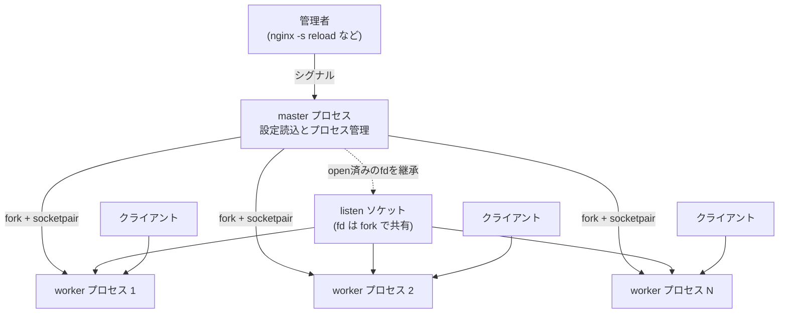
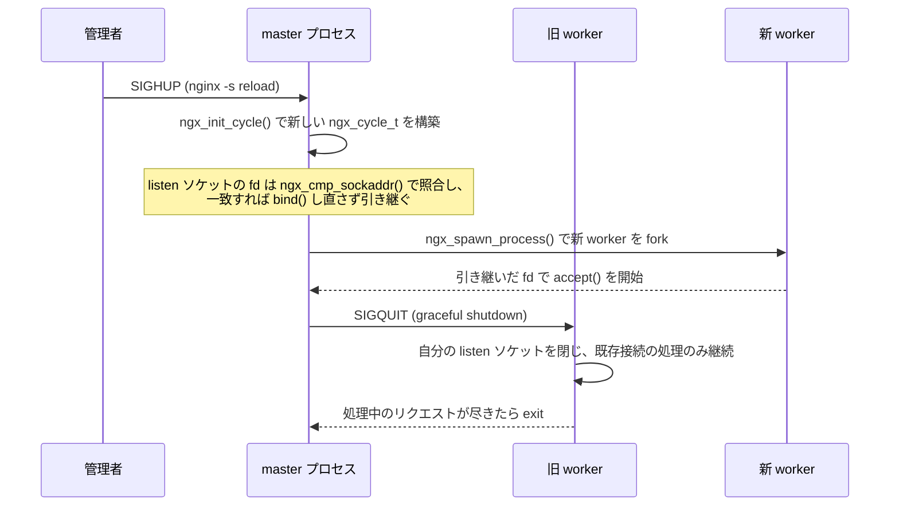

# 第1章 nginx とは何かとプロセスモデル

> **本章で読むソース**
>
> - [`src/core/nginx.c`](https://github.com/nginx/nginx/blob/release-1.31.2/src/core/nginx.c)
> - [`src/core/nginx.h`](https://github.com/nginx/nginx/blob/release-1.31.2/src/core/nginx.h)
> - [`src/core/ngx_cycle.h`](https://github.com/nginx/nginx/blob/release-1.31.2/src/core/ngx_cycle.h)
> - [`src/core/ngx_cycle.c`](https://github.com/nginx/nginx/blob/release-1.31.2/src/core/ngx_cycle.c)
> - [`src/core/ngx_connection.c`](https://github.com/nginx/nginx/blob/release-1.31.2/src/core/ngx_connection.c)
> - [`src/os/unix/ngx_process_cycle.c`](https://github.com/nginx/nginx/blob/release-1.31.2/src/os/unix/ngx_process_cycle.c)
> - [`src/os/unix/ngx_process.c`](https://github.com/nginx/nginx/blob/release-1.31.2/src/os/unix/ngx_process.c)
> - [`src/os/unix/ngx_process.h`](https://github.com/nginx/nginx/blob/release-1.31.2/src/os/unix/ngx_process.h)
> - [`src/os/unix/ngx_channel.c`](https://github.com/nginx/nginx/blob/release-1.31.2/src/os/unix/ngx_channel.c)
> - [`src/os/unix/ngx_channel.h`](https://github.com/nginx/nginx/blob/release-1.31.2/src/os/unix/ngx_channel.h)

## この章の狙い

nginx のソースコードを読み始めるにあたり、プロセスの起動から終了までの全体像を先に押さえる。
`main()` が呼び出す `ngx_init_cycle()` と `ngx_master_process_cycle()` を軸に、設定の読込から worker プロセスの生成、シグナルによる設定リロードまでの流れを追う。
以降の章はこのプロセスモデルの上に構築されるサブシステム（メモリプール、イベントループ、HTTP エンジンなど）を扱うため、本章はその土台にあたる。

## 前提

C 言語の基本的な文法と、fork、exec、シグナル、socketpair といった POSIX のプロセス間通信の基礎知識を前提とする。
listen や accept など TCP ソケットの基本操作も既知として説明する。

## イベント駆動サーバーとしての nginx

**nginx** は、HTTP サーバーおよびリバースプロキシとして動作するイベント駆動型のソフトウェアである。
Apache HTTP Server に代表される、接続ごとにプロセスやスレッドを割り当てる方式は、同時接続数が数千を超えるあたりからメモリとコンテキストスイッチのコストで頭打ちになる。
nginx は、少数の **worker プロセス**がそれぞれ1つの**イベントループ**で多数の接続を多重化して処理する方式でこれに応える。
Igor Sysoev は、いわゆる C10K 問題（同時接続1万を超えるあたりからサーバーの性能が劣化する問題）への設計上の回答として、2002年からこの方式で nginx の開発を始めた。

## master プロセスと worker プロセスの役割分担

nginx の実行時プロセスは、**master プロセス**と**worker プロセス**の2種類に分かれる。
「master プロセス」は設定ファイルの読込、`worker_processes` の数だけの worker プロセスの起動と監視、シグナルの受信を担う。
「worker プロセス」はクライアントとの接続をすべて処理し、HTTP リクエストの受理からレスポンス送信までを行う。
master プロセス自身はリクエストを処理しない。



この役割分担は、設定ディレクティブ `master_process`（デフォルトで有効）によって切り替わる。
`main()` は、`ngx_core_conf_t` の `master` フラグを見て、通常起動時のプロセス種別 `NGX_PROCESS_SINGLE` を `NGX_PROCESS_MASTER` に昇格させる。

[`src/core/nginx.c` L337-L341](https://github.com/nginx/nginx/blob/release-1.31.2/src/core/nginx.c#L337-L341)

```c
    ccf = (ngx_core_conf_t *) ngx_get_conf(cycle->conf_ctx, ngx_core_module);

    if (ccf->master && ngx_process == NGX_PROCESS_SINGLE) {
        ngx_process = NGX_PROCESS_MASTER;
    }
```

`master_process off;` を指定するか、デバッグ目的で単一プロセスとして起動した場合は、`ngx_process` が `NGX_PROCESS_SINGLE` のまま残る。
`main()` の末尾では、この値によって呼び出す関数が分岐する。

[`src/core/nginx.c` L378-L385](https://github.com/nginx/nginx/blob/release-1.31.2/src/core/nginx.c#L378-L385)

```c
    ngx_use_stderr = 0;

    if (ngx_process == NGX_PROCESS_SINGLE) {
        ngx_single_process_cycle(cycle);

    } else {
        ngx_master_process_cycle(cycle);
    }
```

`ngx_single_process_cycle()` は worker プロセスを一切生成せず、自プロセスがイベントループを直接回す。
接続処理と管理機能が同一プロセスに同居するため、本番運用では使わず、動作確認や単一プロセスでのデバッグに限って使う。

## 起動シーケンスと `ngx_cycle_t`

`main()` は、コマンドライン引数の解釈、ロガーの初期化を済ませたのち、`ngx_init_cycle()` を呼んで設定ファイルを読み込む。

[`src/core/nginx.c` L196-L214](https://github.com/nginx/nginx/blob/release-1.31.2/src/core/nginx.c#L196-L214)

```c
int ngx_cdecl
main(int argc, char *const *argv)
{
    ngx_buf_t        *b;
    ngx_log_t        *log;
    ngx_uint_t        i;
    ngx_cycle_t      *cycle, init_cycle;
    ngx_conf_dump_t  *cd;
    ngx_core_conf_t  *ccf;

    ngx_debug_init();

    if (ngx_strerror_init() != NGX_OK) {
        return 1;
    }

    if (ngx_get_options(argc, argv) != NGX_OK) {
        return 1;
    }
```

コマンドライン引数の解釈が終わると、ロガーやモジュールテーブルなど最小限だけを持つ `init_cycle` を足場にして `ngx_init_cycle()` を呼ぶ。

[`src/core/nginx.c` L293-L301](https://github.com/nginx/nginx/blob/release-1.31.2/src/core/nginx.c#L293-L301)

```c
    cycle = ngx_init_cycle(&init_cycle);
    if (cycle == NULL) {
        if (ngx_test_config) {
            ngx_log_stderr(0, "configuration file %s test failed",
                           init_cycle.conf_file.data);
        }

        return 1;
    }
```

`ngx_init_cycle()` が返す `cycle` の型が `ngx_cycle_t` であり、nginx の実行時状態を束ねる中心構造体にあたる。
設定コンテキスト、listen ソケットの配列、接続の配列、ログといった、稼働中の nginx が参照するほぼすべての情報をこの構造体1つが保持する。

[`src/core/ngx_cycle.h` L39-L86](https://github.com/nginx/nginx/blob/release-1.31.2/src/core/ngx_cycle.h#L39-L86)

```c
struct ngx_cycle_s {
    void                  ****conf_ctx;
    ngx_pool_t               *pool;

    ngx_log_t                *log;
    ngx_log_t                 new_log;

    ngx_uint_t                log_use_stderr;  /* unsigned  log_use_stderr:1; */

    ngx_connection_t        **files;
    ngx_connection_t         *free_connections;
    ngx_uint_t                free_connection_n;

    ngx_module_t            **modules;
    ngx_uint_t                modules_n;
    ngx_uint_t                modules_used;    /* unsigned  modules_used:1; */

    // ... (中略) ...

    ngx_array_t               listening;
    ngx_array_t               paths;

    // ... (中略) ...

    ngx_uint_t                connection_n;
    ngx_uint_t                files_n;

    ngx_connection_t         *connections;
    ngx_event_t              *read_events;
    ngx_event_t              *write_events;

    ngx_cycle_t              *old_cycle;

    ngx_str_t                 conf_file;
    ngx_str_t                 conf_param;
    ngx_str_t                 conf_prefix;
    ngx_str_t                 prefix;
    ngx_str_t                 error_log;
    ngx_str_t                 lock_file;
    ngx_str_t                 hostname;
};
```

`conf_ctx` は全モジュールの設定を格納する4段のポインタ配列であり、`listening` は listen ディレクティブごとの `ngx_listening_t` を集めた配列である。
`old_cycle` フィールドが指すとおり、`ngx_cycle_t` は使い捨てのオブジェクトである。
`ngx_init_cycle()` は、呼ばれるたびに新しいメモリプールの上に新しい `ngx_cycle_t` を組み立て、直前の cycle を `old_cycle` として保持する。

[`src/core/ngx_cycle.c` L38-L83](https://github.com/nginx/nginx/blob/release-1.31.2/src/core/ngx_cycle.c#L38-L83)

```c
ngx_cycle_t *
ngx_init_cycle(ngx_cycle_t *old_cycle)
{
    void                *rv, *data;
    char               **senv;
    ngx_uint_t           i, n;
    ngx_log_t           *log;
    ngx_time_t          *tp;
    ngx_conf_t           conf;
    ngx_pool_t          *pool;
    ngx_cycle_t         *cycle, **old;
    ngx_shm_zone_t      *shm_zone, *oshm_zone;
    ngx_list_part_t     *part, *opart;
    ngx_open_file_t     *file;
    ngx_listening_t     *ls, *nls;
    ngx_core_conf_t     *ccf, *old_ccf;
    ngx_core_module_t   *module;
    char                 hostname[NGX_MAXHOSTNAMELEN];

    ngx_timezone_update();

    /* force localtime update with a new timezone */

    tp = ngx_timeofday();
    tp->sec = 0;

    ngx_time_update();


    log = old_cycle->log;

    pool = ngx_create_pool(NGX_CYCLE_POOL_SIZE, log);
    if (pool == NULL) {
        return NULL;
    }
    pool->log = log;

    cycle = ngx_pcalloc(pool, sizeof(ngx_cycle_t));
    if (cycle == NULL) {
        ngx_destroy_pool(pool);
        return NULL;
    }

    cycle->pool = pool;
    cycle->log = log;
    cycle->old_cycle = old_cycle;
```

初回起動時は `old_cycle` に `init_cycle` を渡す。
2回目以降、つまり設定リロード時は稼働中の `cycle` を渡すことになる。
この「古い cycle を引数に新しい cycle を作る」という形が、後述する reload の土台になっている。

設定の読込に成功すると、`main()` はプロセス種別に応じて `ngx_master_process_cycle()` または `ngx_single_process_cycle()` を呼び出し、以後この関数から戻ることはない。

## worker プロセスの生成とチャネルによる指示伝達

`ngx_master_process_cycle()` は、起動直後に `ngx_start_worker_processes()` を呼んで `worker_processes` の数だけ worker プロセスを立ち上げる。

[`src/os/unix/ngx_process_cycle.c` L335-L349](https://github.com/nginx/nginx/blob/release-1.31.2/src/os/unix/ngx_process_cycle.c#L335-L349)

```c
static void
ngx_start_worker_processes(ngx_cycle_t *cycle, ngx_int_t n, ngx_int_t type)
{
    ngx_int_t  i;

    ngx_log_error(NGX_LOG_NOTICE, cycle->log, 0, "start worker processes");

    for (i = 0; i < n; i++) {

        ngx_spawn_process(cycle, ngx_worker_process_cycle,
                          (void *) (intptr_t) i, "worker process", type);

        ngx_pass_open_channel(cycle);
    }
}
```

`ngx_spawn_process()` が実際に子プロセスを作る関数であり、fork の前に master と worker の間の通信路として `socketpair()` を張る。

[`src/os/unix/ngx_process.c` L86-L118](https://github.com/nginx/nginx/blob/release-1.31.2/src/os/unix/ngx_process.c#L86-L118)

```c
ngx_pid_t
ngx_spawn_process(ngx_cycle_t *cycle, ngx_spawn_proc_pt proc, void *data,
    char *name, ngx_int_t respawn)
{
    u_long     on;
    ngx_pid_t  pid;
    ngx_int_t  s;

    if (respawn >= 0) {
        s = respawn;

    } else {
        for (s = 0; s < ngx_last_process; s++) {
            if (ngx_processes[s].pid == -1) {
                break;
            }
        }

        if (s == NGX_MAX_PROCESSES) {
            ngx_log_error(NGX_LOG_ALERT, cycle->log, 0,
                          "no more than %d processes can be spawned",
                          NGX_MAX_PROCESSES);
            return NGX_INVALID_PID;
        }
    }


    if (respawn != NGX_PROCESS_DETACHED) {

        /* Solaris 9 still has no AF_LOCAL */

        if (socketpair(AF_UNIX, SOCK_STREAM, 0, ngx_processes[s].channel) == -1)
        {
```

生成したソケットペアは `ngx_processes[s].channel` に保存され、`s` はプロセステーブル `ngx_processes[]` の空きスロットを表す。
その後 `fork()` を呼び、戻り値によって親子の経路を分ける。

[`src/os/unix/ngx_process.c` L186-L210](https://github.com/nginx/nginx/blob/release-1.31.2/src/os/unix/ngx_process.c#L186-L210)

```c
    pid = fork();

    switch (pid) {

    case -1:
        ngx_log_error(NGX_LOG_ALERT, cycle->log, ngx_errno,
                      "fork() failed while spawning \"%s\"", name);
        ngx_close_channel(ngx_processes[s].channel, cycle->log);
        return NGX_INVALID_PID;

    case 0:
        ngx_parent = ngx_pid;
        ngx_pid = ngx_getpid();
        proc(cycle, data);
        break;

    default:
        break;
    }

    ngx_log_error(NGX_LOG_NOTICE, cycle->log, 0, "start %s %P", name, pid);

    ngx_processes[s].pid = pid;
    ngx_processes[s].exited = 0;

```

`case 0`（子プロセス側）では、`ngx_start_worker_processes()` から渡された関数ポインタ `proc`、つまり `ngx_worker_process_cycle()` をそのまま呼び出す。
`ngx_processes[]` の各要素は次の `ngx_process_t` であり、pid や channel に加えて、シグナルで死んだ worker を自動的に再起動するかどうかを表す `respawn` ビットフィールドを持つ。

[`src/os/unix/ngx_process.h` L22-L36](https://github.com/nginx/nginx/blob/release-1.31.2/src/os/unix/ngx_process.h#L22-L36)

```c
typedef struct {
    ngx_pid_t           pid;
    int                 status;
    ngx_socket_t        channel[2];

    ngx_spawn_proc_pt   proc;
    void               *data;
    char               *name;

    unsigned            respawn:1;
    unsigned            just_spawn:1;
    unsigned            detached:1;
    unsigned            exiting:1;
    unsigned            exited:1;
} ngx_process_t;
```

worker を1つ立ち上げるたびに、master プロセスは `ngx_pass_open_channel()` を呼び、既存の全 worker に対して新しい worker の channel を通知する。

[`src/os/unix/ngx_process_cycle.c` L395-L428](https://github.com/nginx/nginx/blob/release-1.31.2/src/os/unix/ngx_process_cycle.c#L395-L428)

```c
static void
ngx_pass_open_channel(ngx_cycle_t *cycle)
{
    ngx_int_t      i;
    ngx_channel_t  ch;

    ngx_memzero(&ch, sizeof(ngx_channel_t));

    ch.command = NGX_CMD_OPEN_CHANNEL;
    ch.pid = ngx_processes[ngx_process_slot].pid;
    ch.slot = ngx_process_slot;
    ch.fd = ngx_processes[ngx_process_slot].channel[0];

    for (i = 0; i < ngx_last_process; i++) {

        if (i == ngx_process_slot
            || ngx_processes[i].pid == -1
            || ngx_processes[i].channel[0] == -1)
        {
            continue;
        }

        // ... (中略) ...

        ngx_write_channel(ngx_processes[i].channel[0],
                          &ch, sizeof(ngx_channel_t), cycle->log);
    }
}
```

`ngx_channel_t` は master と worker の間でやり取りされるメッセージの型であり、コマンド種別のほかにファイルディスクリプタ1つを運べる。

[`src/os/unix/ngx_channel.h` L17-L22](https://github.com/nginx/nginx/blob/release-1.31.2/src/os/unix/ngx_channel.h#L17-L22)

```c
typedef struct {
    ngx_uint_t  command;
    ngx_pid_t   pid;
    ngx_int_t   slot;
    ngx_fd_t    fd;
} ngx_channel_t;
```

`ngx_write_channel()` は、このメッセージを `sendmsg()` の補助データ（`SCM_RIGHTS`）に載せて送る。

[`src/os/unix/ngx_channel.c` L13-L21](https://github.com/nginx/nginx/blob/release-1.31.2/src/os/unix/ngx_channel.c#L13-L21)

```c
ngx_int_t
ngx_write_channel(ngx_socket_t s, ngx_channel_t *ch, size_t size,
    ngx_log_t *log)
{
    ssize_t             n;
    ngx_err_t           err;
    struct iovec        iov[1];
    struct msghdr       msg;

```

`SCM_RIGHTS` を使うと、ファイルディスクリプタの番号だけでなく、それが指すカーネル内のオープンファイル実体そのものを受信側のプロセスに複製できる。
この複製が必要になるのは、fork で fd を継承できるのが fork の時点で親が開いていたものに限られるためである。
自分より後に生まれた兄弟プロセスの channel は継承では手に入らないので、`ngx_pass_open_channel()` が新しい worker の channel fd を `NGX_CMD_OPEN_CHANNEL` として既存の worker へ送り、全プロセスが互いの channel を持てるようにしている。

## シグナルによる reload と graceful shutdown

master プロセスはシグナルを介して制御される。
`nginx -s reload` や `kill -HUP` といった操作は、実際には `signals[]` テーブルに従ってシグナルハンドラを起動する。

[`src/os/unix/ngx_process.c` L39-L82](https://github.com/nginx/nginx/blob/release-1.31.2/src/os/unix/ngx_process.c#L39-L82)

```c
ngx_signal_t  signals[] = {
    { ngx_signal_value(NGX_RECONFIGURE_SIGNAL),
      "SIG" ngx_value(NGX_RECONFIGURE_SIGNAL),
      "reload",
      ngx_signal_handler },

    { ngx_signal_value(NGX_REOPEN_SIGNAL),
      "SIG" ngx_value(NGX_REOPEN_SIGNAL),
      "reopen",
      ngx_signal_handler },

    // ... (中略) ...

    { ngx_signal_value(NGX_SHUTDOWN_SIGNAL),
      "SIG" ngx_value(NGX_SHUTDOWN_SIGNAL),
      "quit",
      ngx_signal_handler },

    // ... (中略) ...

    { SIGCHLD, "SIGCHLD", "", ngx_signal_handler },

    { SIGSYS, "SIGSYS, SIG_IGN", "", NULL },

    { SIGPIPE, "SIGPIPE, SIG_IGN", "", NULL },

    { 0, NULL, "", NULL }
};
```

Linux 環境では `NGX_RECONFIGURE_SIGNAL` は `SIGHUP`、`NGX_SHUTDOWN_SIGNAL` は `SIGQUIT`、`NGX_TERMINATE_SIGNAL` は `SIGTERM` を指す。
`ngx_init_signals()` がこのテーブルを1件ずつ走査して `sigaction()` を登録し、ハンドラは実際の処理を行わず `ngx_reconfigure` や `ngx_quit` といったフラグを立てるだけにとどめる。
時間のかかる処理をシグナルハンドラの外、`ngx_master_process_cycle()` の本体ループへ追い出すためである。

`SIGHUP` を受けたときの本体は次のとおりである。

[`src/os/unix/ngx_process_cycle.c` L211-L244](https://github.com/nginx/nginx/blob/release-1.31.2/src/os/unix/ngx_process_cycle.c#L211-L244)

```c
        if (ngx_reconfigure) {
            ngx_reconfigure = 0;

            if (ngx_new_binary) {
                ngx_start_worker_processes(cycle, ccf->worker_processes,
                                           NGX_PROCESS_RESPAWN);
                ngx_start_cache_manager_processes(cycle, 0);
                ngx_noaccepting = 0;

                continue;
            }

            ngx_log_error(NGX_LOG_NOTICE, cycle->log, 0, "reconfiguring");

            cycle = ngx_init_cycle(cycle);
            if (cycle == NULL) {
                cycle = (ngx_cycle_t *) ngx_cycle;
                continue;
            }

            ngx_cycle = cycle;
            ccf = (ngx_core_conf_t *) ngx_get_conf(cycle->conf_ctx,
                                                   ngx_core_module);
            ngx_start_worker_processes(cycle, ccf->worker_processes,
                                       NGX_PROCESS_JUST_RESPAWN);
            ngx_start_cache_manager_processes(cycle, 1);

            /* allow new processes to start */
            ngx_msleep(100);

            live = 1;
            ngx_signal_worker_processes(cycle,
                                        ngx_signal_value(NGX_SHUTDOWN_SIGNAL));
        }
```

処理は3段階である。
まず `ngx_init_cycle(cycle)` を稼働中の `cycle` を引数に呼び、新しい設定を読み込んだ `ngx_cycle_t` を新規に組み立てる。
次に新しい cycle を使って新しい worker 群を `ngx_start_worker_processes()` で起動する。
最後に旧 worker 群へ `NGX_SHUTDOWN_SIGNAL`（`SIGQUIT`）を送る。

`SIGQUIT` を受け取った worker は、ただちに終了せず **graceful shutdown**（安全な終了処理）に入る。

[`src/os/unix/ngx_process_cycle.c` L699-L749](https://github.com/nginx/nginx/blob/release-1.31.2/src/os/unix/ngx_process_cycle.c#L699-L749)

```c
ngx_worker_process_cycle(ngx_cycle_t *cycle, void *data)
{
    ngx_int_t worker = (intptr_t) data;

    ngx_process = NGX_PROCESS_WORKER;
    ngx_worker = worker;

    ngx_worker_process_init(cycle, worker);

    ngx_setproctitle("worker process");

    for ( ;; ) {

        if (ngx_exiting) {
            if (ngx_event_no_timers_left() == NGX_OK) {
                ngx_log_error(NGX_LOG_NOTICE, cycle->log, 0, "exiting");
                ngx_worker_process_exit(cycle);
            }
        }

        ngx_log_debug0(NGX_LOG_DEBUG_EVENT, cycle->log, 0, "worker cycle");

        ngx_process_events_and_timers(cycle);

        if (ngx_terminate) {
            ngx_log_error(NGX_LOG_NOTICE, cycle->log, 0, "exiting");
            ngx_worker_process_exit(cycle);
        }

        if (ngx_quit) {
            ngx_quit = 0;
            ngx_log_error(NGX_LOG_NOTICE, cycle->log, 0,
                          "gracefully shutting down");
            ngx_setproctitle("worker process is shutting down");

            if (!ngx_exiting) {
                ngx_exiting = 1;
                ngx_set_shutdown_timer(cycle);
                ngx_close_listening_sockets(cycle);
                ngx_close_idle_connections(cycle);
                ngx_event_process_posted(cycle, &ngx_posted_events);
            }
        }

        if (ngx_reopen) {
            ngx_reopen = 0;
            ngx_log_error(NGX_LOG_NOTICE, cycle->log, 0, "reopening logs");
            ngx_reopen_files(cycle, -1);
        }
    }
}
```

`ngx_quit` を受けた旧 worker は、`ngx_close_listening_sockets()` で自分の listen ソケットだけを閉じ、以後は新規接続を一切受け付けない。
アイドル状態の keepalive 接続は `ngx_close_idle_connections()` で即座に切るが、処理中のリクエストが乗った接続はそのまま保持し、`ngx_exiting` フラグを見ながらループを回し続ける。
`ngx_event_no_timers_left()` がタイマーの残りなし、つまり処理中のリクエストが尽きたと判定した時点で、ようやく `ngx_worker_process_exit()` に入って終了する。
`worker_shutdown_timeout` ディレクティブで指定した時間を過ぎても終わらない場合は、`ngx_set_shutdown_timer()` が仕込んだタイマーが強制的に終了へ倒す。

`ngx_master_process_cycle()` 側は `sigsuspend()` でシグナル待ちの間だけスリープし、`SIGCHLD` を受けて `ngx_reap_children()` が死んだ子プロセスを回収する。
新旧の worker が入れ替わり終わるまでの間は、新しい設定で起動した worker と、graceful shutdown 中の旧 worker が同時に稼働し、どちらも自分の listen ソケットで接続を受け付けられる状態になる。

## バイナリアップグレード

実行ファイル自体を無停止で差し替える手段として、nginx は `SIGUSR2`（`NGX_CHANGEBIN_SIGNAL`）による**バイナリアップグレード**を提供する。
`ngx_change_binary` フラグが立つと、master プロセスは `ngx_exec_new_binary()` を呼んで新しいバイナリを `execve()` で起動する。

[`src/core/nginx.c` L697-L781](https://github.com/nginx/nginx/blob/release-1.31.2/src/core/nginx.c#L697-L781)

```c
ngx_pid_t
ngx_exec_new_binary(ngx_cycle_t *cycle, char *const *argv)
{
    char             **env, *var;
    u_char            *p;
    ngx_uint_t         i, n;
    ngx_pid_t          pid;
    ngx_exec_ctx_t     ctx;
    ngx_core_conf_t   *ccf;
    ngx_listening_t   *ls;

    ngx_memzero(&ctx, sizeof(ngx_exec_ctx_t));

    ctx.path = argv[0];
    ctx.name = "new binary process";
    ctx.argv = argv;

    n = 2;
    env = ngx_set_environment(cycle, &n);
    if (env == NULL) {
        return NGX_INVALID_PID;
    }

    var = ngx_alloc(sizeof(NGINX_VAR)
                    + cycle->listening.nelts * (NGX_INT32_LEN + 1) + 2,
                    cycle->log);
    if (var == NULL) {
        ngx_free(env);
        return NGX_INVALID_PID;
    }

    p = ngx_cpymem(var, NGINX_VAR "=", sizeof(NGINX_VAR));

    ls = cycle->listening.elts;
    for (i = 0; i < cycle->listening.nelts; i++) {
        if (ls[i].ignore) {
            continue;
        }
        p = ngx_sprintf(p, "%ud;", ls[i].fd);
    }

    *p = '\0';

    env[n++] = var;

    // ... (中略) ...

    ctx.envp = (char *const *) env;

    ccf = (ngx_core_conf_t *) ngx_get_conf(cycle->conf_ctx, ngx_core_module);

    if (ngx_rename_file(ccf->pid.data, ccf->oldpid.data) == NGX_FILE_ERROR) {
        ngx_log_error(NGX_LOG_ALERT, cycle->log, ngx_errno,
                      ngx_rename_file_n " %s to %s failed "
                      "before executing new binary process \"%s\"",
                      ccf->pid.data, ccf->oldpid.data, argv[0]);

        ngx_free(env);
        ngx_free(var);

        return NGX_INVALID_PID;
    }

    pid = ngx_execute(cycle, &ctx);
```

現在の listen ソケットの fd 番号をすべて `NGINX`（`NGINX_VAR`）という環境変数に詰め込んでから `execve()` する点が要である。
新しいバイナリの `main()` は起動直後にこの環境変数を読み、`ngx_add_inherited_sockets()` で fd を `init_cycle.listening` へ復元する。
pid ファイルは `ngx_rename_file()` で `NGX_OLDPID_EXT`（`.oldbin`）を付けた名前に退避し、旧プロセスへ `SIGQUIT` を送れるようにしてから、旧プロセス側の pid ファイルの場所を空ける。
新旧2つのバイナリが同じ listen ソケットを共有したまま並行稼働し、問題があれば旧プロセスへ戻すことも、`.oldbin` の pid を使えば行える。

## 最適化の工夫：reload をまたいで listen ソケットを引き継ぐ

`ngx_init_cycle()` を読むと、設定リロードのたびに listen ソケットを作り直しているわけではないことがわかる。
古い `cycle`（`old_cycle`）が開いていた `ngx_listening_t` の配列と、新しい `cycle` がこれから必要とする配列を、アドレスとポート（`ngx_cmp_sockaddr()`）で突き合わせ、一致するものは fd をそのまま引き継ぐ。

[`src/core/ngx_cycle.c` L511-L598](https://github.com/nginx/nginx/blob/release-1.31.2/src/core/ngx_cycle.c#L511-L598)

```c
    /* handle the listening sockets */

    if (old_cycle->listening.nelts) {
        ls = old_cycle->listening.elts;
        for (i = 0; i < old_cycle->listening.nelts; i++) {
            ls[i].remain = 0;
        }

        nls = cycle->listening.elts;
        for (n = 0; n < cycle->listening.nelts; n++) {

            for (i = 0; i < old_cycle->listening.nelts; i++) {
                if (ls[i].ignore) {
                    continue;
                }

                if (ls[i].remain) {
                    continue;
                }

                if (ls[i].type != nls[n].type) {
                    continue;
                }

                if (ngx_cmp_sockaddr(nls[n].sockaddr, nls[n].socklen,
                                     ls[i].sockaddr, ls[i].socklen, 1)
                    == NGX_OK)
                {
                    nls[n].fd = ls[i].fd;
                    nls[n].previous = &ls[i];

                    if (ls[i].protocol != nls[n].protocol) {
                        nls[n].change_protocol = 1;

                    } else {
                        nls[n].inherited = ls[i].inherited;
                        ls[i].remain = 1;
                    }

                    // ... (中略) ...

                    break;
                }
            }
        }
    }
```

一致した listen ソケットは `nls[n].fd = ls[i].fd;` で新しい `ngx_listening_t` にそのまま複製される。
この状態で `ngx_open_listening_sockets()` が呼ばれても、fd がすでに埋まっている項目は `socket()` や `bind()` をやり直さずスキップする。

[`src/core/ngx_connection.c` L500-L502](https://github.com/nginx/nginx/blob/release-1.31.2/src/core/ngx_connection.c#L500-L502)

```c
            if (ls[i].fd != (ngx_socket_t) -1 && !ls[i].change_protocol) {
                continue;
            }
```

つまり、`listen` ディレクティブの内容が変わっていない限り、80番や443番のポートに新しい fd で `bind()` し直すことはない。
新しい cycle は古い cycle と同じ fd 番号を持つだけで、カーネル側の待ち受けソケットは1つのまま存在し続ける。
`fork()` した子プロセス（新旧どちらの worker も）は、この fd をそのまま継承して `accept()` を呼べる。
`bind()` をやり直さないため、TCP の `SO_REUSEADDR` 競合や、`bind()` と `listen()` の間に生じうる短いすきまで新規接続を取りこぼす可能性を、そもそも作らずに済む。



## まとめ

nginx は、master プロセスが設定管理とプロセス監視を担い、worker プロセスが接続処理を専任するプロセスモデルを持つ。

- `main()` は `ngx_init_cycle()` で設定を読み込み、`ngx_master_process_cycle()` へ制御を渡す
- `ngx_cycle_t` が、設定コンテキスト、listen ソケット、接続配列を束ねる中心構造体であり、リロードのたびに新しいインスタンスが作られる
- `ngx_spawn_process()` が `fork()` と `socketpair()` で worker を生成し、`ngx_processes[]` がプロセステーブルとして全プロセスを管理する
- `signals[]` テーブルと `ngx_signal_handler()` が `SIGHUP` などをフラグに変換し、`ngx_master_process_cycle()` の本体ループが実際の処理を行う
- `SIGHUP` による reload は、新しい cycle と新しい worker 群を先に立ち上げてから、旧 worker 群へ `SIGQUIT` を送って graceful shutdown させる
- listen ソケットの fd は、アドレスが変わらない限り reload をまたいで引き継がれ、`bind()` のやり直しと接続の欠落を避けている

以降の章では、`ngx_cycle_t` が保持するメモリプールやコアデータ構造、そして worker プロセスが接続を捌くイベントループの内部を順に読み進める。

## 関連する章

- [第2章 モジュールアーキテクチャ](02-module-architecture.md)
- [第3章 メモリプールとバッファ](../part01-core/03-memory-pool-and-buffer.md)
- [第7章 イベントループとタイマー](../part02-event/07-event-loop-and-timers.md)
