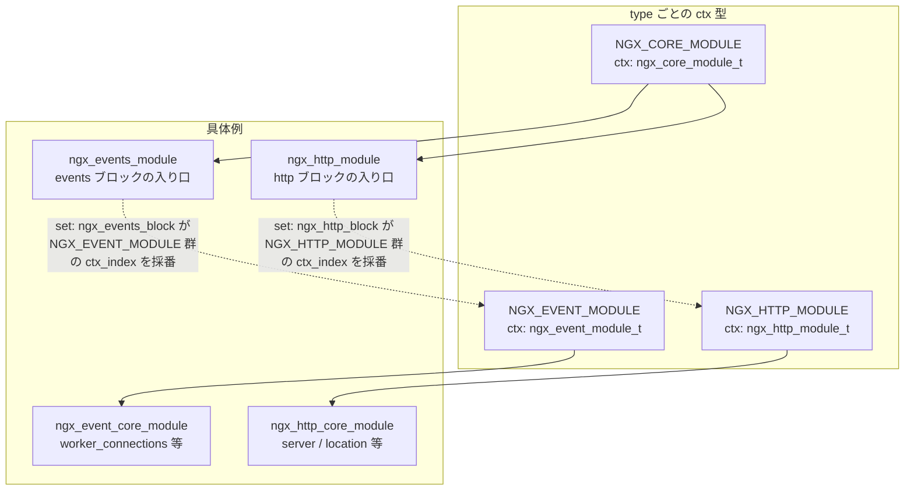
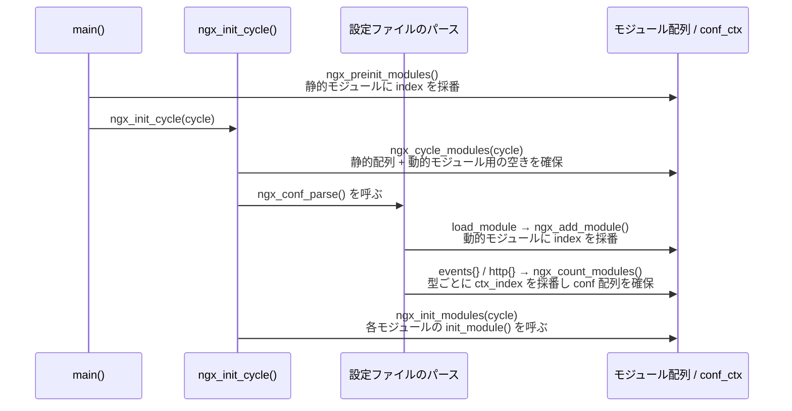

# 第2章 モジュールアーキテクチャ

> **本章で読むソース**
>
> - [`src/core/ngx_module.h`](https://github.com/nginx/nginx/blob/release-1.31.2/src/core/ngx_module.h)
> - [`src/core/ngx_module.c`](https://github.com/nginx/nginx/blob/release-1.31.2/src/core/ngx_module.c)
> - [`src/core/ngx_conf_file.h`](https://github.com/nginx/nginx/blob/release-1.31.2/src/core/ngx_conf_file.h)
> - [`src/core/ngx_conf_file.c`](https://github.com/nginx/nginx/blob/release-1.31.2/src/core/ngx_conf_file.c)
> - [`src/core/nginx.c`](https://github.com/nginx/nginx/blob/release-1.31.2/src/core/nginx.c)
> - [`src/core/ngx_cycle.c`](https://github.com/nginx/nginx/blob/release-1.31.2/src/core/ngx_cycle.c)
> - [`src/event/ngx_event.h`](https://github.com/nginx/nginx/blob/release-1.31.2/src/event/ngx_event.h)
> - [`src/event/ngx_event.c`](https://github.com/nginx/nginx/blob/release-1.31.2/src/event/ngx_event.c)
> - [`src/http/ngx_http_config.h`](https://github.com/nginx/nginx/blob/release-1.31.2/src/http/ngx_http_config.h)
> - [`src/http/ngx_http.c`](https://github.com/nginx/nginx/blob/release-1.31.2/src/http/ngx_http.c)
> - [`src/http/ngx_http_core_module.c`](https://github.com/nginx/nginx/blob/release-1.31.2/src/http/ngx_http_core_module.c)

## この章の狙い

nginx の機能はほとんどが「モジュール」という単位で実装されている。
HTTP リクエストの処理も、gzip 圧縮も、アクセスログの出力も、そして HTTP エンジン自体が起動時に組み込まれることも、すべて同じ登録機構を通る。

本章では、この統一的な拡張機構を支える `ngx_module_t` 構造体を読み、モジュールが持つ初期化フックと終了フックの意味を確認する。
次に、モジュールの型（`NGX_CORE_MODULE`、`NGX_EVENT_MODULE`、`NGX_HTTP_MODULE`）ごとに異なる `ctx` 構造体の役割を、`events` ブロックと `http` ブロックの実装を例に読む。
続いて、設定ファイルのディレクティブを宣言する `ngx_command_t` の構造と、パースした値を構造体フィールドへ書き込む仕組みを追う。
最後に、モジュールが起動時にどう並べられ初期化されるか、そして `load_module` による動的モジュールの読み込みがどうやって安全性を確保しているかを見る。

## 前提

- 第1章の[nginx とは何かとプロセスモデル](01-what-is-nginx-and-process-model.md)（master プロセスと worker プロセスの起動シーケンス）を理解していること。

## モジュールとライフサイクルフック

nginx のソースツリーには、HTTP リクエスト処理やイベント駆動 I/O だけでなく、HTTP エンジンそのものを起動する部分にも「モジュール」という同じ形式が使われている。
すべてのモジュールは `ngx_module_t` という単一の構造体で表現され、この構造体を経由してエンジンから呼び出される。

[`src/core/ngx_module.h` L227-L262](https://github.com/nginx/nginx/blob/release-1.31.2/src/core/ngx_module.h#L227-L262)

```c
struct ngx_module_s {
    ngx_uint_t            ctx_index;
    ngx_uint_t            index;

    char                 *name;

    ngx_uint_t            spare0;
    ngx_uint_t            spare1;

    ngx_uint_t            version;
    const char           *signature;

    void                 *ctx;
    ngx_command_t        *commands;
    ngx_uint_t            type;

    ngx_int_t           (*init_master)(ngx_log_t *log);

    ngx_int_t           (*init_module)(ngx_cycle_t *cycle);

    ngx_int_t           (*init_process)(ngx_cycle_t *cycle);
    ngx_int_t           (*init_thread)(ngx_cycle_t *cycle);
    void                (*exit_thread)(ngx_cycle_t *cycle);
    void                (*exit_process)(ngx_cycle_t *cycle);

    void                (*exit_master)(ngx_cycle_t *cycle);

    uintptr_t             spare_hook0;
    uintptr_t             spare_hook1;
    uintptr_t             spare_hook2;
    uintptr_t             spare_hook3;
    uintptr_t             spare_hook4;
    uintptr_t             spare_hook5;
    uintptr_t             spare_hook6;
    uintptr_t             spare_hook7;
};
```

`ctx_index` と `index` はどちらもモジュールを識別する番号だが、意味が異なる（両者の違いは次節で扱う）。
`ctx` はモジュールの型ごとに異なる構造体（**モジュールコンテキスト**）を指す汎用ポインタであり、`commands` はこのモジュールが宣言する設定ディレクティブの配列である。
`type` はモジュールの種別（`NGX_CORE_MODULE` など）を示す。

残りのフィールドはライフサイクルフックである。
`init_module` は cycle（起動時、および `HUP` シグナルによる設定リロード時に生成される実行コンテキスト）の初期化中に master 側で1回呼ばれる。
`init_process` は fork 後の worker プロセスごとに呼ばれ、接続の受け入れループに入る前のプロセス固有の初期化に使う。
`exit_process` は worker プロセスなどの子プロセスの終了処理で、`exit_master` は master プロセスの終了処理（`ngx_master_process_exit()`）の中で呼ばれる。
一方、`init_master` と `init_thread` と `exit_thread` は、grep で調べた限りこの版のソースツリーに呼び出し箇所がない。
つまり `ngx_module_s` のフックのうち実際に呼ばれるのは `init_module`、`init_process`、`exit_process`、`exit_master` の4つであり、残る3つは将来の拡張のために予約されたまま今は未使用のフックである。

モジュールの定義は、これらのフィールドを毎回手で埋めるのではなく `NGX_MODULE_V1` というマクロで共通部分をまとめている。

[`src/core/ngx_module.h` L220-L224](https://github.com/nginx/nginx/blob/release-1.31.2/src/core/ngx_module.h#L220-L224)

```c
#define NGX_MODULE_V1                                                         \
    NGX_MODULE_UNSET_INDEX, NGX_MODULE_UNSET_INDEX,                           \
    NULL, 0, 0, nginx_version, NGX_MODULE_SIGNATURE

#define NGX_MODULE_V1_PADDING  0, 0, 0, 0, 0, 0, 0, 0
```

`NGX_MODULE_V1` は `ctx_index` と `index` を、未確定であることを示す `NGX_MODULE_UNSET_INDEX` に初期化し、`name` を `NULL` に、`version` と `signature` をビルド時の値に設定する。
`index` と `ctx_index` の実際の採番は、モジュールの定義時ではなく、後述する登録処理の中で行われる。
`NGX_MODULE_V1_PADDING` は末尾の `spare_hook0`〜`spare_hook7` を 0 で埋めるための定型句であり、個々のモジュール定義（本章で扱う `ngx_events_module` や `ngx_http_core_module` など）はこの2つのマクロを組み合わせて宣言される。

## モジュール型ごとのコンテキスト構造体

`ngx_module_t.ctx` が指す先の構造体は、`type` フィールドの値によって解釈が変わる。
nginx はこの型を4種類に分けており、本書が扱うのはそのうち3種類である（mail と stream は対象外とする）。

| type の値 | 意味 | ctx の型 |
|---|---|---|
| `NGX_CORE_MODULE` | コア機構、および他の型のモジュール群を束ねる入り口 | `ngx_core_module_t` |
| `NGX_EVENT_MODULE` | イベント駆動 I/O の実装（epoll など） | `ngx_event_module_t` |
| `NGX_HTTP_MODULE` | HTTP リクエスト処理 | `ngx_http_module_t` |

### NGX_CORE_MODULE と ngx_core_module_t

もっとも単純なのが `NGX_CORE_MODULE` である。

[`src/core/ngx_module.h` L265-L269](https://github.com/nginx/nginx/blob/release-1.31.2/src/core/ngx_module.h#L265-L269)

```c
typedef struct {
    ngx_str_t             name;
    void               *(*create_conf)(ngx_cycle_t *cycle);
    char               *(*init_conf)(ngx_cycle_t *cycle, void *conf);
} ngx_core_module_t;
```

`create_conf` は設定構造体を確保するコールバック、`init_conf` は設定ファイルの解析が終わった後にデフォルト値を確定するコールバックである。
コアモジュールの典型例は、`events {}` ブロックそのものを表す `ngx_events_module` である。

[`src/event/ngx_event.c` L82-L115](https://github.com/nginx/nginx/blob/release-1.31.2/src/event/ngx_event.c#L82-L115)

```c
static ngx_command_t  ngx_events_commands[] = {

    { ngx_string("events"),
      NGX_MAIN_CONF|NGX_CONF_BLOCK|NGX_CONF_NOARGS,
      ngx_events_block,
      0,
      0,
      NULL },

      ngx_null_command
};


static ngx_core_module_t  ngx_events_module_ctx = {
    ngx_string("events"),
    NULL,
    ngx_event_init_conf
};


ngx_module_t  ngx_events_module = {
    NGX_MODULE_V1,
    &ngx_events_module_ctx,                /* module context */
    ngx_events_commands,                   /* module directives */
    NGX_CORE_MODULE,                       /* module type */
    NULL,                                  /* init master */
    NULL,                                  /* init module */
    NULL,                                  /* init process */
    NULL,                                  /* init thread */
    NULL,                                  /* exit thread */
    NULL,                                  /* exit process */
    NULL,                                  /* exit master */
    NGX_MODULE_V1_PADDING
};
```

`ngx_events_module` は `events` という1個のディレクティブだけを宣言し、その `set` コールバックに `ngx_events_block` を指定している。
`events { ... }` を書くと、この `ngx_events_block` が呼ばれ、`NGX_EVENT_MODULE` 型のモジュール群のための領域を用意してから、ブロック内側の再帰的なパースを始める（この配列確保の詳細は次節で扱う）。

HTTP エンジンの起動もまったく同じ形をしている。

[`src/http/ngx_http.c` L86-L119](https://github.com/nginx/nginx/blob/release-1.31.2/src/http/ngx_http.c#L86-L119)

```c
static ngx_command_t  ngx_http_commands[] = {

    { ngx_string("http"),
      NGX_MAIN_CONF|NGX_CONF_BLOCK|NGX_CONF_NOARGS,
      ngx_http_block,
      0,
      0,
      NULL },

      ngx_null_command
};


static ngx_core_module_t  ngx_http_module_ctx = {
    ngx_string("http"),
    NULL,
    NULL
};


ngx_module_t  ngx_http_module = {
    NGX_MODULE_V1,
    &ngx_http_module_ctx,                  /* module context */
    ngx_http_commands,                     /* module directives */
    NGX_CORE_MODULE,                       /* module type */
    NULL,                                  /* init master */
    NULL,                                  /* init module */
    NULL,                                  /* init process */
    NULL,                                  /* init thread */
    NULL,                                  /* exit thread */
    NULL,                                  /* exit process */
    NULL,                                  /* exit master */
    NGX_MODULE_V1_PADDING
};
```

`ngx_http_module` は `type` が `NGX_HTTP_MODULE` ではなく `NGX_CORE_MODULE` である。
つまり HTTP エンジンは、リクエストを処理する数十個の `NGX_HTTP_MODULE` とは別に、それらすべてを束ねて `http {}` ブロックの入り口になる1個のコアモジュールを持つ。
「HTTP エンジンもモジュールの一つである」というのは比喩ではなく、`ngx_module_t` の配列に他のコアモジュールと並んで登録されているという事実である。

### NGX_EVENT_MODULE と ngx_event_module_t

`events {}` ブロックの内側で解釈されるディレクティブは `NGX_EVENT_MODULE` 型のモジュールが宣言する。

[`src/event/ngx_event.h` L446-L453](https://github.com/nginx/nginx/blob/release-1.31.2/src/event/ngx_event.h#L446-L453)

```c
typedef struct {
    ngx_str_t              *name;

    void                 *(*create_conf)(ngx_cycle_t *cycle);
    char                 *(*init_conf)(ngx_cycle_t *cycle, void *conf);

    ngx_event_actions_t     actions;
} ngx_event_module_t;
```

`ngx_core_module_t` との違いは `actions` フィールドである。
`ngx_event_actions_t` は `add_event`、`del_event` といった epoll/kqueue/select などの I/O 多重化 API を関数ポインタとして束ねたテーブルであり、`use epoll;` のようなディレクティブでどの実装を選ぶかが決まる。
`worker_connections` や `multi_accept` など worker プロセス全体に関わるディレクティブを持つのは、`NGX_EVENT_MODULE` の中核である `ngx_event_core_module` である。

[`src/event/ngx_event.c` L137-L149](https://github.com/nginx/nginx/blob/release-1.31.2/src/event/ngx_event.c#L137-L149)

```c
    { ngx_string("multi_accept"),
      NGX_EVENT_CONF|NGX_CONF_FLAG,
      ngx_conf_set_flag_slot,
      0,
      offsetof(ngx_event_conf_t, multi_accept),
      NULL },

    { ngx_string("accept_mutex"),
      NGX_EVENT_CONF|NGX_CONF_FLAG,
      ngx_conf_set_flag_slot,
      0,
      offsetof(ngx_event_conf_t, accept_mutex),
      NULL },
```

[`src/event/ngx_event.c` L169-L191](https://github.com/nginx/nginx/blob/release-1.31.2/src/event/ngx_event.c#L169-L191)

```c
static ngx_event_module_t  ngx_event_core_module_ctx = {
    &event_core_name,
    ngx_event_core_create_conf,            /* create configuration */
    ngx_event_core_init_conf,              /* init configuration */

    { NULL, NULL, NULL, NULL, NULL, NULL, NULL, NULL, NULL, NULL }
};


ngx_module_t  ngx_event_core_module = {
    NGX_MODULE_V1,
    &ngx_event_core_module_ctx,            /* module context */
    ngx_event_core_commands,               /* module directives */
    NGX_EVENT_MODULE,                      /* module type */
    NULL,                                  /* init master */
    ngx_event_module_init,                 /* init module */
    ngx_event_process_init,                /* init process */
    NULL,                                  /* init thread */
    NULL,                                  /* exit thread */
    NULL,                                  /* exit process */
    NULL,                                  /* exit master */
    NGX_MODULE_V1_PADDING
};
```

`ngx_event_core_module` は `init_module` に `ngx_event_module_init` を、`init_process` に `ngx_event_process_init` を設定している。
前節で述べた「実際に呼ばれるフックは限られている」という事実は、この2つのフックがイベント駆動エンジンの初期化という中心的な役割を担っていることの裏返しでもある。

### NGX_HTTP_MODULE と ngx_http_module_t

`NGX_HTTP_MODULE` は3種類の中でもっとも複雑な `ctx` を持つ。

[`src/http/ngx_http_config.h` L17-L52](https://github.com/nginx/nginx/blob/release-1.31.2/src/http/ngx_http_config.h#L17-L52)

```c
typedef struct {
    void        **main_conf;
    void        **srv_conf;
    void        **loc_conf;
} ngx_http_conf_ctx_t;


typedef struct {
    ngx_int_t   (*preconfiguration)(ngx_conf_t *cf);
    ngx_int_t   (*postconfiguration)(ngx_conf_t *cf);

    void       *(*create_main_conf)(ngx_conf_t *cf);
    char       *(*init_main_conf)(ngx_conf_t *cf, void *conf);

    void       *(*create_srv_conf)(ngx_conf_t *cf);
    char       *(*merge_srv_conf)(ngx_conf_t *cf, void *prev, void *conf);

    void       *(*create_loc_conf)(ngx_conf_t *cf);
    char       *(*merge_loc_conf)(ngx_conf_t *cf, void *prev, void *conf);
} ngx_http_module_t;


#define NGX_HTTP_MODULE           0x50545448   /* "HTTP" */

#define NGX_HTTP_MAIN_CONF        0x02000000
#define NGX_HTTP_SRV_CONF         0x04000000
#define NGX_HTTP_LOC_CONF         0x08000000
#define NGX_HTTP_UPS_CONF         0x10000000
#define NGX_HTTP_SIF_CONF         0x20000000
#define NGX_HTTP_LIF_CONF         0x40000000
#define NGX_HTTP_LMT_CONF         0x80000000
```

HTTP モジュールは設定を `main`（`http {}` 直下）、`srv`（`server {}`）、`loc`（`location {}`）の3階層で持ち、`create_*_conf` で階層ごとの設定構造体を作り、`merge_srv_conf` と `merge_loc_conf` で上位階層の値を下位階層へ継承する。
この継承の具体的な挙動（`server` から `location` への値のマージや、`location` の木構造検索との関係）は第10章の[フェーズエンジンと location 検索](../part03-http/10-phase-engine-and-location.md)で扱う。
本章では、`NGX_HTTP_MAIN_CONF` から `NGX_HTTP_LMT_CONF` までの7個のビットが、ディレクティブがどの階層に書けるかを表すコンテキストフラグであることだけを押さえておく。

HTTP モジュールの中核である `ngx_http_core_module` の定義を見る。

[`src/http/ngx_http_core_module.c` L806-L834](https://github.com/nginx/nginx/blob/release-1.31.2/src/http/ngx_http_core_module.c#L806-L834)

```c
static ngx_http_module_t  ngx_http_core_module_ctx = {
    ngx_http_core_preconfiguration,        /* preconfiguration */
    ngx_http_core_postconfiguration,       /* postconfiguration */

    ngx_http_core_create_main_conf,        /* create main configuration */
    ngx_http_core_init_main_conf,          /* init main configuration */

    ngx_http_core_create_srv_conf,         /* create server configuration */
    ngx_http_core_merge_srv_conf,          /* merge server configuration */

    ngx_http_core_create_loc_conf,         /* create location configuration */
    ngx_http_core_merge_loc_conf           /* merge location configuration */
};


ngx_module_t  ngx_http_core_module = {
    NGX_MODULE_V1,
    &ngx_http_core_module_ctx,             /* module context */
    ngx_http_core_commands,                /* module directives */
    NGX_HTTP_MODULE,                       /* module type */
    NULL,                                  /* init master */
    NULL,                                  /* init module */
    NULL,                                  /* init process */
    NULL,                                  /* init thread */
    NULL,                                  /* exit thread */
    NULL,                                  /* exit process */
    NULL,                                  /* exit master */
    NGX_MODULE_V1_PADDING
};
```

`ngx_http_core_module` は `server`、`location`、`listen` など HTTP の骨格そのものを構成するディレクティブ群を持つ、`NGX_HTTP_MODULE` 型では最も基本的なモジュールである。
`gzip` や `proxy_pass` のような個々の機能は、それぞれ別の `NGX_HTTP_MODULE` として独立に登録され、`ngx_http_core_module` と同じ `ngx_http_module_t` の形に従う。

### 型階層の全体像

以下は、ここまでの3つの型と、それぞれの具体例の関係を図にしたものである。



`NGX_CORE_MODULE` に属する2つのモジュールが、それぞれ別の型のモジュール群への入り口になっている構造がわかる。

## ngx_command_t によるディレクティブ定義

モジュールが宣言する個々の設定ディレクティブは `ngx_command_t` で表される。

[`src/core/ngx_conf_file.h` L77-L84](https://github.com/nginx/nginx/blob/release-1.31.2/src/core/ngx_conf_file.h#L77-L84)

```c
struct ngx_command_s {
    ngx_str_t             name;
    ngx_uint_t            type;
    char               *(*set)(ngx_conf_t *cf, ngx_command_t *cmd, void *conf);
    ngx_uint_t            conf;
    ngx_uint_t            offset;
    void                 *post;
};
```

`name` はディレクティブ名、`set` は値を解釈して構造体へ書き込むコールバックである。
`type` はビットフィールドであり、引数の個数とディレクティブを書けるコンテキストを同時に表す。

[`src/core/ngx_conf_file.h` L16-L52](https://github.com/nginx/nginx/blob/release-1.31.2/src/core/ngx_conf_file.h#L16-L52)

```c
/*
 *        AAAA  number of arguments
 *      FF      command flags
 *    TT        command type, i.e. HTTP "location" or "server" command
 */

#define NGX_CONF_NOARGS      0x00000001
#define NGX_CONF_TAKE1       0x00000002
#define NGX_CONF_TAKE2       0x00000004
#define NGX_CONF_TAKE3       0x00000008
#define NGX_CONF_TAKE4       0x00000010
#define NGX_CONF_TAKE5       0x00000020
#define NGX_CONF_TAKE6       0x00000040
#define NGX_CONF_TAKE7       0x00000080

#define NGX_CONF_MAX_ARGS    8

#define NGX_CONF_TAKE12      (NGX_CONF_TAKE1|NGX_CONF_TAKE2)
#define NGX_CONF_TAKE13      (NGX_CONF_TAKE1|NGX_CONF_TAKE3)

#define NGX_CONF_TAKE23      (NGX_CONF_TAKE2|NGX_CONF_TAKE3)

#define NGX_CONF_TAKE123     (NGX_CONF_TAKE1|NGX_CONF_TAKE2|NGX_CONF_TAKE3)
#define NGX_CONF_TAKE1234    (NGX_CONF_TAKE1|NGX_CONF_TAKE2|NGX_CONF_TAKE3   \
                              |NGX_CONF_TAKE4)

#define NGX_CONF_ARGS_NUMBER 0x000000ff
#define NGX_CONF_BLOCK       0x00000100
#define NGX_CONF_FLAG        0x00000200
#define NGX_CONF_ANY         0x00000400
#define NGX_CONF_1MORE       0x00000800
#define NGX_CONF_2MORE       0x00001000

#define NGX_DIRECT_CONF      0x00010000

#define NGX_MAIN_CONF        0x01000000
#define NGX_ANY_CONF         0xFF000000
```

冒頭のコメントが示すとおり、`type` は下位ビットから「引数の個数」「`NGX_CONF_BLOCK` や `NGX_CONF_FLAG` などの修飾フラグ」「コンテキストを表す上位ビット」の3段に分かれる。
`NGX_MAIN_CONF` はここで定義されるコンテキストフラグの一つであり、`http`、`events`、`load_module` のようにファイルの最上位に書けるディレクティブに使う。
前節で見た `NGX_HTTP_MAIN_CONF` 等は、この上位ビット領域を HTTP サブシステムが独自に再定義したものである。

### conf フィールドと offset フィールド

`ngx_command_t` の `conf` と `offset` は、どちらも「値をどこに書き込むか」を指定するためのフィールドだが、役割が異なる。
`conf` は `main`、`srv`、`loc` のどの階層の設定配列を使うかを示し、`offset` はその配列から取り出した構造体の中の、対象フィールドの位置を示す。

[`src/http/ngx_http_core_module.c` L185-L190](https://github.com/nginx/nginx/blob/release-1.31.2/src/http/ngx_http_core_module.c#L185-L190)

```c
    { ngx_string("variables_hash_max_size"),
      NGX_HTTP_MAIN_CONF|NGX_CONF_TAKE1,
      ngx_conf_set_num_slot,
      NGX_HTTP_MAIN_CONF_OFFSET,
      offsetof(ngx_http_core_main_conf_t, variables_hash_max_size),
      NULL },
```

[`src/http/ngx_http_core_module.c` L220-L225](https://github.com/nginx/nginx/blob/release-1.31.2/src/http/ngx_http_core_module.c#L220-L225)

```c
    { ngx_string("connection_pool_size"),
      NGX_HTTP_MAIN_CONF|NGX_HTTP_SRV_CONF|NGX_CONF_TAKE1,
      ngx_conf_set_size_slot,
      NGX_HTTP_SRV_CONF_OFFSET,
      offsetof(ngx_http_core_srv_conf_t, connection_pool_size),
      &ngx_http_core_pool_size_p },
```

`variables_hash_max_size` は `NGX_HTTP_MAIN_CONF_OFFSET`（`ngx_http_conf_ctx_t.main_conf` を指す）を使い、`connection_pool_size` は `NGX_HTTP_MAIN_CONF|NGX_HTTP_SRV_CONF` の両方に書けるため `NGX_HTTP_SRV_CONF_OFFSET` を使う。
`offset` にはそれぞれ `offsetof(ngx_http_core_main_conf_t, ...)` と `offsetof(ngx_http_core_srv_conf_t, ...)` が入り、`set` コールバックにはどちらも汎用の `ngx_conf_set_num_slot` や `ngx_conf_set_size_slot` が使われている。
この「`conf` と `offset` の組み合わせを汎用の `set` 関数に渡す」という形が、ディレクティブの解釈をデータ駆動にする仕組みであり、最後の節で詳しく扱う。

## モジュールの登録と初期化順序

nginx はモジュールを起動時に3段階の関数で登録し、初期化する。

[`src/core/ngx_module.c` L25-L39](https://github.com/nginx/nginx/blob/release-1.31.2/src/core/ngx_module.c#L25-L39)

```c
ngx_int_t
ngx_preinit_modules(void)
{
    ngx_uint_t  i;

    for (i = 0; ngx_modules[i]; i++) {
        ngx_modules[i]->index = i;
        ngx_modules[i]->name = ngx_module_names[i];
    }

    ngx_modules_n = i;
    ngx_max_module = ngx_modules_n + NGX_MAX_DYNAMIC_MODULES;

    return NGX_OK;
}
```

`ngx_modules[]` と `ngx_module_names[]` は configure が生成する `objs/ngx_modules.c` に定義された静的配列であり、`configure` の `--add-module` や標準の組み込みモジュール一覧から機械的に作られる。

[`src/core/ngx_module.h` L282-L285](https://github.com/nginx/nginx/blob/release-1.31.2/src/core/ngx_module.h#L282-L285)

```c
extern ngx_module_t  *ngx_modules[];
extern ngx_uint_t     ngx_max_module;

extern char          *ngx_module_names[];
```

`ngx_preinit_modules` は、この静的配列を先頭から走査して各モジュールの `index` に配列中の位置をそのまま割り当てる。
`index` は `ngx_module_t` を一意に識別する番号であり、後述する `cycle->conf_ctx[index]` のようにコアモジュールの設定を格納する配列の添字として使われる。
`ngx_max_module` には静的モジュール数に `NGX_MAX_DYNAMIC_MODULES`（128個）を加えた値を入れ、後から動的モジュールが追加される余地を確保する。

[`src/core/nginx.c` L289-L291](https://github.com/nginx/nginx/blob/release-1.31.2/src/core/nginx.c#L289-L291)

```c
    if (ngx_preinit_modules() != NGX_OK) {
        return 1;
    }
```

`ngx_preinit_modules` は `main()` から起動直後に1回だけ呼ばれる。
その後、cycle（起動時、および設定リロード時に生成される実行コンテキスト）ごとに `ngx_cycle_modules` が呼ばれる。

[`src/core/ngx_module.c` L42-L62](https://github.com/nginx/nginx/blob/release-1.31.2/src/core/ngx_module.c#L42-L62)

```c
ngx_int_t
ngx_cycle_modules(ngx_cycle_t *cycle)
{
    /*
     * create a list of modules to be used for this cycle,
     * copy static modules to it
     */

    cycle->modules = ngx_pcalloc(cycle->pool, (ngx_max_module + 1)
                                              * sizeof(ngx_module_t *));
    if (cycle->modules == NULL) {
        return NGX_ERROR;
    }

    ngx_memcpy(cycle->modules, ngx_modules,
               ngx_modules_n * sizeof(ngx_module_t *));

    cycle->modules_n = ngx_modules_n;

    return NGX_OK;
}
```

`ngx_cycle_modules` は `ngx_max_module + 1` 個分の領域を確保してから、静的モジュールの分だけをコピーする。
`ngx_max_module` にはあらかじめ動的モジュール用の128スロットが含まれているため、この時点で確保する配列は静的モジュールの実数より大きい。
この余白が、設定ファイルの `load_module` ディレクティブが動的モジュールを追加できる根拠になる。

設定ファイルの解析が終わった後、`ngx_init_modules` が呼ばれる。

[`src/core/ngx_module.c` L65-L79](https://github.com/nginx/nginx/blob/release-1.31.2/src/core/ngx_module.c#L65-L79)

```c
ngx_int_t
ngx_init_modules(ngx_cycle_t *cycle)
{
    ngx_uint_t  i;

    for (i = 0; cycle->modules[i]; i++) {
        if (cycle->modules[i]->init_module) {
            if (cycle->modules[i]->init_module(cycle) != NGX_OK) {
                return NGX_ERROR;
            }
        }
    }

    return NGX_OK;
}
```

[`src/core/ngx_cycle.c` L227-L230](https://github.com/nginx/nginx/blob/release-1.31.2/src/core/ngx_cycle.c#L227-L230)

```c
    if (ngx_cycle_modules(cycle) != NGX_OK) {
        ngx_destroy_pool(pool);
        return NULL;
    }
```

[`src/core/ngx_cycle.c` L649-L652](https://github.com/nginx/nginx/blob/release-1.31.2/src/core/ngx_cycle.c#L649-L652)

```c
    if (ngx_init_modules(cycle) != NGX_OK) {
        /* fatal */
        exit(1);
    }
```

`ngx_cycle_modules` と `ngx_init_modules` はどちらも `ngx_init_cycle()` の中から呼ばれ、`ngx_init_modules` の方が設定ファイル全体のパースが終わった後段に位置する。
つまり `init_module` フックが呼ばれる時点では、`load_module` によって追加された動的モジュールも含めて、そのプロセスで使うモジュール一覧が確定している。

### index と ctx_index の違い

`ngx_module_t.index` はモジュール1個ずつに振られる通し番号であり、`cycle->modules[]` や `cycle->conf_ctx[]` のようにモジュール全体を対象にした配列の添字に使う。
それに対して `ctx_index` は、`NGX_EVENT_MODULE` や `NGX_HTTP_MODULE` のように同じ型のモジュールだけを集めたとき、その型の中で0から始まる連番になる。
`ngx_count_modules` はこの `ctx_index` を型ごとに採番する関数である。

[`src/core/ngx_module.c` L82-L124](https://github.com/nginx/nginx/blob/release-1.31.2/src/core/ngx_module.c#L82-L124)

```c
ngx_int_t
ngx_count_modules(ngx_cycle_t *cycle, ngx_uint_t type)
{
    ngx_uint_t     i, next, max;
    ngx_module_t  *module;

    next = 0;
    max = 0;

    /* count appropriate modules, set up their indices */

    for (i = 0; cycle->modules[i]; i++) {
        module = cycle->modules[i];

        if (module->type != type) {
            continue;
        }

        if (module->ctx_index != NGX_MODULE_UNSET_INDEX) {

            /* if ctx_index was assigned, preserve it */

            if (module->ctx_index > max) {
                max = module->ctx_index;
            }

            if (module->ctx_index == next) {
                next++;
            }

            continue;
        }

        /* search for some free index */

        module->ctx_index = ngx_module_ctx_index(cycle, type, next);

        if (module->ctx_index > max) {
            max = module->ctx_index;
        }

        next = module->ctx_index + 1;
    }
```

`ngx_count_modules(cycle, type)` は指定した型のモジュールだけを走査し、まだ `ctx_index` が決まっていないモジュールに空いている番号を振りながら、最大値+1（＝その型のモジュール数）を返す。
この返り値が、まさに `events {}` ブロックの解析で使われている。

[`src/event/ngx_event.c` L999-L1029](https://github.com/nginx/nginx/blob/release-1.31.2/src/event/ngx_event.c#L999-L1029)

```c
    /* count the number of the event modules and set up their indices */

    ngx_event_max_module = ngx_count_modules(cf->cycle, NGX_EVENT_MODULE);

    ctx = ngx_pcalloc(cf->pool, sizeof(void *));
    if (ctx == NULL) {
        return NGX_CONF_ERROR;
    }

    *ctx = ngx_pcalloc(cf->pool, ngx_event_max_module * sizeof(void *));
    if (*ctx == NULL) {
        return NGX_CONF_ERROR;
    }

    *(void **) conf = ctx;

    for (i = 0; cf->cycle->modules[i]; i++) {
        if (cf->cycle->modules[i]->type != NGX_EVENT_MODULE) {
            continue;
        }

        m = cf->cycle->modules[i]->ctx;

        if (m->create_conf) {
            (*ctx)[cf->cycle->modules[i]->ctx_index] =
                                                     m->create_conf(cf->cycle);
            if ((*ctx)[cf->cycle->modules[i]->ctx_index] == NULL) {
                return NGX_CONF_ERROR;
            }
        }
    }
```

`ngx_events_block`（`events` ディレクティブの `set` コールバック）は、`ngx_count_modules` が返した個数分の配列を確保し、`NGX_EVENT_MODULE` のモジュールを1個ずつ回って `ctx_index` の位置に `create_conf` の結果を格納する。
`ctx_index` が0からの連番であることによって、この配列は要素の隙間なく詰まった状態になる。
モジュール全体を通し番号で管理する `index` と、型ごとに詰めて数え直す `ctx_index` を分けているのは、型ごとの設定配列（`ngx_event_conf_t` の集合など）をハッシュテーブルではなく単純な配列として持てるようにするためである。

以下は、起動時のモジュール登録から初期化までの流れをまとめた図である。



## 動的モジュール

`--add-module` によるビルド時の組み込みとは別に、nginx は `load_module` ディレクティブで実行時に共有ライブラリ（`.so`）としてモジュールを追加できる。

[`src/core/nginx.c` L149-L154](https://github.com/nginx/nginx/blob/release-1.31.2/src/core/nginx.c#L149-L154)

```c
    { ngx_string("load_module"),
      NGX_MAIN_CONF|NGX_DIRECT_CONF|NGX_CONF_TAKE1,
      ngx_load_module,
      0,
      0,
      NULL },
```

`load_module` の `set` コールバックである `ngx_load_module` は、`.so` ファイルを `dlopen` し、その中の `ngx_modules` と `ngx_module_names` というシンボル（静的リンク時と同じ名前の配列）を `dlsym` で取り出す。

[`src/core/nginx.c` L1581-L1650](https://github.com/nginx/nginx/blob/release-1.31.2/src/core/nginx.c#L1581-L1650)

```c
static char *
ngx_load_module(ngx_conf_t *cf, ngx_command_t *cmd, void *conf)
{
#if (NGX_HAVE_DLOPEN)
    void                *handle;
    char               **names, **order;
    ngx_str_t           *value, file;
    ngx_uint_t           i;
    ngx_module_t        *module, **modules;
    ngx_pool_cleanup_t  *cln;

    if (cf->cycle->modules_used) {
        return "is specified too late";
    }

    value = cf->args->elts;

    file = value[1];

    if (ngx_conf_full_name(cf->cycle, &file, 0) != NGX_OK) {
        return NGX_CONF_ERROR;
    }

    // ... (中略。dlopen の失敗チェックとクリーンアップの登録) ...

    handle = ngx_dlopen(file.data);
    if (handle == NULL) {
        // ... (中略) ...
        return NGX_CONF_ERROR;
    }

    cln->handler = ngx_unload_module;
    cln->data = handle;

    modules = ngx_dlsym(handle, "ngx_modules");
    if (modules == NULL) {
        // ... (中略) ...
        return NGX_CONF_ERROR;
    }

    names = ngx_dlsym(handle, "ngx_module_names");
    if (names == NULL) {
        // ... (中略) ...
        return NGX_CONF_ERROR;
    }

    order = ngx_dlsym(handle, "ngx_module_order");

    for (i = 0; modules[i]; i++) {
        module = modules[i];
        module->name = names[i];

        if (ngx_add_module(cf, &file, module, order) != NGX_OK) {
            return NGX_CONF_ERROR;
        }

        ngx_log_debug2(NGX_LOG_DEBUG_CORE, cf->log, 0, "module: %s i:%ui",
                       module->name, module->index);
    }

    return NGX_CONF_OK;
```

`cf->cycle->modules_used` が真の場合は `load_module` を拒否する。
これはモジュール数がすでに確定した後の段階（後述する `ngx_count_modules` の呼び出し以降）を指しており、動的モジュールは `events {}` や `http {}` より前で読み込まなければならないことを意味する。
取り出した `ngx_modules[]` の各要素は、静的モジュールと同じ `ngx_module_t` であり、1個ずつ `ngx_add_module` に渡される。

[`src/core/ngx_module.c` L156-L205](https://github.com/nginx/nginx/blob/release-1.31.2/src/core/ngx_module.c#L156-L205)

```c
ngx_int_t
ngx_add_module(ngx_conf_t *cf, ngx_str_t *file, ngx_module_t *module,
    char **order)
{
    void               *rv;
    ngx_uint_t          i, m, before;
    ngx_core_module_t  *core_module;

    if (cf->cycle->modules_n >= ngx_max_module) {
        ngx_conf_log_error(NGX_LOG_EMERG, cf, 0,
                           "too many modules loaded");
        return NGX_ERROR;
    }

    if (module->version != nginx_version) {
        ngx_conf_log_error(NGX_LOG_EMERG, cf, 0,
                           "module \"%V\" version %ui instead of %ui",
                           file, module->version, (ngx_uint_t) nginx_version);
        return NGX_ERROR;
    }

    if (ngx_strcmp(module->signature, NGX_MODULE_SIGNATURE) != 0) {
        ngx_conf_log_error(NGX_LOG_EMERG, cf, 0,
                           "module \"%V\" is not binary compatible",
                           file);
        return NGX_ERROR;
    }

    for (m = 0; cf->cycle->modules[m]; m++) {
        if (ngx_strcmp(cf->cycle->modules[m]->name, module->name) == 0) {
            ngx_conf_log_error(NGX_LOG_EMERG, cf, 0,
                               "module \"%s\" is already loaded",
                               module->name);
            return NGX_ERROR;
        }
    }

    /*
     * if the module wasn't previously loaded, assign an index
     */

    if (module->index == NGX_MODULE_UNSET_INDEX) {
        module->index = ngx_module_index(cf->cycle);

        if (module->index >= ngx_max_module) {
            ngx_conf_log_error(NGX_LOG_EMERG, cf, 0,
                               "too many modules loaded");
            return NGX_ERROR;
        }
    }
```

`ngx_add_module` はまず `module->version` が実行中の `nginx_version` と一致するかを確認し、次に `module->signature` を実行中のバイナリの `NGX_MODULE_SIGNATURE` と文字列比較する。

[`src/core/ngx_module.h` L21-L24](https://github.com/nginx/nginx/blob/release-1.31.2/src/core/ngx_module.h#L21-L24)

```c
#define NGX_MODULE_SIGNATURE_0                                                \
    ngx_value(NGX_PTR_SIZE) ","                                               \
    ngx_value(NGX_SIG_ATOMIC_T_SIZE) ","                                      \
    ngx_value(NGX_TIME_T_SIZE) ","
```

[`src/core/ngx_module.h` L205-L217](https://github.com/nginx/nginx/blob/release-1.31.2/src/core/ngx_module.h#L205-L217)

```c
#define NGX_MODULE_SIGNATURE                                                  \
    NGX_MODULE_SIGNATURE_0 NGX_MODULE_SIGNATURE_1 NGX_MODULE_SIGNATURE_2      \
    NGX_MODULE_SIGNATURE_3 NGX_MODULE_SIGNATURE_4 NGX_MODULE_SIGNATURE_5      \
    NGX_MODULE_SIGNATURE_6 NGX_MODULE_SIGNATURE_7 NGX_MODULE_SIGNATURE_8      \
    NGX_MODULE_SIGNATURE_9 NGX_MODULE_SIGNATURE_10 NGX_MODULE_SIGNATURE_11    \
    NGX_MODULE_SIGNATURE_12 NGX_MODULE_SIGNATURE_13 NGX_MODULE_SIGNATURE_14   \
    NGX_MODULE_SIGNATURE_15 NGX_MODULE_SIGNATURE_16 NGX_MODULE_SIGNATURE_17   \
    NGX_MODULE_SIGNATURE_18 NGX_MODULE_SIGNATURE_19 NGX_MODULE_SIGNATURE_20   \
    NGX_MODULE_SIGNATURE_21 NGX_MODULE_SIGNATURE_22 NGX_MODULE_SIGNATURE_23   \
    NGX_MODULE_SIGNATURE_24 NGX_MODULE_SIGNATURE_25 NGX_MODULE_SIGNATURE_26   \
    NGX_MODULE_SIGNATURE_27 NGX_MODULE_SIGNATURE_28 NGX_MODULE_SIGNATURE_29   \
    NGX_MODULE_SIGNATURE_30 NGX_MODULE_SIGNATURE_31 NGX_MODULE_SIGNATURE_32   \
    NGX_MODULE_SIGNATURE_33 NGX_MODULE_SIGNATURE_34
```

`NGX_MODULE_SIGNATURE` は `NGX_MODULE_SIGNATURE_0` から `_34` までを連結した文字列であり、ポインタサイズや `sig_atomic_t` のサイズ、`NGX_HAVE_KQUEUE` や `NGX_HAVE_EPOLL` といったビルド時の feature フラグを1個ずつ `"0"` か `"1"` に展開して並べたものである（`ngx_module.h` の全体を通してこれらのマクロが定義されている）。
この文字列は、モジュールをビルドしたときの構成と、それを読み込む nginx 本体の構成が一致しているかどうかを表す指紋になる。
`load_module` で読み込む `.so` は、実行中の nginx バイナリと同じバージョンで、かつ同じ `configure` オプションでビルドされていなければ `ngx_add_module` の時点で拒否される。

バージョンと署名の検証を通過すると、同名モジュールの重複を確認したうえで `module->index` を採番し、`cycle->modules[]` へ挿入する。

[`src/core/ngx_module.c` L251-L276](https://github.com/nginx/nginx/blob/release-1.31.2/src/core/ngx_module.c#L251-L276)

```c
    cf->cycle->modules[before] = module;
    cf->cycle->modules_n++;

    if (module->type == NGX_CORE_MODULE) {

        /*
         * we are smart enough to initialize core modules;
         * other modules are expected to be loaded before
         * initialization - e.g., http modules must be loaded
         * before http{} block
         */

        core_module = module->ctx;

        if (core_module->create_conf) {
            rv = core_module->create_conf(cf->cycle);
            if (rv == NULL) {
                return NGX_ERROR;
            }

            cf->cycle->conf_ctx[module->index] = rv;
        }
    }

    return NGX_OK;
}
```

`NGX_CORE_MODULE` の場合はこの場で `create_conf` を呼び、`cycle->conf_ctx[module->index]` に結果を格納する。
コメントにあるとおり、コアモジュールはロード直後にその場で初期化できるが、`NGX_HTTP_MODULE` のような他の型は `http {}` ブロックの解析（前述の `ngx_count_modules` による `ctx_index` 採番）より前にロードされている必要がある。
`ngx_cycle_modules` が確保する配列に `NGX_MAX_DYNAMIC_MODULES`（128個）分の余白があったのは、まさにこの `ngx_add_module` による挿入を、配列の再確保なしに受け止めるためである。

## 高速化の工夫：conf offset と汎用 set 関数によるデータ駆動のディレクティブ解釈

nginx には数百個のディレクティブがあるが、それぞれの `set` コールバックを個別に書いているわけではない。
多くのディレクティブは `ngx_conf_set_num_slot` や `ngx_conf_set_flag_slot` のような数種類の汎用関数を共有している。

[`src/core/ngx_conf_file.c` L1166-L1194](https://github.com/nginx/nginx/blob/release-1.31.2/src/core/ngx_conf_file.c#L1166-L1194)

```c
char *
ngx_conf_set_num_slot(ngx_conf_t *cf, ngx_command_t *cmd, void *conf)
{
    char  *p = conf;

    ngx_int_t        *np;
    ngx_str_t        *value;
    ngx_conf_post_t  *post;


    np = (ngx_int_t *) (p + cmd->offset);

    if (*np != NGX_CONF_UNSET) {
        return "is duplicate";
    }

    value = cf->args->elts;
    *np = ngx_atoi(value[1].data, value[1].len);
    if (*np == NGX_ERROR) {
        return "invalid number";
    }

    if (cmd->post) {
        post = cmd->post;
        return post->post_handler(cf, post, np);
    }

    return NGX_CONF_OK;
}
```

`ngx_conf_set_num_slot` は、渡された `conf`（構造体の先頭アドレス）に `cmd->offset` を足すだけで書き込み先のフィールドを求める。
`variables_hash_max_size` を解釈するときも `client_header_timeout` を解釈するときも、呼ばれる関数は同じ `ngx_conf_set_num_slot`（や `ngx_conf_set_msec_slot`）であり、違うのは `ngx_command_t` に埋め込まれた `offset` の値だけである。

この `conf` の受け渡しは `ngx_conf_handler` が行う。

[`src/core/ngx_conf_file.c` L445-L463](https://github.com/nginx/nginx/blob/release-1.31.2/src/core/ngx_conf_file.c#L445-L463)

```c
            /* set up the directive's configuration context */

            conf = NULL;

            if (cmd->type & NGX_DIRECT_CONF) {
                conf = ((void **) cf->ctx)[cf->cycle->modules[i]->index];

            } else if (cmd->type & NGX_MAIN_CONF) {
                conf = &(((void **) cf->ctx)[cf->cycle->modules[i]->index]);

            } else if (cf->ctx) {
                confp = *(void **) ((char *) cf->ctx + cmd->conf);

                if (confp) {
                    conf = confp[cf->cycle->modules[i]->ctx_index];
                }
            }

            rv = cmd->set(cf, cmd, conf);
```

`cf->ctx + cmd->conf` で `main_conf` や `srv_conf` のような型ごとの配列を取り出し、その配列を `cf->cycle->modules[i]->ctx_index` で添字アクセスして、ようやくモジュール1個分の設定構造体（`conf`）を得る。
つまりディレクティブ1個の解釈には「`cmd->conf` でどの階層の配列を使うか」「`ctx_index` でその配列のどの要素か」「`cmd->offset` で要素内のどのフィールドか」という3段の間接参照があり、これらがすべて `ngx_command_t` の数値フィールドとして表現されている。

この設計の効果は、`ngx_conf_handler` や `ngx_conf_set_num_slot` のようなパーサ側のコードを、ディレクティブの種類ごとに分岐させたり複製したりする必要がないことである。
新しいディレクティブを追加するモジュール開発者は、対応する構造体にフィールドを1個増やし、`ngx_command_t` の配列に `offsetof()` を使った1行を足すだけでよく、値の読み取り、型変換、重複チェックといった定型処理を毎回書き直さずに済む。
`ngx_conf_file.c` には `ngx_conf_set_str_slot`、`ngx_conf_set_size_slot`、`ngx_conf_set_bitmask_slot` など十数種類の汎用 `set` 関数があり、ほとんどのディレクティブはこれらの組み合わせだけで表現できる。

## まとめ

nginx の機能単位はほぼすべて `ngx_module_t` として表現され、HTTP エンジンや `events {}` ブロックの起動さえも `NGX_CORE_MODULE` という同じ形で登録される。
モジュールは `NGX_CORE_MODULE`、`NGX_EVENT_MODULE`、`NGX_HTTP_MODULE` の型を持ち、型ごとに異なる `ctx` 構造体（`ngx_core_module_t`、`ngx_event_module_t`、`ngx_http_module_t`）を通じて設定の生成コールバックと継承コールバックを提供する。
モジュールが宣言するディレクティブは `ngx_command_t` で表され、`type` のビットフラグが引数の個数とコンテキストを、`set` と `conf` と `offset` の組が値の書き込み先を決める。
起動時は `ngx_preinit_modules` → `ngx_cycle_modules` → `ngx_init_modules` の順で静的モジュールが登録され初期化され、`load_module` はバージョンとビルド構成のシグネチャを検証したうえで `ngx_add_module` によって同じ配列に動的モジュールを追加する。
`conf` と `offset` を使った汎用 `set` 関数は、数百個のディレクティブの解釈をパーサ側の分岐なしに実現する、データ駆動な設計である。

## 関連する章

- [第1章 nginx とは何かとプロセスモデル](01-what-is-nginx-and-process-model.md)：モジュールの初期化フックが master プロセスと worker プロセスのどの段階で呼ばれるかの前提。
- [第5章 設定ファイルのパース](../part01-core/05-configuration-parsing.md)：`ngx_conf_parse` によるトークナイズとブロックの再帰処理そのものの詳細。
- [第10章 フェーズエンジンと location 検索](../part03-http/10-phase-engine-and-location.md)：`ngx_http_module_t` の `merge_loc_conf` が `location` の木構造とどう関わるかの詳細。
